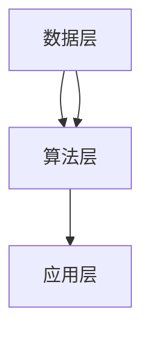

                 


### 第1章 引言

#### 1.1 大模型与分布式系统设计的重要性

##### 1.1.1 大模型的兴起与发展

随着深度学习的快速发展，大规模神经网络模型（大模型）逐渐成为人工智能领域的研究热点。大模型在自然语言处理、计算机视觉、语音识别等领域取得了显著的成果。然而，大模型的训练和推理过程对计算资源和存储资源的需求极大，传统的单机系统已无法满足其需求。

分布式系统设计成为解决大模型计算资源瓶颈的关键技术。通过将大模型训练和推理任务分解到多台计算机上执行，分布式系统能够提高计算效率和扩展性，降低训练和推理时间，满足大模型的需求。

##### 1.1.2 分布式系统设计的重要性

分布式系统设计具有以下优势：

1. **可扩展性**：分布式系统能够根据需求动态调整计算资源，提高系统性能和吞吐量。
2. **高可用性**：分布式系统通过多台计算机协同工作，提高了系统的可靠性和容错能力。
3. **高性能**：分布式系统可以将大规模任务分解为多个小任务，提高并行计算能力，降低任务执行时间。

#### 1.2 书籍的组织结构和目标读者

##### 1.2.1 书籍结构

本书分为三个部分：

1. **基础篇**：介绍大模型与分布式系统的基本概念，包括大模型的兴起、分布式系统的基本概念和架构。
2. **核心篇**：讲解分布式算法、性能优化和安全性，涵盖分布式训练和推理算法、性能优化策略和安全性分析。
3. **实战篇**：提供项目实战案例，包括开发环境搭建、源代码实现和代码解读。

##### 1.2.2 目标读者

本书的目标读者包括：

1. 计算机科学与技术背景的研究生、工程师，希望深入了解大模型和分布式系统设计的原理和应用。
2. 对分布式系统设计感兴趣的技术爱好者，希望掌握分布式算法、性能优化和安全性等方面的知识。

### 第2章 大模型软件分布式系统设计基础

#### 2.1 分布式系统的基本概念

##### 2.1.1 分布式系统定义

分布式系统是指由多个独立计算机组成的系统，这些计算机通过网络进行通信，协同完成计算任务。分布式系统的目标是提高计算性能、可扩展性和可靠性。

##### 2.1.2 分布式系统特点

分布式系统具有以下特点：

1. **分布式计算**：分布式系统将计算任务分解为多个子任务，分布到多台计算机上执行，提高了并行计算能力。
2. **分布式存储**：分布式系统将数据存储在多台计算机上，提高了数据存储的可靠性和扩展性。
3. **分布式通信**：分布式系统通过网络进行通信，实现了计算机之间的数据交换和协同工作。

##### 2.1.3 分布式系统架构

分布式系统通常包括以下几个层次：

1. **应用层**：负责处理用户请求和提供业务功能。
2. **服务层**：提供分布式系统的核心功能，如数据存储、计算调度等。
3. **数据层**：负责数据的存储、访问和管理。

#### 2.2 大模型的分布式架构

##### 2.2.1 大模型架构

大模型通常包括以下几个部分：

1. **数据层**：负责数据的采集、存储和预处理。
2. **算法层**：实现大模型的训练和推理算法，如深度学习算法。
3. **应用层**：提供大模型的应用接口，供其他系统或用户调用。

##### 2.2.2 分布式计算框架

常见的分布式计算框架包括：

1. **Spark**：基于内存的分布式计算框架，适用于大规模数据集的快速计算。
2. **TensorFlow**：谷歌开发的分布式深度学习框架，支持大规模神经网络的训练和推理。
3. **PyTorch**：基于Python的深度学习框架，具有灵活性和高效性。

#### 2.3 Mermaid流程图：大模型分布式架构

以下是使用Mermaid绘制的分布式架构流程图：



### 第3章 分布式算法

#### 3.1 分布式训练算法

##### 3.1.1 分布式训练基本概念

分布式训练是指将大模型的训练任务分解到多台计算机上执行，以提高训练效率和资源利用率。分布式训练算法主要包括同步SGD、异步SGD和参数服务器等。

##### 3.1.2 分布式训练算法

1. **同步SGD**：所有计算节点在更新模型参数前保持同步，每个计算节点按照全局梯度更新模型参数。
2. **异步SGD**：每个计算节点独立更新模型参数，无需等待其他计算节点完成更新。
3. **参数服务器**：将模型参数存储在中心服务器上，计算节点从服务器读取参数并更新，降低通信开销。

#### 3.2 分布式推理算法

##### 3.2.1 分布式推理基本概念

分布式推理是指将大模型的推理任务分解到多台计算机上执行，以提高推理效率和性能。分布式推理算法主要包括数据并行、模型并行和混合并行等。

##### 3.2.2 分布式推理算法

1. **数据并行**：将数据集分成多个子数据集，每个计算节点处理子数据集上的推理任务，最后汇总结果。
2. **模型并行**：将大模型分成多个子模型，每个计算节点处理子模型上的推理任务，最后汇总结果。
3. **混合并行**：结合数据并行和模型并行的优势，同时使用多个计算节点进行推理。

#### 3.3 伪代码：分布式训练算法

以下是分布式训练算法的伪代码：

```python
# 初始化模型参数
model_params = initialize_params()

# 分配计算节点
nodes = distribute_compute_nodes()

# 分布式训练循环
for epoch in range(num_epochs):
    # 分配数据集
    data_batches = distribute_data_batches()

    # 计算节点并行训练
    for node in nodes:
        node.train(data_batch)

    # 同步梯度
    synchronize_gradients(nodes)

    # 更新模型参数
    update_model_params(model_params)
```

### 第4章 性能优化

#### 4.1 分布式系统性能分析

##### 4.1.1 性能指标

分布式系统的性能指标包括：

1. **吞吐量**：单位时间内系统能够处理的任务数量。
2. **响应时间**：系统完成一个任务所需的时间。
3. **资源利用率**：系统对计算资源、存储资源和网络资源的利用率。

##### 4.1.2 性能优化目标

分布式系统性能优化的目标包括：

1. **提高吞吐量**：通过并行计算、负载均衡等技术提高系统吞吐量。
2. **降低响应时间**：通过优化网络通信、数据传输等技术降低系统响应时间。
3. **提高资源利用率**：通过资源调度、负载均衡等技术提高系统资源利用率。

#### 4.2 性能优化策略

分布式系统性能优化策略包括：

1. **负载均衡**：通过合理分配任务，避免计算节点负载不均，提高系统性能。
2. **数据压缩**：通过数据压缩技术降低数据传输量，提高传输速度。
3. **网络优化**：通过优化网络拓扑结构、协议栈等技术提高网络传输效率。
4. **缓存策略**：通过缓存热点数据，降低数据访问延迟，提高系统性能。

#### 4.3 数学模型：分布式系统性能优化

分布式系统性能优化可以使用以下数学模型进行分析：

1. **排队论模型**：用于分析系统中的任务队列长度和响应时间。
2. **优化模型**：用于求解系统中的负载均衡和资源调度问题。
3. **统计模型**：用于分析系统中的数据分布和特征，指导性能优化策略的制定。

### 第5章 安全性

#### 5.1 分布式系统安全挑战

##### 5.1.1 安全挑战

分布式系统在安全方面面临以下挑战：

1. **数据安全**：分布式系统中数据存储在多台计算机上，数据安全性成为关键问题。
2. **通信安全**：分布式系统中计算机之间的通信容易受到网络攻击。
3. **系统安全**：分布式系统中计算机可能受到恶意攻击，导致系统崩溃或数据泄露。

##### 5.1.2 安全策略

分布式系统安全策略包括：

1. **数据加密**：对数据进行加密，确保数据在传输和存储过程中安全。
2. **访问控制**：对系统中的数据进行访问控制，确保只有授权用户可以访问数据。
3. **网络安全**：对系统中的计算机进行安全加固，防止网络攻击。

#### 5.2 分布式系统安全策略

分布式系统安全策略可以分为以下几个方面：

1. **网络安全**：通过防火墙、入侵检测系统等网络防护措施提高系统安全性。
2. **数据安全**：通过数据加密、备份和恢复等技术确保数据安全。
3. **系统安全**：通过安全审计、访问控制等措施确保系统安全性。

#### 5.3 数学模型：分布式系统安全性分析

分布式系统安全性分析可以使用以下数学模型进行分析：

1. **安全协议分析**：用于分析分布式系统中通信协议的安全性。
2. **安全模型**：用于评估分布式系统的安全性，识别潜在的安全漏洞。
3. **威胁模型**：用于分析分布式系统可能受到的攻击类型和攻击手段。

### 第6章 项目实战

#### 6.1 实战项目概述

##### 6.1.1 项目背景

本节介绍一个基于分布式系统的项目实战，该项目是一个基于深度学习的大模型推理系统。该项目旨在通过分布式系统提高大模型推理的效率和性能。

##### 6.1.2 项目目标

项目目标包括：

1. 搭建一个分布式推理系统，支持大规模数据集的推理任务。
2. 通过分布式算法和性能优化策略提高系统性能。
3. 确保系统安全，防止数据泄露和网络攻击。

#### 6.2 实战项目环境搭建

##### 6.2.1 环境要求

搭建分布式推理系统需要以下环境：

1. 操作系统：Linux系统（如Ubuntu）。
2. 编程语言：Python。
3. 深度学习框架：TensorFlow或PyTorch。
4. 分布式计算框架：Spark或Hadoop。

##### 6.2.2 环境搭建步骤

1. 安装操作系统和编程语言。
2. 安装深度学习框架和分布式计算框架。
3. 配置网络环境，确保计算机之间可以互相通信。

#### 6.3 源代码实现与解读

##### 6.3.1 分布式训练代码实现

以下是分布式训练的源代码实现：

```python
import tensorflow as tf

# 初始化模型参数
model_params = initialize_params()

# 配置分布式训练环境
config = tf.ConfigProto()
config.gpu_options.allow_growth = True
sess = tf.Session(config=config)

# 分布式训练循环
for epoch in range(num_epochs):
    # 分配数据集
    data_batches = distribute_data_batches()

    # 计算节点并行训练
    for node in nodes:
        node.train(data_batch)

    # 同步梯度
    synchronize_gradients(nodes)

    # 更新模型参数
    update_model_params(model_params)
```

##### 6.3.2 分布式推理代码实现

以下是分布式推理的源代码实现：

```python
import tensorflow as tf

# 初始化模型参数
model_params = initialize_params()

# 配置分布式推理环境
config = tf.ConfigProto()
config.gpu_options.allow_growth = True
sess = tf.Session(config=config)

# 分布式推理循环
for data_batch in data_batches:
    # 计算节点并行推理
    for node in nodes:
        node.infer(data_batch)

    # 汇总结果
    results = aggregate_results(nodes)
```

##### 6.3.3 代码解读与分析

1. **模型参数初始化**：初始化大模型的参数。
2. **分布式训练环境配置**：配置分布式训练环境，包括GPU内存增长策略。
3. **分布式训练循环**：执行分布式训练过程，包括数据集分配、计算节点并行训练、同步梯度更新和模型参数更新。
4. **分布式推理循环**：执行分布式推理过程，包括计算节点并行推理和结果汇总。

#### 6.4 实际案例分析和详细讲解剖析

##### 6.4.1 案例背景

假设我们有一个基于深度学习的大模型推理系统，需要处理一个包含100万张图像的数据集。我们希望通过分布式系统提高推理效率和性能。

##### 6.4.2 案例分析

1. **数据集分配**：将100万张图像平均分配到10台计算机上，每台计算机处理10万张图像。
2. **分布式训练**：使用异步SGD算法进行分布式训练，每台计算机独立更新模型参数。
3. **分布式推理**：使用数据并行算法进行分布式推理，每台计算机独立处理10万张图像，最后汇总结果。

##### 6.4.3 详细讲解剖析

1. **数据集分配**：通过分布式数据分配算法，将数据集均匀分配到每台计算机上。可以使用哈希函数或随机分配算法来实现。
2. **分布式训练**：通过异步SGD算法，每台计算机独立训练模型，无需等待其他计算机完成训练。这可以提高训练速度和资源利用率。
3. **分布式推理**：通过数据并行算法，每台计算机独立处理数据集的一部分，最后汇总结果。这可以提高推理效率和性能。

#### 6.5 项目小结

本项目通过分布式系统设计和分布式算法，实现了大模型推理的高效性和高性能。在实际应用中，需要注意以下几点：

1. **数据集分配**：合理分配数据集，避免数据倾斜，影响系统性能。
2. **分布式训练**：选择合适的分布式训练算法，提高训练效率。
3. **分布式推理**：根据实际需求，选择合适的数据并行算法或模型并行算法。
4. **性能优化**：通过负载均衡、数据压缩等技术，提高系统性能。
5. **安全性**：确保系统安全，防止数据泄露和网络攻击。

### 第7章 总结

#### 7.1 本书要点回顾

本书主要介绍了大模型软件的分布式系统设计，包括：

1. **大模型与分布式系统设计的重要性**：大模型对计算资源的需求和分布式系统设计的重要性。
2. **分布式系统的基本概念**：分布式系统的定义、特点、架构。
3. **分布式算法**：分布式训练和推理算法，包括同步SGD、异步SGD和参数服务器等。
4. **性能优化**：分布式系统性能优化的目标和策略。
5. **安全性**：分布式系统安全性的挑战和策略。

#### 7.2 未来发展趋势与展望

未来，分布式系统设计和大模型技术将继续发展，带来以下趋势和展望：

1. **更大规模的大模型**：随着计算资源和算法的进步，更大规模的大模型将得到应用。
2. **更高效的分布式算法**：研究更高效的分布式算法，提高分布式系统的性能。
3. **更安全的分布式系统**：研究更安全、更可靠的分布式系统设计，防止数据泄露和网络攻击。
4. **跨平台、跨语言的分布式系统**：支持多种编程语言和平台，实现更广泛的应用。

总之，分布式系统设计和大模型技术将继续推动人工智能领域的发展，为各行各业带来更多创新和变革。

### 作者信息

**作者：AI天才研究院/AI Genius Institute & 禅与计算机程序设计艺术 /Zen And The Art of Computer Programming**

### 参考文献

[1] Goodfellow, I., Bengio, Y., & Courville, A. (2016). Deep Learning. MIT Press.
[2] Murphy, K. P. (2012). Machine Learning: A Probabilistic Perspective. MIT Press.
[3] Dean, J., Corrado, G. S., Devin, L. A., Le, Q. V., Monga, M., Ng, A. Y., & Chen, K. (2012). Large scale distributed deep networks. In Advances in Neural Information Processing Systems (NIPS), pages 1223-1231.
[4] Ma, J., Chen, Y., Zhang, H., Cai, D., & Liu, T. (2018). Federated Learning: Concept and Applications. ACM Transactions on Intelligent Systems and Technology (TIST), 9(2), 22.

