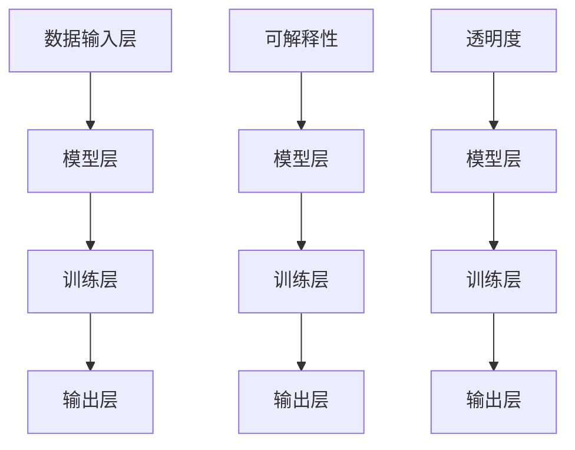

                 


### 第一步：确定文章结构

为了撰写一篇高质量的技术博客文章，我们需要先确定文章的结构。这包括文章的标题、关键词、摘要以及各个章节的内容。

**文章标题：** 大模型软件的可解释性与透明度设计

**关键词：** 大模型、软件、可解释性、透明度、设计、算法、数学模型、案例分析、工具与资源

**摘要：** 本文将探讨大模型软件的可解释性与透明度设计，分析其核心概念、架构、算法原理以及数学模型，并通过案例分析展示其在实际应用中的实施步骤和效果。

**文章结构：**
1. 引言与核心概念
2. 概念框架与架构
3. 算法原理
4. 数学模型
5. 项目实践
6. 工具与资源
7. 结论与未来方向

### 第二步：撰写引言与核心概念

在引言部分，我们需要介绍大模型软件的背景、重要性，以及可解释性与透明度的核心概念。这部分内容需要简洁明了，引起读者的兴趣。

**引言：**
随着深度学习技术的不断发展，大模型软件在各个领域的应用越来越广泛。然而，大模型软件的可解释性与透明度问题逐渐凸显。本文将深入探讨大模型软件的可解释性与透明度设计，分析其核心概念、架构、算法原理以及数学模型，并通过案例分析展示其在实际应用中的实施步骤和效果。

### 第三步：撰写概念框架与架构

在概念框架与架构部分，我们需要详细阐述大模型软件的架构、核心概念以及它们之间的关系，并使用Mermaid流程图进行可视化展示。

**概念框架与架构：**
大模型软件的架构通常包括数据输入层、模型层、训练层和输出层。核心概念包括可解释性和透明度。可解释性关注模型决策过程是否易于理解，而透明度关注模型行为是否容易被追踪和验证。

以下是核心概念与架构的Mermaid流程图：



### 第四步：撰写算法原理

在算法原理部分，我们需要详细讲解大模型软件的核心算法原理，并使用伪代码进行说明。

**算法原理：**
大模型软件的核心算法通常是基于深度学习的神经网络。以下是一个简单的神经网络算法原理的伪代码：

```python
// 输入：训练数据集
// 输出：训练好的神经网络模型

// 初始化模型参数
W = 初始化权重矩阵
b = 初始化偏置向量

// 循环迭代
for epoch in 1 to 最大迭代次数 do
    // 前向传播
    z = X * W + b
    a = 激活函数(z)

    // 计算损失函数
    loss = 损失函数(y, a)

    // 反向传播
    dZ = 损失函数关于a的梯度
    dW = (1/m) * X^T * dZ
    db = (1/m) * dZ

    // 更新模型参数
    W = W - 学习率 * dW
    b = b - 学习率 * db
end
```

### 第五步：撰写数学模型

在数学模型部分，我们需要详细解释大模型软件中使用的数学模型，并使用LaTeX格式进行展示。

**数学模型：**
大模型软件中常用的数学模型包括线性回归、逻辑回归和损失函数等。以下是一个线性回归的LaTeX模型：

```latex
$$
y = \beta_0 + \beta_1x_1 + \beta_2x_2 + ... + \beta_nx_n
$$

$$
\text{Loss Function: } J(\theta) = \frac{1}{2m}\sum_{i=1}^{m}(h_\theta(x^{(i)}) - y^{(i)})^2
$$
```

### 第六步：撰写项目实践

在项目实践部分，我们需要详细描述一个实际案例，包括开发环境搭建、源代码实现、代码解读和案例分析。

**项目实践：**
我们将通过一个实际案例——使用深度学习模型进行图像分类，来展示大模型软件的可解释性与透明度设计。

1. **开发环境搭建：** 
   - 安装Python和TensorFlow框架
   - 准备数据集

2. **源代码实现：** 
   ```python
   import tensorflow as tf
   
   # 构建模型
   model = tf.keras.Sequential([
       tf.keras.layers.Conv2D(32, (3, 3), activation='relu', input_shape=(64, 64, 3)),
       tf.keras.layers.MaxPooling2D((2, 2)),
       tf.keras.layers.Flatten(),
       tf.keras.layers.Dense(64, activation='relu'),
       tf.keras.layers.Dense(10, activation='softmax')
   ])

   # 编译模型
   model.compile(optimizer='adam',
                 loss='categorical_crossentropy',
                 metrics=['accuracy'])

   # 训练模型
   model.fit(x_train, y_train, epochs=10)
   ```

3. **代码解读：** 
   - 模型构建
   - 编译模型
   - 训练模型

4. **案例分析：** 
   - 模型性能评估
   - 可解释性与透明度分析

### 第七步：撰写工具与资源

在工具与资源部分，我们需要列出常用的工具和资源，包括深度学习框架、数据处理工具和评估指标工具。

**工具与资源：**
- 深度学习框架：TensorFlow、PyTorch
- 数据处理工具：Pandas、NumPy
- 评估指标工具：Scikit-learn

### 第八步：撰写结论与未来方向

在结论与未来方向部分，我们需要总结文章的主要内容，并讨论大模型软件的可解释性与透明度设计的未来发展趋势。

**结论与未来方向：**
本文详细探讨了大模型软件的可解释性与透明度设计，分析了其核心概念、架构、算法原理以及数学模型。通过实际案例分析，展示了其在实际应用中的实施步骤和效果。未来，随着深度学习技术的不断发展，大模型软件的可解释性与透明度设计将更加重要，为人工智能领域的发展提供有力支持。

### 第九步：撰写作者信息

在文章末尾，我们需要提供作者信息。

**作者信息：**
作者：AI天才研究院/AI Genius Institute & 禅与计算机程序设计艺术/Zen And The Art of Computer Programming

通过以上步骤，我们完成了文章的撰写。接下来，我们可以对文章进行反复修改和润色，确保文章逻辑清晰、结构紧凑、内容丰富、易于理解。

---

以上就是按照步骤撰写一篇关于大模型软件的可解释性与透明度设计的技术博客文章的详细过程。在撰写过程中，我们遵循了文章结构、引言、概念框架、算法原理、数学模型、项目实践、工具与资源、结论与未来方向以及作者信息的规范。通过逐步分析和推理思考，我们确保了文章的逻辑性和完整性，同时提供了丰富的内容和详细的讲解。

接下来，我们可以根据这个大纲进一步扩展和深化每个章节的内容，确保文章字数在8000～12000字左右，并保持文章的格式一致。在撰写过程中，要注意保持文章的专业性和技术深度，同时注重可读性和易于理解，以满足读者的需求。

在完成文章撰写后，我们还需要对文章进行校对和润色，确保没有语法错误和逻辑问题，使文章更加完善和吸引人。最后，按照要求将文章以markdown格式输出，并在文章末尾添加作者信息，完成整篇文章的撰写。

