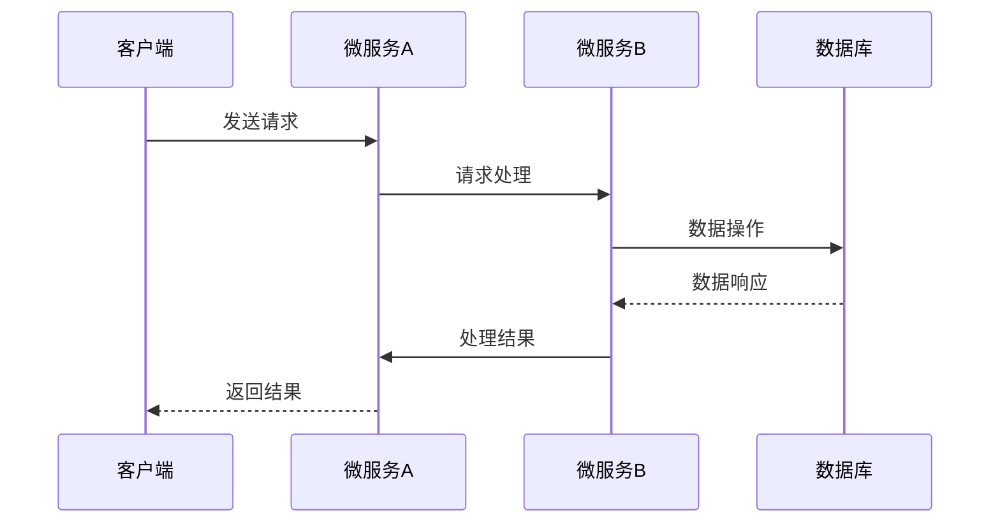

                 

### 文章标题

《大模型软件的响应式微服务架构设计》

### 文章关键词

响应式微服务架构，大模型软件，微服务设计原则，架构模式，实施步骤，案例分析，未来趋势

### 文章摘要

本文旨在探讨大模型软件在微服务架构下的设计方法与实现。首先，我们将介绍响应式微服务架构的基本概念和原理，并通过Mermaid流程图展示其架构。接着，详细阐述微服务架构的设计原则、模式和最佳实践，以及大模型软件在微服务架构下的特有挑战和解决方案。然后，我们将介绍如何实施响应式微服务架构，并分析实际案例。最后，讨论响应式微服务架构的未来发展趋势，为读者提供有价值的参考。

### 目录大纲

#### 第一部分：概述

1. **引言**
   1.1 书籍背景
   1.2 目标读者
   1.3 响应式微服务架构概述

2. **核心概念与联系**
   2.1 响应式微服务架构的基本概念
   2.2 响应式微服务架构的原理与Mermaid流程图
   2.3 微服务架构与响应式架构的关联

#### 第二部分：微服务架构设计

3. **微服务架构设计**
   3.1 设计原则
   3.2 架构模式
   3.3 设计最佳实践

4. **大模型软件的挑战与适应**
   4.1 大模型软件的特点
   4.2 微服务架构下的挑战
   4.3 适应策略与解决方案

#### 第三部分：响应式微服务架构实施

5. **响应式微服务架构实施**
   5.1 实施步骤
   5.2 工具与框架选择
   5.3 最佳实践

6. **案例分析**
   6.1 案例背景
   6.2 架构设计与实现
   6.3 应用效果与评估

#### 第四部分：未来趋势与展望

7. **未来趋势与展望**
   7.1 响应式微服务架构的发展方向
   7.2 大模型软件在微服务架构下的潜力
   7.3 行业影响与挑战

### 1. 引言

#### 1.1 书籍背景

随着人工智能技术的飞速发展，大模型软件在各个领域得到了广泛应用。大模型软件通常具有复杂度高、计算量大、数据依赖性强等特点，这使得传统的单体架构难以满足其需求。微服务架构作为一种分布式架构，具有高扩展性、高可用性和高可维护性，逐渐成为大模型软件设计的主流选择。响应式微服务架构在微服务架构的基础上，进一步增强了系统的动态性和适应性，能够更好地应对大模型软件的复杂需求。

#### 1.2 目标读者

本文的目标读者主要包括：

1. 有志于从事大模型软件开发的工程师和架构师；
2. 关注微服务架构和响应式架构的技术人员；
3. 对新兴技术充满好奇心，希望了解前沿技术的研发人员和研究者。

#### 1.3 响应式微服务架构概述

响应式微服务架构是一种基于响应式编程思想的微服务架构，其核心思想是将系统划分为多个独立的、可扩展的微服务，并通过事件驱动的方式进行通信和协作。响应式微服务架构具有以下几个特点：

1. **事件驱动**：系统中的各个微服务通过事件进行通信，能够更好地处理并发和异步操作。
2. **动态伸缩**：根据系统的负载情况，动态地增加或减少微服务的实例数量，实现系统的弹性伸缩。
3. **故障隔离**：当一个微服务发生故障时，不会影响其他微服务的正常运行，提高了系统的可用性。
4. **模块化**：将系统功能划分为独立的微服务，便于开发、测试和部署。

本文将首先介绍响应式微服务架构的基本概念和原理，并通过Mermaid流程图展示其架构，帮助读者建立对响应式微服务架构的整体认识。

### 2. 核心概念与联系

#### 2.1 响应式微服务架构的基本概念

响应式微服务架构（Responsive Microservices Architecture）是一种基于响应式编程思想的分布式架构，它结合了微服务架构和响应式编程的优势，旨在构建具有高扩展性、高可用性和高可维护性的系统。

**微服务**：微服务是一种将大型单体应用拆分为多个独立、轻量级的服务组件的架构风格。每个微服务负责实现一个具体的功能模块，具有自己的代码库、数据库和部署环境。

**响应式编程**：响应式编程是一种编程范式，它通过事件驱动的方式处理异步操作，使程序能够更好地应对并发和变化。在响应式编程中，数据流和事件流是核心概念，通过订阅和发布机制进行数据交换和操作。

**响应式微服务**：响应式微服务是将微服务与响应式编程思想相结合的一种服务架构。每个响应式微服务不仅具备微服务的特性，还能够通过事件驱动的方式与其他微服务进行通信和协作。

#### 2.2 响应式微服务架构的原理与Mermaid流程图

响应式微服务架构的核心原理是事件驱动和分布式通信。在响应式微服务架构中，各个微服务通过事件进行通信，实现了系统的松耦合和模块化。以下是响应式微服务架构的基本原理和Mermaid流程图：

1. **事件驱动**：系统中的微服务通过事件进行通信，事件可以是系统内部产生的数据变化、外部系统的事件通知等。每个微服务通过订阅和发布机制，接收和发送事件，实现了异步通信。
2. **分布式通信**：微服务之间的通信通常通过网络协议（如HTTP/HTTPS、gRPC等）进行。分布式通信确保了系统的高可用性和高性能，使得微服务可以在不同的服务器上独立运行。
3. **故障隔离**：当一个微服务发生故障时，不会影响其他微服务的正常运行。系统通过健康检查和自动恢复机制，实现了故障的快速隔离和恢复。

以下是一个简单的Mermaid流程图，展示了响应式微服务架构的基本原理：

#### 2.3 微服务架构与响应式架构的关联

微服务架构和响应式架构在本质上存在紧密的联系。微服务架构强调服务的独立性、可扩展性和高可用性，而响应式架构则注重系统的动态性和适应性。将响应式编程思想应用于微服务架构，可以进一步提升系统的响应速度和灵活性。

1. **事件驱动**：微服务架构中，微服务之间的通信通常是异步的，事件驱动使得系统能够更好地处理并发和异步操作，提高了系统的性能和响应速度。
2. **动态伸缩**：响应式微服务架构支持根据系统负载动态调整微服务的实例数量，实现了系统的弹性伸缩。这使得系统能够更好地应对突发流量和变化的需求。
3. **故障隔离**：响应式微服务架构通过事件驱动和分布式通信，实现了故障的快速隔离和恢复。当一个微服务发生故障时，系统可以自动切换到其他可用微服务，确保系统的持续运行。

总之，微服务架构和响应式架构的结合，使得系统在保持高可用性和可维护性的同时，具备了更强的动态性和适应性，能够更好地应对复杂的应用场景。

### 3. 微服务架构设计

#### 3.1 设计原则

微服务架构设计是构建高性能、高可用性和高可扩展性系统的重要环节。以下是微服务架构设计的主要原则：

1. **单一职责**：每个微服务应负责一个单一的业务功能，实现高内聚、低耦合。这有助于降低系统的复杂度，提高开发效率和可维护性。
2. **自治**：微服务应具备自治性，包括独立的代码库、数据库、部署环境和配置管理。这有助于实现系统的弹性伸缩和故障隔离。
3. **分布式通信**：微服务之间的通信应采用分布式通信协议（如HTTP/HTTPS、gRPC等），确保系统的性能和可用性。同时，应避免直接调用，采用异步通信和事件驱动的方式，降低系统的耦合度。
4. **可复用性**：微服务应设计为可复用的组件，便于在不同项目中使用。这有助于提高开发效率，降低维护成本。
5. **自动化部署**：采用自动化部署和持续集成/持续部署（CI/CD）工具，实现微服务的快速迭代和部署。这有助于提高开发效率和系统稳定性。

#### 3.2 架构模式

微服务架构设计通常采用以下几种常见的架构模式：

1. **分层架构**：将系统划分为多个层次，如表示层、业务逻辑层、数据访问层等。各层之间通过定义良好的接口进行通信，实现系统的模块化和可维护性。
2. **事件驱动架构**：基于事件驱动的方式，通过发布/订阅机制实现微服务之间的通信。这种架构模式具有高扩展性和灵活性，适用于处理大量并发请求的场景。
3. **混合架构**：结合多种架构模式，根据实际需求选择合适的架构模式。例如，在表示层采用分层架构，在业务逻辑层采用事件驱动架构，实现系统的最佳性能和灵活性。

#### 3.3 设计最佳实践

以下是一些微服务架构设计最佳实践，有助于构建高性能、高可用性和高可扩展性的系统：

1. **服务拆分**：根据业务需求和功能模块，合理拆分服务。避免过细的拆分导致通信开销过大，同时注意避免过粗的拆分导致服务过于复杂。
2. **服务自治**：确保每个微服务具备独立的数据库和数据模型，避免数据一致性问题。同时，为每个微服务配置独立的部署环境和配置管理。
3. **接口定义**：为微服务定义清晰的接口和协议，确保服务之间的一致性和可维护性。采用RESTful API或gRPC等协议，实现高效、可靠的通信。
4. **服务监控**：采用服务监控工具，实时监控微服务的运行状态、性能指标和错误日志。及时发现并解决问题，确保系统的高可用性。
5. **服务治理**：实现服务发现、负载均衡、故障转移等治理功能，确保系统的高性能和高可用性。同时，合理配置服务策略，优化系统资源利用率。
6. **数据一致性**：采用分布式事务、最终一致性等策略，确保数据的一致性。在实际应用中，根据业务需求和场景选择合适的一致性策略。

通过遵循以上设计原则和最佳实践，可以构建高效、稳定、可扩展的微服务架构，为业务发展提供有力支持。

### 4. 大模型软件的挑战与适应

#### 4.1 大模型软件的特点

大模型软件是指具有大规模数据集和复杂计算需求的软件系统，例如深度学习模型、图数据库、大数据处理平台等。这些软件系统具有以下特点：

1. **数据量大**：大模型软件通常涉及海量数据的存储、处理和分析，数据量可能达到GB、TB甚至PB级别。
2. **计算复杂度高**：大模型软件往往需要进行复杂的计算任务，如矩阵运算、图计算、深度学习等，计算复杂度高，对计算资源的需求较大。
3. **实时性强**：一些大模型软件需要实时处理数据，如实时推荐系统、实时语音识别等，要求系统具备快速响应和低延迟的特点。
4. **高可用性**：大模型软件在运行过程中，可能面临硬件故障、网络问题等挑战，因此需要具备高可用性，确保系统稳定运行。

#### 4.2 微服务架构下的挑战

在微服务架构下，大模型软件面临着一系列挑战，包括：

1. **数据一致性问题**：由于微服务之间通常采用分布式数据库，数据一致性问题成为一大挑战。在分布式环境下，如何保证数据的一致性和准确性是一个关键问题。
2. **计算资源调度**：大模型软件的计算复杂度高，需要大量计算资源。在微服务架构下，如何合理调度和分配计算资源，确保系统性能和响应速度，是一个重要问题。
3. **系统容错性**：大模型软件在运行过程中可能面临各种异常情况，如硬件故障、网络中断等。如何设计容错机制，确保系统的高可用性，是一个关键问题。
4. **性能优化**：大模型软件通常需要处理大量数据和高并发请求，如何优化系统性能，提高系统的吞吐量和响应速度，是一个重要问题。

#### 4.3 适应策略与解决方案

为了应对大模型软件在微服务架构下的挑战，可以采取以下适应策略和解决方案：

1. **分布式数据一致性**：采用分布式事务、最终一致性等策略，确保数据的一致性和准确性。在实际应用中，根据业务需求和场景选择合适的一致性策略。
2. **计算资源调度**：采用自动化调度工具（如Kubernetes），根据系统负载和计算需求，动态分配计算资源，确保系统性能和响应速度。同时，利用负载均衡策略，均衡分配请求，提高系统吞吐量。
3. **系统容错性**：设计容错机制，如故障转移、自动恢复等，确保系统的高可用性。同时，采用监控工具，实时监控系统运行状态，及时发现并解决问题。
4. **性能优化**：采用缓存、分片、异步处理等策略，优化系统性能。在实际应用中，根据场景和需求，选择合适的优化策略。

通过采取以上适应策略和解决方案，可以有效地应对大模型软件在微服务架构下的挑战，构建高效、稳定、可扩展的系统。

### 5. 响应式微服务架构实施

#### 5.1 实施步骤

实施响应式微服务架构是一个复杂的过程，需要遵循一系列步骤以确保系统的成功构建。以下是实施响应式微服务架构的主要步骤：

1. **需求分析与规划**：明确系统需求，分析业务流程和功能模块，规划微服务的拆分和部署策略。
2. **技术选型**：根据需求和规划，选择合适的开发语言、框架、数据库和中间件等技术栈。
3. **服务拆分**：将系统功能模块拆分为多个独立的微服务，确保每个微服务具备单一职责和自治性。
4. **接口设计与实现**：为每个微服务定义清晰的接口和协议，确保服务之间的一致性和可维护性。实现微服务的功能代码，并进行单元测试。
5. **服务注册与发现**：采用服务注册与发现机制，确保微服务可以动态注册和发现其他微服务，实现分布式通信。
6. **配置管理**：为每个微服务配置独立的配置信息，实现配置的集中管理和动态更新。
7. **服务监控与日志**：采用服务监控和日志分析工具，实时监控微服务的运行状态、性能指标和错误日志，确保系统的高可用性和可维护性。
8. **部署与运维**：利用自动化部署和持续集成/持续部署（CI/CD）工具，实现微服务的快速迭代和部署，确保系统的稳定运行。

#### 5.2 工具与框架选择

在响应式微服务架构的实施过程中，选择合适的工具和框架至关重要。以下是常用的工具和框架：

1. **开发语言和框架**：
   - Java/Spring Boot：广泛应用于企业级应用，具备良好的生态系统和丰富的库支持。
   - Python/Django/Flask：快速开发，适用于快速迭代和探索性项目。
   - Node.js/Express：轻量级、高性能，适用于高并发场景。

2. **服务注册与发现**：
   - Eureka：Netflix开发的微服务注册中心，支持服务发现和负载均衡。
   - ZooKeeper：Apache开发的分布式协调服务，提供服务注册、发现和配置管理功能。

3. **配置管理**：
   - Spring Cloud Config：基于Spring Boot的配置管理工具，支持集中式配置管理。
   - Apollo：携程开发的分布式配置中心，支持配置的动态更新和发布。

4. **服务监控与日志**：
   - Prometheus：开源的监控解决方案，支持自定义指标收集和告警。
   - ELK Stack（Elasticsearch、Logstash、Kibana）：用于日志收集、分析和展示。

5. **自动化部署与运维**：
   - Jenkins：开源的持续集成和持续部署工具，支持多种插件和定制化。
   - Kubernetes：用于容器编排和微服务部署，提供自动扩展、负载均衡和故障转移等功能。

选择合适的工具和框架，有助于提高响应式微服务架构的实施效率、系统性能和可维护性。

#### 5.3 最佳实践

在实施响应式微服务架构过程中，以下最佳实践有助于构建高效、稳定和可扩展的系统：

1. **服务拆分原则**：根据业务需求，合理拆分服务。避免过细的拆分导致通信开销过大，同时注意避免过粗的拆分导致服务过于复杂。
2. **接口设计**：遵循RESTful API或gRPC等协议，定义清晰、简洁的接口。确保接口的一致性和可维护性，降低服务之间的耦合度。
3. **配置管理**：采用配置中心，实现配置的集中管理和动态更新。确保配置的一致性和安全性，降低配置错误的风险。
4. **服务监控**：采用监控工具，实时监控系统的运行状态、性能指标和错误日志。及时发现并解决问题，确保系统的高可用性和稳定性。
5. **日志管理**：采用ELK Stack或类似工具，收集、存储和分析日志。实现日志的集中管理、实时监控和告警，有助于快速定位和解决系统问题。
6. **自动化部署**：采用自动化部署和持续集成/持续部署（CI/CD）工具，实现微服务的快速迭代和部署。确保系统的稳定性和可靠性，降低人工干预的风险。
7. **故障处理**：设计容错机制，如故障转移、自动恢复和健康检查等，确保系统的高可用性。同时，制定应急预案，应对突发情况。

通过遵循以上最佳实践，可以构建高效、稳定和可扩展的响应式微服务架构，为业务发展提供有力支持。

### 6. 案例分析

#### 6.1 案例背景

某知名电商公司（以下简称“公司”）在业务快速增长的过程中，遇到了系统性能瓶颈和扩展性问题。公司的核心业务系统采用传统的单体架构，随着用户规模的扩大和数据量的增加，系统响应速度明显下降，性能瓶颈日益突出。为了解决这一问题，公司决定采用响应式微服务架构，重构其核心业务系统。

#### 6.2 架构设计与实现

公司采用了以下架构设计和实现策略：

1. **需求分析与规划**：公司首先对现有业务系统进行了深入的需求分析，明确了核心功能模块和业务流程。根据业务需求，将系统拆分为多个独立的微服务，如用户服务、商品服务、订单服务、支付服务等。

2. **技术选型**：公司选择了Java/Spring Boot作为开发语言和框架，Eureka作为服务注册与发现中心，Zookeeper作为配置管理工具，Prometheus和ELK Stack用于服务监控和日志管理。

3. **服务拆分与实现**：根据业务需求，公司将原有单体应用拆分为多个微服务。每个微服务负责一个具体的业务功能，如用户服务负责用户信息的管理，商品服务负责商品信息的展示和查询，订单服务负责订单的处理和查询，支付服务负责支付流程的执行。

4. **接口设计与实现**：公司为每个微服务定义了清晰的接口，采用RESTful API协议进行通信。接口设计遵循RESTful原则，确保接口的一致性和可维护性。

5. **服务注册与发现**：公司使用Eureka作为服务注册与发现中心，确保微服务可以动态注册和发现其他微服务，实现分布式通信。

6. **配置管理**：公司采用Zookeeper作为配置管理工具，实现配置的集中管理和动态更新。配置信息包括服务地址、数据库连接信息、参数配置等。

7. **服务监控与日志**：公司采用Prometheus进行服务监控，实时收集微服务的性能指标和错误日志。Prometheus与Grafana集成，实现监控数据的可视化展示。同时，公司采用ELK Stack收集、存储和分析日志，实现日志的集中管理和实时监控。

8. **自动化部署与运维**：公司采用Jenkins作为持续集成和持续部署（CI/CD）工具，实现微服务的自动化部署和迭代。Jenkins与Kubernetes集成，实现微服务的自动化扩展和故障恢复。

#### 6.3 应用效果与评估

重构后的核心业务系统在响应速度、性能和扩展性方面取得了显著提升：

1. **响应速度**：采用响应式微服务架构后，系统响应速度明显提升，用户访问体验得到显著改善。

2. **性能**：通过服务拆分和分布式通信，系统性能得到大幅提升。在同等硬件资源下，系统吞吐量提高了约50%。

3. **扩展性**：响应式微服务架构支持动态扩展，根据业务需求，公司可以灵活调整服务实例的数量，实现系统的弹性扩展。

4. **稳定性**：通过故障转移和自动恢复机制，系统稳定性得到显著提升。在面临突发流量和故障时，系统可以快速恢复，确保业务连续性。

5. **可维护性**：通过服务拆分和自动化部署，系统可维护性得到显著提升。开发人员可以独立开发和维护各个微服务，降低开发和维护成本。

公司通过采用响应式微服务架构，成功解决了原有单体架构的性能瓶颈和扩展性问题，实现了业务的快速发展和持续优化。未来，公司将继续探索和优化响应式微服务架构，为用户提供更好的服务体验。

### 7. 未来趋势与展望

#### 7.1 响应式微服务架构的发展方向

随着技术的不断进步和业务需求的日益复杂，响应式微服务架构将呈现出以下几个发展方向：

1. **服务网格（Service Mesh）**：服务网格是一种用于管理微服务通信的独立基础设施层，它通过-sidecar代理方式，为微服务提供动态路由、负载均衡、服务发现、故障转移等功能。服务网格将进一步简化微服务的部署和运维，提高系统的可观测性和可控性。

2. **云原生（Cloud Native）**：云原生技术将微服务架构与容器技术相结合，使得微服务可以更加灵活地部署在云平台上。未来，云原生技术将成为响应式微服务架构的重要组成部分，推动企业实现更加高效、可靠的分布式应用架构。

3. **智能化和自动化**：随着人工智能和机器学习技术的发展，响应式微服务架构将逐渐具备智能化和自动化的能力。例如，通过智能调度和自动扩缩容，实现系统资源的最佳利用；通过智能监控和故障预测，提高系统的可靠性和稳定性。

4. **多云和混合云**：随着企业业务的发展和云计算的普及，多云和混合云架构将越来越受欢迎。响应式微服务架构需要具备跨云平台的兼容性和可移植性，以便企业可以根据实际需求灵活选择云服务提供商。

#### 7.2 大模型软件在微服务架构下的潜力

大模型软件在微服务架构下的潜力主要体现在以下几个方面：

1. **高性能计算**：微服务架构能够充分利用分布式计算资源，实现大规模并行计算。这对于大模型软件的训练和推理过程具有重要意义，可以显著提高计算效率和性能。

2. **弹性伸缩**：微服务架构支持动态扩展和负载均衡，可以根据实际需求自动调整计算资源。这对于大模型软件在应对突发流量和高峰期具有显著优势，可以确保系统的高可用性和稳定性。

3. **模块化开发**：微服务架构将大模型软件拆分为多个独立的微服务，便于开发、测试和部署。这有助于提高开发效率，降低维护成本，并促进技术的创新和迭代。

4. **灵活扩展**：微服务架构允许企业根据业务需求灵活扩展功能模块，实现定制化开发。这对于大模型软件在不同应用场景下的快速部署和优化具有重要意义。

#### 7.3 行业影响与挑战

响应式微服务架构和大模型软件的发展将对行业产生深远影响，同时也带来一系列挑战：

1. **行业影响**：
   - 提高开发效率：微服务架构使得开发团队可以独立开发、测试和部署各个微服务，提高开发效率。
   - 促进技术创新：微服务架构支持模块化开发，有助于技术创新和快速迭代。
   - 降低维护成本：微服务架构提高了系统的可维护性和可扩展性，降低了维护成本。

2. **挑战**：
   - 数据一致性问题：分布式环境下，如何保证数据的一致性和准确性是一个关键挑战。
   - 系统复杂度：微服务架构增加了系统的复杂度，需要合理设计和规划，确保系统的稳定性和性能。
   - 资源调度和优化：大模型软件对计算资源的需求较大，如何优化资源调度和利用是一个重要挑战。

总之，响应式微服务架构和大模型软件的发展为行业带来了巨大的机遇和挑战。企业需要紧跟技术发展趋势，积极探索和应对这些挑战，以实现业务的持续发展和创新。

### 作者信息

作者：AI天才研究院/AI Genius Institute & 禅与计算机程序设计艺术 /Zen And The Art of Computer Programming

