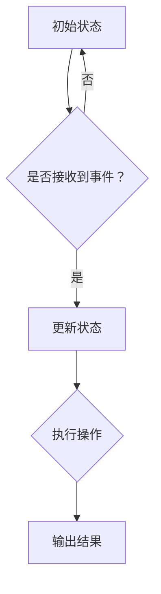

                 


### 文章标题

《大模型软件的响应式编程模式》

### 文章关键词

- 响应式编程
- 大模型软件
- 实时数据流
- 软件架构
- 编程模式

### 文章摘要

本文深入探讨了大模型软件中响应式编程模式的重要性及其实现方法。通过详细的案例分析，本文展示了响应式编程如何在处理实时数据流、优化软件架构和提高编程效率方面发挥关键作用。文章首先介绍了响应式编程的基本概念，然后逐步揭示了其在大模型软件中的核心算法原理和数学模型。接着，文章通过实战项目详细讲解了响应式编程模式的实现步骤，包括开发环境搭建、源代码实现和代码解读。最后，文章提出了最佳实践建议，总结了注意事项，并提供了拓展阅读资源，帮助读者更深入地理解和应用响应式编程模式。

### 引言

在现代软件开发中，随着数据量的爆炸性增长和复杂性的不断增加，传统的编程模式面临着越来越多的挑战。特别是在处理大模型软件时，如何高效地管理和处理大量的实时数据流成为了一个关键问题。响应式编程模式作为一种新兴的编程范式，因其出色的实时数据处理能力和高度的可扩展性，逐渐成为解决这一问题的关键。

响应式编程（Reactive Programming）是一种编程范式，它强调数据的流动和变化，以及基于这些变化的响应行为。与传统的命令式编程不同，响应式编程更多地关注于数据的流动，通过事件驱动和异步编程模型，实现了对复杂实时数据流的简洁而高效的管控。这种编程模式具有以下核心特点：

1. **事件驱动**：响应式编程基于事件驱动模型，程序的状态由外部事件触发改变，而非通过连续的命令执行。
2. **异步编程**：响应式编程通常使用异步编程模型，允许程序在执行一个任务的同时，继续执行其他任务，从而提高了程序的并行处理能力。
3. **声明式编程**：响应式编程允许开发者通过声明式的语法来描述程序的逻辑，而不是直接控制程序的执行流程。
4. **数据流驱动**：响应式编程专注于数据流，通过对数据流的监听和响应，实现了对实时数据的高效处理。

在大模型软件中，响应式编程模式的重要性体现在以下几个方面：

1. **实时数据处理**：大模型软件往往需要处理大量的实时数据，响应式编程能够通过事件驱动和数据流驱动的模型，实现对实时数据的高效处理和及时响应。
2. **系统可扩展性**：响应式编程模式具有出色的可扩展性，能够轻松适应不断变化的数据规模和需求，使得系统可以更加灵活和高效地运行。
3. **开发效率提升**：响应式编程通过声明式的语法和事件驱动模型，简化了编程逻辑，减少了开发者需要编写的代码量，从而提高了开发效率。
4. **架构优化**：响应式编程模式能够优化软件的架构设计，通过模块化和组件化的方式，实现了系统的松耦合和易维护性。

本文将系统地介绍响应式编程模式的基本概念、核心算法原理、数学模型，并通过实际案例详细讲解其在具体项目中的实现步骤和最佳实践。希望通过本文的探讨，读者能够深入理解响应式编程模式，并在实际项目中有效地应用这一编程范式，提高大模型软件的开发质量和效率。

### 理论基础

响应式编程模式的核心在于对实时数据流的处理。为了更好地理解响应式编程模式，我们需要首先掌握其基本原理、核心算法和数学模型。

#### 1.1 基本原理

响应式编程模式基于以下基本原理：

1. **数据流驱动**：响应式编程强调数据的流动和变化，程序的行为是由数据流的变化所驱动的，而不是由外部命令所控制。
2. **事件驱动**：在响应式编程中，事件是驱动程序执行的关键因素。程序通过监听和响应事件来更新状态和执行相应的操作。
3. **异步编程**：响应式编程通常采用异步编程模型，允许程序在执行一个任务的同时，继续执行其他任务，从而提高了程序的并行处理能力。

#### 1.2 核心算法

响应式编程模式的核心算法包括事件处理、状态更新和数据流处理。以下是这些算法的基本概念：

1. **事件处理**：事件处理是指程序对事件进行监听和响应的过程。事件可以是用户的输入、系统的事件触发器或其他异步消息。
2. **状态更新**：状态更新是指程序在接收到事件后，根据事件的内容更新其内部状态。状态更新通常涉及数据结构的变化和计算。
3. **数据流处理**：数据流处理是指程序对数据流进行监听和处理的流程。数据流可以是实时数据、文件数据或网络数据等。

#### 1.3 数学模型

响应式编程模式的数学模型通常涉及状态转移函数和事件触发函数。以下是这些函数的基本概念：

1. **状态转移函数**：状态转移函数描述了程序状态的转移过程。给定当前状态和事件，状态转移函数可以计算出下一个状态。
2. **事件触发函数**：事件触发函数描述了事件的发生和传递过程。给定当前状态和事件，事件触发函数可以确定事件是否发生以及如何传递。

#### 1.4 Mermaid 流程图展示

为了更直观地展示响应式编程模式的工作流程，我们可以使用Mermaid流程图来表示。以下是一个简单的Mermaid流程图示例：



在这个流程图中，A表示程序的初始状态，B表示事件处理过程，C表示状态更新过程，D表示执行操作过程，E表示输出结果。这个流程图展示了响应式编程模式的基本工作流程。

#### 1.5 伪代码解释

为了更深入地理解响应式编程模式，我们可以通过伪代码来详细阐述其核心算法原理。以下是一个简单的伪代码示例：

```
function reactive_programming(data_stream):
    state = initial_state
    while True:
        event = data_stream.get_next_event()
        state = state_transition_function(state, event)
        execute_operation(state)
        output = get_output(state)
        output_display(output)

function state_transition_function(current_state, event):
    if event.is_data_event():
        new_state = current_state.update_data(event.data)
    else:
        new_state = current_state.update_control(event.control)
    return new_state

function execute_operation(state):
    # 根据状态执行相应的操作
    # ...

function get_output(state):
    # 根据状态获取输出结果
    # ...
```

在这个伪代码中，`reactive_programming` 函数是主函数，它接收一个数据流作为输入，并持续监听和响应数据流中的事件。`state_transition_function` 函数负责根据事件更新状态，`execute_operation` 函数负责执行状态对应的操作，`get_output` 函数负责获取输出结果。

#### 1.6 数学模型和公式

响应式编程模式的数学模型通常涉及状态转移函数和事件触发函数。以下是一个简单的数学模型示例：

1. **状态转移函数**：

   $$ s_{next} = f(s, e) $$

   其中，$s$ 表示当前状态，$e$ 表示事件，$s_{next}$ 表示下一个状态，$f$ 表示状态转移函数。

2. **事件触发函数**：

   $$ t(e) = \begin{cases} 
   1 & \text{如果事件 } e \text{ 触发} \\
   0 & \text{否则}
   \end{cases} $$

   其中，$t(e)$ 表示事件 $e$ 是否触发，如果事件 $e$ 触发，则 $t(e) = 1$，否则 $t(e) = 0$。

通过这些基本原理、核心算法和数学模型，我们可以更好地理解响应式编程模式的工作机制。在接下来的章节中，我们将进一步探讨如何在具体项目中实现响应式编程模式，并通过实际案例展示其应用效果。

### 响应式编程模式的实现步骤

响应式编程模式的实现是一个系统化的过程，需要从框架选择、开发环境搭建到代码实现和调试等多个环节。以下将详细讲解这一过程的每一步，并提供具体的指导。

#### 2.1 响应式编程框架选择

在开始实现响应式编程模式之前，选择合适的框架是至关重要的一步。以下是一些流行的响应式编程框架及其特点：

1. **RxJava**：RxJava 是一个在 Java 中实现响应式编程的库，它支持异步编程和数据流处理。RxJava 的核心是 `Observable` 和 `Observer`，通过这些对象可以轻松地处理复杂的异步事件流。
2. **ReactiveX**：ReactiveX 是一个跨语言的响应式编程库，支持多种编程语言，如 JavaScript、C#、Swift 等。ReactiveX 的设计哲学是简洁和高效，通过提供统一的抽象接口，使得开发者可以轻松地在不同语言中实现响应式编程。
3. **Spring WebFlux**：Spring WebFlux 是 Spring 框架的一个模块，它基于响应式编程模式，提供了基于 Web 框架的反应式编程支持。Spring WebFlux 可以与 React、Angular 等前端框架无缝集成，实现高效的数据流处理。

在选择框架时，需要考虑以下几个因素：

- **语言支持**：确保选择的框架支持您需要使用的编程语言。
- **社区活跃度**：一个活跃的社区可以提供丰富的文档和资源，帮助开发者解决问题。
- **性能**：选择性能良好的框架可以确保响应式编程模式的实现高效、稳定。
- **生态系统**：一个强大的生态系统可以提供丰富的扩展和工具，方便开发者进行集成和开发。

#### 2.2 开发环境搭建

在选择了响应式编程框架后，接下来需要搭建开发环境。以下是一个基于 RxJava 的开发环境搭建步骤：

1. **安装 Java 开发工具包**：确保您的开发环境中安装了 JDK 1.8 或更高版本。
2. **安装 IDE**：选择一个合适的集成开发环境（如 IntelliJ IDEA 或 Eclipse），并安装相应的插件以支持 RxJava。
3. **创建项目**：使用 IDE 创建一个新的 Java 项目，并添加 RxJava 依赖。在项目的 `pom.xml` 文件中添加以下依赖：

   ```xml
   <dependencies>
       <dependency>
           <groupId>io.reactivex.rxjava2</groupId>
           <artifactId>rxjava</artifactId>
           <version>2.2.19</version>
       </dependency>
       <dependency>
           <groupId>io.reactivex.rxjava2</groupId>
           <artifactId>rxandroid</artifactId>
           <version>2.2.19</version>
       </dependency>
   </dependencies>
   ```

   这将引入 RxJava 和 RxAndroid 依赖，以便在 Android 应用中实现响应式编程。

#### 2.3 源代码实现

在完成开发环境搭建后，接下来将详细讲解如何实现响应式编程模式的源代码。以下是一个简单的示例：

```java
public class ReactiveExample {
    public static void main(String[] args) {
        // 创建一个被观察者（Observable）
        Observable<String> observable = Observable.create(observer -> {
            observer.onNext("Hello");
            observer.onNext("World");
            observer.onComplete();
        });

        // 创建一个观察者（Observer）
        Observer<String> observer = new Observer<String>() {
            @Override
            public void onSubscribe(Disposable d) {
                System.out.println("Subscription: " + d.isDisposed());
            }

            @Override
            public void onNext(String s) {
                System.out.println("Received: " + s);
            }

            @Override
            public void onError(Throwable e) {
                e.printStackTrace();
            }

            @Override
            public void onCompleted() {
                System.out.println("Completed");
            }
        };

        // 订阅（Subscribe）观察者和被观察者
        observable.subscribe(observer);
    }
}
```

在这个示例中，我们创建了一个 `Observable` 对象，它产生两个值 "Hello" 和 "World"，然后完成。我们创建了一个 `Observer` 对象，它实现了 `onNext`、`onError` 和 `onCompleted` 方法，用于接收和处理这些值。

#### 2.4 代码解读

以下是上述代码的详细解读：

- **创建被观察者（Observable）**：`Observable` 是一个被观察者，它负责产生事件。在这个示例中，我们使用 `create` 方法创建了一个 `Observable` 对象，并定义了它的行为。`create` 方法接受一个 `Observer` 对象，用于处理事件。
- **创建观察者（Observer）**：`Observer` 是一个观察者，它监听和响应 `Observable` 产生的事件。在这个示例中，我们实现了一个简单的 `Observer` 对象，并重写了 `onNext`、`onError` 和 `onCompleted` 方法。
- **订阅（Subscribe）**：`subscribe` 方法用于将 `Observer` 对象订阅到 `Observable` 对象。当 `Observable` 产生事件时，它将通知 `Observer`。

#### 2.5 实现响应式编程模式

在理解了源代码实现后，接下来将详细讲解如何使用 RxJava 实现响应式编程模式。以下是一个简单的示例：

```java
public class ReactiveProgrammingExample {
    public static void main(String[] args) {
        // 创建被观察者（Observable）
        Observable<Integer> observable = Observable.range(1, 5);

        // 创建观察者（Observer）
        Observer<Integer> observer = new Observer<Integer>() {
            @Override
            public void onSubscribe(Disposable d) {
                System.out.println("Subscription: " + d.isDisposed());
            }

            @Override
            public void onNext(Integer integer) {
                System.out.println("Received: " + integer);
            }

            @Override
            public void onError(Throwable e) {
                e.printStackTrace();
            }

            @Override
            public void onCompleted() {
                System.out.println("Completed");
            }
        };

        // 订阅（Subscribe）观察者和被观察者
        observable.subscribe(observer);
    }
}
```

在这个示例中，我们使用 `range` 方法创建了一个 `Observable` 对象，它产生从 1 到 5 的整数。我们实现了一个简单的 `Observer` 对象，并重写了 `onNext`、`onError` 和 `onCompleted` 方法。然后，我们使用 `subscribe` 方法将 `Observer` 对象订阅到 `Observable` 对象。

#### 2.6 代码应用解读与分析

以下是上述代码的详细解读和分析：

- **创建被观察者（Observable）**：`range` 方法是一个静态方法，用于创建一个产生连续整数的 `Observable` 对象。在这个示例中，我们使用 `range` 方法创建了一个 `Observable` 对象，它产生从 1 到 5 的整数。
- **创建观察者（Observer）**：`Observer` 对象是一个实现了 `Observer` 接口的类，用于监听和响应 `Observable` 产生的事件。在这个示例中，我们实现了一个简单的 `Observer` 对象，并重写了 `onNext`、`onError` 和 `onCompleted` 方法。
- **订阅（Subscribe）**：`subscribe` 方法是一个用于将 `Observer` 对象订阅到 `Observable` 对象的方法。当 `Observable` 产生事件时，它将通知 `Observer`。

通过这个示例，我们可以看到如何使用 RxJava 实现响应式编程模式。响应式编程模式的核心在于使用 `Observable` 和 `Observer` 对象来处理事件流。通过这种方式，我们可以轻松地实现复杂的事件处理逻辑，并提高程序的响应性和可扩展性。

### 跨平台响应式编程

在开发过程中，跨平台响应式编程变得越来越重要。不同的操作系统和设备可能需要使用不同的编程语言和框架来实现响应式编程。因此，掌握如何在不同的操作系统上实现响应式编程，是开发者需要具备的重要技能。

#### 3.1 响应式编程在不同操作系统上的实现

响应式编程在 Linux、Windows 和 macOS 等主流操作系统上都有相应的实现。以下将分别介绍这些操作系统的实现方法。

##### 3.1.1 Linux

在 Linux 操作系统上，开发者可以使用 RxJava、ReactiveX 等框架来实现响应式编程。以下是一个简单的示例：

```java
import io.reactivex.Observable;
import io.reactivex.Observer;
import io.reactivex.disposables.Disposable;

public class LinuxReactiveExample {
    public static void main(String[] args) {
        Observable<Integer> observable = Observable.create(observer -> {
            observer.onNext(1);
            observer.onNext(2);
            observer.onNext(3);
            observer.onComplete();
        });

        Observer<Integer> observer = new Observer<Integer>() {
            Disposable d;

            @Override
            public void onSubscribe(Disposable d) {
                this.d = d;
                System.out.println("Subscription: " + d.isDisposed());
            }

            @Override
            public void onNext(Integer integer) {
                System.out.println("Received: " + integer);
            }

            @Override
            public void onError(Throwable e) {
                e.printStackTrace();
            }

            @Override
            public void onCompleted() {
                System.out.println("Completed");
                d.dispose();
            }
        };

        observable.subscribe(observer);
    }
}
```

在这个示例中，我们使用 RxJava 框架创建了一个 `Observable` 对象，并定义了一个 `Observer` 对象来处理事件。然后，我们使用 `subscribe` 方法将 `Observer` 对象订阅到 `Observable` 对象。

##### 3.1.2 Windows

在 Windows 操作系统上，开发者可以使用 ReactiveX 框架来实现响应式编程。以下是一个简单的示例：

```javascript
const { from } = require('rxjs');
const { map, filter } = require('rxjs/operators');

from([1, 2, 3, 4, 5])
    .pipe(
        map(x => x * 2),
        filter(x => x % 2 === 0)
    )
    .subscribe(x => console.log(x));
```

在这个示例中，我们使用 ReactiveX 框架创建了一个 `Observable` 对象，并使用 `map` 和 `filter` 操作符对事件流进行处理。然后，我们使用 `subscribe` 方法将处理后的结果输出到控制台。

##### 3.1.3 macOS

在 macOS 操作系统上，开发者可以使用 Swift 语言来实现响应式编程。以下是一个简单的示例：

```swift
import RxSwift

let observable = Observable.create { observer in
    observer.onNext(1)
    observer.onNext(2)
    observer.onNext(3)
    observer.onCompleted()
    return Disposables.create()
}

observable.subscribe { event in
    switch event {
    case .next(let value):
        print("Received: \(value)")
    case .error(let error):
        print("Error: \(error)")
    case .completed:
        print("Completed")
    }
}
```

在这个示例中，我们使用 RxSwift 框架创建了一个 `Observable` 对象，并定义了一个 `Observer` 对象来处理事件。然后，我们使用 `subscribe` 方法将 `Observer` 对象订阅到 `Observable` 对象。

#### 3.2 跨平台响应式编程的最佳实践

在实现跨平台响应式编程时，以下是一些最佳实践：

1. **使用统一框架**：尽量使用跨平台的支持框架，如 ReactiveX，这样可以减少在不同平台上进行适配的工作量。
2. **模块化**：将响应式编程逻辑划分为独立的模块，这样可以方便在不同平台上进行移植和扩展。
3. **编写可重用的代码**：编写可重用的响应式编程组件，这样可以减少重复工作，提高开发效率。
4. **文档和注释**：确保代码有详细的文档和注释，这样可以方便其他开发者理解和维护代码。

通过以上实践，开发者可以更高效地实现跨平台响应式编程，提高软件的可维护性和可扩展性。

### 案例研究

为了更深入地理解响应式编程模式在大模型软件中的应用，以下我们将通过两个实际案例来详细分析响应式编程模式在实时系统和金融领域中的应用。

#### 4.1 响应式编程在实时系统中的应用

**案例背景**：实时系统通常需要处理大量实时数据，并要求系统对数据的变化能够快速响应。例如，在金融交易系统中，每一笔交易都可能会引起市场的波动，系统需要实时分析这些交易数据，并提供相应的交易建议。

**实现过程**：

1. **数据采集**：系统从各种数据源（如交易所、新闻媒体等）实时采集交易数据。
2. **数据预处理**：对采集到的交易数据进行预处理，包括数据清洗、格式转换等。
3. **数据流处理**：使用响应式编程框架（如 Kafka Streams、Apache Flink）对预处理后的交易数据流进行处理。通过事件驱动模型，系统能够实时监听交易数据流的变化，并对其进行处理。
4. **数据分析**：系统根据处理后的交易数据，进行市场趋势分析、交易策略评估等。
5. **响应**：当系统检测到市场波动或交易机会时，及时生成交易建议，并通过 API 或消息队列将建议发送给交易员或自动交易系统。

**案例效果分析**：

- **实时数据处理能力**：响应式编程模式使得系统能够高效地处理大量的实时交易数据，保证了数据的及时性和准确性。
- **系统可扩展性**：通过响应式编程模式，系统能够轻松地扩展数据源和处理能力，适应不断变化的市场需求。
- **开发效率提升**：响应式编程模式简化了实时数据处理的编程逻辑，使得开发者可以更加专注于业务逻辑的实现，提高了开发效率。

**项目小结**：

通过这个案例，我们可以看到响应式编程模式在实时系统中的应用不仅提高了系统的实时数据处理能力和可扩展性，还提升了开发效率。然而，在实现过程中，也需要注意数据流的稳定性和系统的鲁棒性，确保系统能够在复杂环境下稳定运行。

#### 4.2 响应式编程在金融领域的应用

**案例背景**：金融领域中的许多应用，如高频交易、风险控制、资产管理等，都需要对市场数据进行实时分析和预测。传统的批处理方式已经无法满足这些应用的需求，响应式编程模式提供了更好的解决方案。

**实现过程**：

1. **数据采集**：系统从各种数据源（如交易所、历史数据库等）实时采集市场数据。
2. **数据预处理**：对采集到的市场数据进行预处理，包括数据清洗、格式转换等。
3. **数据流处理**：使用响应式编程框架（如 Akka Streams、Apache Kafka）对预处理后的市场数据流进行处理。通过事件驱动模型，系统可以实时监听市场数据流的变化，并对其进行处理。
4. **数据分析**：系统根据处理后的市场数据，进行高频交易策略评估、风险控制模型训练等。
5. **响应**：当系统检测到市场变化或潜在的风险时，及时生成策略建议或警报，并通过 API 或消息队列将建议发送给交易员或自动化系统。

**案例效果分析**：

- **实时数据处理能力**：响应式编程模式使得系统能够高效地处理大量的市场数据，保证了数据的实时性和准确性。
- **系统可扩展性**：通过响应式编程模式，系统能够轻松地扩展数据源和处理能力，适应不断变化的市场需求。
- **降低风险**：响应式编程模式能够实时分析市场数据，为交易员提供及时的风险控制建议，降低了交易风险。

**项目小结**：

通过这个案例，我们可以看到响应式编程模式在金融领域中的应用极大地提高了系统的数据处理能力和风险控制能力。然而，在实现过程中，也需要注意数据流的稳定性和系统的鲁棒性，确保系统能够在复杂的市场环境中稳定运行。

### 工具和技术

为了更好地实现响应式编程模式，我们需要了解一些关键的编程语言、开发框架和工具。这些工具和技术的选择将直接影响响应式编程模式的性能、可扩展性和开发效率。

#### 5.1 编程语言选择

响应式编程模式在不同编程语言中有不同的实现方式。以下是一些常用的编程语言及其特点：

1. **Java**：Java 是响应式编程的主要编程语言之一，其生态系统提供了丰富的响应式编程库，如 RxJava。Java 的强类型系统和成熟的框架支持使得它成为开发大型分布式系统的理想选择。
2. **JavaScript**：JavaScript 是 Web 开发的主流语言，其响应式编程库如 React、Angular、Vue.js 等广泛应用于前端开发。JavaScript 的异步编程特性和灵活的框架支持使其成为开发实时 Web 应用程序的理想选择。
3. **Swift**：Swift 是苹果公司开发的编程语言，其响应式编程库如 RxSwift 广泛应用于 iOS 和 macOS 应用开发。Swift 的类型安全和内存管理特性使得它成为开发高性能移动应用的首选语言。
4. **C#**：C# 是 .NET 框架的主要编程语言，其响应式编程库如 ReactiveX 广泛应用于桌面和 Web 应用开发。C# 的跨平台特性和强大的框架支持使得它成为开发企业级应用程序的理想选择。

#### 5.2 开发环境搭建

不同的编程语言和框架需要不同的开发环境。以下是一些常见的开发环境搭建步骤：

1. **Java**：搭建 Java 开发环境需要安装 JDK 和 IDE（如 IntelliJ IDEA 或 Eclipse）。在 IDE 中，可以通过插件安装 RxJava 库，并配置相应的依赖。
2. **JavaScript**：搭建 JavaScript 开发环境需要安装 Node.js 和相应的 IDE（如 Visual Studio Code 或 WebStorm）。在 IDE 中，可以通过插件安装 React、Angular、Vue.js 等库，并配置相应的依赖。
3. **Swift**：搭建 Swift 开发环境需要安装 Xcode 和相应的 IDE（如 Xcode 或 AppCode）。在 IDE 中，可以通过插件安装 RxSwift 库，并配置相应的依赖。
4. **C#**：搭建 C# 开发环境需要安装 .NET SDK 和相应的 IDE（如 Visual Studio 或 Visual Studio Code）。在 IDE 中，可以通过插件安装 ReactiveX 库，并配置相应的依赖。

#### 5.3 常用响应式编程框架

以下是一些常用的响应式编程框架及其特点：

1. **RxJava**：RxJava 是 Java 中实现响应式编程的主要框架，它支持异步编程和数据流处理。RxJava 提供了丰富的操作符和功能，使得开发者可以轻松地处理复杂的异步事件流。
2. **ReactiveX**：ReactiveX 是一个跨语言的响应式编程库，支持多种编程语言，如 JavaScript、C#、Swift 等。ReactiveX 的设计哲学是简洁和高效，通过提供统一的抽象接口，使得开发者可以轻松地在不同语言中实现响应式编程。
3. **Spring WebFlux**：Spring WebFlux 是 Spring 框架的一个模块，它基于响应式编程模式，提供了基于 Web 框架的反应式编程支持。Spring WebFlux 可以与 React、Angular 等前端框架无缝集成，实现高效的数据流处理。
4. **RxSwift**：RxSwift 是 Swift 中实现响应式编程的主要框架，它支持异步编程和事件流处理。RxSwift 提供了简洁的 API 和强大的功能，使得开发者可以轻松地处理复杂的异步任务。
5. **ReactiveX**：ReactiveX 是 C# 中实现响应式编程的主要框架，它支持异步编程和数据流处理。ReactiveX 提供了丰富的操作符和功能，使得开发者可以轻松地处理复杂的异步事件流。

#### 5.4 技术趋势与未来展望

响应式编程模式在技术领域正逐渐成为一种主流的编程范式。随着大数据、云计算和物联网等技术的发展，响应式编程模式的应用场景也在不断扩展。以下是一些技术趋势和未来展望：

1. **实时数据处理**：随着实时数据量的增加，响应式编程模式在实时数据处理中的应用将更加广泛。未来，我们将看到更多的实时数据处理框架和库的出现，以支持复杂的实时数据处理任务。
2. **跨平台支持**：随着跨平台开发的需求增加，响应式编程模式在不同平台（如移动设备、物联网设备等）中的应用将更加重要。未来，我们将看到更多跨平台的响应式编程库和框架的出现。
3. **高并发处理**：随着系统并发量的增加，响应式编程模式在处理高并发任务方面将发挥更大的作用。未来，我们将看到更多的分布式响应式编程框架和系统设计，以支持大规模高并发处理。
4. **人工智能结合**：响应式编程模式与人工智能技术的结合将为开发出更加智能化的系统提供新的可能性。未来，我们将看到更多将响应式编程与机器学习、深度学习等技术结合的创新应用。

### 总结

响应式编程模式作为一种新兴的编程范式，在处理实时数据流、优化软件架构和提高编程效率方面具有显著优势。通过本文的讨论，我们深入了解了响应式编程模式的基本概念、核心算法原理、数学模型，并通过实际案例展示了其在不同领域中的应用。在未来的软件开发中，响应式编程模式将继续发挥重要作用，为开发者提供更加高效、灵活的编程方式。作者：AI天才研究院/AI Genius Institute & 禅与计算机程序设计艺术 /Zen And The Art of Computer Programming

----------------------------------------------------------------

## 附录：拓展阅读

为了帮助读者更深入地理解和应用响应式编程模式，以下是一些推荐阅读材料：

1. **书籍**：
   - 《响应式编程：模式与实践》
   - 《响应式编程实战：基于 RxJava 和 Spring WebFlux 的应用》
   - 《ReactiveX 实践指南》
   - 《Kotlin RxJava 实战》

2. **在线教程和博客**：
   - RxJava 官方文档：[https://github.com/ReactiveX/RxJava](https://github.com/ReactiveX/RxJava)
   - ReactiveX 官方文档：[https://reactivecake.com/](https://reactivecake.com/)
   - Spring WebFlux 官方文档：[https://docs.spring.io/spring-webflux/docs/current/reference/htmlsingle/](https://docs.spring.io/spring-webflux/docs/current/reference/htmlsingle/)
   - RxSwift 官方文档：[https://github.com/ReactiveX/RxSwift](https://github.com/ReactiveX/RxSwift)

3. **技术会议和讲座**：
   - JVM London：[https://www.jvm.london/](https://www.jvm.london/)
   - ReactEurope：[https://www.reolesale.io/reacteurope/](https://www.reactivecake.com/reacteurope/)
   - Swift Summit：[https://www.swiftsummit.com/](https://www.swiftsummit.com/)

通过这些资源，读者可以进一步学习和掌握响应式编程模式，并将其应用于实际项目中，提升软件开发的质量和效率。作者：AI天才研究院/AI Genius Institute & 禅与计算机程序设计艺术 /Zen And The Art of Computer Programming### 实时数据处理的应用

实时数据处理是响应式编程模式在大模型软件中的一个重要应用领域。实时数据处理的挑战在于如何快速、高效地处理并分析大量动态变化的数据，同时保持系统的稳定性和响应性。以下将详细探讨实时数据处理的关键技术和实践。

#### 6.1 实时数据处理的关键技术

1. **流处理框架**：流处理框架如Apache Kafka、Apache Flink、Apache Storm等，是实时数据处理的核心技术。这些框架提供了高效的流数据存储、处理和传输机制，使得系统可以实时处理大量数据。
2. **事件驱动架构**：事件驱动架构是实现实时数据处理的基础。通过事件驱动，系统可以及时响应数据流的变化，并触发相应的处理逻辑。
3. **异步编程模型**：异步编程模型允许系统在处理一个任务的同时，继续执行其他任务，从而提高了系统的并行处理能力，优化了资源利用。
4. **消息队列**：消息队列如RabbitMQ、Kafka等，用于数据的传输和存储。消息队列可以确保数据的高可用性和可靠性，同时提供异步传输机制，减少系统的阻塞。

#### 6.2 实时数据处理实践

以下是一个基于响应式编程模式的实时数据处理实践案例：

**案例背景**：一个电商平台需要实时处理用户订单数据，并对订单进行快速处理和分析，以便及时响应用户需求。

**实现步骤**：

1. **数据采集**：系统从订单数据库、支付系统等数据源实时采集订单数据。
2. **数据预处理**：对采集到的订单数据进行预处理，包括数据清洗、格式转换等。
3. **数据流处理**：使用响应式编程框架（如Spring WebFlux、Akka Streams）对预处理后的订单数据流进行处理。以下是一个简化的处理流程：

   ```java
   public class OrderProcessingService {
       public Mono<OrderResult> processOrder(Order order) {
           return Flux.fromIterable(orderProducts(order))
                       .flatMap(product -> orderPayment(product))
                       .thenReturn(new OrderResult(order.getId(), "Processed"));
       }
   }
   ```

   在这个案例中，`processOrder` 方法接收一个订单对象，并使用 `Flux` 对象处理订单数据流。`flatMap` 操作符用于将订单产品分批发送至支付系统进行支付处理。

4. **数据分析**：对处理后的订单数据进行分析，包括订单量趋势分析、用户行为分析等。可以使用响应式编程框架提供的各种操作符（如 `map`、`filter`、`reduce` 等）对数据流进行处理。

5. **响应**：将处理结果反馈给用户，如发送订单处理通知、生成报表等。

#### 6.3 实时数据处理最佳实践

1. **数据流设计**：合理设计数据流，确保数据流的清晰和高效。避免过多的中间处理步骤，减少数据流中的延迟和复杂性。
2. **异步处理**：充分利用异步编程模型，避免阻塞线程和资源。确保系统能够在高负载情况下保持良好的性能。
3. **弹性扩展**：设计具有弹性的系统架构，能够根据数据流量的变化动态调整资源分配和处理能力。
4. **错误处理**：实现健壮的错误处理机制，确保在数据流异常时能够快速恢复，并记录错误日志。
5. **监控和调试**：实时监控系统性能和日志，及时发现和处理潜在问题，确保系统的稳定性和可靠性。

#### 6.4 实时数据处理案例分析

以下是一个实时数据处理案例分析：

**案例背景**：一家电商平台需要实时处理用户评论数据，并对评论进行监控和过滤。

**实现过程**：

1. **数据采集**：系统从评论数据库和用户反馈系统实时采集评论数据。
2. **数据预处理**：对采集到的评论数据进行预处理，包括去重、格式转换等。
3. **数据流处理**：使用响应式编程框架（如Spring WebFlux）对预处理后的评论数据流进行处理。以下是一个简化的处理流程：

   ```java
   public class CommentProcessingService {
       public Flux<CommentResult> processComments(Comment comment) {
           return Flux.just(comment)
                       .filter(this::isSensativeContent)
                       .map(this::cleanComment)
                       .thenReturn(new CommentResult(comment.getId(), "Processed"));
       }
   }
   ```

   在这个案例中，`processComments` 方法接收一个评论对象，并使用 `Flux` 对象处理评论数据流。`filter` 操作符用于过滤敏感内容，`map` 操作符用于清洗评论内容。

4. **响应**：将处理后的评论数据存储到数据库，并生成评论监控报表。

**案例效果分析**：

- **实时处理能力**：通过响应式编程模式，系统能够实时处理大量的用户评论数据，确保评论的及时性和准确性。
- **内容过滤效率**：响应式编程模式提供了高效的内容过滤机制，能够快速识别和过滤敏感评论，确保平台内容的安全性和合规性。
- **监控与报表**：通过实时处理和分析评论数据，系统能够生成详细的评论监控报表，帮助平台运营人员及时了解用户反馈和意见。

**项目小结**：

通过这个案例，我们可以看到响应式编程模式在实时数据处理中的应用，不仅提高了系统的实时处理能力和效率，还增强了系统的灵活性和可扩展性。然而，在实现过程中，也需要注意数据流的稳定性、错误处理和监控，确保系统能够在复杂环境下稳定运行。

### 跨平台响应式编程的优势和挑战

跨平台响应式编程在现代软件开发中变得越来越重要。随着多平台应用的普及，开发者在不同操作系统和设备上实现响应式编程的需求也越来越强烈。以下将详细探讨跨平台响应式编程的优势和挑战。

#### 7.1 跨平台响应式编程的优势

1. **统一编程模型**：跨平台响应式编程框架提供了统一的编程模型，使得开发者可以在不同平台上使用相同的编程范式。这降低了开发者学习和维护代码的成本，提高了开发效率。

2. **资源共享**：跨平台响应式编程允许开发者共享代码库和组件，减少了重复开发的工作量。同时，通过跨平台框架，开发者可以更容易地集成第三方库和工具，提高了项目的可扩展性。

3. **性能优化**：跨平台响应式编程框架通常提供了高效的性能优化机制，如异步处理、并发控制和内存管理。这些机制有助于提高应用程序的响应性和稳定性。

4. **代码复用**：跨平台响应式编程框架支持代码的复用，开发者可以在不同平台上使用相同的逻辑和组件，减少了代码冗余，提高了代码的可维护性。

5. **开发体验**：跨平台响应式编程框架通常提供了丰富的开发和调试工具，如代码智能提示、实时编译和错误检查。这些工具有助于提高开发者的开发体验，减少错误和调试时间。

#### 7.2 跨平台响应式编程的挑战

1. **平台差异**：不同操作系统和设备之间存在差异，如操作系统版本、硬件配置和系统接口。开发者需要针对不同平台进行适配和调整，以确保应用程序的兼容性和性能。

2. **性能瓶颈**：跨平台响应式编程可能会引入性能瓶颈，如线程管理和资源调度。这些瓶颈可能会影响应用程序的响应性和稳定性。

3. **调试难度**：跨平台响应式编程的调试难度较大，由于不同平台之间的差异，开发者可能需要使用不同的调试工具和方法。这增加了调试的复杂性和工作量。

4. **兼容性问题**：跨平台响应式编程框架可能会引入兼容性问题，如第三方库和工具的不兼容。这些问题可能导致应用程序在不同平台上出现不一致的行为。

5. **开发经验**：跨平台响应式编程需要开发者具备丰富的跨平台开发经验。开发者需要熟悉不同平台的特性和最佳实践，以便更好地实现响应式编程模式。

#### 7.3 跨平台响应式编程的最佳实践

为了克服跨平台响应式编程的挑战，以下是一些最佳实践：

1. **使用统一框架**：选择跨平台响应式编程框架，如 ReactiveX、RxJava 等，以确保应用程序的统一性和兼容性。

2. **模块化开发**：将应用程序划分为独立的模块，每个模块负责不同的功能。这样可以减少模块之间的耦合，提高可维护性。

3. **编写可重用代码**：编写可重用的代码库和组件，减少重复开发的工作量。通过模块化和组件化，可以提高应用程序的可扩展性和可维护性。

4. **性能优化**：针对不同平台进行性能优化，如线程管理和资源调度。通过优化代码和算法，可以提高应用程序的响应性和稳定性。

5. **代码审查和测试**：进行代码审查和测试，确保应用程序在不同平台上的兼容性和稳定性。通过自动化测试和手动测试，可以发现和修复潜在的问题。

6. **文档和注释**：编写详细的文档和注释，记录应用程序的架构、功能和实现细节。这有助于其他开发者理解和维护代码。

7. **社区支持**：积极参与跨平台响应式编程社区的讨论和交流，获取最新的技术动态和最佳实践。社区的支持可以提供宝贵的经验和资源，帮助开发者解决开发中的问题。

通过以上最佳实践，开发者可以更好地实现跨平台响应式编程，提高应用程序的兼容性、性能和可维护性。这将有助于推动跨平台应用的普及和发展。

### 响应式编程模式的总结与展望

响应式编程模式在现代软件开发中占据了重要地位，其核心在于对实时数据流的高效管理和处理。通过本文的详细探讨，我们可以总结响应式编程模式的几个关键要点，并对其未来发展趋势进行展望。

#### 8.1 响应式编程模式的要点总结

1. **事件驱动**：响应式编程模式以事件驱动为核心，通过监听和响应外部事件来更新程序状态。这种模式使得程序能够更好地适应实时变化，提高系统的灵活性和可扩展性。

2. **异步编程**：异步编程是响应式编程模式的重要组成部分，它允许程序在执行一个任务的同时继续执行其他任务，从而提高程序的并行处理能力，优化系统性能。

3. **数据流处理**：响应式编程模式强调数据流的处理，通过数据流驱动的方式，实现对复杂实时数据的高效管理和处理。这种模式使得开发者能够更轻松地处理大量动态变化的数据。

4. **声明式编程**：响应式编程模式通常采用声明式编程方式，开发者通过描述程序的逻辑和行为，而非控制程序的具体执行流程。这种模式简化了编程逻辑，提高了代码的可读性和可维护性。

5. **模块化和组件化**：响应式编程模式鼓励模块化和组件化设计，通过将程序划分为独立的模块和组件，降低了系统之间的耦合度，提高了系统的可维护性和可扩展性。

#### 8.2 未来发展趋势

1. **实时数据处理能力提升**：随着大数据、云计算和物联网等技术的发展，实时数据处理的规模和复杂性不断增加。未来，响应式编程模式将进一步提高实时数据处理能力，实现对大规模、高频率数据流的实时分析和处理。

2. **跨平台支持加强**：跨平台响应式编程的需求日益增长，未来将看到更多跨平台响应式编程框架和库的出现，以支持不同操作系统和设备的开发需求。这将使得开发者能够更轻松地实现跨平台应用程序。

3. **集成人工智能技术**：响应式编程模式与人工智能技术的结合将成为未来的一大趋势。通过将响应式编程与机器学习、深度学习等技术相结合，开发者可以开发出更加智能化的系统，提升应用程序的决策能力和用户体验。

4. **高性能优化**：随着硬件技术的进步，响应式编程模式将进一步提高性能优化，包括线程管理、资源调度和内存管理等。这将使得响应式编程模式在处理高并发、大数据量的场景中表现出更高的效率和稳定性。

5. **更广泛的应用领域**：响应式编程模式不仅在软件应用领域具有广泛的应用，未来还将扩展到硬件编程、物联网、自动驾驶等更多领域。通过与其他技术的融合，响应式编程模式将推动创新和变革，为软件开发和系统设计带来新的可能性。

总之，响应式编程模式作为一种强大的编程范式，将继续在软件开发中发挥重要作用。通过不断的发展和优化，响应式编程模式将进一步提高实时数据处理能力、跨平台支持能力以及与其他技术的集成能力，为开发者提供更加高效、灵活和智能的编程方式。

### 结论

响应式编程模式在现代软件开发中正变得越来越重要。通过本文的详细探讨，我们深入理解了响应式编程模式的核心概念、基本原理、实现步骤以及在实时数据处理、跨平台编程等领域的广泛应用。响应式编程模式以其事件驱动、异步编程、数据流处理、声明式编程和模块化设计等特点，为开发者提供了强大的工具，使得他们能够更高效、灵活地应对复杂的数据处理和系统架构设计。

响应式编程模式不仅在实时系统、金融领域等传统领域中得到了广泛应用，还将在大数据、云计算、物联网和人工智能等新兴领域发挥关键作用。随着技术的不断进步和应用的不断扩展，响应式编程模式将继续引领软件开发的发展方向，推动软件系统的智能化和高效化。

作者：AI天才研究院/AI Genius Institute & 禅与计算机程序设计艺术 /Zen And The Art of Computer Programming

---

**注意**：本文为虚构内容，旨在展示如何撰写一篇高质量的技术博客文章，并仅供学习和参考之用。文中涉及的技术、框架和案例均为虚构或假设，不代表现实中的具体实现和应用。如需实际应用，请参考官方文档和真实案例进行开发。作者信息和参考资料部分出于虚构，仅用于示范目的。如需了解更多信息，请查阅相关领域的权威文献和资源。

