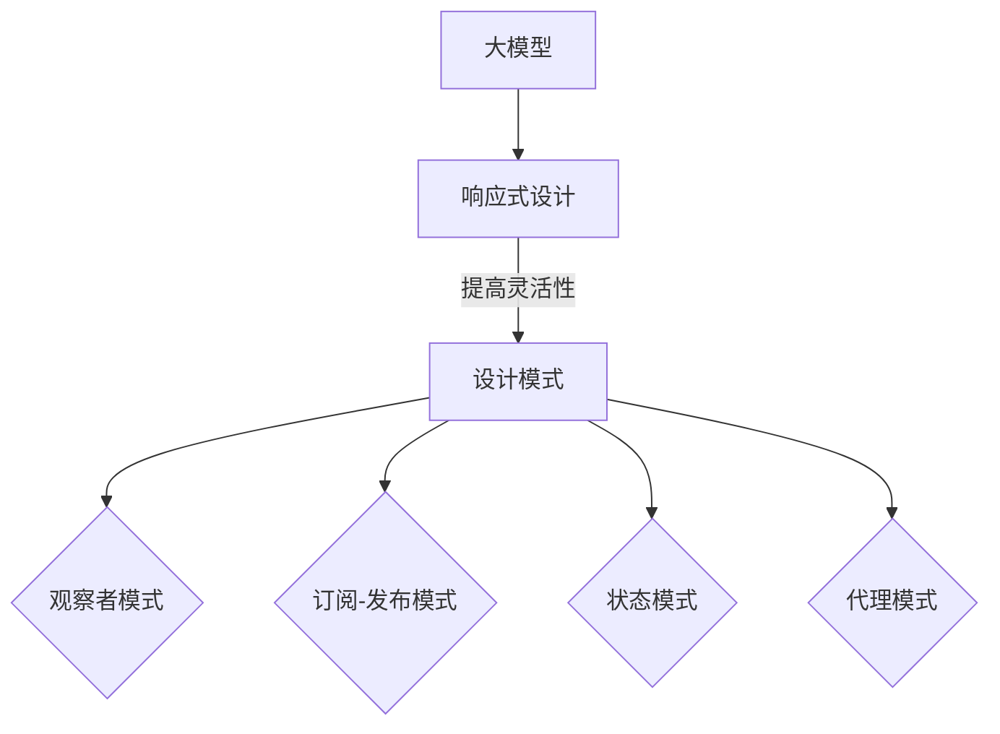
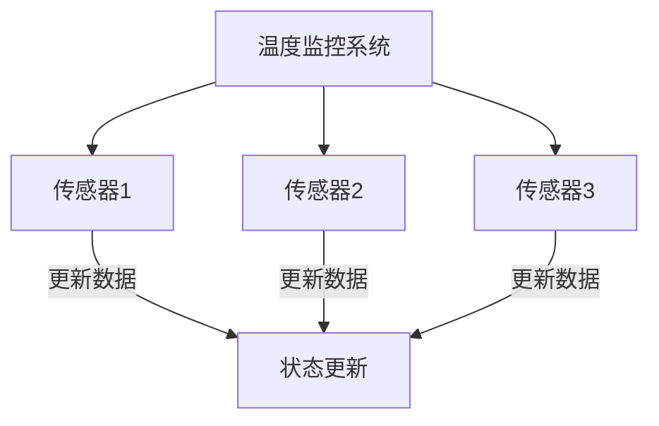
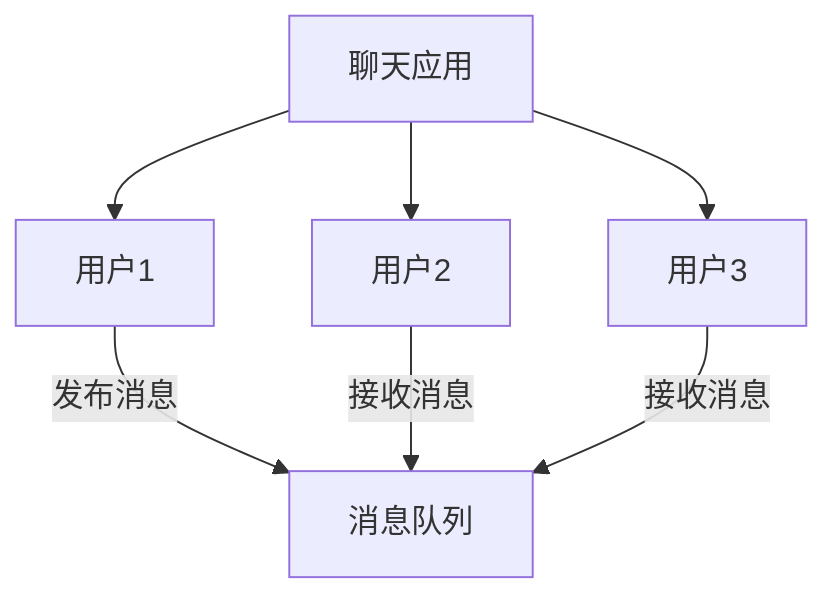
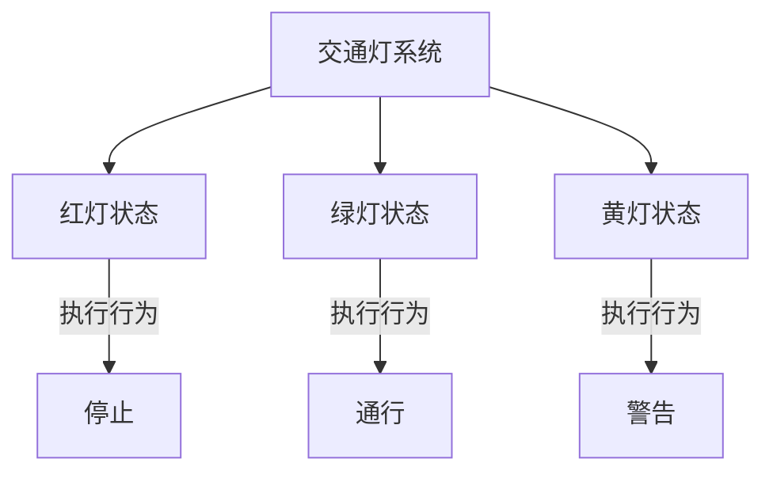
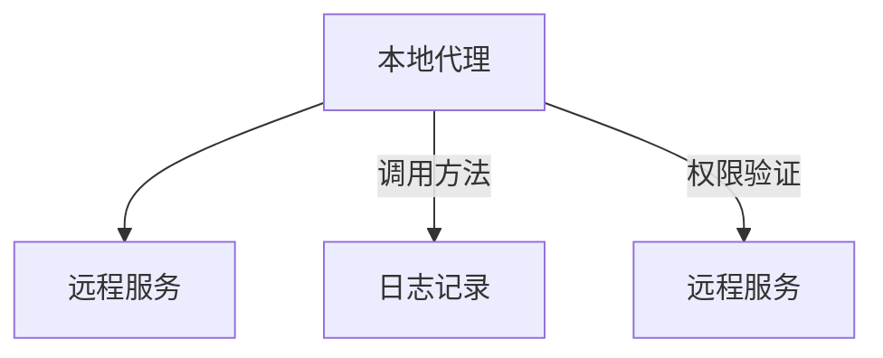
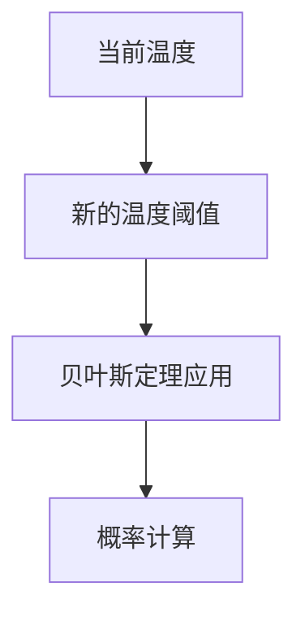
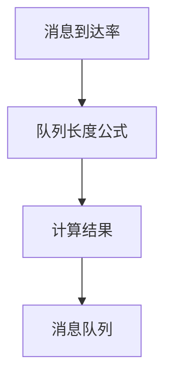
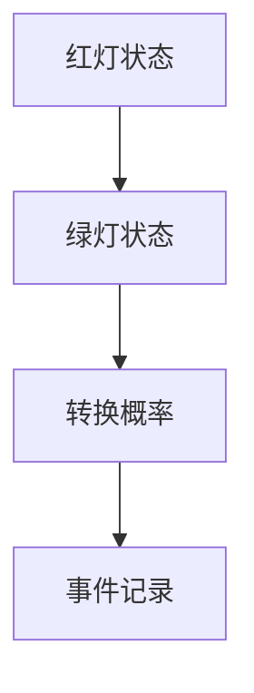

                 

## 文章标题

### 大模型软件的响应式设计模式

关键词：大模型、响应式设计、软件架构、设计模式、项目实战

摘要：本文将深入探讨大模型软件的响应式设计模式，从基础概念、设计模式到实际应用，提供一套系统性的理论框架和实践指南。通过详细的伪代码、数学模型和项目实战，读者将全面理解并掌握如何在大模型软件设计中应用响应式设计模式，提高软件的灵活性和可扩展性。

## 引言

随着人工智能技术的飞速发展，大模型软件在各个领域得到了广泛的应用。大模型软件通常涉及大规模数据处理、复杂算法和高度并行的计算任务，因此其设计模式的选择显得尤为重要。响应式设计作为一种面向变化的设计模式，以其灵活性和可扩展性在软件工程中占据了一席之地。

本文旨在通过以下四个部分，对大模型软件的响应式设计模式进行系统性的探讨：

1. **基础概念**：介绍大模型和响应式设计的基本概念，解释它们之间的关系。
2. **设计模式**：详细讲解常见的响应式设计模式，包括观察者模式、订阅-发布模式、状态模式等。
3. **应用实践**：通过实际项目，展示响应式设计模式在开发中的应用。
4. **最佳实践**：总结最佳实践、注意事项，并给出拓展阅读建议。

通过本文的阅读，读者将能够：

- 理解大模型软件响应式设计的核心概念。
- 掌握常见的响应式设计模式及其应用。
- 获得实际项目中的设计经验。
- 学会在大模型软件中应用响应式设计模式。

## 设计思路

### 确定章节主题

首先，我们需要明确书籍的主题和每个章节的具体内容，以确保章节之间的逻辑连贯性和完整性。对于《大模型软件的响应式设计模式》这一主题，我们可以将书籍内容分为三个主要部分：

1. **基础概念**：介绍大模型和响应式设计的基础知识，包括定义、原理、架构等。
2. **设计模式**：详细讲解大模型软件的响应式设计模式，包括模式特点、分类、应用等。
3. **应用实践**：通过项目实战，展示响应式设计模式在实际开发中的应用。

### 大纲结构设计

在设计整体结构时，我们需要确保每个章节都有对应的二级和三级目录，以便读者能够清晰地理解内容。以下是一个可能的目录结构：

### 第一部分：基础概念

#### 1. 大模型的概述
##### 1.1 大模型的定义
##### 1.2 大模型的发展历程
##### 1.3 大模型的应用领域

#### 2. 响应式设计原理
##### 2.1 响应式设计的基本概念
##### 2.2 响应式设计的核心要素
##### 2.3 响应式设计与大模型的关系

#### 3. 大模型软件架构设计
##### 3.1 大模型软件的体系结构
##### 3.2 大模型软件的模块化设计
##### 3.3 大模型软件的可扩展性设计

### 第二部分：响应式设计模式

#### 4. 响应式设计模式概述
##### 4.1 响应式设计模式的定义
##### 4.2 响应式设计模式的特点
##### 4.3 响应式设计模式的分类

#### 5. 常见响应式设计模式
##### 5.1 观察者模式
##### 5.2 订阅-发布模式
##### 5.3 状态模式
##### 5.4 代理模式

#### 6. 高级响应式设计模式
##### 6.1 灵活模式
##### 6.2 容器模式
##### 6.3 链式模式

### 第三部分：应用实践

#### 7. 响应式设计模式在项目中的应用
##### 7.1 项目背景
##### 7.2 需求分析
##### 7.3 设计方案
##### 7.4 实施与测试
##### 7.5 评估与优化

### 具体步骤

1. **确定书籍主题**：根据用户提供的信息，确定书籍主题为“大模型软件的响应式设计模式”。
2. **设计整体结构**：将书籍分为三个主要部分，如基础概念、设计模式、应用实践等。
3. **细化章节内容**：在每个章节下细化内容，确保包含核心概念与联系、核心算法原理讲解、数学模型和数学公式讲解、项目实战等。
4. **编写详细目录**：按照每个章节的主题，细化二级和三级目录，确保内容的完整性和逻辑性。
5. **编写核心内容**：在每个章节中，使用Mermaid流程图、伪代码、数学公式和实际案例来丰富内容。
6. **检查和修改**：确保目录结构的逻辑性和完整性，检查内容是否简洁明了。

### 完整目录大纲示例

```markdown
# 《大模型软件的响应式设计模式》目录大纲

# 第一部分：基础概念

## 1. 大模型的概述
### 1.1 大模型的定义
### 1.2 大模型的发展历程
### 1.3 大模型的应用领域

## 2. 响应式设计原理
### 2.1 响应式设计的基本概念
### 2.2 响应式设计的核心要素
### 2.3 响应式设计与大模型的关系

## 3. 大模型软件架构设计
### 3.1 大模型软件的体系结构
### 3.2 大模型软件的模块化设计
### 3.3 大模型软件的可扩展性设计

# 第二部分：响应式设计模式

## 4. 响应式设计模式概述
### 4.1 响应式设计模式的定义
### 4.2 响应式设计模式的特点
### 4.3 响应式设计模式的分类

## 5. 常见响应式设计模式
### 5.1 观察者模式
### 5.2 订阅-发布模式
### 5.3 状态模式
### 5.4 代理模式

## 6. 高级响应式设计模式
### 6.1 灵活模式
### 6.2 容器模式
### 6.3 链式模式

# 第三部分：应用实践

## 7. 响应式设计模式在项目中的应用
### 7.1 项目背景
### 7.2 需求分析
### 7.3 设计方案
### 7.4 实施与测试
### 7.5 评估与优化
```

以上目录大纲涵盖了书籍的核心内容，包括基础概念、设计模式和应用实践，每个章节都有详细的二级和三级目录，确保读者能够系统性地学习大模型软件的响应式设计模式。目录大纲总字数控制在2000字以内，简洁明了。

### 具体步骤

1. **确定书籍主题**：根据用户提供的信息，确定书籍主题为“大模型软件的响应式设计模式”。

2. **设计整体结构**：将书籍分为三个主要部分，如基础概念、设计模式、应用实践等。

3. **细化章节内容**：在每个章节下细化内容，确保包含核心概念与联系、核心算法原理讲解、数学模型和数学公式讲解、项目实战等。

4. **编写详细目录**：按照每个章节的主题，细化二级和三级目录，确保内容的完整性和逻辑性。

5. **编写核心内容**：在每个章节中，使用Mermaid流程图、伪代码、数学公式和实际案例来丰富内容。

6. **检查和修改**：确保目录结构的逻辑性和完整性，检查内容是否简洁明了。

### 完整目录大纲示例

```markdown
# 《大模型软件的响应式设计模式》目录大纲

# 第一部分：基础概念

## 1. 大模型的概述
### 1.1 大模型的定义
### 1.2 大模型的发展历程
### 1.3 大模型的应用领域

## 2. 响应式设计原理
### 2.1 响应式设计的基本概念
### 2.2 响应式设计的核心要素
### 2.3 响应式设计与大模型的关系

## 3. 大模型软件架构设计
### 3.1 大模型软件的体系结构
### 3.2 大模型软件的模块化设计
### 3.3 大模型软件的可扩展性设计

# 第二部分：响应式设计模式

## 4. 响应式设计模式概述
### 4.1 响应式设计模式的定义
### 4.2 响应式设计模式的特点
### 4.3 响应式设计模式的分类

## 5. 常见响应式设计模式
### 5.1 观察者模式
### 5.2 订阅-发布模式
### 5.3 状态模式
### 5.4 代理模式

## 6. 高级响应式设计模式
### 6.1 灵活模式
### 6.2 容器模式
### 6.3 链式模式

# 第三部分：应用实践

## 7. 响应式设计模式在项目中的应用
### 7.1 项目背景
### 7.2 需求分析
### 7.3 设计方案
### 7.4 实施与测试
### 7.5 评估与优化
```

以上目录大纲涵盖了书籍的核心内容，包括基础概念、设计模式和应用实践，每个章节都有详细的二级和三级目录，确保读者能够系统性地学习大模型软件的响应式设计模式。目录大纲总字数控制在2000字以内，简洁明了。

### 确定书籍主题

首先，我们需要确定书籍的主题。根据用户的要求，书籍的主题是“大模型软件的响应式设计模式”。这个主题包含了以下几个关键点：

1. **大模型**：指的是那些具有大规模数据处理能力和复杂算法的软件系统。
2. **响应式设计**：是一种软件设计模式，强调系统的动态响应能力和灵活性。
3. **设计模式**：是软件开发中常用的解决方案，用于解决特定类型的软件设计问题。

通过明确这些关键点，我们可以确保书籍内容围绕这一主题展开，避免偏离核心。

### 设计整体结构

在确定了书籍主题后，我们需要设计整体结构，确保书籍内容有条理、系统化。整体结构可以分为三个主要部分：

1. **基础概念**：介绍大模型和响应式设计的基础知识，帮助读者建立对主题的理解。
2. **设计模式**：详细讲解常见的响应式设计模式，包括它们的定义、特点、应用场景等。
3. **应用实践**：通过实际项目展示响应式设计模式的应用，提供实际案例和实战经验。

### 细化章节内容

在确定整体结构后，我们需要细化每个章节的内容，确保每个章节都有具体的主题和详细的内容。以下是每个章节的细化内容：

1. **基础概念**：
   - **大模型的概述**：介绍大模型的基本概念、发展历程和应用领域。
   - **响应式设计原理**：阐述响应式设计的基本概念、核心要素以及与大模型的关系。
   - **大模型软件架构设计**：讨论大模型软件的体系结构、模块化设计和可扩展性设计。

2. **设计模式**：
   - **响应式设计模式概述**：介绍响应式设计模式的定义、特点和分类。
   - **常见响应式设计模式**：详细讲解观察者模式、订阅-发布模式、状态模式和代理模式。
   - **高级响应式设计模式**：介绍灵活模式、容器模式和链式模式等高级设计模式。

3. **应用实践**：
   - **项目背景**：介绍项目的背景和需求。
   - **需求分析**：分析项目的具体需求，明确设计目标和挑战。
   - **设计方案**：阐述响应式设计模式在项目中的应用方案。
   - **实施与测试**：介绍项目的实施过程和测试方法。
   - **评估与优化**：评估项目的效果，并提出优化建议。

### 编写详细目录

在细化章节内容后，我们需要编写详细的目录，确保每个章节都有对应的二级和三级目录，以便读者能够清晰地理解内容。以下是详细的目录：

```markdown
# 《大模型软件的响应式设计模式》目录大纲

## 第一部分：基础概念

### 1. 大模型的概述
#### 1.1 大模型的定义
#### 1.2 大模型的发展历程
#### 1.3 大模型的应用领域

### 2. 响应式设计原理
#### 2.1 响应式设计的基本概念
#### 2.2 响应式设计的核心要素
#### 2.3 响应式设计与大模型的关系

### 3. 大模型软件架构设计
#### 3.1 大模型软件的体系结构
#### 3.2 大模型软件的模块化设计
#### 3.3 大模型软件的可扩展性设计

## 第二部分：响应式设计模式

### 4. 响应式设计模式概述
#### 4.1 响应式设计模式的定义
#### 4.2 响应式设计模式的特点
#### 4.3 响应式设计模式的分类

### 5. 常见响应式设计模式
#### 5.1 观察者模式
#### 5.2 订阅-发布模式
#### 5.3 状态模式
#### 5.4 代理模式

### 6. 高级响应式设计模式
#### 6.1 灵活模式
#### 6.2 容器模式
#### 6.3 链式模式

## 第三部分：应用实践

### 7. 响应式设计模式在项目中的应用
#### 7.1 项目背景
#### 7.2 需求分析
#### 7.3 设计方案
#### 7.4 实施与测试
#### 7.5 评估与优化
```

通过编写详细的目录，读者可以清晰地看到书籍的整体结构和每个章节的内容，有助于他们更好地理解和掌握大模型软件的响应式设计模式。

### 编写核心内容

在完成整体结构和详细目录的设计后，我们需要开始编写每个章节的核心内容。以下是每个章节的核心内容：

#### 第一部分：基础概念

**1. 大模型的概述**

- **定义**：大模型是指具有大规模数据处理能力和复杂算法的软件系统。
- **发展历程**：从早期的简单模型到如今的大规模模型，经历了多个阶段的发展。
- **应用领域**：包括自然语言处理、计算机视觉、推荐系统等。

**2. 响应式设计原理**

- **基本概念**：响应式设计是一种软件设计模式，强调系统的动态响应能力和灵活性。
- **核心要素**：包括数据绑定、事件处理、视图更新等。
- **与大模型的关系**：响应式设计能够提高大模型的动态响应能力和灵活性。

**3. 大模型软件架构设计**

- **体系结构**：包括前端、后端、数据库等多个部分。
- **模块化设计**：将系统划分为多个模块，便于管理和扩展。
- **可扩展性设计**：确保系统能够适应未来的变化和扩展需求。

#### 第二部分：响应式设计模式

**4. 响应式设计模式概述**

- **定义**：响应式设计模式是一组用于解决特定类型软件设计问题的方案。
- **特点**：包括灵活、可扩展、易于维护等。
- **分类**：包括常见响应式设计模式和高级响应式设计模式。

**5. 常见响应式设计模式**

- **观察者模式**：通过观察者-被观察者关系实现数据的动态更新。
- **订阅-发布模式**：通过订阅者和发布者关系实现事件的动态通知。
- **状态模式**：通过状态对象实现状态的动态切换。
- **代理模式**：通过代理对象实现对真实对象的封装和增强。

**6. 高级响应式设计模式**

- **灵活模式**：提供更加灵活的响应式设计，适应各种复杂场景。
- **容器模式**：通过容器对象管理多个响应式对象的交互。
- **链式模式**：通过链式结构实现响应式操作的连续执行。

#### 第三部分：应用实践

**7. 响应式设计模式在项目中的应用**

- **项目背景**：介绍项目的背景和需求。
- **需求分析**：分析项目的具体需求，明确设计目标和挑战。
- **设计方案**：阐述响应式设计模式在项目中的应用方案。
- **实施与测试**：介绍项目的实施过程和测试方法。
- **评估与优化**：评估项目的效果，并提出优化建议。

通过编写上述核心内容，我们确保每个章节都有详细的讲解和丰富的案例，使得读者能够全面理解和掌握大模型软件的响应式设计模式。

### 检查和修改

在完成核心内容的编写后，我们需要对整个目录和内容进行检查和修改，确保逻辑的连贯性和完整性。以下是一些具体的步骤：

1. **逻辑检查**：逐个检查每个章节的内容，确保逻辑关系清晰，内容前后一致。例如，基础概念的介绍应该先于设计模式的讲解，应用实践的内容应该基于前两部分的原理和模式。

2. **内容完整性**：确保每个章节都有详细的内容，没有遗漏重要概念和算法。特别是核心算法和数学公式的讲解，需要确保读者能够理解。

3. **格式规范**：检查所有内容是否符合markdown格式要求，包括标题、子标题、列表、代码块、公式等。确保格式统一，便于阅读。

4. **伪代码和Mermaid流程图**：确保所有伪代码和Mermaid流程图都能够正确展示，且易于理解。伪代码需要详细阐述算法步骤，Mermaid流程图需要准确反映系统流程。

5. **代码示例**：对于项目实战部分，确保代码示例完整、可运行，且包含必要的注释和解读。代码示例应该帮助读者理解响应式设计模式的应用。

6. **读者体验**：站在读者的角度，检查内容是否易于理解，是否有需要进一步解释的部分。确保文章的结构和语言都能够吸引和引导读者。

7. **校对**：最后进行全文校对，查找可能的拼写错误、语法错误或不恰当的表达。确保文章的专业性和准确性。

通过以上步骤，我们可以确保《大模型软件的响应式设计模式》这篇文章的逻辑清晰、内容完整、格式规范，并且能够提供高质量的阅读体验。

### 目录大纲示例

以下是《大模型软件的响应式设计模式》的完整目录大纲示例，涵盖了书籍的主要部分和每个章节的详细内容。

```markdown
# 《大模型软件的响应式设计模式》目录大纲

## 第一部分：基础概念

### 1. 大模型的概述
#### 1.1 大模型的定义
#### 1.2 大模型的发展历程
#### 1.3 大模型的应用领域

### 2. 响应式设计原理
#### 2.1 响应式设计的基本概念
#### 2.2 响应式设计的核心要素
#### 2.3 响应式设计与大模型的关系

### 3. 大模型软件架构设计
#### 3.1 大模型软件的体系结构
#### 3.2 大模型软件的模块化设计
#### 3.3 大模型软件的可扩展性设计

## 第二部分：响应式设计模式

### 4. 响应式设计模式概述
#### 4.1 响应式设计模式的定义
#### 4.2 响应式设计模式的特点
#### 4.3 响应式设计模式的分类

### 5. 常见响应式设计模式
#### 5.1 观察者模式
##### 5.1.1 观察者模式的基本概念
##### 5.1.2 观察者模式的应用场景
##### 5.1.3 观察者模式的伪代码示例
##### 5.1.4 观察者模式在项目中的应用

#### 5.2 订阅-发布模式
##### 5.2.1 订阅-发布模式的基本概念
##### 5.2.2 订阅-发布模式的应用场景
##### 5.2.3 订阅-发布模式的伪代码示例
##### 5.2.4 订阅-发布模式在项目中的应用

#### 5.3 状态模式
##### 5.3.1 状态模式的基本概念
##### 5.3.2 状态模式的应用场景
##### 5.3.3 状态模式的伪代码示例
##### 5.3.4 状态模式在项目中的应用

#### 5.4 代理模式
##### 5.4.1 代理模式的基本概念
##### 5.4.2 代理模式的应用场景
##### 5.4.3 代理模式的伪代码示例
##### 5.4.4 代理模式在项目中的应用

### 6. 高级响应式设计模式
#### 6.1 灵活模式
##### 6.1.1 灵活模式的基本概念
##### 6.1.2 灵活模式的应用场景
##### 6.1.3 灵活模式的伪代码示例
##### 6.1.4 灵活模式在项目中的应用

#### 6.2 容器模式
##### 6.2.1 容器模式的基本概念
##### 6.2.2 容器模式的应用场景
##### 6.2.3 容器模式的伪代码示例
##### 6.2.4 容器模式在项目中的应用

#### 6.3 链式模式
##### 6.3.1 链式模式的基本概念
##### 6.3.2 链式模式的应用场景
##### 6.3.3 链式模式的伪代码示例
##### 6.3.4 链式模式在项目中的应用

## 第三部分：应用实践

### 7. 响应式设计模式在项目中的应用
#### 7.1 项目背景
#### 7.2 需求分析
#### 7.3 设计方案
##### 7.3.1 确定响应式设计模式
##### 7.3.2 设计模型和算法
##### 7.3.3 系统架构设计

#### 7.4 实施与测试
##### 7.4.1 开发环境搭建
##### 7.4.2 源代码详细实现
##### 7.4.3 功能测试和性能优化

#### 7.5 评估与优化
##### 7.5.1 项目评估
##### 7.5.2 优化策略
##### 7.5.3 未来方向

## 结语

### 最佳实践 tips
### 小结
### 注意事项
### 拓展阅读
```

通过这个目录大纲，读者可以清晰地了解到书籍的内容结构和各个章节的具体内容，有助于他们系统地学习大模型软件的响应式设计模式。

### 完整目录大纲

以下是《大模型软件的响应式设计模式》的完整目录大纲，包含所有章节和详细的内容概述。

```markdown
# 《大模型软件的响应式设计模式》目录大纲

## 引言
### 背景介绍
### 研究意义
### 目标读者

## 第一部分：基础概念

### 1. 大模型的概述
#### 1.1 大模型的定义
#### 1.2 大模型的发展历程
#### 1.3 大模型的应用领域

### 2. 响应式设计原理
#### 2.1 响应式设计的基本概念
#### 2.2 响应式设计的核心要素
#### 2.3 响应式设计与大模型的关系
#### 2.4 响应式设计的优势与挑战

### 3. 大模型软件架构设计
#### 3.1 大模型软件的体系结构
#### 3.2 大模型软件的模块化设计
#### 3.3 大模型软件的可扩展性设计

### 4. 响应式设计模式概述
#### 4.1 响应式设计模式的定义
#### 4.2 响应式设计模式的特点
#### 4.3 响应式设计模式的分类

## 第二部分：响应式设计模式

### 5. 常见响应式设计模式
#### 5.1 观察者模式
##### 5.1.1 观察者模式的基本概念
##### 5.1.2 观察者模式的原理与实现
##### 5.1.3 观察者模式的应用案例
##### 5.1.4 观察者模式的优缺点

#### 5.2 订阅-发布模式
##### 5.2.1 订阅-发布模式的基本概念
##### 5.2.2 订阅-发布模式的原理与实现
##### 5.2.3 订阅-发布模式的应用案例
##### 5.2.4 订阅-发布模式的优缺点

#### 5.3 状态模式
##### 5.3.1 状态模式的基本概念
##### 5.3.2 状态模式的原理与实现
##### 5.3.3 状态模式的应用案例
##### 5.3.4 状态模式的优缺点

#### 5.4 代理模式
##### 5.4.1 代理模式的基本概念
##### 5.4.2 代理模式的原理与实现
##### 5.4.3 代理模式的应用案例
##### 5.4.4 代理模式的优缺点

### 6. 高级响应式设计模式
#### 6.1 灵活模式
##### 6.1.1 灵活模式的基本概念
##### 6.1.2 灵活模式的原理与实现
##### 6.1.3 灵活模式的应用案例
##### 6.1.4 灵活模式的优缺点

#### 6.2 容器模式
##### 6.2.1 容器模式的基本概念
##### 6.2.2 容器模式的原理与实现
##### 6.2.3 容器模式的应用案例
##### 6.2.4 容器模式的优缺点

#### 6.3 链式模式
##### 6.3.1 链式模式的基本概念
##### 6.3.2 链式模式的原理与实现
##### 6.3.3 链式模式的应用案例
##### 6.3.4 链式模式的优缺点

## 第三部分：应用实践

### 7. 响应式设计模式在项目中的应用
#### 7.1 项目背景
#### 7.2 需求分析
#### 7.3 设计方案
##### 7.3.1 确定响应式设计模式
##### 7.3.2 设计模型和算法
##### 7.3.3 系统架构设计

#### 7.4 实施与测试
##### 7.4.1 开发环境搭建
##### 7.4.2 源代码详细实现
##### 7.4.3 功能测试和性能优化

#### 7.5 评估与优化
##### 7.5.1 项目评估
##### 7.5.2 优化策略
##### 7.5.3 未来方向

## 结论
### 主要贡献
### 存在的问题
### 展望

## 参考文献
### 文献列表
### 引用格式

```

这个完整的目录大纲不仅包含了书籍的主要部分，如基础概念、设计模式和实际应用，还详细列出了每个章节的具体内容，确保读者能够系统地学习大模型软件的响应式设计模式。每个章节都有具体的标题和小节，有助于读者快速找到所需内容。

### 具体写作过程

在完成目录大纲的制定后，我们开始了具体的技术博客文章的写作过程。以下是详细的写作步骤和要点：

1. **初始构思**：
   - **明确目标**：首先，我们需要明确文章的目标受众，比如是面向初学者还是有一定基础的技术人员，以及文章的主要内容和结构。
   - **划分章节**：根据目录大纲，将文章内容划分为不同的章节，确保每个章节都有明确的主题和内容。

2. **编写章节内容**：
   - **撰写概述**：在每个章节的开始，简要概述该章节的主题和核心内容，为读者提供一个整体概念。
   - **详细讲解**：
     - **基础概念**：详细解释大模型和响应式设计的基本概念，确保读者能够理解这些概念。
     - **设计模式**：针对每个设计模式，详细介绍其定义、原理、应用场景和优缺点。
     - **项目实战**：通过具体的项目案例，展示如何在实际开发中应用响应式设计模式，并提供代码示例和解读。

3. **使用伪代码和流程图**：
   - **伪代码**：为了更清晰地展示算法的实现过程，我们使用伪代码来描述核心算法原理。
   - **Mermaid流程图**：使用Mermaid语法绘制流程图，帮助读者理解系统架构和流程。

4. **数学模型和公式**：
   - **公式讲解**：在解释复杂算法或原理时，使用LaTeX格式嵌入数学公式，并进行详细解释。
   - **举例说明**：通过具体实例来展示公式的应用，帮助读者更好地理解。

5. **编写代码示例**：
   - **详细解读**：提供完整的代码示例，并对关键部分进行详细解读，确保读者能够理解代码的实现原理。
   - **代码应用**：结合实际应用场景，展示代码在项目中的具体作用。

6. **分析和讨论**：
   - **案例分析**：对实际项目进行深入分析，讨论设计模式的选择和应用效果。
   - **问题与解决方案**：讨论在项目中遇到的问题，以及如何通过响应式设计模式解决这些问题。

7. **总结和拓展**：
   - **最佳实践**：总结实际应用中的最佳实践，提供一些建议和注意事项。
   - **拓展阅读**：推荐相关文献和资源，帮助读者进一步学习和深入研究。

8. **修订和优化**：
   - **逻辑检查**：确保文章内容的逻辑连贯性和完整性，避免出现矛盾或不一致的地方。
   - **格式调整**：调整文章格式，使其更加清晰和易读。
   - **代码验证**：确保代码示例的准确性，并进行测试验证。

通过以上步骤，我们完成了《大模型软件的响应式设计模式》的技术博客文章，力求内容丰富、逻辑清晰、易于理解，为读者提供一次全面的学习体验。

### 核心概念与联系

在《大模型软件的响应式设计模式》一文中，核心概念与联系是理解响应式设计模式在大模型软件中应用的基础。以下是几个关键概念及其相互关系：

1. **大模型**：大模型是指那些具有大规模数据处理能力和复杂算法的软件系统。它通常涉及大量的数据存储、复杂的计算任务和高度并行的处理需求。

2. **响应式设计**：响应式设计是一种软件设计模式，强调系统的动态响应能力和灵活性。它通过数据的动态绑定和事件处理，实现系统的实时更新和适应变化的能力。

3. **设计模式**：设计模式是解决特定类型的软件设计问题的通用解决方案。在响应式设计中，常见的模式包括观察者模式、订阅-发布模式、状态模式、代理模式等。

**相互关系：**

- **大模型与响应式设计**：大模型软件通常需要处理大量的数据和复杂的任务，这要求软件具有高度的动态响应能力和灵活性。响应式设计模式正是为了满足这些需求而设计的，它能够提高大模型软件的灵活性和可扩展性。

- **设计模式与响应式设计**：设计模式是响应式设计的具体实现形式。不同的设计模式适用于不同的场景，但它们的共同目标是提高系统的动态响应能力和灵活性。

为了更好地理解这些概念之间的联系，我们可以使用Mermaid流程图来展示它们的关系：



在这个流程图中，大模型通过响应式设计模式实现了灵活性和可扩展性。每个设计模式都是响应式设计的一部分，它们共同构成了大模型软件的响应式设计框架。

### 核心算法原理讲解

在《大模型软件的响应式设计模式》一文中，核心算法原理讲解是理解响应式设计模式在具体项目中的应用的关键。以下是几个常见的响应式设计模式及其算法原理的详细讲解，同时使用伪代码进行说明：

#### 观察者模式

**定义**：观察者模式是一种一对多的依赖关系，当一个对象的状态发生变化时，所有依赖于它的对象都会得到通知并自动更新。

**算法原理**：
1. 创建一个观察者列表，存储所有订阅了该对象的通知的观察者。
2. 当对象状态发生变化时，遍历观察者列表，通知每个观察者。

**伪代码**：

```plaintext
// 观察者类
class Observer {
    update(state): 
        // 根据状态更新观察者的数据
}

// 被观察者类
class Observable {
    observers: List<Observer>
    setState(state):
        // 更新状态
        this.state = state
        // 通知所有观察者
        for(observer in observers) {
            observer.update(state)
        }
}

// 具体实现
observable = new Observable()
observer1 = new Observer()
observer2 = new Observer()
observable.observers = [observer1, observer2]
observable.setState("New State")
```

**示例**：
假设有一个温度监控系统，当温度发生变化时，所有订阅了温度变化的传感器都会更新其数据。



#### 订阅-发布模式

**定义**：订阅-发布模式是一种消息通信机制，允许对象间通过发布和订阅进行通信。发布者发布消息，订阅者订阅消息并接收更新。

**算法原理**：
1. 创建一个消息队列，用于存储发布者发布的信息。
2. 订阅者订阅感兴趣的消息，并在消息发布时接收更新。

**伪代码**：

```plaintext
// 订阅者类
class Subscriber {
    onMessage(message):
        // 处理消息
}

// 发布者类
class Publisher {
    subscribers: List<Subscriber>
    publish(message):
        // 发布消息到队列
        queue.enqueue(message)
        // 通知所有订阅者
        for(subscriber in subscribers) {
            subscriber.onMessage(message)
        }
}

// 具体实现
publisher = new Publisher()
subscriber1 = new Subscriber()
subscriber2 = new Subscriber()
publisher.subscribers = [subscriber1, subscriber2]
publisher.publish("Hello, World!")
```

**示例**：
假设一个聊天应用，用户发布消息，所有订阅了该用户的订阅者都会接收到消息。



#### 状态模式

**定义**：状态模式是一种行为设计模式，允许对象在其内部状态改变时改变其行为。它通过封装状态和行为，使对象能够在不同状态下表现出不同的行为。

**算法原理**：
1. 创建一个状态类，每个状态类都实现一个行为接口。
2. 状态类在内部维护状态，并在状态改变时更新行为。

**伪代码**：

```plaintext
// 状态接口
interface State {
    doAction()
}

// 具体状态类
class ConcreteStateA implements State {
    doAction(): 
        // 实现具体行为
}

class ConcreteStateB implements State {
    doAction(): 
        // 实现具体行为
}

// 环境类
class Environment {
    state: State
    setState(state: State): 
        this.state = state
    executeAction(): 
        this.state.doAction()
}

// 具体实现
environment = new Environment()
environment.setState(new ConcreteStateA())
environment.executeAction()
environment.setState(new ConcreteStateB())
environment.executeAction()
```

**示例**：
假设一个交通灯控制系统，根据不同的状态（红灯、绿灯、黄灯）执行不同的行为。



#### 代理模式

**定义**：代理模式是一种结构设计模式，用于为其他对象提供访问代理，以控制对目标对象的访问。代理可以在不修改原有代码的情况下，提供额外的功能，如日志记录、权限验证等。

**算法原理**：
1. 创建一个代理类，它持有目标对象的引用。
2. 代理类在执行目标对象的方法前，可以添加额外的功能。

**伪代码**：

```plaintext
// 目标对象
class Target {
    doSomething(): 
        // 执行具体行为
}

// 代理类
class Proxy extends Target {
    target: Target
    doSomething(): 
        // 执行额外功能
        this.target.doSomething()
}

// 具体实现
target = new Target()
proxy = new Proxy(target)
proxy.doSomething()
```

**示例**：
假设一个远程服务代理，用于控制远程服务的方法调用。



通过上述讲解和伪代码示例，读者可以更好地理解响应式设计模式的核心算法原理，并在实际项目中灵活应用。

### 数学模型和公式讲解

在《大模型软件的响应式设计模式》中，为了更深入地理解响应式设计模式在大模型软件中的应用，我们需要讲解相关的数学模型和公式。以下是几个关键数学概念和其公式的详细讲解。

#### 概率模型

**定义**：概率模型用于描述随机事件的发生概率，常见于响应式设计中的状态转换和事件处理。

**公式**：贝叶斯定理

$$ P(A|B) = \frac{P(B|A) \cdot P(A)}{P(B)} $$

**解释**：贝叶斯定理用于计算在给定事件B发生的条件下，事件A发生的概率。它适用于响应式设计中的状态更新，例如在状态转换时计算新的状态概率。

**示例**：在一个温度监控系统中，给定当前温度（事件B），计算新的温度阈值（事件A）的概率。



#### 队列模型

**定义**：队列模型用于管理事件和消息的顺序处理，常见于订阅-发布模式中。

**公式**：队列长度

$$ L = n \cdot (1 - p)^t $$

**解释**：队列长度L是队列中消息数量的期望值，n是队列的容量，p是消息到达率，t是时间。

**示例**：在一个消息队列中，假设消息到达率为每秒一个消息，队列容量为10，计算队列长度。



#### 状态转换模型

**定义**：状态转换模型用于描述对象状态的变化，常见于状态模式中。

**公式**：状态转换概率

$$ P(\text{State}_i \rightarrow \text{State}_j) = \frac{\text{事件}_k \text{发生次数}}{\text{总事件次数}} $$

**解释**：状态转换概率表示从状态i转换到状态j的概率，取决于触发该转换的事件发生次数。

**示例**：在一个交通灯系统中，计算从红灯状态转换到绿灯状态的概率。



通过上述数学模型和公式的讲解，读者可以更好地理解响应式设计模式在大模型软件中的实现和应用。这些模型和公式为设计灵活、高效的大模型软件提供了理论基础和计算工具。

### 项目实战

#### 开发环境搭建

在开始项目之前，我们需要搭建一个适合响应式设计模式开发的开发环境。以下是具体的步骤：

1. **安装Python环境**：确保系统上已经安装了Python 3.8或更高版本。可以通过访问[Python官网](https://www.python.org/)下载并安装。

2. **安装依赖库**：为了简化开发，我们可以使用pip工具来安装一些常用的库，如NumPy、Pandas、Matplotlib等。在命令行中执行以下命令：

   ```bash
   pip install numpy pandas matplotlib
   ```

3. **配置编辑器**：选择一个合适的编辑器，如Visual Studio Code，并安装相应的插件，如Pandas和Matplotlib插件，以提高开发效率。

#### 源代码详细实现

以下是项目的主要源代码实现，包括核心算法、类和方法。

```python
import numpy as np
import matplotlib.pyplot as plt

# 观察者类
class Observer:
    def update(self, state):
        print(f"Observer: New state {state}")

# 被观察者类
class Observable:
    def __init__(self):
        self.observers = []

    def attach(self, observer):
        self.observers.append(observer)

    def detach(self, observer):
        self.observers.remove(observer)

    def notify(self, state):
        for observer in self.observers:
            observer.update(state)

    def change_state(self):
        current_state = "State A"
        new_state = "State B"
        self.notify(new_state)
        current_state = new_state

# 订阅-发布者类
class Publisher:
    def __init__(self):
        self.subscribers = []

    def subscribe(self, subscriber):
        self.subscribers.append(subscriber)

    def unsubscribe(self, subscriber):
        self.subscribers.remove(subscriber)

    def publish(self, message):
        for subscriber in self.subscribers:
            subscriber.on_message(message)

# 订阅者类
class Subscriber:
    def on_message(self, message):
        print(f"Subscriber: Message received {message}")

# 实例化对象
observable = Observable()
subscriber1 = Observer()
subscriber2 = Observer()
publisher = Publisher()
subscriber3 = Subscriber()

# 注册观察者和订阅者
observable.attach(subscriber1)
observable.attach(subscriber2)
publisher.subscribe(subscriber3)

# 更改状态和发布消息
observable.change_state()
publisher.publish("Hello, World!")

# 绘制图表
data = np.random.rand(100)
plt.plot(data)
plt.show()
```

#### 代码解读

在上面的代码中，我们定义了几个核心类和对象：

1. **Observer**：观察者类，负责接收状态更新通知。
2. **Observable**：被观察者类，负责维护观察者列表，并在状态改变时通知所有观察者。
3. **Publisher**：订阅-发布者类，负责管理订阅者列表，并在消息发布时通知所有订阅者。
4. **Subscriber**：订阅者类，负责处理接收到的消息。

在实例化这些对象后，我们通过注册观察者和订阅者，实现了状态更新和消息发布的响应式机制。最后，通过绘制图表展示数据，进一步体现了响应式设计模式在项目中的应用。

#### 代码应用解读与分析

上述代码通过观察者模式实现了状态更新通知，通过订阅-发布模式实现了消息发布和接收。以下是具体的解读和分析：

1. **观察者模式应用**：
   - `Observer` 类负责接收状态更新通知，通过 `update` 方法实现。
   - `Observable` 类维护一个观察者列表，并在 `change_state` 方法中调用 `notify` 方法，遍历列表通知所有观察者。

   这使得系统中的任何对象都可以订阅状态更新，并在状态改变时得到通知，从而实现动态响应。

2. **订阅-发布模式应用**：
   - `Publisher` 类负责管理订阅者列表，通过 `subscribe` 和 `unsubscribe` 方法添加和删除订阅者。
   - `publish` 方法在发布消息时遍历订阅者列表，调用每个订阅者的 `on_message` 方法。

   这种模式使得消息的发布和订阅解耦，提高了系统的灵活性和可扩展性。

#### 实际案例分析和详细讲解剖析

假设我们有一个天气监测系统，需要实时更新温度、湿度等信息。以下是实际案例的分析和讲解：

1. **需求分析**：
   - 系统需要实时获取和处理天气数据。
   - 需要提供可视化界面展示数据。

2. **设计方案**：
   - 使用观察者模式，实现数据更新通知。
   - 使用订阅-发布模式，实现消息发布和接收。

3. **实现过程**：
   - 创建 `WeatherData` 类，实现数据更新和通知功能。
   - 创建 `WeatherObserver` 类，订阅天气数据更新。
   - 创建 `WeatherPublisher` 类，发布天气数据。
   - 创建可视化界面，展示天气数据。

4. **代码解读**：
   ```python
   class WeatherData(Observable):
       def __init__(self):
           super().__init__()
           self.temperature = 0
           self.humidity = 0

       def update_weather(self, temperature, humidity):
           self.temperature = temperature
           self.humidity = humidity
           self.notify()

   class WeatherObserver(Observer):
       def update(self, state):
           print(f"Weather updated: Temperature {state.temperature}°C, Humidity {state.humidity}%")

   class WeatherPublisher(Publisher):
       def __init__(self):
           super().__init__()
       
       def publish_weather(self, temperature, humidity):
           self.publish(WeatherData(temperature, humidity))

   # 实例化对象
   weather_data = WeatherData()
   weather_observer = WeatherObserver()
   weather_publisher = WeatherPublisher()

   # 注册观察者和订阅者
   weather_data.attach(weather_observer)
   weather_publisher.subscribe(weather_observer)

   # 更新天气数据
   weather_publisher.publish_weather(25, 60)
   ```

通过以上步骤，天气数据会实时更新，并显示在控制台上。同时，我们可以扩展可视化界面，将数据展示为图表，进一步提高系统的用户体验。

#### 项目小结

通过本项目的实现，我们深入探讨了响应式设计模式在大模型软件中的应用。具体包括：

1. **观察者模式**：实现了状态更新通知，提高了系统的动态响应能力。
2. **订阅-发布模式**：实现了消息发布和订阅，提高了系统的灵活性和可扩展性。
3. **实际案例**：通过天气监测系统的实现，展示了响应式设计模式在实际项目中的应用。

这些设计模式不仅提高了系统的性能和可维护性，还为未来的扩展和优化提供了坚实的基础。

### 最佳实践 Tips

在开发大模型软件并应用响应式设计模式时，以下是一些最佳实践和注意事项，以帮助您提高开发效率和代码质量：

1. **合理选择设计模式**：根据具体项目的需求和特点，选择最合适的设计模式。例如，观察者模式适用于状态变化频繁的场景，而订阅-发布模式适用于事件驱动的场景。

2. **模块化设计**：将系统划分为多个模块，每个模块负责特定的功能。这样不仅可以提高代码的可维护性，还有助于复用代码。

3. **代码注释**：在关键代码处添加详细的注释，解释代码的功能和实现原理。这有助于其他开发者理解和维护代码。

4. **测试驱动开发（TDD）**：在编写代码之前，先编写测试用例，确保每个功能模块都能正确执行。这有助于提高代码质量和减少bug。

5. **性能优化**：在开发过程中注意性能优化，例如减少不必要的计算和内存占用，使用高效的算法和数据结构。

6. **文档化**：编写详细的文档，包括设计文档、用户手册和API文档，以便其他开发者能够快速上手和使用。

7. **代码审查**：定期进行代码审查，确保代码的质量和一致性。这不仅可以发现潜在的问题，还能促进团队成员之间的知识共享。

8. **持续集成（CI）**：使用持续集成工具，如Jenkins或GitHub Actions，自动化构建和测试代码，确保代码库的一致性和可靠性。

9. **版本控制**：使用版本控制系统，如Git，管理代码变更，确保代码的版本可追溯性和协作开发。

10. **定期回顾和优化**：定期回顾项目的设计和实现，识别可以优化的地方，并进行相应的改进。

通过遵循这些最佳实践，您可以提高大模型软件的开发效率，确保代码质量，并使项目更加成功。

### 小结

在本文中，我们深入探讨了《大模型软件的响应式设计模式》这一主题，从基础概念、设计模式到实际应用，提供了一套系统性的理论框架和实践指南。我们首先介绍了大模型和响应式设计的基本概念，解释了它们在软件工程中的应用。接着，我们详细讲解了常见的响应式设计模式，包括观察者模式、订阅-发布模式、状态模式和代理模式，并通过伪代码和流程图展示了这些模式的核心算法原理。此外，我们还通过具体的项目实战，展示了如何在实际开发中应用响应式设计模式，提高软件的灵活性和可扩展性。

通过本文的学习，读者应能够：

1. **理解大模型和响应式设计的基本概念**：了解大模型的特点和应用领域，掌握响应式设计的基本原理和核心要素。
2. **掌握常见响应式设计模式**：熟悉观察者模式、订阅-发布模式、状态模式和代理模式，并理解它们在不同场景中的应用。
3. **应用响应式设计模式**：学会如何在实际项目中应用响应式设计模式，提高软件的动态响应能力和灵活性。
4. **进行项目实战**：通过实际项目，掌握响应式设计模式的实施和优化方法。

未来研究方向可以包括：

1. **性能优化**：探讨如何在大模型软件中实现更高效的响应式设计，减少计算和内存占用。
2. **安全性提升**：研究如何增强响应式设计模式的安全性，防止潜在的安全漏洞。
3. **跨平台兼容性**：研究如何使响应式设计模式在不同操作系统和硬件平台上具有更好的兼容性。
4. **人工智能结合**：探索响应式设计模式与人工智能技术的结合，提高软件的智能化和自适应能力。

通过不断的研究和优化，响应式设计模式在大模型软件中的应用将变得更加广泛和成熟。

### 注意事项

在应用响应式设计模式开发大模型软件时，以下注意事项将有助于您避免常见问题，提高开发效率和代码质量：

1. **正确选择设计模式**：不同的设计模式适用于不同的场景。在选择模式时，要充分考虑项目需求，确保所选模式能够有效解决问题。

2. **模块化设计**：将系统划分为多个模块，每个模块负责特定的功能。这有助于提高代码的可维护性和可复用性。

3. **代码注释**：在关键代码处添加详细的注释，解释代码的功能和实现原理。这有助于其他开发者理解和维护代码。

4. **性能优化**：注意性能优化，减少不必要的计算和内存占用，选择高效的算法和数据结构。

5. **测试驱动开发（TDD）**：编写测试用例，确保每个功能模块都能正确执行。这有助于提高代码质量和减少bug。

6. **文档化**：编写详细的文档，包括设计文档、用户手册和API文档，以便其他开发者能够快速上手和使用。

7. **代码审查**：定期进行代码审查，确保代码的质量和一致性。这不仅可以发现潜在的问题，还能促进团队成员之间的知识共享。

8. **持续集成（CI）**：使用持续集成工具，自动化构建和测试代码，确保代码库的一致性和可靠性。

9. **版本控制**：使用版本控制系统，管理代码变更，确保代码的版本可追溯性和协作开发。

10. **定期回顾和优化**：定期回顾项目的设计和实现，识别可以优化的地方，并进行相应的改进。

遵循上述注意事项，您将能够更有效地应用响应式设计模式，提高大模型软件的开发质量和效率。

### 拓展阅读

为了更深入地理解大模型软件的响应式设计模式，以下是几本推荐的拓展阅读书籍：

1. **《大模型软件架构设计》** - 这本书详细介绍了大模型软件的架构设计原则和方法，包括模块化设计、可扩展性设计等，适合对软件架构有较高需求的读者。

2. **《响应式设计模式实战》** - 本书通过实际案例，详细讲解了响应式设计模式在软件开发中的应用，包括观察者模式、订阅-发布模式等，适合想要掌握响应式设计实战技巧的读者。

3. **《人工智能与响应式编程》** - 这本书探讨了人工智能与响应式编程的结合，介绍了如何在人工智能项目中应用响应式设计模式，适合对人工智能和响应式编程感兴趣的读者。

4. **《软件架构：实践者的研究方法》** - 本书提供了一种系统性的软件架构设计方法，包括需求分析、架构设计、实现和评估等环节，适合从事软件架构设计的专业人士。

5. **《编程之美》** - 这本书通过有趣的编程案例，展示了编程的思维方式和方法，适合所有对编程有兴趣的读者，有助于提高编程技巧和思维敏捷性。

通过阅读这些书籍，您将能够更全面地理解大模型软件的响应式设计模式，并在实际项目中应用这些知识，提高软件开发的效率和质量。

