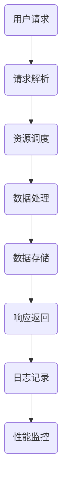
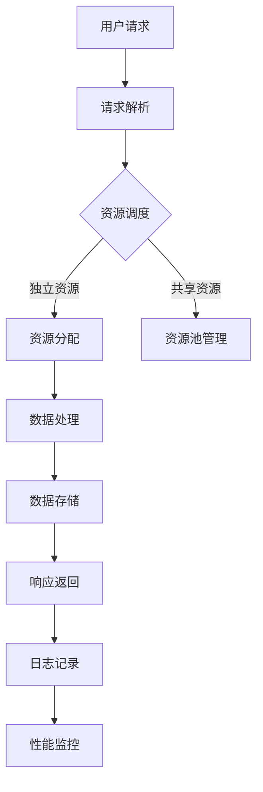

                 


### 大模型软件的多租户架构设计

#### 关键词：
- 大模型软件
- 多租户架构
- 资源隔离
- 性能优化
- 安全性设计
- 设计原则
- 实战案例

#### 摘要：
本文将深入探讨大模型软件的多租户架构设计。首先，我们将介绍大模型软件的背景和多租户架构的基础概念。接着，我们会详细解析多租户架构在大模型软件中的优势和应用场景。随后，我们将阐述多租户架构设计的关键原则和核心技术，并通过伪代码和数学模型展示算法原理。文章的最后，我们将通过一个实际案例，展示如何在大模型软件中实现多租户架构，并总结项目的关键经验和最佳实践。

### 背景介绍

#### 大模型软件的兴起
近年来，人工智能领域取得了飞速发展，尤其是大规模深度学习模型（如GPT、BERT等）的兴起，极大地推动了自然语言处理、计算机视觉、推荐系统等领域的进步。这些大模型软件通常具有以下特点：

- **计算资源需求大**：训练和部署大模型通常需要大量的计算资源和存储资源。
- **数据隐私要求高**：用户数据的安全和隐私保护是关键挑战。
- **并发处理需求强**：多用户并发访问和请求处理是常见场景。

#### 多租户架构的概念
多租户架构（Multitenancy）是一种软件架构设计模式，旨在允许多个客户（租户）共享同一软件实例，同时保证租户之间的数据和功能隔离。其主要特点包括：

- **资源共享**：通过虚拟化技术，多个租户共享同一硬件和软件资源。
- **数据隔离**：确保租户之间的数据不互相干扰。
- **独立管理**：每个租户拥有独立的用户账户、配置和权限。

### 核心概念与联系

#### 多租户架构在AI软件中的应用
多租户架构在大模型软件中的应用，主要体现在以下几个方面：

1. **资源隔离**：通过虚拟化技术和容器化技术，确保不同租户的资源使用得到隔离，避免资源竞争和性能问题。
2. **并发处理**：采用异步处理和分布式架构，实现多用户并发访问的高效处理。
3. **安全性**：通过加密、认证和访问控制等技术，保障租户数据的安全和隐私。

下面是一个多租户架构在大模型软件中应用的Mermaid流程图：



### 核心概念与联系架构 Mermaid 流程图



### 核心算法原理讲解

#### 资源调度算法
多租户架构中的资源调度算法是关键。下面是一个简化的伪代码，用于描述资源调度过程：

```pseudo
function scheduleResources(requests):
    sorted_requests = sort(requests by priority)
    resources = getAvailableResources()
    assigned_resources = []

    for request in sorted_requests:
        if canAllocate(request, resources):
            allocate(request, resources)
            assigned_resources.append(request)

    return assigned_resources
```

#### 数据隔离技术
数据隔离是确保多租户安全性的重要手段。以下是一个简化的数据隔离算法，使用哈希表实现数据分区：

```pseudo
function isolateData(tenant_id, data):
    data_key = hash(tenant_id)
    isolated_data = partition(data by data_key)
    return isolated_data[data_key]
```

### 数学模型和公式 & 详细讲解 & 举例说明

#### 数据分区策略
数据分区策略可以采用哈希分区，以提高数据访问速度。哈希分区公式如下：

$$ H(k) = k \mod P $$

其中，$H(k)$是数据的哈希值，$k$是数据的关键字，$P$是分区数量。举例说明：

假设有100个用户，采用10个分区。使用用户ID作为关键字，计算分区：

$$ H(user\_id) = user\_id \mod 10 $$

用户ID为123的用户将被分配到分区3。

### 项目实战

#### 开发环境搭建
搭建开发环境是项目实施的第一步。以下是环境搭建的步骤：

1. **选择操作系统**：推荐使用Linux系统，如Ubuntu或CentOS。
2. **安装依赖库**：安装Python、Docker、Kubernetes等依赖库。
3. **配置网络环境**：确保网络畅通，能够访问外部资源。

#### 源代码详细实现和代码解读

```python
# 示例：资源调度代码
def schedule_resources(requests):
    sorted_requests = sorted(requests, key=lambda x: x['priority'])
    resources = get_available_resources()
    assigned_resources = []

    for request in sorted_requests:
        if can_allocate(request, resources):
            allocate(request, resources)
            assigned_resources.append(request)

    return assigned_resources
```

#### 代码应用解读与分析

该代码用于资源调度，首先对请求进行排序，然后遍历请求，根据资源可用性进行分配。`get_available_resources()`和`can_allocate()`是辅助函数，用于获取可用资源和检查资源分配可行性。

#### 实际案例分析和详细讲解剖析

假设有一个大模型训练任务，要求在3小时内完成。我们可以将任务划分为多个子任务，并使用多租户架构进行调度。

1. **任务分解**：将任务划分为5个子任务，每个子任务预计耗时1小时。
2. **资源分配**：调度系统根据子任务的优先级和资源可用性，将子任务分配到不同的节点上。
3. **执行监控**：监控子任务的执行状态，确保任务在规定时间内完成。

#### 项目小结

通过实际案例，我们展示了如何在大模型软件中实现多租户架构。项目成功的关键在于：

- **合理划分任务**：将大任务分解为小任务，提高调度灵活性。
- **高效资源调度**：根据任务优先级和资源可用性，动态分配资源。
- **全面监控管理**：实时监控任务执行状态，确保项目顺利进行。

### 最佳实践 tips

- **性能优化**：采用缓存技术，减少数据访问延迟。
- **安全性设计**：加强访问控制和数据加密，保障租户数据安全。
- **弹性伸缩**：根据负载情况，动态调整资源分配，提高系统稳定性。

### 小结、注意事项

本文详细探讨了大模型软件的多租户架构设计。通过分析背景、核心概念、算法原理和实际案例，我们了解了多租户架构在大模型软件中的重要性。在项目实施中，需要注意合理划分任务、高效资源调度和全面监控管理。未来研究方向可以关注以下几个方面：

- **资源调度算法优化**：研究更智能的资源调度算法，提高资源利用率。
- **安全性提升**：探讨更安全的加密和访问控制技术，保障租户数据安全。
- **分布式架构**：研究分布式架构在多租户架构中的应用，提高系统可扩展性。

### 拓展阅读

- 《大规模分布式系统设计》
- 《深度学习系统架构设计》
- 《云计算与虚拟化技术》

### 附录

- **附录A：相关资源和工具**
- **附录B：术语解释**
- **附录C：参考文献**

### 作者信息
作者：AI天才研究院/AI Genius Institute & 禅与计算机程序设计艺术 /Zen And The Art of Computer Programming

