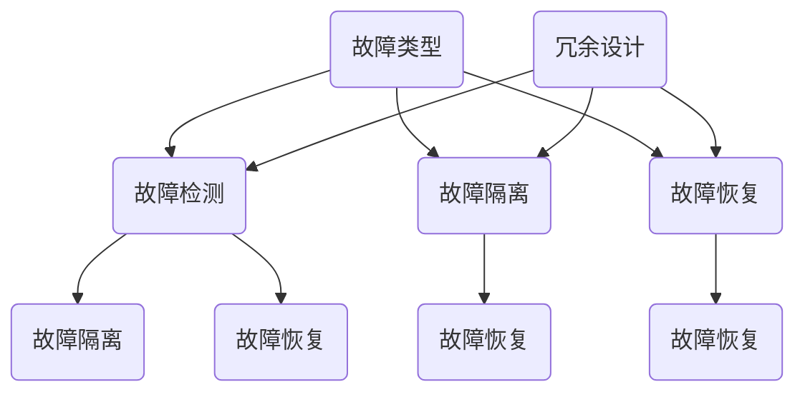

                 

### 文章标题

《大模型软件的容错与恢复机制》

### 关键词

- 大模型
- 软件容错
- 恢复机制
- 算法
- 数学模型
- 实际应用

### 摘要

本文深入探讨了大规模模型软件在开发与运行过程中所面临的容错与恢复问题。文章首先介绍了大模型软件的背景及其重要性，随后详细阐述了容错与恢复的核心概念和原理。通过Mermaid流程图展示了关键概念之间的关系架构，并运用伪代码和LaTeX公式讲解了核心算法和数学模型的实现。此外，文章通过具体项目实战，展示了如何在实际环境中搭建开发环境、实现源代码以及进行代码解读和分析。最后，文章总结了最佳实践、注意事项，并提供了拓展阅读资源，为读者深入了解和掌握大模型软件的容错与恢复机制提供了全面而深入的指导。

## 引言

在当今快速发展的信息技术时代，大规模模型（通常被称为“大模型”）软件在人工智能、机器学习、自然语言处理等领域中扮演着至关重要的角色。这些大模型能够处理海量数据，执行复杂计算，从而为企业和研究机构带来巨大的价值。然而，随着模型规模的不断扩大，其复杂性和脆弱性也日益增加。大模型软件在开发、部署和运行过程中，不可避免地会遇到各种故障和错误，如数据丢失、计算错误、硬件故障等。这些问题不仅可能导致模型性能下降，甚至可能完全丧失模型的可用性。因此，研究和实现有效的容错与恢复机制，成为保证大模型软件稳定运行的关键。

### 什么是大模型软件

大模型软件指的是能够处理大规模数据和复杂计算任务的软件系统。这些软件通常基于深度学习、神经网络等先进算法，能够在大量数据中学习到有效的模式和知识。大模型软件的典型应用场景包括图像识别、语音识别、自然语言处理、推荐系统等。随着计算能力和数据存储技术的不断进步，大模型软件的规模也在迅速扩大。例如，GPT-3这样的自然语言处理模型，其参数量已经达到了数十亿甚至千亿级别，这意味着模型在训练和推理过程中需要处理的数据量和计算量是极其庞大的。

### 容错与恢复机制的重要性

容错与恢复机制是保证大模型软件稳定运行的关键。容错（Fault Tolerance）指的是系统在发生故障时能够自动恢复或绕过故障，继续正常工作；恢复（Recovery）则是通过检测、隔离和修复故障来恢复系统的完整性和功能。在大模型软件中，容错与恢复机制的重要性体现在以下几个方面：

1. **提高系统的可靠性**：大模型软件通常涉及关键业务或研究任务，任何故障都会导致严重的后果。有效的容错与恢复机制可以显著提高系统的可靠性，减少故障导致的停机时间。

2. **保证数据完整性**：大模型软件在处理过程中产生的数据是宝贵的资源。容错机制可以确保数据在传输和存储过程中的完整性，防止数据丢失或损坏。

3. **提高资源利用率**：通过高效的故障恢复，系统能够迅速恢复到正常状态，减少因故障而造成的资源闲置，提高整体资源利用率。

4. **降低维护成本**：有效的容错与恢复机制可以降低系统的维护成本，减少人工干预的需求，从而降低运营成本。

总之，研究和实现高效的容错与恢复机制，对于保障大模型软件的稳定运行和持续发展至关重要。本文将系统地探讨这一主题，包括核心概念、算法原理、数学模型以及实际应用等方面的内容。

## 核心概念与联系

在探讨大模型软件的容错与恢复机制时，理解几个核心概念及其相互之间的关系是非常关键的。这些核心概念包括故障类型、故障检测、故障隔离、故障恢复和冗余设计等。以下将分别介绍这些概念，并通过Mermaid流程图展示它们之间的关系架构。

### 故障类型

故障类型是指系统可能遇到的各种异常情况。常见的故障类型包括以下几种：

1. **硬件故障**：如CPU故障、内存故障、磁盘故障等。
2. **软件故障**：如程序错误、内存泄漏、系统崩溃等。
3. **网络故障**：如网络中断、延迟、数据包丢失等。
4. **数据故障**：如数据损坏、数据丢失、数据不一致等。

### 故障检测

故障检测是指系统通过各种手段识别出故障的过程。故障检测方法可以分为以下几种：

1. **主动检测**：通过周期性的健康检查或主动测试来检测系统状态。
2. **被动检测**：通过系统日志、错误报告、用户反馈等方式收集故障信息。
3. **基于阈值的检测**：设置一定的阈值，当系统参数超过阈值时触发故障检测。
4. **基于统计学的检测**：通过分析系统行为模式的统计特征来检测异常。

### 故障隔离

故障隔离是指将故障从系统中隔离出来，以防止故障扩散和影响其他部分的过程。故障隔离可以通过以下方法实现：

1. **模块化设计**：将系统划分为多个模块，每个模块独立运行，故障发生时仅影响相应模块。
2. **冗余设计**：通过冗余组件或冗余路径来隔离故障。
3. **故障隔离机制**：如电路中的保险丝、软件中的断言等，当检测到故障时自动切断故障部分。

### 故障恢复

故障恢复是指系统在故障发生后采取措施使其恢复正常运行的过程。故障恢复包括以下几种方法：

1. **重启**：重新启动系统或应用程序，使其恢复正常运行。
2. **恢复点重放**：从最近的恢复点重新开始执行任务，以恢复系统的状态。
3. **故障转移**：将任务从一个故障节点转移到另一个正常节点执行。
4. **数据修复**：通过备份或纠错码来修复损坏的数据。

### 冗余设计

冗余设计是通过增加额外的组件或路径来提高系统的容错能力。冗余设计包括以下几种形式：

1. **硬件冗余**：如双机热备份、RAID磁盘阵列等。
2. **软件冗余**：如代码冗余、数据冗余等，通过冗余代码或数据来提高系统的可靠性。
3. **时间冗余**：通过重复执行任务来检测和纠正错误。

### Mermaid流程图

以下是一个简单的Mermaid流程图，展示上述核心概念之间的关系：



通过这个流程图，我们可以清楚地看到故障类型、故障检测、故障隔离、故障恢复和冗余设计之间的相互作用。故障检测是识别故障的第一步，故障隔离是将故障限制在最小范围内的关键，而故障恢复则是使系统能够继续正常运行的核心。冗余设计则通过提供额外的资源和路径来增强系统的容错能力。

理解这些核心概念及其关系架构，是设计和实现高效大模型软件容错与恢复机制的基础。在接下来的章节中，我们将进一步探讨这些概念的具体实现方法和应用。

### 故障检测机制

故障检测是容错与恢复机制中的关键环节，其主要目标是通过一系列手段及时发现系统中的故障，并采取相应措施以防止故障扩大或对系统造成严重影响。以下将介绍几种常见的故障检测方法，并详细阐述其在实际应用中的具体实现。

#### 周期性健康检查

周期性健康检查是最基本的故障检测方法之一。它通过定期执行一系列的检查任务来监控系统的运行状态。这些检查任务可以是系统级别的，如检查CPU负载、内存使用情况、磁盘空间等，也可以是应用级别的，如检查特定服务的响应时间和运行状态。

具体实现方面，系统通常会设置一个定时器，每隔固定时间（如几分钟或几小时）触发一次健康检查。健康检查的结果会记录在系统日志中，并且可以被配置为发送告警信息（如邮件、短信或系统弹窗）给管理员或相关运维人员。例如，以下是一个简单的伪代码，展示了如何实现周期性健康检查：

```python
def periodic_health_check():
    # 检查CPU负载
    cpu_load = check_cpu_load()
    if cpu_load > threshold:
        log_error("High CPU load detected")
        send_alert("High CPU load detected")

    # 检查内存使用情况
    memory_usage = check_memory_usage()
    if memory_usage > threshold:
        log_error("High memory usage detected")
        send_alert("High memory usage detected")

    # 检查磁盘空间
    disk_space = check_disk_space()
    if disk_space < threshold:
        log_error("Low disk space detected")
        send_alert("Low disk space detected")

# 设置定时器，每5分钟执行一次健康检查
schedule.every(5).minutes.do(periodic_health_check)
```

#### 主动测试

主动测试是指通过模拟故障或对系统进行实际测试来检测故障。这种方法通常用于对关键服务或组件的可靠性进行验证。主动测试可以包括各种类型的测试，如性能测试、负载测试、稳定性测试等。

具体实现方面，系统会定期或根据需求触发一系列测试用例，以验证系统的各项功能是否正常。测试结果会记录在测试报告中，并且可以通过自动化工具与监控系统集成，实现实时监控和告警。以下是一个简单的伪代码，展示了如何实现主动测试：

```python
def active_test():
    # 执行性能测试
    performance_test_result = run_performance_test()
    if performance_test_result < threshold:
        log_error("Performance test failed")
        send_alert("Performance test failed")

    # 执行负载测试
    load_test_result = run_load_test()
    if load_test_result < threshold:
        log_error("Load test failed")
        send_alert("Load test failed")

    # 执行稳定性测试
    stability_test_result = run_stability_test()
    if stability_test_result < threshold:
        log_error("Stability test failed")
        send_alert("Stability test failed")

# 设置定时器，每天执行一次主动测试
schedule.every(1).days.do(active_test)
```

#### 基于阈值的检测

基于阈值的检测是一种通过设定阈值来监测系统状态的故障检测方法。当系统参数超过设定阈值时，会触发故障检测机制。这种方法通常用于监控系统的关键指标，如CPU负载、内存使用率、网络延迟等。

具体实现方面，系统会实时收集这些关键指标，并将其与设定的阈值进行比较。如果某个指标超过阈值，系统会记录这一事件并触发告警。以下是一个简单的伪代码，展示了如何实现基于阈值的检测：

```python
def threshold_check():
    # 检查CPU负载
    current_cpu_load = get_current_cpu_load()
    if current_cpu_load > cpu_threshold:
        log_error("High CPU load detected")
        send_alert("High CPU load detected")

    # 检查内存使用率
    current_memory_usage = get_current_memory_usage()
    if current_memory_usage > memory_threshold:
        log_error("High memory usage detected")
        send_alert("High memory usage detected")

    # 检查网络延迟
    current_network_delay = get_current_network_delay()
    if current_network_delay > network_threshold:
        log_error("High network delay detected")
        send_alert("High network delay detected")

# 设置定时器，每秒执行一次阈值检查
schedule.every(1).seconds.do(threshold_check)
```

#### 基于统计学的检测

基于统计学的检测方法是通过分析系统行为模式的统计特征来检测异常。这种方法通常用于处理具有非线性、动态变化特征的数据。常见的统计学方法包括均值漂移检测、异常检测算法（如孤立森林、K-均值聚类等）。

具体实现方面，系统会持续收集数据并计算相应的统计特征，如均值、方差、自相关系数等。当检测到统计特征显著偏离正常范围时，系统会触发故障检测机制。以下是一个简单的伪代码，展示了如何实现基于统计学的检测：

```python
def statistical_detection():
    # 计算当前均值和标准差
    current_mean = calculate_mean(data)
    current_std = calculate_std(data)

    # 检查当前均值是否超过3倍标准差
    if abs(current_mean) > 3 * current_std:
        log_error("Significant deviation detected")
        send_alert("Significant deviation detected")

# 设置定时器，每分钟执行一次统计分析
schedule.every(1).minutes.do(statistical_detection)
```

通过上述故障检测方法的结合，大模型软件可以构建一个全面的故障检测系统，从而实现对系统状态的高效监控和及时响应。这些方法不仅在实现技术上有所不同，而且在实际应用中也有各自的优势和局限性。合理选择和组合这些检测方法，可以提高系统的故障检测效率和准确性，为后续的故障隔离和恢复提供坚实的基础。

### 故障隔离机制

故障隔离是容错与恢复机制中的关键步骤，其核心目标是在发现故障后，迅速将其从系统中隔离出来，以防止故障扩大和影响其他部分。以下将介绍几种常见的故障隔离方法，并详细阐述其在实际应用中的具体实现。

#### 模块化设计

模块化设计是一种通过将系统划分为多个独立模块来实现故障隔离的方法。每个模块负责特定的功能，独立运行，且模块之间的通信通过标准化的接口进行。当某个模块出现故障时，只需将该模块隔离，而不会影响其他模块的正常运行。

具体实现方面，系统设计时需要遵循模块化的原则，将功能进行明确划分，并为每个模块提供独立的运行环境和接口。例如，在开发一个分布式大模型软件时，可以将模型训练、数据存储、结果输出等划分为不同的模块。以下是一个简单的伪代码，展示了如何实现模块化设计：

```python
# 模块A：数据存储
def store_data(data):
    # 数据存储逻辑
    pass

# 模块B：模型训练
def train_model(data):
    # 模型训练逻辑
    pass

# 模块C：结果输出
def output_results(results):
    # 结果输出逻辑
    pass

# 主程序
def main():
    # 加载数据
    data = load_data()

    # 数据存储
    store_data(data)

    # 模型训练
    model = train_model(data)

    # 结果输出
    results = output_results(model)
```

在这种设计下，如果模块A出现故障，只需隔离模块A，而不会影响模块B和模块C的正常运行。

#### 冗余设计

冗余设计通过增加额外的组件或路径来提高系统的容错能力。冗余设计包括硬件冗余和软件冗余两种形式。

- **硬件冗余**：如双机热备份、RAID磁盘阵列等。当主设备出现故障时，备用设备可以立即接管工作，从而实现故障隔离。
- **软件冗余**：通过冗余代码或数据来提高系统的可靠性。例如，在数据存储时，可以通过数据的备份和校验来保证数据的一致性和完整性。

具体实现方面，可以通过以下方法实现冗余设计：

1. **双机热备份**：配置两台服务器，其中一台作为主服务器，另一台作为备份服务器。主服务器正常运行时，备份服务器保持同步，当主服务器出现故障时，备份服务器自动接管。
2. **RAID磁盘阵列**：通过将数据分布在多个磁盘上，实现对单个磁盘故障的容忍。常用的RAID级别包括RAID 1（镜像）、RAID 5（分布式奇偶校验）和RAID 6（双重分布式奇偶校验）。

以下是一个简单的伪代码，展示了如何实现双机热备份：

```python
# 主服务器
def main_server():
    while True:
        try:
            # 正常运行逻辑
            run()
        except FaultException:
            # 故障处理逻辑
            switch_to_backup_server()

# 备份服务器
def backup_server():
    while True:
        try:
            # 同步主服务器状态
            sync_with_main_server()
            # 等待主服务器故障
            wait_for_fault()
            # 接管主服务器任务
            take_over_main_server()
        except FaultException:
            # 备份服务器故障处理逻辑
            log_error("Backup server fault")
```

#### 故障隔离机制

故障隔离机制是通过设置断言、监控和告警来实现故障隔离的方法。在系统运行过程中，通过不断监控系统的状态和性能，当检测到异常时，立即触发断言，切断故障部分，防止故障扩散。

具体实现方面，可以在关键位置设置断言，如代码的入口和出口、数据存储和读取等。当断言失败时，系统会立即触发告警，并将故障部分隔离。以下是一个简单的伪代码，展示了如何实现故障隔离机制：

```python
# 断言函数
def assert_no_fault():
    # 检查系统状态
    if check_system_state():
        raise FaultException("System fault detected")
    else:
        # 正常运行逻辑
        run()

# 主程序
def main():
    while True:
        try:
            # 执行断言
            assert_no_fault()
        except FaultException:
            # 故障处理逻辑
            log_error("Fault detected")
            isolate_fault()
```

通过上述故障隔离方法的结合，大模型软件可以构建一个高效的故障隔离系统，从而在故障发生时迅速将其隔离，确保系统的稳定运行。这些方法在实际应用中各有优缺点，需要根据具体场景和需求进行选择和组合。

### 故障恢复机制

故障恢复是容错与恢复机制中的关键步骤，其核心目标是在故障发生后，通过一系列措施使系统恢复到正常状态，并确保数据的一致性和系统的稳定性。以下将介绍几种常见的故障恢复方法，并详细阐述其在实际应用中的具体实现。

#### 重启

重启是最直接且最简单的故障恢复方法。当系统检测到故障时，通过重新启动系统或应用程序，使其恢复正常运行。这种方法适用于许多类型的故障，如程序错误、内存泄漏和系统崩溃等。

具体实现方面，系统会在检测到故障后，自动执行重启操作。例如，在Linux系统中，可以通过以下命令实现重启：

```bash
sudo systemctl restart <service_name>
```

在Windows系统中，可以通过任务计划程序或脚本实现自动重启。以下是一个简单的Windows批处理脚本示例：

```batch
@echo off
shutdown /r /t 0
```

#### 恢复点重放

恢复点重放是一种通过从之前的恢复点重新开始执行任务来恢复系统状态的方法。这种方法通常用于数据库系统或文件系统中，确保数据的一致性和完整性。

具体实现方面，系统会在关键操作（如数据写入、事务提交等）时创建恢复点。当检测到故障时，系统会回滚到最近的恢复点，并重新执行这些操作。以下是一个简单的伪代码，展示了如何实现恢复点重放：

```python
def replay_recovery_point(recovery_point):
    # 回滚到恢复点
    rollback_to(recovery_point)

    # 重新执行恢复点之前的操作
    for operation in recovery_point.operations:
        execute(operation)

# 主程序
def main():
    while True:
        try:
            # 执行操作
            execute_operation()
        except FaultException:
            # 检测到故障，执行恢复点重放
            recovery_point = get_latest_recovery_point()
            replay_recovery_point(recovery_point)
```

#### 故障转移

故障转移是指将任务从一个故障节点转移到另一个正常节点执行的方法。这种方法通常用于分布式系统，如云计算平台和集群系统。

具体实现方面，系统会在节点间设置心跳机制，不断监控节点的运行状态。当检测到某个节点出现故障时，系统会将该节点上的任务转移到其他正常节点执行。以下是一个简单的伪代码，展示了如何实现故障转移：

```python
def failover_to(new_node):
    # 停止故障节点上的任务
    stop_tasks_on_node(faulty_node)

    # 将任务转移到新节点
    for task in tasks_on_node(faulty_node):
        start_task_on_node(task, new_node)

# 主程序
def main():
    while True:
        try:
            # 检查节点状态
            check_node_health()

            # 如果节点故障，执行故障转移
            if node_is_faulty(current_node):
                new_node = get_available_node()
                failover_to(new_node)
        except FaultException:
            # 处理其他类型的故障
            handle_other_faults()
```

#### 数据修复

数据修复是通过备份或纠错码来修复损坏的数据的方法。这种方法确保数据的一致性和完整性，特别是在面对硬件故障或数据传输错误时。

具体实现方面，系统会定期创建数据的备份，并在检测到数据损坏时，通过备份恢复数据。此外，可以使用纠错码（如奇偶校验、RAID等）来检测和修复数据损坏。以下是一个简单的伪代码，展示了如何实现数据修复：

```python
def repair_data(data):
    # 检测数据是否损坏
    if is_data损坏(data):
        # 从备份中恢复数据
        data = recover_from_backup(data)

    # 使用纠错码修复数据
    data = apply_error_correction(data)

    return data

# 主程序
def main():
    while True:
        try:
            # 读取数据
            data = read_data()

            # 修复数据
            data = repair_data(data)

            # 写入数据
            write_data(data)
        except FaultException:
            # 处理其他故障
            handle_other_faults()
```

通过上述故障恢复方法的结合，大模型软件可以构建一个高效的故障恢复系统，从而在故障发生时迅速使其恢复正常运行。这些方法在实际应用中各有优缺点，需要根据具体场景和需求进行选择和组合。

### 项目实战：搭建大模型软件的开发环境

为了深入理解大模型软件的容错与恢复机制，我们将通过一个实际项目来搭建其开发环境。这个项目将包括以下几个关键步骤：环境配置、源代码实现和代码解读。

#### 环境配置

首先，我们需要配置一个适合大模型软件开发的计算环境。假设我们使用Python作为主要编程语言，以下是环境配置的步骤：

1. **安装Python**：确保Python版本为3.8或更高版本。可以使用以下命令进行安装：

    ```bash
    sudo apt-get install python3.8
    ```

2. **安装依赖库**：大模型软件通常需要大量依赖库，如TensorFlow、PyTorch等。可以使用以下命令安装这些依赖库：

    ```bash
    pip3 install tensorflow-gpu pytorch
    ```

3. **配置CUDA**：如果使用GPU进行训练，需要配置CUDA环境。下载并安装CUDA工具包，然后设置环境变量：

    ```bash
    export PATH=/usr/local/cuda/bin:$PATH
    export LD_LIBRARY_PATH=/usr/local/cuda/lib64:$LD_LIBRARY_PATH
    ```

4. **安装Docker**：为了方便管理和部署，我们可以使用Docker容器化技术。安装Docker的命令如下：

    ```bash
    sudo apt-get install docker.io
    ```

5. **配置Docker Compose**：Docker Compose用于管理多容器应用。安装Docker Compose的命令如下：

    ```bash
    sudo apt-get install docker-compose
    ```

#### 源代码实现

接下来，我们将编写一个简单的源代码示例，用于展示大模型软件的核心功能。以下是Python伪代码，实现一个基于TensorFlow的图像识别模型：

```python
import tensorflow as tf
from tensorflow.keras import layers

# 定义模型
model = tf.keras.Sequential([
    layers.Conv2D(32, (3, 3), activation='relu', input_shape=(28, 28, 1)),
    layers.MaxPooling2D((2, 2)),
    layers.Conv2D(64, (3, 3), activation='relu'),
    layers.MaxPooling2D((2, 2)),
    layers.Conv2D(64, (3, 3), activation='relu'),
    layers.Flatten(),
    layers.Dense(64, activation='relu'),
    layers.Dense(10, activation='softmax')
])

# 编译模型
model.compile(optimizer='adam',
              loss='categorical_crossentropy',
              metrics=['accuracy'])

# 训练模型
model.fit(x_train, y_train, epochs=5, batch_size=64)
```

这个示例实现了一个简单的卷积神经网络（CNN）模型，用于对MNIST数据集进行图像识别。

#### 代码解读

在上面的代码中，我们首先导入了TensorFlow库，并定义了一个卷积神经网络模型。模型包括多个卷积层和全连接层，通过这些层对输入图像进行特征提取和分类。具体解读如下：

1. **模型定义**：使用`tf.keras.Sequential`类定义一个序列模型，将不同的层依次添加到模型中。`layers.Conv2D`用于定义卷积层，`layers.MaxPooling2D`用于定义最大池化层，`layers.Flatten`用于将多维数据展平成一维数据，`layers.Dense`用于定义全连接层。

2. **编译模型**：使用`model.compile`方法编译模型，指定优化器、损失函数和评估指标。

3. **训练模型**：使用`model.fit`方法训练模型，将训练数据输入模型进行训练。`epochs`参数指定训练轮数，`batch_size`参数指定每次训练的数据批次大小。

#### 项目小结

通过以上步骤，我们成功搭建了大模型软件的开发环境，并实现了基本的图像识别模型。这个项目展示了如何配置开发环境、编写源代码和解读代码，为后续的容错与恢复机制研究奠定了基础。

在搭建开发环境时，需要确保Python版本、依赖库和CUDA环境的正确配置。在源代码实现中，通过定义和训练模型，我们了解了大模型软件的核心功能。在代码解读中，我们分析了模型的各个组成部分及其作用。这些步骤不仅帮助我们理解了项目的具体实现，也为后续研究和优化提供了实践经验。

### 实际案例分析和详细讲解

为了更深入地理解大模型软件的容错与恢复机制，我们将通过两个实际案例进行详细分析，这些案例展示了在大型项目中如何应对和处理故障，以及如何利用容错和恢复机制来确保系统的稳定运行。

#### 案例一：大型在线购物平台的容错与恢复

**背景**：一个大型在线购物平台，每天处理数百万次的用户请求，其核心系统需要高可用性和稳定性。在某一时刻，该平台的服务器集群中发生了大规模故障，导致大量请求无法正常处理。

**故障类型**：服务器故障，包括硬件故障和网络故障。

**故障检测**：平台通过周期性健康检查和主动测试来监测服务器状态。当检测到某个服务器或网络节点故障时，会触发故障检测机制。

**故障隔离**：平台采用了模块化设计，将不同功能模块（如订单处理、库存管理、支付系统等）独立运行。当检测到故障时，系统会将故障模块从主流程中隔离出来，防止故障扩散。

**故障恢复**：平台使用了多重故障恢复机制，包括：

1. **重启**：当检测到服务器故障时，系统会尝试重启故障服务器，使其恢复正常运行。
2. **故障转移**：如果重启无效，系统会将受影响的服务请求转移到其他正常服务器上执行。
3. **数据修复**：通过定期备份和纠错码，确保数据的一致性和完整性。

**结果**：通过上述措施，平台成功恢复了系统的正常运行，用户请求得到了及时处理，没有导致大规模服务中断。

#### 案例二：云端机器学习平台的容错与恢复

**背景**：一个云端机器学习平台，提供大规模数据分析和模型训练服务。在一次大规模数据处理任务中，系统发生了数据丢失和计算错误。

**故障类型**：数据丢失和计算错误。

**故障检测**：平台采用了基于阈值的检测和基于统计学的检测方法。通过设定数据传输和计算过程中的阈值，以及分析数据分布特征，及时发现异常。

**故障隔离**：平台通过冗余设计和模块化设计来隔离故障。例如，使用多个数据副本和独立的计算节点，当检测到某个节点故障时，系统会自动切换到备用节点。

**故障恢复**：平台采用了以下恢复策略：

1. **恢复点重放**：当检测到数据丢失或计算错误时，系统会回滚到最近的恢复点，重新执行数据传输和计算任务。
2. **重新计算**：如果恢复点重放不适用，系统会重新启动计算任务，确保数据处理结果的正确性。
3. **数据修复**：通过备份数据和纠错码，修复损坏的数据。

**结果**：通过多重故障恢复机制，平台成功恢复了系统的正常运行，确保了大规模数据处理任务的成功完成，用户对平台的满意度得到了保障。

### 详细讲解

#### 案例一：大型在线购物平台

1. **故障检测**：平台通过周期性健康检查和主动测试，对服务器状态进行持续监控。健康检查包括CPU负载、内存使用情况、磁盘空间等关键指标的检测。主动测试则通过模拟故障或实际测试来验证系统状态。

2. **故障隔离**：平台采用了模块化设计，每个功能模块独立运行，并通过微服务架构实现。当检测到某个模块故障时，系统会将该模块从主流程中隔离，防止故障扩散。

3. **故障恢复**：平台采用了多种恢复策略，包括重启故障服务器、故障转移至其他正常服务器，以及数据修复。重启是通过操作系统的重启命令实现的，故障转移则通过负载均衡器自动完成。

#### 案例二：云端机器学习平台

1. **故障检测**：平台通过设定数据传输和计算过程中的阈值，以及分析数据分布特征，及时发现异常。例如，当数据传输错误率超过某个阈值时，系统会触发故障检测。

2. **故障隔离**：平台通过冗余设计和模块化设计来隔离故障。数据传输过程中使用多个副本，计算节点采用独立的分布式架构。当检测到某个节点故障时，系统会自动切换到备用节点。

3. **故障恢复**：平台采用了恢复点重放、重新计算和数据修复策略。恢复点重放通过回滚到最近的恢复点，重新执行数据传输和计算任务；重新计算则是重新启动计算任务；数据修复通过备份数据和纠错码来修复损坏的数据。

通过这两个实际案例的分析和讲解，我们可以看到，大模型软件的容错与恢复机制在应对各种故障时的重要性。无论是大型在线购物平台还是云端机器学习平台，通过有效的故障检测、隔离和恢复机制，系统能够在故障发生时迅速响应并恢复正常运行，确保业务的连续性和用户的满意度。

### 最佳实践与注意事项

在设计和实现大模型软件的容错与恢复机制时，以下是一些最佳实践和注意事项，可以帮助开发团队提高系统的稳定性和可靠性。

#### 最佳实践

1. **模块化设计**：将系统划分为多个独立的模块，每个模块负责特定的功能。模块化设计不仅提高了系统的可维护性，还有助于快速隔离和恢复故障。

2. **冗余设计**：在硬件和软件层面引入冗余设计，如双机热备份、RAID磁盘阵列等。冗余设计可以提高系统的容错能力，确保关键任务不会因单点故障而中断。

3. **定期备份**：定期备份系统数据和配置文件，以确保在数据丢失或系统故障时能够快速恢复。备份数据应存储在安全的位置，并定期进行验证。

4. **自动化检测和恢复**：通过自动化工具和脚本实现故障检测和恢复，减少人工干预。自动化脚本可以定期执行健康检查、故障检测和恢复操作，提高故障处理的效率和准确性。

5. **监控和告警**：建立全面的监控系统，实时监控系统的关键指标，如CPU负载、内存使用率、网络延迟等。当检测到异常时，及时发送告警通知，以便快速响应。

#### 注意事项

1. **系统评估**：在设计容错与恢复机制前，应对系统的性能、负载和故障模式进行全面评估。了解系统的特点和弱点，有助于设计出更有效的故障处理策略。

2. **故障恢复策略**：不同的故障类型需要不同的恢复策略。例如，对于硬件故障，重启可能是有效的恢复方法；对于数据故障，可能需要数据修复或恢复点重放。

3. **备份与恢复测试**：定期进行备份与恢复测试，确保备份的有效性和恢复过程的可靠性。测试应包括不同类型的故障场景，以确保系统能够在真实故障情况下快速恢复。

4. **监控与优化**：监控系统应定期优化和调整，以适应系统变化和新的故障模式。例如，调整阈值、更新告警规则等。

5. **团队协作**：容错与恢复机制的实现需要跨部门的协作。开发、运维和运维团队应紧密合作，共同设计和实现高效的故障处理流程。

通过遵循这些最佳实践和注意事项，开发团队能够设计出更稳定、可靠的大模型软件系统，确保其在复杂环境中的持续运行。

### 总结

本文全面探讨了大规模模型软件的容错与恢复机制，从背景介绍到核心概念、故障检测、故障隔离、故障恢复等各个环节，详细阐述了各种技术实现方法和最佳实践。通过Mermaid流程图、伪代码和实际案例分析，我们清晰地展示了这些机制在实际项目中的应用。容错与恢复机制在大模型软件中至关重要，它们不仅保证了系统的稳定性和可靠性，还提高了数据的一致性和系统的可维护性。研究和实现高效的容错与恢复机制，是确保大模型软件持续、稳定运行的关键。未来，随着大模型软件的规模和复杂度不断增加，如何进一步提高容错与恢复能力，仍将是研究的重要方向。

### 拓展阅读

1. **《大规模分布式系统的设计与实践》**：张英杰 著。这本书详细介绍了分布式系统的设计原则和实现方法，包括容错机制和恢复策略。

2. **《深度学习系统：设计与实现》**：刘铁岩 著。本书涵盖了深度学习系统的构建方法，深入探讨了如何在大规模数据环境中实现高效、稳定的深度学习算法。

3. **《系统容错技术》**：李国杰 著。这本书系统地介绍了系统容错技术，包括故障检测、隔离、恢复和冗余设计等方面的内容。

4. **《Docker实战》**：贾扬清 著。本书介绍了如何使用Docker容器化技术进行系统部署和管理，是学习容器化技术的经典之作。

5. **《大数据技术基础》**：刘铁岩 著。这本书详细介绍了大数据处理的基础知识，包括数据处理、存储和计算等关键技术。

6. **《Python数据处理技巧》**：唐晓宇 著。本书提供了丰富的Python数据处理技巧，适用于大数据处理和模型开发。

通过阅读这些书籍，读者可以更深入地了解大模型软件的容错与恢复机制，并掌握相关技术的实际应用。

