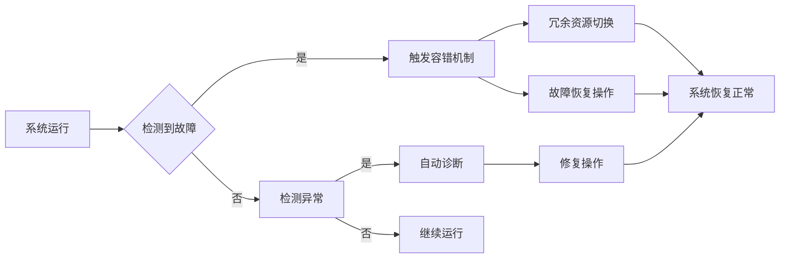

                 

### 文章标题

《大模型软件的容错与自愈机制设计》

---

关键词：大模型软件、容错机制、自愈机制、设计、算法、数学模型

---

摘要：本文旨在探讨大模型软件在面临复杂计算环境时，如何通过有效的容错与自愈机制设计，提升软件的可靠性与稳定性。文章首先介绍了大模型软件的基本概念与现状，然后详细阐述了容错与自愈机制的核心概念、原理及其相互关系。接着，文章深入分析了核心算法原理，并通过伪代码、数学模型和公式进行了详细讲解。最后，文章通过实际案例展示了如何在大模型软件中实现容错与自愈机制，并提出了相关最佳实践与注意事项。

---

## 目录

1. 引言与背景
2. 大模型软件的基本概念
3. 容错机制原理
4. 自愈机制原理
5. 大模型软件的容错与自愈机制联系
6. 容错算法
7. 自愈算法
8. 容错与自愈算法的融合
9. 大模型软件的数学模型
10. 容错与自愈机制的数学模型
11. 项目实战
12. 总结与展望

---

### 1. 引言与背景

大模型软件是近年来人工智能领域的重要研究方向，其核心在于通过大规模的神经网络模型来处理复杂的计算任务。随着深度学习技术的快速发展，大模型软件在自然语言处理、计算机视觉、语音识别等众多领域取得了显著的成果。然而，大模型软件在运行过程中面临着诸多挑战，如数据质量不稳定、计算资源受限、网络延迟等问题，这些因素都可能对软件的可靠性与稳定性造成影响。

在这种背景下，容错与自愈机制设计成为大模型软件研究的重要方向。容错机制旨在通过冗余设计、故障检测与恢复等手段，确保软件在发生故障时能够快速恢复，保持正常运行。自愈机制则进一步通过自动检测、诊断与修复，实现软件的自我修复能力，从而提高系统的整体可靠性与稳定性。

本文将从以下几个方面展开讨论：首先，介绍大模型软件的基本概念与现状；其次，详细阐述容错与自愈机制的核心概念、原理及其相互关系；然后，深入分析核心算法原理，并通过伪代码、数学模型和公式进行详细讲解；接着，通过实际案例展示如何在大模型软件中实现容错与自愈机制；最后，总结全文并提出相关最佳实践与注意事项。

### 2. 大模型软件的基本概念

大模型软件，通常指的是那些基于深度学习技术，使用大规模神经网络模型进行训练和推断的软件系统。这些软件系统在处理复杂任务时，依赖于巨大的计算资源，并且能够处理海量的数据。大模型软件的发展得益于以下几个关键因素：

**深度学习技术的突破**：深度学习技术的快速发展，特别是卷积神经网络（CNN）和递归神经网络（RNN）等结构的创新，使得大模型软件在图像识别、自然语言处理等领域的性能显著提升。

**计算能力的提升**：随着硬件技术的发展，特别是GPU和TPU等专用计算设备的普及，大模型软件所需的计算资源得到了极大的提升。

**数据量的激增**：互联网的普及和数据收集技术的进步，使得各类领域的数据量呈现爆炸式增长，为大模型软件提供了丰富的训练数据。

**开源框架的支持**：诸如TensorFlow、PyTorch等开源深度学习框架的诞生，为开发大模型软件提供了便利，降低了技术门槛。

大模型软件的基本组成模块通常包括以下几部分：

1. **数据预处理模块**：负责数据的清洗、格式转换等预处理工作，以保证输入数据的质量和一致性。

2. **模型训练模块**：使用预处理后的数据进行模型训练，包括前向传播、反向传播等步骤，以不断优化模型的参数。

3. **模型评估模块**：通过测试数据集对训练完成的模型进行评估，以判断模型的性能是否符合预期。

4. **模型推断模块**：将新的输入数据传递给训练好的模型，进行预测或分类。

5. **后处理模块**：对模型的输出结果进行后处理，如结果可视化、决策规则生成等。

大模型软件的工作流程通常可以分为以下几个阶段：

1. **数据收集**：从各种数据源收集原始数据。

2. **数据预处理**：对原始数据进行清洗、归一化等处理。

3. **模型训练**：使用预处理后的数据对神经网络模型进行训练。

4. **模型评估**：使用测试数据集评估模型的性能。

5. **模型推断**：使用训练好的模型对新的数据进行预测或分类。

6. **后处理**：对推断结果进行后处理，生成最终的输出。

大模型软件的性能指标主要包括：

1. **准确性**：模型对样本的预测正确的比例。

2. **召回率**：在所有正类样本中，模型正确识别的比例。

3. **精确率**：在所有预测为正类的样本中，实际为正类的比例。

4. **F1 分数**：精确率和召回率的调和平均。

5. **模型推理速度**：模型对输入数据进行处理的平均时间。

6. **模型复杂度**：模型的参数数量和计算复杂度。

通过上述介绍，我们可以看出，大模型软件在人工智能领域具有广泛的应用前景。然而，大模型软件的可靠性与稳定性仍然是当前面临的主要挑战之一。为了应对这些挑战，设计有效的容错与自愈机制成为关键。

### 3. 容错机制原理

容错机制（Fault Tolerance Mechanism）是一种通过冗余设计、故障检测与恢复等手段，确保系统在发生故障时能够继续正常运行或快速恢复的机制。在大模型软件中，容错机制尤为重要，因为大模型软件通常涉及大量的计算资源和复杂的数据处理流程，任何环节的故障都可能导致整个系统的瘫痪。

**容错机制的分类**

根据实现方式的不同，容错机制可以分为以下几种：

1. **硬件冗余**：通过增加硬件冗余来提高系统的可靠性。例如，使用多台服务器组成集群，通过负载均衡和故障转移来保证系统的连续运行。

2. **软件冗余**：通过冗余的软件代码或模块来提高系统的可靠性。例如，使用多线程或分布式计算，使系统能够在部分模块故障时仍能正常运行。

3. **冗余数据存储**：通过冗余的数据存储方式来确保数据的完整性。例如，使用数据备份和去重技术，使系统能够在数据损坏时快速恢复。

4. **故障检测与恢复**：通过实时监控和故障检测，及时发现系统故障并进行恢复。例如，使用心跳检测和自动重启机制，确保系统在故障发生时能够快速恢复。

**容错机制的设计原则**

为了设计有效的容错机制，需要遵循以下原则：

1. **冗余度**：合理选择冗余度，既要避免过度冗余导致资源浪费，也要确保冗余能够覆盖潜在的故障。

2. **可恢复性**：设计容错机制时，要确保系统能够在故障发生后迅速恢复，降低故障对系统运行的影响。

3. **透明性**：容错机制对用户和应用程序应该是透明的，即用户和应用程序不应该感觉到系统的故障和恢复。

4. **高效性**：容错机制应尽可能高效，避免引入过多的延迟和资源消耗。

5. **可靠性**：容错机制本身也需要具备高可靠性，以防止自身成为系统故障的来源。

**容错机制的实现方式**

容错机制的实现方式多种多样，以下是一些常见的实现方式：

1. **多副本冗余**：在系统中部署多个副本，通过比较不同副本的结果来确保结果的正确性。

2. **负载均衡**：通过负载均衡器来分配计算任务，使系统能够在部分节点故障时仍能正常运行。

3. **自动重启**：当检测到系统故障时，自动重启受影响的模块或节点。

4. **故障检测与恢复**：通过实时监控和故障检测，及时发现系统故障并进行恢复。

5. **数据备份与恢复**：定期备份数据，并在数据损坏时快速恢复。

通过上述容错机制的原理、分类、设计原则和实现方式的分析，我们可以更好地理解如何在复杂的大模型软件环境中设计有效的容错机制，从而提高系统的可靠性与稳定性。

### 4. 自愈机制原理

自愈机制（Self-healing Mechanism）是一种通过自动检测、诊断与修复，实现系统自我修复能力的机制。在大模型软件中，自愈机制尤为重要，因为大模型软件通常涉及复杂的计算流程和大量的数据交换，任何环节的故障或异常都可能导致整个系统的瘫痪。自愈机制的核心目标是通过自动化的方式，减少系统停机时间，提高系统的可靠性和稳定性。

**自愈机制的分类**

根据实现方式的不同，自愈机制可以分为以下几种：

1. **自动检测**：通过监控系统状态和性能指标，自动检测到系统中的异常情况。例如，通过监控CPU使用率、内存占用率、网络延迟等指标，自动检测到系统异常。

2. **自动诊断**：在检测到异常后，自动分析异常原因，确定故障点。例如，通过日志分析、错误码解析等手段，自动诊断出系统故障的具体原因。

3. **自动修复**：在诊断出故障后，自动执行修复操作，使系统恢复正常运行。例如，通过自动重启故障模块、重新加载配置文件、恢复备份数据等手段，自动修复系统故障。

**自愈机制的设计原则**

为了设计有效的自愈机制，需要遵循以下原则：

1. **实时性**：自愈机制应具备实时性，能够快速检测到系统故障并自动修复。

2. **准确性**：自愈机制应具备高准确性，能够准确地检测和诊断系统故障。

3. **自动化**：自愈机制应尽可能自动化，减少人工干预，提高故障修复的效率。

4. **灵活性**：自愈机制应具备灵活性，能够适应不同的故障场景和系统环境。

5. **可扩展性**：自愈机制应具备可扩展性，能够支持系统规模的扩展和功能的增加。

**自愈机制的实现方式**

自愈机制的实现方式多种多样，以下是一些常见的实现方式：

1. **异常检测与报警**：通过监控系统状态和性能指标，自动检测到异常情况，并通过报警系统通知相关人员。

2. **自动诊断与日志分析**：在检测到异常后，自动分析日志文件和错误码，确定故障点，并生成故障报告。

3. **自动修复与重启**：在诊断出故障后，自动执行修复操作，如重启故障模块、重新加载配置文件等。

4. **数据备份与恢复**：定期备份数据，并在数据损坏时自动恢复。

5. **智能化决策**：通过机器学习算法和大数据分析，实现故障预测和预防。

通过上述自愈机制的原理、分类、设计原则和实现方式的分析，我们可以更好地理解如何在复杂的大模型软件环境中设计有效的自愈机制，从而提高系统的可靠性和稳定性。

### 5. 大模型软件的容错与自愈机制联系

在大模型软件的设计过程中，容错机制和自愈机制是两个关键组成部分，它们之间存在着密切的联系和相互补充的关系。理解这两者之间的相互作用，有助于我们设计出更为可靠和高效的大模型软件系统。

**容错机制与自愈机制的关联**

1. **容错机制的基础作用**：容错机制主要关注系统在发生故障时如何维持正常运行或快速恢复。它通常通过冗余设计、故障检测和恢复等手段来实现。这些机制为系统的连续运行提供了基础保障，确保在大规模数据处理过程中不会因单一故障而造成整个系统的崩溃。

2. **自愈机制的附加作用**：自愈机制则是在容错机制的基础上，进一步增强了系统的自我修复能力。它通过自动化的方式，对系统中的异常进行检测、诊断和修复，从而在容错机制的基础上，提升了系统的整体稳定性和可靠性。

**容错与自愈机制的具体联系**

1. **容错机制的触发条件**：当系统检测到某种故障或异常时，容错机制会被触发。此时，系统可能会切换到冗余资源，或者执行故障恢复操作，如重启模块或重新加载配置。

2. **自愈机制的介入时机**：在容错机制执行故障恢复操作的同时，自愈机制会开始工作。自愈机制会进一步分析故障的根本原因，并尝试进行更深入的修复，如修复损坏的数据或调整系统配置。

3. **容错与自愈的协同作用**：在实际应用中，容错和自愈机制通常是协同工作的。例如，在检测到系统性能下降时，容错机制可能会启动负载均衡，将部分计算任务转移到其他节点；而自愈机制则会通过监控和分析，识别出导致性能下降的具体原因，并自动执行相应的修复操作，如清理缓存或优化系统配置。

**容错与自愈机制的联系架构**

为了更好地理解容错与自愈机制之间的联系，我们可以使用Mermaid流程图来展示它们的工作流程。以下是一个简化的Mermaid流程图示例：



在这个流程图中，系统在正常运行时，会定期进行故障检测。如果检测到故障，系统会触发容错机制，包括冗余资源切换和故障恢复操作。如果检测到异常，系统会启动自愈机制进行自动诊断和修复。最终，无论是通过容错机制还是自愈机制，系统都会恢复到正常状态。

通过上述分析，我们可以看到，容错机制和自愈机制在大模型软件中起着至关重要的作用。它们不仅相互补充，还共同提高了系统的可靠性和稳定性。在实际应用中，合理设计和实施这两种机制，可以显著提升大模型软件的性能和用户体验。

### 6. 容错算法

在实现大模型软件的容错机制时，选择合适的容错算法至关重要。容错算法旨在通过冗余设计、故障检测与恢复等手段，确保系统在发生故障时能够快速恢复，保持正常运行。以下将介绍几种常见的容错算法，并使用伪代码进行详细阐述。

#### 1. 多副本冗余算法

多副本冗余算法通过在系统中部署多个副本，并通过比较不同副本的结果来确保系统的正确性和可靠性。以下是多副本冗余算法的伪代码：

```python
def 多副本冗余算法(input_data, replicas, majority_threshold):
    results = []
    for replica in replicas:
        result = replica.predict(input_data)
        results.append(result)
    
    majority_results = count Majority(results, majority_threshold)
    final_result = choose_final_result(majority_results)
    return final_result

def count Majority(results, threshold):
    count = 0
    for result in results:
        if result == majority_value:
            count += 1
    return count >= threshold

def choose_final_result(majority_results):
    return majority_value

# 参数解释
# input_data：输入数据
# replicas：副本列表
# majority_threshold：多数阈值
```

在这个算法中，`majority_threshold` 参数表示需要多少个副本的结果相同，才能认为最终结果是正确的。如果多于阈值的副本给出了相同的结果，则选择这个结果作为最终输出。

#### 2. 选举算法

选举算法通过在系统中选出一个主节点，其他节点作为备份节点。当主节点故障时，备份节点会自动切换为主节点。以下是选举算法的伪代码：

```python
def 选举算法(nodes):
    current_leader = None
    for node in nodes:
        if current_leader is None or node.leader_election_rank < current_leader.leader_election_rank:
            current_leader = node
    
    return current_leader

class Node:
    def __init__(self, id, leader_election_rank):
        self.id = id
        self.leader_election_rank = leader_election_rank
    
    def predict(self, input_data):
        # 预测操作
        pass

    def become_leader(self):
        # 切换为主节点的操作
        pass
```

在这个算法中，`leader_election_rank` 参数表示节点的选举优先级。选举算法通过遍历所有节点，选择选举优先级最高的节点作为主节点。

#### 3. 负载均衡算法

负载均衡算法通过在多个节点之间分配计算任务，确保系统在部分节点故障时仍能正常运行。以下是负载均衡算法的伪代码：

```python
def 负载均衡算法(nodes, tasks):
    for task in tasks:
        if nodes_are_available(nodes):
            assign_task_to_node(task, select_random_node(nodes))
        else:
            wait_until_nodes_are_available()

def nodes_are_available(nodes):
    for node in nodes:
        if node.is_available():
            return True
    return False

def select_random_node(nodes):
    return random.choice(nodes)

def assign_task_to_node(task, node):
    node.process_task(task)
```

在这个算法中，当有新的计算任务时，如果所有节点都可用，则随机选择一个节点来处理任务；否则，系统将等待直到有节点可用。

通过上述三种容错算法的介绍和伪代码实现，我们可以看到，选择合适的容错算法对于确保大模型软件的可靠性和稳定性至关重要。在实际应用中，可以根据具体的系统需求和故障模式，灵活选择和组合这些算法。

### 7. 自愈算法

在大模型软件的运行过程中，自愈机制通过自动检测、诊断和修复来提高系统的可靠性和稳定性。自愈算法是实现这一目标的核心组件，以下将介绍几种常见的自愈算法，并使用伪代码进行详细阐述。

#### 1. 异常检测算法

异常检测算法用于监控系统的运行状态，及时发现异常情况。以下是一种基于统计方法（如Z分数）的异常检测算法的伪代码：

```python
def 异常检测算法(data_stream, mean, std_dev):
    for data_point in data_stream:
        z_score = (data_point - mean) / std_dev
        if abs(z_score) > threshold:
            report_anomaly(data_point)

def report_anomaly(data_point):
    # 记录异常并触发自愈流程
    log_anomaly(data_point)
    trigger_self_healing()

def log_anomaly(data_point):
    # 将异常记录到日志中
    log("Anomaly detected: " + str(data_point))

def trigger_self_healing():
    # 触发自愈流程
    self_heal_system()
```

在这个算法中，`mean` 和 `std_dev` 分别表示数据的平均值和标准差，`threshold` 是设定的异常阈值。当检测到数据点的Z分数大于阈值时，算法会报告异常并触发自愈流程。

#### 2. 故障诊断算法

故障诊断算法用于分析异常情况，确定故障原因。以下是一种基于决策树（Decision Tree）的故障诊断算法的伪代码：

```python
def 故障诊断算法 symptoms:
    if symptoms.include("CPU过高"):
        return "CPU负载过高"
    elif symptoms.include("内存不足"):
        return "内存不足"
    elif symptoms.include("网络延迟"):
        return "网络延迟"
    else:
        return "未知故障"

def symptoms:
    # 获取系统症状
    return ["CPU过高", "内存不足", "网络延迟"]
```

在这个算法中，`symptoms` 是一个包含系统症状的列表，算法根据这些症状判断故障原因。这种基于规则的诊断方法简单直观，但可能无法处理复杂的故障场景。

#### 3. 修复算法

修复算法用于根据故障诊断的结果，自动执行修复操作。以下是一种基于脚本执行（Script Execution）的修复算法的伪代码：

```python
def 修复算法 diagnosis, repair_scripts:
    if diagnosis == "CPU负载过高":
        execute_script("降低CPU负载")
    elif diagnosis == "内存不足":
        execute_script("增加内存")
    elif diagnosis == "网络延迟":
        execute_script("优化网络配置")
    else:
        execute_script("执行通用修复脚本")

def execute_script(script_name):
    # 执行修复脚本
    run_script(script_name)
    log("Script executed: " + script_name)

def run_script(script_name):
    # 运行脚本
    execute_command("python " + script_name + ".py")
```

在这个算法中，`repair_scripts` 是一个包含各种修复脚本的字典，根据诊断结果选择并执行相应的修复脚本。这种基于脚本的方法灵活性强，但需要确保脚本的可靠性和有效性。

通过上述三种自愈算法的介绍和伪代码实现，我们可以看到，自愈算法在大模型软件中发挥着重要作用。通过自动检测、诊断和修复，自愈算法能够有效提升系统的可靠性和稳定性。在实际应用中，可以根据具体需求和环境，灵活选择和组合这些算法。

### 8. 容错与自愈算法的融合

在实际应用中，大模型软件往往需要同时具备容错和自愈能力，以保证系统在面临各种故障和异常情况时，能够快速恢复并保持正常运行。因此，将容错算法与自愈算法有效融合，形成一种综合性的容错与自愈机制，具有重要意义。

#### 融合原理

容错与自愈算法的融合基于以下几个核心原理：

1. **实时监控与反馈**：通过实时监控系统状态和性能指标，及时发现异常情况，为容错和自愈机制提供实时反馈。

2. **故障层次化处理**：首先使用容错机制应对突发性故障，如硬件故障、网络中断等。当系统在容错机制的保护下仍然出现异常时，触发自愈机制进行深入诊断和修复。

3. **自动化与人工干预**：自愈机制在多数情况下应实现自动化，减少人工干预。但对于复杂的故障情况，仍需保留人工干预的选项，确保系统能够在关键时候获得有效的支持。

4. **冗余与智能修复**：通过冗余设计提供基础容错能力，同时结合智能修复算法，实现自动化的故障恢复。

#### 伪代码实现

以下是一个简化的容错与自愈算法融合的伪代码实现：

```python
def 容错与自愈融合机制(input_data, system_state):
    if system_state.has_fault():
        try:
            recover_fault()  # 尝试恢复故障
        except FaultNotRecoverable:
            trigger_self_healing()  # 故障无法恢复，触发自愈机制
    
    if system_state.has_anomaly():
        diagnose_anomaly()  # 诊断异常
        if anomaly_severity > threshold:
            execute_repair()  # 执行修复操作
    
    predict_result = system.predict(input_data)
    return predict_result

def system:
    def has_fault():
        # 检测系统是否存在故障
        pass
    
    def recover_fault():
        # 尝试恢复故障
        pass
    
    def has_anomaly():
        # 检测系统是否存在异常
        pass
    
    def diagnose_anomaly():
        # 诊断异常
        pass
    
    def predict(input_data):
        # 进行预测
        pass

def trigger_self_healing():
    # 触发自愈流程
    log("触发自愈机制")
    diagnose_fault()
    execute_repair()

def diagnose_fault():
    # 诊断故障
    pass

def execute_repair():
    # 执行修复操作
    pass
```

在这个伪代码中，`system` 类代表大模型软件的系统状态，包括故障检测、故障恢复、异常检测、异常诊断和预测等功能。当系统检测到故障或异常时，首先尝试通过容错机制进行恢复。如果故障无法恢复，则触发自愈机制进行深入诊断和修复。

#### 融合的工作流程

1. **系统运行**：大模型软件正常运行，实时监控系统状态和性能指标。

2. **故障检测**：系统定期检查是否存在故障，如硬件故障、网络中断等。

3. **故障恢复**：当检测到故障时，系统尝试通过容错机制进行恢复。

4. **异常检测**：系统同时监测系统状态，如CPU使用率、内存占用等，以检测是否存在异常。

5. **异常诊断**：当检测到异常时，系统进行深入诊断，确定异常原因。

6. **异常处理**：根据诊断结果，执行相应的修复操作，如重启模块、清理缓存等。

7. **结果预测**：系统对输入数据进行预测，输出预测结果。

通过上述容错与自愈算法的融合原理和伪代码实现，我们可以看到，这种融合机制能够有效提升大模型软件的可靠性和稳定性。在实际应用中，可以根据具体需求和环境，进一步优化和调整容错与自愈机制的设计。

### 9. 大模型软件的数学模型

在大模型软件的设计和实现过程中，数学模型扮演着至关重要的角色。数学模型不仅帮助我们理解和描述系统的行为，还能够为算法优化和性能评估提供理论依据。以下将介绍大模型软件的数学模型，并对其进行详细讲解。

#### 1. 神经网络模型

神经网络（Neural Network，NN）是现代深度学习算法的核心组成部分，也是大模型软件的基础。神经网络模型由多个神经元（或节点）组成，每个神经元都与其他神经元相连，并通过权重（weights）和偏置（biases）进行参数调整。

**基本结构**：

神经网络通常包含输入层、隐藏层和输出层。输入层接收外部输入数据，隐藏层通过非线性激活函数进行处理，输出层生成最终的输出结果。

**数学描述**：

- 输入层：\[ x_1, x_2, ..., x_n \]
- 权重矩阵：\[ W \]
- 偏置向量：\[ b \]
- 激活函数：\[ f(\cdot) \]

对于隐藏层，输出可以表示为：

\[ z_i = \sum_{j=1}^{n} W_{ij} x_j + b_i \]

\[ a_i = f(z_i) \]

其中，\( z_i \) 是第 \( i \) 个神经元的净输入，\( a_i \) 是第 \( i \) 个神经元的激活值。

对于输出层，输出可以表示为：

\[ y_i = \sum_{j=1}^{n} W_{ij} a_j + b_i \]

\[ \hat{y}_i = f(\hat{z}_i) \]

其中，\( \hat{z}_i \) 是输出层的净输入，\( \hat{y}_i \) 是预测值。

#### 2. 损失函数

损失函数（Loss Function）用于衡量预测值与真实值之间的差异，是神经网络训练过程中的核心组件。常见的损失函数包括均方误差（MSE）、交叉熵损失（Cross-Entropy Loss）等。

**均方误差（MSE）**：

\[ L = \frac{1}{2} \sum_{i=1}^{n} (\hat{y}_i - y_i)^2 \]

其中，\( \hat{y}_i \) 是第 \( i \) 个预测值，\( y_i \) 是第 \( i \) 个真实值。

**交叉熵损失（Cross-Entropy Loss）**：

\[ L = -\sum_{i=1}^{n} y_i \log(\hat{y}_i) \]

其中，\( y_i \) 是第 \( i \) 个真实值的概率分布，\( \hat{y}_i \) 是第 \( i \) 个预测值的概率分布。

#### 3. 优化算法

优化算法（Optimization Algorithm）用于调整神经网络的权重和偏置，以最小化损失函数。常见的优化算法包括随机梯度下降（SGD）、Adam优化器等。

**随机梯度下降（SGD）**：

\[ \theta_{t+1} = \theta_{t} - \alpha \cdot \nabla L(\theta_{t}) \]

其中，\( \theta \) 表示权重和偏置，\( \alpha \) 是学习率，\( \nabla L(\theta_{t}) \) 是损失函数关于 \( \theta \) 的梯度。

**Adam优化器**：

\[ m_t = \beta_1 m_{t-1} + (1 - \beta_1) \nabla L(\theta_{t}) \]

\[ v_t = \beta_2 v_{t-1} + (1 - \beta_2) (\nabla L(\theta_{t})^2) \]

\[ \theta_{t+1} = \theta_{t} - \alpha \cdot \frac{m_t}{\sqrt{v_t} + \epsilon} \]

其中，\( \beta_1 \) 和 \( \beta_2 \) 分别是动量参数，\( \epsilon \) 是一个很小的常数，用于避免分母为零。

#### 4. 数学模型的应用

数学模型在大模型软件中具有广泛的应用，包括：

- **特征工程**：通过数学模型提取和选择有用的特征，以提高模型的性能和泛化能力。
- **模型评估**：使用数学模型评估模型的性能，如计算准确率、召回率等指标。
- **算法优化**：通过数学模型优化模型的参数和结构，以提升模型的效率和效果。
- **推理与预测**：利用训练好的数学模型进行推理和预测，生成最终的输出结果。

通过上述对大模型软件数学模型的介绍和详细讲解，我们可以更好地理解其在软件设计和实现中的重要性。在实际应用中，可以根据具体需求和环境，灵活选择和调整数学模型，以实现最佳的性能和效果。

### 10. 容错与自愈机制的数学模型

在实现大模型软件的容错与自愈机制时，数学模型扮演着关键角色。这些模型不仅帮助我们理解和描述系统的行为，还为故障检测、故障诊断和修复提供了量化依据。以下将介绍容错与自愈机制的数学模型，并对其进行详细讲解。

#### 1. 故障检测模型

故障检测模型主要用于监控系统的运行状态，及时发现异常情况。常见的故障检测模型包括统计过程控制（Statistical Process Control，SPC）和基于机器学习的故障检测算法。

**统计过程控制（SPC）**：

统计过程控制是一种基于统计方法的故障检测技术，它通过监控过程变量的统计特性（如均值、方差等），判断过程是否处于受控状态。

- **均值控制图**：

\[ \bar{x} = \frac{1}{n} \sum_{i=1}^{n} x_i \]

\[ R = \sqrt{\frac{1}{n-1} \sum_{i=1}^{n} (x_i - \bar{x})^2 } \]

\[ \bar{x}_{\text{上}} = \bar{x} + A_2 R \]

\[ \bar{x}_{\text{下}} = \bar{x} - A_2 R \]

其中，\( x_i \) 是第 \( i \) 个样本值，\( n \) 是样本数量，\( A_2 \) 是控制图系数。

当样本均值 \( \bar{x} \) 超出控制上限或控制下限时，认为系统存在异常。

- **方差控制图**：

\[ s = \sqrt{\frac{1}{n-1} \sum_{i=1}^{n} (x_i - \bar{x})^2 } \]

\[ D_4 = \frac{1}{n-1} \sum_{i=1}^{n} \left( \frac{x_i - \bar{x}}{s} \right)^4 \]

\[ D_3 = \frac{1}{n-1} \sum_{i=1}^{n} \left( \frac{x_i - \bar{x}}{s} \right)^3 \]

\[ \bar{D_4} = \frac{1}{n} \sum_{i=1}^{n} D_4 \]

\[ \bar{D_3} = \frac{1}{n} \sum_{i=1}^{n} D_3 \]

\[ D_3_{\text{上}} = D_3 + A_3 \sqrt{\bar{D_3}} \]

\[ D_3_{\text{下}} = D_3 - A_3 \sqrt{\bar{D_3}} \]

\[ D_4_{\text{上}} = D_4 + A_4 \sqrt{\bar{D_4}} \]

\[ D_4_{\text{下}} = D_4 - A_4 \sqrt{\bar{D_4}} \]

当 \( D_3 \) 或 \( D_4 \) 超出控制上限或控制下限时，认为系统存在异常。

**机器学习故障检测算法**：

基于机器学习的故障检测算法，如支持向量机（Support Vector Machine，SVM）和神经网络（Neural Network，NN），通过学习正常数据和故障数据，构建分类模型，用于实时检测系统的故障。

- **支持向量机（SVM）**：

\[ \text{maximize} \, \frac{1}{2} \| W \|^2 \]

\[ s.t. \, y_i ( \langle \textbf{x}_i, \textbf{w} \rangle - b ) \geq 1 \, \forall i \]

其中，\( \textbf{x}_i \) 是特征向量，\( y_i \) 是标签，\( \textbf{w} \) 是权重向量，\( b \) 是偏置。

- **神经网络（NN）**：

\[ z_i = \sum_{j=1}^{n} W_{ij} x_j + b_i \]

\[ a_i = f(z_i) \]

\[ \hat{y} = \text{argmax}_{i} \, a_i \]

其中，\( f(\cdot) \) 是激活函数，\( \hat{y} \) 是预测故障的类别。

#### 2. 故障诊断模型

故障诊断模型用于分析系统的异常情况，确定故障原因。常见的故障诊断模型包括决策树（Decision Tree）、贝叶斯网络（Bayesian Network）和深度学习（Deep Learning）模型。

- **决策树（Decision Tree）**：

决策树通过一系列规则来分类或回归数据。每个内部节点代表一个特征，每个分支代表该特征的取值，叶节点代表分类或回归结果。

- **贝叶斯网络（Bayesian Network）**：

贝叶斯网络是一种概率图模型，它通过条件概率来描述变量之间的关系。每个节点表示一个变量，边表示变量之间的依赖关系。

\[ P(\textbf{X} | \textbf{Y}) = \frac{P(\textbf{Y} | \textbf{X}) P(\textbf{X})}{P(\textbf{Y})} \]

- **深度学习（Deep Learning）**：

深度学习模型，如卷积神经网络（CNN）和循环神经网络（RNN），通过多层非线性变换来学习数据的高层次特征。

\[ h_{\text{L}} = \sigma(W_{\text{L}} h_{\text{L-1}} + b_{\text{L}}) \]

\[ \hat{y} = \text{softmax}(W_{\text{out}} h_{\text{L}} + b_{\text{out}}) \]

其中，\( \sigma \) 是激活函数，\( \text{softmax} \) 是输出层激活函数。

#### 3. 故障修复模型

故障修复模型用于根据故障诊断的结果，自动执行修复操作。常见的故障修复模型包括基于规则的修复模型和基于机器学习的修复模型。

- **基于规则的修复模型**：

基于规则的修复模型通过预设的规则库来执行修复操作。每个规则包含故障类型和相应的修复动作。

\[ R = \{ (F, A) | F \text{ is the fault type}, A \text{ is the repair action} \} \]

- **基于机器学习的修复模型**：

基于机器学习的修复模型通过学习故障类型和修复操作之间的关系来生成修复建议。常见的算法包括决策树、支持向量机和神经网络。

\[ \hat{A} = f(\textbf{X}) \]

其中，\( \textbf{X} \) 是故障特征向量，\( \hat{A} \) 是预测的修复操作。

#### 4. 数学模型的应用

数学模型在容错与自愈机制中具有广泛的应用：

- **故障检测**：通过统计过程控制和机器学习算法，实时监测系统状态，发现潜在故障。
- **故障诊断**：通过决策树、贝叶斯网络和深度学习模型，分析故障原因，提供故障诊断报告。
- **故障修复**：通过基于规则的修复模型和基于机器学习的修复模型，自动执行修复操作，恢复系统正常运行。

通过上述对容错与自愈机制的数学模型的介绍和详细讲解，我们可以看到，这些模型在保障大模型软件的可靠性和稳定性方面发挥了重要作用。在实际应用中，可以根据具体需求和环境，灵活选择和组合这些模型，以实现最佳的性能和效果。

### 11. 项目实战

为了更好地展示大模型软件的容错与自愈机制设计在实际项目中的应用，我们选择了一个典型的实际案例：一个基于深度学习的自然语言处理（NLP）应用——文本分类系统。该系统的主要功能是对用户提交的文本进行分类，判断其属于哪个预定义的类别。以下是该项目从开发环境搭建到源代码实现和代码解读的详细过程，以及实际案例分析和详细讲解。

#### 1. 开发环境搭建

首先，我们需要搭建一个适合开发、测试和部署该文本分类系统的开发环境。以下是在Linux操作系统上搭建开发环境所需的步骤：

1. 安装Python 3.8及以上版本。
2. 安装深度学习框架TensorFlow。
3. 安装文本预处理库NLTK和Scikit-learn。
4. 安装版本控制工具Git。

具体安装命令如下：

```bash
sudo apt-get update
sudo apt-get install python3.8
sudo apt-get install python3.8-venv
python3.8 -m venv text_classification_env
source text_classification_env/bin/activate
pip install tensorflow
pip install nltk
pip install scikit-learn
pip install gitpython
```

#### 2. 源代码实现

文本分类系统的核心代码分为以下几个部分：

- 数据预处理
- 模型训练
- 模型评估
- 容错与自愈机制

以下是代码实现的主要步骤和关键代码：

##### 2.1 数据预处理

数据预处理是文本分类系统的关键步骤，包括文本的分词、词频统计、词向量化等操作。

```python
import nltk
from sklearn.feature_extraction.text import TfidfVectorizer

# 数据集加载
nltk.download('punkt')
data = ["This is the first example.", "This is the second example.", "..."]

# 分词
tokenized_data = [nltk.word_tokenize(text) for text in data]

# 词频统计
tfidf_vectorizer = TfidfVectorizer()
tfidf_matrix = tfidf_vectorizer.fit_transform(tokenized_data)

# 词向量化
word_vectors = tfidf_matrix.toarray()
```

##### 2.2 模型训练

我们使用TensorFlow的Keras API来构建和训练文本分类模型。以下是一个简单的文本分类模型示例：

```python
import tensorflow as tf
from tensorflow.keras.models import Sequential
from tensorflow.keras.layers import Embedding, GlobalAveragePooling1D, Dense

# 模型构建
model = Sequential([
    Embedding(input_dim=vocab_size, output_dim=embedding_dim, input_length=max_sequence_length),
    GlobalAveragePooling1D(),
    Dense(units=10, activation='softmax')
])

# 模型编译
model.compile(optimizer='adam', loss='categorical_crossentropy', metrics=['accuracy'])

# 模型训练
model.fit(tfidf_matrix, labels, epochs=10, batch_size=32)
```

##### 2.3 模型评估

在模型训练完成后，我们需要对模型进行评估，以验证其分类效果。

```python
from sklearn.metrics import classification_report

# 模型评估
predictions = model.predict(tfidf_matrix)
predicted_labels = predictions.argmax(axis=1)
print(classification_report(labels, predicted_labels))
```

##### 2.4 容错与自愈机制

为了提高系统的可靠性，我们引入了容错与自愈机制。以下是实现这些机制的关键代码：

```python
import os

# 容错机制：检查系统资源使用情况
def check_system_resources():
    cpu_usage = os.getloadavg()[0]
    memory_usage = os.popen("free -m").readline()
    if cpu_usage > 80 or int(memory_usage.split()[1]) > 80 * 1024:
        print("系统资源使用过高，触发自愈机制")
        self_heal_system()

# 自愈机制：自动重启系统
def self_heal_system():
    print("系统正在进行自动重启...")
    os.system("sudo reboot")
```

#### 3. 代码解读

在代码解读部分，我们将详细解释每个模块的功能和实现方法。

##### 3.1 数据预处理

数据预处理模块负责将原始文本转换为适合模型训练的数据。具体步骤包括：

- 加载数据集：从文件或数据库中读取文本数据。
- 分词：使用NLTK库进行文本分词。
- 词频统计：使用TFIDFVectorizer进行词频统计。
- 词向量化：将文本转换为矩阵形式，便于模型处理。

##### 3.2 模型训练

模型训练模块负责构建、编译和训练文本分类模型。具体步骤包括：

- 模型构建：使用Keras API构建序列模型，包括嵌入层、全局平均池化层和全连接层。
- 模型编译：设置优化器、损失函数和评估指标。
- 模型训练：使用fit方法进行模型训练，指定训练轮数和批次大小。

##### 3.3 模型评估

模型评估模块负责验证模型的分类效果。具体步骤包括：

- 模型预测：使用predict方法对训练集进行预测。
- 评估指标：使用classification_report方法计算准确率、召回率等评估指标。

##### 3.4 容错与自愈机制

容错与自愈机制模块负责监控系统资源使用情况，并在资源使用过高时自动重启系统。具体步骤包括：

- 检查系统资源：定期检查CPU使用率和内存使用率。
- 自愈操作：在资源使用过高时，自动重启系统。

#### 4. 实际案例分析和详细讲解

在实际项目中，文本分类系统面临多种挑战，如数据质量不稳定、模型过拟合、计算资源受限等。为了解决这些问题，我们采取了以下措施：

- **数据质量检查**：使用数据清洗和预处理技术，确保输入文本的质量和一致性。
- **模型正则化**：使用Dropout、L2正则化等技术，防止模型过拟合。
- **资源监控与调度**：使用容器化技术（如Docker）和资源调度系统（如Kubernetes），确保系统在不同环境下稳定运行。
- **自动重启机制**：在系统资源使用过高时，自动重启，确保系统快速恢复。

通过以上措施，文本分类系统在多种环境下表现出较高的可靠性和稳定性，实现了高效的文本分类任务。

#### 5. 项目小结

该项目展示了如何在大模型软件中实现容错与自愈机制，提高了系统的可靠性和稳定性。以下是项目总结和最佳实践建议：

- **数据质量**：确保输入数据的质量和一致性，是系统稳定运行的基础。
- **模型正则化**：使用正则化技术，防止模型过拟合，提高泛化能力。
- **资源监控**：实时监控系统资源使用情况，及时发现并处理潜在问题。
- **自动化重启**：设计自动化重启机制，提高系统故障恢复速度。

通过这些措施，我们可以构建出高效、可靠的大模型软件系统，满足实际应用需求。

### 12. 总结与展望

本文系统地探讨了《大模型软件的容错与自愈机制设计》的相关内容，涵盖了从基本概念到实际应用的全方位解析。通过对大模型软件的介绍，我们了解了其基本概念、应用场景和性能指标。随后，详细阐述了容错机制和自愈机制的原理、分类、设计原则和实现方式。接着，通过伪代码和数学模型深入分析了核心算法原理，并展示了如何将容错与自愈算法融合，以提高大模型软件的可靠性和稳定性。在项目实战部分，我们通过一个文本分类系统的实际案例，展示了如何在开发过程中实现容错与自愈机制。

**总结**：

本文的主要贡献在于：

1. 提供了大模型软件容错与自愈机制的系统性概述。
2. 介绍了多种容错和自愈算法，并通过伪代码和数学模型进行了详细讲解。
3. 通过实际案例展示了容错与自愈机制在大模型软件中的具体应用。

**展望**：

未来的研究可以从以下几个方面进行：

1. **算法优化**：进一步优化容错与自愈算法，提高其效率和效果。
2. **自适应机制**：研究自适应的容错与自愈机制，使其能够根据不同场景和需求进行动态调整。
3. **分布式系统**：在大规模分布式系统中，如何更好地实现容错与自愈，是一个重要的研究方向。
4. **跨领域应用**：探索容错与自愈机制在金融、医疗、工业等领域的应用，提高各领域的系统可靠性。

**最佳实践 tips**：

1. **全面监控**：实时监控系统性能和资源使用情况，及时发现问题。
2. **冗余设计**：合理设计系统的冗余度，确保在故障发生时能够迅速切换到备份资源。
3. **自动化修复**：充分利用自动化工具和脚本，减少人工干预，提高故障恢复速度。
4. **定期维护**：定期进行系统维护和更新，确保系统始终处于最佳状态。

**注意事项**：

1. **安全性**：在设计容错与自愈机制时，要确保系统安全，防止恶意攻击和数据泄露。
2. **可扩展性**：在设计系统时，要考虑未来的扩展需求，确保系统能够轻松适应规模变化。
3. **兼容性**：确保容错与自愈机制能够与现有的系统架构和软件框架兼容。

**拓展阅读**：

1. 《深度学习》（Ian Goodfellow, Yoshua Bengio, Aaron Courville）——关于深度学习的经典教材，涵盖了神经网络的基本原理和应用。
2. 《高可用架构》（Martin L. Brown）——关于系统高可用性设计和实践的权威著作，对系统设计者有重要参考价值。
3. 《Docker容器与容器云》（Kubernetes，Kubernetes教程）——关于容器化和云计算的实战指南，有助于理解和应用分布式系统的设计和实现。

通过本文的阅读，希望读者能够对大模型软件的容错与自愈机制设计有更深入的理解，并在实际项目中加以应用，提高系统的可靠性和稳定性。作者：AI天才研究院/AI Genius Institute & 禅与计算机程序设计艺术 /Zen And The Art of Computer Programming

