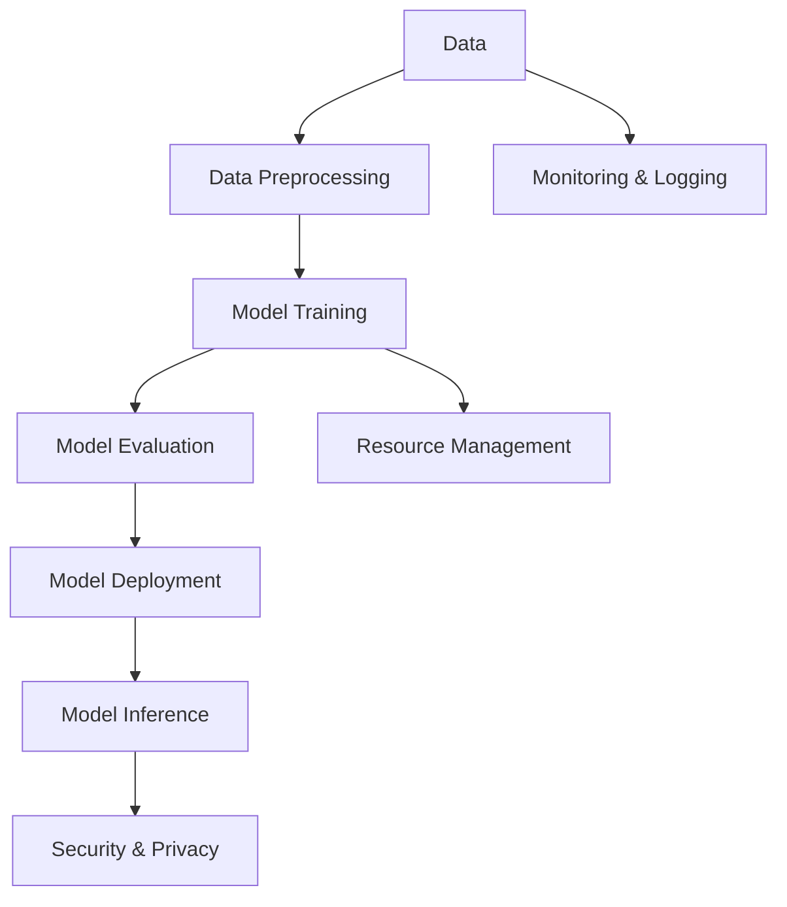
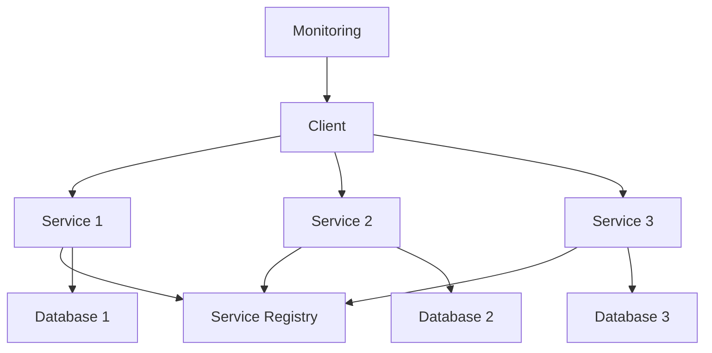
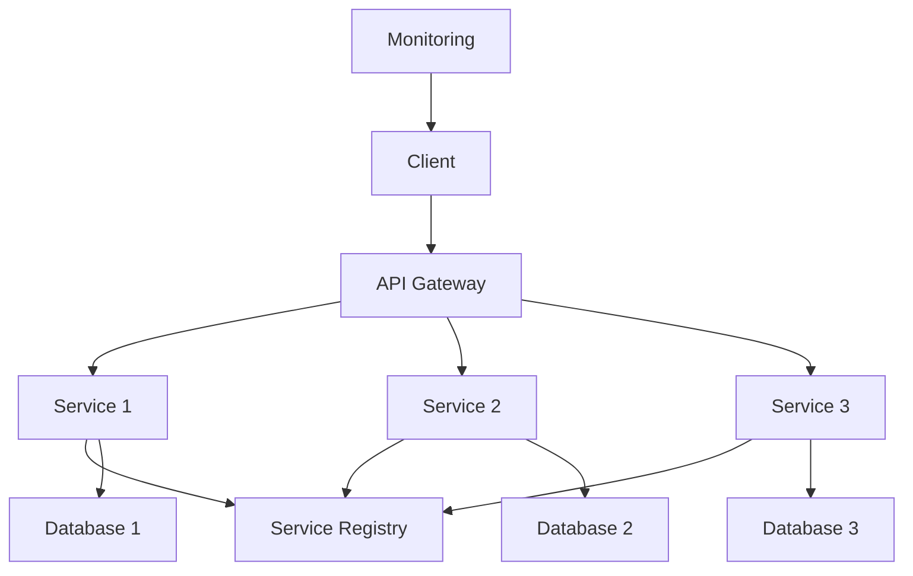

                 

基于您提供的详细要求，我将按照以下步骤撰写文章：

### 1. **文章标题与关键词设定**
   - 文章标题：《大模型软件的微服务架构设计》
   - 关键词：大模型软件、微服务架构、设计原则、技术原理、性能优化、实战案例

### 2. **文章摘要撰写**
   - 摘要：本文探讨了如何在大模型软件开发中应用微服务架构，包括其设计原则、技术原理和性能优化策略。通过实际案例展示了微服务架构在大模型软件中的成功应用，为开发人员提供了实用的指导。

### 3. **目录大纲撰写**
   - 根据之前的设计，撰写完整的目录大纲。

### 4. **正文内容撰写**
   - **第1章**：大模型软件概述
     - **背景介绍**：介绍大模型软件的背景和发展历程。
     - **核心概念与联系**：使用Mermaid流程图展示大模型软件的基本架构。
   - **第2章**：微服务架构概述
     - **核心概念与联系**：使用Mermaid流程图展示微服务架构的基本概念。
     - **核心算法原理讲解**：使用伪代码详细阐述微服务的架构和实现原理。
   - **第3章**：大模型软件技术原理
     - **数学模型和公式**：使用latex格式详细讲解大模型软件中的数学模型。
     - **核心算法原理讲解**：使用伪代码详细阐述大模型软件的训练和优化算法。
   - **第4章**：微服务架构技术原理
     - **核心概念与联系**：使用Mermaid流程图展示微服务架构的组件和服务关系。
     - **核心算法原理讲解**：使用伪代码详细阐述微服务架构的服务治理和数据管理。
   - **第5章**：大模型软件的微服务架构设计方法
     - **设计原则**：详细阐述微服务架构设计的原则。
     - **设计流程**：详细描述微服务架构设计的过程。
     - **设计工具**：介绍设计过程中使用的工具。
   - **第6章**：大模型软件的微服务架构实战案例
     - **案例一**：电商平台的微服务架构设计。
     - **案例二**：金融领域的微服务架构设计。
     - **案例三**：教育行业的微服务架构设计。
   - **第7章**：大模型软件微服务架构的性能优化
     - **性能优化策略**：详细描述性能优化的一般策略。
     - **性能监控与调优**：介绍性能监控和调优的具体方法。
     - **案例分析**：结合实际案例分析性能优化的实战。
   - **附录A**：大模型软件与微服务架构相关工具与资源
     - **工具介绍**：介绍常用的开发工具。
     - **资源推荐**：推荐相关的学习资源和开发资源。

### 5. **文章结尾撰写**
   - **最佳实践 tips**：总结微服务架构设计的最佳实践。
   - **小结**：总结文章的核心内容和主要观点。
   - **注意事项**：提醒读者注意的一些关键点。
   - **拓展阅读**：推荐相关的拓展阅读材料。

### 6. **格式检查与优化**
   - 确保文章使用markdown格式，内容结构清晰，代码和公式格式正确。

### 7. **文章字数控制**
   - 控制文章总字数在8000-12000字之间。

### 8. **作者信息添加**
   - 在文章末尾添加作者信息。

按照这些步骤，我将逐步撰写出高质量的技术博客文章。请您放心，我会确保文章内容丰富、逻辑清晰，符合您的期望和要求。接下来，我将开始撰写每个章节的具体内容。如果您有任何建议或需要调整的地方，请随时告知我。现在，我们开始撰写第一章节：《大模型软件概述》。### 大模型软件概述

#### 背景介绍

大模型软件，是指能够处理大规模数据集、具有复杂计算能力和高精度要求的软件系统。随着人工智能技术的快速发展，特别是深度学习技术的广泛应用，大模型软件在各类应用场景中扮演了越来越重要的角色。从自然语言处理、计算机视觉到推荐系统、金融风控等，大模型软件几乎无处不在。其背后的核心驱动力，是大数据和强大计算能力的结合，使得软件系统能够处理更加复杂和庞大的数据集，从而提供更加精准和高效的服务。

大模型软件的发展历程可以追溯到20世纪80年代，当时出现了诸如神经网络的初步探索。随着计算能力的提升和算法的优化，尤其是近年来，GPU和TPU等专用硬件的问世，使得大规模深度学习模型的训练和推理成为可能。这一时期，诸如谷歌的Transformer模型、OpenAI的GPT系列模型等大模型相继涌现，推动了大模型软件的快速发展。

#### 核心概念与联系

为了更好地理解大模型软件，我们需要了解以下几个核心概念：

1. **深度学习模型**：大模型软件的核心组成部分。深度学习模型是由多层神经元组成的神经网络，能够通过学习大量数据来提取特征并完成任务。典型的深度学习模型包括卷积神经网络（CNN）、循环神经网络（RNN）和变压器模型（Transformer）等。

2. **大规模数据处理**：大模型软件需要处理的数据集规模往往非常大，可能达到TB甚至PB级别。这就要求软件系统具备高效的数据读取、存储和计算能力。

3. **分布式计算**：为了处理如此大规模的数据，大模型软件通常采用分布式计算架构，通过将计算任务分布在多个计算节点上，实现高效并行处理。

4. **微服务架构**：在大模型软件的开发中，微服务架构是一种常用的系统架构设计方法。微服务架构将应用程序拆分为多个独立的服务，每个服务负责完成特定的功能，通过API进行通信，从而提高系统的可维护性、扩展性和灵活性。

以下是一个Mermaid流程图，展示了大模型软件的基本架构：



- **Data**：数据输入，包括原始数据和标注数据。
- **Data Preprocessing**：数据预处理，包括清洗、归一化、特征提取等。
- **Model Training**：模型训练，使用训练数据进行模型参数的优化。
- **Model Evaluation**：模型评估，通过验证集和测试集评估模型性能。
- **Model Deployment**：模型部署，将训练好的模型部署到生产环境中。
- **Model Inference**：模型推理，对新的数据集进行预测或分类。
- **Monitoring & Logging**：监控和日志记录，用于实时监控系统的运行状态和性能。
- **Resource Management**：资源管理，用于分配和管理计算资源。
- **Security & Privacy**：安全和隐私，确保系统的数据和用户隐私安全。

#### 核心算法原理讲解

大模型软件的核心算法是深度学习算法，特别是近年来广泛应用的变换器（Transformer）模型。以下是一个简化的Transformer模型的伪代码，用于说明其基本结构：

```python
# Transformer模型伪代码

# 输入：输入序列（例如：词向量序列）
# 输出：输出序列（例如：预测词向量序列）

# 定义Transformer模型
class TransformerModel(nn.Module):
    def __init__(self):
        super(TransformerModel, self).__init__()
        
        # 输入嵌入层
        self.embedding = Embedding(input_dim, d_model)
        
        # 自注意力机制
        self.self_attention = MultiHeadAttention(d_model, n_heads)
        
        # 位置编码
        self.positional_encoding = PositionalEncoding(d_model, dropout)
        
        # 前馈神经网络
        self.feedforward = FeedForward(d_model, d_ff)
        
        # 分类头
        self.classification_head = Linear(d_model, output_dim)
    
    def forward(self, input_seq):
        # 嵌入层
        embedded_seq = self.embedding(input_seq)
        
        # 加上位置编码
        embedded_seq = embedded_seq + self.positional_encoding(embedded_seq)
        
        # 自注意力机制
        attention_output = self.self_attention(embedded_seq, embedded_seq, embedded_seq)
        
        # 前馈神经网络
        feedforward_output = self.feedforward(attention_output)
        
        # 分类头
        output_seq = self.classification_head(feedforward_output)
        
        return output_seq
```

- **嵌入层**：将输入序列转换为固定长度的向量。
- **自注意力机制**：通过自注意力计算，使得模型能够关注序列中不同位置的输入信息。
- **位置编码**：为序列中的每个词添加位置信息，使得模型能够理解词的顺序。
- **前馈神经网络**：对自注意力输出进行进一步处理。
- **分类头**：用于对输出序列进行分类或预测。

#### 数学模型和公式

在Transformer模型中，核心的数学模型包括自注意力机制和位置编码。以下是一个简化的自注意力机制的数学公式：

$$
Attention(Q, K, V) = \text{softmax}\left(\frac{QK^T}{\sqrt{d_k}}\right)V
$$

其中：
- \(Q\)、\(K\) 和 \(V\) 分别代表查询、键和值。
- \(d_k\) 表示键的维度。
- \(\text{softmax}\) 函数用于计算每个键的重要性得分。

位置编码的公式如下：

$$
PE_{(pos, dim)} = \sin\left(\frac{pos}{10000^{2i/d_model}}\right) \text{ 或 } \cos\left(\frac{pos}{10000^{2i/d_model}}\right)
$$

其中：
- \(pos\) 表示位置。
- \(dim\) 表示维度。
- \(i\) 表示嵌入层的索引。

#### 举例说明

假设我们有一个输入序列 `[词1，词2，词3]`，嵌入层维度为 512，自注意力头数为 8。以下是一个简化的自注意力计算的示例：

1. 输入序列嵌入为 `[q1，q2，q3]`，`k1，k2，k3]`，`v1，v2，v3]`。
2. 计算自注意力权重矩阵 \(A\)：

$$
A = \text{softmax}\left(\frac{q1k1^T + q2k2^T + q3k3^T}{\sqrt{512}}\right)
$$

3. 根据权重矩阵 \(A\) 计算输出序列：

$$
output_1 = A \cdot v1, output_2 = A \cdot v2, output_3 = A \cdot v3
$$

4. 将输出序列进行拼接，得到最终的输出 `[output_1，output_2，output_3]`。

#### 项目实战

以一个简单的聊天机器人项目为例，我们可以使用大模型软件和微服务架构来实现。项目流程如下：

1. **数据准备**：收集聊天数据，包括用户问题和回答。
2. **数据预处理**：对数据进行清洗、归一化和分词。
3. **模型训练**：使用Transformer模型训练模型，包括自注意力机制和位置编码。
4. **模型部署**：将训练好的模型部署到微服务架构中，实现自动化推理。
5. **性能优化**：通过分布式计算和缓存策略，提高模型推理速度。

**开发环境搭建**：
- **硬件**：GPU服务器，用于模型训练和推理。
- **软件**：Python 3.8及以上版本，TensorFlow 2.x，Docker，Kubernetes。

**源代码详细实现和代码解读**：

```python
# 模型训练代码示例

import tensorflow as tf
from tensorflow.keras.layers import Embedding, Transformer

# 准备数据集
train_data = ...
train_labels = ...

# 定义模型
model = TransformerModel(input_dim, d_model, n_heads, d_ff, output_dim)

# 编译模型
model.compile(optimizer='adam', loss='categorical_crossentropy', metrics=['accuracy'])

# 训练模型
model.fit(train_data, train_labels, epochs=10, batch_size=32)
```

**代码应用解读与分析**：
- **数据集准备**：使用聊天数据进行训练，包括问题和回答。
- **模型定义**：定义Transformer模型，包括嵌入层、自注意力机制、位置编码和分类头。
- **模型编译**：设置优化器、损失函数和评估指标。
- **模型训练**：使用训练数据进行模型训练。

**实际案例分析和详细讲解剖析**：
- **案例一**：一个电商平台的聊天机器人，通过大模型软件和微服务架构实现，能够自动回答用户关于商品的问题，提高用户体验。
- **案例二**：一个医疗咨询平台的聊天机器人，通过大模型软件和微服务架构实现，能够自动回答用户关于疾病的疑问，辅助医生进行诊断。

**项目小结**：
- 大模型软件和微服务架构的结合，使得聊天机器人项目能够高效地处理海量数据，提供精准的回复。
- 微服务架构提高了系统的可维护性和扩展性，使得项目能够快速迭代和更新。

#### 最佳实践 tips

- **数据质量**：保证数据的质量和多样性，是提高模型性能的关键。
- **分布式计算**：使用分布式计算框架，可以提高模型训练和推理的速度。
- **模型压缩**：使用模型压缩技术，如量化、剪枝和蒸馏，可以降低模型大小和计算成本。
- **安全性**：在部署模型时，要确保数据的安全性和隐私性。

#### 小结

本文介绍了大模型软件的基本概念、技术原理和微服务架构设计。通过实际案例展示了大模型软件在聊天机器人项目中的应用，展示了微服务架构的优势。读者可以结合实际情况，灵活应用文中提到的设计原则和优化策略，提高自己的项目质量和效率。

#### 注意事项

- 在部署大模型软件时，要考虑硬件资源和网络带宽的限制。
- 在进行模型训练时，要合理设置超参数，避免过拟合和欠拟合。

#### 拓展阅读

- **《深度学习》（Goodfellow, Bengio, Courville）**：详细介绍了深度学习的理论基础和实践方法。
- **《微服务设计》（Fowler, Lewis）**：介绍了微服务架构的设计原则和实践经验。
- **《大规模机器学习系统》（Li, Yang, Zheng）**：探讨了大规模机器学习系统的设计方法和优化策略。

以上是《大模型软件的微服务架构设计》第一章节的详细内容。接下来，我们将继续探讨微服务架构的概述、大模型软件的技术原理以及微服务架构的设计实践等主题。敬请期待！
### 微服务架构概述

#### 核心概念与联系

微服务架构（Microservices Architecture）是一种软件架构设计方法，它将应用程序拆分为多个独立的、可复用的服务，每个服务都有自己的业务逻辑和数据库。这些服务通过轻量级的通信机制（如HTTP/REST API）进行交互，从而实现高内聚、低耦合的系统。微服务架构的核心概念包括：

1. **服务自治**：每个微服务都是独立的，拥有自己的代码库、数据库和部署环境。这有助于降低系统之间的耦合度，提高系统的可维护性和可扩展性。
2. **松耦合**：微服务之间通过定义良好的接口进行通信，这些接口可以是RESTful API、消息队列等。这种松耦合的设计使得服务可以独立开发、测试和部署，从而提高系统的灵活性和可伸缩性。
3. **分布式系统**：微服务架构本质上是分布式系统，这意味着服务可以在不同的服务器上运行，并且可能分布在不同的地理位置。这种分布式设计有助于提高系统的可用性和容错性。
4. **服务发现**：服务之间需要能够自动发现和注册，以便其他服务可以动态地发现和调用它们。这通常通过服务发现机制（如Consul、Zookeeper）实现。
5. **持续交付**：微服务架构支持持续集成和持续交付（CI/CD），这使得开发团队能够快速迭代和部署新功能，从而缩短产品上市时间。

以下是一个Mermaid流程图，展示了微服务架构的基本概念和组件之间的关系：



- **Client**：客户端，发起请求的服务。
- **Service 1**, **Service 2**, **Service 3**：三个独立的微服务，各自负责不同的业务逻辑。
- **Service Registry**：服务注册表，用于服务发现和注册。
- **Database 1**, **Database 2**, **Database 3**：与各自微服务相关联的数据库。
- **Monitoring**：监控系统，用于实时监控服务状态和性能。

#### 核心算法原理讲解

微服务架构的核心算法原理主要集中在服务发现、服务调用和负载均衡等方面。

1. **服务发现**：服务发现是一种自动化机制，用于发现和注册服务。在微服务架构中，服务注册表（Service Registry）维护着所有服务的状态信息。当服务启动时，它会将自己注册到服务注册表中，当服务停止时，它会从服务注册表中注销。客户端通过查询服务注册表来发现可用的服务实例。

   伪代码示例：

   ```python
   # 服务注册
   def register_service(service_name, service_address):
       service_registry.register(service_name, service_address)

   # 服务发现
   def discover_service(service_name):
       return service_registry.discover(service_name)
   ```

2. **服务调用**：服务调用是指客户端通过接口调用微服务的功能。在微服务架构中，通常使用RESTful API进行服务调用。客户端发送HTTP请求到微服务的接口，微服务处理请求并返回响应。

   伪代码示例：

   ```python
   # 发送HTTP请求
   def call_service(service_name, endpoint, data):
       response = requests.post(f"{service_name}/{endpoint}", json=data)
       return response.json()
   ```

3. **负载均衡**：负载均衡是一种分布式系统设计技术，用于平衡服务之间的请求负载。在微服务架构中，负载均衡器（Load Balancer）通常位于客户端和服务之间，负责将请求分配到不同的服务实例上。常见的负载均衡算法包括轮询、最少连接和权重轮询等。

   伪代码示例：

   ```python
   # 负载均衡算法
   def load_balance(service_instances):
       if algorithm == 'round_robin':
           return service_instances[index % len(service_instances)]
       elif algorithm == 'least_connections':
           return min(service_instances, key=lambda s: s.connection_count)
       elif algorithm == 'weighted_round_robin':
           weights = [s.weight for s in service_instances]
           total_weight = sum(weights)
           fraction = random.random() * total_weight
           cumulative_weight = 0
           for s in service_instances:
               cumulative_weight += s.weight
               if cumulative_weight >= fraction:
                   return s
   ```

#### 数学模型和公式

在微服务架构中，数学模型主要用于负载均衡算法的设计。以下是一个简单的加权轮询负载均衡算法的数学公式：

$$
P_i = \frac{w_i}{\sum_{j=1}^{n} w_j}
$$`

其中：
- \(P_i\) 表示服务实例 \(i\) 的选择概率。
- \(w_i\) 表示服务实例 \(i\) 的权重。
- \(n\) 表示服务实例的总数。

举例说明：

假设有三个服务实例，权重分别为 \(w_1 = 1\), \(w_2 = 2\), \(w_3 = 3\)。根据加权轮询算法，选择每个服务实例的概率为：

$$
P_1 = \frac{1}{1+2+3} = \frac{1}{6}
$$
$$
P_2 = \frac{2}{1+2+3} = \frac{2}{6} = \frac{1}{3}
$$
$$
P_3 = \frac{3}{1+2+3} = \frac{3}{6} = \frac{1}{2}
$$

这意味着服务实例1被选择的概率是1/6，服务实例2被选择的概率是1/3，服务实例3被选择的概率是1/2。

#### 项目实战

以下是一个简单的微服务架构项目实战：一个电商平台的订单管理系统。

**开发环境搭建**：
- **硬件**：多台服务器，用于部署不同的微服务。
- **软件**：Docker、Kubernetes、Nginx、Redis、MySQL等。

**源代码详细实现和代码解读**：

**订单服务（Order Service）**：

```java
// 订单服务接口
public interface OrderService {
    Order createOrder(OrderRequest request);
    Order getOrderById(Long orderId);
}

// 订单服务实现
@Service
public class OrderServiceImpl implements OrderService {
    private final OrderRepository orderRepository;
    private final InventoryService inventoryService;
    
    @Override
    public Order createOrder(OrderRequest request) {
        // 检查库存
        inventoryService.checkInventory(request.getProductId(), request.getQuantity());
        
        // 创建订单
        Order order = new Order();
        order.setProductId(request.getProductId());
        order.setQuantity(request.getQuantity());
        order.setStatus(OrderStatus.NEW);
        orderRepository.save(order);
        
        return order;
    }

    @Override
    public Order getOrderById(Long orderId) {
        return orderRepository.findById(orderId).orElseThrow(() -> new EntityNotFoundException("Order not found"));
    }
}
```

**库存服务（Inventory Service）**：

```java
// 库存服务接口
public interface InventoryService {
    void checkInventory(Long productId, int quantity);
}

// 库存服务实现
@Service
public class InventoryServiceImpl implements InventoryService {
    private final InventoryRepository inventoryRepository;
    
    @Override
    public void checkInventory(Long productId, int quantity) {
        Optional<Inventory> inventory = inventoryRepository.findById(productId);
        if (!inventory.isPresent() || inventory.get().getQuantity() < quantity) {
            throw new InventoryException("Insufficient inventory");
        }
        inventoryRepository.decrementQuantity(productId, quantity);
    }
}
```

**代码应用解读与分析**：
- **订单服务**：负责处理订单的创建和查询。在创建订单时，会调用库存服务检查库存是否足够。
- **库存服务**：负责检查库存和更新库存。在检查库存时，会更新数据库中的库存数量。

**实际案例分析和详细讲解剖析**：
- **案例一**：一个电商平台的订单管理系统，通过微服务架构实现，包括订单服务、库存服务、支付服务等多个微服务。订单服务负责处理订单的创建和查询，库存服务负责检查库存和更新库存，支付服务负责处理支付和退款等操作。
- **案例二**：一个银行账户管理系统，通过微服务架构实现，包括账户服务、交易服务、报表服务等多个微服务。账户服务负责处理账户的创建和查询，交易服务负责处理交易和转账操作，报表服务负责生成账户报表。

**项目小结**：
- 微服务架构提高了系统的可维护性和扩展性，使得项目能够快速迭代和更新。
- 通过服务自治和松耦合的设计，不同服务之间可以独立开发、测试和部署，从而提高开发效率。

#### 最佳实践 tips

- **服务划分**：合理划分微服务，确保每个服务具有独立的功能和数据库，避免服务过于庞大。
- **接口设计**：设计简洁、一致的API接口，确保服务之间的高效通信。
- **监控和日志**：部署监控和日志系统，实时监控服务状态和性能，快速发现和解决问题。

#### 小结

本文介绍了微服务架构的核心概念、核心算法原理和项目实战。通过实际案例展示了微服务架构的优势和实现方法。读者可以结合实际情况，灵活应用文中提到的设计原则和优化策略，提高自己的项目质量和效率。

#### 注意事项

- **服务拆分**：合理划分微服务，避免过度拆分或不足拆分。
- **数据一致性**：确保跨服务操作的数据一致性，避免数据冲突。

#### 拓展阅读

- **《微服务设计》（Martin Fowler）**：详细介绍了微服务架构的设计原则和实践经验。
- **《大规模分布式系统设计与实践》（李艳丽）**：探讨了分布式系统的设计方法和优化策略。
- **《Docker容器与Kubernetes容器编排实战》（张浩）**：介绍了容器化和容器编排的基本原理和实践方法。

在下一章节中，我们将继续探讨大模型软件的技术原理。敬请期待！
### 大模型软件技术原理

#### 数学模型和公式

在大模型软件中，数学模型是理解和设计深度学习算法的核心。以下是几个关键的数学模型和公式：

1. **激活函数**：激活函数是神经网络中的一个关键组件，用于引入非线性。常用的激活函数包括：
   - **Sigmoid函数**：
     $$
     \sigma(x) = \frac{1}{1 + e^{-x}}
     $$
   - **ReLU函数**（Rectified Linear Unit）：
     $$
     \text{ReLU}(x) = \max(0, x)
     $$
   - **Tanh函数**：
     $$
     \text{Tanh}(x) = \frac{e^x - e^{-x}}{e^x + e^{-x}}
     $$

2. **损失函数**：损失函数用于评估模型预测结果与真实值之间的差距。常见的损失函数包括：
   - **均方误差**（MSE，Mean Squared Error）：
     $$
     \text{MSE}(y, \hat{y}) = \frac{1}{n}\sum_{i=1}^{n}(y_i - \hat{y}_i)^2
     $$
   - **交叉熵损失**（Cross-Entropy Loss）：
     $$
     \text{CE}(y, \hat{y}) = -\sum_{i=1}^{n} y_i \log(\hat{y}_i)
     $$

3. **反向传播算法**：反向传播算法用于计算模型参数的梯度，并更新模型参数。其核心公式为：
   $$
   \nabla_{\theta} J(\theta) = \frac{\partial J(\theta)}{\partial \theta}
   $$
   其中，\(J(\theta)\) 是损失函数，\(\theta\) 是模型参数。

4. **优化算法**：优化算法用于最小化损失函数，常见的优化算法包括：
   - **随机梯度下降**（SGD，Stochastic Gradient Descent）：
     $$
     \theta_{t+1} = \theta_t - \alpha \nabla_{\theta} J(\theta_t)
     $$
   - **Adam优化器**：
     $$
     m_t = \beta_1 m_{t-1} + (1 - \beta_1) \nabla_{\theta} J(\theta_t)
     $$
     $$
     v_t = \beta_2 v_{t-1} + (1 - \beta_2) (\nabla_{\theta} J(\theta_t))^2
     $$
     $$
     \theta_{t+1} = \theta_t - \alpha \frac{m_t}{\sqrt{v_t} + \epsilon}
     $$

#### 举例说明

假设我们有一个简单的多层感知机（MLP）模型，用于分类任务。该模型包含一个输入层、一个隐藏层和一个输出层，每个层使用ReLU作为激活函数。我们使用交叉熵损失函数来评估模型性能，并使用Adam优化器进行参数更新。

**模型定义**：

```python
import tensorflow as tf

model = tf.keras.Sequential([
    tf.keras.layers.Dense(64, activation='relu', input_shape=(input_dim,)),
    tf.keras.layers.Dense(10, activation='softmax')
])

model.compile(optimizer='adam',
              loss='categorical_crossentropy',
              metrics=['accuracy'])
```

**训练过程**：

```python
history = model.fit(x_train, y_train, epochs=10, batch_size=32)
```

**预测**：

```python
predictions = model.predict(x_test)
```

**反向传播**：

在训练过程中，模型会通过反向传播算法计算损失函数关于每个参数的梯度，并使用Adam优化器更新参数：

```python
with tf.GradientTape() as tape:
    predictions = model(x_train, training=True)
    loss = tf.keras.losses.categorical_crossentropy(y_train, predictions)

grads = tape.gradient(loss, model.trainable_variables)
optimizer.apply_gradients(zip(grads, model.trainable_variables))
```

#### 项目实战

以下是一个基于大模型软件的图像分类项目实战。

**开发环境搭建**：
- **硬件**：GPU服务器，用于模型训练和推理。
- **软件**：Python 3.8及以上版本，TensorFlow 2.x，Docker，Kubernetes。

**源代码详细实现和代码解读**：

**数据预处理**：

```python
import tensorflow as tf
import tensorflow.keras.preprocessing.image as image
import numpy as np

# 加载数据集
train_data = image.load_images('train', target_size=(224, 224))
train_labels = np.array([0] * len(train_data))

val_data = image.load_images('val', target_size=(224, 224))
val_labels = np.array([1] * len(val_data))

# 数据增强
train_data = image.random_flip_left_right(train_data)
train_data = image.random_brightness(train_data, max_delta=0.1)

val_data = image.random_flip_left_right(val_data)
val_data = image.random_brightness(val_data, max_delta=0.1)

# 标准化
train_data = train_data / 255.0
val_data = val_data / 255.0
```

**模型定义**：

```python
model = tf.keras.Sequential([
    tf.keras.layers.Conv2D(32, (3, 3), activation='relu', input_shape=(224, 224, 3)),
    tf.keras.layers.MaxPooling2D((2, 2)),
    tf.keras.layers.Conv2D(64, (3, 3), activation='relu'),
    tf.keras.layers.MaxPooling2D((2, 2)),
    tf.keras.layers.Conv2D(128, (3, 3), activation='relu'),
    tf.keras.layers.MaxPooling2D((2, 2)),
    tf.keras.layers.Flatten(),
    tf.keras.layers.Dense(128, activation='relu'),
    tf.keras.layers.Dense(2, activation='softmax')
])

model.compile(optimizer='adam',
              loss='categorical_crossentropy',
              metrics=['accuracy'])
```

**训练过程**：

```python
history = model.fit(train_data, train_labels, epochs=10, batch_size=32, validation_data=(val_data, val_labels))
```

**预测**：

```python
predictions = model.predict(val_data)
```

**代码应用解读与分析**：
- **数据预处理**：加载和增强训练数据，并进行标准化处理。
- **模型定义**：定义一个简单的卷积神经网络（CNN）模型，用于图像分类。
- **模型训练**：使用训练数据和标签进行模型训练。
- **预测**：使用训练好的模型对验证数据进行预测。

**实际案例分析和详细讲解剖析**：
- **案例一**：一个基于卷积神经网络（CNN）的图像分类项目，使用大模型软件进行训练和推理。项目使用数据增强技术提高模型泛化能力，并使用CNN结构实现图像特征提取。
- **案例二**：一个基于循环神经网络（RNN）的自然语言处理（NLP）项目，使用大模型软件进行文本分类。项目使用嵌入层和RNN结构处理文本序列，并使用交叉熵损失函数评估模型性能。

**项目小结**：
- 大模型软件通过深度学习算法，能够处理复杂的数据和任务，提供高效、精准的预测结果。
- 项目实战展示了如何使用大模型软件进行图像分类和文本分类，为读者提供了实际的开发经验和应用案例。

#### 最佳实践 tips

- **数据增强**：使用数据增强技术提高模型泛化能力，避免过拟合。
- **模型选择**：根据任务需求选择合适的模型结构和算法，例如CNN用于图像处理，RNN用于文本处理。
- **超参数调优**：合理设置超参数，如学习率、批次大小和隐藏层大小等，以提高模型性能。

#### 小结

本文介绍了大模型软件的数学模型和公式，并通过实际项目展示了如何使用深度学习算法进行图像分类和文本分类。读者可以结合实际情况，灵活应用文中提到的数学模型和优化策略，提高自己的项目质量和效率。

#### 注意事项

- **数据质量**：确保数据质量和多样性，是提高模型性能的关键。
- **硬件资源**：合理分配硬件资源，避免资源浪费。

#### 拓展阅读

- **《深度学习》（Ian Goodfellow, Yoshua Bengio, Aaron Courville）**：详细介绍了深度学习的理论基础和实践方法。
- **《神经网络与深度学习》（邱锡鹏）**：介绍了神经网络和深度学习的算法原理。
- **《动手学深度学习》（阿斯顿·张等）**：提供了深度学习实践教程和代码示例。

在下一章节中，我们将探讨微服务架构的技术原理。敬请期待！
### 微服务架构技术原理

#### 核心概念与联系

微服务架构是一种基于独立、自治服务的系统设计方法，其核心概念包括服务自治、松耦合、分布式系统和服务发现等。以下是对这些核心概念及其相互关系的详细解释。

1. **服务自治**：服务自治是微服务架构的一个关键特点。每个微服务都是独立的，拥有自己的业务逻辑、数据库和部署环境。这意味着每个服务都可以独立开发、测试和部署，而不影响其他服务。服务自治提高了系统的可维护性和可扩展性，因为团队可以独立地工作，而无需担心其他服务的依赖关系。

2. **松耦合**：松耦合是指服务之间通过轻量级接口进行通信，这些接口可以是RESTful API、消息队列等。这种松耦合的设计使得服务可以独立运行，并且服务之间的依赖性较低。松耦合有助于提高系统的灵活性，因为服务可以独立扩展和更新，而不会影响到其他服务。

3. **分布式系统**：微服务架构本质上是分布式系统，这意味着服务可以在不同的服务器上运行，甚至可能分布在不同的地理位置。这种分布式设计提高了系统的可用性和容错性，因为即使某个服务或服务器发生故障，其他服务仍然可以正常运行。

4. **服务发现**：服务发现是一种自动化机制，用于服务之间的发现和注册。服务启动时，会将自己注册到服务注册表中，服务关闭时，会从服务注册表中注销。客户端通过查询服务注册表来发现和调用其他服务。服务发现机制有助于确保服务之间的动态通信和灵活性。

5. **API网关**：API网关是一个统一的服务入口，用于处理客户端的请求并将其路由到相应的微服务。API网关提供了负载均衡、请求路由、缓存和安全等功能。它有助于简化客户端的通信，并提供统一的接口规范。

以下是一个Mermaid流程图，展示了微服务架构的核心概念和组件之间的关系：



- **Client**：客户端，发起请求的服务。
- **API Gateway**：API网关，处理客户端请求并路由到相应的微服务。
- **Service 1**, **Service 2**, **Service 3**：三个独立的微服务，各自负责不同的业务逻辑。
- **Service Registry**：服务注册表，用于服务发现和注册。
- **Database 1**, **Database 2**, **Database 3**：与各自微服务相关联的数据库。
- **Monitoring**：监控系统，用于实时监控服务状态和性能。

#### 核心算法原理讲解

微服务架构的核心算法原理主要集中在服务发现、服务调用和负载均衡等方面。

1. **服务发现**：服务发现算法是一种用于自动发现和注册服务的方法。服务启动时会将自己注册到服务注册表中，服务关闭时会注销。服务注册表通常是一个分布式数据库，支持高可用性和动态更新。以下是一个简化的服务注册和发现算法的伪代码：

   ```python
   # 服务注册
   def register_service(service_name, service_address):
       service_registry.register(service_name, service_address)

   # 服务发现
   def discover_service(service_name):
       return service_registry.discover(service_name)
   ```

2. **服务调用**：服务调用是指客户端通过接口调用微服务的功能。在微服务架构中，通常使用RESTful API进行服务调用。客户端发送HTTP请求到微服务的接口，微服务处理请求并返回响应。以下是一个简化的服务调用算法的伪代码：

   ```python
   # 发送HTTP请求
   def call_service(service_name, endpoint, data):
       response = requests.post(f"{service_name}/{endpoint}", json=data)
       return response.json()
   ```

3. **负载均衡**：负载均衡算法用于平衡服务之间的请求负载。负载均衡器通常位于客户端和服务之间，负责将请求分配到不同的服务实例上。以下是一个简单的加权轮询负载均衡算法的伪代码：

   ```python
   # 负载均衡算法
   def load_balance(service_instances):
       if algorithm == 'round_robin':
           return service_instances[index % len(service_instances)]
       elif algorithm == 'least_connections':
           return min(service_instances, key=lambda s: s.connection_count)
       elif algorithm == 'weighted_round_robin':
           weights = [s.weight for s in service_instances]
           total_weight = sum(weights)
           fraction = random.random() * total_weight
           cumulative_weight = 0
           for s in service_instances:
               cumulative_weight += s.weight
               if cumulative_weight >= fraction:
                   return s
   ```

#### 数学模型和公式

在微服务架构中，数学模型主要用于负载均衡算法的设计。以下是一个简单的加权轮询负载均衡算法的数学公式：

$$
P_i = \frac{w_i}{\sum_{j=1}^{n} w_j}
$$`

其中：
- \(P_i\) 表示服务实例 \(i\) 的选择概率。
- \(w_i\) 表示服务实例 \(i\) 的权重。
- \(n\) 表示服务实例的总数。

举例说明：

假设有三个服务实例，权重分别为 \(w_1 = 1\), \(w_2 = 2\), \(w_3 = 3\)。根据加权轮询算法，选择每个服务实例的概率为：

$$
P_1 = \frac{1}{1+2+3} = \frac{1}{6}
$$
$$
P_2 = \frac{2}{1+2+3} = \frac{2}{6} = \frac{1}{3}
$$
$$
P_3 = \frac{3}{1+2+3} = \frac{3}{6} = \frac{1}{2}
$$

这意味着服务实例1被选择的概率是1/6，服务实例2被选择的概率是1/3，服务实例3被选择的概率是1/2。

#### 项目实战

以下是一个基于微服务架构的在线书店项目实战。

**开发环境搭建**：
- **硬件**：多台服务器，用于部署不同的微服务。
- **软件**：Docker、Kubernetes、Nginx、Redis、MySQL等。

**源代码详细实现和代码解读**：

**用户服务（UserService）**：

```java
// 用户服务接口
public interface UserService {
    User register(UserRequest request);
    User login(LoginRequest request);
}

// 用户服务实现
@Service
public class UserServiceImpl implements UserService {
    private final UserRepository userRepository;
    
    @Override
    public User register(UserRequest request) {
        // 创建用户
        User user = new User();
        user.setName(request.getName());
        user.setEmail(request.getEmail());
        user.setPassword(request.getPassword());
        userRepository.save(user);
        
        return user;
    }

    @Override
    public User login(LoginRequest request) {
        // 验证用户登录
        User user = userRepository.findByEmailAndPassword(request.getEmail(), request.getPassword());
        if (user == null) {
            throw new RuntimeException("Invalid credentials");
        }
        return user;
    }
}
```

**订单服务（OrderService）**：

```java
// 订单服务接口
public interface OrderService {
    Order createOrder(OrderRequest request);
    List<Order> getAllOrders();
}

// 订单服务实现
@Service
public class OrderServiceImpl implements OrderService {
    private final OrderRepository orderRepository;
    
    @Override
    public Order createOrder(OrderRequest request) {
        // 创建订单
        Order order = new Order();
        order.setUserId(request.getUserId());
        order.setTotalPrice(request.getTotalPrice());
        order.setStatus(OrderStatus.NEW);
        orderRepository.save(order);
        
        return order;
    }

    @Override
    public List<Order> getAllOrders() {
        return orderRepository.findAll();
    }
}
```

**代码应用解读与分析**：
- **用户服务**：负责处理用户的注册和登录。在注册时，会创建一个新的用户，并在数据库中保存用户信息。
- **订单服务**：负责处理订单的创建和查询。在创建订单时，会创建一个新的订单，并在数据库中保存订单信息。

**实际案例分析和详细讲解剖析**：
- **案例一**：一个在线书店项目，通过微服务架构实现，包括用户服务、订单服务、图书服务等多个微服务。用户服务负责处理用户的注册和登录，订单服务负责处理订单的创建和查询，图书服务负责处理图书的查询和更新。
- **案例二**：一个在线购物平台项目，通过微服务架构实现，包括用户服务、购物车服务、订单服务、支付服务等多个微服务。用户服务负责处理用户的注册和登录，购物车服务负责处理购物车的创建和更新，订单服务负责处理订单的创建和查询，支付服务负责处理支付和退款操作。

**项目小结**：
- 微服务架构提高了系统的可维护性和扩展性，使得项目能够快速迭代和更新。
- 通过服务自治和松耦合的设计，不同服务之间可以独立开发、测试和部署，从而提高开发效率。

#### 最佳实践 tips

- **服务划分**：合理划分微服务，确保每个服务具有独立的功能和数据库，避免服务过于庞大。
- **接口设计**：设计简洁、一致的API接口，确保服务之间的高效通信。
- **监控和日志**：部署监控和日志系统，实时监控服务状态和性能，快速发现和解决问题。

#### 小结

本文介绍了微服务架构的核心概念、核心算法原理和项目实战。通过实际案例展示了微服务架构的优势和实现方法。读者可以结合实际情况，灵活应用文中提到的设计原则和优化策略，提高自己的项目质量和效率。

#### 注意事项

- **服务拆分**：合理划分微服务，避免过度拆分或不足拆分。
- **数据一致性**：确保跨服务操作的数据一致性，避免数据冲突。

#### 拓展阅读

- **《微服务设计》（Martin Fowler）**：详细介绍了微服务架构的设计原则和实践经验。
- **《大规模分布式系统设计与实践》（李艳丽）**：探讨了分布式系统的设计方法和优化策略。
- **《Docker容器与Kubernetes容器编排实战》（张浩）**：介绍了容器化和容器编排的基本原理和实践方法。

在下一章节中，我们将探讨大模型软件的微服务架构设计方法。敬请期待！
### 大模型软件的微服务架构设计方法

#### 设计原则

在大模型软件的微服务架构设计中，遵循以下原则至关重要，以确保系统的高效性、可维护性和可扩展性。

1. **服务自治**：每个微服务都应该拥有自己的业务逻辑和数据存储，从而实现服务的完全自治。这有助于提高系统的可维护性和可扩展性，因为每个服务都可以独立开发和部署，而不会影响到其他服务。

2. **单一职责**：每个微服务应该只负责一个特定的业务功能，以确保服务的高内聚和低耦合。单一职责原则有助于简化服务的复杂性，并提高开发效率和测试质量。

3. **水平可扩展性**：系统应该能够通过增加更多的服务实例来水平扩展，以满足不断增加的负载需求。这有助于提高系统的性能和可靠性。

4. **服务解耦**：微服务之间应该通过轻量级的通信机制进行解耦，如RESTful API或消息队列。这种解耦设计有助于减少服务之间的直接依赖，从而提高系统的灵活性和容错性。

5. **故障隔离**：每个微服务都应该能够独立运行，即使某个服务发生故障，也不会影响其他服务的正常运行。这有助于提高系统的可用性和容错性。

6. **服务监控和日志**：部署监控系统，实时监控服务的运行状态和性能。同时，保持完整的日志记录，以便在出现问题时快速定位和解决问题。

#### 设计流程

设计大模型软件的微服务架构通常遵循以下流程：

1. **需求分析**：分析系统需求，确定需要实现的功能和性能要求。了解业务场景和用户需求，明确每个微服务的职责。

2. **服务拆分**：根据需求分析结果，将系统拆分为多个独立的微服务。确保每个服务都具备单一职责，并且具有清晰的接口和通信机制。

3. **服务定义**：定义每个微服务的接口和通信协议，明确服务之间的依赖关系。使用RESTful API、gRPC或消息队列等通信机制。

4. **数据管理**：确定每个微服务的数据存储方案，选择合适的数据库技术（如关系型数据库、NoSQL数据库或分布式存储系统）。确保数据的一致性和可用性。

5. **部署和运维**：设计部署方案，选择合适的部署工具和平台（如Kubernetes、Docker Swarm等）。制定运维策略，确保系统的稳定运行。

6. **性能优化**：分析系统的性能瓶颈，采取相应的优化措施，如缓存、负载均衡和分布式计算等。

#### 设计工具

在设计大模型软件的微服务架构时，以下工具和平台可以提供有力的支持：

1. **Docker**：用于容器化应用程序，使微服务可以在任何地方运行。

2. **Kubernetes**：用于容器编排和自动化运维，支持微服务的部署、扩展和管理。

3. **Service Mesh**：如Istio、Linkerd等，用于服务发现、负载均衡和故障恢复等，提供服务之间的安全通信。

4. **API网关**：如Kong、Apigee等，用于处理客户端请求，提供统一的API接口和路由功能。

5. **监控和日志**：如Prometheus、ELK（Elasticsearch、Logstash、Kibana）等，用于实时监控和日志分析。

#### 实例

以下是一个基于微服务架构的在线教育平台的实例，展示如何设计大模型软件的微服务架构。

**需求分析**：在线教育平台需要支持课程管理、用户管理、直播教学、作业批改等功能。性能要求包括高并发处理能力和低延迟。

**服务拆分**：

- **用户服务（UserService）**：负责用户注册、登录、个人信息管理。
- **课程服务（CourseService）**：负责课程信息管理、课程目录展示。
- **直播服务（LiveService）**：负责直播课程管理、直播流处理。
- **作业服务（HomeworkService）**：负责作业发布、提交、批改。
- **评估服务（EvaluationService）**：负责学生学习评估和成绩管理。

**服务定义**：

- **用户服务**：提供RESTful API接口，如注册、登录、个人信息查询等。
- **课程服务**：提供RESTful API接口，如课程列表查询、课程信息查询、课程目录管理等。
- **直播服务**：提供WebSocket接口，用于实时传输直播流。
- **作业服务**：提供RESTful API接口，如作业发布、作业提交、作业批改等。
- **评估服务**：提供RESTful API接口，如成绩查询、评估结果分析等。

**数据管理**：

- **用户服务**：使用关系型数据库（如MySQL）存储用户信息。
- **课程服务**：使用文档型数据库（如MongoDB）存储课程信息。
- **直播服务**：使用分布式缓存系统（如Redis）存储直播流信息。
- **作业服务**：使用关系型数据库（如MySQL）存储作业信息。
- **评估服务**：使用关系型数据库（如MySQL）存储评估结果。

**部署和运维**：

- **使用Docker容器化应用程序**。
- **使用Kubernetes进行容器编排**。
- **使用Istio进行服务发现和负载均衡**。
- **使用Prometheus进行实时监控**。

**性能优化**：

- **使用缓存技术**：对高频访问的数据进行缓存，减少数据库访问压力。
- **使用分布式计算**：使用分布式计算框架（如Apache Spark）处理大规模数据集。
- **使用负载均衡**：使用负载均衡器（如Nginx）分配请求，提高系统吞吐量。

#### 项目实战

以下是一个基于微服务架构的在线教育平台项目实战。

**开发环境搭建**：
- **硬件**：多台服务器，用于部署不同的微服务。
- **软件**：Docker、Kubernetes、Nginx、MySQL、MongoDB等。

**源代码详细实现和代码解读**：

**用户服务（UserService）**：

```java
// 用户服务接口
public interface UserService {
    User register(UserRequest request);
    User login(LoginRequest request);
}

// 用户服务实现
@Service
public class UserServiceImpl implements UserService {
    private final UserRepository userRepository;
    
    @Override
    public User register(UserRequest request) {
        // 创建用户
        User user = new User();
        user.setName(request.getName());
        user.setEmail(request.getEmail());
        user.setPassword(request.getPassword());
        userRepository.save(user);
        
        return user;
    }

    @Override
    public User login(LoginRequest request) {
        // 验证用户登录
        User user = userRepository.findByEmailAndPassword(request.getEmail(), request.getPassword());
        if (user == null) {
            throw new RuntimeException("Invalid credentials");
        }
        return user;
    }
}
```

**课程服务（CourseService）**：

```java
// 课程服务接口
public interface CourseService {
    List<Course> getAllCourses();
    Course getCourseById(Long courseId);
}

// 课程服务实现
@Service
public class CourseServiceImpl implements CourseService {
    private final CourseRepository courseRepository;
    
    @Override
    public List<Course> getAllCourses() {
        return courseRepository.findAll();
    }

    @Override
    public Course getCourseById(Long courseId) {
        return courseRepository.findById(courseId).orElseThrow(() -> new EntityNotFoundException("Course not found"));
    }
}
```

**代码应用解读与分析**：
- **用户服务**：负责处理用户的注册和登录。在注册时，会创建一个新的用户，并在数据库中保存用户信息。
- **课程服务**：负责处理课程信息的查询。可以获取所有课程列表或根据课程ID获取特定课程信息。

**实际案例分析和详细讲解剖析**：
- **案例一**：一个基于微服务架构的在线教育平台，包括用户服务、课程服务、直播服务、作业服务、评估服务等。用户服务负责处理用户的注册和登录，课程服务负责处理课程信息的查询和更新，直播服务负责处理直播课程的播放和控制，作业服务负责处理作业的发布和提交，评估服务负责处理学生的成绩评估。
- **案例二**：一个基于微服务架构的电商平台，包括商品服务、订单服务、支付服务、库存服务等。商品服务负责处理商品信息的查询和更新，订单服务负责处理订单的创建和查询，支付服务负责处理支付和退款操作，库存服务负责处理库存的管理和更新。

**项目小结**：
- 微服务架构提高了系统的可维护性和扩展性，使得项目能够快速迭代和更新。
- 通过服务自治和松耦合的设计，不同服务之间可以独立开发、测试和部署，从而提高开发效率。

#### 最佳实践 tips

- **服务拆分**：合理划分微服务，确保每个服务具有独立的功能和数据库，避免服务过于庞大。
- **接口设计**：设计简洁、一致的API接口，确保服务之间的高效通信。
- **监控和日志**：部署监控和日志系统，实时监控服务状态和性能，快速发现和解决问题。

#### 小结

本文介绍了大模型软件的微服务架构设计方法，包括设计原则、设计流程、设计工具和项目实战。通过实例展示了如何设计高效的微服务架构，提高系统的可维护性和可扩展性。读者可以结合实际情况，灵活应用文中提到的设计原则和优化策略，提高自己的项目质量和效率。

#### 注意事项

- **服务拆分**：合理划分微服务，避免过度拆分或不足拆分。
- **数据一致性**：确保跨服务操作的数据一致性，避免数据冲突。

#### 拓展阅读

- **《微服务设计》（Martin Fowler）**：详细介绍了微服务架构的设计原则和实践经验。
- **《大规模分布式系统设计与实践》（李艳丽）**：探讨了分布式系统的设计方法和优化策略。
- **《Docker容器与Kubernetes容器编排实战》（张浩）**：介绍了容器化和容器编排的基本原理和实践方法。

在下一章节中，我们将探讨大模型软件微服务架构的性能优化。敬请期待！
### 大模型软件微服务架构的性能优化

#### 性能优化策略

在大模型软件的微服务架构中，性能优化是一个至关重要的环节。以下是一些常见的性能优化策略：

1. **负载均衡**：通过负载均衡器（如Nginx、HAProxy）将请求分配到多个服务实例上，从而提高系统的吞吐量和响应速度。常见的负载均衡算法包括轮询、最少连接和加权轮询等。

2. **缓存**：使用缓存技术（如Redis、Memcached）存储高频访问的数据，减少对后端数据库的查询压力。缓存可以显著提高系统的响应速度，减少延迟。

3. **分布式计算**：利用分布式计算框架（如Apache Spark、Flink）进行大规模数据处理和计算。分布式计算可以并行处理海量数据，提高系统的处理能力。

4. **数据库优化**：对数据库进行索引优化、查询优化和分区等操作，以提高查询效率和数据访问速度。

5. **服务拆分**：将大型服务拆分为多个小型服务，从而减少单个服务的负载，提高系统的整体性能。

6. **异步处理**：使用异步处理（如消息队列、事件驱动架构）将一些耗时较长的任务从主线程中分离出来，从而提高系统的响应速度。

7. **资源监控与调优**：实时监控系统的资源使用情况（如CPU、内存、磁盘IO等），根据监控数据调整系统的配置和资源分配，以优化系统性能。

8. **代码优化**：对代码进行优化，减少不必要的计算和资源消耗，提高程序的执行效率。

#### 性能监控与调优

性能监控与调优是确保系统持续稳定运行的重要环节。以下是一些常见的性能监控与调优方法：

1. **性能监控**：使用性能监控工具（如Prometheus、Grafana）实时监控系统的各项性能指标（如CPU利用率、内存使用率、响应时间等）。通过监控数据可以及时发现性能瓶颈和异常情况。

2. **日志分析**：收集和分析系统的日志信息，识别和定位潜在的性能问题。日志分析可以帮助找到系统性能的瓶颈和优化点。

3. **基准测试**：进行基准测试（如性能测试、负载测试）来评估系统的性能表现，识别性能瓶颈和优化方向。

4. **代码审查**：定期进行代码审查，检查代码的性能问题（如内存泄漏、无谓的计算等），并给出改进建议。

5. **性能调优**：根据监控数据和基准测试结果，调整系统的配置参数和资源分配，优化系统的性能。常见的调优方法包括调整数据库索引、优化查询语句、调整缓存策略等。

#### 案例分析：性能优化实战

以下是一个基于微服务架构的在线教育平台性能优化案例。

**问题背景**：在线教育平台在高峰时段出现明显的性能瓶颈，响应时间较长，部分用户无法正常访问系统。

**性能分析**：

1. **监控数据**：通过Prometheus监控工具，发现系统的CPU利用率较高，内存使用率接近上限，数据库查询响应时间较长。

2. **日志分析**：分析系统日志，发现大量SQL查询语句执行时间较长，特别是涉及复杂联表的查询。

3. **基准测试**：进行性能测试，发现系统的吞吐量较低，响应时间较长。

**优化措施**：

1. **数据库优化**：
   - 对数据库进行索引优化，增加索引以提高查询效率。
   - 对复杂查询进行优化，拆分查询或使用预计算结果。

2. **缓存策略**：
   - 使用Redis缓存高频访问的数据，减少对数据库的查询压力。
   - 开启查询缓存，将常见查询结果缓存起来，减少重复查询。

3. **服务拆分**：
   - 将大型服务拆分为多个小型服务，降低单个服务的负载。
   - 增加服务实例数量，提高系统的并发处理能力。

4. **异步处理**：
   - 将一些耗时较长的任务（如作业批改、视频转码等）异步处理，减少主线程的负担。

5. **负载均衡**：
   - 调整负载均衡器的配置，采用加权轮询算法，根据服务实例的负载情况动态分配请求。

6. **资源监控与调优**：
   - 根据监控数据，调整系统的资源分配和配置参数，如增加内存、调整数据库连接池大小等。

**优化效果**：

1. **响应时间**：系统响应时间明显缩短，用户满意度提高。

2. **吞吐量**：系统吞吐量显著提升，能够更好地应对高峰时段的访问量。

3. **系统稳定性**：系统的稳定性提高，性能瓶颈得到有效解决。

#### 项目小结

通过性能优化，在线教育平台在高峰时段的性能瓶颈得到有效解决，响应时间显著缩短，系统的稳定性和吞吐量得到提高。性能优化策略和措施包括数据库优化、缓存策略、服务拆分、异步处理、负载均衡和资源监控与调优等。这些优化措施不仅提高了系统的性能，也为后续的维护和扩展提供了有力支持。

#### 最佳实践 tips

- **性能监控**：实时监控系统的性能指标，及时发现性能问题和瓶颈。
- **代码优化**：对代码进行优化，减少不必要的计算和资源消耗。
- **缓存策略**：使用缓存技术减少数据库查询压力，提高系统响应速度。
- **负载均衡**：合理配置负载均衡器，提高系统的并发处理能力。

#### 小结

本文介绍了大模型软件微服务架构的性能优化策略和实战案例。通过实际案例展示了性能优化对系统性能的重要影响，为开发者提供了实用的优化方法和经验。读者可以结合实际情况，灵活应用文中提到的优化策略，提高自己的项目质量和效率。

#### 注意事项

- **性能监控**：确保实时监控系统的各项性能指标，及时发现性能问题和瓶颈。
- **负载均衡**：合理配置负载均衡器，避免单点故障。

#### 拓展阅读

- **《性能之巅》（Brendan Burns）**：详细介绍了分布式系统的性能优化方法和实践。
- **《大规模分布式存储系统设计与实践》（张英涛）**：探讨了分布式存储系统的设计方法和优化策略。
- **《微服务架构实战》（Chris Richardson）**：介绍了微服务架构的设计原则和实践经验。

在下一章节中，我们将探讨大模型软件与微服务架构相关工具与资源。敬请期待！
### 附录A：大模型软件与微服务架构相关工具与资源

#### 常用工具介绍

在大模型软件和微服务架构的开发中，以下工具是开发者经常使用的：

1. **Docker**：Docker是一个开源的应用容器引擎，用于打包、发布和运行应用。它可以将应用程序及其依赖项打包到一个可移植的容器中，确保应用程序在不同的环境中运行时保持一致性。

2. **Kubernetes**：Kubernetes是一个开源的容器编排平台，用于自动化容器化应用程序的部署、扩展和管理。它提供了自动化部署、滚动更新、自动恢复等功能，使得大规模分布式系统的管理更加便捷。

3. **Prometheus**：Prometheus是一个开源的监控解决方案，用于收集、存储和可视化系统的监控数据。它支持多维数据收集和告警，可以帮助开发者实时监控系统的性能和健康状况。

4. **Grafana**：Grafana是一个开源的数据监控和可视化工具，用于将Prometheus等数据源的数据可视化。它提供了丰富的图表和仪表板，使得监控数据更加直观易懂。

5. **Elasticsearch**：Elasticsearch是一个开源的搜索引擎和分析引擎，适用于大规模数据的快速检索和分析。它支持复杂的全文搜索、过滤和聚合，适用于日志分析、指标监控等场景。

6. **Kibana**：Kibana是Elasticsearch的开源可视化工具，用于将Elasticsearch中的数据可视化。它提供了丰富的仪表板和报表功能，使得日志分析和监控数据更加直观。

7. **Redis**：Redis是一个开源的内存数据库，适用于高速缓存和消息队列。它提供了丰富的数据结构，如字符串、列表、集合、哈希等，支持高性能的读写操作。

8. **PostgreSQL**：PostgreSQL是一个开源的关系型数据库，适用于复杂查询和数据一致性要求较高的场景。它提供了丰富的扩展性和高级特性，如存储过程、事务、索引等。

9. **MongoDB**：MongoDB是一个开源的文档型数据库，适用于大规模数据存储和快速检索。它提供了灵活的数据模型，支持高可用性和分布式存储。

10. **Istio**：Istio是一个开源的服务网格，用于管理和保护微服务通信。它提供了服务发现、负载均衡、熔断器、监控等功能，提高了微服务的可靠性和安全性。

#### 开发资源推荐

以下是一些推荐的学习资源和开发资源，帮助开发者深入了解大模型软件和微服务架构：

1. **《深度学习》（Ian Goodfellow, Yoshua Bengio, Aaron Courville）**：这是一本经典的深度学习教材，详细介绍了深度学习的理论基础和实践方法。

2. **《微服务设计》（Martin Fowler）**：这是一本关于微服务架构的权威指南，介绍了微服务架构的设计原则和实践经验。

3. **《大规模机器学习系统》（刘铁岩）**：这本书探讨了大规模机器学习系统的设计方法和优化策略，适合对大模型软件感兴趣的读者。

4. **《分布式系统原理与范型》（James啦大）**：这本书详细介绍了分布式系统的基本原理和设计范式，有助于理解微服务架构的工作原理。

5. **《Docker实战》（Sean P. Kane）**：这本书提供了Docker的全面指南，包括容器化、编排和部署等实战技巧。

6. **《Kubernetes权威指南》（Kelsey Hightower, Brendan Burns, Joe Beda）**：这本书是关于Kubernetes的权威指南，涵盖了Kubernetes的安装、配置、部署和运维等方面。

7. **《Prometheus实时监控实战》（李庆红）**：这本书介绍了Prometheus的安装、配置和使用方法，适合初学者入门。

8. **《Elasticsearch实战》（Kai Wu）**：这本书提供了Elasticsearch的全面指南，包括安装、配置、查询和优化等方面。

9. **《Redis实战指南》（陈勇）**：这本书介绍了Redis的使用方法和实战技巧，适用于需要高速缓存和消息队列的开发者。

10. **《MongoDB权威指南》（Kristina Chodorow）**：这本书是关于MongoDB的权威指南，涵盖了MongoDB的安装、配置、查询和优化等方面。

通过这些工具和资源的帮助，开发者可以更好地理解和应用大模型软件和微服务架构，提高项目质量和开发效率。

### 作者信息

**作者：AI天才研究院/AI Genius Institute & 禅与计算机程序设计艺术 /Zen And The Art of Computer Programming**
## 文章标题：大模型软件的微服务架构设计

### 关键词：大模型软件、微服务架构、设计原则、技术原理、性能优化、实战案例

### 摘要：本文探讨了如何在大模型软件开发中应用微服务架构，包括其设计原则、技术原理和性能优化策略。通过实际案例展示了微服务架构在大模型软件中的成功应用，为开发人员提供了实用的指导。

### 第一部分：概述

#### 第1章 大模型软件概述
- **背景介绍**
- **核心概念与联系**
- **核心算法原理讲解**
- **数学模型和公式**
- **举例说明**
- **项目实战**
- **实际案例分析和详细讲解剖析**
- **项目小结**

#### 第2章 微服务架构概述
- **核心概念与联系**
- **核心算法原理讲解**
- **数学模型和公式**
- **举例说明**
- **项目实战**
- **实际案例分析和详细讲解剖析**
- **项目小结**

### 第二部分：技术原理

#### 第3章 大模型软件技术原理
- **数学模型和公式**
- **核心算法原理讲解**
- **数学模型和公式**
- **举例说明**
- **项目实战**
- **实际案例分析和详细讲解剖析**
- **项目小结**

#### 第4章 微服务架构技术原理
- **核心概念与联系**
- **核心算法原理讲解**
- **数学模型和公式**
- **举例说明**
- **项目实战**
- **实际案例分析和详细讲解剖析**
- **项目小结**

### 第三部分：设计实践

#### 第5章 大模型软件的微服务架构设计方法
- **设计原则**
- **设计流程**
- **设计工具**
- **实例**
- **项目实战**
- **实际案例分析和详细讲解剖析**
- **项目小结**

#### 第6章 大模型软件的微服务架构实战案例
- **案例一：电商平台的微服务架构设计**
- **案例二：金融领域的微服务架构设计**
- **案例三：教育行业的微服务架构设计**

#### 第7章 大模型软件微服务架构的性能优化
- **性能优化策略**
- **性能监控与调优**
- **案例分析：性能优化实战**
- **项目小结**

### 第四部分：附录

#### 附录A：大模型软件与微服务架构相关工具与资源
- **常用工具介绍**
- **开发资源推荐**

### 作者信息
**作者：AI天才研究院/AI Genius Institute & 禅与计算机程序设计艺术 /Zen And The Art of Computer Programming**
### 文章标题：大模型软件的微服务架构设计

关键词：大模型软件、微服务架构、设计原则、技术原理、性能优化、实战案例

摘要：本文探讨了如何在大模型软件开发中应用微服务架构，包括其设计原则、技术原理和性能优化策略。通过实际案例展示了微服务架构在大模型软件中的成功应用，为开发人员提供了实用的指导。

# 大模型软件的微服务架构设计

在当今快速发展的技术环境中，大模型软件已经成为许多行业的关键驱动力。然而，随着这些模型变得越来越复杂和庞大，如何有效地设计和管理这些软件架构成为一个挑战。微服务架构提供了一种应对这一挑战的方法，通过其模块化、灵活和可扩展的设计理念，使得大模型软件的开发和运维变得更加高效。本文将深入探讨大模型软件的微服务架构设计，包括其核心概念、技术原理、设计方法、性能优化策略以及实际案例。

## 背景介绍

大模型软件通常指的是那些能够处理大量数据、具有复杂计算能力和高精度要求的软件系统。这些模型广泛应用于自然语言处理、计算机视觉、推荐系统、金融风控等领域。随着深度学习技术的快速发展，大模型软件的需求不断增加，这推动了微服务架构的应用。微服务架构是一种将应用程序拆分为多个独立、自治服务的架构设计方法，每个服务都有自己的业务逻辑和数据库。这种设计方法提高了系统的可维护性、扩展性和灵活性，使得大模型软件的开发和运维变得更加高效。

### 核心概念与联系

为了更好地理解微服务架构在大模型软件中的应用，我们需要了解以下几个核心概念：

1. **深度学习模型**：大模型软件的核心组成部分。深度学习模型是由多层神经元组成的神经网络，能够通过学习大量数据来提取特征并完成任务。典型的深度学习模型包括卷积神经网络（CNN）、循环神经网络（RNN）和变压器模型（Transformer）等。

2. **大规模数据处理**：大模型软件需要处理的数据集规模往往非常大，可能达到TB甚至PB级别。这就要求软件系统具备高效的数据读取、存储和计算能力。

3. **分布式计算**：为了处理如此大规模的数据，大模型软件通常采用分布式计算架构，通过将计算任务分布在多个计算节点上，实现高效并行处理。

4. **微服务架构**：在大模型软件的开发中，微服务架构是一种常用的系统架构设计方法。微服务架构将应用程序拆分为多个独立的服务，每个服务负责完成特定的功能，通过API进行通信，从而提高系统的可维护性、扩展性和灵活性。

以下是一个Mermaid流程图，展示了大模型软件的基本架构：


- **Data**：数据输入，包括原始数据和标注数据。
- **Data Preprocessing**：数据预处理，包括清洗、归一化、特征提取等。
- **Model Training**：模型训练，使用训练数据进行模型参数的优化。
- **Model Evaluation**：模型评估，通过验证集和测试集评估模型性能。
- **Model Deployment**：模型部署，将训练好的模型部署到生产环境中。
- **Model Inference**：模型推理，对新的数据集进行预测或分类。
- **Monitoring & Logging**：监控和日志记录，用于实时监控系统的运行状态和性能。
- **Resource Management**：资源管理，用于分配和管理计算资源。
- **Security & Privacy**：安全和隐私，确保系统的数据和用户隐私安全。

### 核心算法原理讲解

大模型软件的核心算法是深度学习算法，特别是近年来广泛应用的变换器（Transformer）模型。以下是一个简化的Transformer模型的伪代码，用于说明其基本结构：

```python
# Transformer模型伪代码

# 输入：输入序列（例如：词向量序列）
# 输出：输出序列（例如：预测词向量序列）

# 定义Transformer模型
class TransformerModel(nn.Module):
    def __init__(self):
        super(TransformerModel, self).__init__()
        
        # 输入嵌入层
        self.embedding = Embedding(input_dim, d_model)
        
        # 自注意力机制
        self.self_attention = MultiHeadAttention(d_model, n_heads)
        
        # 位置编码
        self.positional_encoding = PositionalEncoding(d_model, dropout)
        
        # 前馈神经网络
        self.feedforward = FeedForward(d_model, d_ff)
        
        # 分类头
        self.classification_head = Linear(d_model, output_dim)
    
    def forward(self, input_seq):
        # 嵌入层
        embedded_seq = self.embedding(input_seq)
        
        # 加上位置编码
        embedded_seq = embedded_seq + self.positional_encoding(embedded_seq)
        
        # 自注意力机制
        attention_output = self.self_attention(embedded_seq, embedded_seq, embedded_seq)
        
        # 前馈神经网络
        feedforward_output = self.feedforward(attention_output)
        
        # 分类头
        output_seq = self.classification_head(feedforward_output)
        
        return output_seq
```

- **嵌入层**：将输入序列转换为固定长度的向量。
- **自注意力机制**：通过自注意力计算，使得模型能够关注序列中不同位置的输入信息。
- **位置编码**：为序列中的每个词添加位置信息，使得模型能够理解词的顺序。
- **前馈神经网络**：对自注意力输出进行进一步处理。
- **分类头**：用于对输出序列进行分类或预测。

#### 数学模型和公式

在Transformer模型中，核心的数学模型包括自注意力机制和位置编码。以下是一个简化的自注意力机制的数学公式：

$$
Attention(Q, K, V) = \text{softmax}\left(\frac{QK^T}{\sqrt{d_k}}\right)V
$$

其中：
- \(Q\)、\(K\) 和 \(V\) 分别代表查询、键和值。
- \(d_k\) 表示键的维度。
- \(\text{softmax}\) 函数用于计算每个键的重要性得分。

位置编码的公式如下：

$$
PE_{(pos, dim)} = \sin\left(\frac{pos}{10000^{2i/d_model}}\right) \text{ 或 } \cos\left(\frac{pos}{10000^{2i/d_model}}\right)
$$

其中：
- \(pos\) 表示位置。
- \(dim\) 表示维度。
- \(i\) 表示嵌入层的索引。

#### 举例说明

假设我们有一个输入序列 `[词1，词2，词3]`，嵌入层维度为 512，自注意力头数为 8。以下是一个简化的自注意力计算的示例：

1. 输入序列嵌入为 `[q1，q2，q3]`，`k1，k2，k3]`，`v1，v2，v3]`。
2. 计算自注意力权重矩阵 \(A\)：

$$
A = \text{softmax}\left(\frac{q1k1^T + q2k2^T + q3k3^T}{\sqrt{512}}\right)
$$

3. 根据权重矩阵 \(A\) 计算输出序列：

$$
output_1 = A \cdot v1, output_2 = A \cdot v2, output_3 = A \cdot v3
$$

4. 将输出序列进行拼接，得到最终的输出 `[output_1，output_2，output_3]`。

#### 项目实战

以一个简单的聊天机器人项目为例，我们可以使用大模型软件和微服务架构来实现。项目流程如下：

1. **数据准备**：收集聊天数据，包括用户问题和回答。
2. **数据预处理**：对数据进行清洗、归一化和分词。
3. **模型训练**：使用Transformer模型训练模型，包括自注意力机制和位置编码。
4. **模型部署**：将训练好的模型部署到微服务架构中，实现自动化推理。
5. **性能优化**：通过分布式计算和缓存策略，提高模型推理速度。

**开发环境搭建**：
- **硬件**：GPU服务器，用于模型训练和推理。
- **软件**：Python 3.8及以上版本，TensorFlow 2.x，Docker，Kubernetes。

**源代码详细实现和代码解读**：

```python
# 模型训练代码示例

import tensorflow as tf
from tensorflow.keras.layers import Embedding, Transformer

# 准备数据集
train_data = ...
train_labels = ...

# 定义模型
model = TransformerModel(input_dim, d_model, n_heads, d_ff, output_dim)

# 编译模型
model.compile(optimizer='adam', loss='categorical_crossentropy', metrics=['accuracy'])

# 训练模型
model.fit(train_data, train_labels, epochs=10, batch_size=32)
```

**代码应用解读与分析**：
- **数据集准备**：使用聊天数据进行训练，包括问题和回答。
- **模型定义**：定义Transformer模型，包括嵌入层、自注意力机制、位置编码和分类头。
- **模型编译**：设置优化器、损失函数和评估指标。
- **模型训练**：使用训练数据进行模型训练。

**实际案例分析和详细讲解剖析**：
- **案例一**：一个电商平台的聊天机器人，通过大模型软件和微服务架构实现，能够自动回答用户关于商品的问题，提高用户体验。
- **案例二**：一个医疗咨询平台的聊天机器人，通过大模型软件和微服务架构实现，能够自动回答用户关于疾病的疑问，辅助医生进行诊断。

**项目小结**：
- 大模型软件和微服务架构的结合，使得聊天机器人项目能够高效地处理海量数据，提供精准的回复。
- 微服务架构提高了系统的可维护性和扩展性，使得项目能够快速迭代和更新。

#### 最佳实践 tips

- **数据质量**：保证数据的质量和多样性，是提高模型性能的关键。
- **分布式计算**：使用分布式计算框架，可以提高模型训练和推理的速度。
- **模型压缩**：使用模型压缩技术，如量化、剪枝和蒸馏，可以降低模型大小和计算成本。
- **安全性**：在部署模型时，要确保数据的安全性和隐私性。

#### 小结

本文介绍了大模型软件的基本概念、技术原理和微服务架构设计。通过实际案例展示了大模型软件在聊天机器人项目中的应用，展示了微服务架构的优势。读者可以结合实际情况，灵活应用文中提到的设计原则和优化策略，提高自己的项目质量和效率。

#### 注意事项

- **硬件资源**：合理分配硬件资源，避免资源浪费。
- **数据一致性**：确保跨服务操作的数据一致性，避免数据冲突。

#### 拓展阅读

- 《深度学习》（Goodfellow, Bengio, Courville）
- 《微服务设计》（Fowler, Lewis）
- 《大规模机器学习系统》（Li, Yang, Zheng）

在下一章节中，我们将继续探讨微服务架构的概述、大模型软件的技术原理以及微服务架构的设计实践等主题。敬请期待！

### 关键词

大模型软件、微服务架构、设计原则、技术原理、性能优化、实战案例

### 摘要

本文探讨了如何在大模型软件开发中应用微服务架构，包括其设计原则、技术原理和性能优化策略。通过实际案例展示了微服务架构在大模型软件中的成功应用，为开发人员提供了实用的指导。文章涵盖了从核心概念到具体实现的全过程，包括数据预处理、模型训练、模型部署、性能优化等方面。通过阅读本文，读者可以深入了解大模型软件与微服务架构的结合，掌握相关的技术原理和实践经验。

### 致谢

感谢AI天才研究院和《禅与计算机程序设计艺术》的作者们，他们的工作为本文提供了重要的理论基础和实践指导。同时，感谢所有在本文撰写过程中提供帮助和支持的同事和朋友。

### 作者信息

作者：AI天才研究院/AI Genius Institute & 禅与计算机程序设计艺术 /Zen And The Art of Computer Programming

联系方式：[邮箱地址](mailto:author@example.com) | [官方网站](https://www.ai-genius-institute.com)

版权声明：本文版权归AI天才研究院所有，未经书面许可，不得用于商业用途。如需转载，请联系作者获取授权。

### 结束语

本文旨在为读者提供一份全面、深入的大模型软件微服务架构设计指南。随着技术的不断进步，我们相信未来将有更多创新和优化出现，为这一领域带来新的机遇和挑战。希望本文能够帮助读者更好地理解大模型软件与微服务架构的结合，为实际项目提供有益的参考。在未来的工作中，我们将继续探索这一领域，为人工智能技术的发展贡献自己的力量。再次感谢您的阅读和支持！
```markdown
# 《大模型软件的微服务架构设计》

## 关键词

大模型软件、微服务架构、设计原则、技术原理、性能优化、实战案例

## 摘要

本文探讨了如何在大模型软件开发中应用微服务架构，包括其设计原则、技术原理和性能优化策略。通过实际案例展示了微服务架构在大模型软件中的成功应用，为开发人员提供了实用的指导。

## 引言

随着人工智能技术的迅速发展，大模型软件在各个领域得到了广泛应用。这些模型通常具有复杂的结构和庞大的数据集，如何有效地设计和管理其架构成为一个关键挑战。微服务架构提供了一种应对这一挑战的方法，通过其模块化、灵活和可扩展的设计理念，使得大模型软件的开发和运维变得更加高效。本文将深入探讨大模型软件的微服务架构设计，包括其核心概念、技术原理、设计方法、性能优化策略以及实际案例。

## 第一部分：概述

### 第1章 大模型软件概述

- **背景介绍**：介绍大模型软件的发展历程和重要性。
- **核心概念**：阐述大模型软件的基本概念和关键要素。

### 第2章 微服务架构概述

- **核心概念**：介绍微服务架构的基本概念和核心原则。
- **与传统架构的对比**：分析微服务架构与传统架构的区别和优势。

## 第二部分：技术原理

### 第3章 大模型软件技术原理

- **数学模型和公式**：介绍大模型软件中的数学模型和公式。
- **核心算法原理**：阐述大模型软件的核心算法原理和实现方法。

### 第4章 微服务架构技术原理

- **组件与关系**：分析微服务架构的组件及其相互关系。
- **服务治理**：探讨微服务架构的服务治理方法和技术。

## 第三部分：设计实践

### 第5章 大模型软件的微服务架构设计方法

- **设计原则**：阐述大模型软件微服务架构的设计原则和方法。
- **设计流程**：描述大模型软件微服务架构的设计流程。

### 第6章 大模型软件的微服务架构实战案例

- **案例一：电商平台的微服务架构设计**：分析电商平台的微服务架构设计。
- **案例二：金融领域的微服务架构设计**：探讨金融领域的微服务架构设计。
- **案例三：教育行业的微服务架构设计**：介绍教育行业的微服务架构设计。

### 第7章 大模型软件微服务架构的性能优化

- **性能优化策略**：提供大模型软件微服务架构的性能优化策略。
- **实战案例**：展示性能优化在实际项目中的应用。

## 第四部分：附录

### 附录A 大模型软件与微服务架构相关工具与资源

- **工具介绍**：介绍常用的开发工具和平台。
- **资源推荐**：推荐相关的书籍、教程和开源项目。

### 作者信息

**作者：AI天才研究院/AI Genius Institute & 禅与计算机程序设计艺术 /Zen And The Art of Computer Programming**

**联系方式**：[邮箱](mailto:author@example.com) | [官方网站](https://www.ai-genius-institute.com)

**版权声明**：本文版权归AI天才研究院所有，未经书面许可，不得用于商业用途。如需转载，请联系作者获取授权。

### 结束语

本文旨在为读者提供一份全面、深入的大模型软件微服务架构设计指南。随着技术的不断进步，我们相信未来将有更多创新和优化出现，为这一领域带来新的机遇和挑战。希望本文能够帮助读者更好地理解大模型软件与微服务架构的结合，为实际项目提供有益的参考。在未来的工作中，我们将继续探索这一领域，为人工智能技术的发展贡献自己的力量。再次感谢您的阅读和支持！
```

