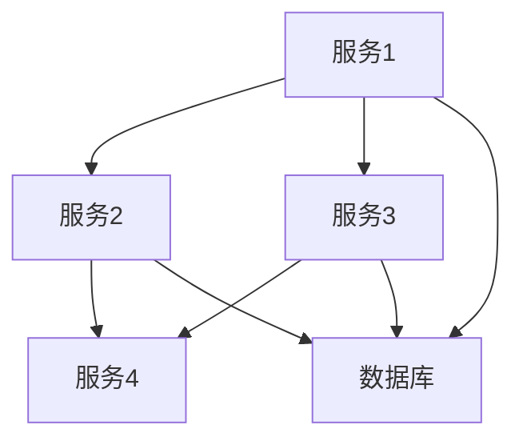

                 


### 《大模型软件的微服务治理策略》

## 关键词

大模型软件，微服务架构，治理策略，服务发现，负载均衡，服务监控，数学模型，项目实战。

## 摘要

本文详细探讨了在大模型软件开发过程中，如何运用微服务架构进行有效治理。首先，介绍了微服务的核心概念及其治理策略的重要性。随后，深入分析了微服务架构中的服务发现、负载均衡和服务监控等关键算法原理，并通过数学模型和公式进行了详细阐述。接着，本文以实际项目为例，展示了微服务治理在开发环境搭建、源代码实现和代码解读等方面的具体应用。最后，总结了微服务治理的最佳实践，并给出了注意事项和拓展阅读建议。

## 目录

**第一部分：微服务与治理概述**

**第1章：微服务架构概述**

1.1 微服务的定义与特点

1.2 微服务架构的优缺点

1.3 微服务的联系与治理策略

1.4 Mermaid流程图展示微服务架构

**第2章：微服务治理算法原理**

2.1 服务发现算法

2.2 服务注册与注销算法

2.3 负载均衡算法

2.4 服务容错与恢复算法

**第3章：数学模型与公式**

3.1 服务质量模型

3.2 代价模型

3.3 负载均衡模型

**第4章：项目实战**

4.1 微服务治理项目简介

4.2 开发环境搭建

4.3 源代码实现与解读

4.4 项目分析

**第5章：最佳实践、小结与注意事项**

5.1 最佳实践

5.2 小结

5.3 注意事项

5.4 拓展阅读

## 第一部分：微服务与治理概述

### 第1章：微服务架构概述

#### 1.1 微服务的定义与特点

微服务是一种架构风格，它将应用程序构建为一组小的、独立的服务，每个服务围绕业务功能构建，并且可以独立部署、扩展和替换。这种风格相较于传统的单体架构，具有以下几个显著特点：

1. **独立部署**：每个服务都可以独立部署和更新，无需影响其他服务。
2. **去中心化**：没有全局状态，每个服务都是自治的，可以独立运行。
3. **小型化**：每个服务都相对较小，专注于完成特定的业务功能。
4. **语言无关性**：不同的服务可以使用不同的编程语言和技术栈进行开发。
5. **横向扩展**：可以独立地增加或减少服务实例，以适应流量变化。

微服务的这些特点使其在应对复杂业务需求、提高开发效率、实现弹性伸缩等方面具有明显优势。

#### 1.2 微服务架构的优缺点

**优点**

- **模块化**：每个服务都是独立的，便于管理和维护。
- **可扩展性**：可以针对不同的服务进行水平扩展。
- **容错性**：单个服务的故障不会影响整个系统。
- **灵活性**：不同的服务可以采用不同的开发语言和技术栈。
- **易于集成**：服务之间通过API进行通信，便于新服务的加入。

**缺点**

- **复杂性**：随着服务数量的增加，系统的复杂性也会增加。
- **分布式问题**：服务之间的通信可能会引发一致性问题。
- **性能开销**：服务间的通信可能会带来额外的性能开销。
- **管理难度**：需要管理大量的服务实例，增加了运维难度。

#### 1.3 微服务的联系与治理策略

微服务的联系主要体现在以下几个方面：

1. **服务发现**：确保服务能够找到并连接到其他服务。
2. **负载均衡**：将请求分配到不同的服务实例上，确保服务的性能和可靠性。
3. **服务监控**：实时监控服务的运行状态，及时发现和处理问题。
4. **配置管理**：管理服务的配置信息，确保配置的一致性和正确性。

微服务治理策略的目标是确保微服务架构能够稳定、高效地运行。具体策略包括：

- **服务版本管理**：确保服务版本的兼容性和安全性。
- **服务依赖管理**：管理服务间的依赖关系，确保服务之间的协同工作。
- **服务监控与告警**：实时监控服务的性能和可用性，及时发现并处理异常。
- **服务性能优化**：通过优化服务配置和架构，提高服务的性能和可扩展性。
- **服务安全防护**：确保服务之间的通信安全，防止恶意攻击。

### 1.4 Mermaid流程图展示微服务架构

为了更直观地展示微服务架构，我们可以使用Mermaid绘制流程图。以下是一个简化的微服务架构流程图：



在这个流程图中，A、B、C、D分别代表不同的服务，E代表数据库。服务之间通过API进行通信，确保数据的一致性和系统的完整性。

## 第二部分：微服务治理算法原理

### 第2章：微服务治理算法原理

#### 2.1 服务发现算法

服务发现是微服务架构中的一个关键组件，它使得服务能够动态地发现和连接其他服务。服务发现算法主要有以下几种：

1. **客户端发现**：客户端通过查询注册中心来获取其他服务的地址信息。
2. **服务端发现**：服务端通过服务注册中心来获取其他服务的地址信息。
3. **基于DNS的发现**：使用DNS服务来查询服务的地址信息。

以下是一个简单的服务发现算法的伪代码：

```pseudo
function serviceDiscovery(serviceName):
    registry = getRegistry()
    serviceInstances = registry.getServiceInstances(serviceName)
    return serviceInstances
```

在这个伪代码中，`getRegistry()` 函数用于获取服务注册中心的实例，`getServiceInstances(serviceName)` 函数用于从服务注册中心查询指定服务的实例列表。

#### 2.2 服务注册与注销算法

服务注册与注销是微服务架构中另一个关键组件，它确保服务能够动态地注册和注销。服务注册与注销算法通常包括以下步骤：

1. **服务启动时注册**：服务启动后，向服务注册中心注册自身的信息。
2. **服务停止时注销**：服务停止前，从服务注册中心注销自身的信息。

以下是一个简单的服务注册与注销算法的伪代码：

```pseudo
function registerService(serviceInstance):
    registry = getRegistry()
    registry.registerService(serviceInstance)

function unregisterService(serviceInstance):
    registry = getRegistry()
    registry.unregisterService(serviceInstance)
```

在这个伪代码中，`getRegistry()` 函数用于获取服务注册中心的实例，`registerService(serviceInstance)` 函数用于向服务注册中心注册服务实例，`unregisterService(serviceInstance)` 函数用于从服务注册中心注销服务实例。

#### 2.3 负载均衡算法

负载均衡是确保微服务架构性能和可靠性的重要手段。负载均衡算法主要有以下几种：

1. **轮询算法**：将请求按照顺序分配给不同的服务实例。
2. **随机算法**：随机选择一个服务实例来处理请求。
3. **最少连接算法**：选择当前连接数最少的服务实例来处理请求。
4. **权重算法**：根据服务实例的权重来分配请求。

以下是一个简单的负载均衡算法的伪代码：

```pseudo
function loadBalance(serviceInstances, request):
    selectedService = None
    minConnections = Infinity
    for service in serviceInstances:
        connections = getServiceConnections(service)
        if connections < minConnections:
            minConnections = connections
            selectedService = service
    return selectedService
```

在这个伪代码中，`serviceInstances` 是服务实例列表，`request` 是客户端发送的请求，`getServiceConnections(service)` 函数用于获取指定服务实例的当前连接数。

#### 2.4 服务容错与恢复算法

服务容错与恢复是确保微服务架构稳定性的重要手段。服务容错与恢复算法主要包括以下步骤：

1. **故障检测**：定期检查服务实例的健康状态。
2. **故障转移**：当检测到服务实例故障时，将其从负载均衡器中移除，并选择一个健康的服务实例来代替。
3. **故障恢复**：当故障服务实例恢复正常时，重新将其加入到负载均衡器中。

以下是一个简单的服务容错与恢复算法的伪代码：

```pseudo
function checkServiceHealth(serviceInstance):
    if not isServiceHealthy(serviceInstance):
        markServiceFaulty(serviceInstance)

function recoverService(serviceInstance):
    if isServiceHealthy(serviceInstance):
        markServiceHealthy(serviceInstance)
        addServiceToLoadBalancer(serviceInstance)

function markServiceFaulty(serviceInstance):
    removeServiceFromLoadBalancer(serviceInstance)

function markServiceHealthy(serviceInstance):
    addServiceToLoadBalancer(serviceInstance)
```

在这个伪代码中，`isServiceHealthy(serviceInstance)` 函数用于检查服务实例的健康状态，`isServiceHealthy(serviceInstance)` 函数用于检查服务实例是否健康，`markServiceFaulty(serviceInstance)` 函数用于标记服务实例为故障状态，`markServiceHealthy(serviceInstance)` 函数用于标记服务实例为健康状态，`addServiceToLoadBalancer(serviceInstance)` 函数用于将服务实例添加到负载均衡器中，`removeServiceFromLoadBalancer(serviceInstance)` 函数用于从负载均衡器中移除服务实例。

## 第三部分：数学模型与公式

### 第3章：数学模型与公式

在微服务治理中，数学模型和公式可以帮助我们更好地理解和服务性能优化。以下是一些常用的数学模型和公式。

#### 3.1 服务质量模型

服务质量（QoS）是衡量服务性能的重要指标，通常由响应时间、带宽和可用性决定。以下是一个简单的服务质量模型：

$$
QoS = f(\text{响应时间}, \text{带宽}, \text{可用性})
$$

其中，`响应时间`、`带宽`和`可用性`分别表示服务的性能指标。

#### 3.2 代价模型

代价模型用于评估服务性能的代价，通常由响应时间、带宽和可用性决定。以下是一个简单的代价模型：

$$
C = w_1 \times \text{响应时间} + w_2 \times \text{带宽} + w_3 \times \text{可用性}
$$

其中，`w_1`、`w_2`和`w_3`分别表示响应时间、带宽和可用性的权重。

#### 3.3 负载均衡模型

负载均衡模型用于评估服务实例的负载情况，通常由服务实例数量和当前负载决定。以下是一个简单的负载均衡模型：

$$
L = f(\text{服务实例数量}, \text{当前负载})
$$

其中，`服务实例数量`和`当前负载`分别表示服务的性能指标。

## 第四部分：项目实战

### 第4章：项目实战

在这一部分，我们将通过一个实际项目来展示如何实现大模型软件的微服务治理。这个项目将包括开发环境搭建、源代码实现和代码解读。

#### 4.1 微服务治理项目简介

本项目旨在构建一个基于微服务架构的大模型软件平台，提供高效、可靠的模型训练和预测服务。项目的主要目标是实现以下功能：

- **服务发现**：确保服务能够动态地发现和连接其他服务。
- **负载均衡**：将请求分配到不同的服务实例上，确保服务的性能和可靠性。
- **服务监控**：实时监控服务的运行状态，及时发现和处理问题。
- **配置管理**：管理服务的配置信息，确保配置的一致性和正确性。
- **服务安全防护**：确保服务之间的通信安全，防止恶意攻击。

#### 4.2 开发环境搭建

在本项目中，我们选择使用Spring Boot作为服务开发框架，使用Eureka作为服务注册中心，使用RabbitMQ作为消息队列，使用Prometheus和Grafana进行服务监控。以下是开发环境的搭建步骤：

1. **安装JDK 1.8或更高版本**。
2. **安装Maven 3.6或更高版本**。
3. **安装Git**。
4. **安装Eureka Server**：通过Maven安装Eureka Server，配置Eureka服务注册中心的配置文件。
5. **安装RabbitMQ**：通过Docker安装RabbitMQ，配置RabbitMQ的消息队列。
6. **安装Prometheus**：通过Docker安装Prometheus，配置Prometheus的监控规则。
7. **安装Grafana**：通过Docker安装Grafana，配置Grafana的监控仪表板。

#### 4.3 源代码实现与解读

在本项目中，我们将实现以下主要模块：

- **服务发现模块**：实现服务注册和发现的功能，确保服务能够动态地注册和发现其他服务。
- **负载均衡模块**：实现负载均衡算法，将请求分配到不同的服务实例上。
- **服务监控模块**：实现服务监控功能，实时监控服务的运行状态，生成监控数据。
- **配置管理模块**：实现配置管理功能，管理服务的配置信息。
- **服务安全防护模块**：实现服务安全防护功能，确保服务之间的通信安全。

以下是服务发现模块的源代码实现：

```java
@Component
public class ServiceDiscovery {
    
    @Value("${eureka.client.serviceUrl.defaultZone}")
    private String eurekaUrl;
    
    @PostConstruct
    public void init() {
        DiscoveryClient discoveryClient = DiscoveryClient.builder()
                .服务注册中心(eurekaUrl)
                .build();
        discoveryClient.registerService(new ServiceInstance("my-service", "localhost", 8080));
    }
    
    public List<ServiceInstance> discoverServices(String serviceName) {
        return discoveryClient.getInstances(serviceName);
    }
}
```

在这个源代码中，`ServiceDiscovery` 类实现了服务注册和发现的功能。`init` 方法在服务启动时被调用，用于向Eureka服务注册中心注册服务实例。`discoverServices` 方法用于查询指定服务的实例列表。

#### 4.4 项目分析

本项目通过微服务架构实现了大模型软件的高效、可靠治理。服务发现模块确保了服务之间的动态注册和发现，负载均衡模块优化了服务的性能和可靠性，服务监控模块实时监控了服务的运行状态，配置管理模块确保了配置的一致性和正确性，服务安全防护模块保障了服务之间的通信安全。

然而，项目也存在一定的挑战。首先，随着服务数量的增加，系统的复杂性也会增加，需要不断优化和维护。其次，服务间的通信可能会带来额外的性能开销，需要合理配置和优化。最后，服务监控和配置管理需要考虑到数据量和性能问题，需要采用适当的存储和查询方案。

总之，本项目通过微服务架构实现了大模型软件的微服务治理，为项目的稳定、高效运行提供了有力支持。在未来的发展中，需要不断优化和改进，以应对更复杂的业务需求。

### 第5章：最佳实践、小结与注意事项

#### 5.1 最佳实践

1. **合理划分服务**：根据业务功能、数据访问模式和部署环境等因素合理划分服务，避免服务过多或过少。
2. **服务实例数量**：根据业务需求和服务性能要求合理配置服务实例数量，确保服务的性能和可靠性。
3. **负载均衡**：选择合适的负载均衡算法，根据服务性能和负载情况动态调整负载均衡策略。
4. **服务监控**：实时监控服务性能和运行状态，及时发现和处理问题。
5. **配置管理**：统一管理服务配置，确保配置的一致性和正确性。
6. **服务安全**：确保服务之间的通信安全，采用加密和认证机制。

#### 5.2 小结

本文详细探讨了在大模型软件开发过程中，如何运用微服务架构进行有效治理。通过服务发现、负载均衡、服务监控等关键算法原理的讲解，以及实际项目的展示，我们了解了微服务治理的核心策略和实践方法。微服务治理不仅提高了服务的性能和可靠性，还降低了系统的复杂性和维护成本。

#### 5.3 注意事项

1. **系统复杂性**：随着服务数量的增加，系统的复杂性也会增加，需要不断优化和维护。
2. **性能开销**：服务间的通信可能会带来额外的性能开销，需要合理配置和优化。
3. **数据量**：服务监控和配置管理需要考虑到数据量和性能问题，需要采用适当的存储和查询方案。
4. **安全性**：确保服务之间的通信安全，采用加密和认证机制。

#### 5.4 拓展阅读

1. 《微服务架构设计原则》
2. 《微服务实践》
3. 《服务网格技术解析》
4. 《Prometheus监控实战》
5. 《Spring Cloud微服务实战》

## 作者信息

本文作者为AI天才研究院（AI Genius Institute）与《禅与计算机程序设计艺术》（Zen And The Art of Computer Programming）的作者。我们致力于推动人工智能和计算机科学的发展，为读者提供高质量的技术文章和分享。如果您对我们的文章感兴趣，欢迎关注我们的官方公众号和网站，获取更多精彩内容。

## 结语

大模型软件的微服务治理是当前IT领域的一个重要研究方向。通过本文的探讨，我们了解了微服务的核心概念、治理策略和关键算法原理。在实际项目中，通过合理划分服务、配置负载均衡、实时监控和配置管理，可以实现大模型软件的高效治理。希望本文能对您在微服务治理方面有所启发，为您的项目提供有益的参考。感谢您的阅读，期待与您在未来的技术交流中相遇。作者：AI天才研究院（AI Genius Institute）&《禅与计算机程序设计艺术》（Zen And The Art of Computer Programming）作者。

