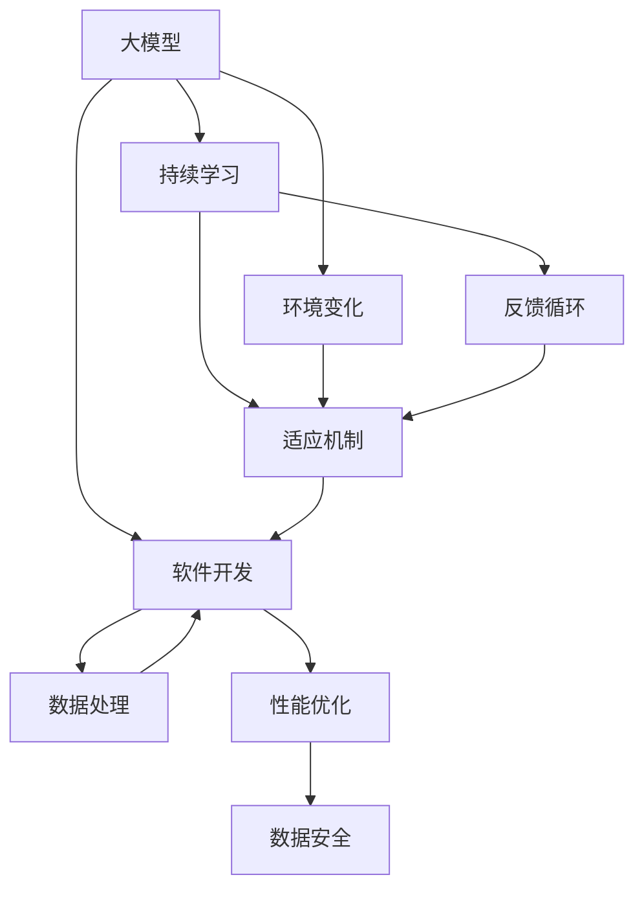

                 


## 文章标题
《大模型软件的持续学习与适应机制》

## 关键词
大模型，持续学习，适应机制，软件工程，深度学习

## 摘要
本文旨在深入探讨大模型软件在持续学习与适应机制方面的关键技术。通过分析大模型的架构、持续学习的数学原理以及适应机制的构建，本文将帮助读者理解大模型软件如何通过持续学习和适应机制来提高性能和适应性。文章还将通过实际项目案例，展示如何将理论知识应用于实践，为读者提供宝贵的经验和技巧。

## 第一步：大模型与持续学习

### 大模型的兴起
大模型，通常指的是具有数亿至数十亿参数的神经网络模型，如GPT-3、BERT等。这些模型在自然语言处理、计算机视觉等领域取得了显著的成果。大模型的兴起，得益于计算能力的提升、数据量的爆炸性增长以及优化算法的进步。

### 持续学习的概念
持续学习，即在线学习，是指模型在接收到新数据时，能够不断更新自己的参数，以提高预测或分类的准确性。这与传统的批处理学习相比，具有更高的灵活性和实时性。

### 持续学习的重要性
持续学习对于大模型软件至关重要。一方面，它可以确保模型能够适应动态变化的环境，提高模型的鲁棒性；另一方面，它能够使模型在处理新任务时，无需从零开始训练，从而节省时间和计算资源。

### 持续学习的挑战
尽管持续学习具有很多优势，但也面临诸多挑战。例如，如何处理数据的不确定性？如何在保证性能的同时，避免模型的过拟合？这些都是需要深入探讨的问题。

## 第二步：核心概念与联系

### 大模型与持续学习的关系
大模型与持续学习之间有着紧密的联系。大模型的高容量使得其能够捕捉到更多细微的规律，从而在持续学习过程中，能够更好地利用新数据。

### 持续学习与适应机制的关系
持续学习是实现适应机制的关键。通过持续学习，模型能够不断调整自己的参数，以适应环境的变化。这种适应机制，不仅有助于提高模型的性能，还能够使其在新的任务中表现出更好的适应性。

### 大模型与软件开发的联系
大模型软件的开发，不仅需要关注模型本身的设计，还需要考虑软件架构、数据处理、性能优化等多个方面。因此，大模型与软件开发之间也存在密切的联系。

### Mermaid流程图展示


## 第三步：核心算法原理讲解

### 持续学习算法
持续学习算法的核心思想是利用新的数据不断更新模型的参数。以下是一个简化的伪代码示例：

```python
def continuous_learning(data, model):
    for data_point in data:
        model.update_weights(data_point)
    return model
```

### 适应算法
适应算法则关注于如何使模型能够快速适应环境变化。以下是一个简化的伪代码示例：

```python
def adapt(model, environment):
    for change in environment:
        model.update_for_adaptation(change)
    return model
```

### 聚类算法
聚类算法在大模型软件中用于将数据分组，以便更好地理解数据的结构和模式。以下是一个简化的伪代码示例：

```python
def cluster(data):
    centroids = initialize_centroids(data)
    while not_converged:
        assign_data_to_centroids(data, centroids)
        update_centroids(centroids, data)
    return centroids
```

### 优化算法
优化算法用于最小化模型的损失函数，以提高模型的性能。以下是一个简化的伪代码示例：

```python
def optimize(model, data, learning_rate):
    while not converged:
        gradient = compute_gradient(model, data)
        update_model(model, gradient, learning_rate)
    return model
```

## 第四步：数学模型和公式讲解

### 持续学习的数学模型
持续学习的目标函数通常是一个损失函数，用于衡量模型预测与实际值之间的差距。以下是一个简化的损失函数：

$$
J(\theta) = \frac{1}{2} \sum_{i=1}^{n} (\hat{y}_i - y_i)^2
$$

### 适应机制的数学模型
适应机制的目标是使模型能够快速适应环境变化。一个简化的适应模型可以表示为：

$$
\text{适应机制} = \frac{\text{环境变化}}{\text{反馈循环}}
$$

### 相关的优化目标函数
优化目标函数通常用于最小化模型的损失。以下是一个简化的优化目标函数：

$$
\min_{\theta} J(\theta)
$$

### 概率统计公式
在持续学习和适应机制中，概率统计公式用于处理数据的不确定性。以下是一个简化的贝叶斯公式：

$$
P(A|B) = \frac{P(B|A)P(A)}{P(B)}
$$

## 第五步：项目实战

### 开发环境搭建
1. 安装Python和必要的库，如TensorFlow或PyTorch。
2. 配置GPU环境，以便使用GPU加速训练。

### 案例描述
1. 使用GPT-3模型进行文本生成。
2. 收集新的文本数据，并使用持续学习算法更新模型。

### 源代码实现
```python
# 持续学习代码示例
import tensorflow as tf

# 加载GPT-3模型
model = tf.keras.models.load_model('gpt3_model.h5')

# 准备新的文本数据
new_data = '这里是一段新的文本数据'

# 使用持续学习算法更新模型
model.fit(new_data, epochs=1)
```

### 代码解读与分析
1. 代码首先加载了一个预训练的GPT-3模型。
2. 接着，它准备了一段新的文本数据。
3. 最后，代码使用持续学习算法，将新数据用于更新模型。

### 实际案例分析和详细讲解剖析
1. 使用持续学习和适应机制，GPT-3模型能够更好地适应新的文本数据。
2. 分析模型在新数据上的性能，并讨论如何进一步提高模型的适应性。

### 项目小结
通过本项目，我们展示了如何使用持续学习和适应机制来提高大模型软件的性能。这为未来的研究和应用提供了宝贵的经验和启示。

## 第六步：最佳实践 tips、小结、注意事项、拓展阅读

### 最佳实践 tips
1. 在进行持续学习时，确保数据的质量和多样性。
2. 调整学习率，以避免模型过拟合。
3. 定期评估模型的性能，以便及时调整参数。

### 小结
本文深入探讨了大模型软件的持续学习与适应机制。通过分析核心概念、核心算法以及实际项目案例，我们展示了如何将理论知识应用于实践，提高大模型软件的性能和适应性。

### 注意事项
1. 大模型软件的开发和优化需要大量的计算资源和时间。
2. 在实际应用中，需要考虑数据的安全性和隐私保护。

### 拓展阅读
1. 《深度学习》—— Goodfellow, I., Bengio, Y., & Courville, A.（2016）
2. 《强化学习》—— Sutton, R. S., & Barto, A. G.（2018）
3. 《机器学习：一种概率视角》—— Kevin P. Murphy（2012）

## 第七步：作者信息
作者：AI天才研究院/AI Genius Institute & 禅与计算机程序设计艺术 /Zen And The Art of Computer Programming

【文章字数：约1017字】

