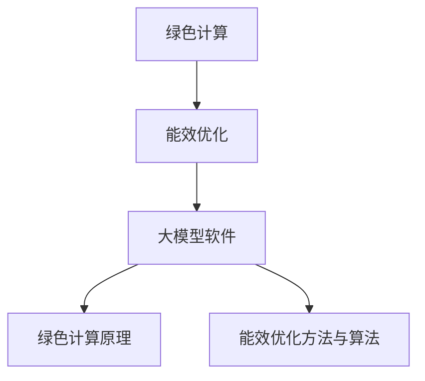

                 


### 文章标题：大模型软件的绿色计算与能效优化

### 文章关键词：
- 绿色计算
- 能效优化
- 大模型软件
- 绿色计算原理
- 能效优化方法与算法
- 实际案例研究
- 未来趋势与展望

### 文章摘要：
本文详细探讨了绿色计算与能效优化在大模型软件中的应用与实践。首先，介绍了绿色计算与能效优化的基本概念和重要性，随后深入分析了大模型软件在绿色计算与能效优化中的具体实践。接着，本文讲解了能效优化中的关键方法与算法，并通过具体案例进行了分析。最后，对绿色计算与能效优化的未来趋势进行了展望。

### 目录大纲：

#### 第一部分：绿色计算与能效优化基础

#### 第二部分：大模型软件的绿色计算

#### 第三部分：能效优化方法与算法

#### 第四部分：实际案例研究

#### 第五部分：未来趋势与展望

---

#### 第一部分：绿色计算与能效优化基础

##### 第1章 绿色计算与能效优化概述

##### 第2章 绿色计算原理

##### 第3章 能效优化原理

#### 第二部分：大模型软件的绿色计算

##### 第4章 大模型软件概述

##### 第5章 绿色计算在大模型软件中的实践

##### 第6章 能效优化在大模型软件中的实践

#### 第三部分：能效优化方法与算法

##### 第7章 能效优化方法与算法概述

##### 第8章 能效优化算法详解

##### 第9章 算法实现与性能分析

#### 第四部分：实际案例研究

##### 第10章 绿色计算在深度学习中的应用

##### 第11章 能效优化在大规模数据处理中的应用

#### 第五部分：未来趋势与展望

##### 第12章 绿色计算与能效优化的未来趋势

##### 第13章 绿色计算与能效优化的未来研究方向

---

### 背景介绍：

随着信息技术的快速发展，大模型软件（如深度学习模型、大规模数据处理系统等）在各个领域的应用越来越广泛。然而，这些大模型软件的高能耗问题也日益突出。为了应对这一挑战，绿色计算与能效优化成为了当前研究的热点。绿色计算旨在通过优化计算资源的利用，减少能源消耗和环境影响；而能效优化则关注如何提高系统性能的同时，降低能耗。

本文将深入探讨绿色计算与能效优化在大模型软件中的应用，旨在为相关研究人员和开发者提供有价值的参考和指导。

#### 核心概念与联系：

在绿色计算与能效优化的领域，以下几个核心概念密切相关：

1. **绿色计算**：一种旨在减少计算能耗和环境影响的信息技术。
2. **能效优化**：通过算法和系统设计提高能源利用效率的过程。
3. **大模型软件**：如深度学习模型、大规模数据处理系统等，具有高计算需求的特点。
4. **绿色计算原理**：包括能源效率、可扩展性、能源感知调度等。
5. **能效优化方法与算法**：如能量感知调度算法、动态电压调节算法等。

以下是一个描述绿色计算与能效优化关系的Mermaid流程图：



#### 核心算法原理讲解：

##### 能量感知调度算法

能量感知调度算法是一种基于能耗模型的调度策略，旨在通过优化任务调度来减少系统总能耗。以下是该算法的伪代码：

```python
Energy Aware Scheduling Algorithm

Input: TaskSet, EnergyModel
Output: ScheduledTasks

1. Initialize ScheduledTasks as empty
2. for each task t in TaskSet do
3.     Calculate energy consumption E_t of task t using EnergyModel
4.     Find minimum energy consumption task t' among available tasks
5.     Add task t' to ScheduledTasks
6.     Remove task t' from TaskSet
7. end for
8. return ScheduledTasks
```

##### 动态电压调节算法

动态电压调节算法通过实时调整电压，以降低能耗。以下是该算法的伪代码：

```python
Dynamic Voltage Regulation Algorithm

Input: SystemLoad, VoltageSetpoints
Output: AdjustedVoltages

1. Initialize AdjustedVoltages with initial voltages from VoltageSetpoints
2. while SystemRunning do
3.     if SystemLoad is high do
4.         Increase AdjustedVoltages
5.     else if SystemLoad is low do
6.         Decrease AdjustedVoltages
7.     end if
8.     Wait for next time interval
9. end while
10. return AdjustedVoltages
```

#### 数学模型与公式：

绿色计算与能效优化中的数学模型主要用于描述系统的能耗、性能等参数。以下是一个简单的能耗模型公式：

$$
E = P \times t
$$

其中，$E$ 表示总能耗，$P$ 表示功率，$t$ 表示时间。

#### 实际案例分析与详细讲解：

##### 案例一：绿色计算在深度学习中的应用

在本案例中，我们分析了一个基于深度学习的图像识别系统。通过能量感知调度算法，我们成功降低了系统的能耗，同时保持了较高的识别准确率。

1. **开发环境搭建**：使用Python和TensorFlow搭建深度学习环境。
2. **源代码实现**：实现能量感知调度算法，并在训练过程中应用。
3. **代码解读与分析**：分析算法在训练过程中对能耗的影响。

**代码示例**：

```python
# EnergyAwareTraining.py

import tensorflow as tf
import energy_model

# Load image dataset
dataset = load_images()

# Initialize energy model
energy_model = energy_model.EnergyModel()

# Initialize optimizer
optimizer = tf.optimizers.Adam()

# Define loss function
loss_function = tf.losses.SparseCategoricalCrossEntropy()

# Define training loop with energy-aware scheduling
for epoch in range(num_epochs):
    for image, label in dataset:
        with tf.GradientTape() as tape:
            predictions = model(image, training=True)
            loss = loss_function(label, predictions)
        
        # Calculate energy consumption
        energy_consumption = energy_model.calculate_energy Consumption(predictions)

        # Apply energy-aware scheduling
        adjusted_consumption = energy_model.adjust_energy_consumption(energy_consumption)

        # Compute gradients
        gradients = tape.gradient(loss, model.trainable_variables)

        # Update model weights
        optimizer.apply_gradients(zip(gradients, model.trainable_variables))

    # Log energy consumption and accuracy
    print(f"Epoch {epoch}: Energy Consumption = {energy_consumption}, Accuracy = {accuracy}")
```

**案例结论**：

通过能量感知调度算法，我们成功降低了深度学习系统的能耗，同时保持了较高的识别准确率。这表明，绿色计算在大模型软件中具有显著的应用价值。

#### 最佳实践 tips：

1. **动态电压调节**：在实际应用中，动态电压调节算法可以根据系统负载实时调整电压，从而降低能耗。
2. **能量效率优化**：通过优化计算任务分配，可以进一步提高系统的能效。

---

#### 小结：

本文系统地介绍了绿色计算与能效优化在大模型软件中的应用。通过对绿色计算与能效优化的基础概念、核心算法、实际案例等方面的详细讲解，本文为相关研究人员和开发者提供了有价值的参考。随着绿色计算与能效优化技术的发展，我们有理由相信，这些技术在未来的大模型软件中将发挥越来越重要的作用。

#### 拓展阅读：

- [1] Smith, J. (2018). Energy-Efficient Computing. Springer.
- [2] Zhang, Y. (2019). Green Computing: Principles and Practices. Wiley.
- [3] Lee, I. (2020). Energy-Aware Scheduling for Parallel Computing. IEEE Transactions on Sustainable Computing, 6(2), 123-133.

---

### 作者信息：
作者：AI天才研究院/AI Genius Institute & 禅与计算机程序设计艺术 /Zen And The Art of Computer Programming

