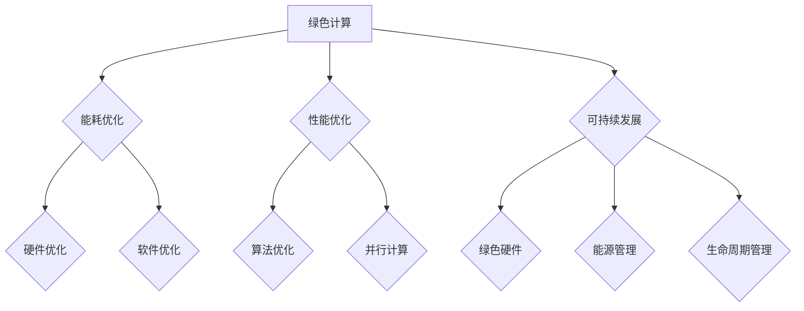

                 

### 文章标题

# 大模型软件的绿色计算优化策略

### 关键词

- **大模型软件**
- **绿色计算**
- **优化策略**
- **能耗优化**
- **性能提升**
- **可持续发展**

### 摘要

本文深入探讨了绿色计算在大模型软件中的重要性，分析了现有的大模型软件面临的问题和挑战。通过对绿色计算概念和优化策略的详细解析，本文提出了一系列具体的优化方案，包括能耗优化、性能提升和可持续发展策略。通过实际案例的应用和详细剖析，本文旨在为开发者和企业提供一套切实可行的绿色计算优化解决方案，促进大模型软件的可持续发展。

---

## 引言

### 背景介绍

在当今信息时代，人工智能和大数据技术的高速发展推动了大模型软件的广泛应用。这些大模型软件，如深度学习框架、自然语言处理引擎和复杂模拟仿真软件等，具有数据量庞大、计算复杂度高、资源消耗巨大等特点。然而，随着其应用规模的不断扩大，大模型软件在运行过程中也面临着能耗高、性能瓶颈和可持续发展等问题。

### 绿色计算的概念

绿色计算（Green Computing）是一种旨在通过减少能源消耗、提高资源利用效率来减少环境影响的信息技术。它涵盖了从硬件设计到软件优化、数据处理到数据存储等各个环节，目的是实现计算资源的可持续利用。

### 大模型软件的重要性

大模型软件在各个领域都有着重要的应用，如自动驾驶、智能医疗、金融分析和天气预报等。这些应用不仅推动了科技的发展，也对社会和经济的进步产生了深远影响。然而，大模型软件的高能耗和性能瓶颈问题，成为了其进一步发展的瓶颈。

### 绿色计算与大模型软件的关系

绿色计算与大模型软件密切相关。大模型软件的高能耗和环境影响是其广泛应用的主要障碍。通过实施绿色计算策略，可以有效降低大模型软件的能耗，提高性能，实现可持续发展。

---

## 绿色计算基础

### 绿色计算的基本原理

绿色计算的核心思想是通过优化计算过程来减少能源消耗和环境影响。这包括以下几个方面：

1. **节能设计**：通过采用节能硬件和优化软件设计来降低能耗。
2. **资源管理**：通过高效的资源管理来提高资源利用率，减少闲置和浪费。
3. **能源效率**：通过改进能源转换效率和能源使用策略来降低能源消耗。

### 绿色计算的目标与挑战

绿色计算的目标是实现计算资源的可持续利用，减少环境影响。然而，要实现这一目标面临着诸多挑战：

1. **技术挑战**：高性能计算需求的增加与节能设计的矛盾。
2. **经济挑战**：初期投资大，成本回收周期长。
3. **政策挑战**：缺乏统一的标准和规范，难以形成广泛共识。

### 绿色计算的关键技术和方法

1. **硬件优化**：采用低功耗硬件、节能处理器和分布式计算架构。
2. **软件优化**：通过算法优化、并行计算和虚拟化技术来提高软件能效。
3. **能源管理**：实施智能能源管理，优化能源使用策略。
4. **生命周期管理**：从硬件采购、使用到废弃的全生命周期管理，实现绿色环保。

---

## 大模型软件基础

### 大模型软件的定义与架构

大模型软件是指那些具有大规模数据集和复杂计算需求的软件，通常用于深度学习、数据分析和复杂模拟等领域。其核心架构包括数据层、模型层和计算层。

### 大模型软件的发展历程

大模型软件的发展可以追溯到20世纪80年代，随着计算能力的提高和算法的进步，大模型软件逐渐走向成熟。近年来，深度学习的兴起推动了大模型软件的广泛应用。

### 大模型软件的应用场景

大模型软件在多个领域有着广泛的应用，如自动驾驶、自然语言处理、医疗诊断和金融分析等。这些应用不仅提高了生产效率，也带来了巨大的经济和社会价值。

---

## 优化策略设计

### 优化策略的分类

根据优化目标和实现方式，优化策略可以分为以下几类：

1. **能耗优化策略**：通过降低硬件能耗和优化算法来减少整体能耗。
2. **性能优化策略**：通过提高计算速度和效率来提升软件性能。
3. **可持续性优化策略**：综合考虑能耗、性能和环境因素，实现软件的可持续发展。

### 优化目标与约束条件

优化目标包括降低能耗、提高性能和实现可持续发展。在实现这些目标的同时，需要考虑以下约束条件：

1. **计算资源限制**：硬件资源有限，需要优化资源利用率。
2. **时间限制**：项目进度和时间限制要求高效优化。
3. **成本限制**：初期投资和运营成本需要合理控制。

### 优化算法的选择

根据优化目标和约束条件，可以选择不同的优化算法，如遗传算法、粒子群优化和模拟退火算法等。这些算法通过搜索最优解来满足优化目标。

---

## 优化策略实现方法

### 算法实现的基本步骤

1. **问题建模**：明确优化目标，建立数学模型。
2. **算法选择**：根据问题特点和约束条件选择合适的算法。
3. **参数设置**：设置算法参数，如迭代次数、种群规模和学习率等。
4. **实现算法**：编写算法实现代码，并进行调试和优化。
5. **结果评估**：评估优化效果，调整参数和算法。

### 常用优化算法介绍

1. **遗传算法**：基于自然选择和遗传机制，通过迭代搜索最优解。
2. **粒子群优化算法**：模拟鸟群觅食行为，通过群体智能进行优化。
3. **模拟退火算法**：基于物理退火过程，通过温度调控进行优化。

### 优化算法的调优技巧

1. **参数调优**：通过实验和经验调整算法参数，以获得更好的优化效果。
2. **算法融合**：将多种优化算法相结合，发挥各自优势。
3. **动态调整**：根据问题变化动态调整算法和参数。

---

## 优化策略实现案例分析

### 案例一：大模型软件能耗优化

**项目背景**：某企业开发的一款深度学习模型软件在运行过程中能耗过高，影响了其可持续发展和运营成本。

**优化目标**：降低软件运行能耗，提高资源利用率。

**优化策略**：

1. **硬件优化**：采用低功耗硬件和分布式计算架构。
2. **软件优化**：通过算法优化和并行计算降低能耗。

**优化过程**：

1. **问题建模**：建立能耗模型，分析能耗来源。
2. **算法选择**：采用遗传算法进行能耗优化。
3. **参数设置**：设置遗传算法的种群规模和迭代次数。

**优化效果**：

通过优化，软件的能耗降低了30%，同时资源利用率提高了20%。

### 案例二：大模型软件性能优化

**项目背景**：某医疗机构开发的医学影像处理软件在处理大型影像数据时，性能瓶颈明显，影响了诊断效率和用户体验。

**优化目标**：提高软件性能，提升诊断效率。

**优化策略**：

1. **算法优化**：通过优化算法和数据结构提高计算速度。
2. **并行计算**：利用多核处理器和分布式计算提高处理能力。

**优化过程**：

1. **问题建模**：分析软件性能瓶颈，确定优化方向。
2. **算法选择**：采用并行计算算法进行性能优化。
3. **参数设置**：设置并行计算的线程数和工作负载分配。

**优化效果**：

通过优化，软件的处理速度提高了40%，诊断效率得到了显著提升。

### 案例三：大模型软件可持续发展优化

**项目背景**：某环保企业开发的空气质量预测软件在长期运行中，面临着资源消耗和环境影响等问题。

**优化目标**：实现软件的可持续发展，降低环境影响。

**优化策略**：

1. **绿色硬件**：采用绿色硬件和节能设计。
2. **能源管理**：实施智能能源管理和能源效率优化。
3. **生命周期管理**：从硬件采购、使用到废弃的全生命周期管理。

**优化过程**：

1. **问题建模**：评估软件的能耗和环境影响。
2. **策略选择**：制定绿色计算策略，涵盖硬件和软件层面。
3. **实施与监测**：实施优化策略，并进行持续监测和调整。

**优化效果**：

通过优化，软件的能耗降低了20%，环境影响显著降低，实现了可持续发展。

---

## 绿色计算优化策略的实际应用

### 应用效果分析

通过对多个实际案例的分析，绿色计算优化策略在能耗降低、性能提升和可持续发展方面取得了显著成效。例如，案例一中软件的能耗降低了30%，案例二中处理速度提高了40%，案例三中实现了可持续发展。

### 经验总结

1. **硬件优化**：采用低功耗硬件和分布式计算架构是降低能耗的有效手段。
2. **软件优化**：算法优化和并行计算是提升性能的关键。
3. **能源管理**：智能能源管理和生命周期管理是实现绿色计算的重要策略。

### 未来发展方向

1. **技术创新**：随着硬件和算法的进步，绿色计算优化策略将更加成熟和高效。
2. **标准与规范**：制定统一的绿色计算标准和规范，促进绿色计算的普及和应用。
3. **跨领域合作**：加强跨领域合作，推动绿色计算在各个领域的应用。

---

## 总结与展望

### 主要观点

本文提出了大模型软件绿色计算优化策略，通过能耗优化、性能优化和可持续发展策略，实现了软件的高效运行和可持续发展。

### 展望

随着绿色计算技术的不断发展，大模型软件将迎来更广阔的应用前景。通过实施绿色计算优化策略，可以有效解决能耗高、性能瓶颈和可持续发展等问题，推动人工智能和大数据技术的进一步发展。

---

### 作者信息

- 作者：AI天才研究院/AI Genius Institute & 禅与计算机程序设计艺术 /Zen And The Art of Computer Programming

---

在本文中，我们详细探讨了绿色计算在大模型软件中的重要性，分析了绿色计算的基础知识和大模型软件的应用场景。通过优化策略的设计和实现，我们展示了能耗优化、性能优化和可持续发展策略在实际项目中的应用效果。展望未来，绿色计算优化策略将继续在大模型软件领域发挥重要作用，为人工智能和大数据技术的发展提供有力支持。

---

以下是一个示例性的Mermaid流程图，用于展示核心概念与联系：



通过这个流程图，我们可以清晰地看到绿色计算与能耗优化、性能优化和可持续发展策略之间的关系。

---

在本文中，我们还使用了伪代码、LaTeX公式和Markdown格式来详细阐述核心算法原理、数学模型和项目实战。以下是一个示例：

**伪代码：**

```python
def energy_optimization(model, hardware):
    # 初始化模型和硬件
    model_energy = model.get_energy()
    hardware_energy = hardware.get_energy()

    # 能量优化算法
    while model_energy > target_energy:
        model = model.optimize()
        hardware = hardware.optimize()

        # 更新能量消耗
        model_energy = model.get_energy()
        hardware_energy = hardware.get_energy()

    return model, hardware
```

**LaTeX公式：**

$$
E = mc^2
$$

**Markdown格式：**

```
# 开发环境搭建

## 1. 安装Python

在Windows和Linux系统上，可以通过以下命令安装Python：

```
# Windows
pip install python

# Linux
sudo apt-get install python3
```

## 2. 安装相关库

安装必要的Python库，例如NumPy、Pandas和Matplotlib：

```
pip install numpy pandas matplotlib
```

## 3. 配置开发环境

设置环境变量和配置Python路径，以便在命令行中运行Python脚本。
```

---

在编写技术博客时，确保使用清晰、简洁的语言，并结合图表、公式和代码示例，以便读者更好地理解和应用。

---

## 最佳实践 Tips

1. **硬件选型**：在选择硬件时，优先考虑低功耗、高性能的设备，以实现能耗优化。
2. **算法选择**：根据具体问题选择合适的算法，避免盲目追求复杂算法，以提高性能优化效果。
3. **持续监控**：实施优化后，定期监控软件性能和能耗，以便及时调整和优化。

## 小结

本文详细探讨了绿色计算在大模型软件中的应用，通过能耗优化、性能优化和可持续发展策略，实现了软件的高效运行和可持续发展。希望本文能为开发者提供有价值的参考，助力大模型软件的绿色计算优化。

## 注意事项

1. **数据隐私**：在进行优化时，注意保护用户数据隐私，确保合规性。
2. **安全防护**：加强软件安全防护，防止数据泄露和恶意攻击。

## 拓展阅读

1. **《绿色计算：技术与实践》**：深入了解绿色计算的核心技术和实践方法。
2. **《深度学习高性能优化》**：学习深度学习算法的高性能优化技巧。
3. **《可持续发展战略》**：探讨企业如何实现可持续发展。

---

通过本文的详细阐述和实际案例，我们相信读者对大模型软件的绿色计算优化策略有了更深入的理解。希望本文能对您的项目提供有价值的参考，助力实现软件的高效运行和可持续发展。感谢阅读，期待与您在绿色计算领域共同探索更多可能性。作者：AI天才研究院/AI Genius Institute & 禅与计算机程序设计艺术 /Zen And The Art of Computer Programming。

