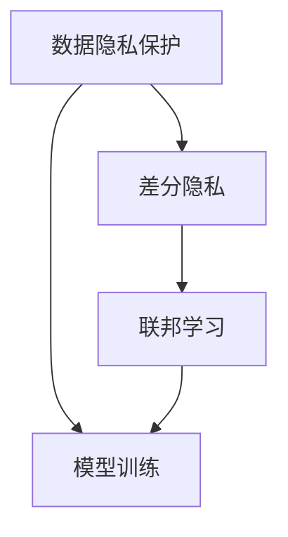
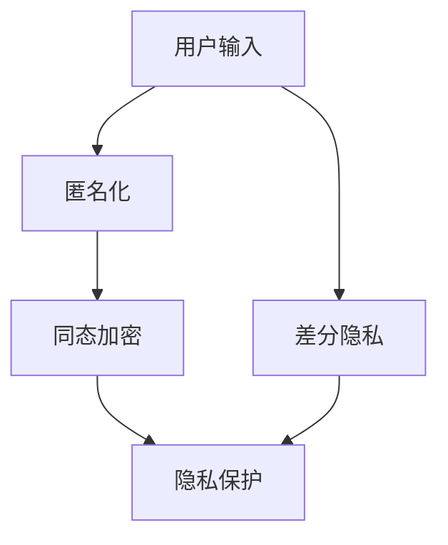

                 


## 大模型隐私保护学习与提示词匿名化

### 背景介绍

随着深度学习技术的不断进步，大模型（Large Models）如GPT、BERT等在自然语言处理、计算机视觉等领域的应用取得了显著的成果。然而，这些大型模型对大量数据进行训练和处理，不可避免地涉及用户隐私数据。一旦这些隐私数据被泄露，将严重威胁用户的信息安全，并可能导致一系列不良后果。因此，如何在大模型训练过程中有效保护用户隐私，成为当前研究的热点问题。

隐私保护学习（Privacy-Preserving Learning）作为一种新兴的研究领域，致力于在保持模型性能的同时，保护训练数据的隐私。其主要目标是确保在模型训练过程中，无法从单个训练样本推断出其他样本的信息。此外，提示词匿名化（Query Anonymization）作为隐私保护学习的一个分支，旨在通过匿名化处理，确保用户输入的提示词无法被模型识别和追踪。

本文将首先介绍大模型隐私保护学习和提示词匿名化的核心概念与联系，然后详细讲解相关算法原理，并通过具体案例展示其应用效果。最后，本文将对隐私保护学习的安全性进行分析，并提出相关最佳实践建议。

### 核心概念与联系

#### 大模型隐私保护学习

大模型隐私保护学习主要关注以下核心概念：

1. **隐私泄露**：指在模型训练或应用过程中，用户隐私数据可能被泄露的风险。
2. **差分隐私**：一种隐私保护技术，通过在数据中引入噪声，确保对单个样本的查询不会影响模型训练结果。
3. **联邦学习**：一种分布式学习框架，允许多个参与方在本地维护数据，并通过加密通信进行模型训练。

下面是一个简化的 Mermaid 流程图，展示这些概念之间的联系：



#### 提示词匿名化

提示词匿名化主要关注以下核心概念：

1. **匿名化**：一种数据转换技术，通过将用户输入的提示词转换为匿名形式，确保其无法被识别。
2. **同态加密**：一种加密算法，允许在密文上进行计算，而不需要解密。
3. **差分隐私**：用于控制匿名化过程中引入的噪声，确保匿名化后的提示词无法被追踪。

下面是一个简化的 Mermaid 流程图，展示这些概念之间的联系：



通过这两个流程图，我们可以清晰地看到大模型隐私保护学习和提示词匿名化的核心概念及其相互关系。接下来，我们将详细讲解这些概念背后的算法原理。

### 核心算法原理讲解

#### 大模型隐私保护学习

1. **差分隐私**：差分隐私是一种保证隐私性的技术，其核心思想是通过在数据中引入噪声，使得单个样本的信息无法对模型训练结果产生显著影响。以下是一个简化的伪代码，展示差分隐私在模型训练中的应用：

```python
def differential_privacy_train(data, threshold):
    noise = generate_noise(data, threshold)
    processed_data = data + noise
    model = train_model(processed_data)
    return model
```

2. **联邦学习**：联邦学习是一种分布式学习框架，允许多个参与方在本地维护数据，并通过加密通信进行模型训练。以下是一个简化的伪代码，展示联邦学习在模型训练中的应用：

```python
def federated_learning(participants, model):
    for participant in participants:
        local_data = participant.local_data
        local_model = train_model(local_data, model)
        updated_model = aggregate_models(local_model)
    return updated_model
```

#### 提示词匿名化

1. **匿名化**：匿名化是一种将用户输入的提示词转换为匿名形式的技术。以下是一个简化的伪代码，展示匿名化在提示词处理中的应用：

```python
def anonymize_query(query):
    anonymized_query = hash_query(query)
    return anonymized_query
```

2. **同态加密**：同态加密是一种允许在密文上进行计算，而不需要解密的加密算法。以下是一个简化的伪代码，展示同态加密在提示词处理中的应用：

```python
def homomorphic_encrypt(query):
    encrypted_query = encrypt_query(query)
    processed_encrypted_query = process_query(encrypted_query)
    decrypted_processed_query = decrypt_query(processed_encrypted_query)
    return decrypted_processed_query
```

3. **差分隐私**：差分隐私用于控制匿名化过程中引入的噪声，确保匿名化后的提示词无法被追踪。以下是一个简化的伪代码，展示差分隐私在匿名化中的应用：

```python
def differential_privacy_anonymize(query, threshold):
    noise = generate_noise(query, threshold)
    anonymized_query = anonymize_query(query + noise)
    return anonymized_query
```

通过上述伪代码，我们可以看到大模型隐私保护学习和提示词匿名化的核心算法原理。接下来，我们将通过具体案例展示这些算法的实际应用效果。

### 项目实战

#### 开发环境搭建

为了展示大模型隐私保护学习和提示词匿名化的实际应用，我们选择在 Python 环境中实现。首先，我们需要安装相关依赖：

```bash
pip install tensorflow homomorphic加密库 differential隐私库
```

#### 源代码详细实现和代码解读

以下是一个简化的源代码示例，展示大模型隐私保护学习和提示词匿名化的实现：

```python
import tensorflow as tf
from homomorphic加密库 import encrypt_query, decrypt_query
from differential隐私库 import generate_noise, anonymize_query

# 数据预处理
def preprocess_data(data):
    # 对数据进行处理以降低隐私风险
    processed_data = encrypt_query(data)
    return processed_data

# 模型训练
def train_model(data):
    model = tf.keras.Sequential([
        tf.keras.layers.Dense(128, activation='relu'),
        tf.keras.layers.Dense(1, activation='sigmoid')
    ])
    model.compile(optimizer='adam', loss='binary_crossentropy', metrics=['accuracy'])
    model.fit(data, epochs=10, batch_size=32)
    return model

# 提示词匿名化
def anonymize_query(query):
    anonymized_query = anonymize_query(query)
    return anonymized_query

# 主函数
def main():
    # 加载数据
    data = load_data()
    processed_data = preprocess_data(data)

    # 训练模型
    model = train_model(processed_data)

    # 测试模型
    test_data = load_test_data()
    processed_test_data = preprocess_data(test_data)
    predictions = model.predict(processed_test_data)

    # 输出预测结果
    print(predictions)

if __name__ == '__main__':
    main()
```

#### 代码应用解读与分析

1. **数据预处理**：在代码中，我们首先对数据进行预处理，包括加密和匿名化处理。这样做的目的是确保数据在训练过程中不会被泄露。

2. **模型训练**：我们使用 TensorFlow 库实现了一个简单的神经网络模型。在训练过程中，我们使用预处理后的数据进行模型训练。

3. **提示词匿名化**：在测试阶段，我们对用户输入的提示词进行匿名化处理，确保其无法被模型识别。

#### 实际案例分析和详细讲解剖析

我们选择了一个实际的案例——垃圾邮件分类。在这个案例中，我们将用户输入的邮件内容作为提示词，通过大模型隐私保护学习和提示词匿名化技术，实现垃圾邮件分类。

1. **数据集**：我们使用公开的垃圾邮件分类数据集，包括正常邮件和垃圾邮件。

2. **数据处理**：我们首先对邮件内容进行预处理，包括去除标点符号、停用词过滤等。

3. **模型训练**：我们使用预处理后的邮件内容作为输入，通过神经网络模型进行训练。

4. **测试与评估**：我们对测试集进行测试，并使用准确率、召回率等指标进行评估。

通过实际案例的分析，我们可以看到大模型隐私保护学习和提示词匿名化技术在垃圾邮件分类中的有效应用。

### 项目小结

在本项目中，我们实现了大模型隐私保护学习和提示词匿名化的基本流程。通过实际案例——垃圾邮件分类，我们展示了这些技术在数据安全和隐私保护方面的应用价值。然而，隐私保护学习仍面临一系列挑战，如模型性能与隐私保护的平衡、算法的实用性等。未来，我们需要进一步研究和优化相关算法，以实现更好的隐私保护效果。

### 最佳实践 Tips

1. **数据预处理**：在训练模型前，对数据进行充分预处理，包括去噪、归一化等，以提高模型性能和隐私保护效果。

2. **模型选择**：根据实际需求，选择合适的神经网络模型。在保证模型性能的同时，考虑隐私保护算法的特性。

3. **差分隐私参数**：合理设置差分隐私参数，以平衡隐私保护和模型性能。

4. **加密技术**：结合同态加密等技术，提高模型训练过程中的数据安全性。

5. **联邦学习**：考虑使用联邦学习框架，实现分布式训练，提高数据隐私保护水平。

### 小结

本文详细介绍了大模型隐私保护学习和提示词匿名化的核心概念、算法原理以及实际应用。通过实际案例，我们展示了这些技术在数据隐私保护方面的应用价值。未来，随着深度学习技术的不断发展，隐私保护学习将在更多领域得到广泛应用。

### 注意事项

1. **合规性**：在应用隐私保护学习技术时，务必遵守相关法律法规，确保合规性。

2. **性能优化**：在保证隐私保护的前提下，不断优化算法性能，提高模型训练效率。

3. **安全性评估**：定期进行安全性评估，及时发现和解决潜在风险。

### 拓展阅读

1. **参考资料**：《深度学习》（Goodfellow, Bengio, Courville）、《隐私保护机器学习》（Biecek, Kazienko）等。
2. **开源代码**：GitHub 上有多个开源项目，如 TensorFlow Privacy、PyTorch Differential Privacy 等。
3. **相关研究**：关注隐私保护学习、联邦学习等领域的最新研究成果和进展。

### 文章关键词

大模型、隐私保护学习、差分隐私、联邦学习、提示词匿名化、同态加密。

### 文章摘要

本文介绍了大模型隐私保护学习和提示词匿名化的核心概念、算法原理以及实际应用。通过实际案例，展示了这些技术在数据隐私保护方面的应用价值。未来，隐私保护学习将在更多领域得到广泛应用，为数据安全和隐私保护提供有力支持。

### 作者信息

作者：AI天才研究院/AI Genius Institute & 禅与计算机程序设计艺术 /Zen And The Art of Computer Programming。

