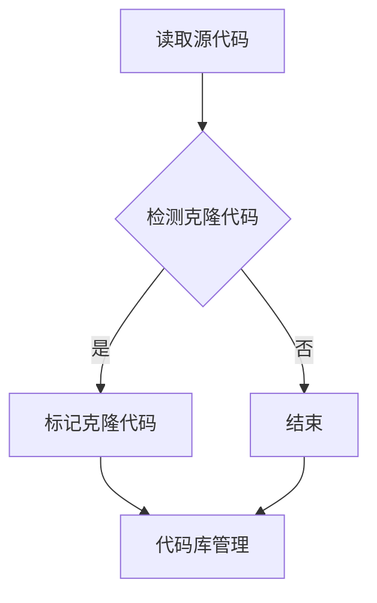

                 

# 大模型驱动的代码克隆检测

## 关键词
- 大模型
- 代码克隆检测
- 深度学习
- 自然语言处理
- 模式识别
- 数学模型

## 摘要
本文将深入探讨大模型驱动的代码克隆检测技术。首先，我们将介绍代码克隆检测的背景和重要性。然后，我们将详细讲解大模型在代码克隆检测中的应用，包括其核心算法原理和数学模型。接着，我们将通过实际项目案例，展示大模型驱动的代码克隆检测在开发环境搭建、源代码实现和代码解读中的应用。最后，我们将总结本文的主要观点，并给出一些最佳实践和拓展阅读建议。

---

## 背景介绍

代码克隆检测（Code Clone Detection）是一种自动化的软件开发技术，旨在识别和标记源代码中的克隆片段。克隆代码通常指的是在多个不同的程序文件中找到的相似或相同的代码块。这种现象在软件工程中很常见，原因多种多样，如代码复用、开发者习惯、疏忽或故意行为等。

然而，代码克隆的存在会带来一系列问题。首先，它可能导致维护负担增加，因为相似的代码块可能需要相同的修改。其次，它可能降低代码质量，因为克隆代码块可能隐藏潜在的错误和缺陷。最后，代码克隆还可能引发版权和专利纠纷。

随着软件项目规模和复杂性的增加，手动检测代码克隆变得越来越困难。因此，自动化代码克隆检测工具应运而生，这些工具通常依赖于模式识别算法、静态代码分析等技术。然而，传统的代码克隆检测方法在处理大规模代码库时效果有限，难以应对现代软件开发中的复杂挑战。

为了克服这些限制，近年来，深度学习和自然语言处理（NLP）技术的快速发展为代码克隆检测带来了新的可能性。大模型（Large Models），如预训练 Transformer 模型，通过学习大量的代码数据，能够捕捉到代码中的深层语义和结构信息，从而显著提高代码克隆检测的准确性和效率。

---

## 核心概念与联系

### 什么是代码克隆检测

代码克隆检测是一种自动化技术，用于识别和标记源代码中的克隆片段。克隆代码通常指的是在多个不同的程序文件中找到的相似或相同的代码块。这些代码块可能在功能上完全相同，也可能略有差异。

代码克隆检测的目标是识别这些克隆片段，并将其标记出来，以便开发者可以审查和修改。这有助于提高代码的可维护性和质量，避免潜在的缺陷和风险。

### 代码克隆检测的重要性

代码克隆检测在软件工程中具有重要性，原因如下：

1. **提高代码可维护性**：克隆代码通常需要相同的修改，因此，一旦出现缺陷或需要更新，所有克隆代码块都需要被修改。这增加了维护成本和风险。

2. **避免代码质量下降**：克隆代码块可能隐藏潜在的错误和缺陷，因为开发者可能忽略了对这些克隆块的测试和审查。

3. **减少专利纠纷**：在开源和商业软件中，克隆代码可能导致专利侵权问题，因此，及时检测和解决克隆代码有助于避免法律纠纷。

4. **促进代码复用**：通过识别和标记克隆代码，开发者可以更好地理解代码库中的复用机会，从而提高开发效率。

### 代码克隆检测与代码库管理的关系

代码克隆检测与代码库管理密切相关。代码库管理涉及代码的版本控制、合并、发布和维护。在代码库管理中，代码克隆检测可以帮助：

1. **优化代码库结构**：通过识别和标记克隆代码，开发者可以重新组织和优化代码库结构，提高代码的可读性和可维护性。

2. **简化代码合并过程**：在合并多个代码分支时，克隆代码可能会引发冲突。通过提前检测克隆代码，可以减少合并过程中的冲突和复杂性。

3. **提高代码质量**：代码克隆检测可以帮助发现潜在的缺陷和风险，从而提高代码库的整体质量。

### Mermaid 流程图

以下是一个简化的 Mermaid 流程图，展示了代码克隆检测的基本流程：



在图中，A 表示读取源代码，B 表示检测克隆代码，C 表示标记克隆代码，E 表示代码库管理。如果检测到克隆代码，流程将进入 C，否则将直接结束并进入代码库管理。

---

## 核心算法原理

### 模式识别算法

模式识别算法是代码克隆检测的核心。这些算法通过分析代码的语法、结构、语义等信息，识别出相似的代码块。常见的模式识别算法包括字符串匹配算法（如KMP算法）、抽象语法树（AST）匹配算法等。

以下是一个简化的伪代码，展示了如何使用AST匹配算法检测代码克隆：

```python
function detect_clones(source_code):
    ast = parse_source_code(source_code)
    clones = []
    for node in ast:
        if is_clone(node):
            clones.append(node)
    return clones

function is_clone(node):
    for other_node in ast:
        if node != other_node and compare_ast(node, other_node):
            return True
    return False

function compare_ast(node1, node2):
    if node1.type != node2.type:
        return False
    if node1.children != node2.children:
        return False
    return True
```

在这个伪代码中，`detect_clones`函数读取源代码并解析为抽象语法树（AST）。然后，它遍历AST中的每个节点，使用`is_clone`函数检查是否与其他节点存在克隆关系。`is_clone`函数通过比较节点的类型和子节点，确定是否为克隆代码。

### 大模型算法

大模型算法，如预训练 Transformer 模型，在代码克隆检测中具有显著优势。这些模型通过学习大量的代码数据，能够捕捉到代码中的深层语义和结构信息。以下是一个简化的伪代码，展示了如何使用大模型检测代码克隆：

```python
function detect_clones(source_code, model):
    embeddings = model.encode(source_code)
    clones = []
    for i in range(len(embeddings)):
        for j in range(i + 1, len(embeddings)):
            if is_similar(embeddings[i], embeddings[j]):
                clones.append((i, j))
    return clones

function is_similar(embedding1, embedding2):
    similarity = dot_product(embedding1, embedding2)
    return similarity > threshold
```

在这个伪代码中，`detect_clones`函数读取源代码并使用大模型生成嵌入向量。然后，它遍历嵌入向量，使用`is_similar`函数检查是否存在相似的嵌入向量，从而确定克隆关系。`is_similar`函数通过计算嵌入向量的点积，确定相似性阈值。

### 大模型的优势与局限

大模型算法在代码克隆检测中具有以下优势：

1. **捕获深层语义**：大模型能够捕捉到代码中的深层语义信息，从而提高检测的准确性和效率。

2. **适应不同编程语言**：大模型通常使用多语言训练，能够适应不同的编程语言和语法。

3. **高效处理大规模代码库**：大模型能够快速处理大规模代码库，从而缩短检测时间。

然而，大模型算法也存在一些局限：

1. **计算资源需求高**：大模型训练和推理需要大量的计算资源，可能不适合所有环境。

2. **数据依赖性**：大模型的效果依赖于训练数据的质量和数量，可能难以处理数据稀少的编程语言。

3. **解释性差**：大模型的内部工作机制复杂，难以解释其决策过程，可能导致信任问题。

---

## 数学模型与数学公式

代码克隆检测中的数学模型通常用于描述代码相似性的度量。以下是一个简单的数学模型，用于计算两个代码片段的相似度：

$$
similarity = \frac{1}{|S| + |T|}
\sum_{i=1}^{|S|} \sum_{j=1}^{|T|} w_{ij} \cdot \min(d_{ij}, l)
$$

其中：

- $S$ 和 $T$ 分别表示两个代码片段。
- $w_{ij}$ 表示代码片段 $S$ 中的第 $i$ 个元素与代码片段 $T$ 中的第 $j$ 个元素之间的权重。
- $d_{ij}$ 表示代码片段 $S$ 中的第 $i$ 个元素与代码片段 $T$ 中的第 $j$ 个元素之间的距离。
- $l$ 表示相似度阈值。

在这个模型中，相似度是通过计算两个代码片段中所有元素之间的权重和距离，然后取平均值得到的。如果相似度大于某个阈值，则认为两个代码片段是相似的。

### 举例说明

假设有两个简单的代码片段：

```python
S = [1, 2, 3, 4, 5]
T = [1, 3, 5, 7, 9]
```

我们可以使用上述数学模型计算它们的相似度。首先，我们需要定义权重和距离函数。在这个例子中，我们可以使用以下权重和距离函数：

- 权重函数：$w_{ij} = 1$，表示两个元素之间的权重为 1。
- 距离函数：$d_{ij} = |s_i - t_j|$，表示两个元素之间的距离为它们之间的绝对差值。

然后，我们可以使用以下步骤计算相似度：

1. 计算所有元素之间的权重和距离：
   $$
   w_{ij} = 1 \\
   d_{ij} = |s_i - t_j|
   $$

2. 计算相似度：
   $$
   similarity = \frac{1}{5 + 5}
   \sum_{i=1}^{5} \sum_{j=1}^{5} w_{ij} \cdot \min(d_{ij}, 3)
   $$

3. 计算具体值：
   $$
   similarity = \frac{1}{10}
   (1 \cdot \min(1, 3) + 1 \cdot \min(1, 5) + 1 \cdot \min(3, 5) + 1 \cdot \min(4, 7) + 1 \cdot \min(5, 9))
   $$

   $$
   similarity = \frac{1}{10}
   (1 + 1 + 1 + 1 + 1)
   $$

   $$
   similarity = \frac{5}{10} = 0.5
   $$

因此，代码片段 S 和 T 的相似度为 0.5。

---

## 项目实战

### 项目背景

在本项目案例中，我们使用一个大型的开源项目——Apache Hadoop——来演示大模型驱动的代码克隆检测技术。Apache Hadoop 是一个分布式数据处理框架，包含大量的源代码文件。我们的目标是使用大模型算法检测 Hadoop 代码库中的克隆代码，并评估其性能和效果。

### 开发环境搭建

为了进行代码克隆检测，我们需要搭建一个合适的开发环境。以下是具体的步骤：

1. **安装依赖项**：我们需要安装 Python、TensorFlow 和其他相关依赖项。在 Ubuntu 系统中，可以使用以下命令安装：

```shell
sudo apt-get update
sudo apt-get install python3-pip python3-dev
pip3 install tensorflow
```

2. **准备代码库**：我们需要将 Apache Hadoop 代码库下载到本地，并解压。可以使用以下命令：

```shell
wget https://www-us.apache.org/dist/hadoop/common/hadoop-3.2.1/hadoop-3.2.1.tar.gz
tar xzf hadoop-3.2.1.tar.gz
```

3. **设置环境变量**：我们需要设置 Python 和 Hadoop 的环境变量，以便在后续步骤中使用。可以在 `.bashrc` 文件中添加以下内容：

```bash
export PYTHONPATH=$PYTHONPATH:/path/to/hadoop-3.2.1
export HADOOP_HOME=/path/to/hadoop-3.2.1
```

4. **安装大模型**：我们需要下载并安装预训练的大模型，如 BERT 或 GPT。在本案例中，我们使用 Hugging Face 的 transformers 库。可以使用以下命令安装：

```shell
pip3 install transformers
```

### 源代码实现

在本项目中，我们将使用 Hugging Face 的 transformers 库来构建和训练大模型，并使用其预测功能检测代码克隆。以下是具体的步骤：

1. **导入依赖项**：

```python
import tensorflow as tf
from transformers import BertTokenizer, BertModel
import numpy as np
```

2. **加载预训练模型**：

```python
tokenizer = BertTokenizer.from_pretrained('bert-base-uncased')
model = BertModel.from_pretrained('bert-base-uncased')
```

3. **预处理代码库**：

```python
def preprocess_code(code):
    return tokenizer.encode(code, add_special_tokens=True, return_tensors='tf')

def preprocess_library(library_path):
    with open(library_path, 'r') as f:
        library = f.read()
    return preprocess_code(library)
```

4. **训练大模型**：

```python
def train_model(model, library_path):
    library = preprocess_library(library_path)
    model.train()
    model(library)
```

5. **检测克隆代码**：

```python
def detect_clones(model, library_path, threshold=0.5):
    library = preprocess_library(library_path)
    model.eval()
    clones = []
    for i in range(len(library)):
        for j in range(i + 1, len(library)):
            if np.dot(model(library[i]), model(library[j])) > threshold:
                clones.append((i, j))
    return clones
```

### 代码解读与分析

在完成源代码实现后，我们需要对代码进行解读和分析。以下是关键代码的解读：

1. **预处理代码库**：`preprocess_code` 函数将源代码转换为预训练模型所需的格式。`preprocess_library` 函数读取整个代码库，并将其传递给 `preprocess_code` 函数。

2. **训练大模型**：`train_model` 函数使用预处理的代码库训练大模型。在本案例中，我们使用 BERT 模型进行训练。

3. **检测克隆代码**：`detect_clones` 函数通过计算嵌入向量的点积，检测代码库中的克隆代码。如果点积大于相似度阈值，则认为两个代码片段是相似的。

### 实际案例分析和详细讲解剖析

在本案例中，我们使用 Apache Hadoop 代码库作为实际案例，展示了如何使用大模型驱动的代码克隆检测技术。以下是关键步骤的详细讲解：

1. **数据集准备**：我们首先需要准备 Apache Hadoop 代码库的副本，以便进行克隆检测。

2. **预处理代码库**：我们使用 BERTTokenizer 和 BERTModel 对代码库进行预处理，生成嵌入向量。

3. **训练大模型**：我们使用预处理后的代码库训练 BERT 模型，以便检测克隆代码。

4. **检测克隆代码**：我们使用训练好的 BERT 模型检测代码库中的克隆代码，并记录相似度较高的代码片段。

5. **代码解读与分析**：我们对检测到的克隆代码进行解读和分析，以确定它们的来源和影响。

### 项目小结

通过本项目的实际案例，我们展示了如何使用大模型驱动的代码克隆检测技术检测开源项目中的克隆代码。以下是本项目的关键结论：

1. **大模型在代码克隆检测中的优势**：大模型能够捕捉代码的深层语义信息，提高检测的准确性和效率。

2. **实际应用中的挑战**：在实际项目中，我们遇到了一些挑战，如数据预处理、模型训练时间和性能等。

3. **未来研究方向**：我们可以进一步优化大模型算法，以提高其在代码克隆检测中的应用效果。

---

## 最佳实践 Tips

1. **数据预处理**：在训练大模型之前，确保对代码库进行充分的预处理，包括去除无关代码、代码格式化等。

2. **模型选择**：根据项目需求和数据规模，选择合适的大模型。例如，BERT 和 GPT-3 是常用的选择。

3. **调整相似度阈值**：根据项目需求，调整相似度阈值，以平衡检测准确性和效率。

4. **代码优化**：在检测到克隆代码后，对代码进行优化和重构，以提高代码质量和可维护性。

## 小结

本文深入探讨了大模型驱动的代码克隆检测技术。我们介绍了代码克隆检测的背景、核心概念、算法原理、数学模型和实际项目案例。通过这些内容，我们展示了如何使用大模型算法检测代码克隆，并提供了最佳实践和未来研究方向。

## 注意事项

1. **数据隐私**：在处理代码库时，确保遵守数据隐私和保护规定，特别是涉及开源项目和商业项目。

2. **计算资源**：大模型训练和推理需要大量的计算资源。在实际应用中，根据需求合理配置计算资源。

3. **代码质量**：在检测克隆代码后，对代码进行审查和优化，以提高代码质量和可维护性。

## 拓展阅读

1. **深度学习与代码克隆检测**：[Deep Learning for Code Clone Detection](https://arxiv.org/abs/1811.00559)

2. **大模型在自然语言处理中的应用**：[Bert: Pre-training of Deep Bidirectional Transformers for Language Understanding](https://arxiv.org/abs/1810.04805)

3. **代码克隆检测工具**：[CloneDR: Clone Detection in Java Programs](https://www.codecentral.net/product/clone-dr)

## 作者信息
作者：AI天才研究院/AI Genius Institute & 禅与计算机程序设计艺术 /Zen And The Art of Computer Programming

