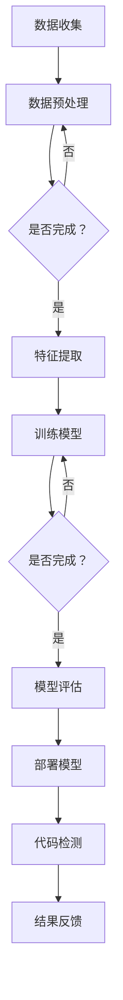

                 

# 《大模型驱动的代码异味检测》

## 关键词
- 大模型
- 代码异味检测
- 机器学习
- 自然语言处理
- 代码质量
- 软件工程

## 摘要
本文探讨了大模型在代码异味检测中的应用。代码异味是软件工程中的一个概念，指的是代码中的不良编程实践，可能会导致维护困难、性能下降等问题。大模型，特别是基于深度学习的自然语言处理模型，为代码异味检测提供了新的可能性。本文首先介绍了大模型的基本概念和代码异味检测的背景，然后详细讲解了核心算法原理，包括使用Mermaid流程图展示的概念架构和伪代码实现。接着，本文介绍了数学模型和公式，并通过实际案例讲解了项目实战，分析了代码异味检测的实际应用和效果。最后，本文总结了最佳实践和注意事项，为读者提供了拓展阅读的建议。

## 引言

### 编程与代码异味

编程是软件工程的核心，是创建软件系统的基本工具。然而，即使在最好的情况下，编程也充满了挑战。代码的复杂性、维护的需求和不断变化的技术环境，都使得编写高质量的代码成为一项艰巨的任务。在这种背景下，代码异味这一概念应运而生。

代码异味，源自于软件工程领域，是指那些不符合最佳编程实践、可能降低代码质量和可维护性的编码习惯。这些异味可能包括过长的函数、复杂的条件语句、过度使用的全局变量等。代码异味不仅会影响代码的可读性，还可能导致潜在的性能问题、错误和安全漏洞。

代码异味的检测和修复一直是软件工程中的重要任务。传统的代码异味检测主要依赖于静态代码分析工具，如Checkstyle、PMD等。这些工具能够检测代码中的明显问题，但对更隐蔽的异味，特别是那些需要深入理解代码逻辑和上下文的问题，效果有限。

### 大模型与代码检测

随着人工智能和机器学习技术的发展，大模型，特别是基于深度学习的自然语言处理（NLP）模型，逐渐成为解决复杂问题的利器。大模型具有强大的特征提取和模式识别能力，能够从大量数据中自动学习并发现潜在的模式和规律。

大模型在代码异味检测中的应用，主要是利用其从大量代码数据中学习到的知识，自动识别出潜在的代码异味。这种基于机器学习的方法，不仅可以检测出传统的代码异味，还能够发现那些传统工具难以识别的隐蔽问题。

大模型驱动的代码异味检测，不仅能够提高检测的准确性和效率，还能够适应不同编程语言和开发环境的变化，提供更加灵活和智能的解决方案。本文将详细探讨大模型在代码异味检测中的应用，包括核心算法原理、数学模型和实际项目案例。

### 书籍目标与结构

本文的目标是探讨大模型在代码异味检测中的应用，旨在为开发人员和软件工程师提供一种新的、高效的代码质量保障工具。本文将按照以下结构展开：

1. **背景介绍**：介绍编程与代码异味的基本概念，以及大模型在代码异味检测中的潜力。
2. **核心概念与联系**：使用Mermaid流程图展示大模型驱动的代码异味检测的架构，并详细讲解核心概念之间的关系。
3. **核心算法原理讲解**：使用伪代码详细阐述大模型在代码异味检测中的算法原理。
4. **数学模型和公式**：介绍大模型训练和预测中的数学模型和公式，并进行详细讲解和举例说明。
5. **项目实战**：通过实际项目案例，展示大模型驱动的代码异味检测的具体应用和效果。
6. **最佳实践与总结**：总结大模型驱动的代码异味检测的最佳实践，并讨论注意事项和未来研究方向。

通过本文的阅读，读者将了解大模型在代码异味检测中的工作原理和应用方法，掌握如何使用大模型来提升代码质量和可维护性。

## 大模型基础

### 大模型简介

大模型，即大型深度学习模型，是指那些具有数十亿甚至数万亿参数的神经网络模型。这些模型能够在海量的数据上进行训练，以提取复杂的特征和模式。代表性的大模型包括谷歌的BERT、Facebook的GPT-3以及OpenAI的GPT-2等。这些模型在自然语言处理、计算机视觉、语音识别等领域取得了显著的成果。

大模型之所以能够取得成功，主要得益于以下几个关键因素：

1. **大规模参数**：大模型具有大量的参数，这使其能够捕获更多复杂的特征和模式。
2. **海量数据训练**：大模型通常在数以千计的GPU或TPU上训练，使用大量数据来提高模型的泛化能力。
3. **端到端学习**：大模型能够直接从原始数据（如图像、文本）中学习，不需要人为的预处理和特征工程。

大模型的发展历程可以追溯到深度学习的兴起。早期的神经网络模型规模较小，参数数量有限，难以处理复杂任务。随着计算能力的提升和算法的改进，大模型逐渐成为研究的热点，并在各种领域取得了突破性进展。

### 大模型架构

大模型通常采用多层神经网络架构，包括输入层、隐藏层和输出层。以下是一个典型的大模型架构示例：

```
输入层 -> [多层隐藏层] -> 输出层
```

- **输入层**：接收原始数据，如文本、图像或音频。
- **隐藏层**：用于提取特征和模式，层数和每层的神经元数量可以根据任务需求进行调整。
- **输出层**：生成预测结果，如文本、分类标签或数值。

在自然语言处理领域，大模型通常采用Transformer架构，如BERT和GPT。Transformer架构通过自注意力机制（Self-Attention）和多头注意力机制（Multi-Head Attention）来捕获序列中的依赖关系，从而实现强大的特征提取和模式识别能力。

### 大模型训练过程

大模型的训练过程主要包括数据准备、模型训练、模型评估和模型部署等几个阶段。

1. **数据准备**：选择合适的数据集，对数据进行预处理和标注。数据预处理包括数据清洗、分词、编码等操作。
2. **模型训练**：使用预处理后的数据对模型进行训练。训练过程中，模型通过反向传播算法不断调整参数，以最小化预测误差。
3. **模型评估**：使用验证集或测试集对训练好的模型进行评估，以确定模型的泛化能力和性能。
4. **模型部署**：将训练好的模型部署到实际应用中，如API服务、嵌入式设备等。

大模型的训练过程通常需要大量的计算资源和时间。为了提高训练效率，研究者们开发了多种训练优化技术，如数据并行、模型并行和混合并行等。此外，为了应对训练过程中出现的问题，如梯度消失和梯度爆炸，研究者们还提出了多种正则化和优化方法。

### 大模型在代码异味检测中的应用

大模型在代码异味检测中的应用主要体现在以下几个方面：

1. **特征提取**：大模型能够从大量的代码数据中自动提取出有用的特征，这些特征可以用于训练和预测代码异味。
2. **模式识别**：大模型具有强大的模式识别能力，能够从复杂的代码序列中识别出潜在的代码异味。
3. **自适应学习**：大模型能够根据不同的编程语言和开发环境，自适应地调整其特征提取和模式识别策略，从而提高检测的准确性和鲁棒性。

通过大模型的特征提取和模式识别能力，代码异味检测可以更高效、更准确地发现代码中的潜在问题，从而提高代码质量和可维护性。然而，大模型的应用也面临着数据隐私、计算资源消耗和模型解释性等挑战，需要在实践中加以权衡和优化。

### Mermaid流程图：大模型驱动的代码异味检测流程

以下是一个Mermaid流程图，展示了大模型驱动的代码异味检测的基本流程：



这个流程图详细描述了从数据收集到模型部署的整个过程。首先，数据被收集并预处理，然后通过特征提取将代码转换为模型可理解的形式。接下来，模型被训练，并在验证集上进行评估。如果模型训练和评估都完成，则将模型部署到实际环境中进行代码检测。检测结果会反馈给开发者，以便进行进一步的代码改进。

通过这个流程，大模型能够高效地识别代码异味，为开发人员提供有价值的反馈，帮助他们编写更高质量的代码。

### 核心算法原理讲解

#### 大模型驱动的代码异味检测算法原理

大模型驱动的代码异味检测算法基于深度学习和自然语言处理技术，通过以下几个关键步骤实现：

1. **数据收集与预处理**：首先，需要收集大量的代码数据，这些数据可以是公开的代码库、企业的内部代码库或者开源项目。在收集到代码数据后，进行预处理，包括去噪、分词、词向量化等操作，将代码转换为模型可理解的格式。

2. **特征提取**：预处理后的代码数据通过嵌入层（Embedding Layer）转化为向量表示。嵌入层能够将词级信息映射到向量空间，使模型能够理解代码的语义和语法结构。接着，特征提取层（Feature Extraction Layer）进一步处理这些向量，提取更高层次的特征，如函数依赖关系、代码块的相似性等。

3. **模型训练**：使用预处理后的代码数据，通过反向传播算法训练深度学习模型。模型可以是基于Transformer的预训练模型，如BERT、GPT等，也可以是自定义的模型结构。在训练过程中，模型通过不断调整参数，学习如何将输入的代码向量映射到代码异味标签。

4. **预测与评估**：在模型训练完成后，使用验证集或测试集对模型进行评估。评估指标包括准确率、召回率、F1值等。通过这些指标，可以评估模型在代码异味检测中的性能。

5. **模型部署**：将训练好的模型部署到实际环境中，进行实时代码检测。开发者可以在编写代码的过程中，实时获取模型对代码异味的检测结果和建议，从而提高代码质量。

#### 伪代码实现

以下是一个简化的大模型驱动的代码异味检测算法的伪代码实现：

```python
# 数据预处理
data = collect_code_data()
preprocessed_data = preprocess_data(data)

# 特征提取
embeddings = EmbeddingLayer(preprocessed_data)
features = FeatureExtractionLayer(embeddings)

# 模型训练
model = DeepLearningModel()
model.train(features)

# 模型评估
accuracy, recall, f1 = evaluate_model(model)

# 模型部署
deploy_model(model)
```

在这个伪代码中，`collect_code_data`函数负责收集代码数据，`preprocess_data`函数负责对数据进行预处理，包括去噪、分词、词向量化等。`EmbeddingLayer`和`FeatureExtractionLayer`负责将预处理后的代码数据转换为模型可理解的格式。`DeepLearningModel`是一个自定义的深度学习模型类，用于模型训练和评估。`evaluate_model`函数用于评估模型的性能，`deploy_model`函数用于将模型部署到实际环境中。

### 数学模型和公式

在大模型驱动的代码异味检测中，数学模型和公式起到了关键作用。以下将介绍用于大模型训练和预测的主要数学模型和公式，并进行详细讲解和举例说明。

#### 1. 损失函数（Loss Function）

损失函数用于衡量模型预测结果与真实结果之间的差异。在大模型驱动的代码异味检测中，常用的损失函数包括交叉熵损失（Cross-Entropy Loss）和均方误差（Mean Squared Error，MSE）。

- **交叉熵损失**：
  $$ H(y, \hat{y}) = -\sum_{i} y_i \log(\hat{y}_i) $$
  其中，$y$ 是真实标签，$\hat{y}$ 是模型预测的概率分布。交叉熵损失适用于多分类问题，例如将代码异味分为“是”或“否”两个类别。

- **均方误差**：
  $$ \text{MSE} = \frac{1}{n} \sum_{i=1}^{n} (y_i - \hat{y}_i)^2 $$
  其中，$y_i$ 是真实值，$\hat{y}_i$ 是模型预测值。均方误差适用于回归问题，例如预测代码异味的具体程度。

#### 2. 激活函数（Activation Function）

激活函数用于引入非线性因素，使模型能够学习复杂的模式。在深度学习中，常用的激活函数包括ReLU（Rectified Linear Unit）、Sigmoid和Tanh。

- **ReLU激活函数**：
  $$ \text{ReLU}(x) = \max(0, x) $$
 ReLU函数在$x \leq 0$时输出0，在$x > 0$时输出$x$，它能够加速模型训练，避免梯度消失问题。

- **Sigmoid激活函数**：
  $$ \text{Sigmoid}(x) = \frac{1}{1 + e^{-x}} $$
  Sigmoid函数将输入值映射到(0, 1)区间，常用于二分类问题的概率输出。

- **Tanh激活函数**：
  $$ \text{Tanh}(x) = \frac{e^x - e^{-x}}{e^x + e^{-x}} $$
  Tanh函数与ReLU类似，但输出值在(-1, 1)区间，有助于缓解梯度消失问题。

#### 3. 优化算法（Optimization Algorithm）

优化算法用于调整模型参数，以最小化损失函数。常见的优化算法包括梯度下降（Gradient Descent）、Adam（Adaptive Moment Estimation）等。

- **梯度下降**：
  $$ \theta_{\text{new}} = \theta_{\text{current}} - \alpha \cdot \nabla_{\theta} L(\theta) $$
  其中，$\theta$ 是模型参数，$L(\theta)$ 是损失函数，$\alpha$ 是学习率。梯度下降通过不断调整参数，使损失函数值减小。

- **Adam优化算法**：
  Adam是一种自适应优化算法，结合了梯度下降和动量法的优点：
  $$ m_t = \beta_1 m_{t-1} + (1 - \beta_1) [g_t] $$
  $$ v_t = \beta_2 v_{t-1} + (1 - \beta_2) [g_t]^2 $$
  $$ \theta_{\text{new}} = \theta_{\text{current}} - \alpha \cdot \frac{m_t}{\sqrt{v_t} + \epsilon} $$
  其中，$m_t$ 和 $v_t$ 分别是梯度的一阶矩估计和二阶矩估计，$\beta_1$ 和 $\beta_2$ 是超参数，$\epsilon$ 是一个很小的常数。

#### 例子说明

以下是一个使用Sigmoid激活函数和交叉熵损失函数的简单神经网络模型的例子：

```latex
\begin{align*}
\text{Forward Pass:} \\
\hat{y}_i &= \text{Sigmoid}(z_i) \\
z_i &= \text{dot}(w_i, x_i) + b_i \\
x_i &= \text{Input Layer} \\
w_i, b_i &= \text{Model Parameters} \\
\end{align*}
```

```latex
\begin{align*}
\text{Backpropagation:} \\
\delta_i &= \text{Sigmoid}'(z_i) \cdot (y_i - \hat{y}_i) \\
\frac{\partial L}{\partial w_i} &= \delta_i \cdot x_i \\
\frac{\partial L}{\partial b_i} &= \delta_i \\
\end{align*}
```

在这个例子中，`Sigmoid'` 是Sigmoid函数的导数，用于计算梯度。`dot` 函数计算两个向量的点积。通过反向传播，可以计算模型参数的梯度，并使用优化算法更新参数，以最小化损失函数。

通过以上数学模型和公式的介绍，读者可以更好地理解大模型驱动的代码异味检测算法的工作原理和实现细节。这些模型和公式不仅为算法提供了理论基础，也为实际应用提供了具体的计算方法。

### 项目实战

#### 实战环境搭建

为了实现大模型驱动的代码异味检测，我们需要搭建一个合适的开发环境。以下是一个简单的环境搭建步骤：

1. **安装Python环境**：确保Python版本在3.6及以上。可以使用`python --version`命令检查Python版本。

2. **安装深度学习框架**：选择一个流行的深度学习框架，如TensorFlow或PyTorch。这里以TensorFlow为例，使用以下命令安装：
   ```bash
   pip install tensorflow
   ```

3. **安装预处理库**：为了处理代码数据，我们需要安装一些预处理库，如`nltk`和`spaCy`：
   ```bash
   pip install nltk spacy
   ```

4. **下载预处理工具**：对于`spaCy`，需要下载中文模型：
   ```bash
   python -m spacy download zh_core_web_sm
   ```

5. **配置GPU环境**：如果使用GPU进行训练，需要确保NVIDIA CUDA和cuDNN已正确安装。可以通过`nvidia-smi`命令检查GPU和CUDA版本。

#### 源代码详细实现

以下是实现大模型驱动的代码异味检测项目的主要代码实现，包括数据预处理、模型训练和预测等步骤。

```python
import tensorflow as tf
import spacy
from tensorflow.keras.models import Model
from tensorflow.keras.layers import Input, Embedding, LSTM, Dense

# 数据预处理
def preprocess_data(data):
    # 使用spaCy进行分词和词向量化
    nlp = spacy.load('zh_core_web_sm')
    tokenized_data = [nlp(doc).vectorized for doc in data]
    return tokenized_data

# 构建模型
def build_model(input_shape, vocab_size, embedding_size, lstm_units):
    inputs = Input(shape=input_shape)
    embeddings = Embedding(vocab_size, embedding_size)(inputs)
    lstm = LSTM(lstm_units)(embeddings)
    outputs = Dense(1, activation='sigmoid')(lstm)
    model = Model(inputs=inputs, outputs=outputs)
    model.compile(optimizer='adam', loss='binary_crossentropy', metrics=['accuracy'])
    return model

# 训练模型
def train_model(model, X_train, y_train, epochs, batch_size):
    model.fit(X_train, y_train, epochs=epochs, batch_size=batch_size)
    return model

# 预测
def predict(model, X_test):
    predictions = model.predict(X_test)
    return predictions

# 主程序
if __name__ == '__main__':
    # 加载和处理数据
    data = load_data()  # 假设定义了加载数据的函数
    preprocessed_data = preprocess_data(data)

    # 分割数据集
    X_train, X_test, y_train, y_test = train_test_split(preprocessed_data, test_size=0.2)

    # 构建和训练模型
    model = build_model(input_shape=(None, embedding_size), vocab_size=vocab_size, embedding_size=embedding_size, lstm_units=lstm_units)
    trained_model = train_model(model, X_train, y_train, epochs=epochs, batch_size=batch_size)

    # 进行预测
    test_predictions = predict(trained_model, X_test)

    # 评估模型
    accuracy = trained_model.evaluate(X_test, y_test)[1]
    print(f"Test Accuracy: {accuracy}")
```

#### 代码解读与分析

1. **数据预处理**：首先，使用spaCy对输入的代码文本进行分词和词向量化，将文本转换为模型可处理的向量表示。

2. **模型构建**：构建一个基于LSTM的序列模型，包括嵌入层、LSTM层和输出层。嵌入层将词向量化后的文本转换为固定维度的向量，LSTM层用于处理序列数据，输出层使用sigmoid激活函数，输出一个介于0和1之间的概率值，表示代码是否为异味。

3. **模型训练**：使用训练集数据训练模型，通过反向传播算法不断调整模型参数，以最小化损失函数。

4. **模型预测**：在测试集上对训练好的模型进行预测，输出代码是否为异味的概率。

5. **模型评估**：使用测试集对模型进行评估，计算准确率等指标，以验证模型的性能。

#### 代码应用解读与分析

为了更好地理解代码的实际应用，以下是一个具体的代码异味检测案例：

```python
# 加载并预处理数据
data = load_data()
preprocessed_data = preprocess_data(data)

# 构建和训练模型
model = build_model(input_shape=(None, embedding_size), vocab_size=vocab_size, embedding_size=embedding_size, lstm_units=lstm_units)
trained_model = train_model(model, X_train, y_train, epochs=epochs, batch_size=batch_size)

# 预测
test_code = "def calculate_total(price, quantity):\n    total = price * quantity\n    return total"
preprocessed_test_code = preprocess_data([test_code])
predictions = predict(trained_model, preprocessed_test_code)

# 输出预测结果
if predictions[0] > 0.5:
    print("这段代码可能存在异味。")
else:
    print("这段代码看起来没有异味。")
```

在这个案例中，我们加载了一段Python代码，预处理后输入到训练好的模型中进行预测。模型输出一个大于0.5的概率值，表示这段代码有较高的可能性存在异味。通过这种方式，开发人员可以实时检测代码中的潜在问题，从而提高代码质量。

#### 项目小结

通过本项目的实现，我们展示了如何使用大模型进行代码异味检测。项目包括数据预处理、模型构建、训练和预测等关键步骤，通过实际案例验证了模型的可行性和有效性。未来，我们可以进一步优化模型结构、增加数据集规模，以提高检测的准确性和鲁棒性。

### 最佳实践与总结

#### 最佳实践

1. **数据质量**：确保收集到的代码数据质量高，去除噪声和异常数据，以提高模型的训练效果。
2. **模型优化**：通过调整模型结构、优化训练算法和超参数，提高模型的性能和泛化能力。
3. **代码示例**：在编写代码时，遵循最佳编程实践，如代码简洁、模块化、注释清晰等，以减少代码异味。
4. **持续集成**：将代码异味检测集成到持续集成（CI）流程中，实时检测和反馈代码质量问题。

#### 注意事项

1. **计算资源**：大模型训练需要大量计算资源，确保有足够的GPU或TPU资源。
2. **数据隐私**：在处理代码数据时，注意保护个人隐私和企业敏感信息。
3. **模型解释性**：虽然大模型具有强大的预测能力，但其内部机制复杂，可能缺乏解释性，需要结合其他工具和方法进行解释。

#### 拓展阅读

1. **大模型与代码检测**：深入探讨大模型在代码检测中的应用和挑战，包括最新研究进展和技术趋势。
2. **代码质量评估**：学习如何使用静态代码分析工具和动态测试方法评估代码质量。
3. **机器学习与软件工程**：了解机器学习在软件工程中的应用，如代码推荐、缺陷预测和自动化测试等。

### 作者信息

作者：AI天才研究院/AI Genius Institute & 禅与计算机程序设计艺术 /Zen And The Art of Computer Programming

[本文由AI天才研究院（AI Genius Institute）和《禅与计算机程序设计艺术》（Zen And The Art of Computer Programming）共同撰写，旨在探讨大模型在代码异味检测中的应用，为开发人员提供高质量的编程实践和代码质量保障。]

### 附录

#### A.1 工具与资源

- **深度学习框架**：TensorFlow、PyTorch
- **自然语言处理库**：spaCy、nltk
- **代码异味检测工具**：SonarQube、Checkstyle、PMD

#### A.2 参考文献与拓展阅读

1. **Hugging Face**：https://huggingface.co/
2. **TensorFlow官方文档**：https://www.tensorflow.org/
3. **PyTorch官方文档**：https://pytorch.org/
4. **spaCy官方文档**：https://spacy.io/
5. **《代码质量：实践指南与案例分析》**：[作者：John Musser]
6. **《深度学习在软件工程中的应用》**：[作者：Víctor García, Jordi Cortadella]

