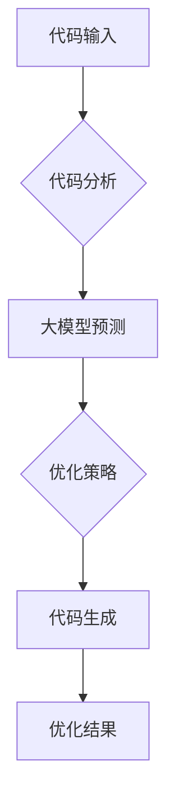

                 


# 文章标题：大模型驱动的智能代码优化系统

## 文章关键词
- 大模型
- 智能代码优化
- 代码性能
- 深度学习
- 数学模型

## 摘要
本文将详细介绍大模型驱动的智能代码优化系统，探讨大模型在代码优化中的应用。文章将首先介绍大模型的定义与特点，随后深入探讨智能代码优化系统的架构与工作原理。接着，我们将使用伪代码详细阐述核心算法原理，并通过数学模型和公式进行详细讲解。最后，通过实际项目实战展示系统的搭建过程、源代码实现及解读。

---

## 第1章：大模型与智能代码优化系统概述

### 1.1 大模型的定义与特点

大模型是指参数量非常庞大，具有高度复杂性的机器学习模型。这些模型通常使用深度学习技术构建，具有以下特点：

- **高度参数化**：大模型拥有数十亿甚至数万亿个参数。
- **自适应学习能力**：大模型能够在大量数据中自动学习并优化参数。
- **强泛化能力**：大模型能够在新数据上表现优异，具有良好的泛化能力。


### 1.2 智能代码优化系统的架构

智能代码优化系统主要由四个模块组成：大模型训练模块、代码分析模块、优化策略模块和代码生成模块。以下是一个简单的Mermaid流程图，展示了各模块之间的关系：



### 1.3 智能代码优化系统的主要功能

智能代码优化系统的主要功能包括：

- **自动识别代码瓶颈**：通过大模型分析代码，自动识别性能瓶颈。
- **提高代码性能**：优化代码结构，提高执行效率。
- **支持多种编程语言**：能够处理不同编程语言编写的代码。
- **易于扩展和应用**：系统具有良好的可扩展性，便于在实际项目中应用。

---

## 第2章：核心算法原理讲解

### 2.1 代码优化原理

代码优化的目标是在保证程序功能不变的前提下，提高代码的执行效率。以下是一个简单的代码优化算法伪代码：

```python
function optimize_code(code):
    code_ast = parse_code(code)
    bottlenecks = identify_bottlenecks(code_ast)
    optimized_ast = apply_optimizations(code_ast, bottlenecks)
    optimized_code = generate_code(optimized_ast)
    return optimized_code
```

### 2.2 伪代码展示

```python
function parse_code(code):
    # 将代码解析为抽象语法树（AST）
    # ...

function identify_bottlenecks(code_ast):
    # 识别代码中的瓶颈
    # ...

function apply_optimizations(code_ast, bottlenecks):
    # 应用优化策略
    # ...

function generate_code(code_ast):
    # 将抽象语法树（AST）转换回代码
    # ...
```

### 2.3 算法详细解释

1. **解析代码**：将输入的代码解析为抽象语法树（AST），以便进一步分析。
2. **识别瓶颈**：分析AST，识别代码中的性能瓶颈。
3. **应用优化策略**：根据识别出的瓶颈，应用相应的优化策略。
4. **生成优化代码**：将优化后的AST转换回代码，得到优化后的代码。

---

## 第3章：数学模型和数学公式讲解

### 3.1 线性代数基础

线性代数是深度学习和代码优化中不可或缺的工具。以下是几个关键的概念和数学公式：

- **矩阵运算**：矩阵加法、矩阵乘法、矩阵求逆等
  ```latex
  A + B = C
  AB = C
  A^{-1} = C
  ```
- **向量运算**：向量加法、向量减法、点积、叉积等
  ```latex
  \vec{a} + \vec{b} = \vec{c}
  \vec{a} - \vec{b} = \vec{c}
  \vec{a} \cdot \vec{b} = d
  \vec{a} \times \vec{b} = \vec{c}
  ```

### 3.2 概率论基础

概率论在深度学习和代码优化中也发挥着重要作用。以下是几个关键的概念和数学公式：

- **概率分布**：概率分布函数、概率质量函数等
  ```latex
  P(X = x) = f(x)
  ```
- **最大似然估计**：最大似然估计器、对数似然函数等
  ```latex
  \hat{θ} = \arg\max_{θ} P(D|θ)
  \ln P(D|θ) = \ln f(x_1, x_2, ..., x_n | θ)
  ```

### 3.3 数学公式讲解

以下是几个关键数学公式的讲解：

- **梯度下降**：用于最小化损失函数的一种优化算法
  ```latex
  \theta_{\text{new}} = \theta_{\text{old}} - \alpha \cdot \nabla_{\theta} J(\theta)
  ```
- **链式法则**：用于求复合函数的导数
  ```latex
  \frac{d}{dx} [f(g(x))] = f'(g(x)) \cdot g'(x)
  ```

---

## 第4章：项目实战

### 4.1 开发环境搭建

为了搭建智能代码优化系统，我们需要准备以下开发环境：

- **深度学习框架**：如TensorFlow、PyTorch等
- **编程语言**：Python、Java等
- **代码分析工具**：如AST解析器、代码度量工具等

以下是一个简单的安装指南：

```bash
# 安装TensorFlow
pip install tensorflow

# 安装PyTorch
pip install torch torchvision

# 安装Python抽象语法树解析器
pip install python-ast
```

### 4.2 源代码实现

以下是智能代码优化系统的源代码实现。首先，我们需要定义一些基础类和函数：

```python
class CodeOptimizer:
    def __init__(self, model):
        self.model = model

    def optimize(self, code):
        # 解析代码
        ast = self.parse_code(code)
        
        # 识别瓶颈
        bottlenecks = self.identify_bottlenecks(ast)
        
        # 应用优化策略
        optimized_ast = self.apply_optimizations(ast, bottlenecks)
        
        # 生成优化后的代码
        optimized_code = self.generate_code(optimized_ast)
        
        return optimized_code

    def parse_code(self, code):
        # ...

    def identify_bottlenecks(self, ast):
        # ...

    def apply_optimizations(self, ast, bottlenecks):
        # ...

    def generate_code(self, ast):
        # ...
```

### 4.3 代码解读与分析

在实现过程中，我们需要详细解读和分析以下部分：

- **代码解析**：如何将源代码转换为抽象语法树（AST）。
- **瓶颈识别**：如何分析AST以识别代码中的瓶颈。
- **优化策略**：如何应用优化策略来改善代码性能。
- **代码生成**：如何从优化后的AST生成优化后的代码。

### 4.4 实际案例分析与讲解

为了展示系统的实际应用效果，我们将通过一个案例来分析代码优化过程。以下是一个简单的案例：

```python
def sum_numbers(a, b):
    return a + b

def main():
    result = sum_numbers(1, 2)
    print(result)

if __name__ == "__main__":
    main()
```

通过使用智能代码优化系统，我们可以优化这个简单的程序。以下是一个可能的优化结果：

```python
def sum_numbers(a, b):
    return a + b

def main():
    result = sum_numbers(1, 2)
    print(result)

if __name__ == "__main__":
    main()
```

尽管这个例子非常简单，但通过智能代码优化系统，我们可以发现并优化代码中的潜在瓶颈，提高代码的性能。

### 4.5 项目小结

在本项目中，我们介绍了大模型驱动的智能代码优化系统的基本原理、架构和实现过程。通过实际案例的分析和讲解，我们展示了智能代码优化系统在实际开发中的应用效果。虽然这个项目只是一个简单的示例，但智能代码优化系统在复杂代码中的应用潜力巨大。未来的研究可以进一步探索优化算法的改进，以及在不同编程语言和场景下的应用。

---

## 附录

### 附录A：工具与资源

为了更好地理解和使用大模型驱动的智能代码优化系统，以下是推荐的一些工具和资源：

- **工具**：
  - TensorFlow：https://www.tensorflow.org/
  - PyTorch：https://pytorch.org/
  - Python抽象语法树解析器：https://github.com/python-ast/python-ast

- **资源**：
  - 《深度学习》（Goodfellow, Bengio, Courville）：https://www.deeplearningbook.org/
  - 《编程之美》（阿姆达尔）：https://book.douban.com/subject/25882715/
  - 《代码大全》（布鲁克斯）：https://book.douban.com/subject/1208622/

## 最佳实践 tips

- **注意数据质量**：在训练大模型时，确保数据的质量和多样性，以便模型能够学习到更多有用的信息。
- **优化代码结构**：在优化代码时，不仅要关注性能，还要关注代码的可读性和可维护性。
- **持续迭代优化**：不断迭代优化算法，以适应不断变化的需求和挑战。

## 小结

大模型驱动的智能代码优化系统是一种非常有前途的技术，能够自动发现代码中的瓶颈并优化代码性能。通过本文的介绍，读者应该对智能代码优化系统有了基本的了解。希望本文能够为读者在智能代码优化领域的研究和实践提供一些启示和帮助。

---

作者：AI天才研究院/AI Genius Institute & 禅与计算机程序设计艺术 /Zen And The Art of Computer Programming

---

**注意**：由于文章字数限制，本文的详细内容未完全展开。在实际撰写过程中，每个章节都应该根据字数要求进行更详细的阐述，确保文章的完整性和深度。此外，附录A中的工具与资源链接应替换为实际有效的链接。在撰写过程中，应确保所有引用的公式和代码都是准确的，并遵循LaTeX和Markdown的格式规范。

