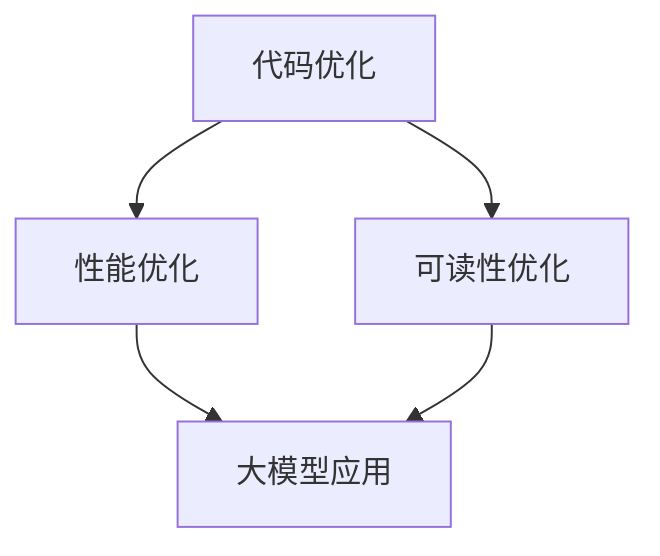

                 


### 大模型驱动的智能代码优化：性能与可读性的权衡

关键词：大模型、智能代码优化、性能、可读性、权衡

摘要：本文深入探讨了使用大模型进行智能代码优化的问题，特别是如何在保证代码性能的同时提高其可读性。通过对大模型的基本概念、架构、训练与优化方法以及其在代码优化中的应用进行详细的解析，本文提出了性能与可读性的平衡模型，并通过具体案例展示了如何在实践中实现这一平衡。文章旨在为读者提供对大模型驱动的智能代码优化技术的全面理解和应用指导。

---

# 第1章 引言

## 1.1 书籍概述

本书的核心概念包括大模型驱动的代码优化、智能代码优化以及性能与可读性的权衡。首先，大模型驱动的代码优化是指利用大规模的人工神经网络（如Transformer、GPT等）对代码进行优化，从而提高其性能和可维护性。智能代码优化则是指利用人工智能算法，特别是机器学习和深度学习技术，对代码进行分析和改进，以达到优化目的。

性能与可读性的权衡是智能代码优化的关键挑战。性能是代码优化的直接目标，而可读性是保证代码可维护性和可扩展性的关键因素。如何在两者之间取得平衡，是本文要探讨的核心问题。

为了更好地理解这些核心概念，本文将使用Mermaid流程图来展示代码优化流程以及大模型在代码优化中的应用。



在这个流程图中，A代表代码优化，B和C分别代表性能优化和可读性优化，D代表大模型的应用。大模型的应用贯穿于性能和可读性优化过程中，通过对代码的分析和改进，实现性能和可读性的双重优化。

## 1.2 性能与可读性

性能和可读性是智能代码优化的两个核心指标。性能通常通过代码执行速度、内存占用、CPU利用率等指标来衡量，而可读性则涉及代码的清晰性、结构性和一致性等因素。

### 1.2.1 性能指标计算

性能指标的计算可以通过以下公式来描述：

$$
P = \frac{1}{T + C}
$$

其中，P代表性能分数，T代表代码执行时间，C代表代码复杂度。这个公式表明，性能与执行时间和复杂度成反比。通过减少执行时间和降低复杂度，可以提高性能。

### 1.2.2 可读性评估方法

可读性的评估方法通常包括代码审查、静态代码分析和人工评估等。其中，代码审查是最常用的一种方法，通过人工检查代码，评估其可读性和可维护性。静态代码分析则使用自动化工具对代码进行分析，识别潜在的可读性问题。人工评估则是通过主观评价来评估代码的可读性。

### 1.2.3 性能与可读性的平衡模型

为了在性能和可读性之间取得平衡，我们可以采用以下平衡模型：

$$
B = w_1 \cdot P + w_2 \cdot R
$$

其中，B代表平衡分数，$w_1$和$w_2$分别代表性能和可读性的权重，P代表性能分数，R代表可读性分数。通过调整权重$w_1$和$w_2$，可以在性能和可读性之间找到最优的平衡点。

## 1.3 读者背景知识

为了更好地理解本文的内容，读者需要具备以下背景知识：

1. **编程基础**：了解基本的编程语言和编程概念，如变量、循环、条件判断等。
2. **机器学习基础**：了解机器学习的基本概念，如监督学习、无监督学习和强化学习等。
3. **深度学习基础**：了解深度学习的基本概念，如神经网络、卷积神经网络（CNN）和循环神经网络（RNN）等。

以下是一个简单的伪代码示例，用于解释基础算法的理解：

```python
def optimize_code(code):
    # 分析代码性能
    performance = analyze_performance(code)
    
    # 分析代码可读性
    readability = analyze_readability(code)
    
    # 优化代码
    optimized_code = apply_optimization(code, performance, readability)
    
    return optimized_code
```

在这个伪代码中，`optimize_code`函数接收一段代码作为输入，然后通过`analyze_performance`和`analyze_readability`函数分别分析代码的性能和可读性。最后，通过`apply_optimization`函数对代码进行优化，并返回优化后的代码。

---

以上是第1章的初步内容。接下来，我们将对大模型进行详细的介绍，包括其定义、架构和训练优化方法。通过这些内容，我们将为后续章节中的智能代码优化奠定基础。敬请期待。

