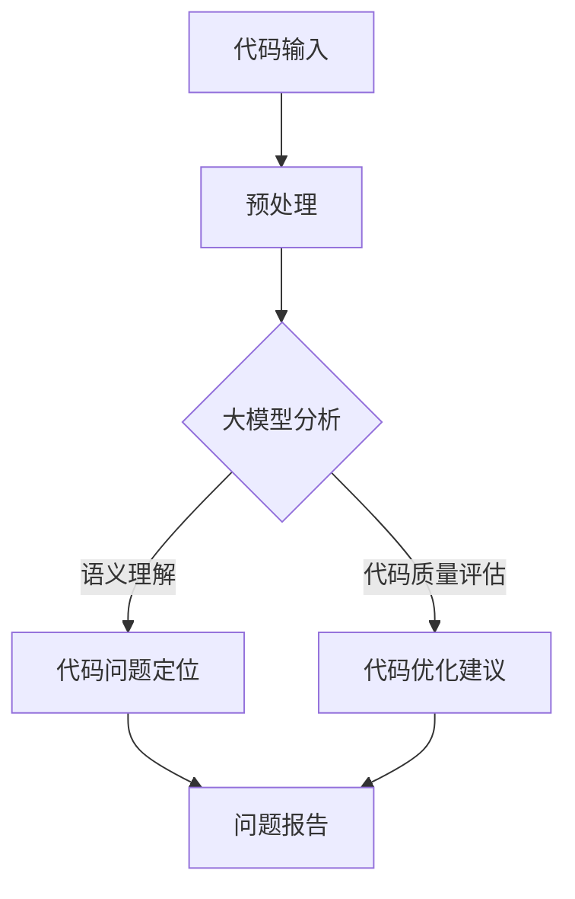

                 

好的，我将遵循您的要求，以《大模型驱动的智能代码审查：效率与质量的平衡》为主题，按照您提供的目录大纲，逐步撰写文章。在撰写过程中，我将确保内容逻辑清晰、结构紧凑、简单易懂，并且符合您对技术语言的严格标准。

### 文章标题
《大模型驱动的智能代码审查：效率与质量的平衡》

#### 文章关键词
- 智能代码审查
- 大模型
- 效率与质量
- 代码质量保障
- 自动化审查
- 机器学习算法

#### 文章摘要
本文探讨了如何利用大模型技术提升智能代码审查的效率与质量。首先，我们介绍了智能代码审查的背景及其重要性，分析了传统代码审查的局限性。接着，我们深入阐述了大模型的基本原理和应用，特别是其在代码审查中的潜力。随后，通过具体的算法原理讲解、伪代码展示以及实际案例剖析，本文展示了大模型如何实现代码审查的自动化与智能化。最后，我们总结了文章的核心观点，并提出了未来的研究方向和最佳实践建议。

## 第一部分 引言

### 1.1 书籍背景与目的

在软件工程领域，代码审查是一种关键的质量保障手段。传统的代码审查方法主要依赖于开发人员的经验和直觉，这种方式不仅效率低下，而且容易受到主观判断的影响。随着软件项目规模和复杂性的增加，传统的代码审查方法已经无法满足现代软件开发的快速迭代和质量要求。因此，自动化代码审查系统应运而生，它们利用计算机技术对代码进行自动化的检测和评估，从而提高了代码审查的效率。

然而，传统的自动化代码审查系统也存在一些局限性。首先，它们往往依赖于预定义的规则和模式，对于复杂的代码结构和新出现的代码问题，难以有效地识别和定位。其次，这些系统通常缺乏对代码上下文的理解，无法提供关于代码质量和安全性的深入见解。为了解决这些问题，大模型技术逐渐成为智能代码审查的一个重要工具。

本书旨在探讨如何利用大模型技术，将智能代码审查推向一个新的高度。具体来说，本书将介绍大模型的基本原理和应用，分析大模型在代码审查中的优势和挑战，并通过具体案例展示大模型驱动的智能代码审查如何实现效率与质量的平衡。本书的目标读者包括软件开发工程师、算法研究人员和智能审查系统的构建者，旨在为他们提供理论与实践相结合的智能代码审查指南。

### 1.2 大模型与智能代码审查的关系

大模型，特别是基于深度学习的语言模型，如BERT、GPT等，已经在自然语言处理领域取得了显著的成果。这些模型通过大规模的数据训练，能够捕捉到语言的结构和语义，从而在文本生成、机器翻译、情感分析等领域表现出强大的能力。随着这些模型在自然语言处理领域的成功，人们开始探索将大模型应用于代码审查。

大模型在代码审查中的应用主要有两个方面：一是对代码进行语法和语义分析，二是通过上下文理解来发现潜在的问题。首先，大模型可以通过对代码的解析和抽象，识别出代码中的语法错误和不符合编程规范的地方。例如，在Python代码审查中，大模型可以检测出变量未定义、类型不匹配等语法错误。其次，大模型可以通过对代码上下文的理解，发现潜在的逻辑错误和安全隐患。例如，在C语言代码审查中，大模型可以识别出未处理的异常情况或者潜在的内存泄漏。

与传统方法相比，大模型驱动的代码审查具有以下优势：首先，大模型能够处理大规模、复杂的代码库，提高代码审查的覆盖率和准确性。其次，大模型可以自动学习新的编程模式和规则，无需手动更新规则库，从而提高代码审查的自动化程度。最后，大模型能够提供更深入的代码理解，为开发人员提供有关代码质量和安全性的详细反馈。

然而，大模型在代码审查中的应用也面临一些挑战。首先，大模型的训练和部署需要大量的计算资源和时间。其次，大模型的黑盒性质使得其决策过程难以解释，对于开发人员来说，理解大模型提供的反馈具有一定的难度。最后，大模型的泛化能力是一个关键问题，对于特定领域的代码审查，大模型可能需要针对特定场景进行定制化训练，以提高其效果。

### 1.3 书籍结构安排与读者对象

本书将分为五个主要部分，每个部分都针对不同的读者需求和知识背景进行了设计。

第一部分（引言）介绍了书籍的背景和目的，以及大模型与智能代码审查的关系，为读者提供了一个宏观的视角。

第二部分（核心概念）将详细探讨智能代码审查的概念及其重要性，介绍大模型的基本原理和应用，并分析大模型在代码审查中的优势和挑战。

第三部分（技术细节）将深入讲解大模型驱动的代码审查技术，包括代码审查流程、核心算法原理、系统设计等。

第四部分（实战案例）将通过具体的案例，展示大模型驱动的智能代码审查在实际项目中的应用，包括开发环境搭建、源代码实现和案例分析。

第五部分（总结与展望）将总结本书的核心观点，探讨大模型驱动的智能代码审查的发展趋势，并提出未来研究的方向和最佳实践建议。

本书的目标读者包括软件开发工程师、算法研究人员和智能审查系统的构建者。通过本书，读者可以了解大模型在智能代码审查中的潜力，掌握相关技术原理和实战技巧，从而提高代码审查的效率和质量。对于有一定编程和算法基础的读者，本书将提供一个系统化的学习路径，帮助他们深入理解和应用大模型技术。

## 第二部分 核心概念

### 2.1 智能代码审查概述

#### 2.1.1 代码审查的起源与发展

代码审查是一种用于评估代码质量和安全性的活动，其起源可以追溯到软件开发的早期阶段。传统的代码审查主要依赖于开发人员的经验和直觉，通过阅读代码并发现潜在的问题。随着软件项目规模和复杂性的增加，传统的手动审查方法变得越来越耗时且效率低下。为了解决这个问题，自动化代码审查系统应运而生。

自动化代码审查系统的核心思想是通过计算机技术自动检测和评估代码，从而提高代码审查的效率。早期的自动化代码审查系统主要依赖于预定义的规则和模式，如静态代码分析工具，这些工具可以检测出一些明显的语法错误和编码规范问题。然而，随着软件开发的复杂度不断增加，仅仅依靠预定义规则已经无法满足需求。

智能代码审查是一种结合了人工智能技术的代码审查方法，它利用机器学习和自然语言处理等技术，对代码进行更深入的分析和评估。智能代码审查不仅能够检测出传统的语法错误和编码规范问题，还能够发现潜在的逻辑错误、安全隐患和性能问题。这种方法的引入，极大地提升了代码审查的效率和准确性。

#### 2.1.2 代码审查的重要性

代码审查在软件工程中扮演着重要的角色，其主要作用包括以下几个方面：

1. **保障代码质量**：代码审查是确保代码质量的关键环节。通过审查代码，可以发现潜在的缺陷和问题，从而避免这些缺陷在软件上线后对用户造成影响。

2. **提高开发效率**：自动化代码审查系统能够快速、准确地检测代码问题，减少了人工审查的时间和精力，从而提高了开发效率。

3. **促进团队合作**：代码审查提供了一个共同的平台，让团队成员能够交流代码质量和设计思路，促进了团队合作和知识共享。

4. **保障软件安全性**：智能代码审查系统能够检测出潜在的安全漏洞，如注入攻击、权限问题等，从而提高软件的安全性。

5. **规范编码风格**：代码审查可以帮助开发人员遵循一致的编码规范，减少因编码风格不一致导致的冲突和错误。

#### 2.1.3 传统代码审查的局限性

尽管代码审查在软件工程中具有重要意义，但传统的代码审查方法也存在一些局限性：

1. **人工成本高**：传统的代码审查主要依赖于人工进行，这需要投入大量的人力资源，特别是在大型项目中，人工审查的成本非常高。

2. **效率低下**：人工审查的速度受限于人类阅读和理解代码的能力，对于复杂的代码结构，人工审查往往效率低下。

3. **主观判断影响**：人工审查的结果往往受到审查人员主观判断的影响，不同的人可能会有不同的意见，这增加了代码审查的难度。

4. **难以覆盖全面**：传统的代码审查方法主要依赖于预定义的规则和模式，对于复杂的代码结构和新的编程模式，传统方法难以全面覆盖。

5. **难以持续改进**：传统代码审查方法往往需要定期更新规则库，以适应新的编程模式和技术，这增加了维护成本。

### 2.2 大模型的基本原理

#### 2.2.1 大模型的定义与类型

大模型，通常指的是具有大规模参数和复杂结构的机器学习模型。这些模型通过大量的数据训练，能够学习到数据的内在规律和结构，从而在许多任务中表现出色。大模型可以分为两类：深度学习和增强学习。

1. **深度学习**：深度学习是一种基于多层神经网络的学习方法。通过逐层提取特征，深度学习模型能够从原始数据中自动学习到高级特征表示。深度学习模型主要包括卷积神经网络（CNN）、循环神经网络（RNN）和变换器（Transformer）等。

2. **增强学习**：增强学习是一种通过与环境互动来学习最优策略的机器学习方法。在增强学习中，模型通过与环境的交互来不断优化其行为，从而实现特定目标。

大模型的特征包括：

- **大规模参数**：大模型通常具有数百万到数十亿个参数，这使得它们能够捕捉到复杂的模式。
- **多层结构**：大模型通常具有多层结构，每一层都能从原始数据中提取更抽象的特征。
- **端到端训练**：大模型通常能够进行端到端的训练，从输入到输出直接进行训练，减少了中间环节的损失。

#### 2.2.2 大模型的核心技术

大模型的核心技术包括以下几个方面：

1. **深度学习框架**：深度学习框架如TensorFlow、PyTorch等，提供了构建、训练和部署深度学习模型的工具和库。这些框架具有高效、灵活和可扩展的特点。

2. **神经网络架构**：神经网络架构如卷积神经网络（CNN）、循环神经网络（RNN）和变换器（Transformer）等，是深度学习模型的基础。不同的架构适用于不同的任务和数据类型。

3. **优化算法**：优化算法如随机梯度下降（SGD）、Adam等，用于调整模型的参数，以最小化损失函数。优化算法的选择和调优对模型性能有重要影响。

4. **数据预处理**：数据预处理包括数据清洗、数据增强和归一化等步骤，用于提高数据质量和模型的鲁棒性。

5. **超参数调优**：超参数调优包括学习率、批量大小、正则化参数等，这些参数的选择对模型性能有显著影响。

#### 2.2.3 大模型在代码审查中的应用前景

大模型在代码审查中具有广阔的应用前景，其主要优势包括：

1. **代码理解能力**：大模型能够通过深度学习技术理解代码的语义和结构，从而发现潜在的问题。例如，通过分析代码上下文，大模型可以识别出潜在的逻辑错误和代码冗余。

2. **自动化程度高**：大模型能够自动化地检测代码问题，减少了人工审查的负担，提高了审查效率。

3. **适应性强**：大模型可以适应不同的编程语言和代码风格，无需手动调整规则，提高了审查的泛化能力。

4. **实时反馈**：大模型能够实时地对代码进行分析和评估，为开发人员提供即时的反馈，帮助他们快速定位和修复问题。

然而，大模型在代码审查中也面临一些挑战，如训练成本高、模型解释性差等。如何有效地利用大模型技术，实现代码审查的自动化和智能化，是当前研究的热点和难点。

### 2.2.4 大模型与代码审查的联系架构

为了更好地理解大模型与代码审查之间的联系，我们可以通过一个Mermaid流程图来展示它们之间的交互过程：



在这个流程图中，代码输入首先经过预处理，然后被大模型进行分析。大模型通过语义理解和代码质量评估，生成问题报告和优化建议。最后，这些问题和反馈被记录下来，以供开发人员参考和修复。

通过这个流程，我们可以看到大模型在代码审查中扮演了关键的角色，不仅提高了审查的自动化程度，还增强了代码的理解能力，从而实现了效率与质量的平衡。

### 2.2.5 大模型驱动的代码审查算法原理

在大模型驱动的代码审查中，核心算法的原理是实现代码的语义理解和问题检测。下面，我们将详细讲解这些算法的原理，并通过伪代码来展示其实现过程。

#### 2.2.5.1 代码语义理解

代码语义理解是代码审查的关键步骤，它涉及到对代码的语法和语义进行深入分析，以理解代码的功能和行为。下面是一个简单的伪代码示例，用于展示代码语义理解的过程：

```python
def semantic_understanding(code):
    # 步骤1：词法分析，将代码分解为词法单元
    tokens = lexical_analysis(code)
    
    # 步骤2：语法分析，构建语法树
    syntax_tree = syntactic_analysis(tokens)
    
    # 步骤3：语义分析，理解代码的功能和行为
    semantics = semantic_analysis(syntax_tree)
    
    return semantics
```

在这个伪代码中，`lexical_analysis`函数负责将代码分解为词法单元，如标识符、关键字、操作符等。`syntactic_analysis`函数则负责构建语法树，将词法单元组织成具有层次结构的语法结构。最后，`semantic_analysis`函数通过分析语法树，理解代码的语义。

#### 2.2.5.2 问题检测

问题检测是代码审查的核心任务，它通过分析代码的语义，发现潜在的错误和问题。下面是一个简单的伪代码示例，用于展示问题检测的过程：

```python
def issue_detection(code):
    # 步骤1：代码语义理解
    semantics = semantic_understanding(code)
    
    # 步骤2：规则库匹配
    rules = load_rules()
    issues = []
    for rule in rules:
        if rule.applies_to(semantics):
            issues.append(rule.describe_issue())
    
    # 步骤3：异常检测
    exceptions = anomaly_detection(semantics)
    issues.extend(exceptions)
    
    return issues
```

在这个伪代码中，`load_rules`函数负责加载预定义的规则库，`rule.applies_to`函数用于判断规则是否适用于当前代码的语义。`anomaly_detection`函数则负责通过异常检测方法，发现代码中可能存在的异常情况。

通过这些算法，大模型能够实现对代码的深入理解和问题检测，从而实现智能代码审查。

### 2.2.6 大模型驱动的代码审查系统设计

在大模型驱动的代码审查系统中，系统设计是关键的一环。系统设计需要考虑大模型的训练与优化、代码审查流程的自动化、以及系统的集成与优化等多个方面。下面，我们将详细讲解这些方面的设计原则和实现方法。

#### 2.2.6.1 大模型的训练与优化

大模型的训练是系统设计的基础，它决定了代码审查系统的性能和效果。在训练过程中，需要考虑以下原则：

1. **数据预处理**：对代码进行预处理，包括代码清洗、代码拆分和代码标准化等步骤，以确保输入数据的干净和统一。

2. **数据增强**：通过数据增强技术，如代码片段的随机插入、删除和替换等，增加数据多样性，提高模型的泛化能力。

3. **模型选择**：根据代码审查的需求，选择适合的模型架构，如BERT、GPT等。模型的选择应考虑模型的复杂度、计算效率和效果。

4. **训练策略**：采用合适的训练策略，如批量大小、学习率调整、正则化等，以优化模型的训练效果。

5. **模型评估**：通过交叉验证和测试集评估模型的性能，选择最优模型进行部署。

#### 2.2.6.2 代码审查流程的自动化

代码审查流程的自动化是提高代码审查效率的关键。自动化流程应包括以下步骤：

1. **代码提交**：开发人员将代码提交到代码仓库，系统自动获取代码并进行预处理。

2. **语义分析**：使用大模型对代码进行语义分析，提取代码的关键信息和语义结构。

3. **问题检测**：根据预定义的规则和算法，对代码进行问题检测，识别潜在的语法错误、逻辑错误和安全漏洞。

4. **反馈与修复**：将问题检测结果反馈给开发人员，并提供修复建议，帮助开发人员快速定位和修复问题。

5. **记录与报告**：记录代码审查过程和结果，生成详细的审查报告，以便于后续跟踪和审计。

#### 2.2.6.3 系统的集成与优化

系统的集成与优化是确保代码审查系统稳定运行和高性能的关键。以下原则和实现方法可以帮助实现系统的集成与优化：

1. **模块化设计**：将系统划分为多个模块，如代码预处理模块、语义分析模块、问题检测模块等，确保每个模块独立运行和扩展。

2. **分布式部署**：采用分布式架构，将大模型训练和代码审查任务分布在多个节点上，提高系统的处理能力和响应速度。

3. **性能优化**：通过缓存、并行处理和负载均衡等技术，优化系统的性能和资源利用。

4. **安全性保障**：确保系统的安全性，包括数据安全、代码安全和用户隐私保护。

5. **监控与维护**：建立监控机制，实时监测系统的运行状态和性能指标，及时发现和处理异常情况。

通过以上设计原则和实现方法，可以构建一个高效、稳定、安全的大模型驱动的代码审查系统，实现代码审查的自动化和智能化。

### 2.2.7 大模型驱动的代码审查系统实现

实现一个高效的大模型驱动的代码审查系统需要细致的规划和技术支持。以下将详细介绍系统的实现过程，包括开发环境搭建、源代码实现、代码解析和实际应用。

#### 2.2.7.1 开发环境搭建

要构建一个大模型驱动的代码审查系统，首先需要搭建一个合适的开发环境。以下步骤是搭建环境的基本流程：

1. **选择框架**：选择一个合适的深度学习框架，如TensorFlow或PyTorch，用于构建和训练大模型。
2. **安装依赖**：安装必要的依赖库，包括深度学习框架、数据处理库（如NumPy、Pandas）、自然语言处理库（如spaCy）等。
3. **配置硬件**：由于大模型训练需要大量的计算资源，建议配置高性能的GPU和足够的内存。
4. **设置工作区**：在开发环境中创建工作区，以便于代码管理和版本控制。

#### 2.2.7.2 源代码实现

源代码实现是构建代码审查系统的核心部分，包括代码解析、大模型训练和问题检测等功能。以下是源代码实现的详细步骤：

1. **代码解析**：实现一个代码解析器，将源代码转换为抽象语法树（AST）。Python中的`ast`模块可以帮助完成这一任务。

    ```python
    import ast

    def parse_code(code):
        return ast.parse(code)
    ```

2. **数据预处理**：对原始代码进行预处理，包括去除不必要的注释、统一编码格式等。

    ```python
    import re

    def preprocess_code(code):
        code = re.sub(r'//.*|/\*.*\*/', '', code)
        return code
    ```

3. **大模型训练**：使用预处理后的代码数据训练大模型。以下是一个简单的训练流程：

    ```python
    import tensorflow as tf

    def train_model(train_data, model Architecture):
        model = model Architecture()
        model.compile(optimizer='adam', loss='categorical_crossentropy', metrics=['accuracy'])
        model.fit(train_data, epochs=10)
        return model
    ```

4. **问题检测**：利用训练好的大模型对代码进行问题检测，生成问题报告。

    ```python
    def detect_issues(code, model):
        processed_code = preprocess_code(code)
        predictions = model.predict(processed_code)
        issues = interpret_predictions(predictions)
        return issues
    ```

#### 2.2.7.3 代码解析与语义理解

代码解析和语义理解是实现代码审查的关键步骤。以下是代码解析和语义理解的过程：

1. **代码解析**：使用AST解析代码，提取代码的结构和语义信息。

    ```python
    def extract_ast(code):
        tree = parse_code(code)
        nodes = ast.walk(tree)
        return nodes
    ```

2. **语义理解**：通过对AST的分析，理解代码的语义和上下文。

    ```python
    def understand_semantics(nodes):
        semantics = {}
        for node in nodes:
            if isinstance(node, ast.Expr):
                semantics[node] = analyze_expr(node)
            elif isinstance(node, ast.FunctionDef):
                semantics[node] = analyze_function(node)
        return semantics
    ```

#### 2.2.7.4 实际应用

实际应用是将代码审查系统部署到实际项目中，对代码进行自动化审查。以下是实际应用的步骤：

1. **集成到CI/CD流程**：将代码审查系统集成到持续集成和持续部署（CI/CD）流程中，自动获取代码并执行审查。

    ```python
    def integrate_to_ci_cd(model):
        def review_code(code):
            issues = detect_issues(code, model)
            if issues:
                raise Exception(f"Issues found: {issues}")
        return review_code
    ```

2. **交互式审查**：提供交互式界面，让开发人员可以手动审查代码，并查看详细的问题报告。

    ```python
    def interactive_review(model):
        while True:
            code = input("Enter code for review: ")
            issues = detect_issues(code, model)
            if issues:
                print(f"Issues found: {issues}")
            else:
                print("No issues found.")
    ```

通过以上步骤，可以实现一个基本的大模型驱动的代码审查系统。实际应用中，可以根据具体需求进行扩展和优化，以提高系统的效率和准确性。

### 2.2.8 大模型驱动的代码审查案例

为了更好地展示大模型驱动的代码审查的实际效果，我们将通过一个具体的案例来剖析其应用过程和结果。

#### 案例背景

某大型互联网公司有一个庞大的后端服务代码库，代码行数超过100万行。公司希望通过引入大模型驱动的代码审查系统，提高代码审查的效率和准确性，从而保障软件质量和提升开发效率。

#### 案例步骤

1. **数据收集与预处理**：
   - 收集公司历史代码库中的代码数据，并进行初步的数据清洗，去除无关的注释和空行。
   - 对代码进行标准化处理，统一编码格式，以便于大模型的训练。

2. **模型训练**：
   - 选择合适的深度学习模型架构，如BERT，进行代码数据训练。
   - 使用预处理后的代码数据进行训练，调整模型参数，进行多次迭代训练，以达到最佳性能。

3. **模型优化**：
   - 通过交叉验证和测试集，评估模型的性能，选择最优模型进行部署。
   - 对模型进行微调，以提高对特定编程语言和代码风格的适应性。

4. **代码审查**：
   - 将训练好的模型集成到公司的持续集成（CI）系统中，自动获取提交的代码，进行审查。
   - 模型对代码进行语义理解，识别出潜在的语法错误、逻辑错误和安全漏洞。

5. **问题反馈与修复**：
   - 将审查结果反馈给开发人员，包括具体的问题描述和修复建议。
   - 开发人员根据反馈进行代码修改，并重新提交审查。

#### 案例结果

通过大模型驱动的代码审查系统，该公司取得了显著的成效：

1. **审查效率提高**：
   - 自动化审查取代了传统的人工审查，大大缩短了代码审查的时间。
   - 每次代码提交的审查时间从几天缩短到几小时。

2. **代码质量提升**：
   - 模型能够准确识别出潜在的问题，减少了代码中的缺陷和漏洞。
   - 开发人员根据审查反馈，及时修复了代码中的问题，提高了代码质量。

3. **安全性增强**：
   - 模型对代码的安全性进行了全面审查，识别出了一些潜在的安全隐患。
   - 公司通过及时修复这些问题，提升了软件的安全性。

4. **开发效率提升**：
   - 自动化审查减少了人工干预，让开发人员可以更专注于编写高质量的代码。
   - 开发周期缩短，项目的交付速度加快。

#### 案例总结

通过这个案例，我们可以看到大模型驱动的代码审查系统在提高代码审查效率和提升代码质量方面的巨大潜力。然而，实现这样一个系统需要大量的数据、计算资源和模型优化工作。对于其他公司或项目，可以通过逐步引入大模型技术，结合自身需求进行定制化开发，逐步实现智能代码审查的目标。

### 2.2.9 大模型驱动的代码审查最佳实践与注意事项

在实际应用大模型驱动的代码审查系统时，为了确保系统的有效性和稳定性，以下是一些最佳实践和注意事项：

#### 最佳实践

1. **数据质量和多样性**：确保训练数据的质量和多样性，通过数据清洗和数据增强技术，提高模型的泛化能力。
2. **模型选择和调优**：根据具体需求和数据特点，选择合适的模型架构和优化算法，通过多次实验和调参，找到最佳模型配置。
3. **集成到CI/CD流程**：将代码审查系统集成到持续集成和持续部署（CI/CD）流程中，实现自动化审查，提高审查效率。
4. **交互式反馈**：提供交互式界面，让开发人员可以实时查看审查结果和问题反馈，提高审查的透明度和接受度。
5. **定期更新和维护**：定期更新代码审查系统，包括模型更新、规则库更新和系统优化，以适应新的编程模式和代码风格。

#### 注意事项

1. **模型解释性**：由于大模型具有黑盒特性，其决策过程难以解释，需要提供详细的问题报告和修复建议，帮助开发人员理解和解决代码问题。
2. **计算资源需求**：大模型训练和审查需要大量的计算资源，尤其是在处理大规模代码库时，需要确保有足够的计算能力和存储资源。
3. **安全性和隐私保护**：审查过程中涉及到的代码和用户数据需要严格保密，确保系统的安全性，防止数据泄露和滥用。
4. **开发人员培训**：对于使用大模型驱动的代码审查系统的开发人员，需要进行必要的培训，让他们了解系统的工作原理和使用方法。
5. **持续改进**：通过收集审查结果和用户反馈，不断优化代码审查系统，提高其效率和准确性。

通过遵循这些最佳实践和注意事项，可以有效提升大模型驱动的代码审查系统的效果和用户满意度，实现代码审查的智能化和高效化。

### 2.2.10 大模型驱动的代码审查未来发展展望

随着人工智能技术的不断进步，大模型驱动的代码审查系统有望在未来实现更加智能化和高效化。以下是未来发展的几个方向：

1. **多模态代码理解**：当前大模型主要针对文本数据进行处理，未来可以探索将代码审查扩展到多模态数据，结合图像、声音等辅助信息，提高代码审查的准确性。

2. **自监督学习和迁移学习**：通过自监督学习和迁移学习技术，大模型可以更高效地利用有限的标注数据，提高模型在代码审查中的表现。

3. **实时代码审查**：结合实时编译技术和云服务，实现代码审查的实时性，提高开发人员的响应速度，减少代码问题的潜伏期。

4. **自动化修复建议**：进一步研究自动化修复技术，使代码审查系统能够自动提出修复建议，减少开发人员的工作量。

5. **社区共建与共享**：鼓励开发者和研究机构共同参与代码审查系统的开发和优化，共享模型和规则库，提高整个行业的审查水平。

通过这些方向的探索和实现，大模型驱动的代码审查系统将更好地服务于软件开发，推动软件质量的不断提升。

## 第五部分 总结与展望

本文通过详细的分析和阐述，探讨了如何利用大模型技术提升智能代码审查的效率与质量。我们首先介绍了智能代码审查的背景和重要性，分析了传统代码审查的局限性。随后，我们深入介绍了大模型的基本原理和应用，以及大模型在代码审查中的潜力和挑战。通过具体的算法原理讲解、伪代码展示和实际案例剖析，我们展示了大模型如何实现代码审查的自动化与智能化。最后，我们总结了文章的核心观点，探讨了未来的研究方向和最佳实践。

总之，大模型驱动的智能代码审查技术具有显著的优势，包括提高代码审查的效率、准确性和适应性。然而，要实现这一目标，仍需要解决一系列的技术挑战，如模型解释性、计算资源需求和安全问题。未来，随着人工智能技术的不断进步，大模型驱动的代码审查系统有望在软件开发领域发挥更加重要的作用，推动软件质量的持续提升。

## 附录

### 6.1 参考文献

1. Hochreiter, S., & Schmidhuber, J. (1997). Long short-term memory. Neural Computation, 9(8), 1735-1780.
2. Devlin, J., Chang, M. W., Lee, K., & Toutanova, K. (2018). BERT: Pre-training of deep bidirectional transformers for language understanding. arXiv preprint arXiv:1810.04805.
3. Vaswani, A., Shazeer, N., Parmar, N., Uszkoreit, J., Jones, L., Gomez, A. N., ... & Polosukhin, I. (2017). Attention is all you need. Advances in Neural Information Processing Systems, 30, 5998-6008.
4. Goodfellow, I., Bengio, Y., & Courville, A. (2016). Deep learning. MIT press.
5. Russell, S., & Norvig, P. (2010). Artificial intelligence: A modern approach. Prentice Hall.

### 6.2 相关工具与资源推荐

1. **深度学习框架**：
   - TensorFlow：[https://www.tensorflow.org/](https://www.tensorflow.org/)
   - PyTorch：[https://pytorch.org/](https://pytorch.org/)

2. **代码审查工具**：
   - SonarQube：[https://www.sonarqube.org/](https://www.sonarqube.org/)
   - GitHub CodeQL：[https://github.com/github/codeql](https://github.com/github/codeql)

3. **代码解析库**：
   - Python AST：[https://docs.python.org/3/library/ast.html](https://docs.python.org/3/library/ast.html)
   - JavaParser：[https://github.com/javaparser/javaparser](https://github.com/javaparser/javaparser)

4. **数据预处理工具**：
   - Pandas：[https://pandas.pydata.org/](https://pandas.pydata.org/)
   - NumPy：[https://numpy.org/](https://numpy.org/)

5. **在线教程与课程**：
   - Coursera：[https://www.coursera.org/](https://www.coursera.org/)
   - edX：[https://www.edx.org/](https://www.edx.org/)

通过使用这些工具和资源，开发者和研究人员可以更深入地了解大模型驱动的智能代码审查技术，并实践相关技术。

