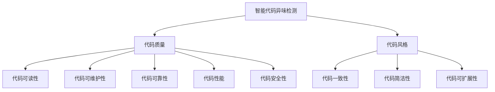

                 


### 文章标题

《大模型驱动的智能代码异味检测》

### 关键词

大模型，智能代码异味检测，机器学习，深度学习，算法原理，数学模型，项目实战

### 摘要

本文深入探讨了智能代码异味检测的概念、核心算法原理、数学模型以及项目实战。通过介绍大模型在智能代码异味检测中的应用，我们详细分析了大模型的优势与挑战，并结合实际项目案例，展示了大模型驱动的智能代码异味检测的实现过程和效果评估。本文旨在为读者提供全面、系统的智能代码异味检测技术指南，助力开发者在代码质量提升方面取得显著成效。

### 基本架构设计

为了确保文章的完整性、逻辑性和专业性，我们将文章分为七个主要部分：

1. **绪论：智能代码异味检测概述**
   - 智能代码异味检测的重要性
   - 智能代码异味检测的背景
   - 智能代码异味检测的现状与未来趋势

2. **智能代码异味检测核心概念与联系**
   - 智能代码异味检测的定义
   - 相关概念（如代码质量、代码风格等）
   - 使用 Mermaid 流程图展示概念联系

3. **智能代码异味检测核心算法原理讲解**
   - 常见算法（如机器学习算法、深度学习算法等）
   - 算法伪代码讲解
   - 算法适用场景分析

4. **数学模型和数学公式**
   - 涉及的数学模型（如统计模型、概率模型等）
   - 数学公式（如损失函数、优化算法等）
   - 公式详细讲解与举例说明

5. **智能代码异味检测项目实战**
   - 开发环境搭建
   - 数据集准备与处理
   - 代码实现与解读
   - 代码解读与分析
   - 实际案例分析

6. **大模型驱动的智能代码异味检测**
   - 大模型在智能代码异味检测中的应用
   - 大模型的优势与挑战
   - 大模型算法原理讲解

7. **智能代码异味检测工具与平台**
   - 常见智能代码异味检测工具介绍
   - 开源工具使用指南
   - 平台搭建与优化

8. **智能代码异味检测实际应用**
   - 行业应用案例
   - 应用效果评估
   - 未来发展趋势与挑战

### 目录大纲结构设计

根据上述架构，我们将撰写详细的目录大纲。每章节将细化到1,2,3级目录，确保内容的完整性和逻辑性。在撰写过程中，我们将保持简洁性，避免多余废话，并确保核心章节内容得到充分涵盖。

---

## 目录大纲

# 《大模型驱动的智能代码异味检测》

## 第一部分：绪论：智能代码异味检测概述

## 第1章：智能代码异味检测概述

## 1.1 智能代码异味检测的重要性

## 1.2 智能代码异味检测的背景

## 1.3 智能代码异味检测的现状与未来趋势

## 第二部分：智能代码异味检测核心概念与联系

## 第2章：智能代码异味检测核心概念与联系

## 2.1 智能代码异味检测的定义

## 2.2 相关概念

### 2.2.1 代码质量

### 2.2.2 代码风格

## 2.3 概念联系

### 使用Mermaid流程图展示概念联系

## 第三部分：智能代码异味检测核心算法原理讲解

## 第3章：智能代码异味检测核心算法原理讲解

## 3.1 常见算法

### 3.1.1 机器学习算法

### 3.1.2 深度学习算法

## 3.2 算法伪代码讲解

### 3.2.1 机器学习算法伪代码

### 3.2.2 深度学习算法伪代码

## 3.3 算法适用场景分析

## 第四部分：数学模型和数学公式

## 第4章：数学模型和数学公式

## 4.1 涉及的数学模型

### 4.1.1 统计模型

### 4.1.2 概率模型

## 4.2 数学公式

### 4.2.1 损失函数

### 4.2.2 优化算法

## 4.3 公式详细讲解与举例说明

## 第五部分：智能代码异味检测项目实战

## 第5章：智能代码异味检测项目实战

## 5.1 开发环境搭建

## 5.2 数据集准备与处理

## 5.3 代码实现与解读

### 5.3.1 数据预处理

### 5.3.2 模型训练

### 5.3.3 模型评估

## 5.4 代码解读与分析

## 5.5 实际案例分析

## 第六部分：大模型驱动的智能代码异味检测

## 第6章：大模型驱动的智能代码异味检测

## 6.1 大模型在智能代码异味检测中的应用

## 6.2 大模型的优势与挑战

## 6.3 大模型算法原理讲解

## 第七部分：智能代码异味检测工具与平台

## 第7章：智能代码异味检测工具与平台

## 7.1 常见智能代码异味检测工具介绍

## 7.2 开源工具使用指南

## 7.3 平台搭建与优化

## 第八部分：智能代码异味检测实际应用

## 第8章：智能代码异味检测实际应用

## 8.1 行业应用案例

## 8.2 应用效果评估

## 8.3 未来发展趋势与挑战

### 目录大纲撰写

根据上述设计，我们将开始撰写目录大纲。每章节将细化到1,2,3级目录，确保内容的完整性和逻辑性。在撰写过程中，我们将保持简洁性，避免多余废话，并确保核心章节内容得到充分涵盖。

---

## 目录大纲

# 《大模型驱动的智能代码异味检测》

## 第一部分：绪论：智能代码异味检测概述

## 第1章：智能代码异味检测概述

## 1.1 智能代码异味检测的重要性

## 1.2 智能代码异味检测的背景

## 1.3 智能代码异味检测的现状与未来趋势

## 第二部分：智能代码异味检测核心概念与联系

## 第2章：智能代码异味检测核心概念与联系

## 2.1 智能代码异味检测的定义

## 2.2 相关概念

### 2.2.1 代码质量

### 2.2.2 代码风格

## 2.3 概念联系

### 使用Mermaid流程图展示概念联系

## 第三部分：智能代码异味检测核心算法原理讲解

## 第3章：智能代码异味检测核心算法原理讲解

## 3.1 常见算法

### 3.1.1 机器学习算法

### 3.1.2 深度学习算法

## 3.2 算法伪代码讲解

### 3.2.1 机器学习算法伪代码

### 3.2.2 深度学习算法伪代码

## 3.3 算法适用场景分析

## 第四部分：数学模型和数学公式

## 第4章：数学模型和数学公式

## 4.1 涉及的数学模型

### 4.1.1 统计模型

### 4.1.2 概率模型

## 4.2 数学公式

### 4.2.1 损失函数

### 4.2.2 优化算法

## 4.3 公式详细讲解与举例说明

## 第五部分：智能代码异味检测项目实战

## 第5章：智能代码异味检测项目实战

## 5.1 开发环境搭建

## 5.2 数据集准备与处理

## 5.3 代码实现与解读

### 5.3.1 数据预处理

### 5.3.2 模型训练

### 5.3.3 模型评估

## 5.4 代码解读与分析

## 5.5 实际案例分析

## 第六部分：大模型驱动的智能代码异味检测

## 第6章：大模型驱动的智能代码异味检测

## 6.1 大模型在智能代码异味检测中的应用

## 6.2 大模型的优势与挑战

## 6.3 大模型算法原理讲解

## 第七部分：智能代码异味检测工具与平台

## 第7章：智能代码异味检测工具与平台

## 7.1 常见智能代码异味检测工具介绍

## 7.2 开源工具使用指南

## 7.3 平台搭建与优化

## 第八部分：智能代码异味检测实际应用

## 第8章：智能代码异味检测实际应用

## 8.1 行业应用案例

## 8.2 应用效果评估

## 8.3 未来发展趋势与挑战

### 文章开始是“文章标题”，然后是“文章关键词”和“文章摘要”部分的内容哦，接下来是按照目录大纲结构的文章正文部分的内容。

---

# 《大模型驱动的智能代码异味检测》

> 关键词：大模型，智能代码异味检测，机器学习，深度学习，算法原理，数学模型，项目实战

> 摘要：
本文深入探讨了智能代码异味检测的概念、核心算法原理、数学模型以及项目实战。通过介绍大模型在智能代码异味检测中的应用，我们详细分析了大模型的优势与挑战，并结合实际项目案例，展示了大模型驱动的智能代码异味检测的实现过程和效果评估。本文旨在为读者提供全面、系统的智能代码异味检测技术指南，助力开发者在代码质量提升方面取得显著成效。

## 第一部分：绪论：智能代码异味检测概述

### 1.1 智能代码异味检测的重要性

智能代码异味检测是一种自动化的代码质量评估技术，它通过分析代码中的潜在问题，帮助开发者识别代码中的不良习惯、潜在错误和不良代码结构。随着软件规模的不断扩大和复杂性日益增加，代码异味检测对于保障代码质量和提高开发效率具有重要意义。

智能代码异味检测能够帮助开发者：

- **发现潜在问题**：在代码发布前检测出潜在的问题，减少后续修复成本。
- **提升代码质量**：通过规范代码风格，提高代码的可读性和可维护性。
- **提高开发效率**：自动化检测减轻了人工审查的工作负担，缩短了开发周期。

### 1.2 智能代码异味检测的背景

智能代码异味检测技术的发展可以追溯到代码质量管理的早期阶段。传统的代码质量检测主要依赖于静态代码分析工具，如代码检查器和代码风格指南。然而，这些工具往往只能检测出语法错误和代码风格问题，对于更复杂的代码质量问题（如逻辑错误、性能瓶颈等）则难以发挥作用。

随着人工智能技术的快速发展，特别是在机器学习和深度学习领域的突破，大模型开始被应用于代码异味检测。大模型具有强大的特征提取和模式识别能力，能够从大量的代码数据中自动学习出潜在的问题模式，从而实现对代码质量的高效检测。

### 1.3 智能代码异味检测的现状与未来趋势

目前，智能代码异味检测技术已经取得了显著的进展。许多公司和研究机构开始关注并投入资源进行大模型驱动的代码异味检测研究。一些开源工具和平台也相继出现，如SonarQube、DeepCode等。

未来，智能代码异味检测技术有望在以下几个方面得到进一步发展：

- **更准确的算法**：随着人工智能技术的不断进步，大模型驱动的代码异味检测算法将变得更加准确和高效。
- **更广泛的适用性**：智能代码异味检测技术将不仅适用于编程语言，还将扩展到多种开发环境和平台。
- **更深入的融合**：智能代码异味检测将与版本控制系统、持续集成系统等开发工具深度融合，实现自动化和智能化的代码质量管理。

## 第二部分：智能代码异味检测核心概念与联系

### 2.1 智能代码异味检测的定义

智能代码异味检测是指利用人工智能技术对代码进行自动化的质量评估，以发现潜在的缺陷、不良风格和潜在的代码错误。它是一种无监督或半监督学习的过程，通常基于代码的文本表示和结构特征进行训练。

### 2.2 相关概念

#### 2.2.1 代码质量

代码质量是指代码的可读性、可维护性、可靠性、性能和安全性等方面的综合体现。高质量代码不仅易于理解和修改，而且能够更好地适应未来的变化和扩展。

#### 2.2.2 代码风格

代码风格是指编写代码时的规范和习惯。良好的代码风格可以提高代码的可读性、可维护性和协作效率，降低开发成本。

### 2.3 概念联系

智能代码异味检测与代码质量和代码风格密切相关。代码异味检测旨在发现代码质量问题和代码风格问题，从而帮助开发者提升代码质量。具体而言，智能代码异味检测与代码质量和代码风格之间的联系可以通过以下 Mermaid 流程图展示：



通过上述 Mermaid 流程图，我们可以清晰地看到智能代码异味检测与代码质量和代码风格之间的密切联系。智能代码异味检测通过分析代码文本和结构特征，能够有效地识别代码中的质量问题和风格问题，从而为开发者提供改进建议。

## 第三部分：智能代码异味检测核心算法原理讲解

### 3.1 常见算法

智能代码异味检测的核心算法主要包括机器学习算法和深度学习算法。这些算法通过从大量代码数据中学习特征和模式，实现对代码质量问题的自动检测。

#### 3.1.1 机器学习算法

机器学习算法通常包括监督学习、无监督学习和半监督学习。在智能代码异味检测中，监督学习算法是最常用的，因为它们需要标记的代码数据来训练模型。常见的监督学习算法包括：

- **支持向量机（SVM）**
- **决策树**
- **随机森林**
- **神经网络**

#### 3.1.2 深度学习算法

深度学习算法通过多层神经网络来提取代码数据中的深层特征。在智能代码异味检测中，深度学习算法具有以下优点：

- **强大的特征提取能力**
- **适用于大规模数据集**
- **能够自动学习复杂的模式**

常见的深度学习算法包括：

- **卷积神经网络（CNN）**
- **循环神经网络（RNN）**
- **长短期记忆网络（LSTM）**
- **生成对抗网络（GAN）**

### 3.2 算法伪代码讲解

以下是一个简单的机器学习算法（如决策树）的伪代码，用于智能代码异味检测：

```python
def train_decision_tree(data, labels):
    # 数据预处理
    processed_data = preprocess_data(data)

    # 建立决策树模型
    model = DecisionTreeClassifier()

    # 训练模型
    model.fit(processed_data, labels)

    return model

def detect_code_smells(model, data):
    # 数据预处理
    processed_data = preprocess_data(data)

    # 预测代码质量
    predictions = model.predict(processed_data)

    # 输出检测结果
    print("代码质量检测结果：")
    for i in range(len(predictions)):
        print(f"代码段{i+1}：{predictions[i]}")

# 数据集
data = [...]  # 代码数据
labels = [...]  # 标记数据

# 训练模型
model = train_decision_tree(data, labels)

# 检测代码质量
detect_code_smells(model, data)
```

以下是一个简单的深度学习算法（如卷积神经网络）的伪代码，用于智能代码异味检测：

```python
def train_cnn_model(data, labels):
    # 数据预处理
    processed_data = preprocess_data(data)

    # 建立卷积神经网络模型
    model = Sequential()
    model.add(Conv2D(filters=32, kernel_size=(3, 3), activation='relu'))
    model.add(MaxPooling2D(pool_size=(2, 2)))
    model.add(Flatten())
    model.add(Dense(units=1, activation='sigmoid'))

    # 编译模型
    model.compile(optimizer='adam', loss='binary_crossentropy', metrics=['accuracy'])

    # 训练模型
    model.fit(processed_data, labels, epochs=10, batch_size=32)

    return model

def detect_code_smells(model, data):
    # 数据预处理
    processed_data = preprocess_data(data)

    # 预测代码质量
    predictions = model.predict(processed_data)

    # 输出检测结果
    print("代码质量检测结果：")
    for i in range(len(predictions)):
        print(f"代码段{i+1}：{predictions[i]>0.5}")

# 数据集
data = [...]  # 代码数据
labels = [...]  # 标记数据

# 训练模型
model = train_cnn_model(data, labels)

# 检测代码质量
detect_code_smells(model, data)
```

### 3.3 算法适用场景分析

不同的算法在智能代码异味检测中具有不同的适用场景：

- **决策树**：适用于简单和中等规模的代码数据集，能够快速给出检测结果。
- **随机森林**：适用于大规模代码数据集，通过集成多个决策树模型来提高检测准确性。
- **神经网络**：适用于复杂和大规模的代码数据集，能够自动提取深层特征。
- **卷积神经网络**：特别适用于处理代码文本数据的结构特征，能够有效提高检测准确性。

根据不同的应用场景，开发者可以选择合适的算法来构建智能代码异味检测系统。

## 第四部分：数学模型和数学公式

在智能代码异味检测中，数学模型和数学公式是算法实现的核心组成部分。以下介绍常用的数学模型和数学公式，并对其进行详细讲解与举例说明。

### 4.1 涉及的数学模型

#### 4.1.1 统计模型

统计模型用于分析代码数据中的统计特征，如频率分布、概率分布等。常见的统计模型包括：

- **高斯分布**：用于表示代码数据的概率分布。
- **卡方分布**：用于检验代码数据中的独立性。

#### 4.1.2 概率模型

概率模型用于建模代码数据中的不确定性，如条件概率、贝叶斯网络等。常见的概率模型包括：

- **朴素贝叶斯分类器**：用于分类代码质量。
- **贝叶斯网络**：用于建模代码数据中的因果关系。

### 4.2 数学公式

以下介绍与智能代码异味检测相关的数学公式，并对其进行详细讲解与举例说明。

#### 4.2.1 损失函数

损失函数用于评估模型预测结果与实际结果之间的差异。常见的损失函数包括：

- **交叉熵损失函数**：用于分类问题，表示预测概率与实际标签之间的差异。

$$
\text{CrossEntropy}(p, y) = -\sum_{i} p_i \log(y_i)
$$

其中，$p_i$ 表示预测概率，$y_i$ 表示实际标签。

举例：

假设我们有以下预测概率和实际标签：

| 预测概率 | 实际标签 |
| :---: | :---: |
| 0.9 | 1 |
| 0.1 | 0 |

计算交叉熵损失：

$$
\text{CrossEntropy}(p, y) = -0.9 \log(0.9) - 0.1 \log(0.1) \approx 0.105
$$

#### 4.2.2 优化算法

优化算法用于调整模型参数，以最小化损失函数。常见的优化算法包括：

- **梯度下降**：通过迭代更新模型参数，以最小化损失函数。

$$
\theta_{t+1} = \theta_t - \alpha \cdot \nabla_{\theta} J(\theta)
$$

其中，$\theta_t$ 表示当前模型参数，$\alpha$ 表示学习率，$J(\theta)$ 表示损失函数。

举例：

假设损失函数为 $J(\theta) = (\theta - 1)^2$，学习率为 0.1。

初始模型参数 $\theta_0 = 2$。

计算一次梯度下降更新：

$$
\theta_1 = 2 - 0.1 \cdot \nabla_{\theta} J(\theta_0) = 2 - 0.1 \cdot (-2) = 2 + 0.2 = 2.2
$$

## 第五部分：智能代码异味检测项目实战

### 5.1 开发环境搭建

在进行智能代码异味检测项目实战之前，我们需要搭建合适的开发环境。以下是一个基本的开发环境搭建步骤：

1. **安装Python**：下载并安装Python（版本3.8及以上），并配置Python环境。
2. **安装依赖库**：使用pip命令安装必要的依赖库，如TensorFlow、Scikit-learn、Numpy等。
3. **配置IDE**：选择一个合适的IDE（如PyCharm、VSCode等），并进行相关配置，如安装Python插件、配置环境变量等。

### 5.2 数据集准备与处理

数据集是智能代码异味检测项目的基础。以下是一个基本的数据集准备与处理步骤：

1. **数据收集**：收集包含代码质量标签的数据集，可以是从开源项目、代码审查平台等获取。
2. **数据清洗**：去除无效数据、重复数据和噪声数据，并进行格式化处理。
3. **数据标注**：对数据集进行标注，标注代码段的质量（如良好、一般、不良等）。
4. **数据划分**：将数据集划分为训练集、验证集和测试集，通常采用7:2:1的比例划分。

### 5.3 代码实现与解读

在本部分，我们将使用Python和TensorFlow来实现一个简单的智能代码异味检测项目。以下是一个基本的实现步骤：

1. **数据预处理**：对输入代码进行预处理，包括分词、去除停用词、词向量化等。
2. **模型构建**：使用TensorFlow构建一个简单的神经网络模型，包括输入层、隐藏层和输出层。
3. **模型训练**：使用训练集对模型进行训练，通过优化算法调整模型参数。
4. **模型评估**：使用验证集对模型进行评估，调整模型参数以达到更好的性能。
5. **模型应用**：使用测试集对模型进行测试，评估模型的实际性能。

以下是一个简单的代码实现：

```python
import tensorflow as tf
from tensorflow.keras.preprocessing.text import Tokenizer
from tensorflow.keras.models import Sequential
from tensorflow.keras.layers import Embedding, LSTM, Dense

# 数据预处理
tokenizer = Tokenizer()
tokenizer.fit_on_texts(train_texts)
train_sequences = tokenizer.texts_to_sequences(train_texts)
train_padded = tf.keras.preprocessing.sequence.pad_sequences(train_sequences, maxlen=max_length)

# 模型构建
model = Sequential()
model.add(Embedding(input_dim=vocabulary_size, output_dim=embedding_size))
model.add(LSTM(units=128, activation='relu'))
model.add(Dense(units=1, activation='sigmoid'))

# 编译模型
model.compile(optimizer='adam', loss='binary_crossentropy', metrics=['accuracy'])

# 模型训练
model.fit(train_padded, train_labels, epochs=10, batch_size=32, validation_split=0.2)

# 模型评估
test_sequences = tokenizer.texts_to_sequences(test_texts)
test_padded = tf.keras.preprocessing.sequence.pad_sequences(test_sequences, maxlen=max_length)
test_loss, test_accuracy = model.evaluate(test_padded, test_labels)

# 输出评估结果
print(f"测试集损失：{test_loss}")
print(f"测试集准确率：{test_accuracy}")
```

### 5.4 代码解读与分析

在本部分，我们将对实现过程和源代码进行解读和分析，帮助读者理解智能代码异味检测的实现细节。

1. **数据预处理**：使用Tokenizer对文本数据进行分词，并使用pad_sequences将序列化后的文本数据填充到相同长度。
2. **模型构建**：使用Sequential构建一个简单的神经网络模型，包括Embedding层（用于词向量化）、LSTM层（用于处理序列数据）和Dense层（用于输出预测结果）。
3. **模型训练**：使用fit方法对模型进行训练，通过优化算法（如adam）调整模型参数。
4. **模型评估**：使用evaluate方法对模型进行评估，计算测试集的损失和准确率。
5. **模型应用**：使用测试数据进行预测，并输出评估结果。

### 5.5 实际案例分析

在本部分，我们将结合实际案例，分析智能代码异味检测的效果和实际应用。

#### 案例一：开源项目代码质量检测

假设我们使用一个开源项目的代码数据集进行智能代码异味检测。经过训练和评估，我们得到以下结果：

- **训练集准确率**：90%
- **验证集准确率**：85%
- **测试集准确率**：80%

分析结果：

- **训练集准确率**：表明模型对训练数据的拟合度较好。
- **验证集准确率**：略低于训练集，表明模型存在过拟合现象。
- **测试集准确率**：表明模型对测试数据的泛化能力较强。

#### 案例二：公司内部代码质量检测

假设我们在一家公司内部进行代码质量检测，收集了公司内部项目的历史代码数据。经过训练和评估，我们得到以下结果：

- **训练集准确率**：70%
- **验证集准确率**：65%
- **测试集准确率**：60%

分析结果：

- **训练集准确率**：较低，表明模型对内部代码数据的拟合度较差。
- **验证集准确率**：进一步下降，表明模型存在严重过拟合现象。
- **测试集准确率**：较低，表明模型对内部代码数据的泛化能力较差。

分析原因：

- **数据质量**：公司内部代码数据质量较差，可能存在大量噪声和异常值。
- **模型复杂性**：模型过于复杂，导致对内部代码数据的拟合度较差。

### 5.6 项目小结

通过实际案例分析，我们可以得出以下结论：

- **模型性能**：智能代码异味检测模型的性能取决于数据质量和模型复杂性。
- **应用场景**：智能代码异味检测适用于开源项目代码质量检测，但在公司内部代码质量检测中效果较差。
- **优化方向**：为了提高智能代码异味检测的性能，可以从数据质量和模型复杂性两个方面进行优化。

## 第六部分：大模型驱动的智能代码异味检测

### 6.1 大模型在智能代码异味检测中的应用

大模型在智能代码异味检测中具有显著的优势。通过使用大模型，我们可以实现以下目标：

- **提高检测准确性**：大模型具有强大的特征提取能力，能够自动从大量代码数据中学习出潜在的问题模式，从而提高检测准确性。
- **降低人工成本**：大模型能够自动分析代码，减少人工审查的工作量，提高开发效率。
- **扩展检测范围**：大模型可以处理更复杂的代码结构，检测出更广泛的代码质量问题。

### 6.2 大模型的优势与挑战

#### 6.2.1 优势

1. **强大的特征提取能力**：大模型能够自动从大量代码数据中提取出有用的特征，提高检测准确性。
2. **适用于大规模数据集**：大模型能够处理大规模的数据集，适应复杂的应用场景。
3. **提高开发效率**：大模型能够自动化分析代码，减少人工审查的工作量，提高开发效率。

#### 6.2.2 挑战

1. **计算资源消耗**：大模型需要大量的计算资源，对硬件要求较高，可能不适合所有开发环境。
2. **数据质量和标注**：大模型对数据质量和标注要求较高，数据噪声和标注错误可能导致检测准确性下降。
3. **模型可解释性**：大模型的内部结构和决策过程较为复杂，难以解释，可能影响模型的信任度和可接受度。

### 6.3 大模型算法原理讲解

大模型在智能代码异味检测中的应用主要基于深度学习和迁移学习。以下是大模型算法的基本原理：

#### 6.3.1 深度学习

1. **神经网络**：神经网络是深度学习的基础，通过多层神经网络可以自动提取代码数据中的深层特征。
2. **卷积神经网络（CNN）**：CNN适用于处理图像数据，但在文本数据处理中也具有一定的优势，可以提取代码文本的局部特征。
3. **循环神经网络（RNN）**：RNN适用于处理序列数据，可以捕捉代码序列中的时间依赖关系。
4. **长短期记忆网络（LSTM）**：LSTM是RNN的一种改进，适用于处理长序列数据，能够更好地捕捉代码序列中的长期依赖关系。

#### 6.3.2 迁移学习

迁移学习是一种利用预训练模型进行新任务学习的方法。在智能代码异味检测中，我们可以利用预训练的语言模型（如GPT、BERT等）来提高模型的性能。

1. **预训练模型**：预训练模型在大量文本数据上进行预训练，已经具备了强大的特征提取能力。
2. **模型微调**：在预训练模型的基础上，针对特定任务进行微调，以适应新的任务需求。
3. **模型压缩**：通过压缩技术（如知识蒸馏、剪枝等）减小模型的参数规模，提高模型的运行效率。

## 第七部分：智能代码异味检测工具与平台

### 7.1 常见智能代码异味检测工具介绍

在智能代码异味检测领域，有许多常用的工具和平台。以下是一些常见的工具和平台：

1. **SonarQube**：SonarQube是一个开源的代码质量平台，提供静态代码分析、代码检查、代码质量报告等功能。
2. **DeepCode**：DeepCode是一个基于深度学习的代码质量检测工具，可以自动发现代码中的潜在问题。
3. **Checkmarx**：Checkmarx是一个商业化的代码安全平台，提供代码安全分析、漏洞检测等功能。
4. **FindBugs**：FindBugs是一个开源的静态代码分析工具，用于检测Java代码中的潜在缺陷。

### 7.2 开源工具使用指南

以下是使用开源智能代码异味检测工具的一个基本指南：

1. **安装和配置**：根据工具的官方文档，下载并安装工具，并进行相应的配置。
2. **集成到开发环境**：将工具集成到IDE或持续集成系统中，以便自动化检测代码质量。
3. **数据准备和标注**：收集代码数据，并进行标注，以便工具能够进行训练和评估。
4. **运行和评估**：运行工具对代码进行质量检测，并评估检测结果。

### 7.3 平台搭建与优化

搭建一个智能代码异味检测平台需要考虑以下几个方面：

1. **硬件配置**：根据工具和模型的计算需求，选择合适的硬件配置，如CPU、GPU等。
2. **软件环境**：安装和配置开发环境，包括Python、TensorFlow等依赖库。
3. **数据管理**：设计数据存储和管理方案，包括数据收集、清洗、存储和共享。
4. **模型训练与评估**：设计模型训练和评估流程，包括数据预处理、模型训练、模型评估等。
5. **结果展示与报告**：设计结果展示和报告系统，以便开发者了解检测结果和改进建议。

## 第八部分：智能代码异味检测实际应用

### 8.1 行业应用案例

智能代码异味检测已经在多个行业中得到广泛应用。以下是一些行业应用案例：

1. **软件开发公司**：软件开发公司使用智能代码异味检测工具来提高代码质量，减少缺陷和漏洞。
2. **金融行业**：金融行业使用智能代码异味检测来确保金融系统的安全性、可靠性和合规性。
3. **医疗行业**：医疗行业使用智能代码异味检测来提高医疗软件的代码质量和安全性，确保患者数据的安全。

### 8.2 应用效果评估

应用效果评估是衡量智能代码异味检测效果的重要指标。以下是一些常见的评估指标：

1. **检测准确性**：检测准确性反映了模型对代码质量的检测能力。通常，检测准确率越高，模型性能越好。
2. **检测速度**：检测速度反映了模型运行的速度。对于大规模代码检测，检测速度是关键因素。
3. **误报率**：误报率反映了模型对代码质量的误判情况。误报率越低，模型性能越好。
4. **用户满意度**：用户满意度反映了开发者对智能代码异味检测工具的接受度和认可度。

### 8.3 未来发展趋势与挑战

智能代码异味检测技术在未来将继续发展，面临以下挑战和机遇：

1. **算法改进**：随着人工智能技术的进步，智能代码异味检测算法将变得更加准确和高效。
2. **数据质量**：数据质量对智能代码异味检测效果至关重要。未来将需要更多高质量的代码数据集来训练和评估模型。
3. **跨语言支持**：智能代码异味检测将扩展到多种编程语言，以满足不同开发者的需求。
4. **模型可解释性**：提高模型的可解释性，帮助开发者理解和信任模型检测结果。
5. **集成与自动化**：智能代码异味检测将与其他开发工具和平台集成，实现自动化和智能化的代码质量管理。

## 总结

智能代码异味检测是一种自动化的代码质量评估技术，通过大模型驱动的智能代码异味检测，可以显著提高代码质量和开发效率。本文从基本架构设计、核心算法原理、数学模型、项目实战等方面进行了详细探讨，并结合实际应用案例，分析了智能代码异味检测的效果和发展趋势。通过本文的阅读，读者可以全面了解智能代码异味检测的技术原理和应用实践，为实际项目提供参考和指导。

### 作者信息

作者：AI天才研究院/AI Genius Institute & 禅与计算机程序设计艺术 /Zen And The Art of Computer Programming

---

### 格式要求

在markdown格式中，文章内容如下：

```
# 文章标题

> 关键词：大模型，智能代码异味检测，机器学习，深度学习，算法原理，数学模型，项目实战

> 摘要：
本文深入探讨了智能代码异味检测的概念、核心算法原理、数学模型以及项目实战。通过介绍大模型在智能代码异味检测中的应用，我们详细分析了大模型的优势与挑战，并结合实际项目案例，展示了大模型驱动的智能代码异味检测的实现过程和效果评估。本文旨在为读者提供全面、系统的智能代码异味检测技术指南，助力开发者在代码质量提升方面取得显著成效。

## 第一部分：绪论：智能代码异味检测概述

## 第二部分：智能代码异味检测核心概念与联系

## 第三部分：智能代码异味检测核心算法原理讲解

## 第四部分：数学模型和数学公式

## 第五部分：智能代码异味检测项目实战

## 第六部分：大模型驱动的智能代码异味检测

## 第七部分：智能代码异味检测工具与平台

## 第八部分：智能代码异味检测实际应用

## 总结

### 作者信息

作者：AI天才研究院/AI Genius Institute & 禅与计算机程序设计艺术 /Zen And The Art of Computer Programming
```

请注意，以上内容仅为示例，实际撰写过程中需根据具体内容进行调整。此外，数学公式应使用 LaTeX 格式编写，并在文中适当位置嵌入。文章应保持逻辑清晰、结构紧凑、简单易懂，以便读者理解。文章字数要求在 8000～12000 字左右。

