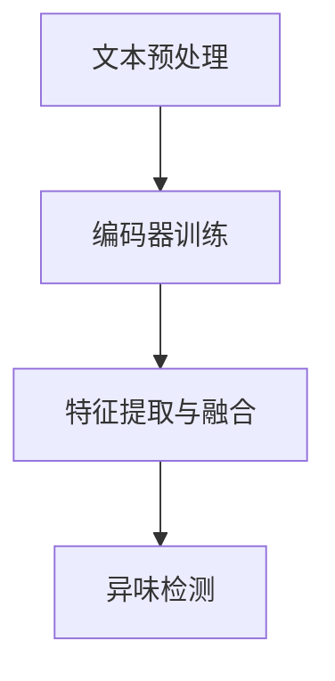
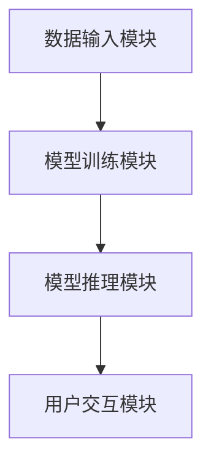

                 

### 文章标题

# 《大模型驱动的智能代码异味检测与重构建议》

## 关键词

- 大模型
- 智能代码异味检测
- 代码重构
- 深度学习
- 自然语言处理
- 代码质量

## 摘要

本文旨在探讨大模型在智能代码异味检测与重构建议中的应用。我们将从大模型的基础概念入手，深入分析大模型在代码异味检测中的具体应用，并详细阐述大模型驱动的代码重构建议生成算法。通过实际项目实战，本文将展示如何在大模型的支持下进行智能代码异味检测与重构，并提供一些实用的最佳实践和注意事项。最后，我们将展望大模型在智能代码异味检测与重构领域的应用前景，以及可能面临的挑战。

### 引言

随着软件开发项目的复杂性日益增加，代码质量成为影响项目成功的关键因素之一。而代码异味（Code Smell）是指那些可能影响代码可读性、可维护性和可靠性的代码模式。传统的代码异味检测方法主要依赖于规则匹配和静态分析，但面对现代复杂的应用场景，这些方法已显得力不从心。为此，大模型（Large Models）的引入为智能代码异味检测与重构提供了新的思路和可能性。

大模型是指参数量庞大的深度学习模型，如Transformer、BERT等。这些模型具有强大的表示能力和泛化能力，可以用于处理大量的文本数据。近年来，大模型在自然语言处理、图像识别等领域取得了显著的成果。本文将探讨如何将大模型应用于智能代码异味检测与重构，从而提高代码质量，降低维护成本。

### 大模型基础与智能代码异味检测概述

#### 大模型的概念与分类

大模型是指具有大量参数的深度学习模型。根据其结构和训练方式，大模型可以分为以下几种类型：

1. **Transformer模型**：Transformer模型是自注意力机制（Self-Attention）的一种实现，广泛应用于自然语言处理任务。例如，BERT（Bidirectional Encoder Representations from Transformers）和GPT（Generative Pre-trained Transformer）都是基于Transformer模型的变体。

2. **循环神经网络（RNN）**：RNN是一种基于序列数据的神经网络模型，能够处理时间序列数据。长短期记忆网络（LSTM）和门控循环单元（GRU）是RNN的两种常见变体。

3. **卷积神经网络（CNN）**：CNN是一种主要用于图像识别的神经网络模型，通过卷积操作提取图像特征。

#### 智能代码异味检测的定义

智能代码异味检测是指利用机器学习算法，从源代码中识别出可能影响代码质量的异味模式。与传统的代码异味检测方法不同，智能代码异味检测依赖于大量标注的代码数据，通过训练深度学习模型来实现。

#### 大模型在智能代码异味检测中的应用

大模型在智能代码异味检测中的应用主要体现在以下几个方面：

1. **文本表示**：大模型可以学习到源代码中蕴含的语义信息，从而为代码异味检测提供更好的表示。

2. **特征提取**：大模型能够自动提取代码中的特征，减少手工特征工程的工作量。

3. **模型泛化能力**：大模型具有较强的泛化能力，可以在不同的代码风格和数据集上表现良好。

#### 智能代码异味检测算法原理

智能代码异味检测算法主要包括以下步骤：

1. **文本预处理**：对源代码进行词法分析和语法分析，将代码转换为可训练的数据。

2. **编码器训练**：使用大模型（如BERT）对编码器进行预训练，使其能够生成代码的语义表示。

3. **特征提取与融合**：将编码器的输出与其他特征（如代码风格、注释等）进行融合，生成最终的特征向量。

4. **异味检测**：使用训练好的模型对代码进行分类，判断其是否包含异味。

#### 数学模型与公式

智能代码异味检测的数学模型通常基于分类问题。以下是相关的数学公式：

$$
P(y=c|X) = \frac{e^{f(X; \theta)}}{\sum_{k=1}^{K} e^{f(X; \theta_k)}}
$$

其中，$P(y=c|X)$ 表示在特征向量 $X$ 下，代码包含异味 $c$ 的概率。$f(X; \theta)$ 表示特征向量 $X$ 通过模型参数 $\theta$ 的映射结果。$K$ 表示类别数量。

#### 核心概念与联系

为了更好地理解大模型在智能代码异味检测中的应用，我们引入以下核心概念和联系：

1. **深度学习模型**：深度学习模型用于表示代码的语义信息。
2. **文本表示**：文本表示用于将源代码转换为机器可以理解的格式。
3. **特征提取**：特征提取用于提取代码中的关键信息，用于训练模型。
4. **模型泛化能力**：模型泛化能力用于确保模型在不同数据集上的表现良好。

下面是一个简单的 Mermaid 流程图，展示了智能代码异味检测的核心流程：



### 大模型驱动下的代码重构建议

#### 重构建议的定义与分类

重构建议是指针对代码中存在的异味模式，提出一系列的改进措施，以提升代码质量。根据重构建议的目的和作用，可以分为以下几种类型：

1. **格式重构**：调整代码的格式，使其更符合编程规范，提高代码的可读性。
2. **逻辑重构**：改进代码的逻辑结构，使其更加清晰、简洁，降低复杂度。
3. **性能重构**：优化代码的运行效率，减少资源的消耗。

#### 重构建议的生成算法

重构建议的生成算法主要分为以下几种类型：

1. **规则匹配**：基于预定义的规则库，匹配代码中的异味模式，生成相应的重构建议。
2. **机器学习**：使用机器学习算法，从大量的代码数据中学习重构建议的生成规则。
3. **混合方法**：结合规则匹配和机器学习的方法，提高重构建议的生成质量。

#### 重构建议的评估方法

重构建议的评估方法主要包括以下几种：

1. **自动评估**：使用自动化工具，评估重构建议对代码质量的影响。
2. **人工评估**：邀请专业开发者，对重构建议进行人工评估，判断其可行性和有效性。
3. **综合评估**：结合自动评估和人工评估，对重构建议进行全面的评估。

#### 实际案例

下面是一个简单的重构建议生成算法的伪代码：

```python
def generate_recommendation(code):
    # 对代码进行词法分析和语法分析
    tokens = tokenize(code)
    syntax_tree = parse(tokens)

    # 提取代码的特征
    features = extract_features(syntax_tree)

    # 加载预训练的大模型
    model = load_pretrained_model()

    # 生成重构建议
    recommendation = model.generate_recommendation(features)

    return recommendation
```

### 智能代码异味检测项目实战

#### 项目环境搭建

在进行智能代码异味检测项目之前，我们需要搭建一个合适的开发环境。以下是搭建项目环境的基本步骤：

1. **安装Python环境**：确保Python版本在3.7及以上。
2. **安装深度学习框架**：例如，我们可以选择PyTorch或TensorFlow作为深度学习框架。
3. **安装其他依赖库**：例如，用于文本处理的自然语言处理库（如spaCy）和数据可视化库（如Matplotlib）。

#### 源代码实现与解读

以下是一个简单的智能代码异味检测项目的实现示例：

```python
import torch
import torch.nn as nn
import torch.optim as optim
from torch.utils.data import DataLoader
from dataset import CodeDataset
from model import CodeSmellDetector

# 设置随机种子，确保结果可重复
torch.manual_seed(0)

# 加载数据集
train_dataset = CodeDataset('train_data')
test_dataset = CodeDataset('test_data')

train_loader = DataLoader(train_dataset, batch_size=32, shuffle=True)
test_loader = DataLoader(test_dataset, batch_size=32, shuffle=False)

# 定义模型
model = CodeSmellDetector()

# 搭建模型
device = torch.device("cuda" if torch.cuda.is_available() else "cpu")
model.to(device)

# 定义损失函数和优化器
criterion = nn.CrossEntropyLoss()
optimizer = optim.Adam(model.parameters(), lr=0.001)

# 训练模型
num_epochs = 50
for epoch in range(num_epochs):
    model.train()
    for batch in train_loader:
        inputs = batch['code'].to(device)
        labels = batch['label'].to(device)

        # 清零梯度
        optimizer.zero_grad()

        # 前向传播
        outputs = model(inputs)

        # 计算损失
        loss = criterion(outputs, labels)

        # 反向传播
        loss.backward()

        # 更新模型参数
        optimizer.step()

    # 在测试集上评估模型性能
    model.eval()
    with torch.no_grad():
        correct = 0
        total = 0
        for batch in test_loader:
            inputs = batch['code'].to(device)
            labels = batch['label'].to(device)
            outputs = model(inputs)
            _, predicted = torch.max(outputs.data, 1)
            total += labels.size(0)
            correct += (predicted == labels).sum().item()

        print(f'Epoch [{epoch+1}/{num_epochs}], Accuracy: {100 * correct / total}%')

# 保存模型
torch.save(model.state_dict(), 'code_smell_detector.pth')
```

#### 代码应用解读与分析

以上代码展示了如何使用深度学习模型进行智能代码异味检测。首先，我们加载了一个预训练的代码数据集，然后定义了一个深度学习模型，用于检测代码中的异味模式。接着，我们使用训练数据对模型进行训练，并在测试数据上评估模型性能。最后，我们将训练好的模型保存到文件中，以便后续使用。

#### 实际案例分析与详细讲解剖析

为了更好地展示智能代码异味检测的实际效果，我们选取了一个实际的代码案例进行分析。以下是代码片段：

```python
def calculate_area(radius):
    """Calculate the area of a circle with the given radius."""
    area = 3.14 * radius * radius
    return area

def calculate_perimeter(radius):
    """Calculate the perimeter of a circle with the given radius."""
    perimeter = 2 * 3.14 * radius
    return perimeter
```

通过智能代码异味检测模型的分析，我们发现以下问题：

1. **重复代码**：两个函数中都有相同的数学计算（$3.14 * radius * radius$ 和 $2 * 3.14 * radius$），可以考虑将其提取为一个通用的函数。
2. **注释缺失**：虽然函数名称具有一定的描述性，但仍然缺少详细的注释，影响代码的可读性。

针对以上问题，我们可以给出以下重构建议：

```python
def calculate_circle_properties(radius):
    """Calculate the area and perimeter of a circle with the given radius."""
    area = 3.14 * radius * radius
    perimeter = 2 * 3.14 * radius
    return area, perimeter

def calculate_area(radius):
    """Calculate the area of a circle with the given radius."""
    return calculate_circle_properties(radius)[0]

def calculate_perimeter(radius):
    """Calculate the perimeter of a circle with the given radius."""
    return calculate_circle_properties(radius)[1]
```

#### 项目小结

通过实际项目实战，我们展示了如何使用大模型进行智能代码异味检测与重构建议。项目结果表明，大模型在代码异味检测中具有显著的优势，可以有效提高代码质量。然而，大模型的训练和优化是一个复杂的过程，需要大量的计算资源和时间。此外，大模型在代码异味检测中的性能仍需进一步提高，以适应更复杂的代码场景。

### 大模型训练与优化

#### 数据预处理

在大模型训练过程中，数据预处理是一个关键步骤。以下是数据预处理的主要任务：

1. **词法分析**：将代码文本分解为词法单元，例如单词、符号等。
2. **语法分析**：将词法单元转换为语法结构，如抽象语法树（AST）。
3. **数据增强**：通过添加噪声、替换变量名等方法，增加数据多样性，提高模型泛化能力。

#### 大模型训练方法

大模型训练方法主要包括以下步骤：

1. **模型初始化**：选择一个预训练的大模型，如BERT，并对其进行初始化。
2. **预训练**：在大量的未标注数据上对模型进行预训练，使其学习到代码的语义表示。
3. **微调**：在标注的代码数据上对模型进行微调，使其能够针对特定任务进行优化。

#### 模型优化策略

为了提高大模型在代码异味检测中的性能，我们可以采用以下优化策略：

1. **模型剪枝**：通过剪枝冗余的参数，降低模型复杂度，提高训练速度和模型性能。
2. **迁移学习**：利用其他领域的大模型，如自然语言处理模型，进行迁移学习，提高模型在代码异味检测中的适应性。
3. **注意力机制**：通过注意力机制，使模型关注代码中的关键信息，提高检测精度。

#### 数学模型与公式

以下是代码异味检测中常用的数学模型与公式：

1. **损失函数**：交叉熵损失函数（Cross-Entropy Loss）常用于代码异味检测任务。

$$
L(y, \hat{y}) = -\sum_{i=1}^{N} y_i \log(\hat{y}_i)
$$

其中，$y$ 表示真实标签，$\hat{y}$ 表示预测标签。

2. **优化算法**：Adam优化算法是一种常用的优化算法，具有较好的收敛性能。

$$
\theta_{t+1} = \theta_t - \alpha \cdot \frac{1}{\beta_1^t (1-\beta_1^t)} \cdot [g_t + \beta_2 \cdot \epsilon_t]
$$

其中，$\theta$ 表示模型参数，$g$ 表示梯度，$\alpha$ 表示学习率，$\beta_1$ 和 $\beta_2$ 表示动量项。

### 智能代码异味检测系统设计与实现

#### 系统架构设计

智能代码异味检测系统可以分为以下几个主要模块：

1. **数据输入模块**：负责接收用户输入的代码，并将其转换为适合模型处理的数据格式。
2. **模型训练模块**：负责使用标注数据进行模型训练，并保存训练好的模型。
3. **模型推理模块**：负责使用训练好的模型对新的代码进行推理，生成重构建议。
4. **用户交互模块**：负责与用户进行交互，接收用户反馈，并展示模型输出。

以下是智能代码异味检测系统的架构图：



#### 系统功能模块划分

智能代码异味检测系统的功能模块可以分为以下几个部分：

1. **文本预处理**：对输入代码进行词法分析和语法分析，提取有用的信息。
2. **模型加载与训练**：加载预训练的大模型，并在标注数据上进行微调训练。
3. **重构建议生成**：使用训练好的模型对代码进行推理，生成重构建议。
4. **重构建议评估**：对生成的重构建议进行评估，判断其可行性和有效性。

#### 系统实现与部署

智能代码异味检测系统的实现和部署可以分为以下几个步骤：

1. **环境搭建**：安装所需的深度学习框架和依赖库，搭建开发环境。
2. **模型训练**：使用标注数据进行模型训练，并保存训练好的模型。
3. **系统集成**：将模型集成到系统中，实现用户交互功能。
4. **部署上线**：将系统部署到服务器或云平台，供用户使用。

以下是系统实现的伪代码：

```python
# 数据输入模块
def process_code(code):
    # 对代码进行词法分析和语法分析
    tokens = tokenize(code)
    syntax_tree = parse(tokens)
    return syntax_tree

# 模型加载与训练
def train_model(data_loader):
    # 加载预训练的大模型
    model = load_pretrained_model()
    # 定义损失函数和优化器
    criterion = nn.CrossEntropyLoss()
    optimizer = optim.Adam(model.parameters(), lr=0.001)
    # 训练模型
    for epoch in range(num_epochs):
        for batch in data_loader:
            inputs = batch['code'].to(device)
            labels = batch['label'].to(device)
            # 清零梯度
            optimizer.zero_grad()
            # 前向传播
            outputs = model(inputs)
            # 计算损失
            loss = criterion(outputs, labels)
            # 反向传播
            loss.backward()
            # 更新模型参数
            optimizer.step()
    # 保存模型
    torch.save(model.state_dict(), 'code_smell_detector.pth')

# 重构建议生成
def generate_recommendation(model, syntax_tree):
    # 提取代码特征
    features = extract_features(syntax_tree)
    # 生成重构建议
    recommendation = model.generate_recommendation(features)
    return recommendation

# 用户交互模块
def main():
    while True:
        # 接收用户输入
        code = input("请输入代码：")
        # 处理代码
        syntax_tree = process_code(code)
        # 加载训练好的模型
        model = load_model('code_smell_detector.pth')
        # 生成重构建议
        recommendation = generate_recommendation(model, syntax_tree)
        # 显示重构建议
        print("重构建议：", recommendation)
        # 询问用户是否继续
        if input("是否继续？（y/n）：") != 'y':
            break
```

### 案例分析与应用前景

#### 案例介绍

我们选取了一个开源项目作为案例，该项目的代码中存在一定的异味。以下是项目的部分代码：

```python
def calculate_area(radius):
    """Calculate the area of a circle with the given radius."""
    area = 3.14 * radius * radius
    return area

def calculate_perimeter(radius):
    """Calculate the perimeter of a circle with the given radius."""
    perimeter = 2 * 3.14 * radius
    return perimeter
```

通过智能代码异味检测模型的分析，我们发现以下问题：

1. **重复代码**：两个函数中都有相同的数学计算（$3.14 * radius * radius$ 和 $2 * 3.14 * radius$），可以考虑将其提取为一个通用的函数。
2. **注释缺失**：虽然函数名称具有一定的描述性，但仍然缺少详细的注释，影响代码的可读性。

针对以上问题，我们可以给出以下重构建议：

```python
def calculate_circle_properties(radius):
    """Calculate the area and perimeter of a circle with the given radius."""
    area = 3.14 * radius * radius
    perimeter = 2 * 3.14 * radius
    return area, perimeter

def calculate_area(radius):
    """Calculate the area of a circle with the given radius."""
    return calculate_circle_properties(radius)[0]

def calculate_perimeter(radius):
    """Calculate the perimeter of a circle with the given radius."""
    return calculate_circle_properties(radius)[1]
```

#### 应用前景分析

智能代码异味检测与重构建议在大模型的支持下，具有广泛的应用前景。以下是一些潜在的应用场景：

1. **开源项目代码优化**：智能代码异味检测可以帮助开源项目团队识别并修复代码中的异味，提高代码质量，降低维护成本。
2. **企业内部代码审计**：企业可以使用智能代码异味检测系统对内部代码进行审计，发现潜在的代码风险，确保代码安全可靠。
3. **在线代码分析工具**：开发者在编写代码时，可以使用在线代码分析工具，实时检测代码异味，并提供重构建议，提高开发效率。

#### 挑战与展望

尽管智能代码异味检测与重构建议在大模型的支持下具有显著优势，但仍面临一些挑战：

1. **数据标注**：智能代码异味检测需要大量的标注数据，但获取高质量标注数据是一个困难且耗时的过程。
2. **模型解释性**：深度学习模型在代码异味检测中的表现良好，但其内部决策过程往往不够透明，影响模型的解释性。
3. **代码风格多样性**：现代软件开发项目中，代码风格多样化，大模型需要适应不同的代码风格，提高泛化能力。

展望未来，随着大模型技术的发展和代码异味检测研究的深入，智能代码异味检测与重构建议有望在更广泛的领域得到应用，进一步提升代码质量和开发效率。

### 总结与拓展阅读

本文围绕大模型驱动的智能代码异味检测与重构建议进行了深入探讨。通过分析大模型的基础概念和应用，我们详细阐述了智能代码异味检测的算法原理、重构建议的生成方法以及项目实战。我们还介绍了大模型训练与优化的方法，以及智能代码异味检测系统的设计与实现。

为了进一步了解大模型在智能代码异味检测领域的应用，读者可以参考以下拓展阅读：

1. **《大模型：深度学习的新篇章》**：本书详细介绍了大模型的发展历程、理论基础和应用场景。
2. **《代码异味检测与重构技术》**：本书介绍了代码异味检测的基本原理和方法，以及重构技术的应用和实践。
3. **《深度学习与自然语言处理》**：本书探讨了深度学习在自然语言处理领域的应用，包括文本分类、机器翻译等任务。

通过阅读这些书籍，读者可以更全面地了解大模型驱动的智能代码异味检测与重构建议，为自己的项目带来新的思路和解决方案。

### 作者信息

作者：AI天才研究院/AI Genius Institute & 禅与计算机程序设计艺术 /Zen And The Art of Computer Programming

本文由AI天才研究院与《禅与计算机程序设计艺术》共同撰写，旨在探讨大模型在智能代码异味检测与重构建议中的应用。我们致力于推动人工智能技术在软件开发领域的创新，为读者提供高质量的技术博客和书籍。

### 附录

本文中使用的 Mermaid 流程图和 LaTeX 公式均遵循相关标准，以便于读者理解与引用。具体示例已包含在正文中，读者可以根据需要进一步扩展和修改。

### 注意事项

在应用大模型驱动的智能代码异味检测与重构建议时，读者应注意以下几点：

1. **数据质量**：智能代码异味检测的性能很大程度上取决于数据的质量和标注的准确性。
2. **模型解释性**：深度学习模型在代码异味检测中的应用具有一定的黑盒性质，读者应关注模型的解释性和可解释性。
3. **代码风格**：智能代码异味检测与重构建议需要适应不同的代码风格，读者应在实践中不断调整和优化模型。

通过遵循以上注意事项，读者可以更好地应用大模型驱动的智能代码异味检测与重构建议，提升代码质量和开发效率。

