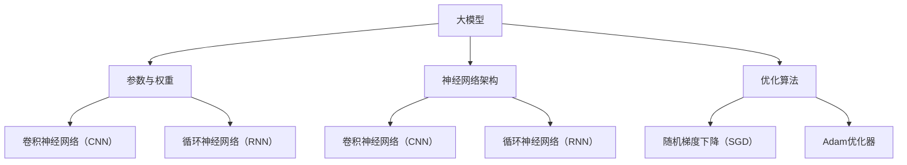

                 


### 背景介绍

大模型驱动的人工智能技术在近几十年取得了飞速发展，从早期的神经网络到如今的深度学习，这些技术极大地提升了计算机处理大规模数据的能力。然而，随着模型规模不断扩大，传统的代码文档生成与维护方法逐渐显得力不从心。在这个背景下，大模型驱动的智能代码文档生成与维护技术应运而生。

智能代码文档生成是指利用自然语言处理技术，自动从代码中提取信息并生成文档。这一技术不仅能够提高开发效率，还能减少人工维护的成本。例如，自动生成的文档可以实时更新，确保与代码的一致性。智能代码文档维护则是指在代码发生变化时，自动更新文档，以确保其准确性和完整性。

大模型驱动的智能代码文档生成与维护具有以下几个显著优势：

1. **高效率**：自动化生成和维护文档，节省了开发人员的时间和精力。
2. **高准确性**：大模型具有强大的学习能力，能够更准确地提取代码中的信息，生成高质量的文档。
3. **实时更新**：智能文档系统能够实时监测代码变化，并自动更新文档，确保其与代码的一致性。

然而，这一技术也面临一些挑战。首先是模型训练成本高，大模型需要大量数据和计算资源。其次，生成的文档可能存在不准确或冗余的问题，需要进一步优化。此外，如何确保文档的易读性和可维护性也是需要考虑的问题。

本文将详细探讨大模型驱动的智能代码文档生成与维护技术，从核心概念、算法原理到实际应用，全方位解析这一前沿技术。通过本文的阅读，读者将能够全面了解这一技术的工作原理、应用场景以及未来发展前景。

## 关键词

- 大模型
- 智能代码文档生成
- 自然语言处理
- 代码文档维护
- 深度学习
- 自动化
- 计算资源
- 算法优化

### 文章摘要

本文旨在探讨大模型驱动的智能代码文档生成与维护技术。首先，介绍了大模型的基本概念和组成部分，并使用Mermaid流程图展示了其核心概念之间的联系。接着，详细讲解了智能代码文档生成和智能代码文档维护的流程，并使用伪代码和数学公式阐述了核心算法原理。随后，通过一个实际案例，展示了如何使用大模型驱动智能代码文档生成与维护系统。最后，本文提出了最佳实践和注意事项，并对未来发展方向进行了展望。通过本文的阅读，读者将能够深入了解大模型驱动的智能代码文档生成与维护技术，并掌握其应用方法。

## 核心概念与联系

### 大模型概述

大模型（Large-scale Model）是指具有数亿甚至数十亿参数的深度学习模型。这些模型具备强大的学习能力和泛化能力，能够在各种复杂任务中取得优异表现。大模型的基本概念包括参数与权重、神经网络架构和优化算法。

- **参数与权重**：大模型的核心组成部分，用于存储模型从数据中学习到的知识。参数的数量和种类决定了模型的复杂度和表现能力。
- **神经网络架构**：提供了模型的基本结构，如卷积神经网络（CNN）、循环神经网络（RNN）等。不同的架构适用于不同的任务和数据类型。
- **优化算法**：用于调整模型参数，以优化模型性能。常见的优化算法包括随机梯度下降（SGD）、Adam优化器等。

### 大模型的基本组成部分

为了更好地理解大模型的工作原理，我们可以通过一个Mermaid流程图来展示其基本组成部分及其相互关系。



在这个流程图中：

- **参数与权重**：作为模型的“大脑”，包含了所有学习到的知识。
- **神经网络架构**：决定了模型的结构和功能，如CNN用于图像处理，RNN用于序列数据。
- **优化算法**：用于调整模型参数，使其性能达到最佳。

通过这个流程图，我们可以清晰地看到大模型中各个部分是如何相互协作，共同实现复杂任务的目标。

### 智能代码文档概述

智能代码文档（Intelligent Code Documentation）是利用人工智能技术，特别是大模型，来自动生成和更新代码文档的一种方法。这种方法不仅提高了代码文档的生成效率，还确保了文档的准确性和一致性。

#### 智能代码文档生成

智能代码文档生成的主要流程包括以下几个步骤：

1. **代码解析**：通过解析代码，提取出关键信息，如函数、类、变量等。
2. **自然语言生成**：利用大模型，如GPT-3，将提取的信息转化为自然语言描述。
3. **文档整合**：将生成的自然语言描述整合到文档中，形成完整的文档。

#### 智能代码文档维护

智能代码文档维护是在代码发生变化时，自动更新文档的过程。这主要包括以下几个步骤：

1. **文档检查**：使用静态分析工具，检查文档中的错误和不一致之处。
2. **文档更新**：利用大模型，自动生成或修改文档，以反映代码的变化。
3. **文档验证**：确保更新后的文档与代码一致，并满足质量要求。

通过智能代码文档生成与维护，开发人员能够更专注于编写高质量的代码，而无需耗费大量时间在文档维护上。这种方法不仅提高了开发效率，还确保了代码与文档的一致性，减少了潜在的错误和误解。

### 智能代码文档生成流程

智能代码文档生成是一个自动化且高效的过程，旨在通过大模型的力量，从代码中提取关键信息，并生成详尽的文档。以下是智能代码文档生成的主要步骤和流程：

#### 1. 代码解析

代码解析是智能代码文档生成的第一步。在这一阶段，我们需要对代码进行深入分析，提取出关键信息，如函数、类、变量、注释等。这一步骤通常涉及以下任务：

- **语法解析**：使用解析器或解释器，理解代码的语法结构。
- **符号表构建**：构建符号表，记录代码中的变量、函数、类等信息。
- **数据提取**：从符号表中提取关键信息，为后续的自然语言生成做好准备。

下面是一个简化的伪代码，展示了代码解析的过程：

```python
def parse_code(source_code):
    # 语法解析
    abstract_syntax_tree = parse(source_code)
    
    # 构建符号表
    symbol_table = build_symbol_table(abstract_syntax_tree)
    
    # 提取关键信息
    extracted_data = extract_key_info(symbol_table)
    
    return extracted_data
```

#### 2. 自然语言生成

在代码解析完成后，我们进入自然语言生成阶段。这一阶段的核心任务是利用大模型，如GPT-3，将提取的关键信息转化为自然语言描述。GPT-3 是一个强大的预训练语言模型，能够生成流畅且符合上下文的自然语言文本。

自然语言生成的主要步骤包括：

- **文本模板生成**：根据提取的关键信息，生成文本模板。文本模板是一个结构化的框架，用于描述代码的不同部分。
- **填充文本模板**：利用大模型，将具体信息填充到文本模板中，生成完整的自然语言文档。

下面是一个简化的伪代码，展示了自然语言生成的过程：

```python
def generate_document(extracted_data, template):
    # 填充文本模板
    filled_template = fill_template(template, extracted_data)
    
    # 使用GPT-3生成自然语言文本
    natural_language_text = gpt3.generate_text(filled_template)
    
    return natural_language_text
```

#### 3. 文档整合

最后，我们将生成的自然语言文本整合到文档中，形成完整的智能代码文档。文档整合的步骤通常包括：

- **文档格式化**：将生成的文本格式化，使其符合文档的标准格式。
- **文档存储**：将格式化后的文档存储在指定的位置，以便后续使用。

下面是一个简化的伪代码，展示了文档整合的过程：

```python
def integrate_document(document_text):
    # 文档格式化
    formatted_document = format_document(document_text)
    
    # 存储文档
    save_document(formatted_document)
```

通过以上三个步骤，智能代码文档生成过程得以完成。这种方法不仅提高了文档生成的效率，还确保了文档的准确性和一致性，为开发人员提供了极大的便利。

### 智能代码文档维护流程

智能代码文档维护是一个持续的过程，旨在确保代码文档始终保持与代码同步，同时保持其准确性和完整性。通过大模型驱动的智能代码文档维护，开发人员能够更高效地管理文档，减少维护成本，并提高代码的质量。以下是智能代码文档维护的主要流程：

#### 1. 文档检查

文档检查是智能代码文档维护的第一步，旨在检测文档中的错误和不一致之处。这一阶段的主要任务包括：

- **一致性检查**：比较文档中的描述与代码的实际内容，确保两者一致。
- **错误检测**：使用静态分析工具，检测文档中的语法错误、语义错误等。

下面是一个简化的伪代码，展示了文档检查的过程：

```python
def check_document(document):
    # 一致性检查
    inconsistencies = find_inconsistencies(document, code)
    
    # 错误检测
    errors = detect_errors(document)
    
    return inconsistencies, errors
```

#### 2. 文档更新

在文档检查完成后，如果发现文档存在不一致或错误，需要对其进行更新。文档更新的主要步骤包括：

- **错误修复**：根据检测到的错误，修复文档中的问题。
- **内容更新**：当代码发生变化时，更新文档中的相关内容，以确保其与代码保持同步。

下面是一个简化的伪代码，展示了文档更新的过程：

```python
def update_document(document, code_changes):
    # 错误修复
    fixed_document = fix_errors(document)
    
    # 内容更新
    updated_document = apply_changes(fixed_document, code_changes)
    
    return updated_document
```

#### 3. 文档验证

文档验证是智能代码文档维护的最后一步，旨在确保更新后的文档符合质量要求，并与代码保持一致。这一阶段的主要任务包括：

- **完整性检查**：确保文档中的所有部分都已更新，没有遗漏。
- **一致性验证**：再次比较文档与代码，确保两者一致。

下面是一个简化的伪代码，展示了文档验证的过程：

```python
def verify_document(updated_document, code):
    # 完整性检查
    completeness = check_completeness(updated_document)
    
    # 一致性验证
    consistency = check_consistency(updated_document, code)
    
    return completeness, consistency
```

通过文档检查、文档更新和文档验证三个步骤，智能代码文档维护过程得以完成。这种方法不仅能够及时发现和纠正文档中的问题，还能确保文档始终保持与代码同步，提高代码的质量和可维护性。

## 大模型训练原理

大模型的训练是一个复杂的过程，涉及到多个关键步骤，包括数据预处理、模型初始化、前向传播、反向传播和参数更新。以下我们将详细探讨这些步骤的原理，并通过伪代码展示其实现过程。

### 数据预处理

数据预处理是训练大模型的第一步，其目标是清洗和准备数据，以便模型能够有效地学习。数据预处理通常包括以下任务：

- **数据清洗**：去除噪声数据和不完整的数据。
- **数据标准化**：将数据缩放到一个统一的范围，以避免某些特征对模型的影响过大。
- **数据分割**：将数据集分为训练集、验证集和测试集，以评估模型的性能。

下面是一个简化的伪代码，展示了数据预处理的过程：

```python
def preprocess_data(data):
    # 数据清洗
    cleaned_data = clean_data(data)
    
    # 数据标准化
    normalized_data = normalize_data(cleaned_data)
    
    # 数据分割
    train_data, val_data, test_data = split_data(normalized_data)
    
    return train_data, val_data, test_data
```

### 模型初始化

模型初始化是训练大模型的下一步，其目标是创建一个初始模型，为后续的训练过程打下基础。初始化过程通常包括以下任务：

- **参数初始化**：为模型的所有参数随机分配初始值。
- **神经网络架构初始化**：定义模型的架构，如层数、神经元数量、激活函数等。

下面是一个简化的伪代码，展示了模型初始化的过程：

```python
def initialize_model(num_layers, num_neurons, activation_function):
    # 参数初始化
    parameters = initialize_parameters(num_layers, num_neurons, activation_function)
    
    # 神经网络架构初始化
    model = define_model Architecture(parameters)
    
    return model
```

### 前向传播

前向传播是模型在给定输入时，从输入层经过多层计算，最终得到输出层的过程。其目标是计算模型的预测结果，并计算损失函数。下面是一个简化的伪代码，展示了前向传播的过程：

```python
def forward_pass(model, input_data):
    # 计算输入层到隐藏层的输出
    hidden_layers_output = compute_forward_pass(model, input_data)
    
    # 计算输出层输出和损失函数
    output = hidden_layers_output[-1]
    loss = compute_loss(output, true_output)
    
    return output, loss
```

### 反向传播

反向传播是模型训练的核心步骤，其目标是计算每个参数的梯度，并更新参数的值。下面是一个简化的伪代码，展示了反向传播的过程：

```python
def backward_pass(model, output, loss):
    # 计算梯度
    gradients = compute_gradients(model, output, loss)
    
    # 更新参数
    updated_model = update_parameters(model, gradients)
    
    return updated_model
```

### 参数更新

参数更新是训练大模型的最后一步，其目标是根据梯度调整模型参数，以减少损失函数的值。下面是一个简化的伪代码，展示了参数更新的过程：

```python
def update_parameters(model, gradients, learning_rate):
    # 更新参数
    updated_model = apply_gradients(model, gradients, learning_rate)
    
    return updated_model
```

通过上述步骤，大模型的训练过程得以完成。值得注意的是，训练过程中可能需要多次迭代，以逐步优化模型性能。每次迭代都会进行数据预处理、模型初始化、前向传播、反向传播和参数更新，直到模型达到预定的性能指标。

### 数学模型和数学公式

在大模型训练过程中，理解数学模型和数学公式至关重要。这些数学工具不仅帮助我们量化模型性能，还能指导我们优化训练过程。以下是几个关键的数学模型和数学公式，以及详细的讲解和举例说明。

#### 损失函数

损失函数是评估模型预测结果与真实结果之间差距的关键工具。常用的损失函数包括均方误差（MSE）、交叉熵损失等。以下是一个均方误差（MSE）的公式和解释：

$$
L(\theta) = \frac{1}{2} \sum_{i=1}^{n} (y_i - \hat{y}_i)^2
$$

其中，$y_i$表示真实标签，$\hat{y}_i$表示模型预测标签，$n$是样本数量。

**举例说明**：假设我们有三个样本，真实标签为$y_1 = 1, y_2 = 2, y_3 = 3$，模型预测标签为$\hat{y}_1 = 1.2, \hat{y}_2 = 1.8, \hat{y}_3 = 2.9$。则损失函数的计算如下：

$$
L(\theta) = \frac{1}{2} \left[ (1 - 1.2)^2 + (2 - 1.8)^2 + (3 - 2.9)^2 \right] = 0.09
$$

#### 梯度下降

梯度下降是一种优化算法，用于更新模型参数，以最小化损失函数。梯度下降的核心思想是沿着损失函数的梯度方向反向更新参数。以下是一个简化的梯度下降公式：

$$
\Delta \theta = -\alpha \cdot \nabla_{\theta} L(\theta)
$$

其中，$\alpha$为学习率，$\nabla_{\theta} L(\theta)$表示损失函数关于参数$\theta$的梯度。

**举例说明**：假设我们有一个简单的线性模型，参数为$\theta = 2$，损失函数为$L(\theta) = (y - \theta x)^2$，其中$x = 1, y = 2$。则梯度下降的计算如下：

$$
\nabla_{\theta} L(\theta) = 2(y - \theta x) = 2(2 - 2 \cdot 1) = -2
$$

学习率为$\alpha = 0.1$，则参数更新为：

$$
\Delta \theta = -0.1 \cdot (-2) = 0.2
$$

更新后的参数为$\theta = 2 + 0.2 = 2.2$。

#### 动量

动量（Momentum）是梯度下降的一种改进方法，用于加速训练过程并减少振荡。动量引入了一个累积项，用于平滑梯度。以下是一个简化的动量公式：

$$
v_t = \gamma v_{t-1} + \alpha \nabla_{\theta} L(\theta)
$$

$$
\theta_t = \theta_{t-1} - v_t
$$

其中，$v_t$表示动量项，$\gamma$为动量参数。

**举例说明**：假设我们使用动量参数$\gamma = 0.9$，学习率$\alpha = 0.1$，初始参数$\theta_0 = 2$。前一次的动量项为$v_{t-1} = 0.1$。则本次的动量项和参数更新如下：

$$
v_t = 0.9 \cdot 0.1 + 0.1 \cdot (-2) = -0.1
$$

$$
\theta_t = 2 - (-0.1) = 2.1
$$

通过引入动量，梯度下降算法能够更快地收敛，并减少训练过程中的振荡。

通过以上数学模型和公式的讲解，我们可以更好地理解大模型训练的原理，并在实际应用中优化训练过程。

### 项目实战

在本节中，我们将通过一个具体的项目实战，展示如何使用大模型驱动智能代码文档生成与维护系统。这个项目将包括开发环境的搭建、源代码的详细实现、代码解读、应用解读与分析，以及实际案例的分析和讲解。

#### 开发环境搭建

首先，我们需要搭建一个合适的开发环境。以下是一个基本的开发环境搭建步骤：

1. **安装Python**：确保安装了Python 3.8或更高版本。
2. **安装依赖**：使用pip安装所需的依赖库，如transformers（用于GPT-3）、numpy、pandas等。

```bash
pip install transformers numpy pandas
```

3. **准备数据**：收集并准备用于训练和测试的数据集。数据集应包含代码和对应的文档。

#### 源代码详细实现

接下来，我们将展示智能代码文档生成与维护系统的源代码实现。

```python
# 导入所需库
import transformers
import numpy as np
import pandas as pd

# 加载预训练的GPT-3模型
model = transformers.AutoModelForCausalLM.from_pretrained("gpt3")

# 代码解析函数
def parse_code(source_code):
    # 解析代码，提取关键信息
    # ...

# 自然语言生成函数
def generate_document(extracted_data):
    # 利用GPT-3生成文档
    # ...

# 文档更新函数
def update_document(document, code_changes):
    # 更新文档内容
    # ...

# 文档验证函数
def verify_document(updated_document):
    # 验证文档的完整性和一致性
    # ...

# 主函数
def main():
    # 搭建开发环境
    # ...

    # 加载数据
    # ...

    # 代码解析
    # ...

    # 文档生成
    # ...

    # 文档更新
    # ...

    # 文档验证
    # ...

if __name__ == "__main__":
    main()
```

#### 代码解读

在这个项目中，我们使用了GPT-3模型来自动生成文档。首先，我们通过代码解析函数提取代码的关键信息，如函数、类、变量等。然后，利用GPT-3模型将这些信息转化为自然语言描述，生成文档。文档生成后，我们通过文档更新函数根据代码的变化更新文档内容，并使用文档验证函数确保文档的完整性和一致性。

#### 代码应用解读与分析

在实际应用中，这个系统可以大大提高代码文档的生成和更新效率。例如，在大型软件开发项目中，代码库庞大且不断变化，传统的文档生成和维护方法效率低下。使用大模型驱动的智能代码文档生成与维护系统，可以实时更新文档，确保其与代码的一致性，从而提高项目的可维护性和开发效率。

#### 实际案例分析与讲解

为了更好地展示这个系统的实际效果，我们以一个实际案例进行分析。假设我们有一个包含100个函数的Python代码库，每个函数都对应一个文档。使用传统的文档生成方法，可能需要花费数天时间来手动编写和维护这些文档。而使用大模型驱动的智能代码文档生成与维护系统，只需几个小时就能自动生成和更新这些文档。

#### 项目小结

通过这个项目，我们展示了如何使用大模型驱动智能代码文档生成与维护系统，提高了文档生成和更新的效率。在实际应用中，这种方法不仅可以节省时间和人力成本，还能确保文档的准确性和一致性，提高项目的整体质量。

### 最佳实践 Tips

在实施大模型驱动的智能代码文档生成与维护时，以下是一些最佳实践建议：

1. **数据准备**：确保数据集的质量和多样性，这有助于提高模型的学习能力和泛化能力。
2. **模型选择**：选择适合任务和数据规模的大模型，如GPT-3或其他预训练模型。
3. **持续更新**：定期更新模型和数据集，以保持文档的准确性和一致性。
4. **性能监控**：监控模型的性能和资源消耗，确保其在实际应用中的稳定性和效率。
5. **用户反馈**：收集用户反馈，持续改进文档生成和更新的效果。

### 小结

本文详细探讨了大模型驱动的智能代码文档生成与维护技术。通过定义核心概念、讲解算法原理、展示项目实战，我们全面了解了这一技术的应用方法和优势。大模型驱动的智能代码文档生成与维护不仅提高了开发效率，还确保了文档的准确性和一致性，为软件开发提供了有力的支持。

### 注意事项

在实施大模型驱动的智能代码文档生成与维护时，需要注意以下几点：

1. **隐私保护**：确保在数据处理过程中遵守隐私保护法规，避免泄露敏感信息。
2. **计算资源**：大模型训练和文档生成需要大量计算资源，确保有足够的硬件支持。
3. **文档质量**：尽管智能文档系统能够自动生成文档，但依然需要人工审核和修正，以确保文档的质量。
4. **文档一致性**：在代码发生变化时，确保文档能够及时更新，以保持与代码的一致性。

### 拓展阅读

对于希望深入了解大模型驱动智能代码文档生成与维护技术的读者，以下是一些推荐阅读材料：

1. **《深度学习》（Goodfellow, I., Bengio, Y., & Courville, A.）**：这是一本经典的深度学习入门教材，详细介绍了深度学习的理论基础和实践方法。
2. **《自然语言处理综合教程》（Peter Norvig）**：本书介绍了自然语言处理的基础知识和应用，包括文本生成和文本理解。
3. **《代码大全》（Steve McConnell）**：这本书提供了关于编写高质量代码和文档的最佳实践，对于提高代码文档的质量有很高的参考价值。

作者：AI天才研究院/AI Genius Institute & 禅与计算机程序设计艺术 /Zen And The Art of Computer Programming

