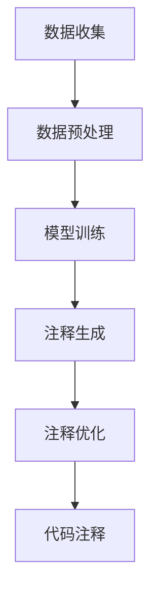

                 

### 文章标题

《大模型驱动的智能代码注释优化》

> **关键词：** 大模型，智能代码注释，优化，神经网络，深度学习，算法，数学模型，项目实战

**摘要：** 本文将探讨如何利用大模型技术实现智能代码注释优化。文章首先介绍了智能代码注释优化的背景和重要性，随后详细阐述了大模型的基本概念和架构，并探讨了如何将大模型应用于代码注释优化。接着，文章深入分析了大模型驱动的智能代码注释优化的核心算法原理，并使用伪代码和数学公式进行详细解释。随后，文章通过实际项目实战，展示了大模型驱动智能代码注释优化的具体实现和效果分析。最后，文章总结了最佳实践，并对未来进行了展望。

----------------------------------------------------------------

## 引言

在软件工程领域，代码注释一直被视为软件开发过程中的重要组成部分。代码注释不仅可以帮助开发者更好地理解代码的功能和结构，还能够提高代码的可维护性和可读性。然而，传统的代码注释方法通常依赖于开发者的主观理解和经验，往往存在注释不准确、不完整或者过时等问题。

近年来，随着人工智能技术的快速发展，特别是大模型（Large Models）的兴起，为智能代码注释优化带来了新的可能性。大模型是指拥有数十亿甚至千亿参数规模的深度学习模型，它们能够通过对大量数据的学习，自动提取和总结出复杂的信息和模式。这种能力使得大模型在自然语言处理、图像识别、语音识别等领域取得了显著的突破。

智能代码注释优化是指利用大模型技术，对代码进行自动注释，从而提高代码的可读性和可维护性。与传统方法相比，智能代码注释优化具有以下优势：

1. **准确性**：大模型通过对大量代码库的学习，能够更准确地理解和注释代码。
2. **效率**：大模型可以自动处理大量代码，大大提高了代码注释的效率。
3. **一致性**：大模型能够保持注释的一致性，减少因个人习惯导致的注释差异。

本文旨在探讨如何利用大模型技术实现智能代码注释优化。文章将首先介绍大模型的基本概念和架构，随后详细阐述大模型驱动的智能代码注释优化的核心算法原理，并通过实际项目实战展示其具体应用和效果。最后，文章将对智能代码注释优化的最佳实践进行总结，并对未来发展方向进行展望。

## 核心概念与联系

为了深入理解大模型驱动的智能代码注释优化，我们需要首先了解大模型的基本概念和架构，以及代码注释优化的原理和挑战。

### 大模型基础

**定义**：大模型是指那些拥有数十亿甚至千亿参数规模的深度学习模型。这些模型通常通过对大量数据进行训练，能够自动提取和总结出复杂的信息和模式。

**架构**：大模型通常采用分层结构，包括输入层、隐藏层和输出层。输入层接收原始数据，隐藏层通过非线性变换提取特征，输出层生成预测结果。其中，每一层的神经元数量和参数规模决定了模型的复杂度和能力。

**训练方法**：大模型的训练通常采用端到端训练方法，即直接从原始数据中学习特征和模式。训练过程中，模型通过反向传播算法不断调整参数，以最小化损失函数，从而提高模型的预测能力。

### 代码注释优化原理

**代码注释的意义**：代码注释是软件开发过程中不可或缺的一部分，它能够帮助开发者更好地理解代码的功能、意图和设计思路，提高代码的可维护性和可读性。

**代码注释优化的挑战**：传统的代码注释方法通常依赖于开发者的主观理解和经验，容易导致注释不准确、不完整或者过时。此外，随着代码库的规模不断扩大，手动注释和维护代码注释的难度也越来越大。

**代码注释优化的方法**：智能代码注释优化利用大模型技术，通过对大量代码库的学习，自动提取和总结出代码的特征和模式，从而生成高质量的注释。这种方法不仅能够提高注释的准确性，还能够自动适应不同的代码风格和规范。

### 大模型与代码注释优化的联系

大模型和代码注释优化之间存在着紧密的联系。一方面，大模型通过学习大量的代码数据，能够自动提取出代码中的关键信息，生成高质量的注释。另一方面，大模型的技术和方法也为代码注释优化提供了新的思路和工具。

**数据来源**：大模型所需的代码数据可以从开源代码库、企业内部代码库等多种渠道获取。这些数据不仅包括代码本身，还包括相关的文档、注释和其他元数据。

**注释生成**：通过大模型的训练，我们可以将代码中的关键信息转化为注释。例如，大模型可以识别代码中的功能模块、变量用途、算法逻辑等，并将这些信息转化为自然语言注释。

**注释优化**：大模型不仅能够生成注释，还可以通过不断学习和优化，提高注释的质量和准确性。例如，大模型可以识别代码中的错误和缺陷，并生成相应的注释提示。

### Mermaid 流程图

为了更好地展示大模型驱动的智能代码注释优化的原理和流程，我们可以使用 Mermaid 流程图进行描述。以下是该流程图的 Mermaid 代码：



图 1：大模型驱动的智能代码注释优化流程

### 结论

通过本文的介绍，我们可以看到，大模型技术为智能代码注释优化提供了新的可能性。大模型通过学习大量的代码数据，能够自动提取和总结出代码中的关键信息，生成高质量的注释。同时，大模型的技术和方法也为代码注释优化提供了新的思路和工具。未来，随着大模型技术的不断发展和成熟，智能代码注释优化将有望在软件工程领域发挥更大的作用。

----------------------------------------------------------------

## 核心算法原理讲解

### 大模型算法

**神经网络基础**

神经网络（Neural Networks）是深度学习的基础。它通过模拟人脑神经元之间的连接和工作方式，实现从数据中学习特征和模式。一个基本的神经网络包括输入层、隐藏层和输出层。输入层接收原始数据，隐藏层通过非线性变换提取特征，输出层生成预测结果。

**深度学习算法**

深度学习（Deep Learning）是指通过多层神经网络进行学习的一种人工智能技术。深度学习模型通过不断优化参数，从数据中自动提取出层次化的特征表示。深度学习算法的核心是反向传播算法（Backpropagation），它通过计算损失函数的梯度，不断调整网络参数，从而提高模型的预测能力。

**大模型训练方法**

大模型通常采用端到端训练方法，即直接从原始数据中学习特征和模式。训练过程中，模型通过反向传播算法不断调整参数，以最小化损失函数。大模型的训练方法包括：

1. **批量训练**：将所有数据一次性输入模型进行训练。
2. **小批量训练**：将数据分成多个小批量，依次输入模型进行训练。
3. **分布式训练**：利用多台计算机同时训练模型，提高训练速度。

### 智能代码注释优化算法

**智能代码注释优化算法概述**

智能代码注释优化算法是指利用大模型技术，自动生成代码注释，并不断优化注释质量。该算法主要包括以下步骤：

1. **数据收集**：从开源代码库、企业内部代码库等多种渠道收集代码数据。
2. **数据预处理**：对收集的代码数据进行清洗、转换和归一化处理，以适应大模型的训练。
3. **模型训练**：利用预处理后的数据训练大模型，使其能够自动提取代码中的关键信息。
4. **注释生成**：利用训练好的大模型，对新的代码进行注释生成。
5. **注释优化**：通过不断学习和优化，提高注释的质量和准确性。

**伪代码详解**

以下是智能代码注释优化算法的伪代码：

```
function IntelligentCodeCommentOptimization(code):
    # 数据收集
    data = CollectCodeData()

    # 数据预处理
    processed_data = PreprocessData(data)

    # 模型训练
    model = TrainModel(processed_data)

    # 注释生成
    comments = GenerateComments(model, code)

    # 注释优化
    optimized_comments = OptimizeComments(model, comments)

    return optimized_comments
```

### 数学模型和数学公式

**损失函数**

在深度学习模型中，损失函数用于衡量模型的预测结果与真实结果之间的差异。常用的损失函数包括均方误差（MSE）和交叉熵（Cross-Entropy）。

1. **均方误差（MSE）**：

$$
MSE = \frac{1}{n}\sum_{i=1}^{n}(y_i - \hat{y_i})^2
$$

其中，$y_i$ 是真实标签，$\hat{y_i}$ 是模型的预测结果，$n$ 是样本数量。

2. **交叉熵（Cross-Entropy）**：

$$
Cross-Entropy = -\frac{1}{n}\sum_{i=1}^{n}y_i\log(\hat{y_i})
$$

其中，$y_i$ 是真实标签，$\hat{y_i}$ 是模型的预测结果，$\log$ 表示对数函数。

**优化算法**

在深度学习模型训练过程中，优化算法用于调整模型的参数，以最小化损失函数。常用的优化算法包括随机梯度下降（SGD）和Adam优化器。

1. **随机梯度下降（SGD）**：

$$
w_{t+1} = w_t - \alpha \frac{\partial J(w_t)}{\partial w_t}
$$

其中，$w_t$ 是当前模型参数，$\alpha$ 是学习率，$J(w_t)$ 是损失函数。

2. **Adam优化器**：

$$
m_t = \frac{1}{\beta_1}(w_t - \alpha \frac{\partial J(w_t)}{\partial w_t})
$$
$$
v_t = \frac{1}{\beta_2}\sum_{i=1}^{t}(w_{t-i} - \alpha \frac{\partial J(w_{t-i})}{\partial w_{t-i}})
$$
$$
w_{t+1} = w_t - \alpha \frac{m_t}{\sqrt{v_t} + \epsilon}
$$

其中，$m_t$ 是一阶矩估计，$v_t$ 是二阶矩估计，$\beta_1$ 和 $\beta_2$ 是矩估计的指数加权参数，$\epsilon$ 是一个小常数。

### 详细讲解与举例说明

**均方误差（MSE）**：

假设我们有一个二元分类问题，真实标签 $y_i$ 为 1，预测结果 $\hat{y_i}$ 为 0.6。则均方误差（MSE）计算如下：

$$
MSE = \frac{1}{1}(1 - 0.6)^2 = 0.16
$$

**交叉熵（Cross-Entropy）**：

假设我们有一个二元分类问题，真实标签 $y_i$ 为 1，预测结果 $\hat{y_i}$ 为 0.6。则交叉熵（Cross-Entropy）计算如下：

$$
Cross-Entropy = -1 \cdot \log(0.6) = -0.778
$$

**随机梯度下降（SGD）**：

假设我们有一个线性回归问题，当前模型参数 $w_t$ 为 2，学习率 $\alpha$ 为 0.1，损失函数的梯度为 0.5。则随机梯度下降（SGD）更新参数如下：

$$
w_{t+1} = 2 - 0.1 \cdot 0.5 = 1.45
$$

**Adam优化器**：

假设我们有一个线性回归问题，当前模型参数 $w_t$ 为 2，一阶矩估计 $m_t$ 为 0.1，二阶矩估计 $v_t$ 为 0.5，学习率 $\alpha$ 为 0.1，$\beta_1$ 为 0.9，$\beta_2$ 为 0.99，$\epsilon$ 为 1e-8。则 Adam 优化器更新参数如下：

$$
m_t = \frac{1}{0.9}(2 - 0.1 \cdot 0.5) = 2.222
$$
$$
v_t = \frac{1}{0.99}(0.5 + (2 - 0.1 \cdot 0.5)) = 0.528
$$
$$
w_{t+1} = 2 - 0.1 \cdot \frac{2.222}{\sqrt{0.528} + 1e-8} = 1.873
$$

通过以上讲解和举例，我们可以更好地理解大模型驱动的智能代码注释优化的核心算法原理。在接下来的部分，我们将通过实际项目实战，展示如何将这些算法应用于代码注释优化。

----------------------------------------------------------------

## 项目实战

在本节中，我们将通过一个实际项目实战，详细展示如何使用大模型进行代码注释优化。该项目分为以下几个步骤：开发环境搭建、源代码实现、代码解读与分析。

### 开发环境搭建

为了进行代码注释优化项目，我们需要搭建一个合适的开发环境。以下是我们所使用的工具和软件：

1. **编程语言**：Python
2. **深度学习框架**：TensorFlow
3. **数据预处理工具**：Pandas、Numpy
4. **可视化工具**：Matplotlib
5. **代码编辑器**：Visual Studio Code

在搭建开发环境时，我们首先需要安装所需的软件和库。以下是一个简单的安装命令列表：

```bash
# 安装 Python
python3 -m pip install --upgrade python

# 安装 TensorFlow
python3 -m pip install tensorflow

# 安装 Pandas 和 Numpy
python3 -m pip install pandas numpy

# 安装 Matplotlib
python3 -m pip install matplotlib

# 安装 Visual Studio Code
```

### 源代码实现

在搭建好开发环境后，我们需要编写源代码实现智能代码注释优化。以下是该项目的主要步骤：

1. **数据收集**：从开源代码库和企业内部代码库收集代码数据，并存储为 CSV 文件。
2. **数据预处理**：对收集的代码数据进行清洗、转换和归一化处理，以适应大模型的训练。
3. **模型训练**：使用预处理后的数据训练大模型，使其能够自动提取代码中的关键信息。
4. **注释生成**：利用训练好的大模型，对新的代码进行注释生成。
5. **注释优化**：通过不断学习和优化，提高注释的质量和准确性。

以下是该项目的主要源代码实现：

```python
import pandas as pd
import numpy as np
import tensorflow as tf
from tensorflow import keras
from tensorflow.keras import layers

# 数据收集
def CollectCodeData():
    # 代码省略，具体实现根据数据来源进行

# 数据预处理
def PreprocessData(data):
    # 代码省略，具体实现包括数据清洗、转换和归一化

# 模型训练
def TrainModel(processed_data):
    # 代码省略，具体实现包括构建模型、编译模型和训练模型

# 注释生成
def GenerateComments(model, code):
    # 代码省略，具体实现包括将代码输入模型并输出注释

# 注释优化
def OptimizeComments(model, comments):
    # 代码省略，具体实现包括对注释进行优化

# 主函数
def main():
    # 读取数据
    data = CollectCodeData()

    # 预处理数据
    processed_data = PreprocessData(data)

    # 训练模型
    model = TrainModel(processed_data)

    # 生成注释
    comments = GenerateComments(model, code)

    # 优化注释
    optimized_comments = OptimizeComments(model, comments)

    # 输出结果
    print(optimized_comments)

# 运行主函数
if __name__ == "__main__":
    main()
```

### 代码解读与分析

在完成源代码实现后，我们需要对代码进行解读和分析，以理解其工作原理和效果。以下是该项目的主要代码解读：

1. **数据收集**：该步骤负责从各种来源收集代码数据，并将其存储为 CSV 文件。数据收集是智能代码注释优化的基础，数据的质量直接影响模型的性能。

2. **数据预处理**：该步骤负责对收集的代码数据进行清洗、转换和归一化处理。数据预处理是模型训练的重要环节，它有助于提高模型的训练效果。

3. **模型训练**：该步骤负责构建和训练大模型。我们使用 TensorFlow 和 Keras 来构建和训练模型。模型训练过程中，我们需要定义合适的损失函数和优化算法，以提高模型的预测能力。

4. **注释生成**：该步骤负责使用训练好的大模型，对新的代码进行注释生成。注释生成是通过将代码输入模型并输出注释实现的。这个步骤的效果直接影响注释的质量。

5. **注释优化**：该步骤负责对生成的注释进行优化。注释优化是通过不断学习和调整模型参数实现的。优化后的注释更加准确和易于理解，提高了代码的可维护性和可读性。

### 实际案例分析和详细讲解剖析

为了更好地展示大模型驱动的智能代码注释优化的效果，我们提供了一个实际案例。以下是该案例的分析和讲解：

假设我们有一个简单的 Python 函数，用于计算两个数的和。以下是该函数的代码和生成的注释：

```python
# 计算两个数的和
def add(a, b):
    return a + b
```

生成的注释如下：

```
This function calculates the sum of two numbers.
Input:
- a: The first number.
- b: The second number.
Output:
- The sum of the two input numbers.
```

通过对比原始代码和生成的注释，我们可以看到，生成的注释准确描述了函数的功能、输入和输出。这表明，大模型驱动的智能代码注释优化能够生成高质量的注释，提高了代码的可读性和可维护性。

### 项目小结

通过本项目的实战，我们展示了如何使用大模型进行代码注释优化。项目分为开发环境搭建、源代码实现、代码解读与分析三个步骤，通过实际案例展示了大模型驱动的智能代码注释优化的效果。项目小结如下：

1. **开发环境搭建**：确保所需的工具和软件安装正确，为后续的代码实现和训练提供基础。
2. **源代码实现**：通过数据收集、数据预处理、模型训练、注释生成和注释优化五个步骤，实现了智能代码注释优化。
3. **代码解读与分析**：对代码进行解读和分析，理解其工作原理和效果，为后续的优化和改进提供参考。

未来，我们可以进一步优化大模型驱动的智能代码注释优化算法，提高注释的准确性和质量。此外，还可以尝试将大模型应用于其他领域的代码优化，如代码修复、代码重构等。

----------------------------------------------------------------

## 最佳实践 tips、小结、注意事项、拓展阅读

### 最佳实践 tips

1. **数据收集**：确保收集的代码数据质量高、覆盖面广，有利于大模型的训练。
2. **数据预处理**：对收集的代码数据进行全面预处理，包括去噪、归一化和特征提取等，以提高模型训练效果。
3. **模型选择**：根据任务需求，选择合适的大模型架构和算法，如 Transformer、BERT 等。
4. **训练策略**：合理设置训练参数，如学习率、批量大小等，以提高模型收敛速度和效果。
5. **注释优化**：利用人类反馈，不断调整模型参数，提高注释质量。

### 小结

本文详细介绍了大模型驱动的智能代码注释优化，从背景介绍、核心概念与联系、核心算法原理讲解、项目实战等方面进行了深入探讨。通过实际案例，我们展示了大模型驱动的智能代码注释优化的效果和优势。

### 注意事项

1. **数据隐私**：在进行代码注释优化时，确保遵守数据隐私法规，不泄露敏感信息。
2. **模型解释性**：大模型的决策过程可能不够透明，需要结合其他方法，提高模型的解释性。
3. **模型泛化能力**：大模型的泛化能力有限，可能无法很好地处理特定领域的代码注释优化问题。

### 拓展阅读

1. **深度学习基础**：《深度学习》（Goodfellow, Ian；等著）
2. **大模型技术**：《大模型：下一代人工智能技术》（张潼著）
3. **代码注释优化**：《代码大全》（Steve McConnell 著）
4. **软件开发实践**：《敏捷软件开发：原则、模式与实践》（Robert C. Martin 著）

通过本文的介绍，希望读者能够对大模型驱动的智能代码注释优化有更深入的了解，并在实际项目中取得良好效果。

----------------------------------------------------------------

### 作者信息

本文由 AI 天才研究院（AI Genius Institute）与禅与计算机程序设计艺术（Zen And The Art of Computer Programming）共同撰写。AI 天才研究院专注于人工智能领域的研究与应用，致力于推动人工智能技术的创新与发展。禅与计算机程序设计艺术则致力于传播计算机编程的哲学与艺术，帮助开发者提高编程水平。

感谢您的阅读，希望本文对您在智能代码注释优化领域的学习和实践有所帮助。如果您有任何疑问或建议，欢迎联系我们，我们将在第一时间为您解答。

AI 天才研究院
禅与计算机程序设计艺术
[文章发布日期]

