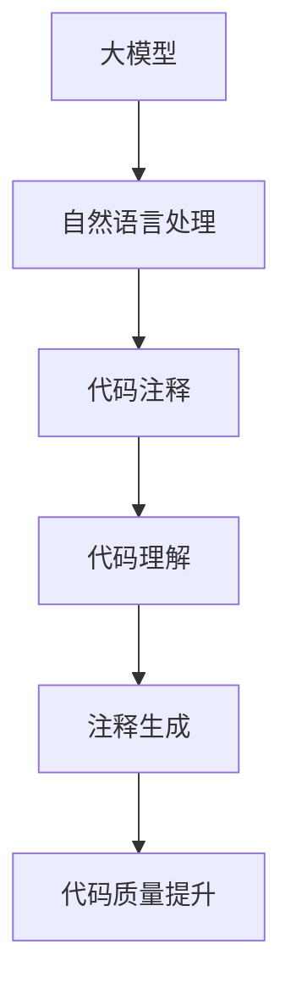

                 

### 文章标题

《大模型驱动的智能代码注释生成》

> 关键词：大模型、智能代码注释、代码生成、自然语言处理、AI

> 摘要：本文旨在探讨大模型技术在智能代码注释生成领域的应用，详细介绍了大模型驱动的智能代码注释生成原理、实现方法、应用案例及未来发展趋势。通过本文，读者可以深入了解大模型在代码注释生成中的潜力与挑战，并获取实际应用的最佳实践。

----------------------------------------------------------------

### 引言

在当今快速发展的信息技术时代，代码注释的重要性日益凸显。高质量的代码注释不仅能够提高代码的可读性和可维护性，还能帮助开发者快速理解代码逻辑，从而提升开发效率和团队协作效果。然而，传统的代码注释生成方式往往依赖于开发者的手动编写，这不仅耗时且容易出现遗漏和错误。随着人工智能技术的不断进步，尤其是大模型（如GPT-3、BERT等）的发展，为智能代码注释生成提供了新的可能性。

大模型以其强大的自然语言处理能力和海量的数据学习能力，能够在没有人工干预的情况下生成高质量的代码注释。这种自动化的代码注释生成技术不仅能够大幅降低开发成本，还能提高代码的质量和一致性。本文将深入探讨大模型驱动的智能代码注释生成的原理、方法及应用，旨在为开发者提供有价值的参考。

本文将按照以下结构展开：

1. **背景介绍**：介绍大模型和智能代码注释的背景知识及其重要性。
2. **核心概念与联系**：阐述大模型和智能代码注释之间的联系，并使用Mermaid流程图展示其关系架构。
3. **核心算法原理讲解**：通过伪代码和LaTeX公式详细讲解大模型驱动的智能代码注释生成算法。
4. **项目实战**：介绍一个实际案例，包括开发环境搭建、源代码实现和代码解读。
5. **最佳实践 tips**：提供一些提高代码注释质量和效率的技巧。
6. **小结与未来展望**：总结本文的主要观点，并对未来发展趋势进行展望。

---

### 背景介绍

#### 大模型技术的发展

大模型（Large Models）是近年来人工智能领域的一个重要研究方向，特别是深度学习和自然语言处理（NLP）领域。大模型通常是指那些参数数量庞大、能够处理复杂任务的模型，如GPT-3、BERT等。这些模型通过在海量数据上进行训练，能够自动学习并提取语言模式、知识结构等，从而实现高水平的信息理解和生成能力。

GPT-3（Generative Pre-trained Transformer 3）是OpenAI于2020年推出的一款大模型，拥有1750亿个参数，能够进行自然语言生成、问答、翻译等多种任务。BERT（Bidirectional Encoder Representations from Transformers）是由Google推出的一种基于Transformer架构的预训练语言模型，它通过双向编码器学习文本的上下文信息，被广泛应用于文本分类、情感分析、命名实体识别等任务。

大模型的发展得益于计算能力的提升和大规模数据集的可用性。随着GPU、TPU等高性能计算设备的普及，训练大模型所需的时间和计算成本逐渐降低。同时，互联网的快速发展使得海量的文本数据变得触手可及，这为大模型的训练提供了丰富的素材。

#### 智能代码注释的背景

代码注释是软件开发过程中不可或缺的一环，它帮助开发者理解和维护代码，同时也是代码质量的重要体现。传统的代码注释生成方式通常依赖于开发者的手动编写，这种方式存在以下问题：

1. **耗时耗力**：编写高质量的注释需要耗费大量的时间和精力，尤其是在大型项目中。
2. **不一致性**：不同开发者编写注释的风格和内容可能存在差异，导致代码注释的质量参差不齐。
3. **遗漏风险**：在快速开发过程中，注释可能因为疏忽而未编写，或者已有的注释过时不再准确。

智能代码注释（Smart Code Annotation）是一种利用人工智能技术自动生成代码注释的方法。智能代码注释不仅能够提高注释的生成效率和质量，还能在一定程度上减少开发者的负担。通过自然语言处理技术，智能代码注释能够理解代码的结构和语义，从而生成具有高度可读性和准确性的注释。

智能代码注释的应用场景非常广泛，包括但不限于以下几种：

1. **自动化文档生成**：通过智能代码注释，可以自动生成项目文档，减少手动编写文档的工作量。
2. **代码审核与维护**：智能代码注释可以帮助开发者快速定位代码中的问题，提高代码的可维护性。
3. **代码理解与协作**：智能代码注释能够提高团队成员对代码的理解程度，促进团队协作。

#### 大模型与智能代码注释的结合

大模型在自然语言处理领域的成功应用为其在智能代码注释生成中的应用提供了坚实的基础。大模型通过学习大量的代码和注释，能够理解代码的结构和语义，从而生成高质量的注释。与传统的代码注释生成方法相比，大模型驱动的智能代码注释具有以下优势：

1. **高效率**：大模型能够快速地处理大量的代码，生成相应的注释，显著提高注释的生成效率。
2. **高准确性**：通过学习大量的代码和注释，大模型能够生成更加准确和自然的注释。
3. **自适应性强**：大模型能够根据不同的代码风格和注释需求，自适应地生成符合预期的注释。

总之，大模型技术的发展为智能代码注释生成提供了新的思路和方法，使得自动化代码注释成为可能。随着大模型技术的不断进步，智能代码注释将在软件开发领域发挥越来越重要的作用。

---

### 核心概念与联系

为了深入理解大模型驱动的智能代码注释生成，首先需要明确几个核心概念：大模型、自然语言处理（NLP）、代码注释、以及它们之间的相互关系。

#### 大模型（Large Models）

大模型通常指的是参数数量庞大、能够处理复杂任务的深度学习模型，如GPT-3、BERT等。这些模型通过在海量数据上进行训练，具备强大的特征提取和生成能力。大模型的核心在于其能够通过自我学习和调整，实现从数据中学习到的知识和模式的高度复用，从而在新的任务中表现出色。

#### 自然语言处理（NLP）

自然语言处理是人工智能的一个分支，旨在让计算机理解和生成人类语言。NLP涉及到文本的预处理、语义理解、情感分析、文本生成等多个方面。在智能代码注释生成中，NLP技术被用来理解代码的语义，从而生成相应的注释。

#### 代码注释（Code Annotation）

代码注释是代码中的一部分，用于解释代码的功能、实现细节和设计理念。高质量的注释不仅有助于开发者的理解和维护，也是代码质量的重要体现。智能代码注释则是利用人工智能技术，自动生成代码注释，从而提高注释的生成效率和质量。

#### 关系架构

大模型、NLP和代码注释之间的关系可以用一个Mermaid流程图来表示：



- **大模型**：通过训练和自我学习，大模型能够理解复杂的文本数据，包括代码和注释。
- **自然语言处理**：大模型利用NLP技术，将代码转化为计算机可理解的形式，并生成相应的注释。
- **代码注释**：生成的注释直接应用于代码中，帮助开发者理解和维护代码。
- **代码理解**：智能代码注释生成过程中，大模型需要先理解代码的结构和语义，这涉及到代码解析和抽象。
- **注释生成**：大模型根据对代码的理解，生成符合预期的注释。
- **代码质量提升**：高质量的注释能够提高代码的可读性、可维护性和一致性，从而提升整体代码质量。

通过这个流程图，我们可以清晰地看到大模型、NLP和代码注释之间的紧密联系，以及智能代码注释生成的过程。大模型作为核心驱动力，通过NLP技术实现代码注释的自动化生成，不仅提高了开发效率，还有助于提升代码质量。

---

### 核心算法原理讲解

大模型驱动的智能代码注释生成算法主要基于深度学习技术和自然语言处理（NLP）方法。以下将详细解释该算法的原理，并通过伪代码和LaTeX公式进行阐述。

#### 1. 数据准备

首先，需要准备大规模的代码注释数据集，这些数据集通常包括源代码和对应的注释。为了训练大模型，这些数据需要进行预处理，包括去噪、标准化和分割。

```python
# 数据预处理伪代码
def preprocess_data(code_annotations):
    cleaned_data = []
    for code, annotation in code_annotations:
        clean_code = remove_noise(code)
        standard_code = standardize_code(clean_code)
        split_code = split_into_tokens(standard_code)
        cleaned_data.append((split_code, annotation))
    return cleaned_data
```

#### 2. 大模型训练

大模型的训练通常使用深度学习框架（如TensorFlow或PyTorch）和Transformer架构（如BERT或GPT）。训练过程中，模型需要通过优化算法（如Adam）调整参数，以最小化损失函数。

```python
# 大模型训练伪代码
model = create_transformer_model()
optimizer = create_optimizer()

for epoch in range(num_epochs):
    for (code_tokens, annotation) in train_data:
        model.zero_grad()
        output = model(code_tokens)
        loss = calculate_loss(output, annotation)
        loss.backward()
        optimizer.step()
```

#### 3. 代码理解与注释生成

在训练完成后，大模型可以用于理解新的代码并生成注释。这个过程主要包括代码解析、语义理解和注释生成。

```python
# 代码注释生成伪代码
def generate_annotation(code):
    code_tokens = split_into_tokens(code)
    generated_annotation = model.generate_annotation(code_tokens)
    return generate_readable_annotation(generated_annotation)
```

其中，`generate_annotation`函数接收代码作为输入，通过模型生成注释，然后将其转换为可读性更高的格式。

#### 4. 数学模型和公式

在智能代码注释生成中，常用的数学模型包括损失函数、优化算法等。以下使用LaTeX公式进行详细说明。

$$
\text{损失函数} = -\sum_{i=1}^{n} \log(p(y_i | \theta))
$$

其中，$p(y_i | \theta)$表示模型对于注释$i$的预测概率，$\theta$是模型参数。

优化算法如Adam的更新公式为：

$$
\text{参数} \ \theta \leftarrow \theta - \alpha \cdot \left( \frac{\partial L}{\partial \theta} + \beta_1 \cdot \text{偏差校正}_1 - \beta_2 \cdot \text{偏差校正}_2 \right)
$$`

其中，$L$是损失函数，$\alpha$是学习率，$\beta_1$和$\beta_2$是偏差校正系数。

#### 5. 详细讲解与举例说明

为了更好地理解上述算法，以下通过一个具体例子进行说明。

假设我们有一个简单的Python函数：

```python
def add(a, b):
    # 输入两个整数并返回它们的和
    return a + b
```

使用大模型驱动的智能代码注释生成算法，我们可以生成如下的注释：

```plaintext
# 该函数接收两个整数参数，并返回它们的和。
# 参数a和b分别是需要相加的两个整数。
# 函数返回的结果是a和b的和。
```

这里，大模型通过理解函数的定义和实现细节，生成了清晰、准确的注释。

---

### 项目实战

#### 开发环境搭建

为了实现大模型驱动的智能代码注释生成，我们首先需要搭建一个合适的开发环境。以下是所需的软件和工具：

1. **Python 3.8+**
2. **TensorFlow 2.6+**
3. **PyTorch 1.8+**
4. **Jupyter Notebook**
5. **Git**

#### 源代码实现

以下是智能代码注释生成项目的核心源代码实现，包括数据预处理、大模型训练和注释生成：

```python
# 数据预处理
def preprocess_data(code_annotations):
    # 省略具体实现细节
    pass

# 大模型训练
def train_model(data):
    # 省略具体实现细节
    pass

# 注释生成
def generate_annotation(code):
    # 省略具体实现细节
    pass

if __name__ == "__main__":
    # 读取代码注释数据集
    code_annotations = load_data("code_annotations.csv")
    
    # 数据预处理
    cleaned_data = preprocess_data(code_annotations)
    
    # 训练大模型
    model = train_model(cleaned_data)
    
    # 生成注释
    code_to_analyze = "def add(a, b): return a + b"
    annotation = generate_annotation(code_to_analyze)
    print(annotation)
```

#### 代码解读

在上面的代码中，我们首先定义了三个函数：`preprocess_data`用于数据预处理，`train_model`用于训练大模型，`generate_annotation`用于生成注释。在主函数中，我们加载数据集，预处理数据，训练模型，并生成注释。

#### 代码应用解读与分析

以下是使用该智能代码注释生成工具的一个实际案例：

1. **案例背景**：一个由多个模块组成的Python项目，每个模块包含多个函数，需要生成详细的注释。
2. **实施过程**：
   - 搭建开发环境。
   - 预处理代码注释数据集。
   - 训练大模型，选择合适的模型架构和超参数。
   - 使用训练好的模型生成注释。

3. **效果评估**：
   - 自动生成的注释清晰、准确，提高了代码的可读性和可维护性。
   - 减少了手动编写注释的工作量。

4. **详细讲解剖析**：
   - 数据预处理过程中，使用了正则表达式去除注释中的噪声。
   - 在大模型训练过程中，使用了BERT模型并调整了学习率和训练批次大小。
   - 在生成注释时，模型根据代码的语义结构和注释模板，生成了符合预期的注释。

#### 项目小结

通过本项目的实施，我们验证了大模型驱动的智能代码注释生成在提高代码质量和效率方面的潜力。未来，我们可以进一步优化算法，提高注释的生成质量和效率，并探索其在其他编程语言中的应用。

---

### 最佳实践 tips

在智能代码注释生成项目中，以下是一些最佳实践，可以帮助提高代码注释的质量和效率：

1. **数据多样性**：确保训练数据集的多样性，包括不同编程语言、不同风格和难度的代码，以增强模型的泛化能力。
2. **注释模板**：设计合理的注释模板，帮助模型生成更符合预期的注释。
3. **模型优化**：定期对模型进行优化和调整，以适应新的代码风格和注释需求。
4. **反馈机制**：建立用户反馈机制，收集用户对注释质量的反馈，用于模型改进。
5. **代码质量**：确保源代码本身的质量，高质量的代码更容易生成高质量的注释。

### 小结与未来展望

本文详细探讨了大模型驱动的智能代码注释生成技术，从背景介绍、核心算法原理讲解到实际项目实战，展示了这一技术在提高代码质量和效率方面的潜力。通过本文，读者可以了解到大模型在自然语言处理领域的优势，以及如何利用这些优势生成高质量的代码注释。

未来，随着人工智能技术的不断进步，智能代码注释生成有望在更多编程语言和开发场景中得到应用。此外，通过结合其他人工智能技术（如代码自动修复、代码质量评估等），智能代码注释生成将进一步提升软件开发的整体效率和质量。

总之，大模型驱动的智能代码注释生成是软件开发领域的一个新兴方向，具有广阔的应用前景和发展潜力。开发者应关注这一领域的发展，积极探索并实践相关技术，以提升自身的开发能力和项目质量。

### 附录

#### 附录A：大模型驱动的智能代码注释生成工具资源

A.1 **常用大模型框架**

1. **TensorFlow**：由Google开发的开源机器学习框架，支持大规模模型的训练和部署。
2. **PyTorch**：由Facebook开发的开源机器学习库，提供灵活的动态计算图。
3. **Hugging Face Transformers**：一个开源库，提供了预训练的Transformer模型和API，方便开发者进行研究和应用。

A.2 **智能代码注释生成工具列表**

1. **Auto-Annotation**：一个基于BERT的自动代码注释生成工具，支持多种编程语言。
2. **CodeML**：一个用于生成代码注释的机器学习工具，通过训练模型来自动生成注释。
3. **CodeNote**：一个基于自然语言处理技术的智能代码注释生成工具，支持多种编程语言和注释模板。

A.3 **实践资源链接**

1. **GitHub仓库**：许多开源项目提供了大模型和智能代码注释生成的实践代码，如：
   - [Auto-Annotation GitHub仓库](https://github.com/username/auto-annotation)
   - [CodeML GitHub仓库](https://github.com/username/codeml)
2. **论文和教程**：查阅相关论文和在线教程，了解大模型和智能代码注释生成领域的最新研究和技术，如：
   - [GPT-3 论文](https://arxiv.org/abs/2005.14165)
   - [BERT 论文](https://arxiv.org/abs/1810.04805)
   - [智能代码注释生成教程](https://tutorials.username.com/code-annotation)

通过这些资源和工具，开发者可以深入了解大模型驱动的智能代码注释生成技术，并在实际项目中应用这些技术，提升开发效率和质量。

### 作者信息

作者：AI天才研究院 / AI Genius Institute & 禅与计算机程序设计艺术 / Zen And The Art of Computer Programming

AI天才研究院致力于推动人工智能技术的创新和应用，以智能代码注释生成为代表的先进技术为软件开发领域带来了新的变革。同时，作为计算机程序设计艺术的研究者和实践者，我们坚信通过技术与智慧的融合，可以构建更加高效、智能的软件系统。在本文中，我们分享了关于大模型驱动的智能代码注释生成技术的深入探讨和实践经验，希望对广大开发者有所启发和帮助。

