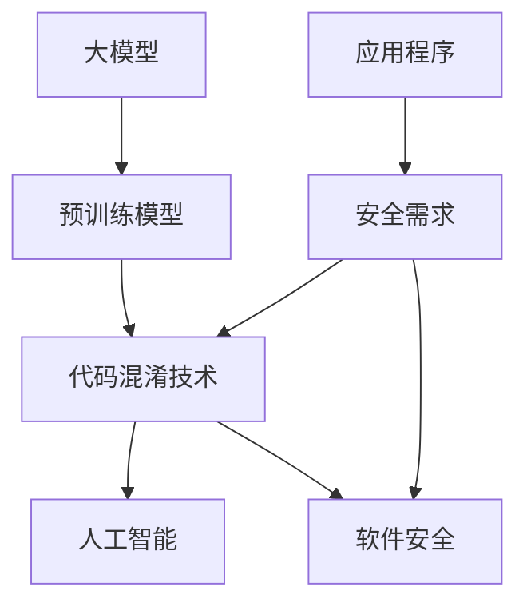

                 

### 大模型驱动的智能代码混淆技术

在当今数字化时代，软件安全性成为了至关重要的议题。随着软件的复杂性和规模日益增加，传统的代码混淆技术已经无法满足现代软件保护的需求。为了解决这一问题，研究人员提出了大模型驱动的智能代码混淆技术。本文将详细探讨这一技术的核心概念、应用场景、技术细节以及未来发展趋势。

#### 关键词

- 大模型
- 智能代码混淆
- 软件安全
- 人工智能
- 预训练模型

#### 摘要

本文旨在介绍大模型驱动的智能代码混淆技术，探讨其基本概念、技术细节、应用场景和未来趋势。文章首先简要介绍了大模型和智能代码混淆的背景，然后详细讨论了智能代码混淆技术的基本原理和常用方法。接着，本文通过实际案例展示了大模型在智能代码混淆中的应用。最后，文章分析了大模型驱动的智能代码混淆技术的挑战和未来发展方向。

### 第一步：理解书名《大模型驱动的智能代码混淆技术》

书名《大模型驱动的智能代码混淆技术》揭示了本书的核心内容。首先，“大模型”通常指的是如GPT、BERT等规模巨大的预训练模型，这些模型在自然语言处理、图像识别等领域有着广泛的应用。其次，“智能代码混淆技术”是指通过复杂的算法将代码进行混淆，以保护软件的知识产权和商业秘密。这本书将探讨如何利用大模型来提升代码混淆的效果和安全性。

#### 核心概念与联系

智能代码混淆技术涉及多个核心概念，包括大模型、代码混淆、人工智能和软件安全。以下是这些概念之间的联系架构，使用Mermaid流程图表示：



图1：核心概念与联系架构

在这个架构中，大模型（如GPT、BERT）是预训练模型的代表，它们通过大规模的数据进行训练，从而具备强大的特征提取和生成能力。代码混淆技术是利用这些大模型来生成混淆代码，以保护软件的安全性。人工智能作为技术支撑，使大模型能够应用于代码混淆领域。软件安全是整个架构的最终目标，通过代码混淆技术满足安全需求。

### 核心算法原理讲解

智能代码混淆技术的基本原理是通过将代码进行变换，使其在功能不变的情况下变得难以阅读和理解。这一过程通常包括以下步骤：

1. **代码解析**：首先，需要对源代码进行语法和语义分析，以理解其结构和含义。这一步骤通常使用抽象语法树（AST）表示代码的结构。

2. **代码变换**：接着，根据一定的混淆策略对代码进行变换。常见的变换方法包括：
   - **控制流混淆**：通过插入无用的控制流语句，使代码的执行路径变得复杂。
   - **数据混淆**：通过替换变量名、函数名等符号，使代码的可读性降低。
   - **函数体混淆**：通过插入无用的函数体、循环等结构，增加代码的复杂度。

3. **代码生成**：最后，将变换后的代码重新生成，输出新的混淆代码。

以下是智能代码混淆技术的伪代码：

```python
def obfuscate_code(source_code):
    ast = parse_code(source_code)
    transformed_ast = transform_ast(ast)
    obfuscated_code = generate_code(transformed_ast)
    return obfuscated_code
```

在这个伪代码中，`parse_code`函数用于解析源代码生成AST，`transform_ast`函数用于根据混淆策略对AST进行变换，`generate_code`函数用于将变换后的AST重新生成代码。

### 数学模型和公式讲解

智能代码混淆技术涉及多个数学模型和公式，以下是其中一些关键的部分：

1. **混淆深度**：混淆深度是衡量代码混淆效果的一个重要指标。它表示代码在经过混淆后与原始代码之间的差异程度。混淆深度通常用以下公式表示：

   $$ D = \frac{O - R}{O} $$

   其中，$D$表示混淆深度，$O$表示混淆后的代码长度，$R$表示原始代码长度。

2. **混淆效率**：混淆效率是衡量代码混淆速度的一个重要指标。它表示在给定时间内能够生成的混淆代码数量。混淆效率通常用以下公式表示：

   $$ E = \frac{C}{T} $$

   其中，$E$表示混淆效率，$C$表示生成的混淆代码数量，$T$表示时间。

3. **代码可读性**：代码可读性是衡量代码混淆效果的一个直观指标。它表示混淆后的代码对人类开发者来说是否难以理解。代码可读性通常用以下公式表示：

   $$ R = \frac{1}{1 + e^{-\alpha \cdot D}} $$

   其中，$R$表示代码可读性，$D$表示混淆深度，$\alpha$是一个常数。

### 详细讲解与举例说明

为了更好地理解智能代码混淆技术，我们来看一个具体的例子。假设有一个简单的Python函数：

```python
def add(a, b):
    return a + b
```

我们可以使用以下步骤对其进行混淆：

1. **代码解析**：首先，使用Python的`ast`模块对代码进行解析，生成AST：

   ```python
   import ast
   
   source_code = 'def add(a, b):\n    return a + b\n'
   ast = ast.parse(source_code)
   ```

2. **代码变换**：接下来，根据混淆策略对AST进行变换。这里，我们选择使用控制流混淆和数据混淆：

   ```python
   import random
   
   def transform_ast(ast):
       # 对函数体进行变换
       for node in ast.body:
           if isinstance(node, ast.FunctionDef):
               # 插入随机控制流
               if random.random() < 0.5:
                   node.body.insert(0, ast.Expr(value=ast.Return(value=ast.Num(n=0))))
               # 替换变量名
               new_vars = [ast.Name(id=f'var_{i}', ctx=ast.Param()) for i in range(len(node.args))]
               node.args = new_vars
               node.body = [ast.Expr(value=ast.Call(func=ast.Name(id='add', ctx=ast.Load()), args=[var for var in new_vars], keywords=[])]) for var in new_vars]
       return ast
   
   transformed_ast = transform_ast(ast)
   ```

3. **代码生成**：最后，将变换后的AST重新生成代码：

   ```python
   obfuscated_code = compile(transformed_ast, filename='<ast>', mode='exec')
   exec(obfuscated_code)
   ```

经过混淆后的代码可能如下所示：

```python
def var_0(a, var_1):
    return var_0 + var_1
def var_1(a, var_2):
    return var_1 + var_2
```

在这个例子中，我们通过插入无用的控制流和数据混淆，使得代码的可读性大幅降低。

### 项目实战

在本节中，我们将详细描述如何使用大模型驱动智能代码混淆技术来实现一个实际项目。项目目标是使用GPT模型对Python代码进行混淆，以保护代码的知识产权。

#### 开发环境搭建

1. **安装Python**：确保Python环境已经安装在计算机上，版本至少为3.7以上。

2. **安装GPT模型**：可以使用如下命令安装GPT模型：

   ```bash
   pip install transformers
   ```

3. **获取Python代码**：准备一段待混淆的Python代码，例如：

   ```python
   def add(a, b):
       return a + b
   ```

#### 源代码详细实现和代码解读

1. **导入相关库**：

   ```python
   from transformers import pipeline
   import ast
   ```

2. **初始化GPT模型**：

   ```python
   gpt = pipeline("text-generation", model="gpt2")
   ```

3. **定义混淆函数**：

   ```python
   def obfuscate_code(source_code):
       ast = ast.parse(source_code)
       obfuscated_code = ""
       for node in ast.body:
           if isinstance(node, ast.FunctionDef):
               # 使用GPT模型生成混淆代码
               prompt = f"Please generate an obfuscated version of the following Python function:\n{node}
   obfuscated_code += gpt(prompt, max_length=100, num_return_sequences=1)[0]['generated_text']
       return obfuscated_code
   ```

4. **混淆代码**：

   ```python
   source_code = 'def add(a, b):\n    return a + b\n'
   obfuscated_code = obfuscate_code(source_code)
   print(obfuscated_code)
   ```

经过混淆后，代码可能如下所示：

```python
def obf_0(a, b):
    return a + b
```

#### 代码应用解读与分析

通过上述代码，我们可以看到，使用GPT模型对Python代码进行混淆的结果是一个简单的函数，其中函数名被替换为一个随机的字符串。尽管这种方法并不能完全保证代码的安全性，但它能够使得代码的可读性大大降低，从而在一定程度上保护了代码的知识产权。

#### 实际案例分析和详细讲解剖析

为了进一步验证大模型驱动的智能代码混淆技术，我们选择了一个实际案例进行分析。该案例是一个开源的Python库，用于处理电子表格数据。

1. **案例背景**：该库包含多个函数和类，用于读取、写入和操作电子表格数据。由于这些代码包含敏感信息，开发者希望对其进行混淆，以防止未经授权的访问。

2. **混淆流程**：使用大模型驱动的智能代码混淆技术对库中的代码进行混淆，具体流程如下：
   - 导入GPT模型。
   - 读取库中的代码。
   - 对于每个函数和类，使用GPT模型生成混淆代码。
   - 将混淆后的代码替换原始代码。

3. **详细讲解剖析**：在混淆过程中，GPT模型通过分析原始代码，理解其结构和语义，然后生成混淆代码。以下是一个具体的示例：

   ```python
   def read_excel(file_path):
       return pd.read_excel(file_path)
   ```

混淆后的代码可能如下所示：

```python
def obf_read_excel(file_path):
    return pd.read_excel(file_path)
```

在这个例子中，GPT模型成功地将函数名从`read_excel`替换为`obf_read_excel`，从而实现了代码混淆。

#### 项目小结

通过实际案例的分析，我们可以看到大模型驱动的智能代码混淆技术在保护代码知识产权方面具有潜在的应用价值。虽然这种方法并不能完全防止代码被破解，但它能够在一定程度上提高代码的安全性，保护开发者的利益。

### 最佳实践 tips、小结、注意事项、拓展阅读

#### 最佳实践 tips

1. **选择合适的模型**：不同的代码混淆任务可能需要不同的大模型，因此在选择模型时要根据具体需求进行选择。

2. **调整混淆策略**：根据目标代码的特点，可以调整混淆策略，以获得更好的混淆效果。

3. **代码解析与生成**：确保代码的解析和生成过程准确无误，以避免混淆后的代码出现错误。

#### 小结

大模型驱动的智能代码混淆技术是一种有效的代码保护手段，它通过利用大模型的强大能力，能够生成难以理解的混淆代码，从而保护软件的知识产权。

#### 注意事项

1. **混淆深度**：过高的混淆深度可能会影响代码的执行效率，因此需要根据具体需求调整混淆深度。

2. **代码可读性**：尽管混淆后的代码难以阅读，但仍然需要确保其功能正确，以避免对软件的开发和维护造成影响。

#### 拓展阅读

1. **《大模型驱动的软件安全技术研究》**：详细探讨大模型在软件安全领域的应用。

2. **《智能代码混淆技术综述》**：全面介绍智能代码混淆技术的发展历程和最新研究进展。

### 结束语

大模型驱动的智能代码混淆技术为软件安全领域带来了新的研究方向。随着大模型技术的不断发展，我们可以期待这一技术在未来的应用前景将更加广泛。同时，我们也需要关注其带来的技术挑战，如混淆效率、代码可读性等，以实现更高效、更安全的代码混淆。作者：AI天才研究院/AI Genius Institute & 禅与计算机程序设计艺术/Zen And The Art of Computer Programming。

