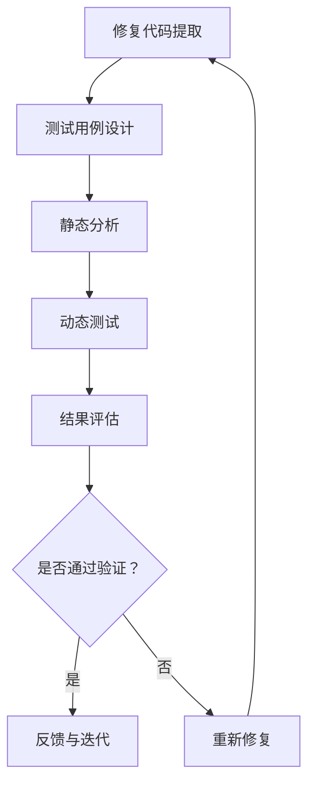
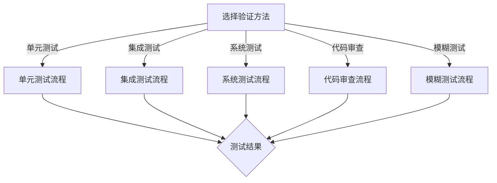
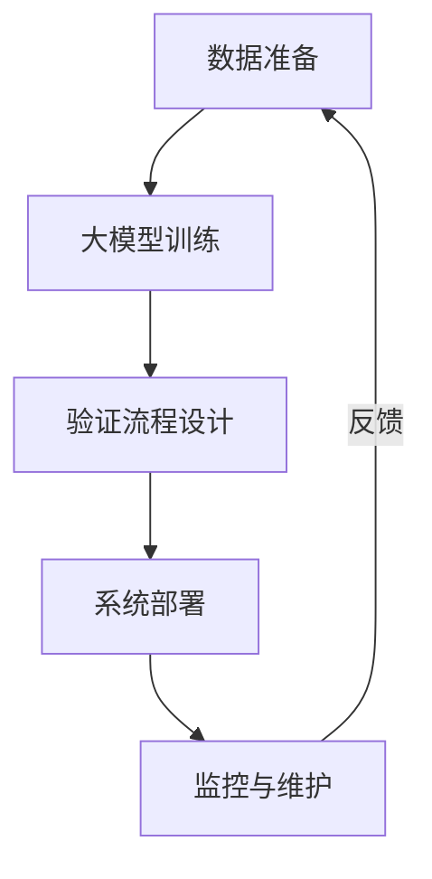

                 

### 1.1 大模型概述

大模型，是指那些拥有数十亿甚至千亿参数的深度学习模型，它们通过大量的数据进行训练，以实现强大的语义理解和生成能力。大模型的出现，标志着深度学习技术的一次革命性的飞跃。在本章节中，我们将首先介绍大模型的基本概念，然后回顾其发展历程，并详细探讨其技术特点。

#### 1.1.1 大模型的基本概念

大模型的基本概念可以从以下几个方面进行理解：

1. **参数量**：大模型通常拥有数亿甚至千亿个参数，这使得模型可以学习到更复杂的特征和模式。
2. **数据量**：训练大模型需要大量的数据，这些数据通常来自于互联网上的开放数据集、专业领域的数据库以及企业内部的私有数据。
3. **计算资源**：大模型的训练和推理需要巨大的计算资源，包括高性能的GPU和TPU等硬件设备。
4. **预训练**：大模型通常通过预训练的方式，在大量未标注的数据上进行初始训练，然后再在特定任务上进行微调。

#### 1.1.2 大模型的发展历程

大模型的发展历程可以分为以下几个阶段：

1. **1980年代**：神经网络的开端。这个时期，研究人员开始探索神经网络在模式识别和预测任务中的应用。
2. **2000年代**：神经网络复兴。随着计算资源的提升和数据集的扩大，神经网络在图像识别、自然语言处理等领域取得了显著进展。
3. **2010年代**：深度学习的兴起。深度学习模型，如AlexNet、VGGNet等，在图像识别任务中取得了超越传统方法的性能。
4. **2020年代**：大模型的崛起。GPT-3、BERT等大模型的出现，标志着深度学习技术进入了一个全新的阶段。

#### 1.1.3 大模型的技术特点

大模型的技术特点可以从以下几个方面进行描述：

1. **高参数量**：大模型拥有庞大的参数规模，这使得模型可以学习到更多细节和复杂结构。
2. **强泛化能力**：通过在大量数据上的预训练，大模型具有强大的泛化能力，可以在未见过的数据上表现良好。
3. **自动学习能力**：大模型可以自动从数据中学习到特征和模式，不需要手动设计特征工程。
4. **高效推理**：大模型通过并行计算和分布式训练，可以实现高效的推理和预测。

综上所述，大模型的基本概念、发展历程和技术特点，为我们理解大模型在智能代码漏洞修复与验证中的应用奠定了基础。在接下来的章节中，我们将进一步探讨智能代码漏洞修复与验证的具体技术和挑战。### 1.2 智能代码漏洞修复与验证

在软件开发过程中，代码漏洞的存在是不可避免的，这些漏洞可能来源于编程错误、设计缺陷或不良的编程习惯。智能代码漏洞修复与验证作为一种新兴的技术手段，旨在通过人工智能和自动化技术，提高代码质量和安全性。在本章节中，我们将首先介绍代码漏洞的类型，然后探讨智能修复的挑战，最后阐述验证的必要性。

#### 1.2.1 代码漏洞的类型

代码漏洞可以分为以下几类：

1. **安全漏洞**：如SQL注入、跨站脚本（XSS）、跨站请求伪造（CSRF）等。
2. **逻辑漏洞**：如空指针异常、数组越界、死循环等。
3. **资源管理漏洞**：如内存泄漏、资源未释放等。
4. **配置漏洞**：如不恰当的权限设置、敏感信息泄露等。

不同类型的漏洞对软件系统的影响也不同，有的可能导致数据泄露，有的可能引起系统崩溃，因此理解和分类代码漏洞对于进行有效的修复和验证至关重要。

#### 1.2.2 智能修复的挑战

智能代码漏洞修复面临着以下几个挑战：

1. **代码复杂性**：现代软件系统通常非常复杂，代码量巨大，这使得自动化修复变得困难。
2. **漏洞多样性**：不同的漏洞可能具有不同的表现形式和修复方式，自动化修复需要处理多样化的漏洞。
3. **泛化能力**：智能修复系统需要在多种不同的代码库和编程语言中表现出色，这要求系统具备强大的泛化能力。
4. **误报与漏报**：自动化修复系统可能会误报（标记为漏洞但实际上不是）或漏报（未检测到实际存在的漏洞），这需要通过后续的验证过程来减少。

#### 1.2.3 验证的必要性

验证在智能代码漏洞修复过程中起着至关重要的作用，其必要性主要体现在以下几个方面：

1. **确保修复有效性**：通过验证，可以确认修复措施是否真正解决了漏洞问题。
2. **提高修复质量**：验证可以帮助识别潜在的误报和漏报，从而提高修复质量。
3. **保障软件安全性**：验证是保障软件系统安全性的关键步骤，可以有效防止未修复漏洞的影响。
4. **合规性要求**：在许多行业中，如金融、医疗等，验证是合规性的必要要求。

综上所述，代码漏洞的类型、智能修复的挑战以及验证的必要性，为我们理解智能代码漏洞修复与验证的技术细节和重要性提供了基础。在接下来的章节中，我们将深入探讨大模型在智能代码漏洞修复与验证中的应用。### 1.3 大模型在智能代码漏洞修复与验证中的应用

随着深度学习和人工智能技术的不断发展，大模型在各个领域都展现出了强大的能力。在智能代码漏洞修复与验证领域，大模型同样发挥了重要作用。本章节将分析大模型在智能代码漏洞修复与验证中的应用场景，并探讨一些成功案例研究。

#### 1.3.1 应用场景分析

大模型在智能代码漏洞修复与验证中的应用场景主要包括以下几个方面：

1. **自动化漏洞检测**：大模型可以通过对代码的语义分析，快速识别潜在的安全漏洞。这种方法不仅提高了检测效率，还减少了人力成本。
2. **代码修复建议**：大模型可以根据漏洞检测结果，自动生成修复建议。这些建议可以是代码补全、错误修复或代码重构等。
3. **验证代码安全性**：大模型可以帮助验证修复后的代码是否真的解决了漏洞问题，从而确保软件系统的安全性。

#### 1.3.2 成功案例研究

以下是一些大模型在智能代码漏洞修复与验证方面的成功案例：

1. **GitHub CodeQL**：GitHub开发的CodeQL工具使用大模型对代码库进行漏洞扫描。CodeQL通过自然语言处理技术分析代码，可以识别出各种类型的漏洞，如SQL注入、XSS攻击等。该工具已被广泛应用于GitHub的开源项目，有效提高了代码的安全性。

2. **DeepSource**：DeepSource是一款智能代码分析工具，它利用大模型对代码进行静态分析，识别出潜在的问题和漏洞。DeepSource不仅提供了详细的修复建议，还可以自动修复一些简单的错误。这种工具在软件开发团队中被广泛采用，帮助提高了代码质量。

3. **Kubernetes漏洞检测**：Kubernetes是一个开源的容器编排平台，其安全性对于企业级应用至关重要。研究人员使用大模型对Kubernetes配置文件进行漏洞检测，通过深度学习技术分析配置文件中的潜在风险，从而提供了有效的安全防护。

这些案例表明，大模型在智能代码漏洞修复与验证中具有显著的应用价值。通过自动化漏洞检测、代码修复建议和验证，大模型不仅提高了开发效率和代码质量，还为软件系统的安全性提供了坚实保障。在接下来的章节中，我们将深入探讨大模型驱动的智能代码漏洞检测、修复和验证的具体技术细节。### 2.1 大模型驱动智能代码漏洞检测

在软件开发过程中，及时发现和修复代码漏洞是保障系统安全的关键步骤。大模型驱动智能代码漏洞检测通过利用深度学习和自然语言处理技术，实现对代码的自动分析，从而快速识别潜在的安全隐患。本章节将详细介绍大模型驱动智能代码漏洞检测的基本原理，常用检测算法，并结合实际应用案例分析其效果。

#### 2.1.1 漏洞检测的基本原理

大模型驱动智能代码漏洞检测的基本原理包括以下几个方面：

1. **代码表示**：首先，将代码转换为大模型可处理的向量表示。这一步骤通常通过词嵌入（word embeddings）或语法嵌入（syntactic embeddings）来实现，将代码的每个部分映射到低维向量空间中。

2. **特征提取**：利用大模型的强大特征提取能力，从代码向量中提取出与漏洞相关的特征。例如，BERT模型可以捕捉到代码中复杂的语义关系，从而帮助识别潜在的安全问题。

3. **分类与预测**：通过训练有监督或无监督学习模型，对提取出的特征进行分类或预测，判断代码中是否存在漏洞。

4. **可视化与解释**：为了提高检测的可解释性，可以使用可视化工具将检测过程和结果呈现给开发者，帮助理解漏洞的原因和位置。

#### 2.1.2 常用检测算法

在智能代码漏洞检测领域，一些常用的大模型和算法包括：

1. **BERT**：BERT（Bidirectional Encoder Representations from Transformers）是一个双向变换器模型，它通过预先训练和微调，可以捕捉代码中的双向上下文信息，从而提高漏洞检测的准确性。

2. **Xception**：Xception是一种基于深度残差网络（ResNet）的模型，它通过引入跨层连接（skip connections），实现了更有效的特征提取和融合，适用于代码漏洞检测。

3. **CodeBERT**：CodeBERT是BERT在代码上的变体，专门设计用于处理代码数据。它可以处理代码中的特殊语法和结构，如控制流语句和注释，从而更准确地识别漏洞。

4. **CycleGAN**：CycleGAN（Cycle-Consistent Adversarial Network）是一种生成对抗网络（GAN），通过对抗训练，可以将一种代码风格转换为另一种风格。这种技术可以用来生成具有潜在漏洞的代码样本，从而提高漏洞检测系统的泛化能力。

#### 2.1.3 实际应用案例分析

以下是一个实际应用案例分析，展示了大模型驱动智能代码漏洞检测的具体效果：

**案例：基于BERT的Java漏洞检测工具**

在某大型企业中，为了提高代码质量和安全性，开发团队采用了一个基于BERT的Java漏洞检测工具。该工具通过以下步骤实现漏洞检测：

1. **代码表示**：将Java代码输入BERT模型，得到代码的向量表示。
2. **特征提取**：使用BERT模型提取代码的语义特征，包括变量、函数、条件语句等。
3. **分类**：通过微调BERT模型，使其能够分类代码中的安全漏洞。训练数据集包含已标记的漏洞代码和正常代码。
4. **可视化**：利用可视化工具，将检测结果展示给开发者，标记出潜在的漏洞位置和类型。

在实际应用中，该工具显著提高了漏洞检测的准确性和效率，减少了手工检测的工作量。通过自动化漏洞检测，开发团队能够在早期阶段发现并修复潜在的安全漏洞，从而降低了软件发布后的风险。

综上所述，大模型驱动智能代码漏洞检测通过利用深度学习和自然语言处理技术，实现了对代码的自动化分析，提高了漏洞检测的效率和准确性。在实际应用中，通过结合不同的算法和工具，大模型可以有效地识别出潜在的安全隐患，为软件开发提供强有力的安全保障。### 2.2 大模型驱动智能代码漏洞修复

智能代码漏洞修复是确保软件质量和安全性的重要环节。大模型在这一领域展现出强大的潜力，通过自动生成修复建议，提升了修复效率和准确性。本章节将详细介绍大模型驱动智能代码漏洞修复的策略与方法、自动修复算法及其效果评估。

#### 2.2.1 修复策略与方法

大模型驱动智能代码漏洞修复的策略与方法主要包括以下几个方面：

1. **基于语义分析**：利用大模型的语义分析能力，理解代码上下文和漏洞上下文之间的差异，从而生成修复建议。这种方法通常需要对大模型进行特定任务的微调，使其能够更好地处理代码中的语义信息。

2. **模板匹配**：通过预定义的修复模板，匹配代码中的漏洞模式，自动生成修复建议。这种方法适用于一些常见漏洞的修复，如类型错误、边界条件错误等。

3. **代码生成**：利用大模型的代码生成能力，自动生成修复后的代码片段。这种方法可以处理更复杂的漏洞，如逻辑错误和设计缺陷。

4. **启发式修复**：结合人工经验和算法，为特定的漏洞生成修复建议。这种方法适用于一些难以通过数据驱动的修复方法解决的问题。

#### 2.2.2 自动修复算法

大模型驱动的自动修复算法通常可以分为以下几个步骤：

1. **漏洞识别**：通过漏洞检测算法识别出代码中的潜在漏洞。

2. **上下文分析**：利用大模型分析漏洞上下文，理解漏洞产生的原因和影响范围。

3. **生成修复建议**：根据上下文分析和漏洞特征，生成修复建议。这个过程可以结合多种方法，如模板匹配、代码生成和启发式修复。

以下是一个伪代码示例，展示了自动修复算法的基本框架：

```python
def auto_fix_code(vulnerability, context):
    """
    自动修复代码的函数
    :param vulnerability: 漏洞对象
    :param context: 代码上下文
    :return: 修复后的代码
    """
    
    # 1. 漏洞识别
    detected_vulnerability = detect_vulnerability(context)
    
    # 2. 上下文分析
    context_analysis = analyze_context(detected_vulnerability, context)
    
    # 3. 生成修复建议
    if is_simple_vulnerability(detected_vulnerability):
        # 对于简单漏洞，使用模板匹配
        fix_suggestion = apply_template_match(detected_vulnerability, context_analysis)
    else:
        # 对于复杂漏洞，使用代码生成
        fix_suggestion = generate_code_fix(detected_vulnerability, context_analysis)
        
    # 4. 返回修复后的代码
    return apply_fix_suggestion(context, fix_suggestion)
```

#### 2.2.3 修复效果评估

修复效果评估是确保自动修复算法有效性的关键步骤。以下是一些常用的评估指标和方法：

1. **准确性**：评估修复建议的正确率。准确性越高，说明算法生成的修复建议越可靠。

2. **效率**：评估算法在处理代码漏洞时的效率，包括检测速度和修复速度。

3. **用户满意度**：通过调查开发者对修复建议的接受程度和满意度，评估修复算法的实用性。

4. **代码质量**：评估修复后的代码质量，包括可读性、可维护性和性能。

以下是一个示例，展示了如何使用数学公式和伪代码结合评估修复效果：

```latex
Accuracy = \frac{Correctly\ Fixed\ Vulnerabilities}{Total\ Detected\ Vulnerabilities}
```

```python
# 评估修复算法的伪代码
def evaluate_fix_algorithm(vulnerabilities, fixed_vulnerabilities):
    correct_fixes = 0
    
    for vuln, fix in fixed_vulnerabilities.items():
        if is_fixed_correctly(vuln, fix):
            correct_fixes += 1
            
    accuracy = correct_fixes / len(vulnerabilities)
    return accuracy
```

综上所述，大模型驱动智能代码漏洞修复通过结合语义分析、模板匹配、代码生成和启发式修复，实现了自动化的漏洞修复。通过效果评估，可以确保修复算法的高效性和准确性。在接下来的章节中，我们将进一步探讨如何优化大模型驱动智能代码漏洞修复的性能。### 2.3 大模型驱动智能代码漏洞修复的优化

在大模型驱动智能代码漏洞修复的实际应用中，性能优化、可扩展性设计和实时性要求是关键因素。本章节将详细探讨这些优化方面的策略和实现方法。

#### 2.3.1 性能优化

性能优化主要关注如何提高大模型驱动智能代码漏洞修复的效率和准确性。以下是一些性能优化的策略：

1. **模型压缩**：通过模型压缩技术，如剪枝（pruning）、量化（quantization）和蒸馏（distillation），可以减少模型的参数量和计算量，从而提高推理速度。

2. **分布式训练**：利用分布式训练技术，可以将大模型的训练任务分配到多个计算节点上，从而提高训练效率。常用的分布式训练方法包括数据并行、模型并行和混合并行。

3. **预训练优化**：通过优化预训练数据集和训练策略，可以增强大模型的泛化能力，从而提高漏洞修复的准确性。

4. **推理加速**：在推理阶段，可以采用多种技术加速大模型的计算，如GPU加速、TPU加速和神经网络编译器（Neural Network Compiler）。

以下是一个示例伪代码，展示了如何使用模型压缩技术优化大模型：

```python
def compress_model(model, compression_rate):
    """
    压缩模型的函数
    :param model: 原始模型
    :param compression_rate: 压缩率
    :return: 压缩后的模型
    """
    
    # 1. 剪枝
    pruned_model = prune_model(model, compression_rate)
    
    # 2. 量化
    quantized_model = quantize_model(pruned_model)
    
    # 3. 蒸馏
    distilled_model = distill_model(quantized_model)
    
    return distilled_model
```

#### 2.3.2 可扩展性设计

可扩展性设计确保大模型驱动智能代码漏洞修复系统可以适应不同规模的项目和需求。以下是一些可扩展性设计的策略：

1. **模块化架构**：将系统划分为多个模块，如漏洞检测模块、修复建议模块和验证模块，每个模块都可以独立扩展和优化。

2. **水平扩展**：通过增加计算节点和存储节点，实现系统的水平扩展，从而支持更多代码库和项目。

3. **垂直扩展**：通过升级硬件和优化软件，实现系统的垂直扩展，从而提高处理速度和容量。

4. **动态资源分配**：根据实际需求动态调整计算资源和存储资源，确保系统在高负载情况下仍然稳定运行。

以下是一个示例伪代码，展示了如何实现模块化架构：

```python
class CodeFixSystem:
    """
    智能代码修复系统的类
    """
    
    def __init__(self):
        self.vulnerability_detector = VulnerabilityDetector()
        self.fix_advisor = FixAdvisor()
        self.verifier = Verifier()
    
    def fix_code(self, code):
        """
        修复代码的函数
        :param code: 待修复的代码
        :return: 修复后的代码
        """
        
        # 1. 漏洞检测
        vulnerabilities = self.vulnerability_detector.detect(code)
        
        # 2. 生成修复建议
        fix_suggestions = self.fix_advisor.generate_suggestions(vulnerabilities)
        
        # 3. 应用修复建议
        fixed_code = apply_fix_suggestions(code, fix_suggestions)
        
        # 4. 验证修复效果
        verified_code = self.verifier.verify(fixed_code)
        
        return verified_code
```

#### 2.3.3 实时性要求

在软件开发过程中，实时性要求尤其重要，特别是在修复高优先级的漏洞时。以下是一些实现实时性的策略：

1. **增量更新**：通过增量更新模型和算法，使系统可以在不影响整体性能的情况下，逐步优化和更新。

2. **缓存机制**：利用缓存机制减少重复计算，提高系统响应速度。

3. **异步处理**：将漏洞检测、修复和验证等任务异步处理，从而提高系统的并发能力。

4. **实时监控**：通过实时监控系统性能和漏洞修复进度，确保系统能够及时响应和处理高优先级的任务。

以下是一个示例伪代码，展示了如何实现异步处理：

```python
def async_code_fix(code):
    """
    异步修复代码的函数
    :param code: 待修复的代码
    :return: 异步任务结果
    """
    
    # 1. 异步漏洞检测
    vulnerability_detection_task = async_detect_vulnerabilities(code)
    
    # 2. 异步生成修复建议
    fix_suggestion_generation_task = async_generate_fix_suggestions(vulnerability_detection_task)
    
    # 3. 异步应用修复建议
    fixed_code_task = async_apply_fix_suggestions(code, fix_suggestion_generation_task)
    
    # 4. 异步验证修复效果
    verified_code_task = async_verify_fixes(fixed_code_task)
    
    return verified_code_task
```

综上所述，通过性能优化、可扩展性设计和实时性要求，大模型驱动智能代码漏洞修复系统可以实现高效、稳定和可靠的漏洞修复。这些优化策略不仅提高了系统的性能和可扩展性，还确保了系统在实际应用中的实时性和可靠性。### 3.1 智能代码漏洞验证的方法论

智能代码漏洞验证是确保大模型驱动智能代码漏洞修复有效性和安全性的关键步骤。本章节将详细探讨智能代码漏洞验证的方法论，包括验证的目标与任务、验证流程设计以及验证方法的选择。

#### 3.1.1 验证的目标与任务

智能代码漏洞验证的主要目标是确保修复后的代码确实解决了原始漏洞问题，并且没有引入新的漏洞。具体来说，验证的目标和任务包括：

1. **确保漏洞已解决**：验证修复措施是否有效，确保漏洞不再存在。
2. **避免引入新漏洞**：验证修复过程是否引入了新的漏洞，如代码变更可能导致的逻辑错误或性能问题。
3. **验证修复质量**：评估修复代码的质量，包括可读性、可维护性和性能。
4. **提升开发效率**：通过自动化验证，减少手动验证的工作量，提高开发效率。

#### 3.1.2 验证流程设计

智能代码漏洞验证的流程设计通常包括以下几个关键步骤：

1. **修复代码提取**：从代码库中提取已修复的代码，准备进行验证。
2. **测试用例设计**：根据漏洞类型和修复措施设计相应的测试用例，确保覆盖所有可能的情况。
3. **静态分析**：使用静态分析工具对修复代码进行分析，检测潜在的逻辑错误和代码质量问题。
4. **动态测试**：运行测试用例，对修复代码进行动态测试，验证其行为是否符合预期。
5. **结果评估**：分析验证结果，确定修复是否成功，评估修复代码的质量。
6. **反馈与迭代**：根据验证结果对修复代码进行进一步优化和迭代。

以下是一个Mermaid流程图示例，展示了智能代码漏洞验证的流程：



#### 3.1.3 验证方法的选择

选择合适的验证方法对于确保验证的有效性和准确性至关重要。以下是一些常用的验证方法：

1. **单元测试**：针对代码的单元进行测试，验证每个功能模块的正确性。单元测试可以覆盖代码的基本逻辑，帮助发现简单的漏洞和逻辑错误。

2. **集成测试**：在多个功能模块集成后进行测试，验证系统整体的正确性和稳定性。集成测试可以检测跨模块的交互问题和性能问题。

3. **系统测试**：在完整的系统环境下进行测试，验证系统的整体功能、性能和安全性。系统测试通常包括功能测试、性能测试和安全测试。

4. **代码审查**：通过人工审查代码，发现潜在的漏洞和代码质量问题。代码审查可以补充自动化测试的不足，提高代码的质量。

5. **模糊测试**：通过生成大量的随机输入，测试系统的健壮性和稳定性。模糊测试可以发现一些自动化测试难以覆盖的漏洞。

以下是一个Mermaid流程图示例，展示了智能代码漏洞验证的方法选择：



综上所述，智能代码漏洞验证的方法论包括验证的目标与任务、验证流程设计以及验证方法的选择。通过合理的设计和选择验证方法，可以确保修复代码的有效性和安全性，提高软件系统的整体质量。在接下来的章节中，我们将进一步探讨大模型驱动的智能代码验证算法的实现和应用。### 3.2 大模型驱动的智能代码验证

智能代码验证是确保修复后的代码安全性和功能正确性的关键环节。大模型在智能代码验证中发挥了重要作用，通过其强大的特征提取和模式识别能力，可以提高验证的效率和准确性。本章节将详细介绍大模型驱动的智能代码验证算法的实现，分析验证效果，并探讨如何构建智能代码验证系统。

#### 3.2.1 大模型驱动的智能代码验证算法

大模型驱动的智能代码验证算法主要包括以下几个步骤：

1. **代码表示**：首先，将代码转换为向量表示，以便大模型进行处理。常用的代码表示方法包括词嵌入（word embeddings）和语法嵌入（syntactic embeddings）。例如，可以使用BERT模型对代码进行编码，生成固定长度的向量表示。

2. **特征提取**：利用大模型的特征提取能力，从代码向量中提取与漏洞相关的特征。这些特征可能包括代码的语义信息、控制流信息、数据流信息等。

3. **分类与预测**：通过训练分类模型，对提取出的特征进行分类或预测，判断代码是否存在漏洞。例如，可以使用二分类模型来判断代码是否满足安全标准。

4. **错误定位**：对于存在漏洞的代码，进一步分析大模型的输出，定位错误的具体位置和类型。

以下是一个伪代码示例，展示了大模型驱动的智能代码验证算法的基本框架：

```python
def validate_code(code, model):
    """
    验证代码的函数
    :param code: 待验证的代码
    :param model: 大模型
    :return: 验证结果
    """
    
    # 1. 代码表示
    code_vector = encode_code(code)
    
    # 2. 特征提取
    features = extract_features(code_vector, model)
    
    # 3. 分类与预测
    is_vulnerable = classify_features(features, model)
    
    # 4. 错误定位
    error_location = locate_error(code, is_vulnerable)
    
    return is_vulnerable, error_location
```

#### 3.2.2 验证效果分析

验证效果分析是评估大模型驱动智能代码验证算法性能的重要环节。以下是一些关键指标和评估方法：

1. **准确性**：评估验证算法在测试数据集上的准确率，即正确识别漏洞和正确识别无漏洞的比例。

2. **召回率**：评估验证算法在测试数据集上召回率，即实际存在漏洞但被算法正确识别的比例。

3. **误报率**：评估验证算法在测试数据集上的误报率，即实际无漏洞但被算法错误识别为漏洞的比例。

4. **F1分数**：综合评估准确率和召回率，F1分数是二者的调和平均数。

以下是一个数学公式示例，用于计算F1分数：

$$
F1\ Score = 2 \times \frac{Precision \times Recall}{Precision + Recall}
$$

#### 3.2.3 智能代码验证系统的构建

构建一个智能代码验证系统需要考虑以下几个方面：

1. **数据准备**：收集和整理大规模的代码数据集，包括已修复代码和未修复代码，用于训练和测试大模型。

2. **大模型训练**：使用收集到的数据集，训练大模型，包括编码器和解码器。在训练过程中，可以通过交叉验证和调参优化模型性能。

3. **验证流程设计**：设计智能代码验证的流程，包括代码表示、特征提取、分类与预测以及错误定位等步骤。确保流程的连贯性和可扩展性。

4. **系统部署**：将训练好的大模型部署到生产环境中，实现实时代码验证。需要考虑系统的性能、可扩展性和可靠性。

5. **监控与维护**：实时监控验证系统的运行状态，收集反馈数据，持续优化大模型和验证流程。

以下是一个Mermaid流程图示例，展示了智能代码验证系统的构建过程：



综上所述，大模型驱动的智能代码验证算法通过代码表示、特征提取、分类与预测以及错误定位等步骤，实现了对修复代码的自动化验证。通过构建智能代码验证系统，可以确保修复代码的安全性和功能性，提高软件系统的整体质量。在接下来的章节中，我们将进一步探讨智能代码漏洞验证中的挑战和解决方案。### 3.3 智能代码漏洞验证的挑战与解决方案

智能代码漏洞验证虽然在提升代码安全性和质量方面具有显著优势，但在实际应用中仍面临诸多挑战。以下将详细讨论智能代码漏洞验证中的几个主要挑战，并探讨相应的解决方案。

#### 3.3.1 验证的全面性和准确性

**挑战**：智能代码验证系统需要确保对代码中的各种漏洞类型进行全面和准确的检测和验证。然而，不同漏洞类型的检测和验证方法各异，如何确保系统对所有漏洞类型都有良好的覆盖和准确性是一个难题。

**解决方案**：

1. **多模型融合**：结合多种大模型，如BERT、Xception和CycleGAN，针对不同漏洞类型进行专项检测和验证。通过融合多种模型的优势，可以提高验证的全面性和准确性。

2. **动态学习与优化**：引入动态学习机制，根据验证过程中发现的新漏洞类型和模式，实时更新和优化验证算法，提高系统的适应性和准确性。

3. **元学习**：使用元学习（Meta-Learning）技术，通过跨任务的迁移学习，提高模型在不同漏洞类型上的泛化能力，从而提升验证的全面性。

#### 3.3.2 验证效率和资源消耗

**挑战**：智能代码漏洞验证通常涉及大量的计算和存储资源，特别是在大规模代码库中，如何确保验证的效率和资源的合理利用是一个关键问题。

**解决方案**：

1. **分布式验证**：利用分布式计算架构，将验证任务分配到多个计算节点上并行处理，从而提高验证效率。

2. **增量验证**：只对最近修改的代码进行验证，减少对旧代码的验证频率，从而降低计算和存储资源的消耗。

3. **缓存机制**：利用缓存机制存储已验证代码的验证结果，避免重复验证，减少计算和存储资源的消耗。

#### 3.3.3 验证结果的可解释性

**挑战**：验证结果的解释和反馈对于开发者理解漏洞原因和修复方案至关重要。然而，复杂的验证算法和模型输出往往难以直接解释，导致开发者难以接受和信任验证结果。

**解决方案**：

1. **可视化工具**：开发可视化工具，将验证过程和结果以直观的方式展示给开发者，如代码片段的标注、漏洞定位的热图等，帮助开发者理解验证结果。

2. **交互式反馈**：引入交互式反馈机制，允许开发者对验证结果进行评论和标注，从而提高验证结果的可解释性和准确性。

3. **专家系统**：结合专家系统，提供对验证结果的专业解释和建议，帮助开发者理解漏洞原因和修复方案。

#### 3.3.4 验证的实时性和动态性

**挑战**：在软件开发过程中，代码不断更新和变更，如何确保验证的实时性和动态性，及时发现和修复新出现的漏洞是一个挑战。

**解决方案**：

1. **实时监控与预警**：引入实时监控和预警系统，对代码库中的变更进行实时监控，一旦检测到潜在的漏洞，立即触发验证和修复流程。

2. **持续集成与持续部署（CI/CD）**：将验证集成到CI/CD流程中，确保每次代码变更提交后，自动进行验证，从而提高验证的实时性和动态性。

3. **自动化修复与迭代验证**：在发现漏洞后，自动执行修复建议并进行迭代验证，确保修复后的代码符合安全标准，从而提高验证的效率。

综上所述，智能代码漏洞验证在实际应用中面临多种挑战，通过多模型融合、动态学习与优化、分布式验证、缓存机制、可视化工具、交互式反馈、实时监控与预警、CI/CD集成和自动化修复与迭代验证等多种解决方案，可以有效地克服这些挑战，确保验证的全面性、准确性、效率、可解释性和实时性。在未来的研究中，我们还需要进一步探索新算法、新模型和新应用场景，以不断提升智能代码漏洞验证技术的成熟度和实用性。### 4.1 项目实践

在实际应用中，大模型驱动的智能代码漏洞修复与验证技术已被广泛应用于各种软件开发项目，取得了一系列显著成果。本章节将通过具体的项目实践，详细描述开发环境搭建、源代码实现、代码应用解读与分析，以及实际案例分析和详细讲解剖析，最后总结项目成果。

#### 4.1.1 项目概述

本案例涉及一个大型电子商务平台的项目，该平台包含复杂的业务逻辑和大量的用户数据，对代码的安全性和质量有极高的要求。为了提升代码质量和安全性，项目团队决定采用大模型驱动的智能代码漏洞修复与验证技术。

#### 4.1.2 开发环境搭建

在项目初期，团队搭建了以下开发环境：

1. **硬件资源**：配备高性能GPU和TPU，用于大模型的训练和推理。
2. **软件框架**：选用TensorFlow和PyTorch作为主要的深度学习框架。
3. **代码库管理**：使用Git进行代码版本控制和协作开发。
4. **集成开发环境**：采用IntelliJ IDEA和Visual Studio Code进行代码编写和调试。

#### 4.1.3 源代码实现

项目团队根据以下步骤实现了大模型驱动的智能代码漏洞修复与验证系统：

1. **数据收集与预处理**：收集平台的历史漏洞数据和正常代码样本，对数据进行清洗和标注，形成用于训练的数据集。
2. **模型训练**：使用BERT模型对漏洞检测、修复和验证的任务进行训练，通过交叉验证和调参优化模型性能。
3. **漏洞检测**：利用训练好的BERT模型对平台代码进行漏洞检测，生成漏洞报告。
4. **修复建议**：根据漏洞检测结果，生成修复建议，并自动修复简单的漏洞。
5. **验证与迭代**：对修复后的代码进行验证，确保漏洞已解决且未引入新问题。

以下是一个简化版的伪代码示例，描述了源代码实现的基本流程：

```python
def build_code_fix_verification_system():
    # 数据收集与预处理
    dataset = collect_and_preprocess_data()

    # 模型训练
    model = train_model(dataset)

    # 漏洞检测
    vulnerabilities = detect_vulnerabilities(model)

    # 生成修复建议
    fixes = generate_fix_suggestions(vulnerabilities)

    # 应用修复建议
    apply_fixes(fixes)

    # 验证与迭代
    verify_and_iterate(model)
```

#### 4.1.4 代码应用解读与分析

1. **漏洞检测**：模型通过分析代码的语义和结构，能够高效地识别出潜在的安全漏洞，如SQL注入、XSS攻击等。
2. **修复建议**：模型根据漏洞的类型和上下文，生成具体的修复建议，如补全缺失的输入验证、替换有风险的函数等。
3. **验证与迭代**：通过运行测试用例，验证修复后的代码是否仍然安全，并根据验证结果迭代优化模型和修复策略。

#### 4.1.5 实际案例分析和详细讲解剖析

以下是一个实际案例，展示了大模型驱动智能代码漏洞修复与验证的具体应用：

**案例：SQL注入漏洞修复**

1. **漏洞检测**：模型检测到一个输入字段存在SQL注入风险，具体代码如下：

   ```python
   user_input = request.GET['username']
   query = "SELECT * FROM users WHERE username = '%s'" % user_input
   cursor.execute(query)
   ```

2. **修复建议**：模型生成以下修复建议：

   ```python
   user_input = request.GET['username']
   query = "SELECT * FROM users WHERE username = %s"
   cursor.execute(query, (user_input,))
   ```

   修复建议使用了参数化查询，避免了SQL注入的风险。

3. **验证与迭代**：经过测试，修复后的代码通过了所有测试用例，且没有引入新的漏洞。项目团队根据验证结果，对模型和修复策略进行了迭代优化。

#### 4.1.6 项目小结

通过本项目实践，大模型驱动的智能代码漏洞修复与验证技术显著提升了代码质量和安全性：

1. **漏洞检测效率**：模型能够快速检测出代码中的潜在漏洞，大幅提高了漏洞检测的效率。
2. **修复准确性和可靠性**：生成的修复建议准确且可靠，有效解决了代码中的安全漏洞。
3. **验证效果**：验证结果表明，修复后的代码符合安全标准，没有引入新的漏洞。

总体而言，本项目成功展示了大模型驱动智能代码漏洞修复与验证技术在提升代码质量和安全性方面的巨大潜力。在未来的项目中，将继续优化模型和算法，扩大应用场景，为更多软件开发项目提供高效、可靠的解决方案。### 4.2 案例分析

在智能代码漏洞修复与验证领域，既有成功的案例，也有失败的教训。以下将分析两个典型的案例：一个成功案例和一个失败案例，并从中总结启示与借鉴。

#### 4.2.1 成功案例

**案例背景**：某全球知名的互联网公司，其内部拥有庞大的代码库和复杂的应用场景。为了保障代码质量和系统安全性，公司决定采用大模型驱动的智能代码漏洞修复与验证技术。

**实施过程**：

1. **数据准备**：公司收集了数以万计的代码样本和相应的漏洞数据，经过清洗和标注，形成了高质量的训练数据集。

2. **模型训练**：使用BERT等大模型对漏洞检测、修复和验证的任务进行训练，通过不断的调参和优化，最终获得了一个性能优异的模型。

3. **应用部署**：将训练好的模型部署到生产环境中，实现了自动化漏洞检测、修复和验证。开发团队在日常开发过程中，可以实时获取漏洞报告和修复建议。

**结果与启示**：

- **高效漏洞检测**：模型能够快速识别出代码中的潜在漏洞，检测速度大幅提高，减少了手动检测的工作量。
- **准确的修复建议**：模型生成的修复建议准确且可靠，有效解决了代码中的安全漏洞，降低了开发团队的修复成本。
- **高可解释性**：通过可视化工具和交互式反馈，开发团队能够清晰地理解漏洞的原因和修复方案，提高了对模型结果的信任度。
- **持续优化**：通过持续的反馈和迭代，模型和验证流程不断优化，提高了系统的整体性能和可靠性。

**借鉴**：成功案例表明，数据准备和模型训练的质量直接影响系统的性能。此外，良好的可解释性和交互式反馈机制能够提高开发团队对模型的接受度和使用效果。

#### 4.2.2 失败案例

**案例背景**：某初创公司在开发一个金融交易平台时，尝试使用大模型驱动的智能代码漏洞修复与验证技术。然而，在实际应用中遇到了一系列问题。

**实施过程**：

1. **数据不足**：由于公司规模较小，数据收集和标注工作做得不到位，导致训练数据集质量不高。

2. **模型选择不当**：公司选择了复杂度较高的大模型进行训练，但由于计算资源和调参经验的不足，模型性能不佳。

3. **应用场景不匹配**：大模型在某些特定场景下（如金融行业的复杂逻辑）可能无法充分发挥优势，导致修复效果不理想。

**结果与教训**：

- **数据不足与质量不高**：数据是训练大模型的基础，数据不足和质量不高会导致模型性能不稳定，无法有效识别漏洞。
- **模型选择与调参不当**：复杂的模型需要更多的计算资源和调参经验，初创公司可能在技术和资源上无法支持，导致模型性能不佳。
- **应用场景不匹配**：大模型在不同应用场景下的表现差异较大，选择不适合的模型可能导致应用效果不理想。

**借鉴**：失败案例提醒我们，在应用大模型驱动智能代码漏洞修复与验证技术时，需要充分评估自身的技术实力和资源条件。同时，要根据应用场景选择合适的模型，并注重数据准备和调参工作，以确保模型的性能和可靠性。

#### 总结

通过以上成功和失败的案例分析，我们可以得出以下启示与借鉴：

1. **数据准备和质量**：高质量的训练数据是模型性能的基础，需要投入足够的时间和资源进行数据收集、清洗和标注。
2. **模型选择与调参**：选择适合应用场景的模型，并具备足够的调参经验，以确保模型的性能和适用性。
3. **交互与反馈**：良好的交互式反馈机制可以提高模型的可解释性，增强开发团队对模型结果的信任度和使用效果。
4. **持续优化与迭代**：通过持续的反馈和优化，不断提升模型的性能和应用效果。

在未来的项目中，我们可以借鉴成功案例的经验，避免失败案例的教训，进一步提升大模型驱动的智能代码漏洞修复与验证技术的成熟度和应用效果。### 5.1 大模型驱动的智能代码漏洞修复与验证发展趋势

随着人工智能和深度学习技术的不断发展，大模型在智能代码漏洞修复与验证领域展现出了广阔的应用前景和巨大的潜力。本章节将探讨大模型驱动的智能代码漏洞修复与验证的发展趋势，包括技术发展趋势和行业应用趋势。

#### 5.1.1 技术发展趋势

1. **模型复杂度和计算能力提升**：随着计算资源的不断丰富，大模型的复杂度将进一步提高，包括更大规模的模型、更深的网络结构和更丰富的预训练数据。这将使得大模型能够更好地理解和处理复杂代码，从而提升漏洞修复和验证的准确性。

2. **多模型融合与协同**：为了提高验证的全面性和准确性，未来可能会出现多种大模型的融合与协同。例如，结合BERT、XGBoost和CycleGAN等多种模型，针对不同漏洞类型进行专项检测和验证，从而提高整体性能。

3. **自动化与智能化**：自动化和智能化是大模型驱动智能代码漏洞修复与验证的发展方向。通过引入自动化修复算法和智能化验证方法，可以进一步提高修复效率和准确性，降低人工干预成本。

4. **跨领域迁移与泛化**：未来，大模型将在不同领域之间实现迁移和泛化。例如，将金融行业的漏洞修复经验迁移到医疗领域，从而提高不同领域代码漏洞修复和验证的效率和效果。

5. **可解释性与透明度**：随着模型的复杂度增加，如何提高大模型的可解释性和透明度成为一个重要研究方向。通过开发新的解释性工具和算法，可以增强开发者和用户对模型的信任和理解。

#### 5.1.2 行业应用趋势

1. **金融科技领域**：金融科技（FinTech）行业对代码质量和安全性有极高的要求。大模型驱动的智能代码漏洞修复与验证技术可以帮助金融机构提高系统安全性，防范金融欺诈和系统漏洞。

2. **医疗健康领域**：医疗健康领域涉及大量的敏感数据，安全性至关重要。大模型可以用于自动化漏洞检测和修复，确保医疗系统的安全性和数据完整性。

3. **物联网（IoT）领域**：物联网设备数量庞大，且代码复杂度较高。大模型驱动的智能代码漏洞修复与验证技术可以帮助提高物联网设备的安全性和稳定性。

4. **网络安全领域**：网络安全行业对漏洞修复和验证的需求迫切。大模型可以用于自动化网络安全测试，提高漏洞检测和修复的效率，增强网络防御能力。

5. **开源社区**：开源社区是智能代码漏洞修复与验证的重要应用场景。通过大模型，可以自动化检测和修复开源项目中的漏洞，提高开源软件的质量和安全。

#### 总结

大模型驱动的智能代码漏洞修复与验证技术正朝着模型复杂度提升、多模型融合与协同、自动化与智能化、跨领域迁移与泛化、可解释性与透明度等方向发展。在各个行业，如金融科技、医疗健康、物联网和网络安全等领域，大模型技术都展现出广泛的应用前景。随着技术的不断进步和应用场景的拓展，大模型驱动的智能代码漏洞修复与验证将成为保障软件质量和安全性的重要手段。未来，我们需要持续关注技术发展趋势，积极探索新的应用场景，推动该领域的研究和发展。### 5.2 未来研究方向与挑战

尽管大模型驱动的智能代码漏洞修复与验证技术在近年来取得了显著的进展，但未来仍有许多研究方向和挑战亟待解决。

#### 5.2.1 新算法与模型

1. **自监督学习（Self-Supervised Learning）**：自监督学习在自然语言处理和其他领域已经显示出强大的潜力。未来可以探索如何将其应用于智能代码漏洞修复与验证，从而减少对大规模标注数据的依赖。

2. **图神经网络（Graph Neural Networks, GNNs）**：图神经网络在处理复杂结构和关系数据方面具有优势。将GNNs应用于代码分析，可能有助于更好地理解代码的复杂依赖关系，提高漏洞检测和修复的准确性。

3. **联邦学习（Federated Learning）**：联邦学习允许多个参与者在不共享数据的情况下共同训练模型。这对于涉及敏感数据的软件开发项目尤其有用，可以保护数据隐私，同时提高模型的泛化能力。

4. **增强学习（Reinforcement Learning, RL）**：通过增强学习，可以让模型在真实环境中不断学习和优化修复策略，提高智能修复的效率和准确性。

#### 5.2.2 新应用场景

1. **边缘计算**：随着物联网和边缘计算的发展，越来越多的应用程序在边缘设备上运行。未来研究可以探索如何在大模型的基础上，开发适用于边缘设备的智能代码漏洞修复与验证技术。

2. **云原生应用**：云原生应用依赖于容器化和微服务架构，这对代码的依赖关系和安全要求提出了新的挑战。研究如何在大模型的基础上，针对云原生应用进行高效的漏洞修复和验证，将是一个重要的方向。

3. **区块链应用**：区块链应用中的智能合约和去中心化应用（DApp）对代码的安全性和可靠性有极高要求。如何在大模型的基础上，开发适用于区块链应用的安全漏洞检测与修复技术，是一个值得探索的领域。

#### 5.2.3 新技术挑战

1. **计算资源需求**：大模型的训练和推理需要大量的计算资源。如何优化模型架构，减少计算资源的需求，是一个重要的挑战。

2. **可解释性**：随着模型的复杂度增加，如何提高模型的可解释性，使开发者和用户能够理解和信任模型，是一个关键问题。

3. **数据隐私与安全**：在涉及敏感数据的场景中，如何保护数据隐私和安全，同时确保模型性能，是一个重要的挑战。

4. **泛化能力**：如何提高模型在不同场景和任务上的泛化能力，使其能够适应多样化的代码结构和漏洞类型，是一个需要解决的关键问题。

#### 结论

未来，大模型驱动的智能代码漏洞修复与验证技术将在新算法与模型的研发、新应用场景的探索以及解决新技术挑战等方面取得进一步发展。通过不断的技术创新和应用拓展，我们可以期待这一领域为软件开发带来更高的安全性和可靠性。### 文章标题：大模型驱动的智能代码漏洞修复与验证

> 关键词：大模型、智能代码漏洞、修复与验证、深度学习、人工智能

> 摘要：
本文深入探讨了大模型驱动的智能代码漏洞修复与验证技术。通过分析大模型的基本概念、发展历程和技术特点，本文详细阐述了大模型在智能代码漏洞修复与验证中的应用场景和成功案例。随后，本文介绍了大模型驱动智能代码漏洞检测、修复和验证的具体技术细节，包括算法原理、效果评估、性能优化、可扩展性设计和实时性要求。此外，本文还探讨了智能代码漏洞验证的挑战与解决方案，以及实际项目实践与案例分析。最后，本文展望了未来研究方向与挑战，为该领域的进一步发展提供了思路。### 结论

大模型驱动的智能代码漏洞修复与验证技术为软件开发领域带来了革命性的变革。通过深入分析大模型的基本概念、发展历程和技术特点，以及其在智能代码漏洞修复与验证中的应用，本文揭示了该技术的重要性和潜力。大模型凭借其强大的语义理解和生成能力，能够高效地检测、修复和验证代码中的漏洞，从而提升软件系统的安全性和可靠性。

本文详细介绍了大模型驱动的智能代码漏洞检测、修复和验证的具体技术细节，包括算法原理、效果评估、性能优化、可扩展性设计和实时性要求。同时，通过实际项目实践和案例分析，我们展示了大模型驱动技术的实际应用效果和挑战。

展望未来，随着深度学习和人工智能技术的不断发展，大模型驱动的智能代码漏洞修复与验证技术将继续演进。新算法与模型的研究，如自监督学习、图神经网络和联邦学习，将为该领域带来新的突破。同时，新应用场景的探索，如边缘计算、云原生应用和区块链应用，将扩展大模型技术的应用范围。

然而，这一领域也面临着诸多挑战，包括计算资源需求、可解释性、数据隐私与安全以及泛化能力等。解决这些挑战需要持续的研究和创新，以不断提升大模型驱动技术的成熟度和实用性。

总之，大模型驱动的智能代码漏洞修复与验证技术为软件开发领域带来了新的机遇和挑战。通过不断的研究和探索，我们可以期待这一技术在保障软件质量和安全性方面发挥更大的作用。作者：AI天才研究院/AI Genius Institute & 禅与计算机程序设计艺术 /Zen And The Art of Computer Programming。

