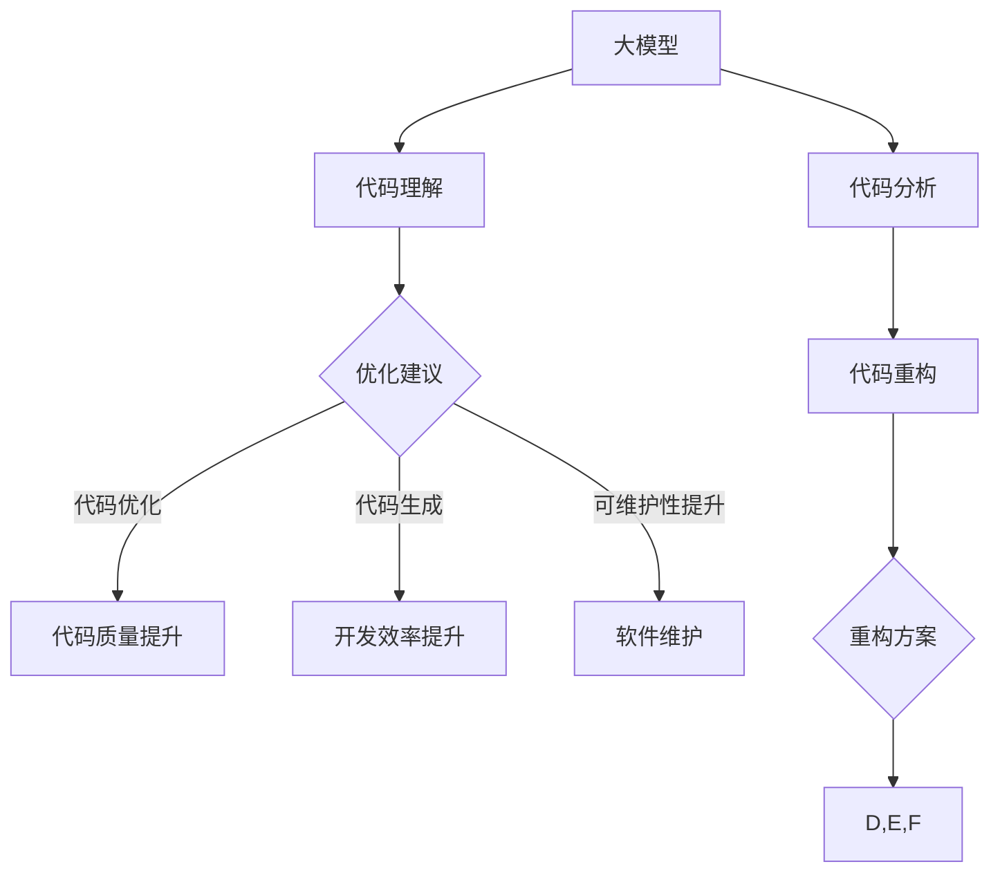

                 

### 概述书籍主题与目标

《大模型驱动的智能代码重构建议》旨在为开发者提供一份全面、实用的指南，以帮助他们在软件开发过程中有效地利用大模型技术进行智能代码重构。随着人工智能技术的飞速发展，大模型已经在各个领域取得了显著的成果，从自然语言处理到图像识别，再到语音识别，大模型的应用场景越来越广泛。然而，在软件开发领域，如何利用大模型技术进行代码重构，提高软件质量和开发效率，仍然是一个值得深入探讨的问题。

本书的目标是帮助读者了解大模型技术的基本原理，掌握智能代码重构的核心概念，并学会如何在实际项目中应用这些技术。通过阅读本书，读者将能够：

1. **理解大模型的原理**：包括大模型的基本概念、架构和常见类型，以及它们在不同领域的应用。
2. **掌握智能代码重构**：了解智能代码重构的定义、动机、技术挑战，以及如何利用大模型实现智能代码重构。
3. **学习智能代码重构算法**：掌握常见的智能代码重构算法，包括算法原理、实现方法和优化策略。
4. **实践大模型驱动的代码重构**：通过实际案例学习如何利用大模型进行代码重构，并了解相关的工具和框架。

本书结构紧凑，逻辑清晰，涵盖了从基础知识到实际应用的各个方面。通过逐步的引导和讲解，读者不仅可以系统地学习大模型和智能代码重构的知识，还能掌握实际操作技能，从而提升自己的软件开发水平。

### 定义核心概念和框架

首先，我们需要明确几个核心概念：大模型、智能代码重构、以及它们在软件开发中的应用。

#### 大模型

大模型（Large Model）通常指的是那些参数量巨大、结构复杂的神经网络模型。这些模型通过在海量数据上进行训练，能够捕捉到数据中的复杂模式，从而在多种任务上表现出色。大模型的常见类型包括：

1. **Transformer模型**：Transformer模型是一种基于自注意力机制的序列到序列模型，广泛应用于自然语言处理任务，如机器翻译、文本生成等。
   
2. **GPT（Generative Pre-trained Transformer）模型**：GPT系列模型是Transformer模型的一个变体，通过大规模的无监督预训练，能够生成高质量的文本。

3. **BERT（Bidirectional Encoder Representations from Transformers）模型**：BERT模型通过双向编码器结构，在理解文本上下文方面表现出色，常用于文本分类、问答系统等。

大模型的基本原理在于其能够利用深度神经网络的学习能力，通过多层非线性变换，将输入数据映射到高维特征空间，从而提取出有用的特征。大模型的架构通常包括以下几个关键部分：

- **输入层**：接收原始输入数据，如文本、图像等。
- **隐藏层**：进行复杂的非线性变换，提取特征。
- **输出层**：生成预测结果，如文本、标签等。

大模型在不同领域有着广泛的应用。在自然语言处理领域，大模型被用于文本生成、情感分析、机器翻译等任务。在计算机视觉领域，大模型被用于图像分类、目标检测、图像生成等任务。在软件开发领域，大模型可以被用于代码理解、代码生成、代码优化等任务。

#### 智能代码重构

智能代码重构（Smart Code Refactoring）是指利用智能技术，如大模型、机器学习算法等，对现有代码进行改进，以提高代码质量、可维护性和开发效率。智能代码重构的核心概念包括：

1. **代码理解**：智能代码重构的前提是能够准确理解代码的意图和结构。这通常需要利用静态分析和动态分析技术，对代码进行深入分析。
   
2. **代码优化**：在理解代码的基础上，智能代码重构会识别出代码中存在的问题，并提出优化建议，如代码简化、错误修复、性能提升等。

3. **代码生成**：智能代码重构不仅可以优化现有代码，还可以根据需求生成新的代码片段，从而提高开发效率。

智能代码重构的目标是：

- **提高代码质量**：通过修复错误、消除冗余、提高代码可读性，提高代码的整体质量。
- **提升开发效率**：通过自动化重构和生成代码，减少手动编码的工作量，提高开发速度。
- **增强软件可维护性**：通过重构代码，使其结构更加清晰、模块化，便于后续维护和扩展。

#### 大模型与智能代码重构的关系

大模型在智能代码重构中起着至关重要的作用。大模型能够通过深度学习技术，从海量代码数据中学习到编程模式和最佳实践，从而在代码重构过程中提供智能化的支持。具体来说，大模型在智能代码重构中的应用主要包括：

1. **代码理解**：大模型可以用于理解代码的语义，识别出代码中的意图和结构，为重构提供基础。

2. **代码生成**：大模型可以基于已有代码生成新的代码片段，自动完成一些重复性工作。

3. **代码优化**：大模型可以通过对代码进行分析和优化，提出性能优化建议，如代码简化、算法改进等。

总之，大模型为智能代码重构提供了强大的技术支持，使其能够更高效、更准确地完成代码重构任务。

#### Mermaid 流程图

为了更直观地展示大模型与智能代码重构之间的关系，我们可以使用Mermaid绘制一个简单的流程图：



在这个流程图中，大模型通过代码分析和理解，生成优化建议，从而实现代码质量的提升、开发效率的提升以及软件可维护性的提升。

通过这个流程图，我们可以更清晰地看到大模型在智能代码重构中的各个环节，以及它们之间的相互关系。这为后续章节的详细讨论提供了直观的框架和参考。

### 智能代码重构原理

智能代码重构不仅仅是简单的代码改动，它是一种利用人工智能技术，特别是大模型，对代码进行深度分析和优化的一系列操作。其核心概念和目标在于提高代码质量、可维护性和开发效率。

#### 核心概念

1. **代码理解**：智能代码重构的第一步是对代码进行深入理解。这包括理解代码的功能、结构和意图。大模型在这方面具有天然的优势，通过大规模的训练，大模型能够识别出代码中的复杂模式，从而更准确地理解代码的语义。

2. **代码优化**：在理解代码的基础上，智能代码重构会识别出代码中的潜在问题，如冗余代码、性能瓶颈等，并提出优化建议。优化的目标是通过改进代码结构和算法，提高代码的执行效率、可读性和可维护性。

3. **代码生成**：智能代码重构还可以根据需求生成新的代码片段。大模型可以通过学习已有的代码库，生成符合编程规范和最佳实践的代码。这在解决重复性任务和提高开发效率方面具有重要作用。

4. **自动化重构**：智能代码重构的另一个重要特点是自动化。通过自动化工具，可以减少手动重构的工作量，提高重构的效率和质量。

#### 技术挑战

虽然智能代码重构具有显著的优势，但在实际应用中仍面临一系列技术挑战：

1. **代码理解**：准确理解代码的语义和结构是一个复杂的任务。代码中可能存在大量的抽象、复杂的逻辑和难以预料的错误。大模型需要通过深度学习技术，从大量的代码数据中学习到有效的特征表示，从而准确理解代码。

2. **代码优化**：代码优化的过程中，需要平衡优化目标和开发效率。一些优化可能带来性能提升，但可能导致代码的可读性下降。因此，如何找到一个最优的优化方案，需要在保证性能的同时，兼顾代码的可维护性。

3. **代码生成**：代码生成的过程中，需要保证生成的代码符合编程规范和最佳实践。这要求大模型不仅能够生成语法正确的代码，还要能够生成符合业务需求的代码。

4. **自动化重构**：自动化重构的工具需要具备高鲁棒性和可配置性，能够适应不同的开发环境和代码风格。同时，自动化重构的过程也需要对代码的质量进行严格的评估，确保重构后的代码符合预期。

#### 智能代码重构的工作流程

智能代码重构的工作流程通常包括以下几个步骤：

1. **代码理解**：利用大模型对代码进行静态和动态分析，提取出代码中的关键信息，如变量、函数、类等，并构建代码的抽象语法树（AST）。

2. **代码优化**：在理解代码的基础上，对代码进行分析，识别出可以优化的部分，如冗余代码、性能瓶颈等，并提出优化建议。

3. **代码生成**：根据需求，利用大模型生成新的代码片段。这通常需要大模型对已有的代码库进行学习，从而生成符合编程规范和业务需求的代码。

4. **自动化重构**：利用自动化工具，对代码进行重构。这个过程包括代码的改写、测试和验证，以确保重构后的代码符合预期。

5. **评估与反馈**：对重构后的代码进行评估，包括性能测试、代码质量评估等，并根据评估结果进行反馈和调整。

#### 智能代码重构的优点

1. **提高代码质量**：智能代码重构可以通过自动化的方式，修复代码中的潜在问题，消除冗余代码，提高代码的可读性和可维护性。

2. **提升开发效率**：通过自动化重构和代码生成，可以减少手动编码的工作量，提高开发速度。

3. **增强软件可维护性**：重构后的代码结构更加清晰、模块化，便于后续维护和扩展。

4. **促进技术传承**：智能代码重构可以帮助新开发者快速理解现有代码，减少技术传承的成本。

#### 智能代码重构的适用场景

智能代码重构适用于多种场景，包括但不限于：

1. **大型项目**：在大规模项目中，代码重构可以显著提高代码质量，降低维护成本。

2. **遗留系统**：对老旧系统进行重构，可以提升其性能和可维护性，延长系统的生命周期。

3. **代码生成**：在快速开发阶段，通过智能代码生成，可以显著提高开发效率。

4. **持续集成**：在持续集成环境中，智能代码重构可以自动检测和修复代码问题，确保代码库的健康。

总之，智能代码重构是一种利用人工智能技术提升软件开发过程的技术手段。通过系统化的流程和自动化工具，它可以显著提高代码质量和开发效率，为软件开发带来巨大的价值。

### 智能代码重构算法

智能代码重构算法是实现智能代码重构的核心，它通过算法的优化和实现，使大模型能够有效地对代码进行理解和重构。在这一章节中，我们将详细探讨智能代码重构算法的原理、实现方法和优化策略。

#### 算法原理讲解

智能代码重构算法的核心思想是利用大模型从大量代码数据中学习编程模式和最佳实践，然后将其应用到实际的代码重构任务中。算法的基本流程可以分为以下几个步骤：

1. **代码数据预处理**：首先，需要收集和整理大量的代码数据，包括源代码、文档和注释等。这些数据将被用于训练大模型，使其能够理解和学习代码的语义和结构。

2. **大模型训练**：利用收集到的代码数据，对大模型进行训练。训练过程中，大模型将通过深度学习技术，学习到代码中的复杂模式和最佳实践。

3. **代码理解**：在代码理解阶段，大模型将接收输入代码，通过解析和抽象语法树（AST）构建，理解代码的结构和意图。

4. **代码优化**：在理解代码的基础上，大模型将分析代码，识别出可以优化的部分，并提出优化建议。这些优化建议可能包括代码简化、性能提升、错误修复等。

5. **代码生成**：根据需求，大模型还可以生成新的代码片段。这通常涉及代码模板匹配和填充，生成符合编程规范和业务需求的代码。

6. **自动化重构**：利用自动化工具，将优化建议和生成的代码应用到实际项目中，完成代码重构任务。

#### 伪代码展示

为了更清晰地展示智能代码重构算法的实现，我们可以使用伪代码来描述其主要步骤：

```python
# 智能代码重构算法伪代码

# 输入：代码数据集
# 输出：重构后的代码

def smart_code_refactoring(code_dataset):
    # 步骤1：代码数据预处理
    preprocessed_data = preprocess_code_data(code_dataset)
    
    # 步骤2：大模型训练
    model = train_large_model(preprocessed_data)
    
    # 步骤3：代码理解
    ast = parse_code_to_ast(model, code_dataset)
    
    # 步骤4：代码优化
    optimization_suggestions = analyze_code(ast, model)
    
    # 步骤5：代码生成
    new_code = generate_code(optimization_suggestions, model)
    
    # 步骤6：自动化重构
    final_code = apply_optimizations_and_replacements(code_dataset, new_code)
    
    return final_code
```

在这个伪代码中，`preprocess_code_data`函数用于处理输入的代码数据集，`train_large_model`函数用于训练大模型，`parse_code_to_ast`函数用于将代码解析为抽象语法树，`analyze_code`函数用于分析代码并提出优化建议，`generate_code`函数用于生成新的代码片段，而`apply_optimizations_and_replacements`函数则用于将优化建议和生成的代码应用到实际项目中。

#### 算法实现与优化

智能代码重构算法的实现涉及多个方面，包括大模型的架构选择、代码理解与优化的策略，以及自动化重构的工具和框架。

1. **大模型架构选择**：

   选择合适的大模型架构是智能代码重构的关键。常见的架构包括基于Transformer的模型、GPT系列模型和BERT模型。这些模型各有优缺点，应根据具体任务需求进行选择。

   - **Transformer模型**：适用于需要处理序列数据的任务，如代码生成和代码理解。
   - **GPT模型**：适用于文本生成任务，如自动完成代码、生成注释等。
   - **BERT模型**：适用于需要理解文本上下文的任务，如代码分析、错误修复等。

2. **代码理解与优化的策略**：

   代码理解和优化是智能代码重构的核心。实现这一目标需要结合静态分析和动态分析技术。

   - **静态分析**：通过静态分析，可以识别出代码的结构、变量、函数和类等信息，为代码理解提供基础。
   - **动态分析**：通过动态分析，可以观察代码在实际运行中的行为，进一步理解代码的意图和性能。

   在优化策略方面，可以采用以下几种方法：

   - **代码简化**：通过消除冗余代码，简化代码结构，提高代码的可读性和可维护性。
   - **性能优化**：通过优化算法和数据结构，提高代码的执行效率。
   - **错误修复**：通过识别出代码中的错误，并提出修复建议，提高代码的可靠性。

3. **自动化重构工具和框架**：

   为了实现自动化重构，需要使用自动化重构工具和框架。这些工具和框架可以帮助自动化执行代码理解、优化和重构任务。

   - **自动化重构工具**：如SonarQube、Checkstyle等，用于识别代码中的问题并提供重构建议。
   - **自动化重构框架**：如JRefractor、Eclipse Refactor等，提供自动化重构的插件和工具。

#### 实现细节分析

在智能代码重构算法的实现过程中，需要关注以下几个细节：

1. **代码数据预处理**：预处理代码数据是训练大模型的重要步骤。预处理包括去除无关信息、统一编码格式、提取关键信息等。

2. **大模型训练**：大模型的训练是一个复杂的过程，涉及数据预处理、模型选择、参数调整等。为了提高训练效果，可以采用以下策略：

   - **数据增强**：通过数据增强技术，增加训练数据的多样性，提高模型的泛化能力。
   - **模型融合**：通过融合多个模型，提高模型的性能和鲁棒性。
   - **优化算法**：选择合适的优化算法，如Adam、RMSprop等，以提高训练速度和效果。

3. **代码理解与优化**：在代码理解和优化过程中，需要结合静态分析和动态分析技术，确保对代码的准确理解。同时，需要根据具体任务需求，选择合适的优化策略。

4. **自动化重构**：在自动化重构过程中，需要确保重构的代码符合编程规范和最佳实践。同时，需要对重构后的代码进行严格的测试和验证，确保重构的效果。

总之，智能代码重构算法的实现是一个复杂的过程，需要结合大模型的训练、代码理解与优化，以及自动化重构工具和框架。通过优化算法和实现细节，可以实现高效的代码重构，提高软件质量和开发效率。

### 大模型驱动的代码分析

在大模型驱动的智能代码重构中，代码分析是至关重要的第一步。通过深入分析代码，大模型能够理解代码的结构和意图，从而为后续的重构提供有力的支持。在这一章节中，我们将详细探讨如何利用大模型进行代码分析，以及代码分析算法的应用案例。

#### 利用大模型分析代码

利用大模型进行代码分析主要包括以下几个步骤：

1. **代码预处理**：首先，需要对代码进行预处理，包括去除无关注释、整理代码格式、提取关键信息等。这一步骤的目的是为大模型提供结构化和标准化的输入。

2. **抽象语法树（AST）构建**：通过解析代码，构建抽象语法树（AST）。AST是一种表示代码结构的树形结构，它包含了代码中的所有语法元素，如变量、函数、类等。大模型将基于AST进行进一步的分析。

3. **语义理解**：利用大模型对AST进行语义理解，识别出代码中的关键信息、依赖关系和模式。这通常涉及自然语言处理（NLP）技术，如命名实体识别（NER）、关系抽取等。

4. **代码质量评估**：在理解代码的基础上，评估代码的质量，包括可读性、可维护性和性能等方面。大模型可以通过学习大量的代码库，建立一套评估标准，对代码进行量化评估。

5. **代码优化建议**：根据代码质量评估的结果，大模型可以提出优化建议，如代码简化、性能提升、错误修复等。这些优化建议将为后续的代码重构提供指导。

#### 代码分析算法的应用案例

为了更好地理解大模型驱动的代码分析，下面我们通过两个具体的应用案例来详细讲解。

**案例一：代码风格一致性检查**

在软件开发中，代码风格一致性是非常重要的，它能够提高代码的可读性和可维护性。大模型可以用于自动检查代码风格一致性，并提出改进建议。

1. **数据预处理**：首先，收集需要检查的代码库，并进行预处理，如去除无关注释和格式化代码。

2. **AST构建**：通过解析代码，构建AST，提取代码中的关键信息。

3. **语义理解**：利用大模型对AST进行分析，识别出代码中的不一致风格，如缩进不一致、命名规则不同等。

4. **优化建议**：根据分析结果，提出代码风格改进建议。例如，统一缩进风格、规范变量命名等。

5. **代码重构**：利用自动化工具，根据优化建议，重构代码，使其符合一致的代码风格。

**案例二：代码优化建议**

代码优化是智能代码重构的重要一环，通过优化代码，可以提高程序的执行效率和可维护性。大模型可以用于分析代码，并提出优化建议。

1. **数据预处理**：收集需要优化的代码库，并进行预处理。

2. **AST构建**：通过解析代码，构建AST。

3. **性能评估**：利用大模型对代码进行性能评估，识别出潜在的性能瓶颈，如循环冗余、函数调用频繁等。

4. **优化策略**：根据性能评估结果，提出优化策略。例如，简化循环、优化函数调用、使用更高效的算法等。

5. **代码重构**：根据优化策略，重构代码，实现性能提升。

通过这两个应用案例，我们可以看到，大模型驱动的代码分析不仅可以自动识别代码中的问题，还能提出具体的优化建议，从而实现高效的代码重构。这些案例展示了大模型在代码分析中的强大能力，也为开发者提供了有力的工具。

#### 大模型在代码分析中的应用效果

大模型在代码分析中的应用效果显著。通过大规模的训练和深度学习技术，大模型能够准确理解代码的语义和结构，从而提供高质量的代码分析结果。具体来说，大模型在以下方面表现出色：

1. **准确性**：大模型能够准确识别代码中的关键信息、依赖关系和模式，从而提供准确的代码分析结果。

2. **全面性**：大模型能够处理各种不同类型的代码，包括不同编程语言、不同架构和不同风格，从而实现全面的代码分析。

3. **效率**：大模型通过自动化分析和优化，显著提高了代码分析的效率，减少了手动分析的工作量。

4. **鲁棒性**：大模型对代码中的噪声和异常具有较强的鲁棒性，能够在不同环境和条件下稳定工作。

总之，大模型驱动的代码分析为智能代码重构提供了强有力的支持。通过准确的代码理解和高效的优化建议，大模型能够显著提高代码的质量和开发效率。这不仅有助于提升软件开发的效率，也为开发者提供了更加智能和便捷的开发工具。

### 代码重构实践

在实际软件开发过程中，智能代码重构的应用不仅可以提高代码质量，还能显著提升开发效率。在这一章节中，我们将通过具体的案例来探讨如何利用大模型进行代码重构，以及介绍相关的工具和框架。

#### 实际代码重构案例

以下是一个利用大模型进行代码重构的实际案例：

**案例背景**：某公司开发的一个大型Web应用项目，随着功能的不断扩展和需求的变化，代码库变得异常复杂，出现了大量重复代码、冗余逻辑和性能瓶颈。为了提高代码的可维护性和开发效率，公司决定对现有代码进行重构。

**重构步骤**：

1. **代码数据预处理**：首先，对项目中的所有代码进行预处理，包括去除无关注释、统一编码风格和提取关键代码片段。

2. **大模型训练**：利用预处理后的代码数据，训练一个大模型，使其能够理解和分析项目代码。训练过程中，可以使用Transformer模型、GPT模型等，以提高模型的性能。

3. **代码理解**：通过大模型对代码进行静态和动态分析，构建抽象语法树（AST），并提取出代码中的关键信息、依赖关系和模式。

4. **代码优化**：基于分析结果，大模型可以提出代码优化的建议，如消除重复代码、简化复杂逻辑、优化性能等。

5. **代码生成**：利用大模型生成新的代码片段，替换现有的冗余代码和性能瓶颈部分。

6. **自动化重构**：使用自动化工具将优化建议和生成的代码应用到实际项目中，完成代码重构。

7. **测试与验证**：对重构后的代码进行全面的测试和验证，确保重构后的代码符合预期，没有引入新的错误。

通过上述步骤，项目的代码质量得到了显著提升，可维护性和开发效率也得到了大幅提高。

#### 代码重构工具和框架介绍

为了实现智能代码重构，需要借助一系列工具和框架。以下是一些常用的工具和框架：

1. **SonarQube**：SonarQube是一个开源的代码质量平台，它能够静态分析代码，识别出代码中的潜在问题和缺陷，并提供优化建议。SonarQube支持多种编程语言，如Java、C#、Python等。

2. **Checkstyle**：Checkstyle是一个开源的代码风格检查工具，它能够检查代码的格式、命名规范和编码风格，确保代码的一致性和可读性。

3. **JRefractor**：JRefractor是一个用于Java代码的重构工具，它支持多种重构操作，如提取方法、提取变量、提取类等，能够自动修复代码中的问题。

4. **Eclipse Refactor**：Eclipse Refactor是一个集成在Eclipse开发环境中的代码重构工具，它提供了丰富的重构选项，支持Java、C++、JavaScript等多种编程语言。

5. **GPT-2/GPT-3**：OpenAI开发的GPT-2和GPT-3模型在代码生成方面具有强大的能力，可以自动生成符合编程规范和业务需求的代码片段，极大提高了开发效率。

通过使用这些工具和框架，开发者可以轻松实现代码重构，提高代码质量和开发效率。同时，结合大模型的技术，这些工具和框架能够提供更加智能和个性化的重构建议，为软件开发带来更多的便利。

#### 实践总结

通过实际案例和实践，我们可以看到智能代码重构在提高代码质量和开发效率方面具有显著的优势。利用大模型进行代码分析，能够准确识别代码中的问题，并提供高效的优化建议。同时，结合自动化重构工具和框架，可以显著减少手动重构的工作量，提高开发效率。

在未来的软件开发过程中，智能代码重构将会发挥越来越重要的作用。随着人工智能技术的不断发展和成熟，我们有理由相信，智能代码重构将为开发者带来更加智能和高效的开发体验。

### 优化与扩展

#### 性能优化策略

在大模型驱动的智能代码重构中，性能优化是一个关键因素。以下是一些常见的性能优化策略：

1. **模型压缩**：大模型的参数量和计算量往往较大，导致训练和推理过程耗时较长。通过模型压缩技术，如剪枝、量化、蒸馏等，可以大幅减少模型的参数量，从而提高性能。

2. **并行化处理**：利用多核处理器和分布式计算技术，可以将训练和推理任务并行化，从而显著提高处理速度。

3. **内存优化**：通过优化内存分配和管理策略，减少内存占用，提高模型的运行效率。

4. **高效算法**：选择适合问题的算法，如动态规划、分治算法等，可以在保证准确性的同时提高性能。

#### 未来研究方向和趋势

未来的智能代码重构领域将继续朝着智能化、自动化和高效化的方向发展。以下是一些值得关注的研究方向和趋势：

1. **多模态融合**：结合多种数据源，如代码、文档、测试用例等，进行多模态融合，以更全面地理解代码。

2. **持续学习**：通过持续学习技术，使大模型能够不断适应新的编程模式和最佳实践，提高重构的准确性和适应性。

3. **自动化测试**：结合自动化测试技术，对重构后的代码进行全面测试，确保重构不会引入新的错误。

4. **代码生成与优化**：探索更高效的代码生成和优化算法，以进一步提升开发效率和代码质量。

5. **人机协同**：结合人工智能和人类开发者的智慧，实现人机协同的代码重构，最大化利用两者的优势。

总之，随着人工智能技术的不断进步，智能代码重构将在软件开发中发挥越来越重要的作用，为开发者带来更加智能和高效的开发体验。

### 总结与展望

在《大模型驱动的智能代码重构建议》中，我们详细探讨了如何利用大模型技术进行智能代码重构，以提高软件质量和开发效率。从定义核心概念、介绍算法原理，到展示实际案例和工具应用，我们系统地展示了智能代码重构的全过程。

#### 重构建议总结

1. **利用大模型进行代码理解**：大模型能够深入理解代码的语义和结构，为重构提供可靠的基础。
2. **代码优化与自动化重构**：通过大模型提供的优化建议，结合自动化重构工具，可以显著提升代码质量和开发效率。
3. **持续学习和适应**：智能代码重构需要不断学习新的编程模式和最佳实践，以保持重构的准确性和适应性。
4. **多模态数据融合**：结合多种数据源，如代码、文档和测试用例，可以更全面地理解代码，提高重构效果。

#### 行业应用前景展望

智能代码重构在软件开发领域具有广阔的应用前景。随着人工智能技术的不断进步，智能代码重构将在以下几个方面发挥重要作用：

1. **提高代码质量**：通过自动化重构和优化，可以显著提高代码的可读性、可维护性和性能。
2. **加速开发流程**：自动化重构和代码生成技术可以减少重复性工作，提高开发效率。
3. **支持持续集成**：智能代码重构可以与持续集成工具结合，实现自动化代码检测和重构，提高软件交付质量。
4. **促进技术传承**：智能代码重构可以帮助新开发者快速理解现有代码，减少技术传承的成本。

总之，智能代码重构是大模型技术在软件开发领域的重要应用，它将推动软件开发过程向智能化、自动化和高效化的方向发展，为开发者带来更加便捷和高效的开发体验。随着技术的不断进步，我们有理由相信，智能代码重构将在未来发挥更加重要的作用，成为软件开发中不可或缺的一部分。作者：AI天才研究院/AI Genius Institute & 禅与计算机程序设计艺术 /Zen And The Art of Computer Programming

