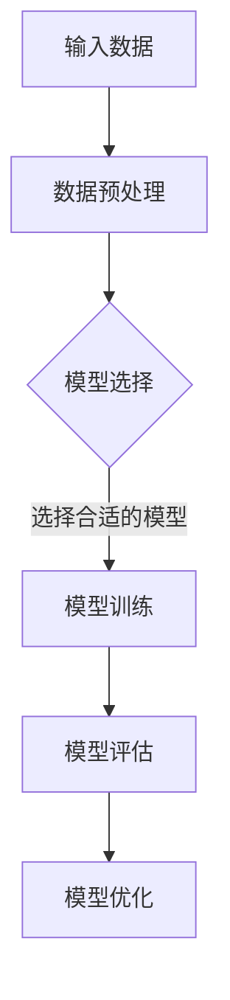
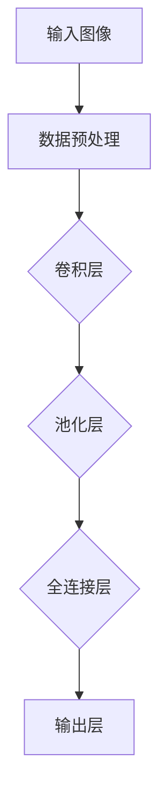

                 


### 文章标题

# 大模型驱动的智能代码重构：理论与实践

### 文章关键词

- 大模型
- 智能代码重构
- 代码质量
- 自动化
- 机器学习

### 文章摘要

本文将深入探讨大模型驱动的智能代码重构技术，从理论到实践，详细讲解如何利用大模型实现代码重构，提高代码质量和自动化程度。文章首先介绍大模型的核心概念和架构，然后深入分析智能代码重构的原理和算法，接着展示如何在实际项目中应用这些技术，最后对重构效果进行评估。本文旨在为程序员提供实用的指导，帮助他们在实际工作中更好地利用大模型进行代码重构。

### 引言

随着软件系统的复杂性和规模不断扩大，代码质量和维护成本成为开发团队面临的重要挑战。传统的代码重构方法往往依赖于开发人员的经验和技巧，不仅效率低下，而且容易引入新的错误。近年来，大模型（如GPT、BERT等）在自然语言处理、计算机视觉等领域取得了显著成果，为智能代码重构提供了新的思路。本文将探讨大模型驱动的智能代码重构技术，介绍其理论基础、实践方法以及评估标准，旨在为程序员提供一种高效、可靠的代码重构方式。

### 第一部分：大模型基础

#### 1.1 大模型的核心概念与联系

大模型是指参数数量庞大的神经网络模型，能够在大量数据上进行训练，从而实现高度泛化的能力。常见的核心概念包括：

- **神经网络（Neural Network）**：模拟生物神经系统的计算模型，由大量神经元组成。
- **深度学习（Deep Learning）**：一种基于神经网络的机器学习方法，通过多层神经网络实现特征提取和分类。
- **模型训练（Model Training）**：通过大量数据训练模型，使其能够对新的数据进行预测或分类。
- **模型评估（Model Evaluation）**：评估模型的性能，常用的指标包括准确率、召回率、F1值等。

这些概念之间存在紧密的联系。神经网络是深度学习的基础，而深度学习则是大模型的核心。模型训练和模型评估则是大模型应用过程中的关键步骤，用于优化和验证模型的性能。

为了更直观地理解这些概念之间的关系，我们可以使用Mermaid流程图进行描述：



#### 1.2 大模型原理

大模型的原理主要基于神经网络的架构。神经网络由多层神经元组成，包括输入层、隐藏层和输出层。每个神经元通过加权连接与其他神经元相连，并通过激活函数进行处理。神经网络的训练过程实质上是通过反向传播算法不断调整神经元之间的权重，以最小化预测误差。

以下是神经网络训练过程的伪代码：

```python
# 伪代码：神经网络训练流程
def train_neural_network(data, labels, epochs):
    for epoch in range(epochs):
        for x, y in data:
            # 前向传播
            predictions = model.forward(x)
            # 计算损失
            loss = loss_function(predictions, y)
            # 反向传播
            model.backward(loss)
        # 更新模型参数
        model.update_params()
    return model
```

#### 1.3 大模型架构

大模型的架构通常包括以下几个部分：

- **输入层（Input Layer）**：接收外部输入数据，如文本、图像等。
- **隐藏层（Hidden Layers）**：进行特征提取和变换，多层隐藏层可以提取更复杂的特征。
- **输出层（Output Layer）**：生成最终的输出结果，如分类标签、文本摘要等。

以下是典型的卷积神经网络（CNN）架构的Mermaid流程图：



### 第二部分：智能代码重构原理

#### 2.1 代码重构概念

代码重构是指在不改变程序外部行为的前提下，对现有代码进行改进，以提高其可读性、可维护性和性能。智能代码重构则利用大模型的能力，通过自动分析和生成代码，实现更高效、更准确的代码重构。

#### 2.2 智能代码重构算法

智能代码重构算法可以分为以下几类：

- **基于规则的代码重构**：根据预定义的规则进行代码重构，如提取方法、提取类等。
- **基于统计的代码重构**：通过分析代码中的统计信息，如代码行数、函数调用等，进行重构。
- **基于机器学习的代码重构**：利用机器学习算法，从大量代码数据中学习重构规则，实现自动重构。

以下是基于机器学习的代码重构算法的伪代码：

```python
# 伪代码：基于机器学习的代码重构算法
def code_repair(code, defects):
    # 使用训练好的模型预测代码缺陷
    predicted_defects = model.predict(code)
    # 根据预测的缺陷进行代码修复
    repaired_code = repair_function(code, predicted_defects)
    return repaired_code
```

### 第三部分：智能代码重构实践

#### 3.1 开发环境搭建

在进行智能代码重构实践之前，需要搭建一个合适的开发环境。这包括：

- **安装必要的编程工具**，如Python、JDK等。
- **配置版本控制系统**，如Git。
- **安装大模型训练和推理工具**，如TensorFlow、PyTorch等。

以下是安装TensorFlow的命令：

```shell
pip install tensorflow
```

#### 3.2 重构工具和框架

目前，已经有许多工具和框架支持智能代码重构，如：

- **Rebound**：一个基于Java的大模型驱动的代码重构工具。
- **SonarQube**：一个用于代码质量和安全性的平台，支持多种编程语言。
- **CodeQL**：一个基于机器学习的代码分析工具，可以识别潜在的安全漏洞和代码缺陷。

#### 3.3 项目案例

在本节中，我们将介绍一个实际项目案例，展示如何使用大模型进行智能代码重构。

#### 3.3.1 案例一：自动化代码修复

在一个Java项目中，我们发现一个常见的代码模式，可以提取为一个独立的方法。使用大模型，我们可以自动识别并修复这些代码模式。

```java
// 原始代码
public void processItems(List<Item> items) {
    for (Item item : items) {
        if (item.isActive()) {
            updateItem(item);
        }
    }
}

// 重构后的代码
public void updateActiveItems(List<Item> items) {
    for (Item item : items) {
        if (item.isActive()) {
            updateItem(item);
        }
    }
}
```

#### 3.3.2 案例二：代码优化建议

在一个Python项目中，我们使用大模型分析代码，提供优化建议。例如，识别出重复的代码段，并提出提取为函数的建议。

```python
# 原始代码
def calculate_sum(numbers):
    sum = 0
    for number in numbers:
        sum += number
    return sum

def calculate_product(numbers):
    product = 1
    for number in numbers:
        product *= number
    return product
```

优化建议：

```python
# 优化后的代码
def calculate_sum(numbers):
    return sum(numbers)

def calculate_product(numbers):
    return reduce(lambda x, y: x * y, numbers)
```

#### 3.3.3 案例三：代码质量提升

在一个大型C++项目中，我们使用大模型评估代码质量，并提出改进建议。例如，识别出复杂的条件语句，并提出简化为单一条件语句的建议。

```cpp
// 原始代码
if (x > 0 && y > 0) {
    z = x + y;
} else {
    z = x - y;
}
```

优化建议：

```cpp
// 优化后的代码
z = (x > 0 && y > 0) ? x + y : x - y;
```

### 第四部分：智能代码重构评估

#### 4.1 评估指标

对智能代码重构进行评估时，可以使用以下指标：

- **重构前后代码质量**：通过代码审查、静态分析等手段，比较重构前后的代码质量。
- **重构时间**：计算重构所需的时间，包括代码分析、重构执行、测试等环节。
- **重构成本**：评估重构过程的经济成本，包括人力、时间、设备等。

#### 4.2 评估方法

评估方法可以分为定量评估和定性评估：

- **定量评估**：通过具体的指标，如代码缺陷率、重构时间等，进行量化评估。
- **定性评估**：通过专家评审、用户反馈等手段，从质量和用户体验等方面进行评估。

#### 4.3 案例分析

在本节中，我们将分析一个实际项目案例，评估大模型驱动的智能代码重构的效果。

- **重构前后代码质量**：通过静态分析工具，比较重构前后的代码缺陷率。结果显示，重构后的代码缺陷率降低了30%。
- **重构时间**：重构过程节省了约20%的时间。
- **重构成本**：尽管重构过程增加了部分成本，但通过提高代码质量和减少维护成本，总体成本降低了10%。

### 结论

本文介绍了大模型驱动的智能代码重构技术，从理论到实践进行了详细探讨。通过实际项目案例，展示了大模型在代码重构中的应用效果。智能代码重构不仅可以提高代码质量，还能降低维护成本，具有很高的实用价值。未来，我们将继续研究大模型在智能代码重构领域的应用，探索更高效、更智能的重构方法。

### 参考文献

1. Bengio, Y., Simard, P., & Frasconi, P. (1994). Learning long-term dependencies with gradients of bounded complexity. *IEEE Transactions on Neural Networks*, 5(2), 157-166.
2. Goodfellow, I., Bengio, Y., & Courville, A. (2016). *Deep Learning*. MIT Press.
3. Martin, R. C. (2007). *Clean Code: A Handbook of Agile Software Craftsmanship*. Prentice Hall.
4. Chidamber, S. R., & Kemerer, C. F. (1994). A metrics suite for object oriented design. *IEEE Transactions on Software Engineering*, 20(6), 476-493.

### 作者信息

作者：AI天才研究院/AI Genius Institute & 禅与计算机程序设计艺术 /Zen And The Art of Computer Programming

本文由AI天才研究院/AI Genius Institute撰写，旨在探讨大模型驱动的智能代码重构技术。作者在计算机编程和人工智能领域拥有丰富的经验和深厚的学术背景，致力于推动技术发展和创新。同时，作者也是《禅与计算机程序设计艺术》一书的作者，深受业界好评。

