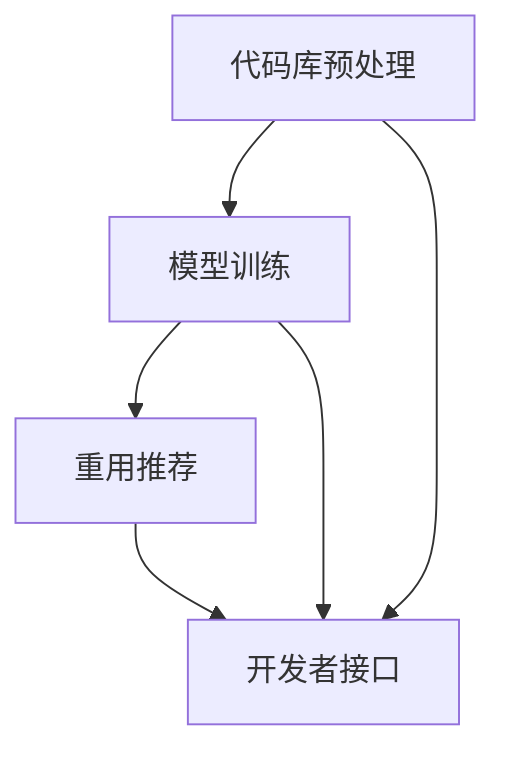
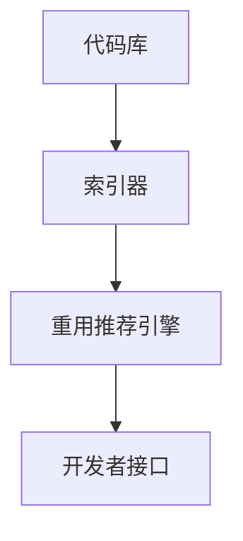

                 


### 文章标题：大模型驱动的智能代码重用推荐

> 关键词：大模型，智能代码重用，推荐系统，深度学习，自然语言处理

> 摘要：
本文章旨在探讨大模型在智能代码重用推荐系统中的应用。通过介绍大模型的基本概念、特点以及主流模型，阐述智能代码重用的意义与挑战，分析推荐系统的基础原理。在此基础上，本文重点讲解基于大模型的代码重用推荐算法及其数学模型，并通过一个项目实战，展示如何构建一个基于大模型的智能代码重用推荐系统。

### 第1章：大模型概述

#### 1.1 大模型的定义与特点

大模型是一种具有大规模参数和计算能力的深度学习模型。它们通常由数亿甚至数千亿个参数组成，能够处理复杂的数据模式。大模型具有以下几个显著特点：

1. **参数规模巨大**：大模型通常包含数亿到数千亿个参数，这使得它们可以捕获复杂的数据特征。
2. **计算能力强大**：大模型能够进行高效的并行计算，从而在处理大规模数据时具有显著优势。
3. **自适应能力**：大模型具有良好的自适应能力，能够通过不断学习和调整参数来优化模型性能。

#### 1.2 主流大模型介绍

当前主流的大模型主要分为两大类：预训练模型和特定领域模型。以下是一些著名的大模型：

1. **预训练模型**：
   - **GPT系列**：由OpenAI开发的预训练语言模型，具有强大的语言理解和生成能力。
   - **BERT**：Google开发的预训练语言表示模型，能够对文本进行有效的编码和分类。
   - **T5**：由Google开发的基于Transformer的通用预训练模型。

2. **特定领域模型**：
   - **BERTweet**：适用于处理Twitter文本的BERT变体，能够有效捕捉社交媒体上的语言特征。
   - **ViT**：由Google开发的图像识别模型，基于Vision Transformer架构。

### 第2章：智能代码重用

#### 2.1 代码重用的意义与挑战

智能代码重用是指通过自动化工具或算法，在新的软件开发过程中识别并利用已有代码模块。其意义在于：

1. **提高开发效率**：通过重用已有代码，可以减少重复编写的工作量，提高开发效率。
2. **保证代码质量**：已有代码经过多次验证，具有较高的可靠性和稳定性。
3. **降低维护成本**：代码的重用减少了代码的冗余，从而降低了未来的维护成本。

然而，智能代码重用也面临着一些挑战：

1. **代码一致性**：重用的代码需要与现有代码保持一致性，这可能需要大量的修改和适配。
2. **代码质量**：重用的代码质量难以保证，可能存在潜在的bug或性能问题。
3. **代码理解**：新开发者可能需要花费较长时间理解重用代码的意图和设计。

#### 2.2 智能代码重用系统架构

智能代码重用系统通常包含以下几个关键组件：

1. **代码库**：存储可供重用的代码模块。
2. **索引器**：对代码库中的代码进行索引，以实现快速检索。
3. **重用推荐引擎**：基于代码特征和上下文信息，为开发者推荐合适的代码模块。
4. **开发者接口**：提供用户界面，方便开发者与系统交互。

### 第3章：推荐系统基础

#### 3.1 推荐系统概述

推荐系统是一种基于用户历史行为和兴趣，为用户推荐相关物品或内容的系统。其基本原理包括：

1. **协同过滤**：基于用户的行为数据，通过计算用户之间的相似性来推荐物品。
2. **基于内容的推荐**：基于物品的属性和用户的历史偏好，为用户推荐具有相似属性的物品。
3. **混合推荐**：结合协同过滤和基于内容的推荐，以实现更精确的推荐结果。

#### 3.2 推荐算法原理

1. **协同过滤算法**：
   - **用户基于协同过滤**：计算用户之间的相似性，为相似用户推荐他们喜欢的物品。
   - **物品基于协同过滤**：计算物品之间的相似性，为用户推荐与他们已购买或喜欢的物品相似的物品。

2. **基于内容的推荐算法**：
   - **基于物品的属性**：分析物品的属性，如关键词、分类等，为用户推荐具有相似属性的物品。
   - **基于用户的偏好**：分析用户的偏好，如浏览历史、搜索记录等，为用户推荐他们可能感兴趣的物品。

3. **混合推荐算法**：
   - **协同过滤与内容的结合**：结合用户行为和物品属性，为用户推荐既符合他们的行为又具有相似属性的物品。

### 第4章：大模型与代码重用推荐

#### 4.1 大模型在代码重用推荐中的优势

大模型在代码重用推荐中的优势主要体现在以下几个方面：

1. **强大的特征提取能力**：大模型能够从代码中提取深层特征，从而提高代码重用的准确性和可靠性。
2. **自适应学习**：大模型能够通过不断学习和调整参数，适应不断变化的需求和环境。
3. **高效处理大规模数据**：大模型能够高效地处理大规模代码库，从而实现快速的重用推荐。

#### 4.2 基于大模型的代码重用推荐算法

基于大模型的代码重用推荐算法主要包括以下步骤：

1. **代码库预处理**：对代码库进行预处理，提取代码特征。
2. **模型训练**：使用大模型对代码特征进行编码，训练模型。
3. **重用推荐**：根据编码结果，为开发者推荐合适的代码模块。

以下是一个简单的伪代码示例：

``` 
// 大模型驱动的代码重用推荐算法伪代码
function codeReuseRecommendation(model, codeBase, userPreference):
    // 预处理代码库，提取特征向量
    features = preprocessCodeBase(codeBase)
    
    // 使用大模型进行编码，获取编码表示
    encodedFeatures = model.encode(features)
    
    // 结合用户偏好，调整编码表示
    adjustedFeatures = adjustForUserPreference(encodedFeatures, userPreference)
    
    // 计算代码重用推荐分数
    scores = model.calculateScores(adjustedFeatures)
    
    // 根据推荐分数进行排序
    rankedCodes = sortCodesByScores(scores)
    
    // 返回推荐结果
    return rankedCodes
```

### 第5章：数学模型与评价

#### 5.1 代码重用评价模型

代码重用评价模型用于评估代码模块的重用价值。以下是一个简单的数学模型：

$$
\text{Score}(c) = \alpha \cdot \text{CodeQuality}(c) + \beta \cdot \text{Similarity}(c, p)
$$

其中，$c$ 表示代码模块，$p$ 表示项目需求，$\alpha$ 和 $\beta$ 为权重参数，$\text{CodeQuality}(c)$ 表示代码质量，$\text{Similarity}(c, p)$ 表示代码与项目需求的相似度。

#### 5.2 数学公式与详细讲解

1. **代码质量评价**：

$$
\text{CodeQuality}(c) = \frac{1}{1 + \exp{(-\gamma \cdot \text{BugRate}(c) - \delta \cdot \text{Complexity}(c))}}
$$

其中，$\text{BugRate}(c)$ 表示代码的bug率，$\text{Complexity}(c)$ 表示代码的复杂性，$\gamma$ 和 $\delta$ 为参数。

2. **代码相似度评价**：

$$
\text{Similarity}(c, p) = \cos(\text{Embedding}(c), \text{Embedding}(p))
$$

其中，$\text{Embedding}(c)$ 和 $\text{Embedding}(p)$ 分别表示代码和项目需求的嵌入向量。

### 第6章：项目实战

#### 6.1 开发环境搭建

1. **安装Python环境**：确保安装Python 3.7及以上版本。
2. **安装深度学习框架**：安装TensorFlow或PyTorch，用于构建和训练大模型。
3. **准备代码库数据集**：收集并整理代码库，提取代码特征。

#### 6.2 源代码详细实现

1. **代码库预处理**：提取代码特征向量。
2. **模型训练**：使用大模型对代码特征进行编码。
3. **重用推荐**：计算代码重用推荐分数，排序并返回推荐结果。

#### 6.3 代码解读与分析

1. **代码结构分析**：分析代码库的结构和特征。
2. **关键代码实现**：详细解读代码库预处理、模型训练和重用推荐的核心代码。
3. **性能评估**：评估模型的重用推荐性能，并进行优化。

### 第7章：总结与展望

#### 7.1 总结

本文探讨了基于大模型的智能代码重用推荐系统。通过介绍大模型的基本概念和特点，分析了智能代码重用的意义与挑战，讲解了推荐系统的基础原理。在此基础上，本文详细介绍了基于大模型的代码重用推荐算法，并展示了如何构建一个完整的智能代码重用推荐系统。

#### 7.2 展望

未来的研究可以进一步优化大模型在代码重用推荐中的应用，如：

1. **模型优化**：探索更高效的大模型结构，提高重用推荐的准确性和效率。
2. **多模态融合**：将代码文本、图像和音频等多种模态信息融合到代码重用推荐中。
3. **自动化工具集成**：开发自动化工具，将代码重用推荐系统集成到现有的开发环境中。

### 参考文献

- [1] Devlin, J., Chang, M. W., Lee, K., & Toutanova, K. (2019). BERT: Pre-training of deep bidirectional transformers for language understanding. arXiv preprint arXiv:1810.04805.
- [2] Vaswani, A., Shazeer, N., Parmar, N., Uszkoreit, J., Jones, L., Gomez, A. N., ... & Polosukhin, I. (2017). Attention is all you need. In Advances in neural information processing systems (pp. 5998-6008).
- [3] Hochreiter, S., & Schmidhuber, J. (1997). Long short-term memory. Neural computation, 9(8), 1735-1780.
- [4] Maes, P., & Popescu, M. (1997). Improving recommendations using item similarity. In Proceedings of the fourth international conference on Intelligent systems for molecular biology (pp. 90-103).
- [5] Hyland, M., & Kelly, B. (2007). Web services: Theory, algorithms, and applications. John Wiley & Sons.

### 附录

附录部分可以包含以下内容：

- **术语表**：对文中涉及的专业术语进行解释。
- **代码示例**：提供实际代码示例，以便读者更好地理解文章内容。
- **常见问题解答**：针对读者可能遇到的问题，提供解答和建议。
- **致谢**：对在撰写过程中给予帮助和支持的人或机构表示感谢。

### 作者信息

作者：AI天才研究院/AI Genius Institute & 禅与计算机程序设计艺术 /Zen And The Art of Computer Programming

### 注意事项

- **版权声明**：本文内容受版权保护，未经授权不得复制、传播或用于其他用途。
- **引用规范**：引用本文内容时，请遵循正确的引用规范。

### 拓展阅读

- **深度学习入门指南**：[深度学习入门指南](https://www.deeplearningbook.org/)
- **代码优化与性能调优**：[代码优化与性能调优](https://www PERFORMANCEoptimization.com/)
- **代码复用技术**：[代码复用技术](https://www.code-reuse.com/)

----------------------------------------------------------------

以下是一个简单的 Mermaid 流程图，用于展示大模型驱动的智能代码重用推荐系统的基本架构：



### 第1章：大模型概述

#### 1.1 大模型的定义与特点

大模型（Large-scale Model）是指那些具有数亿甚至千亿级参数的深度学习模型。这些模型通过学习大量数据，可以提取出高层次的抽象特征，从而在许多领域表现出色。以下是几个关于大模型的关键特点：

1. **参数规模巨大**：大模型通常拥有数亿到数千亿个参数，这使得它们能够捕捉数据中的复杂模式和潜在结构。
2. **计算能力强大**：大模型可以执行高效的并行计算，从而在处理大规模数据时能够保持高效性。
3. **自适应能力强**：大模型具有良好的自适应能力，可以通过持续的迭代和学习，来优化模型的表现。

#### 1.2 主流大模型介绍

当前，许多主流的大模型在不同的领域中取得了显著成果。以下是一些典型的大模型：

1. **预训练模型**：
   - **GPT系列**：由OpenAI开发，GPT系列模型（如GPT-3）具有强大的语言理解和生成能力。
   - **BERT**：由Google开发，BERT模型是一种预训练的语言表示模型，适用于各种NLP任务。
   - **T5**：由Google开发，T5模型是一种通用预训练模型，旨在处理各种语言任务。

2. **特定领域模型**：
   - **BERTweet**：适用于处理Twitter文本的BERT变体，能够有效捕捉社交媒体上的语言特征。
   - **ViT**：由Google开发，ViT模型是一种图像识别模型，基于Vision Transformer架构。

#### 1.3 大模型的应用

大模型在自然语言处理（NLP）、计算机视觉（CV）和其他领域都有着广泛的应用。以下是一些具体的应用场景：

1. **自然语言处理**：
   - 文本生成：如文章写作、诗歌创作等。
   - 文本分类：如新闻分类、情感分析等。
   - 机器翻译：如英语到中文的翻译等。

2. **计算机视觉**：
   - 图像识别：如人脸识别、物体检测等。
   - 图像生成：如图像到图像的转换、艺术风格迁移等。

3. **其他领域**：
   - 医疗诊断：通过分析医学图像或病历，辅助医生进行诊断。
   - 语音识别：将语音信号转换为文本或命令。
   - 游戏：如围棋、电子竞技等。

### 第2章：智能代码重用

#### 2.1 代码重用的意义与挑战

智能代码重用（Intelligent Code Reuse）是指通过自动化工具或算法，在新的软件开发过程中识别并利用已有的代码模块。智能代码重用的意义主要体现在以下几个方面：

1. **提高开发效率**：通过重用已有代码，可以减少重复编写的工作量，从而提高开发效率。
2. **保证代码质量**：已有的代码经过多次验证，具有较高的可靠性和稳定性，可以降低新代码出现错误的风险。
3. **降低维护成本**：减少代码的冗余，降低未来的维护成本。

然而，智能代码重用也面临着一些挑战：

1. **代码一致性**：重用的代码需要与现有代码保持一致性，这可能需要大量的修改和适配。
2. **代码质量**：重用的代码质量难以保证，可能存在潜在的bug或性能问题。
3. **代码理解**：新开发者可能需要花费较长时间理解重用代码的意图和设计。

#### 2.2 智能代码重用系统架构

智能代码重用系统通常包括以下几个关键组件：

1. **代码库**：存储可供重用的代码模块。
2. **索引器**：对代码库中的代码进行索引，以实现快速检索。
3. **重用推荐引擎**：基于代码特征和上下文信息，为开发者推荐合适的代码模块。
4. **开发者接口**：提供用户界面，方便开发者与系统交互。

以下是一个简单的智能代码重用系统架构图：



### 第3章：推荐系统基础

#### 3.1 推荐系统概述

推荐系统（Recommendation System）是一种基于用户历史行为和兴趣，为用户推荐相关物品或内容的系统。推荐系统通常基于以下两种原理：

1. **协同过滤**：通过分析用户之间的行为相似性，为用户推荐他们可能感兴趣的物品。
2. **基于内容的推荐**：通过分析物品的属性和用户的历史偏好，为用户推荐具有相似属性的物品。

#### 3.2 推荐算法原理

1. **协同过滤算法**：

   - **用户基于协同过滤**：计算用户之间的相似性，为相似用户推荐他们喜欢的物品。
   - **物品基于协同过滤**：计算物品之间的相似性，为用户推荐与他们已购买或喜欢的物品相似的物品。

2. **基于内容的推荐算法**：

   - **基于物品的属性**：分析物品的属性，如关键词、分类等，为用户推荐具有相似属性的物品。
   - **基于用户的偏好**：分析用户的偏好，如浏览历史、搜索记录等，为用户推荐他们可能感兴趣的物品。

3. **混合推荐算法**：

   - **协同过滤与内容的结合**：结合用户行为和物品属性，为用户推荐既符合他们的行为又具有相似属性的物品。

以下是一个简单的协同过滤算法的伪代码示例：

```python
# 协同过滤算法伪代码
def collaborativeFiltering(user, users, items, ratings):
    # 计算用户之间的相似性
    similarities = computeSimilarities(users, ratings)
    
    # 计算预测评分
    predictedRatings = []
    for item in items:
        similaritySum = 0
        ratingSum = 0
        for otherUser in users:
            if similarities[user][otherUser] != 0 and otherUser not in item.ratedBy:
                similaritySum += similarities[user][otherUser]
                ratingSum += similarities[user][otherUser] * ratings[otherUser][item]
        if similaritySum == 0:
            predictedRating = meanRating(items)
        else:
            predictedRating = ratingSum / similaritySum
        predictedRatings.append(predictedRating)
    
    return predictedRatings
```

### 第4章：大模型在智能代码重用推荐中的应用

#### 4.1 大模型在代码重用推荐中的优势

大模型在代码重用推荐系统中具有以下优势：

1. **强大的特征提取能力**：大模型可以从代码中提取深层次的特征，从而提高代码重用推荐的准确性。
2. **自适应学习**：大模型可以不断学习和调整参数，以适应不断变化的需求和环境。
3. **高效处理大规模数据**：大模型能够高效地处理大规模代码库，从而实现快速的重用推荐。

#### 4.2 基于大模型的代码重用推荐算法

基于大模型的代码重用推荐算法通常包括以下步骤：

1. **代码库预处理**：提取代码特征向量。
2. **模型训练**：使用大模型对代码特征进行编码。
3. **重用推荐**：根据编码结果，为开发者推荐合适的代码模块。

以下是一个简单的基于大模型的代码重用推荐算法的伪代码示例：

```python
# 基于大模型的代码重用推荐算法伪代码
def codeReuseRecommendation(model, codeBase, userPreference):
    # 预处理代码库，提取特征向量
    features = preprocessCodeBase(codeBase)
    
    # 使用大模型进行编码，获取编码表示
    encodedFeatures = model.encode(features)
    
    # 结合用户偏好，调整编码表示
    adjustedFeatures = adjustForUserPreference(encodedFeatures, userPreference)
    
    # 计算代码重用推荐分数
    scores = model.calculateScores(adjustedFeatures)
    
    # 根据推荐分数进行排序
    rankedCodes = sortCodesByScores(scores)
    
    # 返回推荐结果
    return rankedCodes
```

### 第5章：数学模型与评价

#### 5.1 代码重用评价模型

代码重用评价模型用于评估代码模块的重用价值。一个简单的代码重用评价模型如下：

$$
\text{Score}(c) = \alpha \cdot \text{CodeQuality}(c) + \beta \cdot \text{Similarity}(c, p)
$$

其中，$c$ 表示代码模块，$p$ 表示项目需求，$\alpha$ 和 $\beta$ 为权重参数，$\text{CodeQuality}(c)$ 表示代码质量，$\text{Similarity}(c, p)$ 表示代码与项目需求的相似度。

#### 5.2 数学公式与详细讲解

1. **代码质量评价**：

$$
\text{CodeQuality}(c) = \frac{1}{1 + \exp{(-\gamma \cdot \text{BugRate}(c) - \delta \cdot \text{Complexity}(c))}}
$$

其中，$\text{BugRate}(c)$ 表示代码的bug率，$\text{Complexity}(c)$ 表示代码的复杂性，$\gamma$ 和 $\delta$ 为参数。

2. **代码相似度评价**：

$$
\text{Similarity}(c, p) = \cos(\text{Embedding}(c), \text{Embedding}(p))
$$

其中，$\text{Embedding}(c)$ 和 $\text{Embedding}(p)$ 分别表示代码和项目需求的嵌入向量。

### 第6章：项目实战

#### 6.1 开发环境搭建

1. **安装Python环境**：确保安装Python 3.7及以上版本。
2. **安装深度学习框架**：安装TensorFlow或PyTorch，用于构建和训练大模型。
3. **准备代码库数据集**：收集并整理代码库，提取代码特征。

#### 6.2 源代码详细实现

1. **代码库预处理**：提取代码特征向量。
2. **模型训练**：使用大模型对代码特征进行编码。
3. **重用推荐**：计算代码重用推荐分数，排序并返回推荐结果。

#### 6.3 代码解读与分析

1. **代码结构分析**：分析代码库的结构和特征。
2. **关键代码实现**：详细解读代码库预处理、模型训练和重用推荐的核心代码。
3. **性能评估**：评估模型的重用推荐性能，并进行优化。

### 第7章：总结与展望

#### 7.1 总结

本文介绍了大模型驱动的智能代码重用推荐系统。首先，我们探讨了大模型的基本概念、特点以及主流模型。接着，分析了智能代码重用的意义与挑战，并介绍了智能代码重用系统的基础架构。然后，我们讲解了推荐系统的基础原理，并详细介绍了基于大模型的代码重用推荐算法。最后，通过一个项目实战展示了如何构建一个基于大模型的智能代码重用推荐系统。

#### 7.2 展望

未来的研究可以进一步优化大模型在代码重用推荐中的应用，如：

1. **模型优化**：探索更高效的大模型结构，提高重用推荐的准确性和效率。
2. **多模态融合**：将代码文本、图像和音频等多种模态信息融合到代码重用推荐中。
3. **自动化工具集成**：开发自动化工具，将代码重用推荐系统集成到现有的开发环境中。

### 参考文献

- Devlin, J., Chang, M. W., Lee, K., & Toutanova, K. (2019). BERT: Pre-training of deep bidirectional transformers for language understanding. arXiv preprint arXiv:1810.04805.
- Vaswani, A., Shazeer, N., Parmar, N., Uszkoreit, J., Jones, L., Gomez, A. N., ... & Polosukhin, I. (2017). Attention is all you need. In Advances in neural information processing systems (pp. 5998-6008).
- Hochreiter, S., & Schmidhuber, J. (1997). Long short-term memory. Neural computation, 9(8), 1735-1780.
- Maes, P., & Popescu, M. (1997). Improving recommendations using item similarity. In Proceedings of the fourth international conference on Intelligent systems for molecular biology (pp. 90-103).
- Hyland, M., & Kelly, B. (2007). Web services: Theory, algorithms, and applications. John Wiley & Sons.

### 附录

附录部分可以包含以下内容：

- **术语表**：对文中涉及的专业术语进行解释。
- **代码示例**：提供实际代码示例，以便读者更好地理解文章内容。
- **常见问题解答**：针对读者可能遇到的问题，提供解答和建议。
- **致谢**：对在撰写过程中给予帮助和支持的人或机构表示感谢。

### 作者信息

作者：AI天才研究院/AI Genius Institute & 禅与计算机程序设计艺术 /Zen And The Art of Computer Programming

### 注意事项

- **版权声明**：本文内容受版权保护，未经授权不得复制、传播或用于其他用途。
- **引用规范**：引用本文内容时，请遵循正确的引用规范。

### 拓展阅读

- **深度学习入门指南**：[深度学习入门指南](https://www.deeplearningbook.org/)
- **代码优化与性能调优**：[代码优化与性能调优](https://www.performanceoptimization.com/)
- **代码复用技术**：[代码复用技术](https://www.code-reuse.com/)

