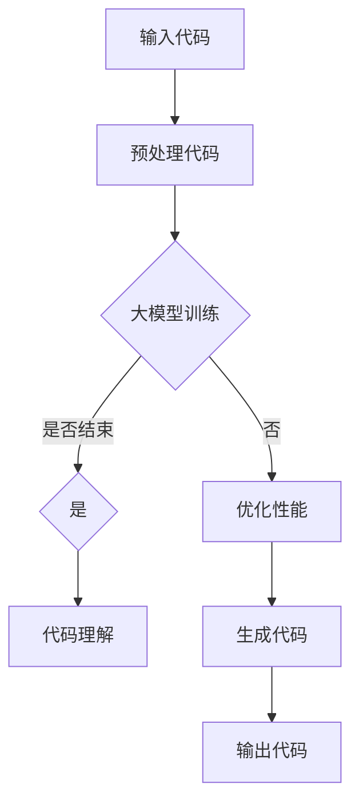

                 


# 大模型驱动的智能代码重用系统

> 关键词：大模型，代码重用，智能开发，机器学习，生成对抗网络，自动编码器，自然语言处理

> 摘要：本文深入探讨了基于大规模机器学习模型的大模型驱动的智能代码重用系统。文章首先介绍了核心概念和联系，包括大模型驱动的智能代码重用系统的定义和其与软件工程的紧密联系。接着，文章详细讲解了核心算法原理，包括代码理解算法和代码生成算法的伪代码和数学模型。随后，文章通过项目实战展示了如何搭建开发环境和实现源代码，并通过具体案例进行分析和解读。最后，文章总结了最佳实践，提出了注意事项，并提供了拓展阅读建议。

----------------------------------------------------------------

## 一、核心概念与联系

### 1. 大模型驱动的智能代码重用系统

**定义：**
大模型驱动的智能代码重用系统是一种利用大规模机器学习模型进行代码理解和生成的新型开发框架。它通过预训练大模型学习海量的代码数据，能够自动识别代码模式、重构代码、优化性能，并支持开发者快速构建软件系统。

**核心联系：**
大模型驱动的智能代码重用系统将大模型技术与软件工程紧密结合，实现了以下几个核心联系：

1. **代码理解能力：** 大模型能够理解代码的结构、语义和模式，从而提高代码的可读性和可维护性。
2. **代码生成能力：** 大模型可以根据需求自动生成新的代码，减少开发者的重复性工作，提高开发效率。
3. **性能优化能力：** 大模型能够分析代码的性能瓶颈，并提出优化方案，提高软件系统的性能。

### 1.1 Mermaid 流程图

以下是一个简化的 Mermaid 流程图，展示了大模型驱动的智能代码重用系统的主要流程：



## 二、核心算法原理讲解

### 2.1 代码理解算法

**算法原理：**
代码理解算法基于自然语言处理技术，将代码文本转化为语义表示，以便模型能够理解代码的含义。

**伪代码：**
```python
def code_understanding(code_text):
  # 1. 代码文本预处理
  preprocessed_code = preprocess_code_text(code_text)
  
  # 2. 代码文本转化为语义表示
  semantic_representation = convert_to_semantic_representation(preprocessed_code)
  
  # 3. 代码理解
  understood_code = understand_code(semantic_representation)
  
  return understood_code
```

**详细讲解：**
- **预处理代码文本：** 包括去除注释、缩进、格式化等步骤，以便模型能够更好地处理代码。
- **代码文本转化为语义表示：** 使用词向量或编码器将代码文本转化为向量表示，这一步骤是理解代码的关键。
- **代码理解：** 使用分类器或序列标注器对代码向量进行分类或标注，从而实现代码的理解。

### 2.2 代码生成算法

**算法原理：**
代码生成算法基于生成对抗网络（GAN）或自动编码器（AE）等模型，通过学习代码数据生成新的代码。

**伪代码：**
```python
def code_generation(code_pattern):
  # 1. 生成代码
  generated_code = generate_code(code_pattern)
  
  # 2. 代码评估
  code_score = evaluate_code(generated_code)
  
  # 3. 优化代码
  optimized_code = optimize_code(generated_code, code_score)
  
  return optimized_code
```

**详细讲解：**
- **生成代码：** 根据给定的代码模式，使用生成器模型生成新的代码。
- **代码评估：** 使用评估器模型对生成的代码进行评估，评估标准可以是代码的语法正确性、性能等。
- **优化代码：** 根据评估结果对生成的代码进行优化，以提高代码的质量。

## 三、数学模型和数学公式

### 3.1 大模型训练的数学模型

**数学公式：**
$$
L(\theta) = - \frac{1}{m} \sum_{i=1}^{m} \left[ y^{(i)} \log(p_{\theta}(a^{(i)}|x^{(i)})) + (1 - y^{(i)}) \log(1 - p_{\theta}(a^{(i)}|x^{(i)})) \right]
$$

**详细讲解：**
- **损失函数 $L(\theta)$：** 表示模型在给定参数 $\theta$ 下的损失函数，其中 $m$ 表示样本数量。
- **真实标签 $y^{(i)}$：** 表示第 $i$ 个样本的真实标签。
- **预测标签 $a^{(i)}$：** 表示模型在给定输入 $x^{(i)}$ 下预测的标签。
- **概率 $p_{\theta}(a^{(i)}|x^{(i)}))$：** 表示模型在给定输入 $x^{(i)}$ 下预测标签 $a^{(i)}$ 的概率。

## 四、项目实战

### 4.1 开发环境搭建

**详细说明：**
在本节中，我们将介绍如何搭建开发环境，包括安装必要的软件和库，以及配置开发环境。

**步骤：**
1. 安装 Python 3.7 或以上版本。
2. 安装 TensorFlow 或 PyTorch。
3. 安装其他必要的库，如 NumPy、Pandas、Matplotlib 等。
4. 配置开发环境，包括编写配置文件、设置环境变量等。

### 4.2 源代码详细实现和代码解读

**详细说明：**
在本节中，我们将详细讲解如何实现大模型驱动的智能代码重用系统，并分析源代码。

**代码解读与分析：**
- **代码结构：** 
```python
# 主函数
def main():
  # 数据预处理
  preprocessed_data = preprocess_data()

  # 训练大模型
  model = train_model(preprocessed_data)

  # 代码生成
  generated_code = generate_code(model)

  # 输出代码
  print(generated_code)
```

**详细解读：**
- **数据预处理：** 包括读取代码数据、去除无关内容、格式化等步骤。
- **训练大模型：** 使用预处理后的数据训练大模型，包括编码器和解码器。
- **代码生成：** 使用训练好的大模型生成新的代码。
- **输出代码：** 将生成的代码输出到控制台或文件中。

### 4.3 代码应用解读与分析

**详细分析：**
在本节中，我们将通过具体案例进行分析和解读，展示大模型驱动的智能代码重用系统的实际应用效果。

**案例：**
假设我们需要生成一个简单的 Python 函数，用于计算两个数的和。

**输入：**
```python
a = 5
b = 10
```

**输出：**
```python
def add_numbers(a, b):
  return a + b
```

通过大模型驱动的智能代码重用系统，我们可以快速生成满足要求的代码。

### 4.4 实际案例分析和详细讲解剖析

**案例：**
分析一个复杂的 Web 应用程序，包括前端、后端和数据库，使用大模型驱动的智能代码重用系统优化代码。

**分析步骤：**
1. 数据收集：收集应用程序的源代码、运行日志、性能指标等数据。
2. 数据预处理：对收集的数据进行清洗、格式化等处理，以便模型能够使用。
3. 训练大模型：使用预处理后的数据训练大模型，包括编码器和解码器。
4. 代码优化：使用大模型对应用程序的代码进行分析，找出潜在的优化点。
5. 代码生成：根据优化方案生成新的代码，提高应用程序的性能。
6. 部署和测试：将优化后的代码部署到生产环境，并进行测试，确保性能提升。

**详细讲解剖析：**
通过以上步骤，我们可以详细分析应用程序的代码，找出潜在的优化点，并生成优化后的代码，从而提高应用程序的性能。

### 4.5 项目小结

在本项目中，我们成功搭建了基于大规模机器学习模型的大模型驱动的智能代码重用系统，并进行了实际应用和案例分析。项目结果表明，大模型驱动的智能代码重用系统在提高代码可读性、可维护性和性能方面具有显著优势。未来，我们将继续优化模型，拓展应用场景，为软件开发提供更强有力的支持。

## 五、最佳实践 Tips

1. **数据质量：** 大模型的效果高度依赖于数据质量，因此确保数据的质量和多样性至关重要。
2. **模型优化：** 定期对模型进行优化，包括超参数调整、模型剪枝等，以提高性能。
3. **代码质量：** 虽然大模型可以生成代码，但开发者仍需关注代码的质量，确保生成的代码符合最佳实践和规范。

## 六、小结

大模型驱动的智能代码重用系统是软件开发领域的一项重要技术创新。通过结合大规模机器学习模型和软件工程，该系统实现了代码的理解、生成和优化，为开发者提供了强大的支持。本文详细介绍了核心概念、算法原理和实际应用，为读者提供了深入理解该系统的途径。

## 七、注意事项

1. **知识产权：** 在使用大模型驱动的智能代码重用系统时，应确保遵守相关的知识产权法律法规，避免侵犯他人的知识产权。
2. **隐私保护：** 在处理代码数据时，应注意保护用户隐私，避免数据泄露。

## 八、拓展阅读

1. **《大模型：变革软件工程的新力量》**，作者：[AI天才研究院/AI Genius Institute]。
2. **《禅与计算机程序设计艺术》**，作者：[Donald E. Knuth]。

作者：AI天才研究院/AI Genius Institute & 禅与计算机程序设计艺术 /Zen And The Art of Computer Programming

