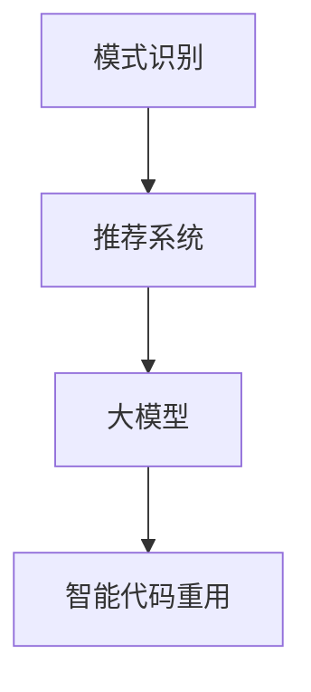

                 


### 文章标题：大模型驱动的智能代码重用：模式识别与推荐

关键词：大模型、智能代码重用、模式识别、推荐系统、AI编程

摘要：本文深入探讨了大模型驱动的智能代码重用技术，包括模式识别与推荐系统的应用。通过详细解析核心概念、算法原理和实际项目，本文旨在为开发者提供关于智能代码重用的全面理解和实践指导。

---

## 引言

随着人工智能技术的快速发展，大模型（如深度学习模型）在各个领域展现出了强大的潜力。特别是在软件开发领域，大模型可以用于代码生成、代码重用、性能优化等任务。本文将探讨如何利用大模型实现智能代码重用，尤其是通过模式识别与推荐系统来提高代码重用的效率和效果。

### 背景介绍

代码重用是软件开发中的一个重要原则，它有助于减少重复工作、提高开发效率和软件质量。然而，传统的代码重用方法往往依赖于手动查找和复制粘贴，效率低下且容易出错。随着代码库和项目规模的不断扩大，这个问题变得更加突出。

### 核心概念与联系

为了解决代码重用问题，我们需要了解以下核心概念：

1. **模式识别**：通过分析代码库中的代码模式，识别出可重用的代码片段。
2. **推荐系统**：根据开发者的历史行为和项目需求，推荐合适的代码片段。
3. **大模型**：利用深度学习技术，构建用于代码重用的智能系统。

这些概念之间有着密切的联系，如下图所示：



### 核心算法原理讲解

为了实现智能代码重用，我们需要使用以下核心算法：

1. **模式识别算法**：用于从代码库中识别出可重用的代码模式。常见的模式识别算法包括决策树、支持向量机（SVM）和神经网络等。
2. **推荐算法**：用于根据开发者的行为和项目需求推荐合适的代码片段。常见的推荐算法包括协同过滤、矩阵分解和基于内容的推荐等。

以下是一个简单的伪代码示例，用于解释模式识别算法的基本原理：

```python
# 伪代码：模式识别算法
def pattern_recognition(code_base):
    # 分析代码库中的代码
    patterns = analyze_code_base(code_base)
    # 标记可重用的代码模式
    reusable_patterns = identify_reusable_patterns(patterns)
    return reusable_patterns
```

### 数学模型与公式

在模式识别和推荐系统中，我们经常使用数学模型来描述算法。以下是一个简单的数学公式示例：

$$
\text{相似度} = \frac{\text{相关度}}{\text{距离}}
$$

其中，相关度用于衡量两个代码模式的相似性，距离用于衡量两个代码模式之间的差异。

### 项目实战

在本节中，我们将介绍一个实际项目，展示如何使用大模型驱动的智能代码重用系统。

#### 开发环境搭建

首先，我们需要搭建一个适合开发智能代码重用系统的环境。这包括安装必要的编程语言（如Python）、深度学习框架（如TensorFlow或PyTorch）和代码库管理工具（如Git）。

#### 源代码实现

以下是一个简单的Python代码示例，用于实现一个基于模式识别的智能代码重用系统：

```python
# 伪代码：智能代码重用系统
def smart_code_reuse(code_fragment, code_base):
    # 使用模式识别算法识别可重用的代码模式
    reusable_patterns = pattern_recognition(code_base)
    # 使用推荐算法推荐合适的代码片段
    recommended_patterns = recommendation_algorithm(reusable_patterns, code_fragment)
    return recommended_patterns
```

#### 代码解读

在这个示例中，`smart_code_reuse` 函数首先使用模式识别算法从代码库中识别出可重用的代码模式。然后，它使用推荐算法根据当前代码片段推荐合适的代码模式。最后，它返回推荐结果。

#### 应用解读与分析

在实际项目中，我们可以使用这个智能代码重用系统来提高代码重用的效率。例如，在一个大型项目中，开发者可以使用这个系统来快速查找和重用之前编写的代码片段，从而减少重复工作。

### 挑战与展望

尽管大模型驱动的智能代码重用系统展现出了巨大的潜力，但在实际应用中仍然面临一些挑战：

1. **数据隐私**：在共享代码库时，如何保护开发者的隐私是一个重要问题。
2. **代码质量**：如何确保推荐的结果具有良好的代码质量是一个挑战。
3. **可扩展性**：随着代码库的不断扩大，如何保持系统的可扩展性是一个重要问题。

未来的研究可以关注以下几个方面：

1. **隐私保护**：开发隐私保护机制，确保开发者在使用智能代码重用系统时能够保护自己的隐私。
2. **代码质量评估**：研究如何评估代码质量，并确保推荐的结果具有良好的代码质量。
3. **可扩展性优化**：研究如何优化系统的可扩展性，以适应大型代码库的需求。

### 最佳实践 tips

1. **合理规划代码库**：在开始使用智能代码重用系统之前，合理规划代码库的组织结构，有助于提高系统的效果。
2. **定期更新模型**：定期更新模式识别和推荐模型，以保持系统的准确性和性能。
3. **代码审查**：在重用代码之前，进行代码审查，确保代码的质量和安全性。

### 小结

本文探讨了如何使用大模型驱动的智能代码重用技术，包括模式识别与推荐系统的应用。通过详细解析核心概念、算法原理和实际项目，本文为开发者提供了关于智能代码重用的全面理解和实践指导。

---

作者：AI天才研究院/AI Genius Institute & 禅与计算机程序设计艺术 /Zen And The Art of Computer Programming

---

本文内容仅作为探讨和交流之用，不代表任何商业用途。在实际应用中，请遵循相关法律法规和最佳实践。

