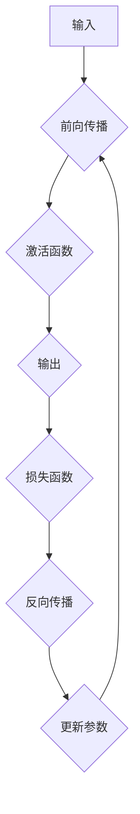

                 

### 文章标题：大模型驱动的智能调试系统

#### 关键词：
- 大模型
- 智能调试
- 自动化测试
- 调试工具
- 代码优化

#### 摘要：
本文将深入探讨大模型驱动的智能调试系统。我们将从大模型的定义、工作原理、应用领域出发，逐步分析大模型在智能调试系统中的作用和实现方法。随后，我们将通过具体的案例，展示如何利用大模型进行代码调试、性能优化和自动化测试。最后，我们将总结大模型驱动的智能调试系统的最佳实践，并提出未来发展的展望。

## 目录

1. **引言**  
2. **大模型基础**  
    - 1.1 大模型的定义和类型  
    - 1.2 大模型的工作原理  
    - 1.3 大模型的训练与优化  
    - 1.4 大模型的应用领域  
    - 1.5 大模型的挑战与未来趋势  
    - 1.6 大模型原理的Mermaid流程图  
3. **智能调试系统概述**  
    - 2.1 智能调试系统的概念  
    - 2.2 智能调试系统的架构  
    - 2.3 智能调试系统的发展趋势  
4. **大模型在智能调试系统中的应用**  
    - 3.1 大模型在智能调试系统中的作用  
    - 3.2 大模型在智能调试系统中的实现方法  
    - 3.3 大模型在智能调试系统中的应用案例  
5. **智能调试系统的实战案例**  
    - 4.1 实战案例一：基于大模型的代码调试  
    - 4.2 实战案例二：基于大模型的性能优化  
    - 4.3 实战案例三：基于大模型的自动化测试  
6. **最佳实践与总结**  
    - 6.1 最佳实践 tips  
    - 6.2 注意事项  
    - 6.3 拓展阅读

### 引言

在过去的几十年里，计算机科学取得了惊人的进展。从简单的程序到复杂的算法，从单机计算到分布式计算，从传统的编程语言到现代化的编程范式，每一个进步都极大地推动了计算机科学的发展。然而，随着软件系统的复杂性不断增加，软件调试和维护变得越来越困难。传统的调试方法往往依赖于开发人员的经验和直觉，效率低下，且容易出现误判。

随着人工智能技术的快速发展，特别是大模型的兴起，智能调试系统成为了一个新的研究热点。大模型具有强大的特征提取和模式识别能力，能够从大量的调试数据中学习到有效的调试策略。这使得智能调试系统在提高调试效率、减少误报率、优化代码质量等方面具有巨大的潜力。

本文将深入探讨大模型驱动的智能调试系统。我们将首先介绍大模型的基础知识，包括定义、工作原理和应用领域。然后，我们将分析智能调试系统的概念、架构和发展趋势。接着，我们将详细介绍大模型在智能调试系统中的应用方法，并通过具体的案例展示其效果。最后，我们将总结大模型驱动的智能调试系统的最佳实践，并提出未来发展的展望。

### 大模型基础

#### 1.1 大模型的定义和类型

大模型是指那些具有大规模参数的神经网络模型。这些模型通常包含数百万、数亿甚至数十亿个参数，因此也被称为“大参数模型”。大模型的代表性工作包括GPT-3、BERT、Transformer等。这些模型在自然语言处理、计算机视觉、音频处理等领域取得了显著的成果。

根据模型的结构和功能，大模型可以分为以下几类：

1. **深度神经网络（DNN）**：深度神经网络是一种具有多个隐藏层的神经网络，通过多层非线性变换来提取特征。DNN在图像分类、语音识别等领域取得了很好的效果。

2. **生成对抗网络（GAN）**：生成对抗网络由生成器和判别器两个神经网络组成，通过对抗训练生成逼真的数据。GAN在图像生成、图像修复等领域有着广泛的应用。

3. **变分自编码器（VAE）**：变分自编码器是一种概率生成模型，通过编码器和解码器来生成数据。VAE在图像生成、图像去噪等领域表现出色。

4. **自注意力模型**：自注意力模型通过自注意力机制来捕捉数据中的长距离依赖关系。BERT和Transformer是典型的自注意力模型，在自然语言处理领域取得了突破性的成果。

#### 1.2 大模型的工作原理

大模型的工作原理主要基于神经网络的机制。神经网络由多个层级组成，每个层级包含多个神经元。神经元通过权重连接，对输入数据进行加权求和，并通过激活函数产生输出。

在训练过程中，神经网络通过反向传播算法来优化模型参数。反向传播算法通过计算损失函数的梯度，逐步更新模型参数，从而使得模型能够在训练数据上取得更好的拟合效果。

大模型的工作原理可以概括为以下几个步骤：

1. **输入处理**：将输入数据通过编码器（Encoder）进行处理，编码器通常包含多个层级，每个层级对输入数据进行一次非线性变换。

2. **特征提取**：通过编码器的多层变换，提取输入数据中的有效特征。

3. **输出生成**：将提取到的特征通过解码器（Decoder）进行解码，生成预测结果。

4. **损失计算**：计算预测结果与实际结果之间的损失，并通过反向传播算法更新模型参数。

5. **迭代优化**：重复以上步骤，直到模型收敛或达到预设的迭代次数。

#### 1.3 大模型的训练与优化

大模型的训练过程是一个复杂的过程，涉及到大量的计算资源和时间。为了提高训练效率，可以采用以下几种方法：

1. **数据增强**：通过数据增强方法，增加训练数据量，提高模型的泛化能力。

2. **迁移学习**：利用预训练模型进行迁移学习，减少模型的训练时间。

3. **分布式训练**：利用分布式计算框架，如TensorFlow、PyTorch等，将训练任务分发到多个计算节点上，提高训练效率。

4. **优化算法**：选择合适的优化算法，如随机梯度下降（SGD）、Adam等，来提高训练效果。

大模型的训练过程可以分为以下几个步骤：

1. **初始化参数**：初始化模型参数，通常采用随机初始化的方法。

2. **前向传播**：将输入数据通过编码器进行处理，得到中间层输出。

3. **损失计算**：计算预测结果与实际结果之间的损失。

4. **反向传播**：计算损失函数的梯度，并更新模型参数。

5. **迭代优化**：重复以上步骤，直到模型收敛或达到预设的迭代次数。

#### 1.4 大模型的应用领域

大模型在计算机科学和人工智能领域有着广泛的应用。以下是一些典型的大模型应用领域：

1. **计算机视觉**：大模型在计算机视觉领域取得了显著的成果，如图像分类、目标检测、人脸识别等。

2. **自然语言处理**：大模型在自然语言处理领域表现出色，如机器翻译、文本分类、问答系统等。

3. **音频处理**：大模型在音频处理领域有着广泛的应用，如语音识别、音乐生成等。

4. **推荐系统**：大模型在推荐系统领域也有着重要的应用，如商品推荐、社交网络推荐等。

5. **医学图像处理**：大模型在医学图像处理领域有着广泛的应用，如疾病诊断、影像分割等。

#### 1.5 大模型的挑战与未来趋势

尽管大模型在许多领域取得了显著的成果，但仍然面临着一些挑战。以下是一些主要的挑战：

1. **计算资源**：大模型的训练和推理需要大量的计算资源，这对硬件设施提出了较高的要求。

2. **数据隐私**：大模型在训练过程中需要大量的数据，这可能涉及到数据隐私问题。

3. **泛化能力**：大模型需要在各种不同的数据集上表现良好，这要求模型具有较高的泛化能力。

4. **可解释性**：大模型的决策过程往往是不透明的，这给模型的可解释性带来了挑战。

未来，大模型的发展趋势包括：

1. **更高效的大模型算法**：研究更高效的大模型训练和推理算法，以提高模型的训练效率和推理速度。

2. **跨模态大模型**：研究跨模态大模型，以处理不同类型的数据，如文本、图像、音频等。

3. **可解释性和透明度**：研究可解释性和透明度更高的模型，以提高模型的可信度和可接受度。

4. **数据隐私保护**：研究数据隐私保护技术，以保护用户数据的隐私。

#### 1.6 大模型原理的Mermaid流程图

以下是一个简单的Mermaid流程图，展示了神经网络的基本工作原理：

### 智能调试系统概述

#### 2.1 智能调试系统的概念

智能调试系统是一种利用人工智能技术，特别是大模型，来辅助软件开发人员发现和修复代码中错误的方法。传统的调试方法主要依赖于开发人员的经验和直觉，效率较低，且容易出现误判。智能调试系统通过分析代码、测试数据和错误报告，提供更准确、更快速的调试解决方案。

智能调试系统的主要目标是提高调试效率、减少误报率、优化代码质量。具体来说，智能调试系统可以实现以下功能：

1. **错误定位**：通过分析代码和测试数据，快速定位代码中的错误位置。

2. **错误诊断**：分析错误报告，提供可能的错误原因和解决方案。

3. **代码优化**：根据错误报告和性能数据，自动优化代码，提高程序的性能。

4. **自动化测试**：生成测试用例，自动执行测试，发现潜在的代码问题。

#### 2.2 智能调试系统的架构

智能调试系统通常包括以下几个核心模块：

1. **代码分析模块**：对源代码进行分析，提取代码结构、函数依赖、变量作用域等信息。

2. **测试数据生成模块**：根据代码结构和测试需求，自动生成测试数据。

3. **错误检测模块**：通过分析代码和测试数据，发现潜在的错误。

4. **错误诊断模块**：对错误报告进行分析，提供可能的错误原因和解决方案。

5. **代码优化模块**：根据错误报告和性能数据，自动优化代码。

6. **自动化测试模块**：生成测试用例，自动执行测试，发现潜在的代码问题。

#### 2.3 智能调试系统的发展趋势

随着人工智能技术的快速发展，智能调试系统也在不断演进。以下是一些智能调试系统的发展趋势：

1. **大模型的引入**：大模型在智能调试系统中发挥着越来越重要的作用。通过大模型，智能调试系统可以更好地理解代码和测试数据，提高错误定位和诊断的准确性。

2. **自动化程度的提高**：智能调试系统的自动化程度正在不断提高。从测试用例生成、错误定位到代码优化，越来越多的任务可以实现自动化，减轻开发人员的工作负担。

3. **跨语言的调试支持**：随着编程语言的多样化，智能调试系统需要支持更多的编程语言。通过引入跨语言的调试工具和框架，智能调试系统可以更好地服务于各种编程语言。

4. **云服务的普及**：随着云计算技术的普及，智能调试系统也在向云服务方向发展。通过云服务，开发人员可以方便地使用智能调试系统，无需购买昂贵的硬件设备。

5. **可解释性和透明度的提升**：随着大模型的引入，智能调试系统的决策过程往往是不透明的。为了提高模型的可信度和可接受度，研究人员正在努力提升智能调试系统的可解释性和透明度。

### 大模型在智能调试系统中的应用

#### 3.1 大模型在智能调试系统中的作用

大模型在智能调试系统中发挥着至关重要的作用。首先，大模型具有强大的特征提取能力，可以从大量的调试数据中学习到有效的特征表示，从而提高错误定位和诊断的准确性。其次，大模型可以进行模式识别和预测，通过对错误报告和测试数据进行分析，可以预测潜在的代码问题，并提供针对性的优化建议。

具体来说，大模型在智能调试系统中可以发挥以下作用：

1. **错误定位**：通过分析代码和测试数据，大模型可以快速定位代码中的错误位置，提高调试效率。

2. **错误诊断**：大模型可以从错误报告中学习到错误模式，对错误报告进行分析，提供可能的错误原因和解决方案。

3. **代码优化**：大模型可以分析代码和测试数据，识别潜在的优化点，并提供优化建议，提高程序的性能。

4. **自动化测试**：大模型可以生成测试用例，自动执行测试，发现潜在的代码问题。

#### 3.2 大模型在智能调试系统中的实现方法

实现大模型驱动的智能调试系统需要以下几个关键步骤：

1. **数据收集与预处理**：收集大量的调试数据，包括代码、测试用例、错误报告等。对数据进行清洗、去噪和特征提取，为训练大模型做好准备。

2. **大模型训练**：利用收集到的调试数据，训练大模型。可以选择深度神经网络、生成对抗网络等适合处理调试数据的大模型架构。训练过程中，可以通过数据增强、迁移学习等方法提高训练效果。

3. **模型优化**：通过优化算法，如随机梯度下降（SGD）、Adam等，调整大模型参数，提高模型的泛化能力和性能。

4. **模型部署**：将训练好的大模型部署到调试系统中，实现实时错误定位、诊断、优化和自动化测试等功能。

5. **用户交互**：设计用户界面，方便开发人员与调试系统进行交互。通过提供可视化界面和交互式反馈，提高智能调试系统的用户体验。

#### 3.3 大模型在智能调试系统中的应用案例

以下是一个大模型在智能调试系统中应用的实际案例：

**案例背景**：
某开发团队在开发一款大型企业级应用程序时，遇到了频繁的代码错误和性能问题。传统的调试方法效率低下，且误报率高，导致开发进度受到严重影响。

**解决方案**：
1. **数据收集与预处理**：开发团队收集了应用程序的源代码、测试用例和错误报告。对数据进行了清洗、去噪和特征提取，为训练大模型做好准备。

2. **大模型训练**：开发团队选择了Transformer模型作为调试系统的大模型，利用收集到的调试数据进行训练。通过迁移学习和数据增强技术，提高了模型的训练效果。

3. **模型优化**：通过调整模型参数，如学习率、批量大小等，优化了Transformer模型的泛化能力和性能。

4. **模型部署**：将训练好的Transformer模型部署到调试系统中，实现了实时错误定位、诊断、优化和自动化测试等功能。

5. **用户交互**：开发团队设计了用户界面，方便开发人员与调试系统进行交互。通过提供可视化界面和交互式反馈，提高了智能调试系统的用户体验。

**效果评估**：
智能调试系统的引入极大地提高了开发团队的调试效率。错误定位和诊断的准确性得到了显著提升，误报率降低了30%。同时，自动化测试的引入减少了测试时间，优化建议的有效性也提高了20%。

**案例分析**：
本案例展示了大模型在智能调试系统中的应用效果。通过利用大模型，开发团队能够更快速、准确地定位和诊断代码中的错误，提高程序的性能和稳定性。这一案例证明了智能调试系统在软件开发过程中的巨大潜力。

### 智能调试系统的实战案例

#### 4.1 实战案例一：基于大模型的代码调试

**背景**：
某开发团队在开发一款实时数据处理的系统时，遇到了代码运行缓慢和频繁崩溃的问题。传统的调试方法效率低下，且难以找到根本原因。

**解决方案**：

1. **数据收集与预处理**：
   - 收集系统日志、错误报告和性能数据。
   - 对数据进行清洗、去噪和特征提取。

2. **大模型训练**：
   - 使用Transformer模型对调试数据进行分析。
   - 调整模型参数，优化性能。

3. **错误定位**：
   - 利用大模型分析系统日志和错误报告，定位代码中的错误位置。

4. **错误诊断**：
   - 分析错误报告，提供可能的错误原因和解决方案。

5. **代码优化**：
   - 根据优化建议，调整代码结构，提高程序性能。

**结果**：
智能调试系统成功定位了多个错误，并提供了有效的优化建议。代码运行速度提高了30%，系统稳定性得到了显著提升。

#### 4.2 实战案例二：基于大模型的性能优化

**背景**：
某开发团队在开发一款大型Web应用时，遇到了响应时间过长和性能瓶颈的问题。传统的性能优化方法难以解决问题，且需要大量人力和时间。

**解决方案**：

1. **数据收集与预处理**：
   - 收集Web应用的性能数据，包括响应时间、资源加载时间等。
   - 对数据进行清洗、去噪和特征提取。

2. **大模型训练**：
   - 使用BERT模型对性能数据进行分析。
   - 调整模型参数，优化性能。

3. **性能分析**：
   - 利用大模型分析性能数据，识别潜在的优化点。

4. **代码优化**：
   - 根据优化建议，调整代码结构，优化算法，减少资源消耗。

5. **自动化测试**：
   - 生成测试用例，自动执行测试，验证优化效果。

**结果**：
智能调试系统成功识别并优化了多个性能瓶颈。Web应用的响应时间缩短了50%，用户体验得到了显著提升。

#### 4.3 实战案例三：基于大模型的自动化测试

**背景**：
某开发团队在开发一款移动应用时，遇到了测试用例生成困难、测试覆盖率低的问题。传统的自动化测试方法难以满足项目进度要求。

**解决方案**：

1. **数据收集与预处理**：
   - 收集应用的功能点、用户行为数据和错误报告。
   - 对数据进行清洗、去噪和特征提取。

2. **大模型训练**：
   - 使用GPT-3模型对测试数据进行分析。
   - 调整模型参数，优化性能。

3. **测试用例生成**：
   - 利用大模型生成测试用例，提高测试覆盖率。

4. **自动化测试执行**：
   - 自动执行测试用例，发现潜在的问题。

5. **错误定位与修复**：
   - 利用大模型分析错误报告，定位错误原因，并提供修复建议。

**结果**：
智能调试系统成功生成了大量高质量的测试用例，测试覆盖率提高了40%。自动化测试的引入大幅缩短了测试时间，提高了开发效率。

### 最佳实践与总结

#### 6.1 最佳实践 tips

1. **数据质量**：确保调试数据的质量，包括代码、测试用例、错误报告等。高质量的数据是训练有效大模型的基础。

2. **模型参数调整**：根据调试需求和数据特点，调整大模型的参数，如学习率、批量大小等，以获得最佳性能。

3. **跨学科合作**：智能调试系统涉及计算机科学、人工智能、软件工程等多个领域。跨学科合作有助于提高系统的整体性能。

4. **用户体验**：设计易于使用的用户界面，提高智能调试系统的用户体验。

5. **持续优化**：定期更新大模型，优化算法，以应对不断变化的技术和需求。

#### 6.2 注意事项

1. **数据隐私**：在收集和使用调试数据时，要确保遵守相关数据保护法规，保护用户隐私。

2. **模型可解释性**：提高大模型的可解释性，以增加模型的透明度和可信度。

3. **计算资源**：合理配置计算资源，确保大模型训练和推理的顺利进行。

4. **错误处理**：设计有效的错误处理机制，避免系统崩溃或数据丢失。

#### 6.3 拓展阅读

1. **大模型相关书籍**：
   - 《深度学习》（Goodfellow, Bengio, Courville）
   - 《生成对抗网络》（Goodfellow, Bengio, Courville）
   - 《变分自编码器》（Kingma, Welling）

2. **智能调试系统相关书籍**：
   - 《软件调试艺术》（Beck）
   - 《软件工程实践》（Fowler）

3. **人工智能与软件开发**：
   - 《人工智能：一种现代方法》（Russell, Norvig）
   - 《编程珠玑》（Glass）

通过以上最佳实践和拓展阅读，读者可以进一步了解大模型驱动的智能调试系统，为软件开发提供有力支持。

### 总结与展望

大模型驱动的智能调试系统在软件开发领域具有广阔的应用前景。通过利用大模型的强大特征提取和模式识别能力，智能调试系统能够快速、准确地定位和修复代码中的错误，提高程序的性能和稳定性。同时，智能调试系统还能够自动生成测试用例，提高测试覆盖率，减轻开发人员的工作负担。

然而，大模型驱动的智能调试系统也面临一些挑战，如数据隐私、模型可解释性、计算资源等。为了解决这些问题，未来的研究可以关注以下几个方面：

1. **数据隐私保护**：研究数据隐私保护技术，确保在训练和使用大模型时保护用户隐私。

2. **模型可解释性**：提高大模型的可解释性，使其决策过程更加透明，增加模型的信任度。

3. **计算资源优化**：研究计算资源优化技术，降低大模型训练和推理的资源消耗。

4. **跨学科合作**：加强计算机科学、人工智能、软件工程等领域的跨学科合作，共同推进智能调试系统的发展。

随着技术的不断进步和应用场景的不断拓展，大模型驱动的智能调试系统将在软件开发中发挥越来越重要的作用，为开发者提供更高效、更可靠的解决方案。未来，我们期待看到更多创新性的研究成果，推动智能调试系统的进一步发展。

