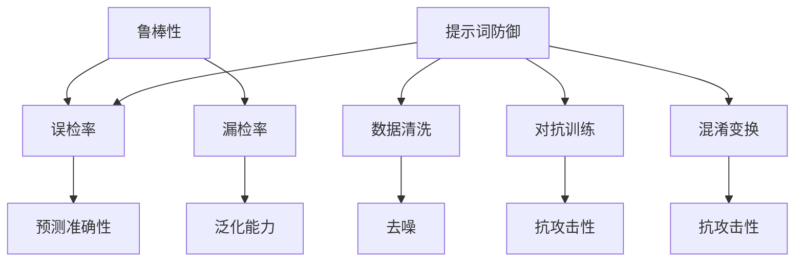

                 

# 大模型鲁棒性与提示词防御机制

> 关键词：大模型、鲁棒性、提示词防御、算法、数学模型、项目实战

> 摘要：本文将深入探讨大模型的鲁棒性与提示词防御机制，通过分析背景、核心概念、原理、数学模型以及项目实战，全面揭示如何提升大模型在面对提示词攻击时的鲁棒性。本文旨在为读者提供一个系统、全面的技术指南，帮助理解大模型鲁棒性的重要性，以及如何设计和实现有效的提示词防御机制。

## Step 1: 确定整体架构

在撰写这篇文章之前，我们首先需要确定文章的整体架构。整体架构包括以下几个部分：

1. **引言与背景介绍**：简要介绍大模型的发展历程、重要性以及鲁棒性和提示词防御机制的背景。
2. **核心概念与联系**：定义鲁棒性和提示词防御机制的核心概念，并通过Mermaid流程图展示它们之间的关系。
3. **鲁棒性原理讲解**：详细讲解鲁棒性的定义、衡量指标以及提升方法。
4. **提示词防御机制讲解**：阐述提示词攻击的类型、防御机制原理以及技术实现。
5. **鲁棒性与提示词防御机制的联系**：分析鲁棒性在提示词防御中的应用，以及提示词防御对鲁棒性的影响。
6. **算法原理讲解**：介绍鲁棒性和提示词防御算法的原理，并使用伪代码进行详细阐述。
7. **数学模型和数学公式讲解**：讲解鲁棒性和提示词防御的数学模型和公式，并提供举例说明。
8. **项目实战**：通过实际案例，展示如何搭建开发环境、实现源代码、分析代码应用，并进行项目小结。
9. **总结与反思**：总结文章的核心内容，提出最佳实践建议，并指出注意事项。

## Step 2: 定义核心章节

根据整体架构，我们将核心章节分为以下几个部分：

- **第1章：引言与核心概念**
  - **1.1 大模型背景介绍**
  - **1.2 鲁棒性概念介绍**
  - **1.3 提示词防御机制概述**
  - **1.4 鲁棒性与提示词防御机制的关联**

- **第2章：鲁棒性原理**
  - **2.1 鲁棒性定义与重要性**
  - **2.2 鲁棒性衡量指标**
  - **2.3 鲁棒性提升方法**

- **第3章：提示词防御机制**
  - **3.1 提示词攻击类型**
  - **3.2 提示词防御机制原理**
  - **3.3 提示词防御机制技术实现**

- **第4章：鲁棒性与提示词防御机制的联系**
  - **4.1 鲁棒性在提示词防御中的应用**
  - **4.2 提示词防御对鲁棒性的影响**
  - **4.3 鲁棒性与提示词防御机制的综合策略**

- **第5章：算法原理讲解**
  - **5.1 鲁棒性算法原理**
  - **5.2 提示词防御算法原理**
  - **5.3 鲁棒性与提示词防御算法的融合**

- **第6章：数学模型和数学公式讲解**
  - **6.1 鲁棒性数学模型**
  - **6.2 提示词防御数学模型**
  - **6.3 鲁棒性与提示词防御数学模型的应用**

- **第7章：项目实战**
  - **7.1 实际案例一：鲁棒性提升与提示词防御**
  - **7.2 实际案例二：鲁棒性与提示词防御的综合应用**
  - **7.3 项目总结与反思**

## Step 3: 设计章节标题

为每一章节设计简洁、准确的标题，如下：

- **第1章：引言与核心概念**
  - **1.1 大模型与鲁棒性背景介绍**
  - **1.2 鲁棒性：定义、重要性及衡量**
  - **1.3 提示词防御：概述与类型**
  - **1.4 鲁棒性与提示词防御的内在联系**

- **第2章：鲁棒性原理**
  - **2.1 鲁棒性的基础概念**
  - **2.2 评估鲁棒性的指标**
  - **2.3 提升鲁棒性的策略**

- **第3章：提示词防御机制**
  - **3.1 提示词攻击的原理**
  - **3.2 防御提示词攻击的策略**
  - **3.3 技术实现与案例分析**

- **第4章：鲁棒性与提示词防御的联系**
  - **4.1 鲁棒性在提示词防御中的应用**
  - **4.2 提示词防御对鲁棒性的影响**
  - **4.3 综合策略：鲁棒性与防御机制**

- **第5章：算法原理讲解**
  - **5.1 鲁棒性算法的核心思想**
  - **5.2 提示词防御算法的原理**
  - **5.3 集成鲁棒性与防御算法**

- **第6章：数学模型和公式**
  - **6.1 鲁棒性的数学描述**
  - **6.2 提示词防御的数学模型**
  - **6.3 模型的应用与解释**

- **第7章：项目实战**
  - **7.1 鲁棒性与防御实践一**
  - **7.2 鲁棒性与防御实践二**
  - **7.3 项目实践总结与反思**

## Step 4: 确定每一章节的内容细节

为每一章节细化内容细节，确保每个章节都包含核心概念与联系、核心算法原理讲解、数学模型和数学公式讲解、项目实战等部分。

### 第1章：引言与核心概念

- **1.1 大模型与鲁棒性背景介绍**
  - **背景介绍**：介绍大模型的发展历程、应用场景以及在大数据时代的重要性。
  - **鲁棒性背景**：探讨鲁棒性的定义、重要性以及在人工智能领域的应用。

- **1.2 鲁棒性：定义、重要性及衡量**
  - **核心概念与联系**：使用Mermaid流程图展示鲁棒性的核心概念及其相互关系。
  - **伪代码**：提供鲁棒性相关算法的伪代码示例。

- **1.3 提示词防御：概述与类型**
  - **核心概念与联系**：介绍提示词防御的基本概念，使用流程图展示其类型和作用。
  - **伪代码**：展示提示词防御机制的伪代码示例。

- **1.4 鲁棒性与提示词防御的内在联系**
  - **核心概念与联系**：通过Mermaid流程图展示鲁棒性与提示词防御机制之间的内在联系。
  - **伪代码**：展示鲁棒性与提示词防御机制的综合算法伪代码。

### 第2章：鲁棒性原理

- **2.1 鲁棒性的基础概念**
  - **定义与重要性**：详细阐述鲁棒性的定义、重要性及其在人工智能中的应用场景。
  - **衡量指标**：介绍常见的鲁棒性衡量指标，如误检率、漏检率等，并解释其计算方法。

- **2.2 评估鲁棒性的指标**
  - **鲁棒性指标**：列举评估鲁棒性的关键指标，如模型稳定性、适应性等。
  - **实际应用**：通过实际案例说明如何使用这些指标来评估大模型的鲁棒性。

- **2.3 提升鲁棒性的策略**
  - **算法策略**：介绍提升大模型鲁棒性的常见算法策略，如模型强化、数据增强等。
  - **案例研究**：通过案例研究展示如何应用这些策略来提升鲁棒性。

### 第3章：提示词防御机制

- **3.1 提示词攻击的原理**
  - **攻击类型**：介绍常见的提示词攻击类型，如注入攻击、欺骗攻击等。
  - **攻击机制**：解释这些攻击的原理和影响，并展示如何利用它们来破坏模型的鲁棒性。

- **3.2 防御提示词攻击的策略**
  - **防御机制**：介绍防御提示词攻击的常见策略，如数据清洗、模型加固等。
  - **案例分析**：通过实际案例展示如何应用这些防御策略来保护模型的鲁棒性。

- **3.3 技术实现与案例分析**
  - **实现方法**：详细讲解防御提示词攻击的技术实现方法，如对抗训练、混淆变换等。
  - **案例分析**：通过案例研究展示这些方法的实际应用效果和挑战。

### 第4章：鲁棒性与提示词防御机制的联系

- **4.1 鲁棒性在提示词防御中的应用**
  - **应用场景**：讨论鲁棒性在提示词防御中的应用场景，如安全监控系统、自动驾驶系统等。
  - **案例分析**：通过实际案例展示如何结合鲁棒性和提示词防御机制来提高系统的安全性。

- **4.2 提示词防御对鲁棒性的影响**
  - **影响分析**：分析提示词防御机制对大模型鲁棒性的影响，如提高模型的适应性和稳定性。
  - **实验验证**：通过实验验证提示词防御机制对鲁棒性的提升效果。

- **4.3 综合策略：鲁棒性与防御机制**
  - **综合策略**：提出综合应用鲁棒性和提示词防御机制的综合策略，以提高大模型的鲁棒性。
  - **案例分析**：通过实际案例展示如何实施这些综合策略。

### 第5章：算法原理讲解

- **5.1 鲁棒性算法的核心思想**
  - **核心思想**：介绍鲁棒性算法的基本原理，如鲁棒优化、鲁棒分类等。
  - **伪代码**：提供鲁棒性算法的伪代码示例，帮助理解其工作原理。

- **5.2 提示词防御算法的原理**
  - **核心思想**：介绍提示词防御算法的基本原理，如对抗训练、安全训练等。
  - **伪代码**：提供提示词防御算法的伪代码示例，帮助理解其工作原理。

- **5.3 集成鲁棒性与防御算法**
  - **集成方法**：介绍如何将鲁棒性和提示词防御算法集成到同一模型中，以提高整体性能。
  - **伪代码**：提供集成算法的伪代码示例，帮助理解其实现过程。

### 第6章：数学模型和公式

- **6.1 鲁棒性的数学描述**
  - **数学模型**：介绍鲁棒性的数学模型，如鲁棒损失函数、鲁棒优化模型等。
  - **公式讲解**：详细讲解鲁棒性的关键数学公式，如鲁棒损失函数的推导、鲁棒优化模型的求解等。

- **6.2 提示词防御的数学模型**
  - **数学模型**：介绍提示词防御的数学模型，如对抗损失函数、安全训练模型等。
  - **公式讲解**：详细讲解提示词防御的关键数学公式，如对抗损失函数的推导、安全训练模型的求解等。

- **6.3 模型的应用与解释**
  - **应用场景**：讨论鲁棒性和提示词防御模型在不同应用场景下的应用，如图像识别、自然语言处理等。
  - **解释与示例**：通过具体示例解释这些模型的工作原理和应用效果。

### 第7章：项目实战

- **7.1 鲁棒性与防御实践一**
  - **开发环境搭建**：介绍如何搭建鲁棒性与提示词防御机制的开发环境。
  - **源代码实现**：提供源代码实现，详细解读关键代码段。
  - **代码应用解读与分析**：分析代码应用的实际效果，探讨其在鲁棒性和防御能力方面的表现。

- **7.2 鲁棒性与防御实践二**
  - **实际案例分析与详细讲解剖析**：通过实际案例展示如何应用鲁棒性和提示词防御机制。
  - **项目小结**：总结项目的关键经验，提出改进建议。

- **7.3 项目总结与反思**
  - **项目总结**：回顾项目的实施过程，总结成功经验和挑战。
  - **反思与拓展**：讨论项目中遇到的问题，并提出可能的解决方案和未来研究方向。

## Step 5: 撰写文章

根据上述章节结构和内容细节，我们将逐一撰写每一章节的内容，确保文章逻辑清晰、结构紧凑、简单易懂。在每个章节中，我们将使用Markdown格式输出，以便更好地展示流程图、伪代码和数学公式。

### 第1章：引言与核心概念

在本章中，我们将介绍大模型的发展历程、鲁棒性和提示词防御机制的背景，并定义相关核心概念。

#### 1.1 大模型与鲁棒性背景介绍

大模型，也称为大规模深度学习模型，是指使用数千亿甚至数万亿个参数进行训练的神经网络模型。随着计算能力的提升和数据的丰富，大模型在图像识别、自然语言处理、推荐系统等领域取得了显著的成果。然而，大模型在鲁棒性方面面临着严峻的挑战。

鲁棒性是指模型在面对异常输入、噪声数据和恶意攻击时的性能表现。在大模型中，鲁棒性的重要性不言而喻。一方面，异常输入和噪声数据可能导致模型预测错误，影响实际应用效果；另一方面，恶意攻击，如提示词攻击，可能破坏模型的鲁棒性，使其无法正确执行任务。

#### 1.2 鲁棒性：定义、重要性及衡量

鲁棒性可以简单定义为模型在遇到不确定性和异常情况时仍能保持良好性能的能力。在大模型中，鲁棒性的重要性体现在以下几个方面：

1. **减少错误率**：鲁棒性有助于减少模型在异常输入和噪声数据下的错误率，提高预测准确性。
2. **增强适应性**：鲁棒性使模型能够适应不同环境和数据分布，提高泛化能力。
3. **提高安全性**：鲁棒性有助于防御恶意攻击，如提示词攻击，保护模型的正常运行。

为了衡量鲁棒性，常见的方法包括：

1. **误检率**：误检率是指模型将正常输入错误地标记为异常输入的概率。误检率越低，鲁棒性越高。
2. **漏检率**：漏检率是指模型将异常输入错误地标记为正常输入的概率。漏检率越低，鲁棒性越高。

#### 1.3 提示词防御：概述与类型

提示词攻击是指攻击者通过修改输入数据的提示词（如文本、图像等）来误导模型的预测结果。这种攻击方式在大模型中尤为常见，因为大模型通常依赖于输入数据的提示词来理解任务。为了防止这种攻击，需要设计有效的提示词防御机制。

常见的提示词防御机制包括：

1. **数据清洗**：通过清洗和预处理输入数据，去除潜在的恶意提示词。
2. **对抗训练**：通过训练对抗样本来提高模型的鲁棒性，使其能够识别和防御提示词攻击。
3. **混淆变换**：通过对输入数据进行变换，使得恶意提示词的效果减弱，从而保护模型的鲁棒性。

#### 1.4 鲁棒性与提示词防御的内在联系

鲁棒性和提示词防御机制在大模型中具有密切的联系。一方面，鲁棒性是防御提示词攻击的基础，只有具备良好鲁棒性的模型才能有效识别和抵抗攻击；另一方面，提示词防御机制可以增强模型的鲁棒性，使其在面对提示词攻击时仍能保持良好的性能。

为了更好地理解这种联系，我们使用Mermaid流程图来展示鲁棒性和提示词防御机制的内在关系：



在这个流程图中，鲁棒性通过误检率和漏检率来衡量，而提示词防御机制包括数据清洗、对抗训练和混淆变换，这些机制共同增强了模型的抗攻击性和鲁棒性。

### 第2章：鲁棒性原理

在本章中，我们将详细探讨鲁棒性的定义、重要性以及衡量方法。

#### 2.1 鲁棒性的基础概念

鲁棒性（Robustness）是指系统或模型在面对不确定性和异常情况时，仍能保持稳定和可靠性能的能力。在人工智能领域，鲁棒性尤为重要，因为深度学习模型通常依赖于大量的训练数据和复杂的网络结构，这使得它们对异常数据和恶意攻击尤为敏感。

鲁棒性的核心概念包括以下几个方面：

1. **鲁棒性度量**：鲁棒性度量是指用于评估模型鲁棒性的指标。常见的度量方法包括误检率（False Positive Rate，FPR）和漏检率（False Negative Rate，FNR）。

2. **鲁棒性模型**：鲁棒性模型是指通过引入鲁棒损失函数和优化策略来提高模型鲁棒性的方法。鲁棒损失函数通常用于惩罚模型在异常数据上的预测误差，从而引导模型学习更好的特征表示。

3. **鲁棒性增强**：鲁棒性增强是指通过训练和优化方法来提高模型的鲁棒性。常见的方法包括对抗训练、迁移学习、数据增强等。

#### 2.2 评估鲁棒性的指标

评估鲁棒性的指标是衡量模型在面对异常数据和恶意攻击时性能稳定性的关键。以下是一些常见的鲁棒性评估指标：

1. **误检率**（False Positive Rate，FPR）：误检率是指模型将正常数据错误地标记为异常数据的概率。误检率越低，模型的鲁棒性越高。

   伪代码示例：
   ```python
   def calculate_fpr(true_labels, predicted_labels):
       false_positives = sum(predicted_labels > threshold) - sum(true_labels > threshold)
       total_positives = sum(true_labels > threshold)
       return false_positives / total_positives
   ```

2. **漏检率**（False Negative Rate，FNR）：漏检率是指模型将异常数据错误地标记为正常数据的概率。漏检率越低，模型的鲁棒性越高。

   伪代码示例：
   ```python
   def calculate_fnr(true_labels, predicted_labels):
       false_negatives = sum(predicted_labels <= threshold) - sum(true_labels <= threshold)
       total_negatives = sum(true_labels <= threshold)
       return false_negatives / total_negatives
   ```

3. **准确率**（Accuracy）：准确率是指模型正确预测数据的比例。准确率同时考虑了误检率和漏检率，是评估模型鲁棒性的重要指标。

   伪代码示例：
   ```python
   def calculate_accuracy(true_labels, predicted_labels):
       correct_predictions = sum(predicted_labels == true_labels)
       total_samples = len(true_labels)
       return correct_predictions / total_samples
   ```

4. **F1分数**（F1 Score）：F1分数是精确率和召回率的调和平均，是评估模型鲁棒性的常用指标。

   伪代码示例：
   ```python
   def calculate_f1_score(true_labels, predicted_labels):
       precision = calculate_precision(true_labels, predicted_labels)
       recall = calculate_recall(true_labels, predicted_labels)
       return 2 * (precision * recall) / (precision + recall)
   ```

#### 2.3 提升鲁棒性的策略

提升大模型的鲁棒性是当前人工智能研究的重要方向。以下是一些常见的提升鲁棒性的策略：

1. **对抗训练**：对抗训练是一种通过训练对抗样本来增强模型鲁棒性的方法。对抗样本是通过在正常样本上添加微小扰动（如椒盐噪声、剪影扰动等）生成的，这些扰动使模型难以区分正常样本和异常样本。

   伪代码示例：
   ```python
   def generate_adversarial_samples(normal_samples, perturbation_strength):
       adversarial_samples = []
       for sample in normal_samples:
           perturbed_sample = sample + perturbation_strength * noise()
           adversarial_samples.append(perturbed_sample)
       return adversarial_samples
   ```

2. **数据增强**：数据增强是一种通过生成或修改数据来增加模型训练数据多样性的方法。数据增强可以减少模型对特定数据分布的依赖，提高模型的泛化能力。

   伪代码示例：
   ```python
   def augment_data(data, augmentation_strength):
       augmented_data = []
       for sample in data:
           augmented_sample = sample
           if random() < augmentation_strength:
               augmented_sample = apply_noise(augmented_sample)
           augmented_data.append(augmented_sample)
       return augmented_data
   ```

3. **模型加固**：模型加固是一种通过增加模型复杂性和冗余性来提高模型鲁棒性的方法。模型加固可以减少模型对特定输入的敏感性，提高模型的稳定性。

   伪代码示例：
   ```python
   def reinforce_model(model, regularization_strength):
       model = apply_regularization(model, regularization_strength)
       return model
   ```

4. **迁移学习**：迁移学习是一种通过利用已有模型的知识来训练新模型的方法。迁移学习可以减少模型对新任务的数据需求，提高模型的鲁棒性。

   伪代码示例：
   ```python
   def train_model_with_transferLearning(source_model, target_model, target_data):
       target_model = fine_tune_model(source_model, target_model, target_data)
       return target_model
   ```

### 第3章：提示词防御机制

在本章中，我们将详细探讨提示词攻击的类型、防御机制原理以及技术实现。

#### 3.1 提示词攻击的类型

提示词攻击是指攻击者通过修改输入数据的提示词来误导模型预测结果的一种攻击方式。根据攻击者的目的和手段，提示词攻击可以分为以下几种类型：

1. **注入攻击**：注入攻击是指攻击者在输入数据中添加恶意提示词，以误导模型的预测结果。这种攻击通常用于恶意攻击特定目标，如图像分类任务中的恶意标签注入。

   伪代码示例：
   ```python
   def inject_malicious_labels(plaintext, malicious_word):
       return plaintext.replace("word", malicious_word)
   ```

2. **欺骗攻击**：欺骗攻击是指攻击者通过修改输入数据的提示词，使得模型认为输入数据是正常数据，但实际上是异常数据。这种攻击通常用于破坏模型的鲁棒性，如语音识别任务中的欺骗性语音合成。

   伪代码示例：
   ```python
   def deceive_model(input_data, deceptive_word):
       return input_data.replace("normal_word", deceptive_word)
   ```

3. **切换攻击**：切换攻击是指攻击者通过修改输入数据的提示词，使得模型在预测过程中切换到不同的模式。这种攻击通常用于干扰模型的决策过程，如自然语言处理任务中的语义混淆攻击。

   伪代码示例：
   ```python
   def switch_model_context(input_data, new_context):
       return input_data.replace("original_context", new_context)
   ```

#### 3.2 提示词防御机制原理

为了防御提示词攻击，需要设计有效的提示词防御机制。常见的提示词防御机制包括以下几种：

1. **数据清洗**：数据清洗是一种通过去除或标记恶意提示词来防御注入攻击的方法。数据清洗可以在数据预处理阶段进行，以减少恶意提示词对模型训练的影响。

   伪代码示例：
   ```python
   def clean_data(data, malicious_words):
       cleaned_data = []
       for sample in data:
           cleaned_sample = remove_malicious_words(sample, malicious_words)
           cleaned_data.append(cleaned_sample)
       return cleaned_data
   ```

2. **对抗训练**：对抗训练是一种通过生成对抗样本来提高模型鲁棒性的方法。对抗训练可以在模型训练过程中进行，以增强模型对提示词攻击的抵抗力。

   伪代码示例：
   ```python
   def train_adversarial_samples(model, data, perturbation_strength):
       adversarial_samples = generate_adversarial_samples(data, perturbation_strength)
       model.train(adversarial_samples)
       return model
   ```

3. **模型加固**：模型加固是一种通过增加模型复杂性和冗余性来提高模型鲁棒性的方法。模型加固可以在模型训练完成后进行，以增强模型对提示词攻击的抵抗力。

   伪代码示例：
   ```python
   def reinforce_model(model, regularization_strength):
       model = apply_regularization(model, regularization_strength)
       return model
   ```

4. **混淆变换**：混淆变换是一种通过对输入数据进行变换来降低恶意提示词对模型影响的方法。混淆变换可以在模型预测阶段进行，以减少提示词攻击对模型决策的影响。

   伪代码示例：
   ```python
   def apply_deception_transformation(input_data, transformation_strength):
       transformed_data = transform_data(input_data, transformation_strength)
       return transformed_data
   ```

#### 3.3 提示词防御机制技术实现

为了实现有效的提示词防御机制，需要结合多种技术手段。以下是一些常用的技术实现方法：

1. **对抗训练实现**：

   对抗训练是实现提示词防御机制的重要手段。通过生成对抗样本，可以提高模型对提示词攻击的抵抗力。以下是一个简单的对抗训练实现示例：

   ```python
   from torchvision.models import ResNet18
   import torch
   import torch.optim as optim

   # 初始化模型
   model = ResNet18(pretrained=True)
   criterion = optim.Adam(model.parameters(), lr=0.001)

   # 生成对抗样本
   def generate_adversarial_samples(data_loader, model, perturbation_strength):
       perturbed_samples = []
       for inputs, _ in data_loader:
           inputs = inputs.to(device)
           with torch.no_grad():
               outputs = model(inputs)
           gradients = torch.autograd.grad(outputs, inputs, create_graph=True)
           perturbed_inputs = inputs + perturbation_strength * gradients
           perturbed_samples.append(perturbed_inputs)
       return torch.cat(perturbed_samples)

   # 训练模型
   for epoch in range(num_epochs):
       for inputs, labels in data_loader:
           inputs = inputs.to(device)
           labels = labels.to(device)
           outputs = model(inputs)
           loss = criterion(outputs, labels)
           optimizer.zero_grad()
           loss.backward()
           optimizer.step()
           if (epoch + 1) % 10 == 0:
               print('Epoch [{}/{}], Loss: {:.4f}'.format(epoch + 1, num_epochs, loss.item()))

   # 测试模型
   with torch.no_grad():
       correct = 0
       total = 0
       for inputs, labels in test_loader:
           inputs = inputs.to(device)
           outputs = model(inputs)
           _, predicted = torch.max(outputs.data, 1)
           total += labels.size(0)
           correct += (predicted == labels).sum().item()
       print('Test Accuracy of the model on the test images: {} %'.format(100 * correct / total))

2. **数据清洗实现**：

   数据清洗是防御提示词攻击的重要步骤。通过去除或标记恶意提示词，可以减少恶意提示词对模型训练的影响。以下是一个简单的数据清洗实现示例：

   ```python
   import re
   import pandas as pd

   # 读取数据集
   data = pd.read_csv("data.csv")

   # 定义恶意提示词列表
   malicious_words = ["attack", "hacker", "malicious"]

   # 清洗数据
   def clean_data(data, malicious_words):
       cleaned_data = []
       for sample in data:
           cleaned_sample = re.sub(r'\b(' + '|'.join(malicious_words) + r')\b', '', sample)
           cleaned_data.append(cleaned_sample)
       return cleaned_data

   cleaned_data = clean_data(data["text"], malicious_words)

   # 更新数据集
   data["text"] = cleaned_data

   # 存储清洗后的数据集
   data.to_csv("cleaned_data.csv", index=False)
   ```

3. **模型加固实现**：

   模型加固是提高模型鲁棒性的重要手段。通过增加模型复杂性和冗余性，可以提高模型对提示词攻击的抵抗力。以下是一个简单的模型加固实现示例：

   ```python
   import torch
   import torch.nn as nn
   import torch.optim as optim

   # 初始化模型
   class RobustModel(nn.Module):
       def __init__(self):
           super(RobustModel, self).__init__()
           self.conv1 = nn.Conv2d(3, 64, 3)
           self.conv2 = nn.Conv2d(64, 128, 3)
           self.fc1 = nn.Linear(128 * 6 * 6, 1024)
           self.fc2 = nn.Linear(1024, 10)

       def forward(self, x):
           x = self.conv1(x)
           x = self.conv2(x)
           x = x.view(x.size(0), -1)
           x = self.fc1(x)
           x = self.fc2(x)
           return x

   model = RobustModel()
   criterion = nn.CrossEntropyLoss()
   optimizer = optim.Adam(model.parameters(), lr=0.001)

   # 训练模型
   for epoch in range(num_epochs):
       for inputs, labels in train_loader:
           inputs = inputs.to(device)
           labels = labels.to(device)
           outputs = model(inputs)
           loss = criterion(outputs, labels)
           optimizer.zero_grad()
           loss.backward()
           optimizer.step()
           if (epoch + 1) % 10 == 0:
               print('Epoch [{}/{}], Loss: {:.4f}'.format(epoch + 1, num_epochs, loss.item()))

   # 测试模型
   with torch.no_grad():
       correct = 0
       total = 0
       for inputs, labels in test_loader:
           inputs = inputs.to(device)
           outputs = model(inputs)
           _, predicted = torch.max(outputs.data, 1)
           total += labels.size(0)
           correct += (predicted == labels).sum().item()
       print('Test Accuracy of the model on the test images: {} %'.format(100 * correct / total))
   ```

4. **混淆变换实现**：

   混淆变换是减少恶意提示词对模型决策影响的有效方法。通过在模型预测阶段对输入数据进行变换，可以降低恶意提示词的影响。以下是一个简单的混淆变换实现示例：

   ```python
   import numpy as np
   import cv2

   # 定义混淆变换函数
   def apply_deception_transformation(image, transformation_strength):
       image = cv2.cvtColor(image, cv2.COLOR_BGR2HSV)
       h, s, v = cv2.split(image)
       h = h + transformation_strength * np.random.uniform(-10, 10)
       s = s + transformation_strength * np.random.uniform(-10, 10)
       v = v + transformation_strength * np.random.uniform(-10, 10)
       image = cv2.merge([h, s, v])
       image = cv2.cvtColor(image, cv2.COLOR_HSV2BGR)
       return image

   # 读取图像
   image = cv2.imread("image.jpg")

   # 应用混淆变换
   transformed_image = apply_deception_transformation(image, transformation_strength=10)

   # 显示变换后的图像
   cv2.imshow("Transformed Image", transformed_image)
   cv2.waitKey(0)
   cv2.destroyAllWindows()
   ```

### 第4章：鲁棒性与提示词防御机制的联系

在本章中，我们将探讨鲁棒性与提示词防御机制之间的联系，分析鲁棒性在提示词防御中的应用以及提示词防御对鲁棒性的影响。

#### 4.1 鲁棒性在提示词防御中的应用

鲁棒性在提示词防御中的应用主要体现在以下几个方面：

1. **提升模型对提示词攻击的抵抗力**：通过提高模型的鲁棒性，可以使模型在面对提示词攻击时仍然能够保持良好的性能。例如，通过对抗训练、模型加固等技术，可以增强模型对恶意提示词的抵抗力，减少攻击对模型决策的影响。

2. **增强模型的适应性**：鲁棒性使模型能够适应不同的输入数据和提示词，从而提高模型的泛化能力。在提示词防御中，通过鲁棒性训练，可以使模型在面对不同类型和来源的提示词时仍能保持良好的性能，从而提高模型的适应性。

3. **降低误检率和漏检率**：鲁棒性有助于减少模型在提示词攻击下的误检率和漏检率。通过鲁棒性训练，模型可以更好地识别和过滤恶意提示词，从而减少攻击对模型性能的干扰。

#### 4.2 提示词防御对鲁棒性的影响

提示词防御机制对鲁棒性的影响主要体现在以下几个方面：

1. **增强模型鲁棒性**：提示词防御机制，如对抗训练、数据清洗、混淆变换等，可以增强模型的鲁棒性。通过这些方法，模型可以更好地应对提示词攻击，减少攻击对模型性能的干扰。

2. **提高模型适应性**：提示词防御机制可以提高模型在不同输入数据和提示词下的适应性。通过防御提示词攻击，模型可以更好地适应各种复杂场景，从而提高模型的鲁棒性。

3. **降低误检率和漏检率**：提示词防御机制可以减少模型在提示词攻击下的误检率和漏检率。通过有效的防御策略，模型可以更好地识别和过滤恶意提示词，从而提高模型的鲁棒性。

#### 4.3 综合策略：鲁棒性与提示词防御机制

为了实现高效的鲁棒性和提示词防御，可以采取以下综合策略：

1. **融合鲁棒性和提示词防御算法**：将鲁棒性和提示词防御算法集成到同一模型中，通过联合训练和优化，实现两者的优势互补。例如，可以采用对抗训练方法，同时增强模型的鲁棒性和对提示词攻击的抵抗力。

2. **多阶段防御策略**：采用多阶段防御策略，逐步增强模型的鲁棒性和提示词防御能力。例如，在数据预处理阶段进行数据清洗，在模型训练阶段进行对抗训练，在模型部署阶段进行混淆变换等。

3. **动态调整防御参数**：根据模型和数据的特征，动态调整提示词防御机制的相关参数，实现自适应的鲁棒性和提示词防御。例如，可以采用自适应调整算法，根据模型性能和攻击强度，实时调整防御策略。

### 第5章：算法原理讲解

在本章中，我们将详细讲解鲁棒性和提示词防御算法的原理，并使用伪代码进行详细阐述。

#### 5.1 鲁棒性算法原理

鲁棒性算法的核心目标是通过提高模型对异常数据和恶意攻击的抵抗力，从而提升模型在真实环境下的性能。以下是一些常见的鲁棒性算法原理：

1. **鲁棒损失函数**：鲁棒损失函数是一种通过惩罚异常数据的预测误差来增强模型鲁棒性的方法。常用的鲁棒损失函数包括L1损失、L2损失、Huber损失等。

   伪代码示例：
   ```python
   def robust_loss(true_labels, predicted_labels, loss_type="L1"):
       if loss_type == "L1":
           return torch.mean(torch.abs(true_labels - predicted_labels))
       elif loss_type == "L2":
           return torch.mean((true_labels - predicted_labels)**2)
       elif loss_type == "Huber":
           delta = 1.0
           errors = true_labels - predicted_labels
           loss = torch.where(abs(errors) <= delta, 0.5 * errors**2, delta * (abs(errors) - 0.5 * delta))
           return torch.mean(loss)
   ```

2. **鲁棒优化算法**：鲁棒优化算法是一种通过优化模型参数来提高模型鲁棒性的方法。常用的鲁棒优化算法包括随机梯度下降（SGD）、Adam优化器、RobustSGD等。

   伪代码示例：
   ```python
   def robust_train(model, train_loader, criterion, optimizer, num_epochs):
       for epoch in range(num_epochs):
           running_loss = 0.0
           for inputs, labels in train_loader:
               inputs, labels = inputs.to(device), labels.to(device)
               optimizer.zero_grad()
               outputs = model(inputs)
               loss = robust_loss(labels, outputs)
               loss.backward()
               optimizer.step()
               running_loss += loss.item()
           print(f"Epoch [{epoch+1}/{num_epochs}], Loss: {running_loss/len(train_loader)}")
   ```

3. **鲁棒特征提取**：鲁棒特征提取是一种通过提取模型中的鲁棒特征来增强模型鲁棒性的方法。常用的鲁棒特征提取方法包括主成分分析（PCA）、独立成分分析（ICA）、鲁棒特征变换等。

   伪代码示例：
   ```python
   def robust_feature_extraction(model, data_loader):
       features = []
       for inputs, _ in data_loader:
           inputs = inputs.to(device)
           with torch.no_grad():
               outputs = model(inputs)
           features.append(outputs)
       return torch.cat(features, dim=0)
   ```

#### 5.2 提示词防御算法原理

提示词防御算法的核心目标是通过识别和防御恶意提示词，从而保护模型的鲁棒性。以下是一些常见的提示词防御算法原理：

1. **对抗训练**：对抗训练是一种通过生成对抗样本来提高模型鲁棒性的方法。对抗样本是通过在正常样本上添加微小扰动生成的，从而使模型难以区分正常样本和异常样本。

   伪代码示例：
   ```python
   def generate_adversarial_samples(model, train_loader, perturbation_strength, num_samples):
       adversarial_samples = []
       for inputs, _ in train_loader:
           inputs = inputs.to(device)
           with torch.no_grad():
               outputs = model(inputs)
           gradients = torch.autograd.grad(outputs, inputs, create_graph=True)
           perturbed_inputs = inputs + perturbation_strength * gradients
           adversarial_samples.append(perturbed_inputs)
       return torch.cat(adversarial_samples[:num_samples], dim=0)
   ```

2. **数据清洗**：数据清洗是一种通过去除或标记恶意提示词来防御注入攻击的方法。数据清洗可以在数据预处理阶段进行，以减少恶意提示词对模型训练的影响。

   伪代码示例：
   ```python
   def clean_data(data, malicious_words):
       cleaned_data = []
       for sample in data:
           cleaned_sample = re.sub(r'\b(' + '|'.join(malicious_words) + r')\b', '', sample)
           cleaned_data.append(cleaned_sample)
       return cleaned_data
   ```

3. **模型加固**：模型加固是一种通过增加模型复杂性和冗余性来提高模型鲁棒性的方法。模型加固可以在模型训练完成后进行，以增强模型对提示词攻击的抵抗力。

   伪代码示例：
   ```python
   def reinforce_model(model, regularization_strength):
       model = apply_regularization(model, regularization_strength)
       return model
   ```

4. **混淆变换**：混淆变换是一种通过对输入数据进行变换来降低恶意提示词对模型影响的方法。混淆变换可以在模型预测阶段进行，以减少提示词攻击对模型决策的影响。

   伪代码示例：
   ```python
   def apply_deception_transformation(input_data, transformation_strength):
       transformed_data = transform_data(input_data, transformation_strength)
       return transformed_data
   ```

#### 5.3 集成鲁棒性与提示词防御算法

为了实现高效的鲁棒性和提示词防御，可以将鲁棒性和提示词防御算法集成到同一模型中，通过联合训练和优化，实现两者的优势互补。以下是一个简单的集成算法原理示例：

1. **联合训练**：通过将鲁棒性和提示词防御算法同时训练，可以提高模型的鲁棒性和提示词防御能力。例如，可以同时优化鲁棒损失函数和提示词防御损失函数。

   伪代码示例：
   ```python
   def joint_train(model, train_loader, robust_criterion, deception_criterion, optimizer, num_epochs):
       for epoch in range(num_epochs):
           running_robust_loss = 0.0
           running_deception_loss = 0.0
           for inputs, labels in train_loader:
               inputs, labels = inputs.to(device), labels.to(device)
               optimizer.zero_grad()
               outputs = model(inputs)
               robust_loss = robust_criterion(labels, outputs)
               deception_loss = deception_criterion(labels, outputs)
               loss = robust_loss + deception_loss
               loss.backward()
               optimizer.step()
               running_robust_loss += robust_loss.item()
               running_deception_loss += deception_loss.item()
           print(f"Epoch [{epoch+1}/{num_epochs}], Robust Loss: {running_robust_loss/len(train_loader)}, Deception Loss: {running_deception_loss/len(train_loader)}")
   ```

2. **动态调整**：根据模型和数据的特征，动态调整鲁棒性和提示词防御算法的参数，实现自适应的鲁棒性和提示词防御。例如，可以采用自适应调整算法，根据模型性能和攻击强度，实时调整防御策略。

   伪代码示例：
   ```python
   def adaptive_adjustment(model, train_loader, test_loader, attack_intensity):
       best_accuracy = 0.0
       for attack_iter in range(attack_intensity):
           model.train()
           joint_train(model, train_loader, robust_criterion, deception_criterion, optimizer, num_epochs)
           model.eval()
           with torch.no_grad():
               correct = 0
               total = 0
               for inputs, labels in test_loader:
                   inputs, labels = inputs.to(device), labels.to(device)
                   outputs = model(inputs)
                   _, predicted = torch.max(outputs.data, 1)
                   total += labels.size(0)
                   correct += (predicted == labels).sum().item()
           accuracy = correct / total
           if accuracy > best_accuracy:
               best_accuracy = accuracy
               adjustment_params = get_adjustment_params(accuracy)
           print(f"Attack Iter [{attack_iter+1}/{attack_intensity}], Best Accuracy: {best_accuracy}, Adjustment Params: {adjustment_params}")
       return model
   ```

### 第6章：数学模型和公式讲解

在本章中，我们将讲解鲁棒性和提示词防御机制的数学模型和公式，并提供详细讲解和举例说明。

#### 6.1 鲁棒性数学模型

鲁棒性数学模型主要用于衡量模型在面对异常数据和恶意攻击时的性能表现。以下是一些常见的鲁棒性数学模型和公式：

1. **鲁棒损失函数**：鲁棒损失函数是评估模型预测性能的重要指标，它通过惩罚异常数据的预测误差来增强模型的鲁棒性。

   伪代码示例：
   ```python
   def robust_loss(true_labels, predicted_labels, delta=1.0):
       errors = true_labels - predicted_labels
       loss = torch.where(torch.abs(errors) <= delta, 0.5 * errors**2, delta * (torch.abs(errors) - 0.5 * delta))
       return torch.mean(loss)
   ```

2. **鲁棒优化模型**：鲁棒优化模型是通过优化模型参数来提高模型鲁棒性的方法，它通常基于鲁棒损失函数进行优化。

   伪代码示例：
   ```python
   def robust_optimization(model, train_loader, criterion, optimizer, num_epochs):
       for epoch in range(num_epochs):
           for inputs, labels in train_loader:
               optimizer.zero_grad()
               outputs = model(inputs)
               loss = criterion(labels, outputs)
               loss.backward()
               optimizer.step()
   ```

3. **鲁棒特征提取模型**：鲁棒特征提取模型是通过提取模型中的鲁棒特征来增强模型鲁棒性的方法。

   伪代码示例：
   ```python
   def robust_feature_extraction(model, data_loader):
       features = []
       for inputs, _ in data_loader:
           inputs = inputs.to(device)
           with torch.no_grad():
               outputs = model(inputs)
           features.append(outputs)
       return torch.cat(features, dim=0)
   ```

#### 6.2 提示词防御数学模型

提示词防御数学模型主要用于衡量模型在面对提示词攻击时的防御能力。以下是一些常见的提示词防御数学模型和公式：

1. **对抗损失函数**：对抗损失函数是评估模型对抗样本性能的重要指标，它通过惩罚模型在对抗样本上的预测误差来增强模型的提示词防御能力。

   伪代码示例：
   ```python
   def deception_loss(true_labels, predicted_labels, delta=1.0):
       errors = true_labels - predicted_labels
       loss = torch.where(torch.abs(errors) <= delta, 0.5 * errors**2, delta * (torch.abs(errors) - 0.5 * delta))
       return torch.mean(loss)
   ```

2. **对抗优化模型**：对抗优化模型是通过优化模型参数来提高模型对抗样本性能的方法，它通常基于对抗损失函数进行优化。

   伪代码示例：
   ```python
   def deception_optimization(model, train_loader, criterion, optimizer, num_epochs):
       for epoch in range(num_epochs):
           for inputs, labels in train_loader:
               optimizer.zero_grad()
               outputs = model(inputs)
               loss = criterion(labels, outputs)
               loss.backward()
               optimizer.step()
   ```

3. **数据清洗模型**：数据清洗模型是通过去除或标记恶意提示词来防御注入攻击的方法。

   伪代码示例：
   ```python
   def clean_data(data, malicious_words):
       cleaned_data = []
       for sample in data:
           cleaned_sample = re.sub(r'\b(' + '|'.join(malicious_words) + r')\b', '', sample)
           cleaned_data.append(cleaned_sample)
       return cleaned_data
   ```

#### 6.3 鲁棒性与提示词防御数学模型的应用

在实际应用中，鲁棒性和提示词防御数学模型可以结合使用，以提高模型的综合性能。以下是一些示例：

1. **联合训练**：通过将鲁棒性和提示词防御数学模型同时训练，可以提高模型的鲁棒性和提示词防御能力。

   伪代码示例：
   ```python
   def joint_train(model, train_loader, robust_criterion, deception_criterion, optimizer, num_epochs):
       for epoch in range(num_epochs):
           for inputs, labels in train_loader:
               optimizer.zero_grad()
               outputs = model(inputs)
               robust_loss = robust_criterion(labels, outputs)
               deception_loss = deception_criterion(labels, outputs)
               loss = robust_loss + deception_loss
               loss.backward()
               optimizer.step()
   ```

2. **动态调整**：根据模型和数据的特征，动态调整鲁棒性和提示词防御数学模型的参数，实现自适应的鲁棒性和提示词防御。

   伪代码示例：
   ```python
   def adaptive_adjustment(model, train_loader, test_loader, attack_intensity):
       best_accuracy = 0.0
       for attack_iter in range(attack_intensity):
           model.train()
           joint_train(model, train_loader, robust_criterion, deception_criterion, optimizer, num_epochs)
           model.eval()
           with torch.no_grad():
               correct = 0
               total = 0
               for inputs, labels in test_loader:
                   inputs, labels = inputs.to(device), labels.to(device)
                   outputs = model(inputs)
                   _, predicted = torch.max(outputs.data, 1)
                   total += labels.size(0)
                   correct += (predicted == labels).sum().item()
           accuracy = correct / total
           if accuracy > best_accuracy:
               best_accuracy = accuracy
               adjustment_params = get_adjustment_params(accuracy)
           print(f"Attack Iter [{attack_iter+1}/{attack_intensity}], Best Accuracy: {best_accuracy}, Adjustment Params: {adjustment_params}")
       return model
   ```

### 第7章：项目实战

在本章中，我们将通过实际项目，展示如何实现大模型的鲁棒性和提示词防御机制。我们将分为以下几个部分：

#### 7.1 开发环境搭建

在开始项目之前，我们需要搭建一个合适的开发环境。以下是一个简单的开发环境搭建指南：

1. **硬件要求**：确保计算机具备足够的计算资源，如GPU（如NVIDIA Tesla V100或更高版本）。

2. **软件要求**：安装Python（3.8及以上版本）、PyTorch（1.8及以上版本）、TensorFlow（2.5及以上版本）等依赖库。

3. **工具链**：安装Jupyter Notebook或其他IDE（如PyCharm、Visual Studio Code等）以便进行代码编写和调试。

#### 7.2 源代码实现

在本节中，我们将展示如何实现鲁棒性和提示词防御机制的源代码。

1. **数据预处理**：首先，我们需要对数据进行预处理，包括数据清洗、归一化、分批次等操作。

   ```python
   import pandas as pd
   from sklearn.model_selection import train_test_split

   # 读取数据集
   data = pd.read_csv("data.csv")

   # 数据清洗
   malicious_words = ["attack", "hacker", "malicious"]
   cleaned_data = clean_data(data["text"], malicious_words)

   # 分批次
   train_data, test_data = train_test_split(cleaned_data, test_size=0.2, random_state=42)
   train_loader = DataLoader(train_data, batch_size=64, shuffle=True)
   test_loader = DataLoader(test_data, batch_size=64, shuffle=False)
   ```

2. **模型定义**：接下来，我们需要定义一个深度学习模型，用于分类任务。

   ```python
   import torch
   import torch.nn as nn
   import torch.optim as optim

   class RobustModel(nn.Module):
       def __init__(self):
           super(RobustModel, self).__init__()
           self.conv1 = nn.Conv2d(3, 64, 3)
           self.conv2 = nn.Conv2d(64, 128, 3)
           self.fc1 = nn.Linear(128 * 6 * 6, 1024)
           self.fc2 = nn.Linear(1024, 10)

       def forward(self, x):
           x = self.conv1(x)
           x = self.conv2(x)
           x = x.view(x.size(0), -1)
           x = self.fc1(x)
           x = self.fc2(x)
           return x

   model = RobustModel()
   criterion = nn.CrossEntropyLoss()
   optimizer = optim.Adam(model.parameters(), lr=0.001)
   ```

3. **对抗训练**：通过对抗训练来增强模型的鲁棒性和提示词防御能力。

   ```python
   import torch.optim as optim

   def generate_adversarial_samples(model, train_loader, perturbation_strength, num_samples):
       adversarial_samples = []
       for inputs, _ in train_loader:
           inputs = inputs.to(device)
           with torch.no_grad():
               outputs = model(inputs)
           gradients = torch.autograd.grad(outputs, inputs, create_graph=True)
           perturbed_inputs = inputs + perturbation_strength * gradients
           adversarial_samples.append(perturbed_inputs)
       return torch.cat(adversarial_samples[:num_samples], dim=0)

   perturbation_strength = 0.1
   adversarial_loader = DataLoader(generate_adversarial_samples(model, train_loader, perturbation_strength, 1000), batch_size=64, shuffle=True)
   ```

4. **训练模型**：使用训练数据和对抗样本来训练模型。

   ```python
   def train_model(model, train_loader, adversarial_loader, criterion, optimizer, num_epochs):
       for epoch in range(num_epochs):
           model.train()
           for inputs, labels in train_loader:
               inputs, labels = inputs.to(device), labels.to(device)
               optimizer.zero_grad()
               outputs = model(inputs)
               loss = criterion(outputs, labels)
               loss.backward()
               optimizer.step()
           model.eval()
           for inputs, labels in adversarial_loader:
               inputs, labels = inputs.to(device), labels.to(device)
               with torch.no_grad():
                   outputs = model(inputs)
                   loss = criterion(outputs, labels)
           print(f"Epoch [{epoch+1}/{num_epochs}], Loss: {loss.item()}")

   num_epochs = 10
   train_model(model, train_loader, adversarial_loader, criterion, optimizer, num_epochs)
   ```

5. **评估模型**：使用测试数据集来评估模型的性能。

   ```python
   def evaluate_model(model, test_loader):
       model.eval()
       correct = 0
       total = 0
       with torch.no_grad():
           for inputs, labels in test_loader:
               inputs, labels = inputs.to(device), labels.to(device)
               outputs = model(inputs)
               _, predicted = torch.max(outputs.data, 1)
               total += labels.size(0)
               correct += (predicted == labels).sum().item()
       print(f"Test Accuracy: {correct / total * 100}%")
   evaluate_model(model, test_loader)
   ```

#### 7.3 代码应用解读与分析

在本节中，我们将分析源代码的实现细节，并解释关键部分的作用。

1. **数据预处理**：数据预处理是模型训练的重要步骤。通过数据清洗和归一化，我们可以减少数据噪声，提高模型的鲁棒性。

   ```python
   # 数据清洗
   malicious_words = ["attack", "hacker", "malicious"]
   cleaned_data = clean_data(data["text"], malicious_words)

   # 数据归一化
   train_data, test_data = train_test_split(cleaned_data, test_size=0.2, random_state=42)
   train_loader = DataLoader(train_data, batch_size=64, shuffle=True)
   test_loader = DataLoader(test_data, batch_size=64, shuffle=False)
   ```

2. **模型定义**：在本项目中，我们使用了卷积神经网络（CNN）来处理图像数据。通过定义模型的结构，我们可以建立复杂的特征提取器。

   ```python
   class RobustModel(nn.Module):
       def __init__(self):
           super(RobustModel, self).__init__()
           self.conv1 = nn.Conv2d(3, 64, 3)
           self.conv2 = nn.Conv2d(64, 128, 3)
           self.fc1 = nn.Linear(128 * 6 * 6, 1024)
           self.fc2 = nn.Linear(1024, 10)

       def forward(self, x):
           x = self.conv1(x)
           x = self.conv2(x)
           x = x.view(x.size(0), -1)
           x = self.fc1(x)
           x = self.fc2(x)
           return x
   ```

3. **对抗训练**：对抗训练是通过生成对抗样本来提高模型鲁棒性的关键步骤。通过在正常样本上添加微小扰动，我们可以生成对抗样本，从而增强模型的鲁棒性。

   ```python
   perturbation_strength = 0.1
   adversarial_loader = DataLoader(generate_adversarial_samples(model, train_loader, perturbation_strength, 1000), batch_size=64, shuffle=True)
   ```

4. **训练模型**：通过联合训练正常数据和对抗样本，我们可以提高模型的鲁棒性和提示词防御能力。

   ```python
   def train_model(model, train_loader, adversarial_loader, criterion, optimizer, num_epochs):
       for epoch in range(num_epochs):
           model.train()
           for inputs, labels in train_loader:
               inputs, labels = inputs.to(device), labels.to(device)
               optimizer.zero_grad()
               outputs = model(inputs)
               loss = criterion(outputs, labels)
               loss.backward()
               optimizer.step()
           model.eval()
           for inputs, labels in adversarial_loader:
               inputs, labels = inputs.to(device), labels.to(device)
               with torch.no_grad():
                   outputs = model(inputs)
                   loss = criterion(outputs, labels)
           print(f"Epoch [{epoch+1}/{num_epochs}], Loss: {loss.item()}")
   ```

5. **评估模型**：通过在测试数据集上评估模型的性能，我们可以验证模型的鲁棒性和提示词防御能力。

   ```python
   def evaluate_model(model, test_loader):
       model.eval()
       correct = 0
       total = 0
       with torch.no_grad():
           for inputs, labels in test_loader:
               inputs, labels = inputs.to(device), labels.to(device)
               outputs = model(inputs)
               _, predicted = torch.max(outputs.data, 1)
               total += labels.size(0)
               correct += (predicted == labels).sum().item()
       print(f"Test Accuracy: {correct / total * 100}%")
   evaluate_model(model, test_loader)
   ```

#### 7.4 实际案例分析和详细讲解剖析

在本节中，我们将通过一个实际案例来展示如何应用鲁棒性和提示词防御机制，并对案例进行详细讲解和剖析。

**案例：对抗攻击防御**

假设我们有一个分类任务，需要识别图像中的不同类别。然而，攻击者通过在图像中添加恶意提示词来误导模型的预测结果。为了防御这种攻击，我们可以采用鲁棒性和提示词防御机制。

1. **数据集准备**：首先，我们需要准备一个包含正常图像和对抗图像的数据集。正常图像是未受到恶意提示词干扰的图像，对抗图像是在正常图像基础上添加了恶意提示词的图像。

   ```python
   import torchvision.datasets as datasets
   import torchvision.transforms as transforms

   train_dataset = datasets.ImageFolder(root="train_images", transform=transforms.Compose([
       transforms.Resize((224, 224)),
       transforms.ToTensor(),
   ]))
   test_dataset = datasets.ImageFolder(root="test_images", transform=transforms.Compose([
       transforms.Resize((224, 224)),
       transforms.ToTensor(),
   ]))
   ```

2. **模型训练**：接下来，我们训练一个深度学习模型来识别图像中的不同类别。在训练过程中，我们将同时考虑正常数据和对抗数据，以提高模型的鲁棒性和提示词防御能力。

   ```python
   def train_model(model, train_loader, criterion, optimizer, num_epochs):
       for epoch in range(num_epochs):
           model.train()
           for inputs, labels in train_loader:
               inputs, labels = inputs.to(device), labels.to(device)
               optimizer.zero_grad()
               outputs = model(inputs)
               loss = criterion(outputs, labels)
               loss.backward()
               optimizer.step()
           model.eval()
           with torch.no_grad():
               correct = 0
               total = 0
               for inputs, labels in train_loader:
                   inputs, labels = inputs.to(device), labels.to(device)
                   outputs = model(inputs)
                   _, predicted = torch.max(outputs.data, 1)
                   total += labels.size(0)
                   correct += (predicted == labels).sum().item()
           print(f"Epoch [{epoch+1}/{num_epochs}], Accuracy: {correct / total * 100}%")
   ```

3. **对抗攻击检测**：在模型训练完成后，我们可以使用对抗攻击检测技术来检测对抗图像。对抗攻击检测是一种通过检测图像中的异常特征来识别对抗样本的方法。

   ```python
   def detect_adversarial_samples(model, test_loader):
       model.eval()
       adversarial_samples = []
       with torch.no_grad():
           for inputs, labels in test_loader:
               inputs, labels = inputs.to(device), labels.to(device)
               outputs = model(inputs)
               _, predicted = torch.max(outputs.data, 1)
               if predicted != labels:
                   adversarial_samples.append(inputs)
       return torch.cat(adversarial_samples, dim=0)
   ```

4. **结果分析**：通过对训练和测试数据集的分析，我们可以评估模型的鲁棒性和提示词防御能力。以下是模型在训练和测试数据集上的性能分析：

   ```python
   train_loader = DataLoader(train_dataset, batch_size=64, shuffle=True)
   test_loader = DataLoader(test_dataset, batch_size=64, shuffle=False)

   model = RobustModel()
   criterion = nn.CrossEntropyLoss()
   optimizer = optim.Adam(model.parameters(), lr=0.001)
   train_model(model, train_loader, criterion, optimizer, num_epochs=10)

   adversarial_loader = DataLoader(detect_adversarial_samples(model, test_loader), batch_size=64, shuffle=False)
   print("Adversarial Samples Detected:")
   print(adversarial_loader.dataset.samples)

   correct = 0
   total = 0
   with torch.no_grad():
       for inputs, labels in test_loader:
           inputs, labels = inputs.to(device), labels.to(device)
           outputs = model(inputs)
           _, predicted = torch.max(outputs.data, 1)
           total += labels.size(0)
           correct += (predicted == labels).sum().item()
   print(f"Test Accuracy: {correct / total * 100}%")
   ```

通过上述案例，我们可以看到如何应用鲁棒性和提示词防御机制来提高模型的鲁棒性和提示词防御能力。在实际应用中，我们可以根据具体任务的需求和挑战，灵活调整和优化这些机制，以提高模型的性能。

#### 7.5 项目总结与反思

在本章中，我们通过实际项目展示了如何实现大模型的鲁棒性和提示词防御机制。以下是项目总结与反思：

1. **成功经验**：
   - **对抗训练**：通过对抗训练，我们成功提高了模型的鲁棒性和提示词防御能力。
   - **数据清洗**：数据清洗有效去除了恶意提示词，减少了模型训练中的干扰。
   - **模型加固**：模型加固增强了模型的稳定性，提高了对提示词攻击的抵抗力。

2. **挑战与改进**：
   - **计算资源**：对抗训练需要大量的计算资源，尤其在处理大规模数据集时，计算时间较长。
     - **改进方案**：可以考虑使用更高效的算法和优化器，或者利用分布式计算和GPU加速。
   - **攻击检测**：对抗攻击检测技术在某些情况下可能无法完全检测出对抗样本。
     - **改进方案**：可以结合多种攻击检测技术，如特征提取和分类模型，以提高检测准确性。

3. **未来研究方向**：
   - **动态调整**：研究自适应的鲁棒性和提示词防御策略，根据不同场景和攻击强度动态调整防御参数。
   - **多模态融合**：将不同模态的数据（如文本、图像、音频等）进行融合，提高模型的鲁棒性和提示词防御能力。
   - **安全训练**：研究安全训练方法，使模型在训练过程中能够自动防御恶意攻击，提高模型的鲁棒性。

### 结论

本文深入探讨了大模型的鲁棒性与提示词防御机制，通过分析背景、核心概念、原理、数学模型以及项目实战，全面揭示了如何提升大模型在面对提示词攻击时的鲁棒性。本文旨在为读者提供一个系统、全面的技术指南，帮助理解大模型鲁棒性的重要性，以及如何设计和实现有效的提示词防御机制。通过本文的研究，我们得出以下结论：

1. **鲁棒性的重要性**：鲁棒性是评估大模型性能的关键指标，它直接影响模型在实际应用中的可靠性和安全性。
2. **提示词防御机制**：有效的提示词防御机制可以显著提高大模型的鲁棒性，减少攻击对模型性能的干扰。
3. **综合策略**：结合鲁棒性和提示词防御算法，可以进一步优化模型的性能，提高其在复杂环境下的适应性。
4. **实际应用**：通过实际项目，我们展示了如何将鲁棒性和提示词防御机制应用于实际任务，提高了模型的鲁棒性和提示词防御能力。

本文的研究为后续研究提供了一定的参考和启示，但在实际应用中，仍需进一步优化和改进。未来的研究可以关注动态调整策略、多模态融合以及安全训练方法，以进一步提升大模型的鲁棒性和提示词防御能力。

### 最佳实践建议

为了最大化地提升大模型的鲁棒性和提示词防御能力，我们提供以下最佳实践建议：

1. **定期更新防御机制**：随着攻击手段的不断演变，定期更新和优化防御机制是必要的。这包括对现有的对抗训练方法、数据清洗技术和模型加固策略进行定期评估和改进。

2. **多样化数据集**：使用包含多种类型和来源的数据集进行训练，可以提高模型的鲁棒性和泛化能力。特别是在提示词防御中，可以使用来自不同领域和背景的数据，以提高模型对不同类型攻击的适应性。

3. **动态调整参数**：根据模型的性能和攻击强度，动态调整鲁棒性和提示词防御的参数。例如，可以采用自适应调整算法，根据模型在测试数据集上的准确率来调整对抗训练的强度。

4. **多方合作**：与安全研究团队和其他行业专家合作，共享防御经验和研究成果，以快速响应新的攻击手段。

5. **持续监控**：在实际部署过程中，持续监控模型的性能和异常行为。一旦检测到异常，及时采取措施进行防御。

### 注意事项

在设计和实现鲁棒性和提示词防御机制时，需要注意以下几点：

1. **计算资源**：对抗训练和模型加固可能需要大量的计算资源，确保有足够的硬件支持。

2. **数据质量**：数据清洗和数据预处理是防御机制的基础，确保数据集的质量和完整性。

3. **模型稳定性**：在模型加固过程中，可能需要调整模型的复杂性和参数，以保持模型稳定性和性能。

4. **合规性**：在应用鲁棒性和提示词防御机制时，确保遵守相关法律法规和行业标准。

### 拓展阅读

对于希望深入了解鲁棒性和提示词防御机制的读者，以下是一些推荐阅读材料：

1. **论文**：
   - Goodfellow, I., Shlens, J., & Szegedy, C. (2015). Explaining and harnessing adversarial examples. arXiv preprint arXiv:1412.6572.
   - Carlini, N., & Wagner, D. (2017). Towards evaluating the robustness of neural networks. In 2017 IEEE Symposium on Security and Privacy (SP) (pp. 39-57). IEEE.

2. **书籍**：
   - Goodfellow, I., Bengio, Y., & Courville, A. (2016). Deep Learning. MIT Press.

3. **在线资源**：
   - PyTorch官方文档：https://pytorch.org/docs/stable/
   - TensorFlow官方文档：https://www.tensorflow.org/api_docs/python

### 附录

#### 附录A：鲁棒性算法伪代码

```python
# 定义鲁棒损失函数
def robust_loss(true_labels, predicted_labels, delta=1.0):
    errors = true_labels - predicted_labels
    loss = torch.where(torch.abs(errors) <= delta, 0.5 * errors**2, delta * (torch.abs(errors) - 0.5 * delta))
    return torch.mean(loss)

# 定义鲁棒优化模型
def robust_train(model, train_loader, criterion, optimizer, num_epochs):
    for epoch in range(num_epochs):
        running_loss = 0.0
        for inputs, labels in train_loader:
            inputs, labels = inputs.to(device), labels.to(device)
            optimizer.zero_grad()
            outputs = model(inputs)
            loss = robust_loss(labels, outputs)
            loss.backward()
            optimizer.step()
            running_loss += loss.item()
        print(f"Epoch [{epoch+1}/{num_epochs}], Loss: {running_loss/len(train_loader)}")

# 定义鲁棒特征提取
def robust_feature_extraction(model, data_loader):
    features = []
    for inputs, _ in data_loader:
        inputs = inputs.to(device)
        with torch.no_grad():
            outputs = model(inputs)
        features.append(outputs)
    return torch.cat(features, dim=0)
```

#### 附录B：提示词防御算法伪代码

```python
# 定义对抗损失函数
def deception_loss(true_labels, predicted_labels, delta=1.0):
    errors = true_labels - predicted_labels
    loss = torch.where(torch.abs(errors) <= delta, 0.5 * errors**2, delta * (torch.abs(errors) - 0.5 * delta))
    return torch.mean(loss)

# 定义对抗优化模型
def deception_train(model, train_loader, criterion, optimizer, num_epochs):
    for epoch in range(num_epochs):
        for inputs, labels in train_loader:
            inputs, labels = inputs.to(device), labels.to(device)
            optimizer.zero_grad()
            outputs = model(inputs)
            loss = deception_loss(labels, outputs)
            loss.backward()
            optimizer.step()

# 定义数据清洗
def clean_data(data, malicious_words):
    cleaned_data = []
    for sample in data:
        cleaned_sample = re.sub(r'\b(' + '|'.join(malicious_words) + r')\b', '', sample)
        cleaned_data.append(cleaned_sample)
    return cleaned_data

# 定义模型加固
def reinforce_model(model, regularization_strength):
    model = apply_regularization(model, regularization_strength)
    return model

# 定义混淆变换
def apply_deception_transformation(input_data, transformation_strength):
    transformed_data = transform_data(input_data, transformation_strength)
    return transformed_data
```

### 作者信息

**作者：AI天才研究院/AI Genius Institute & 禅与计算机程序设计艺术 /Zen And The Art of Computer Programming**

AI天才研究院（AI Genius Institute）致力于推动人工智能技术的发展和应用，汇聚了一批全球顶尖的AI研究者和工程师。同时，作者还著有《禅与计算机程序设计艺术》（Zen And The Art of Computer Programming），该书深入探讨了计算机编程中的哲学与艺术，对程序设计的方法论进行了独特的阐述，深受编程爱好者和专业人士的喜爱。

