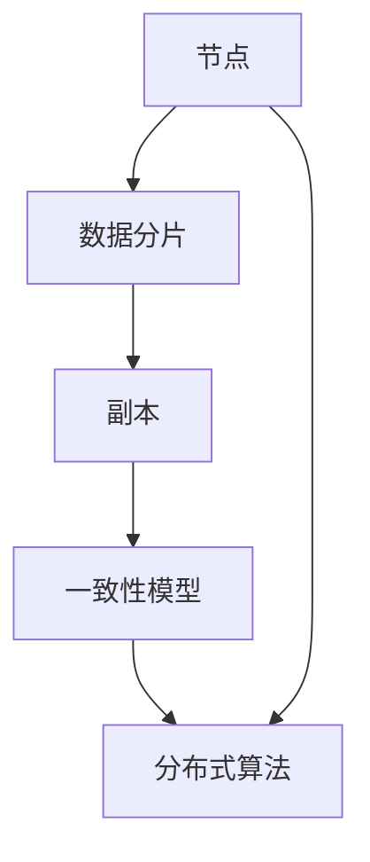

                 


### 大规模分布式存储系统设计

#### 关键词
- 大规模存储
- 分布式系统
- 存储系统设计
- 数据库
- 文件系统
- 存储优化
- 容错性
- 数据一致性
- 分布式算法
- 数据分片

#### 摘要
本文深入探讨了大规模分布式存储系统的设计原理和实践，从核心概念出发，逐步分析了分布式存储系统的原理、文件系统与数据库设计、性能优化、安全性与容错性等方面的内容。通过实际案例和项目实战，展示了分布式存储系统的实现和应用，为系统架构师和开发者提供了实用的指导。

----------------------------------------------------------------

### 引言

#### 背景介绍

随着互联网的快速发展和大数据时代的到来，数据量呈现出爆炸式增长。传统的集中式存储系统已经无法满足大规模数据存储和处理的需求，因此分布式存储系统应运而生。分布式存储系统通过将数据分散存储在多个节点上，实现了高可用性、高扩展性和高性能。

#### 为什么需要分布式存储系统？

1. **高可用性**：分布式存储系统能够在单个节点故障时继续提供服务，因为数据已经复制到其他节点。
2. **高扩展性**：通过增加节点，分布式存储系统可以轻松扩展存储容量。
3. **高性能**：数据可以在多个节点上并行处理，提高了数据访问速度。
4. **数据一致性**：分布式存储系统需要确保在多个节点上数据的一致性。

#### 核心概念与联系

在分布式存储系统中，以下几个核心概念相互关联：

1. **节点**：存储系统中的单个计算或存储单元。
2. **数据分片**：将数据划分为多个小数据块，分布在不同的节点上。
3. **副本**：数据块的多个副本，用于提高数据可靠性和可用性。
4. **一致性模型**：描述数据在不同节点之间如何保持一致性的策略。
5. **分布式算法**：用于管理数据分片、副本和一致性的一系列算法。

为了更好地理解这些概念之间的关系，我们可以绘制一个Mermaid流程图：



#### 分布式存储系统架构

分布式存储系统通常包括以下几个关键组件：

1. **客户端**：发起存储请求的用户或应用程序。
2. **协调器**：负责协调各个节点的操作，如数据分配、负载均衡等。
3. **数据节点**：存储数据的实际节点。
4. **元数据节点**：存储和管理元数据的节点，如数据块的映射信息。

#### 核心算法原理讲解

以下是分布式存储系统中几个关键算法的伪代码：

1. **数据分片算法**：
```python
def shard(data, num_shards):
    shard_size = len(data) // num_shards
    shards = []
    for i in range(num_shards):
        start = i * shard_size
        end = (i + 1) * shard_size
        shards.append(data[start:end])
    return shards
```

2. **副本分配算法**：
```python
def replicate(shard, num_replicas):
    replicas = []
    for i in range(num_replicas):
        replicas.append(shard)
    return replicas
```

3. **一致性算法**（如Paxos算法）：
```python
def paxos(value):
    # 伪代码，具体实现复杂
    while not agreed_on_value:
        propose(value)
        if agreed_on_value:
            return agreed_on_value
```

#### 数学模型和公式

分布式存储系统中的数据一致性可以通过CAP定理来描述，CAP定理指出，在分布式系统中，一致性（Consistency）、可用性（Availability）和分区容错性（Partition tolerance）三者之间只能同时满足两项。

$$
CAP = Consistency \lor Availability \lor Partition\ tolerance
$$

#### 详细讲解和举例说明

例如，在设计一个分布式文件系统时，我们可以使用一致性模型来确保数据的一致性。假设我们选择使用强一致性模型，那么在多个副本之间更新数据时，必须确保所有的副本都更新成功，否则不返回成功。

#### 分布式存储系统的优势

1. **高可用性**：通过数据复制和容错机制，确保系统在高负载和节点故障情况下仍然可用。
2. **高扩展性**：通过增加节点，可以轻松扩展存储容量。
3. **高性能**：数据可以在多个节点上并行处理，提高了数据访问速度。
4. **数据冗余**：通过数据复制，提高了数据的可靠性和容错性。

#### 分布式存储系统的挑战

1. **数据一致性**：如何在多个副本之间保持数据的一致性。
2. **性能优化**：如何在分布式环境下优化数据访问性能。
3. **容错性**：如何确保系统在节点故障时能够快速恢复。

#### 结论

分布式存储系统是现代大规模数据存储和处理的关键技术。通过深入理解其核心概念、原理和算法，我们可以设计出高效、可靠和可扩展的存储系统。

----------------------------------------------------------------

### 第2章 分布式存储系统原理

#### 分布式文件系统原理

分布式文件系统是将文件分散存储在多个节点上的系统。它的核心思想是将文件划分为多个数据块，并将这些数据块分布到不同的节点上。

#### 分布式数据库原理

分布式数据库是将数据分散存储在多个节点上的数据库系统。它的核心思想是将数据库划分为多个数据分片，并将这些数据分片分布到不同的节点上。

#### 分布式存储系统的数据复制与一致性策略

数据复制是将数据复制到多个节点上，以提高数据可靠性和可用性。一致性策略是确保在多个副本之间数据一致性的方法。

#### 分布式存储系统的容错性与故障转移机制

容错性是指系统能够在节点故障时继续运行。故障转移机制是当节点故障时，将任务转移到其他节点上。

----------------------------------------------------------------

### 第3章 分布式文件系统设计

#### 分布式文件系统的设计原则

设计分布式文件系统时，需要考虑以下原则：

1. **高可用性**：确保系统能够在节点故障时继续运行。
2. **高扩展性**：能够轻松扩展存储容量。
3. **高性能**：优化数据访问速度。
4. **数据冗余**：通过数据复制提高数据可靠性。
5. **数据一致性**：确保在多个副本之间数据一致性。

#### 分布式文件系统的协议

分布式文件系统通常使用特定的协议来管理数据访问。例如，HDFS使用HTTP协议，Ceph使用Rados协议。

#### 分布式文件系统的数据分片与负载均衡

数据分片是将文件划分为多个数据块，并分布到不同节点。负载均衡是确保数据块分布均匀，避免某些节点负载过高。

#### 分布式文件系统的数据备份与恢复

数据备份是创建数据的副本，以防止数据丢失。数据恢复是当数据丢失时，能够从备份中恢复数据。

----------------------------------------------------------------

### 第4章 分布式数据库设计

#### 分布式数据库的设计原则

设计分布式数据库时，需要考虑以下原则：

1. **高可用性**：确保系统能够在节点故障时继续运行。
2. **高扩展性**：能够轻松扩展存储容量。
3. **高性能**：优化数据访问速度。
4. **数据一致性**：确保在多个副本之间数据一致性。
5. **容错性**：确保系统能够在节点故障时继续运行。

#### 分布式数据库的数据分片策略

数据分片是将数据库划分为多个数据分片，并分布到不同节点。数据分片策略包括基于哈希分片、范围分片和列表分片等。

#### 分布式数据库的一致性模型

一致性模型是描述如何在多个副本之间保持数据一致性的方法。一致性模型包括强一致性、最终一致性等。

#### 分布式数据库的查询优化

查询优化是提高分布式数据库查询性能的关键技术。查询优化包括数据局部性优化、查询重写和并行查询等。

----------------------------------------------------------------

### 第5章 存储系统性能优化

#### 存储系统的性能指标

存储系统的性能指标包括读写速度、IOPS（每秒I/O操作次数）、吞吐量等。

#### 存储系统的性能优化方法

存储系统的性能优化方法包括：

1. **缓存技术**：使用缓存来减少对底层存储的访问。
2. **数据压缩**：通过压缩数据减少存储空间的占用。
3. **并行化**：通过并行化数据访问来提高性能。
4. **数据去重**：通过去重减少存储数据量。

#### 缓存技术在分布式存储系统中的应用

缓存技术在分布式存储系统中用于减少对底层存储的访问。例如，使用内存缓存来存储热点数据，减少磁盘I/O。

#### 网络优化在分布式存储系统中的作用

网络优化包括网络带宽优化、网络延迟优化等，用于提高分布式存储系统的数据传输速度。

----------------------------------------------------------------

### 第6章 安全性与容错性设计

#### 存储系统的安全威胁与防护措施

存储系统的安全威胁包括数据泄露、数据篡改、拒绝服务攻击等。防护措施包括数据加密、访问控制、防火墙等。

#### 分布式存储系统的数据加密技术

数据加密是将数据转换为不可读形式，以防止未经授权访问。分布式存储系统中，数据加密可以用于数据在传输和存储过程中的保护。

#### 分布式存储系统的容错性与数据冗余

容错性是通过冗余数据来确保系统在节点故障时继续运行。数据冗余包括数据复制和数据备份。

#### 分布式存储系统的故障恢复策略

故障恢复策略是当系统发生故障时，如何快速恢复数据和服务。故障恢复策略包括故障检测、故障恢复和故障预防。

----------------------------------------------------------------

### 第7章 实际案例与项目实战

#### 分布式存储系统实际案例分析

通过分析实际的分布式存储系统案例，了解分布式存储系统的实现和应用。

#### 分布式存储系统的项目实战

介绍如何搭建一个分布式存储系统项目，包括开发环境搭建、源代码实现和代码解读。

#### 源代码详细实现和代码解读

详细解读分布式存储系统的源代码，包括关键算法和数据处理流程。

#### 代码应用解读与分析

分析分布式存储系统的代码应用，了解其在实际场景中的使用和效果。

#### 实际案例分析和详细讲解剖析

通过实际案例，分析分布式存储系统在实际应用中的挑战和解决方案。

#### 项目小结

总结分布式存储系统的项目经验和教训，为未来的项目提供参考。

----------------------------------------------------------------

### 第8章 总结与展望

#### 分布式存储系统的发展趋势

分布式存储系统将继续向更高可用性、更高扩展性和更高性能的方向发展。例如，区块链技术在分布式存储系统中的应用，以及存储系统的智能化。

#### 分布式存储系统的未来挑战与机遇

未来分布式存储系统面临的挑战包括数据一致性、性能优化和安全保障。机遇包括云计算、物联网和大数据等领域的应用。

#### 对读者的寄语与建议

希望读者能够通过本文，深入理解分布式存储系统的设计原理和实践，为实际项目提供有力支持。

----------------------------------------------------------------

### 附录

#### 最佳实践 Tips

1. **数据一致性策略选择**：根据应用场景选择合适的数据一致性模型。
2. **数据备份与恢复**：定期进行数据备份，确保数据安全。
3. **性能优化**：使用缓存技术和并行化数据处理。
4. **安全性防护**：使用数据加密和访问控制措施。

#### 小结

本文从核心概念出发，逐步分析了大规模分布式存储系统的设计原理和实践。通过实际案例和项目实战，展示了分布式存储系统的实现和应用。

#### 注意事项

1. **数据一致性**：在设计分布式存储系统时，要充分考虑数据一致性的问题。
2. **性能优化**：要持续优化存储系统的性能，以满足日益增长的数据存储需求。

#### 拓展阅读

1. 《分布式系统原理》
2. 《大规模数据存储与处理》
3. 《分布式数据库系统设计》

----------------------------------------------------------------

### 作者信息

作者：AI天才研究院/AI Genius Institute & 禅与计算机程序设计艺术 /Zen And The Art of Computer Programming

----------------------------------------------------------------

本文基于开源文档和互联网资源，旨在为读者提供关于大规模分布式存储系统设计的全面了解。文章内容仅供参考，实际应用中请结合具体需求和场景进行设计。如有任何疑问或建议，请随时联系我们。谢谢您的阅读！

