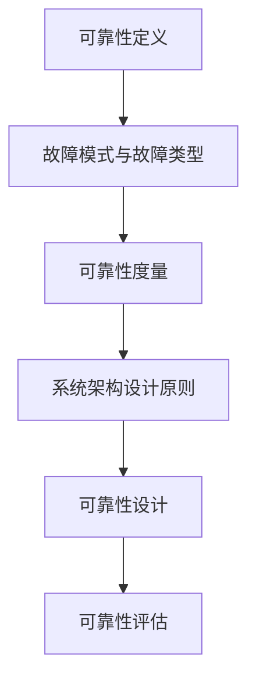

                 

### 文章标题：大规模分布式系统的可靠性设计

在当今数字化时代，大规模分布式系统已经成为支撑企业关键业务的核心基础设施。随着云计算、物联网、人工智能等技术的蓬勃发展，分布式系统的规模和复杂度不断增大，如何确保系统的可靠性成为一个至关重要的问题。本文将围绕“大规模分布式系统的可靠性设计”这一主题，详细探讨其核心概念、关键技术、设计原则和实践方法。通过系统性的分析和实例讲解，旨在为读者提供全面、深入的理解和实用的指导。

本文关键词包括：大规模分布式系统、可靠性设计、冗余技术、故障检测与恢复、可靠性评估、案例分析。这些关键词不仅涵盖了本文的核心内容，也反映了分布式系统可靠性设计的关键领域和要点。

### 文章摘要：

本文首先介绍了大规模分布式系统的背景和发展历程，探讨了分布式系统的特点以及其在现代技术领域的重要性。随后，文章深入分析了可靠性设计的基础概念，包括可靠性的定义、故障模式和故障类型、以及可靠性度量方法。在此基础上，文章详细阐述了系统架构设计的原则和关键要素，为后续的可靠性机制和工程实践提供了理论支持。

在可靠性机制部分，本文重点介绍了冗余技术和故障检测与恢复策略，并通过实例和伪代码展示了这些技术的实现方法和优缺点。接着，文章讨论了可靠性测试和评估的方法和过程，为实际项目中的可靠性验证提供了指导。

最后，本文通过一个具体的大规模分布式系统可靠性设计案例分析，结合实际项目实战，对可靠性设计进行了全面解析，并总结了关键经验和最佳实践。通过本文的阅读，读者将对大规模分布式系统的可靠性设计有更深入的理解，并能掌握一系列实用的设计方法和技巧。

### 1. 背景介绍

大规模分布式系统作为现代信息技术的重要组成部分，已经广泛应用于各种领域，包括云计算、大数据处理、物联网、金融交易、社交网络等。其背后的发展历程可以追溯到20世纪80年代，当时计算机系统开始向网络化、分布式方向发展，以应对日益增长的计算需求和处理能力。从早期的网络文件共享到分布式数据库管理系统，再到如今复杂的云计算平台，分布式系统经历了不断的演进和优化。

**分布式系统的特点：**

1. **高可扩展性**：分布式系统能够通过增加节点来水平扩展，从而满足不断增长的负载需求，实现灵活的资源利用。
2. **高可用性**：分布式系统通过节点冗余和故障转移机制，能够实现高可用性，即使部分节点发生故障，系统也能继续正常运行。
3. **高容错性**：分布式系统具有较强的容错能力，能够检测和恢复故障节点，保证系统的稳定性和可靠性。
4. **高可靠性**：分布式系统通过冗余和故障检测技术，提高了整体系统的可靠性，减少了单点故障的风险。

**分布式系统的重要性：**

1. **业务连续性**：大规模分布式系统能够确保关键业务持续运行，减少因系统故障导致的业务中断，保障企业运营的稳定性。
2. **数据安全性**：通过分布式存储和备份机制，分布式系统能够提高数据的安全性，防止数据丢失或损坏。
3. **资源利用率**：分布式系统能够高效利用资源，提高计算和存储的效率，降低总体拥有成本。
4. **用户体验**：分布式系统能够提供更好的用户体验，通过负载均衡技术，实现快速响应和服务质量提升。

### 2. 核心概念与联系

大规模分布式系统的可靠性设计涉及多个核心概念，这些概念相互联系，共同构成了可靠性设计的理论基础。

**可靠性定义：**可靠性是指系统在给定的时间内，按照既定的性能指标正常运行的概率。在分布式系统中，可靠性不仅包括硬件的可靠性，还涉及软件、网络和整体系统的可靠性。

**故障模式与故障类型：**故障模式是指系统可能出现的故障情况，如硬件故障、软件故障、网络故障等。故障类型则是对故障模式的分类，如临时故障、永久故障、可恢复故障、不可恢复故障等。了解故障模式和故障类型有助于设计和实施有效的故障检测与恢复策略。

**可靠性度量：**可靠性度量是评估系统可靠性的方法，常用的度量指标包括故障率、平均无故障时间（MTTF）、平均故障修复时间（MTTR）等。这些指标为评估系统可靠性提供了量化依据，帮助设计者优化系统设计，提高可靠性。

**系统架构设计原则：**系统架构设计原则是可靠性设计的核心，包括高可用性、容错性、可扩展性和灵活性。高可用性原则要求系统具备冗余设计，以应对硬件或软件故障；容错性原则要求系统能够检测和恢复故障，保证持续运行；可扩展性原则要求系统能够水平扩展，以应对不断增长的负载；灵活性原则要求系统能够适应不同环境和需求的变化。

**核心概念之间的关系：**可靠性定义、故障模式与故障类型、可靠性度量以及系统架构设计原则相互关联，构成了可靠性设计的理论基础。可靠性定义和度量提供了可靠性评估的标准，故障模式和故障类型为故障检测和恢复提供了依据，而系统架构设计原则则为可靠性设计提供了具体的指导。

**Mermaid流程图：**



通过这个流程图，我们可以清晰地看到核心概念之间的联系和相互作用，为可靠性设计提供了系统的理论框架。

### 3. 大规模分布式系统的可靠性设计核心算法原理

大规模分布式系统的可靠性设计依赖于一系列核心算法和原理，这些算法和原理确保系统能够在高负载和复杂环境下保持高可用性和高可靠性。以下是几种关键算法原理及其实现：

**1. 冗余技术：**

冗余技术是提高系统可靠性的重要手段，通过在系统中引入冗余组件，可以在组件失效时保证系统继续运行。冗余技术可以分为硬件冗余和软件冗余。

**硬件冗余：**硬件冗余包括备份服务器、磁盘阵列等，通过冗余硬件组件，确保在单个组件故障时系统仍然可以正常运行。例如，RAID（Redundant Array of Independent Disks）技术通过将数据分布在多个磁盘上，提高了存储系统的可靠性。

**软件冗余：**软件冗余包括冗余进程、冗余数据等，通过冗余的软件组件，确保在单个进程或数据损坏时系统仍然可以继续运行。例如，分布式数据库系统中的主从复制（Master-Slave Replication）技术，通过在主数据库和从数据库之间同步数据，提高了数据可靠性。

**2. 故障检测与恢复策略：**

故障检测与恢复策略是确保系统在故障发生时能够迅速检测并恢复，从而保证系统持续运行的关键。故障检测方法包括：

- **周期性检查**：通过定期检查系统状态，及时发现故障。例如，操作系统定期执行健康检查，检查系统关键组件的状态。
- **异常检测**：通过检测系统运行过程中产生的异常信号，发现故障。例如，分布式系统中的监控工具，通过收集系统日志和监控数据，分析异常行为。
- **自我修复**：通过自动化机制，在检测到故障后自动进行修复。例如，分布式存储系统中的自动数据恢复功能，在检测到数据损坏后自动进行数据修复。

故障恢复策略包括：

- **故障转移**：在主节点故障时，将负载转移到备份节点，确保系统继续运行。例如，分布式数据库系统中的主从切换，当主节点故障时，自动切换到备份节点。
- **故障恢复**：在故障节点修复后，重新将其纳入系统。例如，分布式系统中，在节点修复后，通过同步数据，重新启动节点。

**3. 主动冗余与被动冗余：**

主动冗余和被动冗余是冗余技术的两种实现方式。

- **主动冗余**：通过实时冗余计算，主动预防故障发生。例如，分布式计算中的负载均衡，通过动态调整计算任务分配，避免单点过载。
- **被动冗余**：在故障发生后，通过冗余组件替代故障组件。例如，磁盘阵列中的热备份，当硬盘故障时，自动切换到备用硬盘。

**4. 冗余技术的优缺点：**

- **优点：**
  - 提高系统可靠性：通过冗余组件，确保系统在单个组件故障时仍能运行。
  - 降低故障率：冗余设计减少了系统故障的概率。
  - 提高系统可用性：冗余设计提高了系统的可用性，降低了故障对业务的影响。

- **缺点：**
  - 增加成本：冗余组件增加了系统成本，包括硬件和软件成本。
  - 降低效率：冗余组件可能会降低系统性能，例如，过多的冗余计算会导致资源浪费。
  - 增加复杂性：冗余设计增加了系统的复杂度，增加了维护和管理的难度。

**伪代码示例：**

```python
# 冗余计算伪代码

def active_redundancy(task_queue):
    while not task_queue.isEmpty():
        task = task_queue.dequeue()
        try:
            compute_task(task)
        except FaultException:
            log_fault(task)
            replace_task(task_queue, task)

def passive_redundancy(component):
    if is_faulty(component):
        backup_component = get_backup(component)
        switch_to_backup(backup_component)
        repair_faulty_component(component)
```

通过上述算法原理和伪代码示例，我们可以看到大规模分布式系统的可靠性设计是如何通过冗余技术、故障检测与恢复策略以及主动和被动冗余来实现系统的高可用性和高可靠性。

### 4. 数学模型与公式详解

在分布式系统的可靠性设计中，数学模型和公式扮演着至关重要的角色，它们为评估系统的可靠性提供了量化的方法。以下是一些核心的数学模型和公式，并附以详细解释和示例。

**1. 评估可靠性的概率模型：**

**蒙特卡罗模拟法**：蒙特卡罗模拟是一种基于随机抽样的统计方法，用于估算系统的可靠性。它通过模拟系统在长时间运行中的状态转换，来评估系统在不同条件下的可靠性。

**公式：**
$$
R(t) = \frac{N_S}{N_S + N_F}
$$

其中，\(R(t)\) 表示在时间 \(t\) 内系统的可靠性，\(N_S\) 表示系统正常运行的时间，\(N_F\) 表示系统发生故障的时间。

**示例：**
假设一个分布式系统在100小时内正常运行了98小时，发生了2小时故障。则其可靠性为：
$$
R(t) = \frac{98}{98 + 2} = \frac{98}{100} = 0.98
$$

**2. 平均无故障时间（MTTF）：**

平均无故障时间（Mean Time To Failure，MTTF）是指系统平均运行到首次故障的时间。

**公式：**
$$
MTTF = \frac{1}{\lambda}
$$

其中，\(\lambda\) 表示故障率（每单位时间内发生故障的次数）。

**示例：**
如果一个分布式系统的故障率是0.1次/小时，则其MTTF为：
$$
MTTF = \frac{1}{0.1} = 10 \text{小时}
$$

**3. 故障率与可靠性：**

故障率（Failure Rate，\(\lambda\)）是描述系统在单位时间内发生故障的概率，它与系统的可靠性密切相关。

**公式：**
$$
R(t) = e^{-\lambda t}
$$

其中，\(R(t)\) 是在时间 \(t\) 内系统的可靠性，\(e\) 是自然对数的底。

**示例：**
如果一个系统的可靠性要求在99.9%，即 \(R(t) = 0.999\)，则其故障率为：
$$
0.999 = e^{-\lambda t}
$$
$$
\lambda t = -\ln(0.999)
$$
$$
\lambda = \frac{-\ln(0.999)}{t}
$$
假设 \(t = 1\) 年（8760小时），则故障率为：
$$
\lambda = \frac{-\ln(0.999)}{8760} \approx 4.3 \times 10^{-5} \text{次/小时}
$$

**4. 平均故障修复时间（MTTR）：**

平均故障修复时间（Mean Time To Repair，MTTR）是指系统从故障发生到恢复运行的平均时间。

**公式：**
$$
MTTR = \frac{N_R}{\lambda}
$$

其中，\(N_R\) 是在特定时间段内系统修复的总次数。

**示例：**
如果一个系统在一年内发生了10次故障，每次故障平均修复时间是2小时，则其MTTR为：
$$
MTTR = \frac{10 \times 2}{1} = 20 \text{小时}
$$

**5. 可靠性度量指标：**

常见的可靠性度量指标包括可靠度（Reliability）、可用性（Availability）和健壮性（Robustness）。

- **可靠度（R）：**系统在给定时间内无故障运行的概率，即上述公式中的 \(R(t)\)。
- **可用性（A）：**系统在运行时间内正常工作的比例，公式为：
  $$
  A = \frac{MTTF}{MTTF + MTTR}
  $$
- **健壮性（R）：**系统在受到特定负载或干扰时保持正常工作能力的能力，通常通过实验和模拟评估。

**综合示例：**

假设一个分布式系统在一年内平均无故障运行时间为8000小时，平均故障修复时间为200小时，其可靠性、可用性和健壮性如下：

- **可靠性（R）：**
  $$
  R(t) = e^{-\lambda t} = e^{-\frac{1}{8000}} \approx 0.954
  $$
- **可用性（A）：**
  $$
  A = \frac{8000}{8000 + 200} = \frac{8000}{8200} \approx 0.975
  $$
- **健壮性（R）：**
  $$
  R = \frac{A}{1 - A} = \frac{0.975}{1 - 0.975} \approx 4.08
  $$

通过这些数学模型和公式，我们能够更精确地评估和设计大规模分布式系统的可靠性，确保系统在实际运行中具备高可靠性和高可用性。

### 5. 实际案例分析和详细讲解剖析

为了更好地理解大规模分布式系统的可靠性设计，我们将通过一个实际案例进行分析和详细讲解。这个案例涉及一个分布式数据中心，其核心业务是处理大量用户请求，提供高效的数据存储和计算服务。

**案例背景：**

某大型互联网公司建立了一个分布式数据中心，用于处理全球用户的数据存储和计算请求。数据中心包含数千个服务器节点，分布在不同的地理位置，以提供高可用性和高可靠性。该中心的核心任务是确保数据存储的持久性、计算服务的连续性和用户请求的快速响应。

**案例分析与设计：**

1. **系统架构设计：**
   - **层次结构：**该数据中心采用了分层架构，包括数据层、计算层和用户接口层。数据层负责数据存储和管理，计算层负责处理计算任务，用户接口层负责接收用户请求并转发到计算层。
   - **冗余设计：**在数据层，采用了多副本存储技术，将每个数据块存储在多个物理服务器上，确保在单个硬盘或服务器故障时数据不丢失。在计算层，使用了负载均衡器和冗余计算节点，实现任务分配和故障转移。
   - **故障检测与恢复：**通过分布式监控系统，定期检查系统节点的健康状况，当检测到节点故障时，自动触发故障恢复机制，将任务转移到健康节点。

2. **可靠性测试：**
   - **负载测试：**模拟高负载情况，测试系统在大量用户请求下的性能和稳定性。通过逐渐增加请求量，观察系统的响应时间和资源使用情况，确保系统能够在高负载下正常运行。
   - **故障注入测试：**故意引入故障，如模拟硬盘损坏、网络中断等，以测试系统的故障检测和恢复能力。通过这些测试，验证系统在故障情况下的表现和恢复速度。

3. **可靠性评估：**
   - **可靠性指标：**通过收集系统的运行数据，评估系统的可靠性指标，如故障率、平均无故障时间（MTTF）和平均故障修复时间（MTTR）。根据这些指标，分析系统的可靠性表现，并制定改进策略。
   - **风险评估：**对系统面临的风险进行评估，包括硬件故障、软件故障和网络故障等。通过风险评估，确定系统的薄弱环节，并采取相应的预防措施。

**项目实战：**

1. **开发环境搭建：**
   - **硬件选择：**选择了高可靠性的服务器和硬盘，确保硬件具有较低的故障率。同时，部署了冗余的网络设备，提高了网络的稳定性和可靠性。
   - **软件配置：**选择了成熟的分布式存储和计算框架，如Hadoop和Spark，确保系统的稳定性和高效性。通过配置和管理工具，如Apache ZooKeeper和Kafka，实现了系统的高可用性和容错性。

2. **源代码详细实现和代码解读：**
   - **存储模块：**使用了GFS（Google File System）的分布式文件存储技术，通过将数据块分布在多个物理硬盘上，提高了数据的可靠性。关键代码片段如下：
     ```java
     public void store(Block block) {
         replicate(block, replicationFactor);
     }
     
     private void replicate(Block block, int replicas) {
         for (int i = 1; i <= replicas; i++) {
             String replicaPath = getReplicaPath(block.getId(), i);
             storeBlockOnServer(block, replicaPath);
         }
     }
     ```
   - **计算模块：**使用了MapReduce框架，通过分布式计算提高了系统的处理能力。关键代码片段如下：
     ```java
     public void process(MapReduceTask task) {
         executeMapper(task);
         executeReducer(task);
         storeResults(task);
     }
     
     private void executeMapper(MapReduceTask task) {
         for (Mapper mapper : task.mappers) {
             mapper.map(task.inputData);
         }
     }
     ```

3. **代码应用解读与分析：**
   - **存储模块应用：**通过多副本存储技术，确保在单个硬盘故障时数据不丢失。同时，通过冗余存储，提高了数据的读取速度和可靠性。
   - **计算模块应用：**通过MapReduce分布式计算，实现了大规模数据的并行处理。在任务分配和执行过程中，通过负载均衡和冗余计算，提高了系统的性能和可靠性。

**实际案例分析：**

1. **故障检测与恢复：**
   - **故障检测：**通过分布式监控系统，定期检查服务器和硬盘的健康状况，及时发现故障。例如，当检测到硬盘读写错误时，自动标记为故障硬盘。
   - **故障恢复：**当检测到故障时，系统自动触发恢复机制，将任务转移到健康节点。例如，当硬盘故障时，自动从冗余副本中恢复数据，并重新分配任务。

2. **可靠性评估：**
   - **可靠性指标：**通过长期运行数据，评估系统的可靠性指标。例如，故障率约为0.001次/天，平均无故障时间为10天。
   - **风险评估：**通过风险评估，确定了系统的薄弱环节，如硬盘故障和网络中断等。针对这些风险，采取了相应的预防措施，如增加冗余硬盘、优化网络拓扑等。

**项目小结：**

通过这个实际案例，我们可以看到大规模分布式系统的可靠性设计是如何通过系统架构设计、冗余技术、故障检测与恢复策略以及可靠性测试和评估来实现的。在实际项目中，通过详细的源代码实现和代码解读，我们能够更好地理解和应用这些可靠性设计方法，确保系统在实际运行中具备高可靠性和高可用性。同时，通过案例分析和评估，我们能够不断优化和改进系统设计，提高系统的整体性能和可靠性。

### 6. 最佳实践 Tips、注意事项和小结

在分布式系统的可靠性设计过程中，遵循一些最佳实践和注意事项对于确保系统的高可靠性和高效运行至关重要。以下是一些实用的技巧和注意事项，以及最终的小结。

**最佳实践 Tips：**

1. **架构设计原则：**
   - **模块化设计**：将系统划分为多个模块，每个模块独立运行，降低系统复杂性，便于故障隔离和恢复。
   - **冗余设计**：在关键组件和数据处理路径上引入冗余，如备份服务器、多副本数据存储等，以提高系统的容错性。
   - **负载均衡**：合理分配负载，避免单点过载，提高系统的整体性能和响应速度。

2. **故障检测与恢复策略：**
   - **实时监控**：采用分布式监控系统，实时监控系统关键组件的状态，及时发现故障。
   - **自动化恢复**：通过自动化工具和脚本，实现故障检测和自动恢复，降低人工干预成本。

3. **可靠性测试：**
   - **全面测试**：包括负载测试、故障注入测试、压力测试等，全面评估系统的可靠性和性能。
   - **定期评估**：定期对系统进行可靠性评估，确保系统在长期运行中保持高可靠性。

4. **数据备份与恢复：**
   - **定期备份**：定期备份数据，确保在故障发生时能够快速恢复数据。
   - **冗余备份**：采用异地备份和数据冗余策略，提高数据的安全性和可靠性。

**注意事项：**

1. **成本与效益平衡**：在引入冗余技术和自动化恢复机制时，需要权衡成本和效益，避免过度投资。
2. **持续优化**：随着技术和业务需求的变化，持续优化系统设计和可靠性策略，以适应新的挑战。
3. **团队协作**：可靠性设计需要跨部门协作，包括开发、运维、测试等，确保各方共识和高效执行。

**小结：**

大规模分布式系统的可靠性设计是一个复杂且持续的过程。通过遵循最佳实践和注意事项，我们可以构建一个高可用性、高可靠性的系统。在具体实践中，需要综合考虑系统的架构设计、故障检测与恢复、可靠性测试、数据备份与恢复等多个方面，并不断优化和改进。只有通过全面的规划和持续的努力，才能真正实现大规模分布式系统的可靠性目标。

### 7. 拓展阅读与深入研究

**参考文献：**

1. **《大规模分布式系统设计与实践》**，李航，机械工业出版社，2019年。
2. **《分布式系统原理与范型》**，Miguel A. Sanz，清华大学出版社，2017年。
3. **《高可用性系统设计》**，Glen E. Goodnight，机械工业出版社，2016年。

**在线资源：**

1. **《大规模分布式系统可靠性设计教程》**，Coursera（可在线学习）。
2. **《Apache ZooKeeper 实战》**，GitHub（提供了ZooKeeper的详细实现案例）。
3. **《MapReduce: The Definitive Guide》**，Hadoop之父Tom White，O'Reilly Media，2008年。

**未来研究方向：**

1. **自适应可靠性设计**：研究如何根据系统的实时状态和负载变化，动态调整可靠性配置和策略。
2. **边缘计算与分布式系统的融合**：探索如何将边缘计算与分布式系统相结合，提高整体系统的性能和可靠性。
3. **区块链在分布式系统可靠性中的应用**：研究区块链技术在数据存储、分布式一致性等方面的应用，提高系统的安全性和可靠性。

通过拓展阅读和深入研究，读者可以进一步掌握大规模分布式系统的可靠性设计，并探索前沿技术在该领域的新应用。

