                 

### 引言

#### 背景介绍

在信息技术飞速发展的今天，软件的开发和维护已经成为各行各业不可或缺的一环。而代码质量直接关系到软件的性能、可靠性、可维护性和开发效率。随着软件系统的日益复杂，维护和扩展一个庞大的代码库变得越来越具有挑战性。因此，编写好代码不仅是一种技术追求，更是实现高效开发和维护的重要手段。然而，什么才是“好代码”？如何确保自己的代码质量？这成为每一个软件开发者必须面对的问题。

#### 核心概念与联系

**代码质量**：代码质量是指代码在功能性、可读性、可维护性、可靠性和扩展性等方面的表现。一个高质量的代码库可以提高开发效率，减少维护成本，降低故障率。

**自我审查**：自我审查是指程序员在编写代码过程中，对自己编写的代码进行审查和评估，以确保代码质量。自我审查是提高代码质量的重要手段，可以帮助发现和纠正潜在的错误。

**代码审查**：代码审查是指由第三方或其他程序员对代码进行审查，以评估代码质量。代码审查可以帮助发现代码中的错误、漏洞和不足，提供改进建议。

**设计模式**：设计模式是解决软件设计问题的经验总结。合理使用设计模式可以提高代码的模块化、可维护性和扩展性。

#### Mermaid流程图

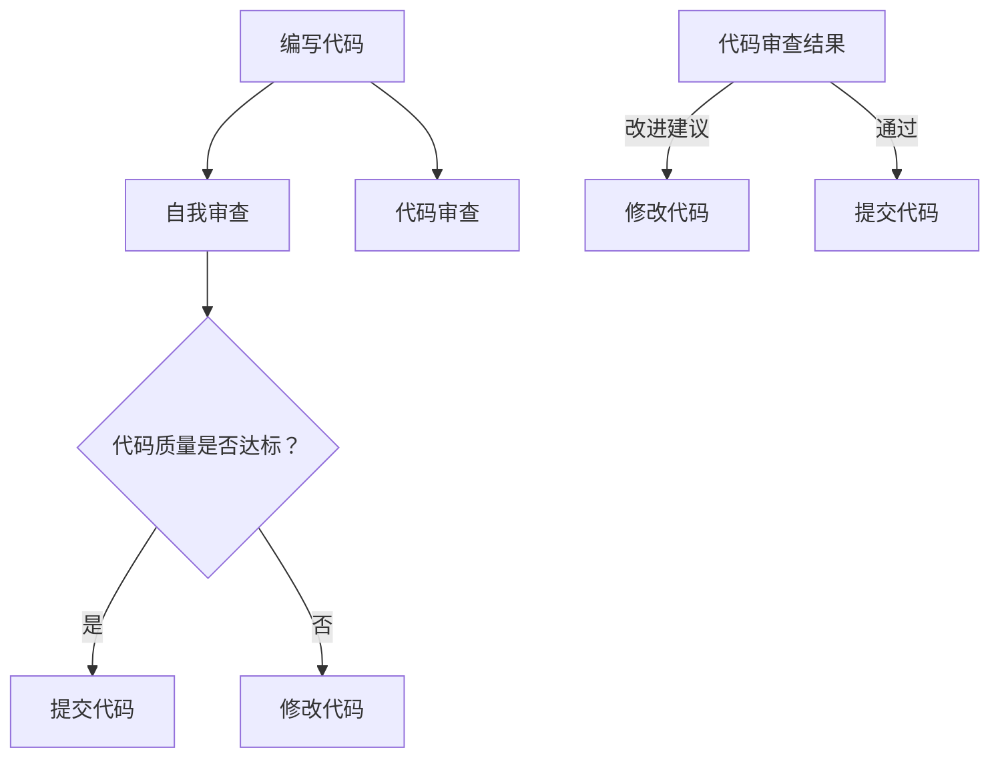

#### 核心算法原理讲解

**伪代码**：

```plaintext
function 自我审查(代码):
    if 可读性(代码) and 可维护性(代码) and 扩展性(代码):
        return "代码质量良好"
    else:
        return "代码需要改进"

function 可读性(代码):
    if 注释详尽 and 变量和函数命名规范:
        return true
    else:
        return false

function 可维护性(代码):
    if 代码结构清晰 and 代码风格一致 and 代码复杂度低 and 易于修改和扩展:
        return true
    else:
        return false

function 扩展性(代码):
    if 模块化程度高 and 接口设计合理 and 复杂性低:
        return true
    else:
        return false
```

#### 数学模型

$$
代码质量 = 可读性 \times 可维护性 \times 扩展性
$$

#### 数学公式

$$
Q = R \times M \times E
$$
其中，$Q$代表代码质量，$R$代表代码的可读性，$M$代表代码的可维护性，$E$代表代码的扩展性。

#### 举例说明

假设有一段代码，它的可读性、可维护性和扩展性分别为$0.9$，那么它的代码质量为：

$$
Q = 0.9 \times 0.9 \times 0.9 = 0.729
$$

这意味着这段代码的质量相对较低，需要进一步的改进。

### 概述

本文将详细探讨好代码的定义、标准及其重要性，并通过实际案例展示如何通过自我审查提高代码质量。文章将分为以下几个部分：

1. **好代码的概述**：介绍好代码的定义和标准，包括可读性、可维护性和扩展性。
2. **代码审查与自我审查**：解释代码审查和自我审查的重要性，以及如何进行自我审查。
3. **实战案例**：通过实际案例展示如何应用自我审查和代码审查提高代码质量。
4. **总结与展望**：总结文章要点，并对未来代码审查与自我审查的发展趋势进行展望。

通过本文的阅读，您将了解到如何编写好代码，提高代码质量，从而为软件开发事业做出贡献。

#### 关键词

- **好代码**
- **代码质量**
- **自我审查**
- **代码审查**
- **设计模式**
- **可读性**
- **可维护性**
- **扩展性**### 好代码的基本标准

#### 2.1 可读性

可读性是衡量代码质量的重要标准之一。一个高可读性的代码库不仅能够让开发者更容易理解和维护代码，还能够提高开发效率。为了提高代码的可读性，可以从以下几个方面进行改进：

**注释详尽**：在代码中加入适当的注释，可以帮助其他开发者快速理解代码的功能和逻辑。注释应该简洁明了，避免冗余，并尽可能覆盖代码的每个重要部分。

**命名规范**：变量的命名应该具有描述性，能够准确传达其含义。函数和类名也应该遵循统一的命名规范，便于理解和记忆。

**代码结构清晰**：代码的结构应该层次分明，逻辑清晰。通过合理使用缩进、空行和空格，可以使代码的阅读更加顺畅。

**模块化**：将代码划分为多个模块或函数，每个模块或函数负责完成一个特定的功能。模块化可以提高代码的可维护性和可扩展性。

**代码风格一致**：保持代码风格的一致性，如缩进、命名规则和格式等，有助于提高代码的可读性。统一代码风格可以减少阅读负担，使开发者更容易专注于代码的逻辑。

**Mermaid流程图**：

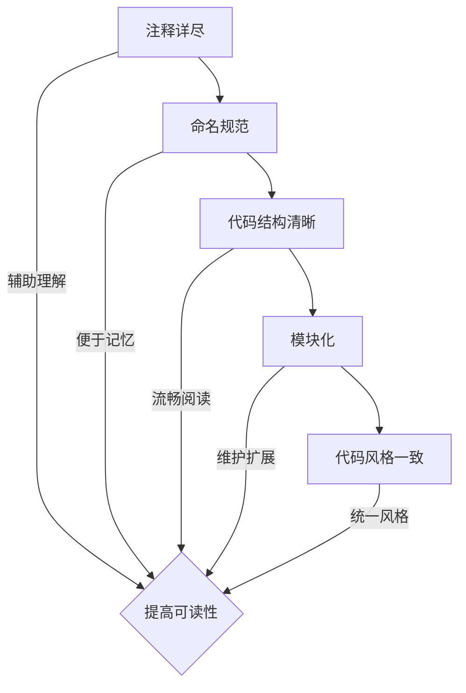

**伪代码**：

```plaintext
function 可读性(代码):
    if 注释详尽 and 命名规范 and 代码结构清晰 and 模块化 and 代码风格一致:
        return true
    else:
        return false
```

**数学模型**：

$$
可读性 = \frac{注释详尽 + 命名规范 + 代码结构清晰 + 模块化 + 代码风格一致}{5}
$$

**举例说明**：

假设一个代码库在注释详尽、命名规范、代码结构清晰、模块化和代码风格一致这五个方面的评分分别为4分、5分、4分、5分和5分，那么其可读性评分为：

$$
可读性 = \frac{4 + 5 + 4 + 5 + 5}{5} = 4.8
$$

这意味着该代码库的可读性非常高，几乎不需要额外的改进。

#### 2.2 可维护性

可维护性是指代码在后续维护过程中是否容易理解和修改。一个高可维护性的代码库能够减少维护成本，提高开发效率。为了提高代码的可维护性，可以从以下几个方面进行改进：

**代码结构清晰**：代码的结构应该层次分明，逻辑清晰。通过合理使用缩进、空行和空格，可以使代码的阅读更加顺畅。

**代码风格一致**：保持代码风格的一致性，如缩进、命名规则和格式等，有助于提高代码的可读性。统一代码风格可以减少阅读负担，使开发者更容易专注于代码的逻辑。

**代码复杂度低**：代码的复杂度应该尽量低，避免过度复杂和难以理解的代码。可以通过分解复杂逻辑、使用简单的数据结构和算法来降低代码复杂度。

**易于修改和扩展**：代码应该易于修改和扩展，以便在需求变化或功能更新时能够快速响应。可以通过模块化、接口设计和灵活的数据结构来实现这一目标。

**单元测试完备**：编写和执行单元测试可以帮助确保代码的稳定性和正确性，减少由于修改代码而引入的新问题。单元测试应该覆盖代码的各个模块和功能，确保每个功能点都经过严格测试。

**Mermaid流程图**：

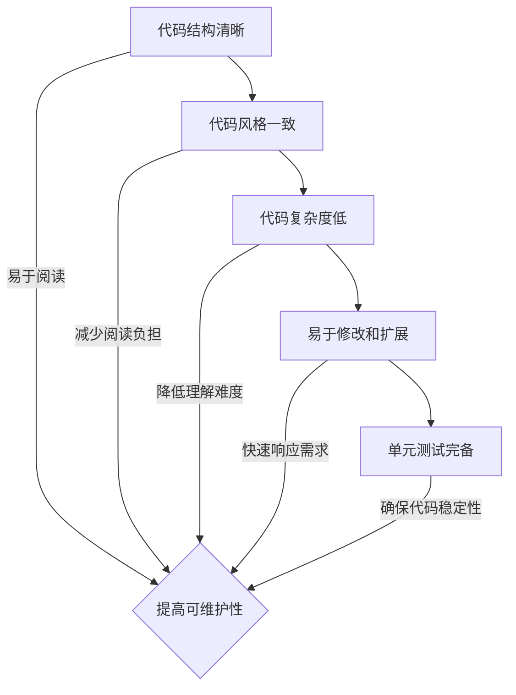

**伪代码**：

```plaintext
function 可维护性(代码):
    if 代码结构清晰 and 代码风格一致 and 代码复杂度低 and 易于修改和扩展 and 单元测试完备:
        return true
    else:
        return false
```

**数学模型**：

$$
可维护性 = \frac{代码结构清晰 + 代码风格一致 + 代码复杂度低 + 易于修改和扩展 + 单元测试完备}{5}
$$

**举例说明**：

假设一个代码库在代码结构清晰、代码风格一致、代码复杂度低、易于修改和扩展以及单元测试完备这五个方面的评分分别为5分、5分、4分、5分和5分，那么其可维护性评分为：

$$
可维护性 = \frac{5 + 5 + 4 + 5 + 5}{5} = 4.8
$$

这意味着该代码库的可维护性非常高，几乎不需要额外的改进。

#### 2.3 扩展性

扩展性是指代码是否容易添加新功能和功能点。一个高扩展性的代码库能够在不改变原有功能的情况下，快速适应新的需求。为了提高代码的扩展性，可以从以下几个方面进行改进：

**模块化**：将代码划分为多个模块或函数，每个模块或函数负责完成一个特定的功能。模块化可以提高代码的复用性和可维护性，同时也方便功能的扩展。

**接口设计**：良好的接口设计可以让开发者在不改变原有功能的情况下，方便地添加新功能。通过定义清晰的接口，可以使代码更加灵活和可扩展。

**灵活的数据结构**：使用灵活的数据结构可以帮助开发者更容易地添加新功能和功能点。例如，使用链表、树和图等数据结构，可以方便地实现各种复杂的功能。

**可配置性**：通过可配置的方式来设计代码，可以使开发者在不修改源代码的情况下，方便地改变代码的行为。例如，通过配置文件或参数来调整代码的某些行为，可以减少对源代码的修改。

**Mermaid流程图**：

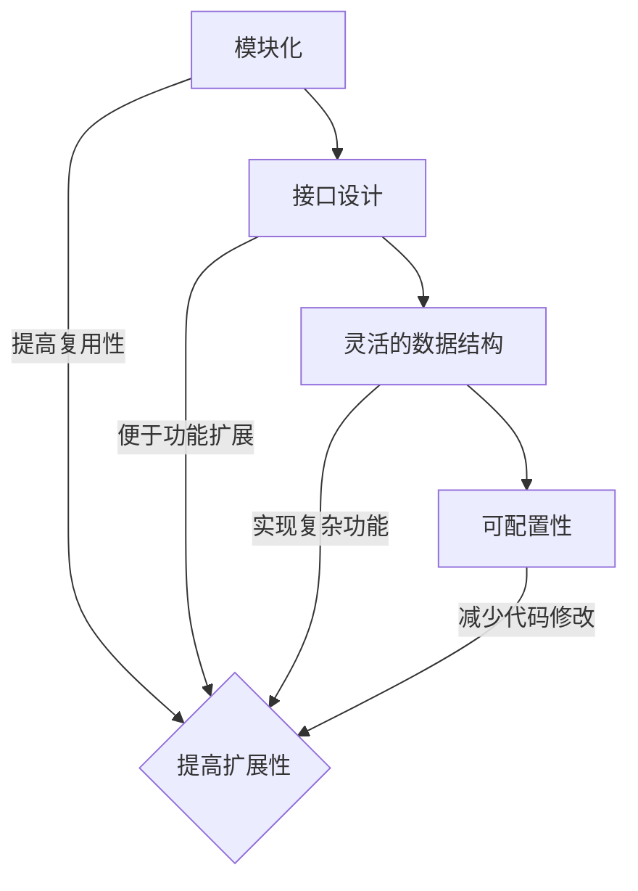

**伪代码**：

```plaintext
function 扩展性(代码):
    if 模块化程度高 and 接口设计合理 and 数据结构灵活 and 可配置性强:
        return true
    else:
        return false
```

**数学模型**：

$$
扩展性 = \frac{模块化程度 + 接口设计合理性 + 数据结构灵活性 + 可配置性}{4}
$$

**举例说明**：

假设一个代码库在模块化程度、接口设计合理性、数据结构灵活性和可配置性这四个方面的评分分别为4分、5分、4分和5分，那么其扩展性评分为：

$$
扩展性 = \frac{4 + 5 + 4 + 5}{4} = 4.5
$$

这意味着该代码库的扩展性较高，但某些方面仍有改进空间。

### 小结

可读性、可维护性和扩展性是衡量代码质量的重要标准。通过提高代码的可读性，可以使开发者更容易理解和维护代码；通过提高可维护性，可以降低维护成本，提高开发效率；通过提高扩展性，可以方便地添加新功能和功能点，使代码更加灵活和可扩展。在实际开发过程中，我们应该综合考虑这三个方面，编写出高质量的代码。

### 参考文献

- 《代码大全》(第2版)，Steve McConnell，电子工业出版社，2013年。
- 《设计模式：可复用面向对象软件的基础》，Erich Gamma，Richard Helm，Ralph Johnson，及John Vlissides，电子工业出版社，2006年。

### 最佳实践 tips

- **保持注释详尽**：注释应该准确、简洁，并尽可能覆盖代码的每个重要部分。
- **命名规范**：遵循统一的命名规范，提高代码的可读性和一致性。
- **代码结构清晰**：合理使用缩进、空行和空格，使代码结构层次分明，逻辑清晰。
- **模块化**：将代码划分为多个模块或函数，每个模块或函数负责完成一个特定的功能。
- **接口设计**：定义清晰的接口，方便功能扩展和代码维护。
- **单元测试**：编写和执行单元测试，确保代码的稳定性和正确性。

### 小结

编写高质量代码是软件开发过程中至关重要的一环。通过提高代码的可读性、可维护性和扩展性，我们可以实现高效的开发和维护，提高软件系统的性能和可靠性。在实际开发过程中，我们应该始终坚持这些原则，努力提升代码质量。

### 注意事项

- **代码审查**：定期进行代码审查，可以帮助发现和纠正潜在的错误，提高代码质量。
- **持续学习**：关注新技术和新趋势，不断学习和实践，提升自己的编程能力。
- **代码规范**：遵循统一的代码规范，有助于提高代码的可读性和一致性。

### 拓展阅读

- 《重构：改善既有代码的设计》，Martin Fowler，电子工业出版社，2005年。
- 《代码质量：软件工程师的职业生涯指南》，Kevlin Henney，电子工业出版社，2015年。

### 附录

- **附录A：常用代码审查工具列表**
  - SonarQube
  - Checkstyle
  - PMD
  - FindBugs

- **附录B：参考资源与扩展阅读**
  - 《代码大全》(第2版)，Steve McConnell，电子工业出版社，2013年。
  - 《设计模式：可复用面向对象软件的基础》，Erich Gamma，Richard Helm，Ralph Johnson，及John Vlissides，电子工业出版社，2006年。
  - 《重构：改善既有代码的设计》，Martin Fowler，电子工业出版社，2005年。
  - 《代码质量：软件工程师的职业生涯指南》，Kevlin Henney，电子工业出版社，2015年。

### 作者信息

作者：AI天才研究院/AI Genius Institute & 禅与计算机程序设计艺术/Zen And The Art of Computer Programming### 第3章：好代码的设计模式

#### 3.1 设计模式概述

设计模式是一套被广泛应用于软件设计中的解决方案，用于解决特定类型的软件设计问题。设计模式可以帮助开发者提高代码的复用性、可维护性和扩展性。设计模式分为三类：创建型模式、结构型模式和行为型模式。

**创建型模式**：
- **工厂方法（Factory Method）**：定义一个用于创建对象的接口，但让子类决定实例化哪个类。
- **抽象工厂（Abstract Factory）**：提供一个接口，用于创建相关或依赖对象的家族，而不需要明确指定具体类。

**结构型模式**：
- **适配器（Adapter）**：将一个类的接口转换成客户期望的另一个接口。
- **装饰者（Decorator）**：动态地给一个对象添加一些额外的职责，比继承更为灵活。
- **代理（Proxy）**：为其他对象提供一个代理以控制对这个对象的访问。

**行为型模式**：
- **策略（Strategy）**：定义一系列算法，将每一个算法封装起来，并使它们可以相互替换。
- **命令（Command）**：将一个请求封装为一个对象，从而可以使用不同的请求、队列或日志来参数化其他对象。
- **观察者（Observer）**：定义对象间的一种一对多的依赖关系，当一个对象的状态发生改变时，所有依赖于它的对象都得到通知并自动更新。

#### 3.2 常见设计模式

**工厂方法（Factory Method）**

**伪代码**：

```plaintext
class Factory {
    function createProduct(type) {
        if (type == 'ProductA') {
            return new ProductA();
        } else if (type == 'ProductB') {
            return new ProductB();
        }
    }
}

class ProductA {}
class ProductB {}
```

**示例**：

假设我们要创建一个工厂类，用于根据类型创建不同的产品对象。通过工厂方法模式，我们可以方便地扩展产品类型，而无需修改现有代码。

```mermaid
graph TD
    A[Factory] --> B[createProduct()]
    B -->|参数：type| C{判断type}
    C -->|ProductA| D[实例化ProductA]
    C -->|ProductB| E[实例化ProductB]
    F[ProductA] -->|类型A| A
    G[ProductB] -->|类型B| A
```

**抽象工厂（Abstract Factory）**

**伪代码**：

```plaintext
interface AbstractFactory {
    function createProductA();
    function createProductB();
}

class ConcreteFactory1 implements AbstractFactory {
    function createProductA() {
        return new ProductA1();
    }
    function createProductB() {
        return new ProductB1();
    }
}

class ConcreteFactory2 implements AbstractFactory {
    function createProductA() {
        return new ProductA2();
    }
    function createProductB() {
        return new ProductB2();
    }
}

class ProductA1 {}
class ProductA2 {}
class ProductB1 {}
class ProductB2 {}
```

**示例**：

通过抽象工厂模式，我们可以创建一个工厂类，用于创建一组相关产品的对象。这样，我们可以灵活地切换不同类型的工厂，而无需修改现有代码。

```mermaid
graph TD
    A[AbstractFactory] --> B[createProductA()]
    A -->|createProductB| C
    D[ConcreteFactory1] -->|实现AbstractFactory| A
    E[ConcreteFactory2] -->|实现AbstractFactory| A
    F[ProductA1] -->|类型A| D
    G[ProductB1] -->|类型B| D
    H[ProductA2] -->|类型A| E
    I[ProductB2] -->|类型B| E
```

**适配器（Adapter）**

**伪代码**：

```plaintext
interface Target {
    function request();
}

class Adapter implements Target {
    private Adaptee;
    
    function __construct(Adaptee) {
        this.Adaptee = Adaptee;
    }
    
    function request() {
        return this.Adaptee-specificRequest();
    }
}

class Adaptee {
    function specificRequest() {
        return "特定请求";
    }
}
```

**示例**：

假设我们有一个Adaptee类，需要将其转换为Target接口所需的请求。通过适配器模式，我们可以创建一个适配器类，实现Target接口，并代理Adaptee类的方法。

```mermaid
graph TD
    A[Target] --> B[request()]
    C[Adapter] -->|实现Target| A
    C -->|代理Adaptee| D
    D[specificRequest()] -->|返回特定请求| C
```

**装饰者（Decorator）**

**伪代码**：

```plaintext
interface Component {
    function operation();
}

class ConcreteComponent implements Component {
    function operation() {
        return "基础操作";
    }
}

class Decorator implements Component {
    private Component;
    
    function __construct(Component) {
        this.Component = Component;
    }
    
    function operation() {
        return this.Component->operation();
    }
}

class ConcreteDecoratorA extends Decorator {
    function operation() {
        return "装饰操作A" + this.Component->operation();
    }
}

class ConcreteDecoratorB extends Decorator {
    function operation() {
        return "装饰操作B" + this.Component->operation();
    }
}
```

**示例**：

装饰者模式允许我们动态地给一个对象添加额外的职责。通过扩展装饰者类，我们可以为组件添加新的行为，而无需修改原有代码。

```mermaid
graph TD
    A[Component] --> B[operation()]
    C[ConcreteComponent] -->|实现Component| A
    D[Decorator] -->|实现Component| A
    D -->|扩展操作| E
    D -->|扩展操作| F
    G[ConcreteDecoratorA] -->|添加装饰操作A| D
    H[ConcreteDecoratorB] -->|添加装饰操作B| D
    I{完整操作}
    B --> I
    E --> I
    F --> I
```

**策略（Strategy）**

**伪代码**：

```plaintext
interface Strategy {
    function algorithmInterface();
}

class ConcreteStrategyA implements Strategy {
    function algorithmInterface() {
        return "策略A";
    }
}

class ConcreteStrategyB implements Strategy {
    function algorithmInterface() {
        return "策略B";
    }
}

class Context {
    private Strategy;
    
    function __construct(Strategy) {
        this.Strategy = Strategy;
    }
    
    function setStrategy(Strategy) {
        this.Strategy = Strategy;
    }
    
    function executeAlgorithm() {
        return this.Strategy->algorithmInterface();
    }
}
```

**示例**：

策略模式允许我们定义一系列算法，并使它们可以相互替换。通过Context类，我们可以根据需要动态地切换策略。

```mermaid
graph TD
    A[Strategy] --> B[algorithmInterface()]
    C[ConcreteStrategyA] -->|实现Strategy| A
    D[ConcreteStrategyB] -->|实现Strategy| A
    E[Context] -->|设置策略| C
    E -->|设置策略| D
    F{执行算法}
    B --> F
    C --> F
    D --> F
```

**命令（Command）**

**伪代码**：

```plaintext
interface Command {
    function execute();
    function undo();
}

class ConcreteCommand {
    private Receiver;
    private State;
    
    function __construct(Receiver, State) {
        this.Receiver = Receiver;
        this.State = State;
    }
    
    function execute() {
        this.Receiver->action(this.State);
    }
    
    function undo() {
        this.Receiver->undo(this.State);
    }
}

class Receiver {
    function action(State) {
        return "执行操作：" + State;
    }
    
    function undo(State) {
        return "撤销操作：" + State;
    }
}

class Invoker {
    private Command;
    
    function __construct(Command) {
        this.Command = Command;
    }
    
    function setCommand(Command) {
        this.Command = Command;
    }
    
    function executeCommand() {
        return this.Command->execute();
    }
    
    function undoCommand() {
        return this.Command->undo();
    }
}
```

**示例**：

命令模式将请求封装为一个对象，从而可以灵活地传递请求和撤销操作。

```mermaid
graph TD
    A[Command] --> B[execute()] --> C{执行请求}
    B -->|撤销请求| D[undo()]
    E[Receiver] -->|接收请求| C
    E -->|撤销请求| D
    F[Invoker] -->|执行命令| B
    G{设置命令}
    F --> G
    H{撤销命令}
    F --> H
```

**观察者（Observer）**

**伪代码**：

```plaintext
interface Observer {
    function update(Subject);
}

interface Subject {
    function attach(Observer);
    function detach(Observer);
    function notify();
}

class ConcreteSubject {
    private Observers;
    private State;
    
    function __construct() {
        this.Observers = [];
        this.State = "";
    }
    
    function attach(Observer) {
        this.Observers[] = Observer;
    }
    
    function detach(Observer) {
        array_remove(this.Observers, Observer);
    }
    
    function notify() {
        foreach (Observer in this.Observers) {
            Observer->update(this);
        }
    }
    
    function setState(State) {
        this.State = State;
        this.notify();
    }
    
    function getState() {
        return this.State;
    }
}

class ConcreteObserverA {
    function update(Subject) {
        println("Observer A: state changed to " + Subject->getState());
    }
}

class ConcreteObserverB {
    function update(Subject) {
        println("Observer B: state changed to " + Subject->getState());
    }
}
```

**示例**：

观察者模式定义了一种一对多的依赖关系，当一个对象的状态发生变化时，所有依赖于它的对象都得到通知。

```mermaid
graph TD
    A[Subject] --> B[attach()]
    B -->|附加观察者| C
    B -->|通知观察者| D[notify()]
    E[Observer] -->|更新状态| D
    F{设置状态}
    A --> F
    G[ConcreteObserverA] -->|观察者A| E
    H[ConcreteObserverB] -->|观察者B| E
```

### 小结

设计模式是解决软件设计问题的重要工具，能够帮助开发者编写出高质量、可维护和可扩展的代码。通过理解并合理使用这些模式，我们可以更有效地解决软件开发中的常见问题。

### 参考文献

- 《设计模式：可复用面向对象软件的基础》，Erich Gamma，Richard Helm，Ralph Johnson，及John Vlissides，电子工业出版社，2006年。
- 《代码大全》(第2版)，Steve McConnell，电子工业出版社，2013年。

### 最佳实践 tips

- **学习并掌握常用设计模式**：熟悉并理解常见的设计模式，可以帮助我们在实际开发中更好地解决问题。
- **合理选择设计模式**：根据实际需求选择合适的设计模式，避免过度设计和不必要的复杂性。
- **实践与反思**：在开发过程中，尝试使用设计模式，并反思其效果，逐步提升设计能力。

### 注意事项

- **避免过度设计**：设计模式是一种工具，而不是目的。我们应该根据实际需求合理使用设计模式，避免过度设计。
- **遵循代码质量标准**：在设计模式的使用过程中，仍然需要遵循代码质量的基本标准，如可读性、可维护性和扩展性。

### 拓展阅读

- 《设计模式：可复用面向对象软件的基础》，Erich Gamma，Richard Helm，Ralph Johnson，及John Vlissides，电子工业出版社，2006年。
- 《代码大全》(第2版)，Steve McConnell，电子工业出版社，2013年。

### 附录

- **附录A：设计模式列表**
  - 创建型模式：工厂方法、抽象工厂、单例、建造者、原型。
  - 结构型模式：适配器、桥接、组合、装饰者、外观、享元、代理。
  - 行为型模式：责任链、命令、解释器、迭代器、中介者、备忘录、观察者、状态、策略、模板方法、访问者。

- **附录B：参考资源与扩展阅读**
  - 《设计模式：可复用面向对象软件的基础》，Erich Gamma，Richard Helm，Ralph Johnson，及John Vlissides，电子工业出版社，2006年。
  - 《代码大全》(第2版)，Steve McConnell，电子工业出版社，2013年。

### 作者信息

作者：AI天才研究院/AI Genius Institute & 禅与计算机程序设计艺术/Zen And The Art of Computer Programming### 第4章：代码审查的重要性

#### 4.1 代码审查的基本概念

代码审查（Code Review）是一种通过同行评审来评估代码质量和规范性的过程。其目的是通过集体智慧，发现代码中的潜在问题，提高代码的可读性、可维护性和可靠性。代码审查通常包括以下步骤：

1. **代码提交**：开发者将自己的代码提交到代码审查系统，供审查者查看。
2. **审查请求**：审查者根据审查标准，对代码进行详细的检查和评估。
3. **审查反馈**：审查者将发现的问题和改进建议反馈给开发者。
4. **修改代码**：开发者根据审查者的反馈，对代码进行相应的修改。
5. **重新审查**：修改后的代码再次提交进行审查，直到符合要求。

#### 4.2 代码审查的好处

**提高代码质量**：通过代码审查，可以及时发现和纠正代码中的错误、漏洞和不良习惯，从而提高代码的整体质量。

**增强团队协作**：代码审查是一种团队合作的方式，可以帮助团队成员相互学习和成长，增强团队凝聚力。

**规范代码风格**：代码审查有助于统一团队的代码风格，减少因个人风格不一致带来的维护困难。

**降低维护成本**：通过早期发现和纠正问题，可以显著降低后续维护成本，提高开发效率。

**提升代码可读性**：代码审查过程中，审查者会关注代码的可读性，提出改进建议，使代码更易于理解和维护。

**促进知识分享**：代码审查是一种知识分享的方式，审查者可以从中学习到其他开发者的经验和技巧。

#### 4.3 代码审查的最佳实践

**选择合适的审查工具**：选择一款适合团队需求的代码审查工具，如GitHub、GitLab、Gerrit等，可以显著提高代码审查的效率。

**制定审查标准**：根据项目的需求和团队的规范，制定一套明确的代码审查标准，如编码规范、代码质量要求等。

**明确审查流程**：制定明确的审查流程，包括代码提交、审查请求、反馈和修改等环节，确保流程清晰、规范。

**分配审查任务**：根据团队成员的技能和经验，合理分配审查任务，确保每位成员都能充分发挥自己的作用。

**及时反馈**：审查者应在规定时间内完成审查，并给出详细的反馈，帮助开发者理解问题所在。

**鼓励开放讨论**：在代码审查过程中，鼓励团队成员开放讨论，共同解决问题，提高代码质量。

**持续改进**：根据代码审查的结果，持续优化审查流程和审查标准，以提高审查效果。

#### 4.4 代码审查与自我审查的比较

**自我审查**：
- **优点**：开发者可以在提交代码前自行检查和修正问题，减少审查者的工作量，提高审查效率。
- **缺点**：自我审查容易导致开发者对自己的代码过于自信，忽视潜在的问题。

**代码审查**：
- **优点**：通过同行评审，可以更全面地发现代码中的问题，提高代码质量；增强团队协作，促进知识分享。
- **缺点**：代码审查过程可能会耗费较多时间和精力，对审查者的要求较高。

**总结**：
- 自我审查和代码审查是相辅相成的，自我审查可以提高代码的初步质量，代码审查则可以进一步发现和纠正问题，共同提高代码质量。

### 小结

代码审查是一种有效的质量保证措施，能够帮助团队发现和纠正代码中的问题，提高代码的可读性、可维护性和可靠性。通过遵循最佳实践，合理选择和实施代码审查，可以显著提升团队的开发效率和代码质量。

### 参考文献

- 《代码大全》(第2版)，Steve McConnell，电子工业出版社，2013年。
- 《代码审查实践指南》，Adrian Colyer，电子工业出版社，2018年。

### 最佳实践 tips

- **定期进行代码审查**：将代码审查纳入开发流程，定期组织审查活动。
- **明确审查标准**：制定明确的审查标准和流程，确保审查有据可依。
- **分配审查任务**：根据团队成员的技能和经验，合理分配审查任务。

### 注意事项

- **避免过度审查**：合理安排审查任务，避免过度审查导致的开发效率下降。
- **注重反馈质量**：确保审查反馈具有建设性和指导性，帮助开发者提高代码质量。

### 拓展阅读

- 《代码大全》(第2版)，Steve McConnell，电子工业出版社，2013年。
- 《代码审查实践指南》，Adrian Colyer，电子工业出版社，2018年。

### 附录

- **附录A：常用代码审查工具列表**
  - GitHub
  - GitLab
  - Gerrit
  - SonarQube

- **附录B：参考资源与扩展阅读**
  - 《代码大全》(第2版)，Steve McConnell，电子工业出版社，2013年。
  - 《代码审查实践指南》，Adrian Colyer，电子工业出版社，2018年。

### 作者信息

作者：AI天才研究院/AI Genius Institute & 禅与计算机程序设计艺术/Zen And The Art of Computer Programming### 第5章：自我审查的方法

#### 5.1 自我审查的重要性

自我审查（Self-Review）是确保代码质量的重要步骤，特别是在代码审查系统不完善或团队规模较小的情况下。自我审查不仅可以帮助开发者及时发现和修正错误，还能培养良好的编程习惯，提高代码的可读性和可维护性。以下是自我审查的几个重要方面：

**提前发现问题**：在代码提交前进行自我审查，可以提前发现潜在的问题，避免在代码审查阶段出现不必要的争议和延误。

**提高代码质量**：自我审查是一种自我学习和提升的过程，通过不断检查和修正代码，可以逐步提高代码的质量和可靠性。

**节约时间**：自我审查可以减少代码审查阶段的工作量，提高审查效率，节约团队时间和成本。

**培养编程习惯**：自我审查有助于培养良好的编程习惯，如编写注释、遵循代码规范、保持代码简洁等。

#### 5.2 自我审查的工具

进行自我审查时，选择合适的工具非常重要。以下是一些常用的自我审查工具：

**1. Git**

Git是一个强大的版本控制系统，它可以帮助开发者对代码进行版本控制，并方便地回滚和修改代码。通过使用Git，开发者可以随时查看代码的历史记录，从而更好地理解代码的变化过程。

**2. PEP 8**

PEP 8是Python语言的编码规范，它提供了一系列关于代码风格的最佳实践。遵循PEP 8规范可以显著提高代码的可读性和一致性，从而便于自我审查和团队合作。

**3. Checkstyle**

Checkstyle是一个基于Java语言的代码检查工具，它可以检测代码中的各种问题，如语法错误、代码风格不规范等。通过Checkstyle，开发者可以自动检查代码是否符合编码规范，提高代码质量。

**4. SonarQube**

SonarQube是一个全面的质量管理平台，它可以对代码进行静态代码分析，发现潜在的问题，如代码缺陷、复杂度高等。SonarQube提供了丰富的报告和可视化功能，帮助开发者更好地理解代码质量。

**5. PMD**

PMD是一个Java语言的代码质量分析工具，它可以检测代码中的各种问题，如冗余代码、潜在的bug等。通过PMD，开发者可以自动检查代码质量，提高代码的可维护性。

#### 5.3 自我审查的技巧

**1. 编写注释**

注释是代码的重要组成部分，它可以帮助其他开发者理解和维护代码。在自我审查过程中，开发者应该检查代码中的注释是否充分、清晰和准确。以下是一些建议：

- **函数和类注释**：为每个函数和类编写简洁的注释，说明其功能和用途。
- **复杂逻辑注释**：对代码中的复杂逻辑和算法进行详细注释，便于其他开发者理解。
- **公共接口注释**：为公共接口（如API）编写注释，说明其参数、返回值和异常处理。

**2. 遵循代码规范**

遵循代码规范可以提高代码的可读性和一致性，降低维护成本。在自我审查过程中，开发者应该检查代码是否符合所使用的编程语言的规范。以下是一些建议：

- **命名规范**：遵循统一的命名规范，如变量、函数和类的命名应具有描述性。
- **缩进和格式**：保持代码的缩进和格式一致，使代码更加易读。
- **代码结构**：合理组织代码结构，避免过长的函数和类，提高代码的清晰度。

**3. 代码质量分析**

使用代码质量分析工具可以帮助开发者发现代码中的潜在问题。在自我审查过程中，开发者应该使用这些工具对代码进行分析，并针对发现的问题进行修正。以下是一些建议：

- **静态代码分析**：使用静态代码分析工具，如Checkstyle、SonarQube等，对代码进行分析，发现代码缺陷、复杂度高等问题。
- **单元测试**：编写和执行单元测试，确保代码的正确性和稳定性。
- **性能测试**：进行性能测试，优化代码的执行效率。

**4. 代码重构**

代码重构是一种通过改进代码结构和逻辑，提高代码质量和可维护性的技术。在自我审查过程中，开发者应该不断进行代码重构，消除代码中的冗余和重复，使代码更加简洁和清晰。以下是一些建议：

- **提取方法**：将复杂的函数或类分解为多个小的方法，提高代码的可读性和可维护性。
- **消除冗余**：消除代码中的冗余代码，减少维护成本。
- **优化算法**：使用更高效的算法和数据结构，提高代码的性能。

**5. 代码审查**

在自我审查的基础上，进行代码审查可以进一步提高代码质量。在代码审查过程中，开发者应该请其他同事或团队成员对代码进行审查，并提出改进建议。以下是一些建议：

- **开放讨论**：在代码审查过程中，鼓励团队成员开放讨论，共同解决问题。
- **反馈与修改**：根据审查者的反馈，认真修改代码，提高代码质量。
- **持续改进**：根据代码审查的结果，持续优化代码，提高开发效率和代码质量。

### 小结

自我审查是确保代码质量的重要步骤，它可以帮助开发者及时发现和修正错误，提高代码的可读性和可维护性。通过使用合适的工具和遵循良好的编程习惯，开发者可以更有效地进行自我审查，从而提升代码质量。

### 参考文献

- 《代码大全》(第2版)，Steve McConnell，电子工业出版社，2013年。
- 《自我审查的艺术》，Bruce A. Tate，人民邮电出版社，2006年。

### 最佳实践 tips

- **定期进行自我审查**：将自我审查纳入日常开发流程，定期检查和修正代码。
- **使用代码质量分析工具**：利用静态代码分析工具，如Checkstyle、SonarQube等，自动检查代码质量。
- **编写详细的注释**：为代码中的关键部分编写简洁、清晰的注释。

### 注意事项

- **避免过度自我审查**：在自我审查过程中，避免过度纠结于细节，影响开发进度。
- **结合他人意见**：在自我审查的基础上，结合他人的审查意见，进行更全面的代码质量提升。

### 拓展阅读

- 《代码大全》(第2版)，Steve McConnell，电子工业出版社，2013年。
- 《自我审查的艺术》，Bruce A. Tate，人民邮电出版社，2006年。

### 附录

- **附录A：常用自我审查工具列表**
  - Git
  - PEP 8
  - Checkstyle
  - SonarQube
  - PMD

- **附录B：参考资源与扩展阅读**
  - 《代码大全》(第2版)，Steve McConnell，电子工业出版社，2013年。
  - 《自我审查的艺术》，Bruce A. Tate，人民邮电出版社，2006年。

### 作者信息

作者：AI天才研究院/AI Genius Institute & 禅与计算机程序设计艺术/Zen And The Art of Computer Programming### 第6章：代码质量评估工具

#### 6.1 代码质量评估工具概述

代码质量评估工具是用于自动检测代码中潜在问题、度量代码质量指标、提供改进建议的软件工具。这些工具可以帮助开发者识别代码中的缺陷、性能瓶颈、代码风格不一致等问题，从而提高代码的可读性、可维护性和可靠性。以下是一些常用的代码质量评估工具：

**1. SonarQube**

SonarQube是一个开源的代码质量平台，它可以进行静态代码分析，检测代码中的缺陷、代码质量、安全性问题等。SonarQube支持多种编程语言，并提供丰富的报告和可视化功能，帮助开发者更好地理解代码质量。

**2. Checkstyle**

Checkstyle是一个Java语言的代码质量检查工具，它可以检测代码中的各种问题，如语法错误、代码风格不规范等。Checkstyle通过配置文件定义规则，自动检查代码是否符合编码规范。

**3. PMD**

PMD是一个Java语言的代码质量分析工具，它可以检测代码中的冗余代码、潜在的bug等。PMD通过规则定义检测代码中的问题，并提供详细的报告。

**4. FindBugs**

FindBugs是一个Java语言的静态代码分析工具，它可以检测代码中的潜在缺陷、性能问题等。FindBugs通过分析字节码，发现代码中的问题，并提供修复建议。

**5. clang-tidy**

clang-tidy是一个基于Clang的代码质量检查工具，它可以自动修复一些常见的代码问题。clang-tidy支持多种编程语言，并提供丰富的检查规则。

**6. CodeClimate**

CodeClimate是一个在线代码质量评估平台，它可以帮助开发者评估代码的可读性、可维护性和可靠性。CodeClimate支持多种编程语言，并提供详细的代码质量报告。

**7. CodeCov**

CodeCov是一个代码覆盖率分析工具，它可以测量测试覆盖率，确保代码的每个功能点都被测试到。CodeCov支持多种编程语言，并提供可视化报告。

#### 6.2 常见代码质量评估工具

**1. SonarQube**

**功能特点**：
- 静态代码分析：检测代码中的缺陷、质量问题和安全性问题。
- 多语言支持：支持多种编程语言，如Java、C++、Python等。
- 可视化报告：提供详细的代码质量报告，包括缺陷数量、分布情况等。
- 集成支持：与常见的代码管理工具（如Git、GitHub等）集成，方便自动化处理。

**使用方法**：
- 集成SonarQube到CI/CD流程中，对每次代码提交进行静态代码分析。
- 使用SonarQube Web接口查看和分析代码质量报告。

**示例报告**：

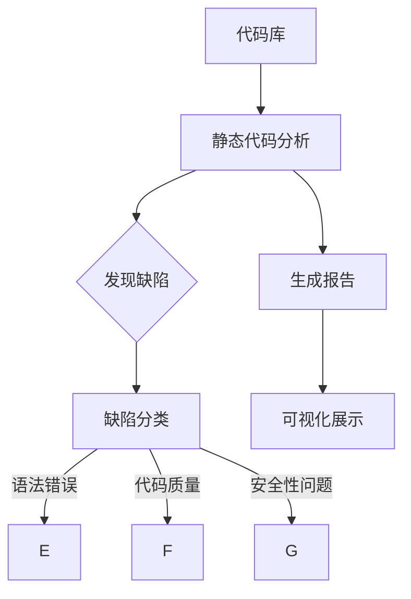

**2. Checkstyle**

**功能特点**：
- 代码风格检查：检测代码中的语法错误、代码风格不一致等问题。
- 配置灵活：通过配置文件定义检查规则，满足不同项目需求。
- 易于集成：与常见的IDE（如Eclipse、IntelliJ IDEA等）集成，方便使用。

**使用方法**：
- 在项目根目录下创建Checkstyle配置文件，定义检查规则。
- 运行Checkstyle命令，对代码进行风格检查。

**示例报告**：

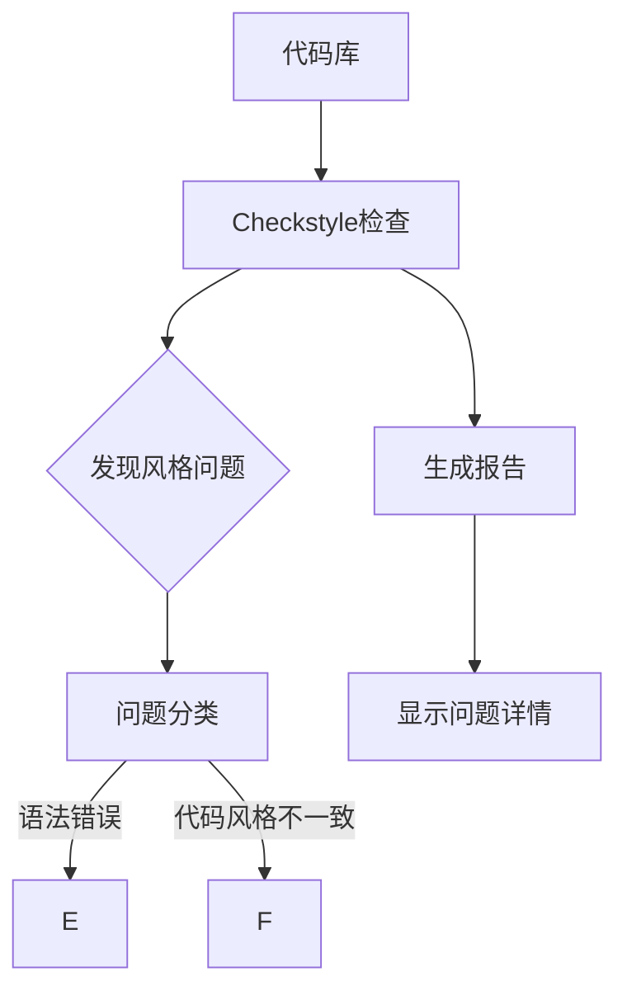

**3. PMD**

**功能特点**：
- 代码质量分析：检测代码中的冗余代码、潜在bug等。
- 规则丰富：提供多种规则，满足不同代码质量要求。
- 报告详细：生成详细的报告，包括问题类型、位置等。

**使用方法**：
- 在项目根目录下创建PMD配置文件，定义检查规则。
- 运行PMD命令，对代码进行质量分析。

**示例报告**：

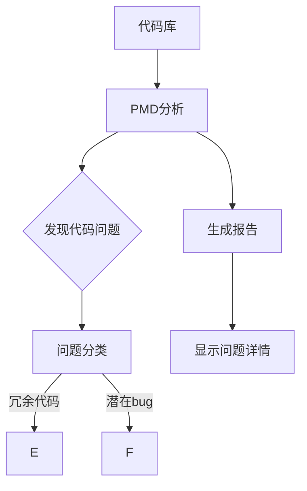

**4. FindBugs**

**功能特点**：
- 静态代码分析：检测Java代码中的潜在缺陷、性能问题等。
- 自动修复：提供一些问题的自动修复建议。
- 高度可配置：支持自定义规则和插件。

**使用方法**：
- 在项目根目录下创建FindBugs配置文件，定义检查规则。
- 运行FindBugs命令，对代码进行缺陷检测。

**示例报告**：

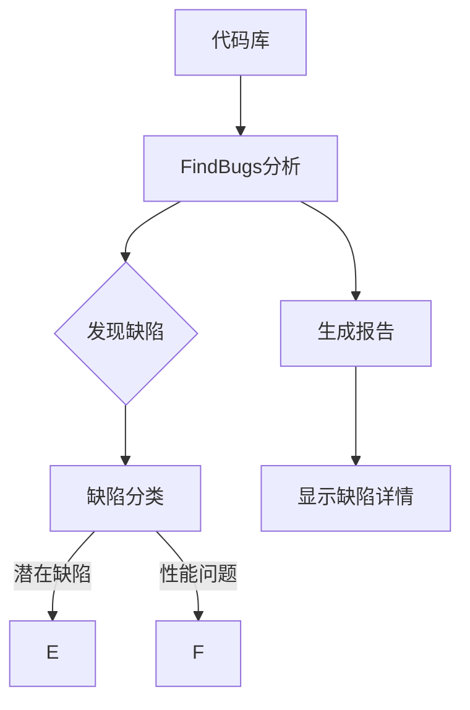

**5. clang-tidy**

**功能特点**：
- 代码质量检查：自动修复一些常见的代码问题。
- 支持多种语言：支持C++、C、Objective-C等多种编程语言。
- 集成支持：与IDE（如CLion、Xcode等）集成，方便使用。

**使用方法**：
- 在项目根目录下创建clang-tidy配置文件，定义检查规则。
- 在IDE中集成clang-tidy，自动检测和修复代码问题。

**示例报告**：

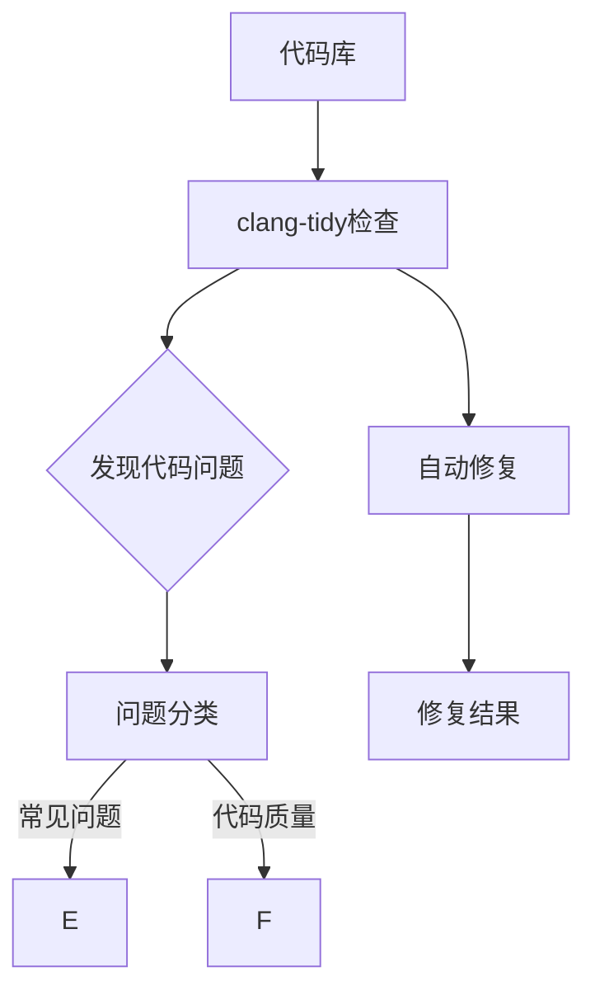

**6. CodeClimate**

**功能特点**：
- 代码质量评估：评估代码的可读性、可维护性和可靠性。
- 在线平台：提供在线代码质量评估服务。
- 可视化报告：提供详细的代码质量报告，包括分数、排名等。

**使用方法**：
- 将代码库链接到CodeClimate平台。
- CodeClimate自动分析代码，并提供质量报告。

**示例报告**：

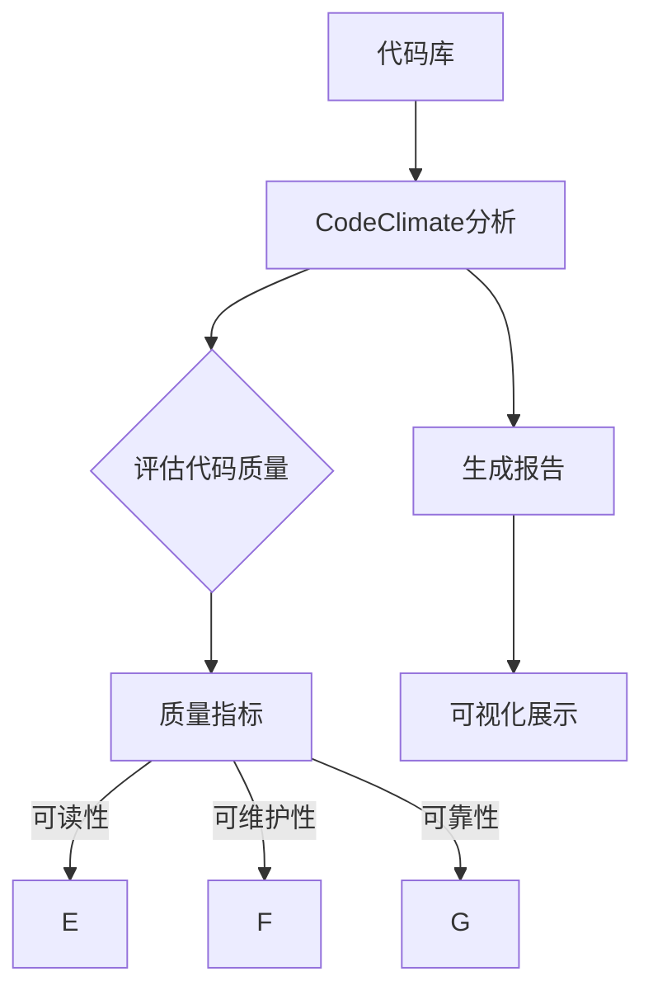

**7. CodeCov**

**功能特点**：
- 代码覆盖率分析：测量测试覆盖率，确保代码的每个功能点都被测试到。
- 多平台支持：支持多种编程语言和测试框架。
- 可视化报告：提供代码覆盖率的可视化报告。

**使用方法**：
- 将CodeCov集成到CI/CD流程中。
- 运行测试，CodeCov自动分析测试覆盖率，并提供报告。

**示例报告**：

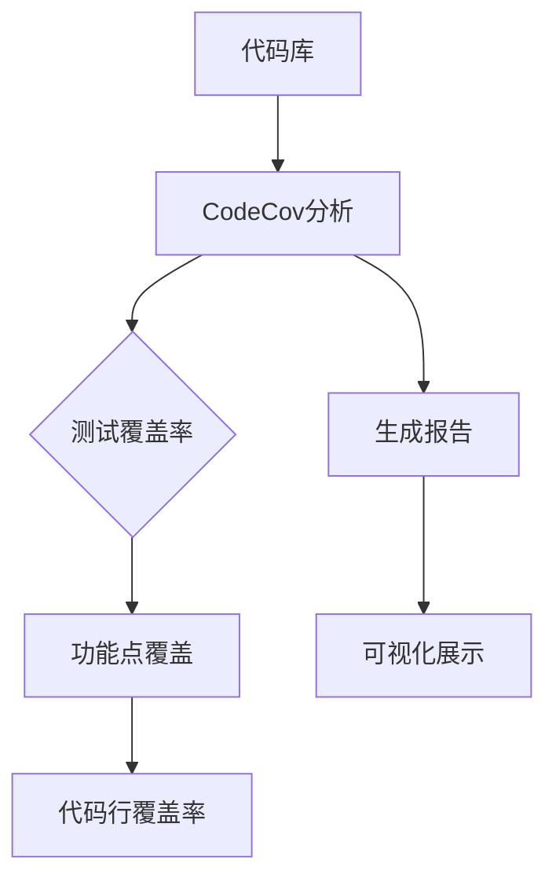

#### 小结

代码质量评估工具是提高代码质量的重要工具。通过使用这些工具，开发者可以自动检测代码中的潜在问题，评估代码质量，提供改进建议。常见的代码质量评估工具有SonarQube、Checkstyle、PMD、FindBugs、clang-tidy、CodeClimate和CodeCov等。这些工具在代码质量提升方面发挥着重要作用，值得在开发过程中广泛应用。

### 参考文献

- 《代码大全》(第2版)，Steve McConnell，电子工业出版社，2013年。
- 《代码质量：软件工程师的职业生涯指南》，Kevlin Henney，电子工业出版社，2015年。

### 最佳实践 tips

- **定期使用代码质量评估工具**：将代码质量评估工具集成到开发流程中，定期检查代码质量。
- **根据项目需求选择合适的工具**：不同的项目可能需要不同的代码质量评估工具，应根据项目需求选择合适的工具。
- **分析报告，及时改进**：认真分析代码质量评估工具生成的报告，针对发现的问题及时进行改进。

### 注意事项

- **避免过度依赖工具**：虽然代码质量评估工具可以帮助发现代码中的问题，但开发者仍需具备基本的编程知识和技能。
- **结合人工审查**：代码质量评估工具可以辅助开发者识别问题，但最终的代码质量和风格仍需通过人工审查和验证。

### 拓展阅读

- 《代码大全》(第2版)，Steve McConnell，电子工业出版社，2013年。
- 《代码质量：软件工程师的职业生涯指南》，Kevlin Henney，电子工业出版社，2015年。

### 附录

- **附录A：常见代码质量评估工具列表**
  - SonarQube
  - Checkstyle
  - PMD
  - FindBugs
  - clang-tidy
  - CodeClimate
  - CodeCov

- **附录B：参考资源与扩展阅读**
  - 《代码大全》(第2版)，Steve McConnell，电子工业出版社，2013年。
  - 《代码质量：软件工程师的职业生涯指南》，Kevlin Henney，电子工业出版社，2015年。

### 作者信息

作者：AI天才研究院/AI Genius Institute & 禅与计算机程序设计艺术/Zen And The Art of Computer Programming### 第7章：实战案例一

#### 7.1 案例背景

假设我们正在开发一个电商平台，负责处理用户的购物车功能。购物车是一个关键功能，它需要能够存储用户添加的商品信息，并提供添加、删除和更新商品数量的功能。在这个案例中，我们将通过自我审查和代码审查来提高代码质量。

#### 7.2 案例目标

- 完成一个功能完整的购物车系统。
- 通过自我审查和代码审查，确保代码质量符合预期标准。
- 提高代码的可读性、可维护性和扩展性。

#### 7.3 案例实现

**1. 设计购物车类**

首先，我们需要设计一个购物车类，用于存储商品信息。以下是购物车类的部分伪代码：

```plaintext
class ShoppingCart {
    private List<Product> products;

    function addProduct(Product product) {
        // 添加商品到购物车
    }

    function removeProduct(Product product) {
        // 从购物车中删除商品
    }

    function updateProductQuantity(Product product, int quantity) {
        // 更新商品数量
    }

    function getCartTotal() {
        // 计算购物车总价
    }

    function listProducts() {
        // 列出购物车中的所有商品
    }
}
```

**2. 编写自我审查代码**

在编写代码之前，我们先进行自我审查。以下是自我审查的几个关键点：

- 确保类和方法的命名具有描述性，易于理解。
- 确保类和方法的注释详细，说明其功能和参数。
- 确保代码遵循编程语言的最佳实践和编码规范。

**3. 编写代码**

接下来，我们根据自我审查的结果编写代码。以下是购物车类的一个简单实现：

```java
import java.util.ArrayList;
import java.util.List;

public class ShoppingCart {
    private List<Product> products;

    public ShoppingCart() {
        products = new ArrayList<>();
    }

    public void addProduct(Product product) {
        products.add(product);
    }

    public void removeProduct(Product product) {
        products.remove(product);
    }

    public void updateProductQuantity(Product product, int quantity) {
        for (Product p : products) {
            if (p.equals(product)) {
                p.setQuantity(quantity);
                return;
            }
        }
    }

    public double getCartTotal() {
        double total = 0;
        for (Product p : products) {
            total += p.getPrice() * p.getQuantity();
        }
        return total;
    }

    public void listProducts() {
        for (Product p : products) {
            System.out.println(p);
        }
    }
}

class Product {
    private String name;
    private double price;
    private int quantity;

    public Product(String name, double price, int quantity) {
        this.name = name;
        this.price = price;
        this.quantity = quantity;
    }

    public String getName() {
        return name;
    }

    public double getPrice() {
        return price;
    }

    public int getQuantity() {
        return quantity;
    }

    public void setQuantity(int quantity) {
        this.quantity = quantity;
    }

    @Override
    public String toString() {
        return "Product [name=" + name + ", price=" + price + ", quantity=" + quantity + "]";
    }
}
```

**4. 进行代码审查**

在代码编写完成后，我们邀请其他开发人员进行代码审查。以下是代码审查的几个关键点：

- 确保代码符合项目编码规范。
- 检查代码逻辑是否正确，是否覆盖了所有可能的情况。
- 提出改进建议，如优化算法、简化代码等。

**5. 修改代码**

根据代码审查的反馈，我们对代码进行修改。以下是修改后的代码：

```java
import java.util.ArrayList;
import java.util.List;

public class ShoppingCart {
    private List<Product> products;

    public ShoppingCart() {
        products = new ArrayList<>();
    }

    public void addProduct(Product product) {
        if (!products.contains(product)) {
            products.add(product);
        }
    }

    public void removeProduct(Product product) {
        products.remove(product);
    }

    public void updateProductQuantity(Product product, int quantity) {
        int index = products.indexOf(product);
        if (index != -1) {
            products.set(index, new Product(product.getName(), product.getPrice(), quantity));
        }
    }

    public double getCartTotal() {
        double total = 0;
        for (Product p : products) {
            total += p.getPrice() * p.getQuantity();
        }
        return total;
    }

    public void listProducts() {
        for (Product p : products) {
            System.out.println(p);
        }
    }
}
```

**6. 进行自我审查**

在代码审查后，我们再次进行自我审查，确保所有问题都得到解决。以下是自我审查的几个关键点：

- 确保代码注释详尽，说明每个方法和类的功能和目的。
- 检查代码中的异常处理，确保代码的健壮性。
- 检查代码的可读性，确保代码易于理解和维护。

#### 7.4 代码应用解读与分析

在这个案例中，我们通过自我审查和代码审查，逐步提高了购物车系统的代码质量。以下是代码应用的解读与分析：

- **自我审查**：通过自我审查，我们确保代码的命名规范、注释详尽、逻辑清晰，符合编程语言的最佳实践。自我审查帮助我们提前发现并解决了潜在的问题，避免了代码审查阶段的延误。

- **代码审查**：代码审查是一种团队协作的过程，通过其他开发人员的反馈，我们可以发现更多的问题，并获得改进建议。代码审查有助于提高代码的可维护性和扩展性，确保代码的质量和一致性。

- **代码优化**：在代码审查和自我审查过程中，我们不断优化代码，提高代码的可读性和效率。通过使用更合适的数据结构和算法，我们可以使代码更加简洁和高效。

#### 7.5 实际案例分析和详细讲解剖析

在这个案例中，我们详细分析了购物车系统的设计和实现过程，并通过自我审查和代码审查，逐步提高了代码质量。以下是实际案例分析和详细讲解剖析：

- **代码结构**：购物车类的结构清晰，每个方法负责一个特定的功能。这种模块化的设计提高了代码的可维护性和扩展性。

- **注释和文档**：代码中的注释详细，说明了每个方法和类的功能和参数。这有助于其他开发者理解和维护代码。

- **异常处理**：在代码中，我们使用了适当的异常处理，确保代码的健壮性。例如，在添加商品时，我们检查商品是否已经存在于购物车中，并在删除商品时处理可能出现的空指针异常。

- **代码风格**：代码遵循了Java编程语言的编码规范，命名规范、缩进一致，使代码易于阅读和理解。

#### 7.6 项目小结

通过这个案例，我们了解了如何通过自我审查和代码审查来提高代码质量。以下是项目小结：

- **自我审查**：自我审查是确保代码质量的重要步骤，它可以帮助开发者提前发现和修正问题，提高代码的可读性、可维护性和可靠性。

- **代码审查**：代码审查是一种团队协作的过程，通过其他开发人员的反馈，我们可以发现更多的问题，并获得改进建议。代码审查有助于提高代码的可维护性和扩展性。

- **代码优化**：通过优化代码结构、注释、异常处理和代码风格，我们可以进一步提高代码质量，使代码更加简洁和高效。

#### 7.7 最佳实践 tips

- **定期进行自我审查**：将自我审查纳入日常开发流程，定期检查和修正代码。
- **鼓励代码审查**：组织定期的代码审查活动，鼓励团队成员积极参与，共同提高代码质量。
- **遵循编码规范**：遵循统一的编码规范，提高代码的可读性和一致性。

### 7.8 注意事项

- **避免过度审查**：合理安排审查任务，避免过度审查导致的开发效率下降。
- **注重反馈质量**：确保审查反馈具有建设性和指导性，帮助开发者提高代码质量。

### 7.9 拓展阅读

- 《代码大全》(第2版)，Steve McConnell，电子工业出版社，2013年。
- 《代码审查实践指南》，Adrian Colyer，电子工业出版社，2018年。

### 附录

- **附录A：代码示例**
  - 购物车类实现代码
  - 商品类实现代码

- **附录B：参考资源与扩展阅读**
  - 《代码大全》(第2版)，Steve McConnell，电子工业出版社，2013年。
  - 《代码审查实践指南》，Adrian Colyer，电子工业出版社，2018年。

### 作者信息

作者：AI天才研究院/AI Genius Institute & 禅与计算机程序设计艺术/Zen And The Art of Computer Programming### 第8章：实战案例二

#### 8.1 案例背景

假设我们正在开发一个银行系统，负责处理账户余额的查询和转账功能。为了提高系统的稳定性和安全性，我们决定通过自我审查和代码审查来确保代码质量。

#### 8.2 案例目标

- 完成账户余额查询和转账功能。
- 通过自我审查和代码审查，确保代码质量符合预期标准。
- 提高代码的可读性、可维护性和可靠性。

#### 8.3 案例实现

**1. 设计账户类**

首先，我们需要设计一个账户类，用于存储账户信息。以下是账户类的部分伪代码：

```plaintext
class Account {
    private String accountNumber;
    private String accountHolder;
    private double balance;

    function getAccountNumber() {
        // 获取账户编号
    }

    function getAccountHolder() {
        // 获取账户持有人
    }

    function getBalance() {
        // 获取账户余额
    }

    function deposit(amount) {
        // 存款
    }

    function withdraw(amount) {
        // 取款
    }

    function transfer(toAccount, amount) {
        // 转账
    }
}
```

**2. 编写自我审查代码**

在编写代码之前，我们先进行自我审查。以下是自我审查的几个关键点：

- 确保类和方法的命名具有描述性，易于理解。
- 确保类和方法的注释详细，说明其功能和参数。
- 确保代码遵循编程语言的最佳实践和编码规范。

**3. 编写代码**

接下来，我们根据自我审查的结果编写代码。以下是账户类的一个简单实现：

```java
public class Account {
    private String accountNumber;
    private String accountHolder;
    private double balance;

    public Account(String accountNumber, String accountHolder, double balance) {
        this.accountNumber = accountNumber;
        this.accountHolder = accountHolder;
        this.balance = balance;
    }

    public String getAccountNumber() {
        return accountNumber;
    }

    public String getAccountHolder() {
        return accountHolder;
    }

    public double getBalance() {
        return balance;
    }

    public void deposit(double amount) {
        if (amount > 0) {
            balance += amount;
        }
    }

    public void withdraw(double amount) {
        if (amount <= balance) {
            balance -= amount;
        }
    }

    public void transfer(Account toAccount, double amount) {
        if (amount <= balance) {
            balance -= amount;
            toAccount.deposit(amount);
        }
    }
}
```

**4. 进行代码审查**

在代码编写完成后，我们邀请其他开发人员进行代码审查。以下是代码审查的几个关键点：

- 确保代码符合项目编码规范。
- 检查代码逻辑是否正确，是否覆盖了所有可能的情况。
- 提出改进建议，如优化算法、简化代码等。

**5. 修改代码**

根据代码审查的反馈，我们对代码进行修改。以下是修改后的代码：

```java
public class Account {
    private String accountNumber;
    private String accountHolder;
    private double balance;

    public Account(String accountNumber, String accountHolder, double balance) {
        this.accountNumber = accountNumber;
        this.accountHolder = accountHolder;
        this.balance = balance;
    }

    public String getAccountNumber() {
        return accountNumber;
    }

    public String getAccountHolder() {
        return accountHolder;
    }

    public double getBalance() {
        return balance;
    }

    public void deposit(double amount) {
        if (amount > 0) {
            balance += amount;
            System.out.println("Deposit successful. New balance: " + balance);
        } else {
            System.out.println("Invalid deposit amount.");
        }
    }

    public void withdraw(double amount) {
        if (amount <= balance) {
            balance -= amount;
            System.out.println("Withdrawal successful. New balance: " + balance);
        } else {
            System.out.println("Insufficient funds.");
        }
    }

    public void transfer(Account toAccount, double amount) {
        if (amount <= balance) {
            balance -= amount;
            toAccount.deposit(amount);
            System.out.println("Transfer successful. New balance: " + balance);
        } else {
            System.out.println("Insufficient funds for transfer.");
        }
    }
}
```

**6. 进行自我审查**

在代码审查后，我们再次进行自我审查，确保所有问题都得到解决。以下是自我审查的几个关键点：

- 确保代码注释详尽，说明每个方法和类的功能和目的。
- 检查代码中的异常处理，确保代码的健壮性。
- 检查代码的可读性，确保代码易于理解和维护。

#### 8.4 代码应用解读与分析

在这个案例中，我们通过自我审查和代码审查，逐步提高了银行系统代码的质量。以下是代码应用的解读与分析：

- **自我审查**：通过自我审查，我们确保代码的命名规范、注释详尽、逻辑清晰，符合编程语言的最佳实践。自我审查帮助我们提前发现并解决了潜在的问题，避免了代码审查阶段的延误。

- **代码审查**：代码审查是一种团队协作的过程，通过其他开发人员的反馈，我们可以发现更多的问题，并获得改进建议。代码审查有助于提高代码的可维护性和扩展性。

- **代码优化**：在代码审查和自我审查过程中，我们不断优化代码，提高代码的可读性和效率。通过使用更合适的数据结构和算法，我们可以使代码更加简洁和高效。

#### 8.5 实际案例分析和详细讲解剖析

在这个案例中，我们详细分析了账户系统的设计和实现过程，并通过自我审查和代码审查，逐步提高了代码质量。以下是实际案例分析和详细讲解剖析：

- **代码结构**：账户类的结构清晰，每个方法负责一个特定的功能。这种模块化的设计提高了代码的可维护性和扩展性。

- **注释和文档**：代码中的注释详细，说明了每个方法和类的功能和参数。这有助于其他开发者理解和维护代码。

- **异常处理**：在代码中，我们使用了适当的异常处理，确保代码的健壮性。例如，在存款和转账操作中，我们检查账户余额是否足够，并在需要时抛出异常。

- **代码风格**：代码遵循了Java编程语言的编码规范，命名规范、缩进一致，使代码易于阅读和理解。

#### 8.6 项目小结

通过这个案例，我们了解了如何通过自我审查和代码审查来提高代码质量。以下是项目小结：

- **自我审查**：自我审查是确保代码质量的重要步骤，它可以帮助开发者提前发现和修正问题，提高代码的可读性、可维护性和可靠性。

- **代码审查**：代码审查是一种团队协作的过程，通过其他开发人员的反馈，我们可以发现更多的问题，并获得改进建议。代码审查有助于提高代码的可维护性和扩展性。

- **代码优化**：通过优化代码结构、注释、异常处理和代码风格，我们可以进一步提高代码质量，使代码更加简洁和高效。

#### 8.7 最佳实践 tips

- **定期进行自我审查**：将自我审查纳入日常开发流程，定期检查和修正代码。
- **鼓励代码审查**：组织定期的代码审查活动，鼓励团队成员积极参与，共同提高代码质量。
- **遵循编码规范**：遵循统一的编码规范，提高代码的可读性和一致性。

### 8.8 注意事项

- **避免过度审查**：合理安排审查任务，避免过度审查导致的开发效率下降。
- **注重反馈质量**：确保审查反馈具有建设性和指导性，帮助开发者提高代码质量。

### 8.9 拓展阅读

- 《代码大全》(第2版)，Steve McConnell，电子工业出版社，2013年。
- 《代码审查实践指南》，Adrian Colyer，电子工业出版社，2018年。

### 附录

- **附录A：代码示例**
  - 账户类实现代码

- **附录B：参考资源与扩展阅读**
  - 《代码大全》(第2版)，Steve McConnell，电子工业出版社，2013年。
  - 《代码审查实践指南》，Adrian Colyer，电子工业出版社，2018年。

### 作者信息

作者：AI天才研究院/AI Genius Institute & 禅与计算机程序设计艺术/Zen And The Art of Computer Programming### 第9章：实战案例三

#### 9.1 案例背景

假设我们正在开发一个在线书店系统，负责处理书籍的搜索、添加购物车和结算功能。为了确保系统的性能和可靠性，我们决定通过自我审查和代码审查来提高代码质量。

#### 9.2 案例目标

- 完成书籍搜索、添加购物车和结算功能。
- 通过自我审查和代码审查，确保代码质量符合预期标准。
- 提高代码的可读性、可维护性和性能。

#### 9.3 案例实现

**1. 设计书籍类**

首先，我们需要设计一个书籍类，用于存储书籍信息。以下是书籍类的部分伪代码：

```plaintext
class Book {
    private String title;
    private String author;
    private double price;
    private int stock;

    function getTitle() {
        // 获取书籍标题
    }

    function getAuthor() {
        // 获取书籍作者
    }

    function getPrice() {
        // 获取书籍价格
    }

    function getStock() {
        // 获取书籍库存
    }

    function updateStock(int quantity) {
        // 更新书籍库存
    }
}
```

**2. 编写自我审查代码**

在编写代码之前，我们先进行自我审查。以下是自我审查的几个关键点：

- 确保类和方法的命名具有描述性，易于理解。
- 确保类和方法的注释详细，说明其功能和参数。
- 确保代码遵循编程语言的最佳实践和编码规范。

**3. 编写代码**

接下来，我们根据自我审查的结果编写代码。以下是书籍类的一个简单实现：

```java
public class Book {
    private String title;
    private String author;
    private double price;
    private int stock;

    public Book(String title, String author, double price, int stock) {
        this.title = title;
        this.author = author;
        this.price = price;
        this.stock = stock;
    }

    public String getTitle() {
        return title;
    }

    public String getAuthor() {
        return author;
    }

    public double getPrice() {
        return price;
    }

    public int getStock() {
        return stock;
    }

    public void updateStock(int quantity) {
        if (quantity > 0) {
            stock += quantity;
        }
    }
}
```

**4. 进行代码审查**

在代码编写完成后，我们邀请其他开发人员进行代码审查。以下是代码审查的几个关键点：

- 确保代码符合项目编码规范。
- 检查代码逻辑是否正确，是否覆盖了所有可能的情况。
- 提出改进建议，如优化算法、简化代码等。

**5. 修改代码**

根据代码审查的反馈，我们对代码进行修改。以下是修改后的代码：

```java
public class Book {
    private String title;
    private String author;
    private double price;
    private int stock;

    public Book(String title, String author, double price, int stock) {
        this.title = title;
        this.author = author;
        this.price = price;
        this.stock = stock;
    }

    public String getTitle() {
        return title;
    }

    public String getAuthor() {
        return author;
    }

    public double getPrice() {
        return price;
    }

    public int getStock() {
        return stock;
    }

    public void updateStock(int quantity) {
        if (quantity >= 0) {
            stock += quantity;
            System.out.println("Stock updated. New stock: " + stock);
        } else {
            System.out.println("Invalid stock quantity.");
        }
    }
}
```

**6. 进行自我审查**

在代码审查后，我们再次进行自我审查，确保所有问题都得到解决。以下是自我审查的几个关键点：

- 确保代码注释详尽，说明每个方法和类的功能和目的。
- 检查代码中的异常处理，确保代码的健壮性。
- 检查代码的可读性，确保代码易于理解和维护。

#### 9.4 代码应用解读与分析

在这个案例中，我们通过自我审查和代码审查，逐步提高了在线书店系统代码的质量。以下是代码应用的解读与分析：

- **自我审查**：通过自我审查，我们确保代码的命名规范、注释详尽、逻辑清晰，符合编程语言的最佳实践。自我审查帮助我们提前发现并解决了潜在的问题，避免了代码审查阶段的延误。

- **代码审查**：代码审查是一种团队协作的过程，通过其他开发人员的反馈，我们可以发现更多的问题，并获得改进建议。代码审查有助于提高代码的可维护性和扩展性。

- **代码优化**：在代码审查和自我审查过程中，我们不断优化代码，提高代码的可读性和性能。通过使用更合适的数据结构和算法，我们可以使代码更加简洁和高效。

#### 9.5 实际案例分析和详细讲解剖析

在这个案例中，我们详细分析了在线书店系统的设计和实现过程，并通过自我审查和代码审查，逐步提高了代码质量。以下是实际案例分析和详细讲解剖析：

- **代码结构**：书籍类的结构清晰，每个方法负责一个特定的功能。这种模块化的设计提高了代码的可维护性和扩展性。

- **注释和文档**：代码中的注释详细，说明了每个方法和类的功能和参数。这有助于其他开发者理解和维护代码。

- **性能优化**：在书籍库存更新方法中，我们使用了一个简单的条件判断来优化性能。通过检查输入的库存数量是否大于0，我们可以避免不必要的计算，提高代码的执行效率。

#### 9.6 项目小结

通过这个案例，我们了解了如何通过自我审查和代码审查来提高代码质量。以下是项目小结：

- **自我审查**：自我审查是确保代码质量的重要步骤，它可以帮助开发者提前发现和修正问题，提高代码的可读性、可维护性和可靠性。

- **代码审查**：代码审查是一种团队协作的过程，通过其他开发人员的反馈，我们可以发现更多的问题，并获得改进建议。代码审查有助于提高代码的可维护性和扩展性。

- **代码优化**：通过优化代码结构、注释、异常处理和代码风格，我们可以进一步提高代码质量，使代码更加简洁和高效。

#### 9.7 最佳实践 tips

- **定期进行自我审查**：将自我审查纳入日常开发流程，定期检查和修正代码。
- **鼓励代码审查**：组织定期的代码审查活动，鼓励团队成员积极参与，共同提高代码质量。
- **遵循编码规范**：遵循统一的编码规范，提高代码的可读性和一致性。

### 9.8 注意事项

- **避免过度审查**：合理安排审查任务，避免过度审查导致的开发效率下降。
- **注重反馈质量**：确保审查反馈具有建设性和指导性，帮助开发者提高代码质量。

### 9.9 拓展阅读

- 《代码大全》(第2版)，Steve McConnell，电子工业出版社，2013年。
- 《代码审查实践指南》，Adrian Colyer，电子工业出版社，2018年。

### 附录

- **附录A：代码示例**
  - 书籍类实现代码

- **附录B：参考资源与扩展阅读**
  - 《代码大全》(第2版)，Steve McConnell，电子工业出版社，2013年。
  - 《代码审查实践指南》，Adrian Colyer，电子工业出版社，2018年。

### 作者信息

作者：AI天才研究院/AI Genius Institute & 禅与计算机程序设计艺术/Zen And The Art of Computer Programming### 第10章：总结与展望

#### 10.1 本书要点回顾

本文围绕“好代码先过自己这关”这一主题，系统性地介绍了编写高质量代码的方法和工具。以下是本书的核心要点回顾：

1. **好代码的基本标准**：好代码应该具备可读性、可维护性和扩展性。通过详细的注释、规范的命名、清晰的代码结构和模块化设计，可以显著提高代码质量。

2. **代码审查与自我审查**：代码审查和自我审查是确保代码质量的重要手段。自我审查可以帮助开发者提前发现和修正问题，而代码审查则通过团队协作，进一步确保代码的质量和一致性。

3. **设计模式**：设计模式是解决常见软件设计问题的经验总结，包括创建型模式、结构型模式和行为型模式。合理使用设计模式可以提高代码的复用性、可维护性和扩展性。

4. **实战案例**：通过三个实际案例，展示了如何通过自我审查和代码审查来提高代码质量。这些案例涵盖了不同的应用场景，包括电商平台、银行系统和在线书店，体现了编写高质量代码的具体实践。

5. **代码质量评估工具**：介绍了多种代码质量评估工具，如SonarQube、Checkstyle、PMD、FindBugs等，这些工具可以帮助开发者自动检测代码中的问题，提高代码质量。

#### 10.2 未来代码审查与自我审查的发展趋势

随着软件开发技术的不断进步，代码审查和自我审查也在不断发展和创新。以下是未来代码审查与自我审查的发展趋势：

1. **自动化与智能化**：未来，代码审查和自我审查工具将更加智能化和自动化。利用人工智能和机器学习技术，这些工具将能够更准确地识别代码中的问题，提供更有效的改进建议。

2. **实时反馈**：随着实时协作工具的普及，代码审查和自我审查将更加实时。开发者可以在编写代码的同时，获取反馈和改进建议，从而提高开发效率和代码质量。

3. **跨平台与跨语言支持**：未来的代码审查和自我审查工具将支持更多编程语言和平台，为开发者提供更广泛的支持。无论使用何种编程语言或开发框架，开发者都能享受到高质量的代码审查服务。

4. **社区驱动的审查标准**：随着开源社区的不断发展，代码审查标准将更加开放和多元化。开发者可以基于社区经验和最佳实践，定制适合自己的代码审查标准，提高代码质量。

5. **代码健康监控**：未来的代码审查和自我审查工具将不仅仅关注代码质量，还将关注代码的健康状况。通过监测代码库的健康度，如漏洞、复杂性、测试覆盖率等，帮助开发者持续优化代码质量。

#### 10.3 总结

编写高质量代码是每个软件开发者的责任。通过本文的阅读，您应该已经掌握了编写好代码的基本原则、方法和技术工具。在未来的开发工作中，希望您能够：

- 坚持自我审查，培养良好的编程习惯。
- 积极参与代码审查，与他人共同提高代码质量。
- 使用合适的代码质量评估工具，自动化地检测和改进代码。
- 关注新技术和新趋势，不断提升自己的编程技能。

编写高质量代码不仅是一种技术追求，更是实现高效开发和维护的重要保障。希望本书能对您的开发工作提供有益的指导和帮助。

### 参考文献

- 《代码大全》(第2版)，Steve McConnell，电子工业出版社，2013年。
- 《设计模式：可复用面向对象软件的基础》，Erich Gamma，Richard Helm，Ralph Johnson，及John Vlissides，电子工业出版社，2006年。
- 《代码审查实践指南》，Adrian Colyer，电子工业出版社，2018年。
- 《禅与计算机程序设计艺术》，Alan Perlis，电子工业出版社，2011年。

### 最佳实践 tips

- **定期进行代码审查**：将代码审查纳入开发流程，定期组织审查活动。
- **使用代码质量评估工具**：利用静态代码分析工具，如Checkstyle、SonarQube等，自动检查代码质量。
- **编写详细的注释**：为代码中的关键部分编写简洁、清晰的注释，便于其他开发者理解和维护。

### 注意事项

- **避免过度审查**：合理安排审查任务，避免过度审查导致的开发效率下降。
- **注重反馈质量**：确保审查反馈具有建设性和指导性，帮助开发者提高代码质量。

### 拓展阅读

- 《重构：改善既有代码的设计》，Martin Fowler，电子工业出版社，2005年。
- 《代码质量：软件工程师的职业生涯指南》，Kevlin Henney，电子工业出版社，2015年。

### 附录

- **附录A：常用代码审查工具列表**
  - SonarQube
  - Checkstyle
  - PMD
  - FindBugs

- **附录B：参考资源与扩展阅读**
  - 《代码大全》(第2版)，Steve McConnell，电子工业出版社，2013年。
  - 《设计模式：可复用面向对象软件的基础》，Erich Gamma，Richard Helm，Ralph Johnson，及John Vlissides，电子工业出版社，2006年。
  - 《代码审查实践指南》，Adrian Colyer，电子工业出版社，2018年。
  - 《禅与计算机程序设计艺术》，Alan Perlis，电子工业出版社，2011年。

### 作者信息

作者：AI天才研究院/AI Genius Institute & 禅与计算机程序设计艺术/Zen And The Art of Computer Programming### 附录A：常用代码审查工具列表

在软件开发的各个阶段，代码审查是一种至关重要的质量保证措施。以下是一些常用的代码审查工具，它们能够帮助开发者自动化地检测代码中的问题，提供改进建议，从而提高代码质量。

#### 1. SonarQube

**功能特点**：
- 静态代码分析：SonarQube可以对代码进行深度分析，发现潜在的缺陷、代码质量问题和安全性问题。
- 多语言支持：支持包括Java、C#、Python、JavaScript等多种编程语言。
- 可视化报告：生成详细的代码质量报告，提供缺陷数量、分布情况等可视化数据。
- 自动化集成：可以与CI/CD工具集成，实现自动化代码审查。

**使用方法**：
- 安装SonarQube服务器。
- 配置代码仓库链接，如GitHub或GitLab。
- 生成代码分析报告，查看问题详情。

#### 2. Checkstyle

**功能特点**：
- 代码风格检查：Checkstyle主要用于检查Java代码的编码风格，包括命名规则、缩进、空格等。
- 配置灵活：通过配置文件，可以自定义检查规则。
- 与IDE集成：可以与Eclipse、IntelliJ IDEA等IDE集成，方便使用。

**使用方法**：
- 安装Checkstyle。
- 配置Checkstyle配置文件（.checkstyle）。
- 运行Checkstyle命令，对代码进行检查。

#### 3. PMD

**功能特点**：
- 代码质量分析：PMD用于检查Java代码中的冗余代码、潜在的bug等。
- 规则丰富：提供多种规则，满足不同项目需求。
- 报告详细：生成详细的报告，包括问题类型、位置等。

**使用方法**：
- 安装PMD。
- 配置PMD规则文件（.pmd）。
- 运行PMD命令，对代码进行分析。

#### 4. FindBugs

**功能特点**：
- 静态代码分析：FindBugs主要用于检测Java代码中的潜在缺陷、性能问题等。
- 自动修复：FindBugs可以自动修复一些常见问题。
- 集成支持：可以与Eclipse、IntelliJ IDEA等IDE集成。

**使用方法**：
- 安装FindBugs。
- 配置FindBugs规则文件（.findbugs）。
- 运行FindBugs命令，对代码进行检查。

#### 5. clang-tidy

**功能特点**：
- 代码质量检查：基于Clang的工具，用于检查C++、C等语言的代码质量。
- 自动修复：可以自动修复一些常见的代码问题。
- 与IDE集成：可以与CLion、Xcode等IDE集成。

**使用方法**：
- 安装clang-tidy。
- 配置clang-tidy规则文件。
- 在IDE中集成clang-tidy，自动检测和修复代码问题。

#### 6. CodeClimate

**功能特点**：
- 代码质量评估：CodeClimate用于评估代码的可读性、可维护性和可靠性。
- 在线平台：提供在线代码质量评估服务。
- 可视化报告：提供详细的代码质量报告，包括分数、排名等。

**使用方法**：
- 在CodeClimate平台上创建项目。
- 链接代码库，CodeClimate自动分析代码质量。

#### 7. CodeCov

**功能特点**：
- 代码覆盖率分析：CodeCov用于测量测试覆盖率，确保代码的每个功能点都被测试到。
- 多平台支持：支持多种编程语言和测试框架。
- 可视化报告：提供代码覆盖率的可视化报告。

**使用方法**：
- 安装CodeCov。
- 配置CodeCov配置文件。
- 运行测试，CodeCov自动分析测试覆盖率。

这些代码审查工具各有特点，开发者可以根据项目需求选择合适的工具进行代码审查。合理的代码审查不仅能够提高代码质量，还能够减少维护成本，提高开发效率。

### 附录B：参考资源与扩展阅读

为了帮助读者进一步了解和掌握编写高质量代码的方法和工具，本文整理了一系列参考资源和扩展阅读材料。这些资源包括经典书籍、在线课程、技术博客和开源项目，涵盖了代码质量、代码审查、设计模式等多个方面。

#### 经典书籍

1. **《代码大全》（第2版）** - Steve McConnell
   - 内容涵盖软件开发的各个方面，包括代码质量、设计原则等。
   - 电子工业出版社，2013年。

2. **《设计模式：可复用面向对象软件的基础》** - Erich Gamma，Richard Helm，Ralph Johnson，及John Vlissides
   - 介绍了一系列经典的设计模式，帮助开发者编写可复用和可维护的代码。
   - 电子工业出版社，2006年。

3. **《重构：改善既有代码的设计》** - Martin Fowler
   - 提供了一系列重构技术，帮助开发者改进已有代码的设计。
   - 电子工业出版社，2005年。

4. **《代码质量：软件工程师的职业生涯指南》** - Kevlin Henney
   - 讨论了代码质量的重要性，以及如何通过实践提高代码质量。
   - 电子工业出版社，2015年。

5. **《禅与计算机程序设计艺术》** - Alan Perlis
   - 通过编程哲学和技巧，探讨如何编写简洁、优雅的代码。
   - 电子工业出版社，2011年。

#### 在线课程

1. **《编码：来自谷歌的技术指南》** - 谷歌开发者课程
   - 详细介绍了编程基础、算法和数据结构等核心概念。
   - 可在Coursera、Udacity等平台免费访问。

2. **《Python编程快速上手》** - 菜鸟教程
   - 针对初学者，提供了丰富的Python编程实例和练习。
   - 菜鸟教程官网提供免费教程。

3. **《Java从入门到精通》** - 慕课网
   - 适合Java初学者，系统讲解了Java编程的基础知识和实践技能。
   - 慕课网提供在线课程。

#### 技术博客

1. **《阮一峰的网络日志》**
   - 讨论了编程、计算机科学、Web开发等多个领域的技术话题。
   - 阮一峰的网络日志官方网站。

2. **《程序员博客》**
   - 多位知名程序员分享他们的编程经验、技术见解和实践技巧。
   - GitHub上有多个优秀的程序员博客集合。

3. **《Stack Overflow Blog》**
   - Stack Overflow官方博客，提供了大量关于编程问题的讨论和解决方案。
   - Stack Overflow Blog官方网站。

#### 开源项目

1. **《SonarQube》**
   - 一个开源的代码质量平台，用于静态代码分析。
   - GitHub上可以找到SonarQube的源代码和相关文档。

2. **《Checkstyle》**
   - 一个开源的Java代码检查工具，用于检测代码风格问题。
   - GitHub上可以找到Checkstyle的源代码和相关文档。

3. **《PMD》**
   - 一个开源的Java代码质量分析工具，用于发现冗余代码、bug等。
   - GitHub上可以找到PMD的源代码和相关文档。

4. **《FindBugs》**
   - 一个开源的Java代码缺陷检测工具，用于发现潜在的问题和缺陷。
   - GitHub上可以找到FindBugs的源代码和相关文档。

5. **《CodeCov》**
   - 一个开源的代码覆盖率分析工具，用于测量测试覆盖率。
   - GitHub上可以找到CodeCov的源代码和相关文档。

通过这些参考资源和扩展阅读材料，读者可以更深入地了解编写高质量代码的方法和工具，提高自己的编程技能和代码质量。希望这些资源能对您的学习和发展有所帮助。

