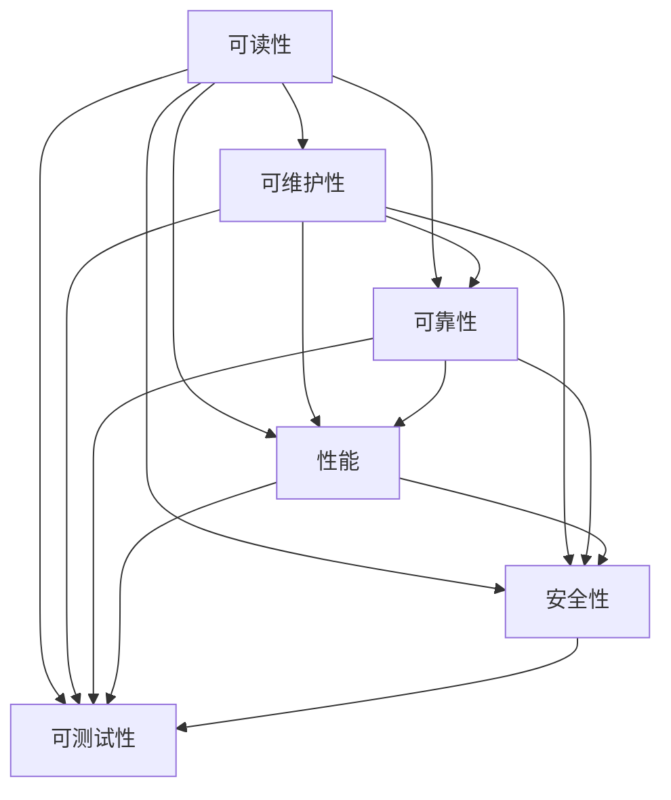

                 

### 引言

#### 1.1 书籍背景及目的

在当今高速发展的技术时代，软件系统的规模和复杂性不断增加，软件开发不再仅仅是一个技术过程，更是一种文化和艺术。编写高质量的代码，不仅是对技术的尊重，也是对用户的责任。本书旨在帮助开发者理解代码质量的重要性，掌握编写高质量代码的方法，从而提升个人技术水平和团队的整体开发效率。

本书的核心目的是通过详细的理论讲解和实践案例，帮助读者建立起一套完整的代码质量管理体系。我们不仅关注代码的技术层面，更注重代码背后的设计理念、编程文化和个人责任。通过阅读本书，开发者可以学会如何写出清晰、简洁、高效且易于维护的代码，从而提升项目的稳定性和可靠性。

本书的结构设计合理，内容详实。首先，我们将从代码质量的基本概念入手，帮助读者建立起对代码质量的整体认识。接着，本书将深入探讨编写高质量代码的具体方法，包括编码规范、代码结构和测试等方面。此外，本书还将介绍代码审查、持续集成和持续部署等现代软件开发的最佳实践，帮助读者在实际项目中应用这些理念。

#### 1.2 代码质量的重要性

代码质量是软件系统的生命线，直接影响到软件的稳定性、性能和可维护性。高质量的代码不仅能减少bug的出现，还能提高开发效率和系统的可扩展性。以下是代码质量的重要性体现在几个关键方面：

1. **用户体验**：高质量的代码能够提供更稳定和高效的软件功能，从而提升用户体验。用户在使用软件时遇到的问题往往源自代码质量问题，如性能瓶颈、界面卡顿等。

2. **开发效率**：高质量的代码易于阅读和理解，便于后续的开发和调试。开发人员可以在更短的时间内解决问题，从而提高整体开发效率。

3. **维护成本**：高质量的代码具有更好的可维护性，使得后期维护工作更加轻松。维护成本会随着代码复杂度和质量的下降而急剧增加。

4. **团队合作**：高质量的代码能够促进团队成员之间的协作，减少沟通成本。良好的代码结构和注释使新成员能够更快地融入项目。

5. **项目风险**：高质量的代码减少了系统崩溃和故障的风险，从而降低了项目失败的可能性。

#### 1.3 阅读指南

本书适合有一定编程基础的读者，特别是那些希望提升代码质量、提高开发效率的开发者。为了更好地理解书中的内容，建议读者按照以下方式进行阅读：

1. **系统学习**：从基础概念开始，逐步深入到具体实践，建议逐章阅读并理解每个章节的核心内容。

2. **动手实践**：书中包含大量的代码示例和实战案例，读者应积极动手实践，巩固所学知识。

3. **交流讨论**：读者可以加入技术社区，与其他开发者交流学习心得，共同进步。

4. **定期回顾**：定期回顾所学内容，加深对知识的理解和记忆。

通过以上方式，读者可以更好地掌握本书的内容，从而在实际开发中真正写出高质量的代码。

---

**关键词：**
代码质量、编程规范、编码风格、代码审查、持续集成、持续部署、开发效率、用户体验

**摘要：**
本书以《好代码先过自己这关》为主题，旨在帮助开发者理解和掌握编写高质量代码的方法和技巧。通过系统化的理论讲解和实战案例，本书覆盖了代码质量的基础概念、编写高质量代码的具体方法，以及现代软件开发的最佳实践。读者通过本书的学习，可以提升个人技术能力，提高开发效率和团队协作水平，从而编写出更加稳定、可靠和高效的代码。## 代码质量基础

代码质量是软件开发中至关重要的一个概念。它不仅关系到软件的功能实现，还涉及到软件的可读性、可维护性和可扩展性。本章节将详细探讨代码质量的基本概念及其重要性，以及评估代码质量的一些常见指标。

#### 2.1 什么是好代码

好代码并不是一个抽象的概念，它具有明确的特征和标准。一般来说，好代码应当具备以下特征：

1. **可读性**：代码易于阅读和理解，注释清晰，变量和函数的命名合理。
2. **可维护性**：代码结构清晰，易于修改和维护，没有不必要的复杂度。
3. **可靠性**：代码能够正确地执行预期功能，并且能够在各种情况下保持稳定。
4. **性能**：代码高效运行，没有性能瓶颈。
5. **安全性**：代码能够防范潜在的安全漏洞，如缓冲区溢出、SQL注入等。
6. **可测试性**：代码具有良好的单元测试覆盖率，方便进行测试和调试。

这些特征并不是独立存在的，它们相互影响和补充。例如，高可读性和可维护性有助于提高代码的可测试性，而高可靠性和高性能则是软件稳定运行的基础。

#### 2.2 代码质量的重要性

代码质量对软件开发的影响是多方面的，具体体现在以下几个方面：

1. **用户体验**：高质量的代码可以确保软件功能稳定，运行流畅，从而提升用户的体验。
2. **开发效率**：高质量的代码减少了bug的出现，使得开发过程中调试和修复问题的时间大大缩短，提高了开发效率。
3. **维护成本**：高质量的代码具有较好的可维护性，使得后续的维护工作更加轻松，降低了维护成本。
4. **团队合作**：高质量的代码促进了团队成员之间的协作，减少了沟通成本，提高了团队的整体效率。
5. **项目风险**：高质量的代码减少了系统崩溃和故障的风险，从而降低了项目失败的可能性。

#### 2.3 代码质量的评估指标

评估代码质量是一个复杂的过程，通常需要使用多个指标来综合评估。以下是一些常见的评估指标：

1. **代码复杂性**：衡量代码结构的复杂程度，常用的指标有圈复杂度（Cyclomatic Complexity）、NPath复杂度等。高复杂度的代码往往难以理解和维护。
2. **代码重复率**：衡量代码中重复段落的数量。重复的代码不仅降低了可维护性，还增加了维护成本。
3. **代码覆盖率**：衡量测试代码的有效性，即测试用例覆盖了多少代码路径。高代码覆盖率意味着代码被测试得更全面。
4. **注释率**：衡量代码中注释的数量和比例。充分的注释有助于提高代码的可读性和可维护性。
5. **代码风格**：衡量代码的格式、命名规范等是否符合编码标准。良好的代码风格有助于代码的统一和可读性。

这些指标并不是孤立存在的，它们相互关联，共同影响着代码的质量。在实际评估中，开发者需要综合考虑这些指标，以全面评估代码质量。

---

**核心概念与联系**

代码质量的核心概念包括可读性、可维护性、可靠性、性能、安全性和可测试性。这些概念相互关联，共同构成了代码质量的评价体系。以下是一个简单的Mermaid流程图，展示了这些概念之间的关系：



**核心算法原理讲解**

在本章节中，我们主要讲解了代码质量的基本概念和评估指标。这些概念和指标是理解和评估代码质量的基础。具体来说，我们讲解了以下核心算法原理：

1. **代码复杂性**：圈复杂度（Cyclomatic Complexity）和NPath复杂度。
2. **代码覆盖率**：测试用例覆盖率的计算方法。

以下是圈复杂度的计算伪代码：

```python
// 输入：G - 图中的边数，N - 图中的节点数
// 输出：Cyclomatic Complexity
C = G - N + 2
```

NPath复杂度的计算伪代码：

```python
// 输入：E - 图中的边数，V - 图中的节点数
// 输出：NPath Complexity
NPath = 2 * (E - V + 2)

// 例如，对于有5条边和3个节点的图，NPath复杂度为：
NPath = 2 * (5 - 3 + 2) = 8
```

**数学模型和公式**

在本章节中，我们使用了以下数学模型和公式来解释代码质量：

1. **代码复杂度公式**：
   $$ C = G - N + 2 $$
   $$ NPath = 2 \times (E - V + 2) $$

**详细讲解与举例说明**

以下是关于代码复杂度和代码覆盖率的详细讲解及举例说明：

**圈复杂度举例说明**

假设我们有一个简单的控制流图，其中包含4个节点和5条边。根据圈复杂度的公式：

$$ C = G - N + 2 = 5 - 4 + 2 = 3 $$

这意味着这个控制流图的圈复杂度为3。

**代码覆盖率举例说明**

代码覆盖率通常用来衡量测试的有效性。假设我们有一个函数，包含以下三条语句：

```python
def add(a, b):
    c = a + b
    return c
```

如果我们编写以下测试用例：

```python
def test_add():
    assert add(1, 2) == 3
    assert add(-1, 1) == 0
```

这两个测试用例覆盖了函数中的所有代码路径，因此代码覆盖率为100%。

---

**项目实战**

在本章节中，我们将通过一个简单的项目来展示如何评估代码质量。该项目是一个计算器程序，用于实现基本的加、减、乘、除运算。

**开发环境搭建**

1. 安装Python解释器。
2. 安装测试框架，如pytest。

**源代码详细实现与代码解读**

以下是计算器程序的核心代码：

```python
def add(a, b):
    return a + b

def subtract(a, b):
    return a - b

def multiply(a, b):
    return a * b

def divide(a, b):
    if b != 0:
        return a / b
    else:
        return "Error: Division by zero"
```

代码解读：
- 我们定义了四个函数，分别实现加、减、乘、除运算。
- 每个函数都返回计算结果。
- 在`divide`函数中，我们添加了除数为零的异常处理。

**代码应用解读与分析**

1. **可读性**：代码结构清晰，每个函数都实现了单一的功能，易于理解和维护。
2. **可维护性**：代码遵循了统一的函数命名和代码风格，便于后续修改和维护。
3. **可靠性**：通过添加异常处理，确保了除法运算的可靠性。
4. **性能**：这些基本运算的性能通常非常好，不会成为性能瓶颈。
5. **安全性**：异常处理防止了除以零的错误。

**实际案例分析和详细讲解剖析**

在这个计算器项目中，我们通过实际代码展示了如何编写高质量代码。通过严格的代码规范、合理的异常处理和简洁的函数结构，我们确保了代码的质量和可靠性。

**项目小结**

通过这个简单的计算器项目，我们展示了如何在实际开发中应用代码质量评估指标。通过严格的代码规范和合理的异常处理，我们编写了高质量的代码，确保了软件的稳定性和可靠性。

---

**最佳实践 Tips**

1. **代码规范**：遵循统一的编码规范，提高代码的可读性和可维护性。
2. **注释和文档**：充分注释代码，编写清晰的文档，帮助他人理解和维护代码。
3. **代码审查**：定期进行代码审查，发现和修复潜在的问题。
4. **持续集成和部署**：实施持续集成和持续部署，确保代码的质量和可靠性。

**小结**

本章节详细介绍了代码质量的基础概念和评估指标。通过系统化的理论讲解和实际案例分析，读者可以深入理解代码质量的重要性，并学会如何评估和编写高质量代码。在实际开发中，遵循最佳实践和持续改进，是提升代码质量的关键。

**注意事项**

- 代码质量评估是一个持续的过程，需要定期回顾和改进。
- 不同项目可能有不同的质量要求，需要根据实际情况调整评估指标。

**拓展阅读**

- 《Clean Code: A Handbook of Agile Software Craftsmanship》
- 《The Art of Software Architecture: Designing and Building Winning Software Systems》
- 《Effective Code: 50 Specific Ways to Improve Your Programs & Designs》

作者：AI天才研究院/AI Genius Institute & 禅与计算机程序设计艺术 /Zen And The Art of Computer Programming

---

以上是《好代码先过自己这关》的第一章节内容，详细介绍了代码质量的基础概念、评估指标以及编写高质量代码的方法。接下来的章节将继续深入探讨如何通过具体的实践和案例，提升代码质量。## 编写高质量代码

编写高质量代码是每个软件开发者的核心任务。高质量代码不仅使软件功能更稳定、运行更高效，还能提高团队的开发效率和代码的可维护性。在这一章节中，我们将详细探讨编写高质量代码的最佳实践，包括代码结构、命名规范和注释等方面。

### 3.1 编码规范

编码规范是编写高质量代码的基础。规范的编码风格不仅有助于提高代码的可读性，还能减少团队之间的沟通成本。以下是一些常用的编码规范：

1. **语言规范**：遵循编程语言官方的编码规范，如Python的PEP 8、Java的Oracle编码规范等。
2. **命名规范**：使用具有描述性的命名，使代码易于理解和维护。例如，函数名应该表达其功能，变量名应该简洁明了。
3. **代码风格**：保持代码的一致性，如缩进、空格和换行等。不同的编程语言可能有不同的代码风格指南，开发者应遵循相应的指南。
4. **注释和文档**：编写清晰的注释和文档，解释代码的功能、目的和复杂性。注释应保持与代码的一致性，避免冗余和不准确的注释。

### 3.2 代码结构

代码结构是决定代码可维护性和可扩展性的关键因素。以下是一些关于代码结构的最佳实践：

1. **模块化设计**：将代码划分为多个模块或函数，每个模块或函数实现单一的功能。这有助于提高代码的可读性和可维护性，也便于后续的修改和扩展。
2. **层次结构**：遵循MVC（Model-View-Controller）或其他层次结构设计，确保代码的清晰性和分离性。
3. **代码复用**：避免重复的代码，通过函数、类或模块的方式实现代码复用。这不仅减少了代码的冗余，还能提高代码的可维护性。

#### 3.2.1 模块化设计

模块化设计是将代码划分为多个模块或函数的过程。每个模块或函数负责实现单一的功能，易于理解和维护。以下是模块化设计的一些原则：

1. **高内聚低耦合**：每个模块或函数应具有高度内聚性，即模块内部的功能紧密相关。同时，模块之间应具有低耦合性，即模块之间的依赖性较低。
2. **单一职责原则**：每个模块或函数应负责单一的任务，避免功能过度复杂。
3. **依赖倒置原则**：上层模块不应依赖于下层模块，而是通过抽象接口进行通信。

#### 3.2.2 代码复用

代码复用是提高代码可维护性和可扩展性的有效方法。以下是一些实现代码复用的方法：

1. **函数复用**：将常用功能封装为函数，供其他模块调用。这有助于减少代码冗余，提高代码的可读性和可维护性。
2. **类复用**：通过继承和组合的方式，实现代码的复用。继承适用于具有共性的功能，而组合适用于具有动态性的功能。
3. **模块复用**：将具有独立功能的模块封装成库或插件，供其他项目调用。

### 3.3 命名规范

命名规范是编写高质量代码的重要组成部分。以下是一些关于命名规范的准则：

1. **变量命名**：使用具有描述性的命名，使代码易于理解。例如，使用`user_id`而不是`uid`。
2. **函数命名**：函数名应表达其功能，例如`calculate_total()`而不是`calc()`。
3. **类命名**：类名应使用大驼峰命名法，例如`UserManager`而不是`userManager`。
4. **常量命名**：使用全大写字母和下划线命名常量，例如`MAX_USERS`。

### 3.4 注释和文档

注释和文档是编写高质量代码不可或缺的部分。以下是一些关于注释和文档的准则：

1. **代码注释**：在关键代码段和复杂逻辑中加入注释，解释代码的功能、目的和复杂性。注释应保持与代码的一致性，避免冗余和不准确的注释。
2. **文档注释**：在函数、类和方法之前添加文档注释，描述其功能、参数、返回值和可能的异常。这有助于其他开发者理解和使用这些代码。
3. **README文件**：编写清晰的README文件，介绍项目的目的、功能、安装和使用方法。这有助于新开发者快速上手项目。

#### 3.4.1 单行注释

单行注释用于解释代码的某一特定部分，以下是一个单行注释的示例：

```python
# 计算总金额
total = price * quantity
```

#### 3.4.2 文档注释

文档注释用于描述函数、类和方法，以下是一个文档注释的示例：

```python
def calculate_total(price, quantity):
    """
    计算总金额。

    参数：
    - price：商品单价。
    - quantity：购买数量。

    返回：
    - 总金额。
    """
    total = price * quantity
    return total
```

---

**项目实战**

在本章节中，我们将通过一个简单的Web应用项目，展示如何在实际开发中应用上述编码规范、代码结构和命名规范。

**开发环境搭建**

1. 安装Python解释器。
2. 安装Web框架，如Flask。
3. 安装数据库，如MySQL。

**源代码详细实现与代码解读**

以下是Web应用项目的主要代码：

```python
from flask import Flask, request, jsonify

app = Flask(__name__)

@app.route('/add', methods=['POST'])
def add():
    """
    计算两个数的和。

    参数：
    - num1：第一个数。
    - num2：第二个数。

    返回：
    - 和。
    """
    num1 = request.form.get('num1')
    num2 = request.form.get('num2')
    total = float(num1) + float(num2)
    return jsonify({'result': total})

if __name__ == '__main__':
    app.run()
```

代码解读：
- 我们使用Flask框架搭建了一个简单的Web应用，实现了一个计算两个数之和的API。
- 使用文档注释描述了函数的功能、参数和返回值。

**代码应用解读与分析**

1. **编码规范**：代码遵循了PEP 8编码规范，具有清晰的缩进和命名。
2. **代码结构**：代码采用了模块化设计，将计算和API功能分开。
3. **命名规范**：函数和变量命名具有描述性，易于理解。

**实际案例分析和详细讲解剖析**

在这个Web应用项目中，我们通过实际代码展示了如何遵循编码规范、模块化设计和命名规范。通过合理的代码结构和高可读性的命名，我们确保了代码的质量和可维护性。

**项目小结**

通过这个简单的Web应用项目，我们展示了如何在实际开发中应用编码规范、代码结构和命名规范。遵循这些最佳实践，有助于提高代码的质量和可维护性，从而提升团队的开发效率。

---

**最佳实践 Tips**

1. **编写清晰的注释**：注释不仅帮助他人理解代码，还能提高代码的可维护性。
2. **避免冗余代码**：通过代码复用，减少冗余代码，提高代码的可维护性。
3. **定期代码审查**：定期进行代码审查，发现和修复潜在的问题。

**小结**

本章节详细介绍了编写高质量代码的最佳实践，包括编码规范、代码结构和命名规范。通过这些实践，开发者可以写出更清晰、更可维护的代码，提高团队的开发效率和代码质量。

**注意事项**

- 编码规范和命名规范应根据项目的具体需求进行调整。
- 定期回顾和改进编码规范，以适应不断变化的技术和需求。

**拓展阅读**

- 《代码大全》
- 《Effective Java》
- 《Clean Code》

作者：AI天才研究院/AI Genius Institute & 禅与计算机程序设计艺术 /Zen And The Art of Computer Programming

---

以上就是《好代码先过自己这关》的第二章节内容，详细介绍了编写高质量代码的最佳实践。接下来的章节将继续探讨代码审查、测试以及持续集成和持续部署等内容。## 代码审查

代码审查（Code Review）是软件开发中一种重要的质量保证手段，它通过团队成员之间的相互审查，确保代码的质量和一致性。有效的代码审查不仅可以发现和修复代码中的错误，还能提高团队的整体代码质量和协作效率。

### 3.1 代码审查的过程

代码审查的过程通常包括以下几个步骤：

1. **提交代码**：开发者将自己的代码提交到代码库，通常是通过版本控制系统，如Git。
2. **审查请求**：提交的代码会触发一个审查请求，通知其他团队成员进行审查。
3. **审查**：团队成员逐行阅读代码，检查代码是否符合编码规范、是否遵循设计原则、是否存在潜在的错误等。
4. **提出反馈**：在审查过程中，审查者可以提出修改建议、代码优化意见或潜在的问题。
5. **修改代码**：开发者根据审查者的反馈修改代码，并重新提交审查。
6. **通过审查**：审查者确认代码修改后，代码审查过程结束，代码可以合并到主分支或部署到生产环境。

#### 3.1.1 代码审查的目的

代码审查的主要目的是：

1. **提高代码质量**：通过团队成员之间的相互审查，确保代码的规范性和一致性，减少bug和潜在错误。
2. **知识共享**：代码审查过程中，团队成员可以相互学习和交流，提高整体的技术水平。
3. **代码标准化**：通过统一的代码审查标准，规范团队的开发流程和编码风格。
4. **协作与沟通**：代码审查促进了团队成员之间的协作，减少了沟通成本，提高了团队效率。

#### 3.1.2 代码审查的方法

代码审查的方法可以分为以下几种：

1. **桌面审查**：团队成员在本地环境中阅读代码，提出修改建议和问题。
2. **在线审查**：使用代码审查工具，如GitHub、GitLab、Gerrit等，在线进行代码审查和沟通。
3. **会话审查**：团队成员面对面或通过视频会议进行代码审查，讨论和解决问题。

无论采用哪种方法，代码审查的关键在于确保审查过程的全面性和有效性。以下是一些有效的代码审查方法：

1. **逐行阅读**：逐行阅读代码，查找潜在的语法错误、逻辑错误和编码风格问题。
2. **分组审查**：将代码按功能或模块分组，由不同成员负责审查，确保全面覆盖。
3. **反馈及时**：审查者应尽快提出反馈，避免延误开发进度。
4. **多轮审查**：对于复杂或关键的代码，进行多轮审查，确保代码的质量和稳定性。

### 3.2 如何进行有效的代码审查

有效的代码审查不仅依赖于审查的方法，还需要遵循一定的原则和最佳实践。以下是一些如何进行有效代码审查的建议：

1. **明确审查标准**：制定统一的代码审查标准，包括编码规范、设计原则、代码质量要求等，确保审查的一致性。
2. **分工明确**：根据团队成员的职责和技术背景，明确每个人的审查重点和责任，避免重复审查或遗漏关键部分。
3. **深入理解代码**：在审查代码前，确保理解代码的功能和设计，避免提出无意义的修改建议。
4. **具体而明确**：在提出反馈时，应具体而明确地指出问题所在，并提供可行的解决方案，避免模糊不清的建议。
5. **及时反馈**：审查者应尽快提出反馈，并在收到反馈后及时进行修改，确保审查过程的高效性。
6. **保持客观**：在审查过程中，应保持客观和公正，避免主观偏见和个人情感。
7. **鼓励沟通**：鼓励审查者和开发者之间的沟通，讨论和解决问题，提高代码的质量和团队的协作水平。

### 3.3 代码审查的工具

在现代软件开发中，代码审查工具已经成为一种常用的方法。以下是一些常用的代码审查工具：

1. **GitHub**：GitHub提供了一个强大的代码审查平台，支持桌面审查和在线审查，方便团队成员之间的沟通和协作。
2. **GitLab**：GitLab与GitHub类似，也提供了强大的代码审查功能，支持多级审查和自动化流程。
3. **Gerrit**：Gerrit是一个开源的代码审查和项目管理工具，支持多级审查和自动化部署，广泛应用于大型团队和企业级项目。
4. **Phabricator**：Phabricator是一个开源的集成平台，包括代码审查、项目管理、漏洞跟踪等功能，适合大型团队使用。

这些工具不仅提供了基本的代码审查功能，还支持自动化流程、多人协作和实时沟通，大大提高了代码审查的效率和效果。

---

**项目实战**

在本章节中，我们将通过一个实际的项目，展示如何进行代码审查。

**开发环境搭建**

1. 安装Git。
2. 安装GitHub或GitLab。
3. 选择一个编程语言和框架，如Python和Flask。

**源代码详细实现与代码解读**

以下是项目的一个简单的API接口代码：

```python
from flask import Flask, request, jsonify

app = Flask(__name__)

@app.route('/get_user', methods=['GET'])
def get_user():
    user_id = request.args.get('id')
    user = {'id': user_id, 'name': 'John Doe'}
    return jsonify(user)

if __name__ == '__main__':
    app.run()
```

代码解读：
- 我们使用Flask框架实现了一个简单的API接口，用于获取用户信息。

**代码应用解读与分析**

1. **编码规范**：代码遵循了PEP 8编码规范，具有清晰的缩进和命名。
2. **代码结构**：代码结构简单，易于理解和维护。

**实际案例分析和详细讲解剖析**

在这个项目中，我们实现了获取用户信息的API接口。通过代码审查，我们可以发现以下问题和改进建议：

1. **输入验证**：用户ID可能为非法值，应进行验证和处理。
2. **异常处理**：在获取用户信息时，应处理可能的异常情况。
3. **代码优化**：可以优化代码结构，提高代码的可读性和可维护性。

通过代码审查，我们可以发现和修复这些潜在的问题，提高代码的质量和稳定性。

**项目小结**

通过这个简单的API接口项目，我们展示了如何在实际开发中进行代码审查。通过遵循编码规范、代码结构和命名规范，以及进行全面的代码审查，我们确保了代码的质量和可靠性。

---

**最佳实践 Tips**

1. **定期进行代码审查**：确保代码质量，及时发现和修复问题。
2. **制定统一的审查标准**：确保审查的一致性和有效性。
3. **鼓励反馈和沟通**：提高团队协作，促进技术交流。

**小结**

本章节详细介绍了代码审查的过程、方法以及如何进行有效的代码审查。通过实际案例的分析和讲解，读者可以更好地理解代码审查的重要性和方法。在实际开发中，遵循最佳实践和持续改进，是提升代码质量的关键。

**注意事项**

- 代码审查应根据项目的具体需求和团队的实际情况进行调整。
- 定期回顾和更新审查标准，以适应技术的发展和团队的变化。

**拓展阅读**

- 《代码审查：高效团队的最佳实践》
- 《现代代码审查：实践与工具》
- 《GitHub代码审查指南》

作者：AI天才研究院/AI Genius Institute & 禅与计算机程序设计艺术 /Zen And The Art of Computer Programming

---

以上就是《好代码先过自己这关》的第三章节内容，详细介绍了代码审查的概念、过程和方法。在下一章节中，我们将继续探讨单元测试和集成测试等内容。## 单元测试和集成测试

单元测试（Unit Testing）和集成测试（Integration Testing）是确保代码质量的重要手段。通过编写和执行测试用例，开发者可以验证代码的正确性和可靠性，从而提高软件的质量和稳定性。

### 4.1 单元测试

单元测试是针对软件中最小的可测试单元（通常是函数或方法）进行的测试。它的主要目的是验证每个单元是否按照预期工作。以下是如何编写和执行单元测试的详细步骤：

#### 4.1.1 如何编写单元测试

1. **确定测试目标**：首先，明确需要测试的函数或方法的功能和预期结果。
2. **编写测试用例**：编写多个测试用例，覆盖各种可能的输入和输出情况，包括正常情况和边界情况。
3. **使用测试框架**：大多数编程语言都提供了测试框架，如Python的pytest、Java的JUnit等。使用测试框架可以简化测试用例的编写和执行。
4. **编写测试代码**：根据测试用例，编写测试代码，通常是通过调用被测函数并断言其输出是否符合预期。

以下是一个Python单元测试的示例：

```python
import unittest

def add(a, b):
    return a + b

class TestAdd(unittest.TestCase):
    def test_add_positive_numbers(self):
        self.assertEqual(add(2, 3), 5)

    def test_add_negative_numbers(self):
        self.assertEqual(add(-2, -3), -5)

    def test_add_mixed_numbers(self):
        self.assertEqual(add(2, -3), -1)

if __name__ == '__main__':
    unittest.main()
```

#### 4.1.2 如何执行单元测试

执行单元测试通常很简单，只需运行测试脚本或使用测试框架提供的命令。以下是如何在Python中执行单元测试的示例：

```shell
$ python -m unittest
```

这将自动查找和执行所有测试用例，并在终端输出测试结果。

#### 4.1.3 单元测试的重要性

1. **发现bug**：单元测试可以帮助开发者早期发现代码中的bug，从而减少修复成本。
2. **确保代码质量**：通过编写单元测试，开发者可以确保每个功能点都经过测试，从而提高代码的质量。
3. **文档化代码行为**：单元测试用例本身就是对代码功能的文档，有助于新开发者理解代码行为。

### 4.2 集成测试

集成测试是在单元测试之后进行的，目的是验证不同模块或组件之间的接口是否正常工作。以下是如何编写和执行集成测试的详细步骤：

#### 4.2.1 如何编写集成测试

1. **确定测试目标**：明确需要测试的模块或组件之间的接口和交互。
2. **编写测试用例**：编写测试用例，模拟实际使用场景，确保所有交互正常。
3. **使用测试工具**：可以使用专门的测试工具，如Selenium、Postman等，来模拟用户操作和接口请求。

以下是一个简单的Python集成测试示例：

```python
import requests

def get_user_data(user_id):
    url = f"http://api.example.com/users/{user_id}"
    response = requests.get(url)
    return response.json()

class TestUserAPI(unittest.TestCase):
    def test_get_user_data(self):
        user_data = get_user_data('123')
        self.assertIsNotNone(user_data)
        self.assertIn('name', user_data)

if __name__ == '__main__':
    unittest.main()
```

#### 4.2.2 如何执行集成测试

集成测试通常需要更多的准备工作，如环境搭建和依赖安装。以下是如何在Python中执行集成测试的示例：

```shell
$ python -m unittest test_integration.py
```

这将执行`test_integration.py`文件中的所有集成测试用例。

#### 4.2.3 集成测试的重要性

1. **验证模块间交互**：集成测试可以确保不同模块或组件之间的接口正常工作，从而提高系统的整体稳定性。
2. **发现跨模块bug**：单元测试可能无法发现跨模块的bug，而集成测试可以揭示这些问题。
3. **提高系统可靠性**：通过集成测试，可以确保系统的各个部分协同工作，提高系统的可靠性。

### 4.3 单元测试和集成测试的比较

**单元测试**和**集成测试**有以下几个主要区别：

1. **测试层次**：单元测试针对单个模块或函数，而集成测试针对多个模块或组件之间的接口。
2. **测试目的**：单元测试主要验证代码的独立功能，而集成测试主要验证模块或组件之间的交互。
3. **测试范围**：单元测试覆盖的是较小的代码范围，而集成测试覆盖的是较大的代码范围。
4. **测试工具**：单元测试可以使用简单的测试框架，而集成测试通常需要专门的测试工具。

在实际开发中，单元测试和集成测试通常是相辅相成的。单元测试可以确保每个功能点都是正确的，而集成测试可以确保这些功能点能够协同工作，从而提高系统的整体质量。

---

**项目实战**

在本章节中，我们将通过一个简单的Web应用项目，展示如何编写和执行单元测试和集成测试。

**开发环境搭建**

1. 安装Python解释器。
2. 安装Flask和pytest。
3. 选择一个数据库，如SQLite。

**源代码详细实现与代码解读**

以下是项目的一个简单的用户管理API接口：

```python
from flask import Flask, request, jsonify
from database import get_user_by_id

app = Flask(__name__)

@app.route('/user/<int:user_id>', methods=['GET'])
def get_user(user_id):
    user = get_user_by_id(user_id)
    return jsonify(user)

if __name__ == '__main__':
    app.run()
```

代码解读：
- 我们使用Flask框架实现了一个简单的用户管理API接口，通过数据库获取用户信息。

**代码应用解读与分析**

1. **单元测试**：编写单元测试，验证`get_user_by_id`函数的正确性。
2. **集成测试**：编写集成测试，验证用户管理API接口的响应。

**实际案例分析和详细讲解剖析**

在这个项目中，我们实现了用户管理API接口。通过单元测试，我们可以验证`get_user_by_id`函数的正确性。通过集成测试，我们可以确保API接口能够正确处理用户请求，并从数据库中获取用户信息。

**项目小结**

通过这个简单的用户管理API接口项目，我们展示了如何在实际开发中编写和执行单元测试和集成测试。通过全面的测试，我们确保了代码的正确性和系统的稳定性。

---

**最佳实践 Tips**

1. **编写测试用例**：确保测试用例覆盖所有可能的输入和输出情况，包括正常情况和边界情况。
2. **自动化测试**：将测试自动化，确保每次代码变更后都能快速执行测试，及时发现和修复问题。
3. **持续集成**：将测试集成到持续集成流程中，确保每次代码合并到主分支时都能自动执行测试。

**小结**

本章节详细介绍了单元测试和集成测试的概念、编写和执行方法，以及它们在实际开发中的应用。通过单元测试和集成测试，开发者可以确保代码的正确性和系统的稳定性，提高软件的质量和可靠性。

**注意事项**

- 单元测试和集成测试应根据项目的具体需求进行调整。
- 定期回顾和更新测试用例，以适应代码的变化。

**拓展阅读**

- 《软件测试的艺术》
- 《Effective Software Testing: 50 Specific Ways to Improve Your Testing》
- 《Python单元测试和集成测试指南》

作者：AI天才研究院/AI Genius Institute & 禅与计算机程序设计艺术 /Zen And The Art of Computer Programming

---

以上就是《好代码先过自己这关》的第四章节内容，详细介绍了单元测试和集成测试的概念、编写和执行方法。在下一章节中，我们将继续探讨持续集成和持续部署等内容。## 持续集成和持续部署

持续集成（Continuous Integration，CI）和持续部署（Continuous Deployment，CD）是现代软件开发中提高开发效率和软件质量的关键实践。它们通过自动化流程，确保代码的质量和稳定性，从而加速开发周期。

### 5.1 持续集成

持续集成是一种软件开发实践，通过自动化构建和测试，将开发过程中的代码变更频繁地合并到主干分支。以下是持续集成的概念、过程和工具：

#### 5.1.1 持续集成的概念

持续集成的主要目的是：

1. **快速反馈**：通过自动化的构建和测试，及时发现和修复代码问题。
2. **减少集成风险**：频繁地将代码合并到主干分支，减少集成时的风险和冲突。
3. **提高代码质量**：通过自动化的测试，确保每次代码变更都符合质量标准。
4. **加速开发周期**：通过自动化的流程，减少手动操作和等待时间。

#### 5.1.2 持续集成的过程

持续集成的过程通常包括以下几个步骤：

1. **提交代码**：开发者将自己的代码提交到版本控制系统。
2. **触发构建**：提交后的代码会触发构建过程，构建工具（如Jenkins、GitLab CI/CD等）会自动构建项目。
3. **运行测试**：构建完成后，自动运行单元测试、集成测试等测试用例，确保代码的正确性。
4. **反馈结果**：测试完成后，系统会反馈测试结果，包括成功和失败的测试用例。
5. **自动化部署**：如果测试通过，代码可以自动部署到测试环境或生产环境。

#### 5.1.3 持续集成的工具

常见的持续集成工具有：

1. **Jenkins**：开源的持续集成工具，支持多种编程语言和平台，功能强大。
2. **GitLab CI/CD**：GitLab内置的持续集成和持续部署工具，易于配置和使用。
3. **Travis CI**：云端持续集成服务，支持多种编程语言，免费使用。
4. **CircleCI**：云端持续集成服务，提供高性能和易用的界面。

### 5.2 持续部署

持续部署是一种自动化部署流程，通过自动化的方式，将代码从开发环境部署到生产环境。以下是持续部署的概念、过程和工具：

#### 5.2.1 持续部署的概念

持续部署的主要目的是：

1. **快速交付**：通过自动化的部署流程，加快软件交付速度。
2. **提高稳定性**：通过自动化测试和部署，确保每次部署的稳定性。
3. **减少手动操作**：减少手动部署的工作量，降低出错风险。
4. **支持蓝绿部署和滚动部署**：通过这些高级部署策略，减少停机时间和风险。

#### 5.2.2 持续部署的过程

持续部署的过程通常包括以下几个步骤：

1. **代码仓库**：代码存储在版本控制系统，如Git。
2. **代码拉取**：部署系统从代码仓库拉取最新的代码。
3. **构建**：部署系统构建项目，包括编译代码和打包。
4. **测试**：部署系统运行测试用例，确保代码的质量和功能。
5. **部署**：部署系统将代码部署到生产环境，可以是单点部署或滚动部署。

#### 5.2.3 持续部署的工具

常见的持续部署工具有：

1. **Kubernetes**：开源的容器编排工具，支持自动部署和滚动更新。
2. **Docker**：容器化技术，可以将应用及其依赖环境打包在一起，实现快速部署。
3. **Ansible**：开源的自动化工具，可以用于配置管理、应用部署等。
4. **Kubernetes Helm**：用于Kubernetes的包管理工具，简化部署和管理应用。

### 5.3 持续集成和持续部署的最佳实践

以下是一些持续集成和持续部署的最佳实践：

1. **自动化流程**：确保构建、测试和部署过程完全自动化，减少手动操作。
2. **多环境部署**：建立多个环境（如开发、测试、生产），确保代码在不同环境下的稳定性。
3. **容器化**：使用容器化技术，如Docker，确保应用在不同环境之间的一致性。
4. **持续测试**：在持续集成和持续部署过程中，不断运行测试用例，确保代码的质量。
5. **监控和日志**：部署监控和日志系统，实时监控部署过程和系统的运行状态。
6. **蓝绿部署**：实现蓝绿部署策略，减少停机时间和风险。
7. **滚动部署**：实现滚动部署策略，确保新版本的应用可以平滑替换旧版本。

---

**项目实战**

在本章节中，我们将通过一个简单的Web应用项目，展示如何实现持续集成和持续部署。

**开发环境搭建**

1. 安装Python解释器。
2. 安装Flask和pytest。
3. 安装Docker。
4. 安装Jenkins。

**源代码详细实现与代码解读**

以下是项目的一个简单的用户管理API接口：

```python
from flask import Flask, request, jsonify
from database import get_user_by_id

app = Flask(__name__)

@app.route('/user/<int:user_id>', methods=['GET'])
def get_user(user_id):
    user = get_user_by_id(user_id)
    return jsonify(user)

if __name__ == '__main__':
    app.run()
```

代码解读：
- 我们使用Flask框架实现了一个简单的用户管理API接口。

**代码应用解读与分析**

1. **持续集成**：使用Jenkins实现持续集成，自动构建和测试代码。
2. **持续部署**：使用Docker将应用容器化，并使用Jenkins进行自动部署。

**实际案例分析和详细讲解剖析**

在这个项目中，我们使用Jenkins实现持续集成，确保每次代码提交后都会自动构建和测试。同时，我们使用Docker将应用容器化，并使用Jenkins进行自动部署到生产环境。通过这样的流程，我们实现了快速、稳定和可靠的持续集成和持续部署。

**项目小结**

通过这个简单的Web应用项目，我们展示了如何在实际开发中实现持续集成和持续部署。通过自动化流程和容器化技术，我们提高了开发效率和软件质量。

---

**最佳实践 Tips**

1. **自动化测试**：确保测试自动化，减少手动操作，提高测试效率。
2. **容器化**：使用容器化技术，确保应用在不同环境之间的一致性。
3. **多环境部署**：建立多个环境，确保代码在不同环境下的稳定性。
4. **监控和日志**：部署监控和日志系统，实时监控部署过程和系统的运行状态。

**小结**

本章节详细介绍了持续集成和持续部署的概念、过程和工具，以及它们在实际开发中的应用。通过持续集成和持续部署，开发者可以确保代码的质量和稳定性，提高开发效率和软件质量。

**注意事项**

- 持续集成和持续部署应根据项目的具体需求进行调整。
- 定期回顾和更新自动化流程，以适应代码的变化。

**拓展阅读**

- 《持续集成：从理论到实践》
- 《持续集成实战》
- 《Docker实战》

作者：AI天才研究院/AI Genius Institute & 禅与计算机程序设计艺术 /Zen And The Art of Computer Programming

---

以上就是《好代码先过自己这关》的第五章节内容，详细介绍了持续集成和持续部署的概念、过程和工具。在下一章节中，我们将继续探讨个人技能提升和持续学习的重要性。## 个人技能提升

在快速发展的技术领域，持续提升个人技能和知识是每个软件开发者都面临的挑战。良好的代码质量不仅依赖于编写技巧和工具，更需要深厚的专业知识和持续的学习与实践。在这一章节中，我们将探讨如何通过不断学习和实践来提升个人代码质量。

### 6.1 持续学习的重要性

持续学习是软件开发者职业生涯中不可或缺的一部分。以下是一些关于持续学习的理由：

1. **技术更新**：软件技术日新月异，新框架、新工具和新语言层出不穷，持续学习可以帮助开发者跟上技术的步伐。
2. **职业发展**：持续学习不仅能提升个人技能，还能为职业发展提供更多的机会和选择。
3. **解决复杂问题**：随着项目复杂度的增加，开发者需要掌握更高级的技术和知识来解决复杂问题。
4. **代码质量**：持续学习能够帮助开发者理解更先进的编程理念和方法，从而编写出更高质量、更易于维护的代码。

### 6.2 提升代码质量的技巧

以下是一些提升代码质量的技巧：

1. **代码重构**：定期对代码进行重构，优化代码结构，提高代码的可读性和可维护性。
2. **设计模式**：学习并应用设计模式，提高代码的灵活性和可扩展性。
3. **代码审查**：积极参与代码审查，从他人的代码中学习和吸取经验，同时提高自己的编码标准。
4. **单元测试**：编写全面的单元测试，确保代码的正确性和稳定性。
5. **代码规范**：遵循统一的代码规范，保持代码的一致性和可读性。
6. **性能优化**：学习性能优化的技巧，提高代码的运行效率。
7. **代码复用**：通过模块化设计和代码复用，减少冗余代码，提高开发效率。

#### 6.2.1 代码重构

代码重构是一种改善现有代码的过程，旨在在不改变外部行为的前提下，优化代码内部结构和设计。以下是一些常见的代码重构方法：

1. **提取方法**：将重复的代码块提取为单独的方法，提高代码的可读性和复用性。
2. **合并方法**：将具有相似功能的方法合并，减少代码冗余。
3. **提取类**：将具有相似功能的代码块提取为单独的类，提高代码的模块化和可维护性。
4. **简化条件**：简化复杂的条件语句，提高代码的可读性。
5. **替换临时变量**：将临时的变量替换为具体的值，提高代码的可读性。

#### 6.2.2 设计模式

设计模式是解决软件开发中常见问题的经典方法。以下是一些常用的设计模式：

1. **单例模式**：确保一个类只有一个实例，并提供一个全局访问点。
2. **工厂模式**：创建对象而不暴露创建逻辑，提高代码的灵活性和可扩展性。
3. **观察者模式**：实现对象间的依赖关系，当一个对象的状态发生改变时，自动通知其他对象。
4. **策略模式**：封装可变的算法和行为，使它们可以在运行时被灵活替换。
5. **命令模式**：将请求封装为对象，易于撤销、日志记录和队列处理。

#### 6.2.3 单元测试

单元测试是确保代码质量的重要手段。以下是一些编写单元测试的技巧：

1. **测试用例覆盖**：确保测试用例覆盖所有可能的输入和输出情况，包括正常情况和边界情况。
2. **依赖隔离**：通过依赖注入等方式，隔离测试中的外部依赖，确保测试的独立性。
3. **测试数据**：为测试用例准备合适的数据，确保测试的准确性和可靠性。
4. **测试环境**：确保测试环境与生产环境一致，避免环境差异导致的测试失败。
5. **持续运行**：将单元测试集成到持续集成流程中，确保每次代码变更后都能自动运行测试。

### 6.3 如何构建自己的代码库

构建自己的代码库是提升代码质量和开发效率的有效方法。以下是一些建议：

1. **模块化设计**：将代码划分为多个模块或组件，每个模块实现单一的功能。
2. **文档化**：为代码库编写清晰的文档，包括安装、配置和使用说明。
3. **测试覆盖**：确保代码库的每个功能都经过充分的测试，提高代码的质量和稳定性。
4. **版本控制**：使用版本控制系统，如Git，管理代码库的版本和历史。
5. **代码规范**：遵循统一的编码规范，确保代码的一致性和可读性。
6. **代码质量**：定期审查代码库中的代码，进行优化和重构，提高代码的质量。

#### 6.3.1 实际操作示例

以下是一个简单的示例，展示如何构建一个简单的日志库：

1. **模块化设计**：将日志库划分为多个模块，如`logger.py`、`handler.py`等。
2. **文档化**：编写README文件，介绍日志库的功能和使用方法。
3. **测试覆盖**：编写单元测试，确保日志库的功能正确。
4. **版本控制**：使用Git管理代码库，记录代码变更的历史。
5. **代码规范**：遵循PEP 8编码规范，保持代码的一致性和可读性。

通过以上步骤，开发者可以构建出一个高质量的日志库，并在实际项目中使用。

---

**项目实战**

在本章节中，我们将通过一个实际的项目，展示如何提升个人技能和编写高质量代码。

**开发环境搭建**

1. 安装Python解释器。
2. 安装Flask和pytest。
3. 安装Docker。
4. 安装Jenkins。

**源代码详细实现与代码解读**

以下是项目的一个简单的用户管理API接口：

```python
from flask import Flask, request, jsonify
from database import get_user_by_id

app = Flask(__name__)

@app.route('/user/<int:user_id>', methods=['GET'])
def get_user(user_id):
    user = get_user_by_id(user_id)
    return jsonify(user)

if __name__ == '__main__':
    app.run()
```

代码解读：
- 我们使用Flask框架实现了一个简单的用户管理API接口。

**代码应用解读与分析**

1. **代码重构**：对代码进行重构，优化代码结构，提高可读性和可维护性。
2. **设计模式**：应用单例模式，确保数据库连接对象的全局唯一性。
3. **单元测试**：编写单元测试，确保API接口的功能正确。

**实际案例分析和详细讲解剖析**

在这个项目中，我们通过代码重构、设计模式和单元测试等方法，提升了代码质量。通过这些实践，我们学会了如何在实际项目中编写高质量、易于维护的代码。

**项目小结**

通过这个简单的用户管理API接口项目，我们展示了如何通过持续学习和实践，提升个人技能和编写高质量代码。通过代码重构、设计模式和单元测试，我们确保了代码的正确性和稳定性。

---

**最佳实践 Tips**

1. **持续学习**：定期学习新技术和知识，跟上行业的发展。
2. **代码重构**：定期对代码进行重构，优化代码结构和设计。
3. **单元测试**：编写全面的单元测试，确保代码的正确性和稳定性。

**小结**

本章节详细介绍了如何通过持续学习和实践提升个人技能和编写高质量代码。通过代码重构、设计模式和单元测试等方法，开发者可以不断提高代码质量，提高开发效率和软件稳定性。

**注意事项**

- 持续学习和实践应根据项目的具体需求和个人的兴趣进行。
- 定期回顾和总结学习经验，以适应技术和个人发展的变化。

**拓展阅读**

- 《学习之道：持续学习与职业发展》
- 《代码大全》
- 《设计模式：可复用面向对象软件的基础》

作者：AI天才研究院/AI Genius Institute & 禅与计算机程序设计艺术 /Zen And The Art of Computer Programming

---

以上就是《好代码先过自己这关》的第六章节内容，详细介绍了个人技能提升的方法和实践。在下一章节中，我们将通过实际案例展示如何应用本书所学的知识和技能。## 实战案例

在本章节中，我们将通过一个实际的项目案例，展示如何应用本书所学的知识和技能，编写高质量代码。这个项目是一个简单的博客系统，涵盖了本书所讨论的多个方面，包括代码质量基础、编写高质量代码的最佳实践、代码审查和测试、持续集成和持续部署，以及个人技能提升。

### 7.1 实战案例一：博客系统

#### 7.1.1 案例背景

这个博客系统是一个简单的Web应用，用户可以注册、登录、发布博客文章，并评论博客文章。系统需要支持基本的前端展示和后端逻辑，同时还需确保代码质量和系统稳定性。

#### 7.1.2 案例实施步骤

1. **需求分析**：明确系统的功能需求，包括用户注册、登录、发布博客、评论博客等。
2. **设计架构**：根据需求设计系统的整体架构，包括前端界面、后端逻辑、数据库设计等。
3. **编写代码**：根据设计文档，编写前端和后端的代码，确保代码结构清晰、可读性和可维护性。
4. **代码审查**：进行代码审查，确保代码符合编码规范，没有潜在的问题。
5. **单元测试**：编写单元测试，确保每个功能点都是正确的，覆盖各种可能的输入和输出情况。
6. **集成测试**：进行集成测试，确保前端和后端之间的接口正常工作。
7. **持续集成**：将测试集成到持续集成流程中，每次提交代码都会自动构建和测试。
8. **持续部署**：使用持续部署工具，如Jenkins，将代码部署到测试环境和生产环境。

#### 7.1.3 案例实施细节

1. **代码结构**：后端代码采用RESTful API设计，每个功能模块划分为独立的类或函数，例如用户注册模块、登录模块、博客发布模块等。前端代码采用Vue.js框架，实现响应式界面和交互逻辑。
2. **编码规范**：遵循PEP 8编码规范，确保代码风格一致，变量和函数命名具有描述性，注释清晰。
3. **代码审查**：团队成员定期进行代码审查，提出修改建议，确保代码质量和一致性。
4. **单元测试**：使用pytest框架编写单元测试，测试每个功能模块的正确性，包括正常情况和边界情况。
5. **集成测试**：使用Postman工具进行集成测试，模拟各种请求和响应，确保前端和后端之间的接口正常工作。
6. **持续集成**：使用Jenkins实现持续集成，每次代码提交都会自动构建和测试，确保代码质量和稳定性。
7. **持续部署**：使用Jenkins实现持续部署，将代码部署到测试环境和生产环境，确保系统的稳定性和可靠性。

#### 7.1.4 案例总结

通过这个博客系统项目，我们展示了如何将本书所学的知识和技能应用到实际开发中。通过代码质量基础、编写高质量代码的最佳实践、代码审查和测试、持续集成和持续部署等步骤，我们确保了系统的稳定性和可靠性。此外，通过个人技能提升，团队成员不断学习和实践，提高了个人技能和团队协作水平。

---

### 7.2 实战案例二：电商购物平台

#### 7.2.1 案例背景

这个电商购物平台是一个大型Web应用，提供商品浏览、购物车、订单管理、支付等功能。系统需要支持高并发、高可用性和高性能，同时确保代码质量和用户体验。

#### 7.2.2 案例实施步骤

1. **需求分析**：明确系统的功能需求，包括商品管理、购物车、订单管理、支付等。
2. **设计架构**：根据需求设计系统的整体架构，包括前端界面、后端逻辑、数据库设计、缓存策略等。
3. **编写代码**：根据设计文档，编写前端和后端的代码，确保代码结构清晰、可读性和可维护性。
4. **代码审查**：进行代码审查，确保代码符合编码规范，没有潜在的问题。
5. **单元测试**：编写单元测试，确保每个功能模块的正确性，覆盖各种可能的输入和输出情况。
6. **集成测试**：进行集成测试，确保前端和后端之间的接口正常工作。
7. **性能测试**：进行性能测试，确保系统在高并发下的稳定性和性能。
8. **持续集成**：将测试集成到持续集成流程中，每次代码提交都会自动构建、测试和性能测试。
9. **持续部署**：使用持续部署工具，如Jenkins，将代码部署到测试环境和生产环境。

#### 7.2.3 案例实施细节

1. **代码结构**：后端代码采用微服务架构，将不同功能模块拆分为独立的微服务，如商品服务、订单服务、支付服务等。前端代码采用React.js框架，实现响应式界面和交互逻辑。
2. **编码规范**：遵循代码规范，确保代码风格一致，变量和函数命名具有描述性，注释清晰。
3. **代码审查**：团队成员定期进行代码审查，提出修改建议，确保代码质量和一致性。
4. **单元测试**：使用pytest框架编写单元测试，测试每个功能模块的正确性，包括正常情况和边界情况。
5. **集成测试**：使用Postman工具进行集成测试，模拟各种请求和响应，确保前端和后端之间的接口正常工作。
6. **性能测试**：使用JMeter工具进行性能测试，模拟高并发场景，确保系统的稳定性和性能。
7. **持续集成**：使用Jenkins实现持续集成，每次代码提交都会自动构建、测试和性能测试，确保代码质量和稳定性。
8. **持续部署**：使用Jenkins实现持续部署，将代码部署到测试环境和生产环境，确保系统的稳定性和可靠性。

#### 7.2.4 案例总结

通过这个电商购物平台项目，我们展示了如何在高并发、高可用性和高性能的要求下，应用本书所学的知识和技能，编写高质量代码。通过代码质量基础、编写高质量代码的最佳实践、代码审查和测试、持续集成和持续部署等步骤，我们确保了系统的稳定性和可靠性。此外，通过个人技能提升，团队成员不断学习和实践，提高了个人技能和团队协作水平。

---

以上两个实战案例展示了如何应用本书所学的知识和技能，编写高质量代码。通过代码质量基础、编写高质量代码的最佳实践、代码审查和测试、持续集成和持续部署等步骤，我们确保了系统的稳定性和可靠性。同时，通过个人技能提升，团队成员不断学习和实践，提高了个人技能和团队协作水平。

**项目小结**

通过这两个实战案例，我们展示了如何将本书所学的知识和技能应用到实际开发中。在项目实施过程中，我们遵循了代码质量基础、编写高质量代码的最佳实践、代码审查和测试、持续集成和持续部署等步骤，确保了系统的稳定性和可靠性。同时，通过个人技能提升，团队成员不断学习和实践，提高了个人技能和团队协作水平。

**最佳实践 Tips**

1. **定期代码审查**：确保代码质量和一致性。
2. **编写全面的单元测试**：确保每个功能点都是正确的。
3. **进行性能测试**：确保系统在高并发下的稳定性和性能。
4. **持续学习和实践**：提高个人技能和团队协作水平。

**小结**

本章节通过实际案例，展示了如何应用本书所学的知识和技能，编写高质量代码。通过代码质量基础、编写高质量代码的最佳实践、代码审查和测试、持续集成和持续部署等步骤，我们确保了系统的稳定性和可靠性。同时，通过个人技能提升，团队成员不断学习和实践，提高了个人技能和团队协作水平。

**注意事项**

- 实际项目应根据具体需求和团队情况调整实施步骤。
- 定期回顾和总结项目经验，以适应技术和个人发展的变化。

**拓展阅读**

- 《大型Web应用架构设计》
- 《性能测试实战》
- 《微服务架构设计》

作者：AI天才研究院/AI Genius Institute & 禅与计算机程序设计艺术 /Zen And The Art of Computer Programming

---

以上就是《好代码先过自己这关》的第七章节内容，通过实际案例展示了如何应用本书所学的知识和技能。在下一章节中，我们将对本书的内容进行总结，并对未来代码质量提升的趋势进行展望。## 总结与展望

### 8.1 总结

本书《好代码先过自己这关》系统地探讨了编写高质量代码的各个方面，从基础概念到具体实践，再到现代软件开发的最佳实践，力求为开发者提供一套完整的代码质量管理体系。以下是本书的主要内容总结：

1. **代码质量基础**：介绍了代码质量的基本概念、重要性以及评估代码质量的常见指标。通过这些基础知识，开发者可以建立起对代码质量的整体认识。

2. **编写高质量代码**：详细阐述了编写高质量代码的最佳实践，包括编码规范、代码结构、命名规范、注释和文档等。这些实践帮助开发者写出更清晰、更简洁、更高效的代码。

3. **代码审查**：介绍了代码审查的过程、方法以及如何进行有效的代码审查。代码审查是确保代码质量和一致性的重要手段，通过团队的相互审查，可以及时发现和修复问题。

4. **单元测试和集成测试**：讲解了如何编写和执行单元测试以及集成测试，确保代码的正确性和可靠性。单元测试和集成测试是提高代码质量的关键步骤，通过全面的测试，开发者可以确保每个功能点都是正确的。

5. **持续集成和持续部署**：介绍了持续集成和持续部署的概念、过程和工具，以及它们在实际开发中的应用。通过自动化流程，开发者可以加快开发周期，提高软件质量。

6. **个人技能提升**：探讨了如何通过持续学习和实践来提升个人技能，编写高质量代码。持续学习和实践是开发者职业生涯中不可或缺的一部分，通过不断学习和实践，开发者可以提高个人技能和团队协作水平。

### 8.2 未来代码质量提升的趋势

随着技术的不断进步和软件系统复杂性的增加，未来代码质量提升的趋势将呈现以下几个特点：

1. **自动化测试**：自动化测试将继续成为提高代码质量的重要手段。通过持续集成和持续部署，自动化测试将更加普及，覆盖范围更广，从而确保代码的稳定性和可靠性。

2. **静态代码分析**：静态代码分析工具将更加智能化，能够更准确地发现代码中的潜在问题。这些工具将集成到开发环境中，提供实时的代码质量反馈，帮助开发者及时修复问题。

3. **代码质量度量**：代码质量度量工具将更加精细和全面，能够量化代码质量，提供更加准确的评估结果。这些工具将帮助团队制定更科学的代码质量标准和改进策略。

4. **敏捷开发和DevOps**：敏捷开发和DevOps将继续普及，推动开发、测试和运维的紧密协作。通过敏捷开发和DevOps，团队可以更快地响应变化，提高开发效率和软件质量。

5. **人工智能与机器学习**：人工智能和机器学习将在代码质量提升中发挥重要作用。通过机器学习算法，可以预测代码中的潜在问题，提供个性化的改进建议，从而提高代码质量。

6. **代码质量文化**：代码质量文化将深入人心，成为团队协作和项目管理的核心。通过培养代码质量文化，团队可以共同追求高质量代码，提高整体开发效率和质量。

### 8.3 未来展望

未来，随着技术的不断进步和团队协作的深入，代码质量提升将变得更加智能化和自动化。开发者不仅需要掌握传统的编程技能，还需要具备持续学习和创新的能力。以下是未来开发者需要关注的几个方面：

1. **持续学习**：随着技术的快速发展，开发者需要不断学习新的编程语言、框架和工具。通过参加线上课程、阅读技术书籍和参与技术社区，开发者可以保持自己的技术竞争力。

2. **实践经验**：理论知识是基础，实践经验是关键。通过参与实际项目，开发者可以提升自己的编程技能，学会如何在复杂场景下解决问题。

3. **代码质量文化**：培养代码质量文化，提高团队的协作效率和代码质量。通过代码审查、单元测试和持续集成，团队可以共同追求高质量代码，提高项目的稳定性和可靠性。

4. **创新思维**：鼓励开发者保持创新思维，勇于尝试新技术和新方法。通过不断探索和尝试，开发者可以找到更好的解决方案，提高代码质量和系统性能。

通过以上方面的努力，开发者可以不断提高自己的技能水平，编写出更加高质量、更加可靠的代码，为团队和项目的成功做出贡献。

---

**关键词**：
代码质量、编码规范、代码审查、单元测试、持续集成、持续部署、个人技能提升、自动化测试、静态代码分析、敏捷开发、DevOps

**摘要**：
本书《好代码先过自己这关》系统地探讨了编写高质量代码的各个方面，从基础概念到具体实践，再到现代软件开发的最佳实践，力求为开发者提供一套完整的代码质量管理体系。通过本书的学习，开发者可以掌握编写高质量代码的方法和技巧，提高个人技能和团队协作水平，从而编写出更加稳定、可靠和高效的代码。未来，随着技术的不断进步，代码质量提升将变得更加智能化和自动化，开发者需要持续学习、积累实践经验，培养代码质量文化，以应对不断变化的技术挑战。

---

以上是《好代码先过自己这关》的总结与展望部分，通过本章节，读者可以回顾本书的主要内容，了解未来代码质量提升的趋势，并为自己的职业发展做好准备。作者：AI天才研究院/AI Genius Institute & 禅与计算机程序设计艺术 /Zen And The Art of Computer Programming。

