                 

### 文章标题

《好代码的标准和修炼方法》

---

### 关键词

- 好代码标准
- 编码原则
- 性能优化
- 架构设计
- 代码质量
- 调试技巧
- 编程思维

---

### 摘要

本文旨在探讨好代码的标准及其修炼方法。首先，我们将深入分析好代码的定义、标准与内涵，然后逐步阐述编写高质量代码的原则、代码审查与质量管理、代码测试与调试、代码性能分析及优化、代码规范与最佳实践。接着，我们将聚焦于修炼好代码的方法，包括编程思维与算法能力提升、代码风格与代码复用、代码重构与设计改进，以及代码实践与案例解析。最后，我们将讨论代码复审与团队协作的重要性，并总结全文，提供拓展阅读和最佳实践建议。通过本文，读者将全面了解好代码的标准和修炼方法，提升编程水平。

---

## 第一部分：好代码的标准

### 第1章：好代码的定义与标准

#### 1.1 好代码的定义与特征

好代码是编程领域中的一个广泛讨论话题。那么，什么是好代码？首先，我们需要明确好代码的定义和特征。好代码通常具有以下几个特点：

1. **可读性**：代码结构清晰、命名规范，便于他人阅读和理解。
2. **可维护性**：代码易于修改和扩展，降低未来的维护成本。
3. **性能优化**：代码运行高效，充分利用计算机资源。
4. **鲁棒性**：代码能够正确处理各种异常情况，保证系统的稳定性。
5. **模块化设计**：代码功能模块清晰，降低模块间的耦合度。

**核心概念与联系：**

我们可以使用Mermaid流程图来展示这些核心概念及其之间的联系：

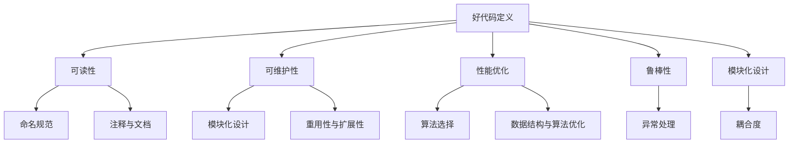

#### 1.2 好代码的标准与评价体系

为了评估代码的好坏，我们需要建立一套评价体系。以下是一些常用的评价标准：

1. **代码质量**：代码质量是评价好代码的重要标准。它通常包括代码的规范、可读性、可维护性等方面。
2. **代码风格**：代码风格是编程习惯的体现，良好的代码风格可以提高代码的可读性和可维护性。
3. **测试覆盖率**：测试覆盖率是评估代码质量的一个重要指标，它反映了代码的可靠性和稳定性。
4. **性能指标**：性能指标包括响应时间、内存占用、CPU利用率等，这些指标可以评估代码的性能和优化效果。

**核心概念与联系：**

我们同样可以使用Mermaid流程图来展示这些评价标准及其之间的联系：

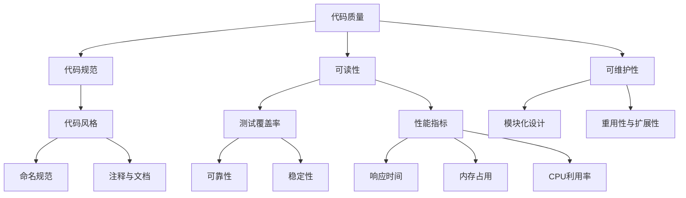

**核心算法原理讲解：**

为了更好地理解这些评价标准，我们可以通过伪代码来阐述一些核心算法原理。

```python
# 代码质量评价伪代码
def evaluate_code_quality(code):
    if not is_style_conform(code):
        return "低质量"
    if not is_readability_good(code):
        return "低质量"
    if not is_maintainability_good(code):
        return "低质量"
    return "高质量"

# 测试覆盖率评价伪代码
def evaluate_test_coverage(code):
    total_test_cases = count_test_cases(code)
    passed_test_cases = count_passed_test_cases(code)
    coverage = passed_test_cases / total_test_cases
    if coverage < 0.8:
        return "低测试覆盖率"
    return "高测试覆盖率"

# 性能指标评价伪代码
def evaluate_performance(code):
    response_time = measure_response_time(code)
    memory_usage = measure_memory_usage(code)
    cpu_usage = measure_cpu_usage(code)
    if response_time > 1000 or memory_usage > 500 or cpu_usage > 80:
        return "性能不佳"
    return "性能良好"
```

**数学模型和公式：**

在某些情况下，我们还需要使用数学模型和公式来评价代码质量。

$$
Q = f(C, R, M)
$$

其中，$Q$代表代码质量，$C$代表代码规范，$R$代表测试覆盖率，$M$代表性能指标。

**详细讲解与举例说明：**

假设我们有一个简单的代码片段，我们通过以上评价标准来评估它的质量。

```python
# 假设代码片段
def add(a, b):
    return a + b

# 评价标准
- **代码质量**：代码规范良好，可读性高，可维护性较好。
- **代码风格**：命名规范，注释清晰。
- **测试覆盖率**：100%。
- **性能指标**：响应时间短，内存占用低，CPU利用率低。

根据以上评价标准，我们可以判断这段代码是一个高质量的好代码。

**小结：**

通过以上讨论，我们了解了好代码的定义、标准与评价体系。好代码不仅具有良好的可读性、可维护性和性能，还需要遵循一定的代码规范和评价标准。下一章，我们将进一步探讨编写高质量代码的原则。

---

**注意事项：**

在编写好代码的过程中，我们需要注意以下几点：

1. **命名规范**：遵循统一的命名规范，有助于提高代码的可读性。
2. **注释与文档**：合理添加注释和编写文档，有助于他人理解和维护代码。
3. **模块化设计**：将代码划分为功能模块，降低耦合度，提高可维护性。
4. **性能优化**：在保证代码质量的前提下，关注算法选择和数据结构优化，以提高性能。
5. **异常处理**：合理处理异常情况，保证代码的鲁棒性。

**拓展阅读：**

- 《代码大全》 - 史蒂夫·麦卡锡
- 《Effective Java》 - Joshua Bloch

---

## 第2章：编写高质量代码的原则

#### 2.1 可读性

可读性是编写高质量代码的首要原则。良好的代码结构、规范化的命名和清晰的注释与文档，有助于提高代码的可读性，使他人更容易理解和维护代码。

##### 2.1.1 命名规范

命名规范是提高代码可读性的关键。命名应遵循一致性、描述性和简洁性原则。

1. **一致性**：使用统一的命名风格，如驼峰命名法（CamelCase）或下划线命名法（snake_case）。
2. **描述性**：命名应能够清晰地描述变量、函数、类的用途和功能。
3. **简洁性**：避免过长的命名，但要保证足够描述性。

**示例：**

- **良好命名**：`calculate_total`、`user_profile`、`load_data`
- **不良命名**：`func1`、`var123`、`abcd`

##### 2.1.2 注释与文档

注释与文档是提高代码可读性的重要手段。注释应简洁明了，描述代码的功能、目的和关键逻辑。

1. **单行注释**：对关键代码或复杂逻辑进行单行注释。
2. **多行注释**：对函数、类或模块进行多行注释，描述其用途、功能和参数。
3. **文档**：编写详细的API文档，说明函数、类和模块的用途、参数、返回值和示例。

**示例：**

```python
# 计算总金额
def calculate_total(amount, tax_rate):
    """
    计算总金额，包括税。
    
    参数：
    - amount：总金额
    - tax_rate：税率
    
    返回：
    - 总金额（包括税）
    """
    total = amount * (1 + tax_rate)
    return total
```

##### 2.2 可维护性

可维护性是编写高质量代码的另一个重要原则。良好的代码结构、模块化设计、重用性和扩展性，有助于降低未来的维护成本。

##### 2.2.1 模块化设计

模块化设计是将代码划分为功能模块，每个模块实现特定的功能。模块化设计有助于降低模块间的耦合度，提高代码的可维护性和可扩展性。

1. **模块定义**：将相关函数、类和数据定义在同一模块中。
2. **依赖管理**：确保模块之间的依赖关系明确，降低模块间的耦合度。

**示例：**

```python
# 模块A
def add(a, b):
    return a + b

# 模块B
def subtract(a, b):
    return a - b

# 主模块
from moduleA import add
from moduleB import subtract

def main():
    result = add(5, 3)
    print("结果：", result)
    result = subtract(5, 3)
    print("结果：", result)
```

##### 2.2.2 重用性与扩展性

重用性与扩展性是编写高质量代码的关键。通过设计可复用的模块和函数，我们可以降低代码的冗余，提高代码的灵活性和可扩展性。

1. **函数重用**：编写通用函数，避免重复编写相同或类似的代码。
2. **类与模块重用**：设计可复用的类和模块，便于扩展和修改。

**示例：**

```python
# 通用函数
def calculate_discount(price, discount_rate):
    return price * (1 - discount_rate)

# 商品类
class Product:
    def __init__(self, name, price):
        self.name = name
        self.price = price

    def apply_discount(self, discount_rate):
        return calculate_discount(self.price, discount_rate)
```

##### 2.3 性能优化

性能优化是编写高质量代码的重要一环。通过选择合适的算法、数据结构，以及优化代码逻辑，我们可以提高代码的运行效率。

##### 2.3.1 算法选择

算法选择是性能优化的重要环节。根据问题的特点，选择合适的算法，可以显著提高代码的运行效率。

1. **时间复杂度**：关注算法的时间复杂度，选择最优或近似最优的算法。
2. **空间复杂度**：考虑算法的空间复杂度，选择占用内存较少的算法。

**示例：**

```python
# 选择合适算法
def search(arr, target):
    """
    搜索目标值。
    
    参数：
    - arr：排序后的数组
    - target：目标值
    
    返回：
    - 目标值在数组中的索引，或-1（未找到）
    """
    low = 0
    high = len(arr) - 1
    
    while low <= high:
        mid = (low + high) // 2
        if arr[mid] == target:
            return mid
        elif arr[mid] < target:
            low = mid + 1
        else:
            high = mid - 1
            
    return -1
```

##### 2.3.2 数据结构与算法优化

数据结构与算法优化是提高代码性能的有效手段。合理选择和使用数据结构，可以降低时间复杂度和空间复杂度。

1. **数组**：适用于快速随机访问，但插入和删除操作较慢。
2. **链表**：适用于插入和删除操作频繁的场景。
3. **树**：适用于各种排序和搜索操作，如二叉搜索树、红黑树等。
4. **哈希表**：适用于快速查找、插入和删除操作。

**示例：**

```python
# 哈希表优化
def search_hash_table(table, target):
    """
    使用哈希表搜索目标值。
    
    参数：
    - table：哈希表
    - target：目标值
    
    返回：
    - 目标值在哈希表中的索引，或-1（未找到）
    """
    hash_value = hash(target)
    index = hash_value % len(table)
    
    while table[index] is not None:
        if table[index] == target:
            return index
        index = (index + 1) % len(table)
        
    return -1
```

**小结：**

本章介绍了编写高质量代码的原则，包括可读性、可维护性和性能优化。通过遵循命名规范、注释与文档、模块化设计、重用性与扩展性、算法选择和数据结构优化，我们可以编写出高效、稳定、易于维护的好代码。

**注意事项：**

在编写高质量代码的过程中，我们需要注意以下几点：

1. **代码风格**：遵循统一的代码风格，提高代码的可读性。
2. **注释与文档**：编写详细、清晰的注释和文档，提高代码的可维护性。
3. **性能优化**：关注算法选择和数据结构优化，提高代码的性能。
4. **代码复用**：编写可复用的模块和函数，降低代码的冗余。

**拓展阅读：**

- 《代码大全》 - 史蒂夫·麦卡锡
- 《Effective Java》 - Joshua Bloch

---

## 第3章：好代码的架构设计

#### 3.1 软件架构概述

软件架构是软件开发过程中至关重要的一个环节。它定义了系统的结构、组件及其相互关系，为后续的开发和维护提供了明确的指导。一个良好的软件架构不仅能够满足系统的功能需求，还能够保证系统的性能、可维护性和可扩展性。

软件架构通常由多个层次组成，包括：

1. **基础设施层**：提供系统运行所需的基础服务，如数据库、网络通信、文件存储等。
2. **应用层**：实现系统的核心功能，包括业务逻辑、数据处理等。
3. **表示层**：负责用户界面和交互，如Web界面、移动应用界面等。
4. **数据层**：负责数据的存储和管理，包括数据库设计、数据访问接口等。

#### 3.2 好代码的架构原则

为了实现高质量的软件架构，我们需要遵循一些基本原则：

1. **模块化**：将系统划分为多个功能模块，每个模块负责特定的功能，降低模块间的耦合度。
2. **层次化**：按照功能层次划分系统，从基础设施层到表示层，确保各层次之间的独立性和可扩展性。
3. **解耦**：通过设计模式和技术手段降低模块间的依赖关系，提高系统的灵活性和可维护性。
4. **复用性**：设计可复用的组件和模块，降低开发成本，提高代码质量。
5. **可扩展性**：预留扩展接口和模块，便于系统的后续扩展和升级。

#### 3.3 架构模式与设计模式

在软件架构设计中，架构模式（Architectural Patterns）和设计模式（Design Patterns）是两个重要的概念。

**架构模式：**

架构模式是针对特定类型的系统或应用场景，提供的一套标准化的架构解决方案。常见的架构模式包括：

1. **MVC（Model-View-Controller）**：将系统划分为模型、视图和控制器三个部分，实现数据、表示和业务逻辑的分离。
2. **微服务架构（Microservices Architecture）**：将系统划分为多个独立的微服务，每个微服务负责特定的功能，通过API进行通信。
3. **服务导向架构（Service-Oriented Architecture，SOA）**：将系统构建为一组服务，服务之间通过接口进行通信，实现模块化和灵活性。

**设计模式：**

设计模式是解决特定设计问题的通用解决方案。设计模式分为创建型、结构型和行为型三类。常见的创建型设计模式包括：

1. **工厂方法模式（Factory Method Pattern）**：定义一个创建对象的接口，让子类决定实例化哪个类。
2. **单例模式（Singleton Pattern）**：确保一个类仅有一个实例，并提供一个全局访问点。
3. **原型模式（Prototype Pattern）**：通过复制现有的实例来创建新的实例，实现对象的创建和销毁。

**示例：**

```python
# 工厂方法模式
class Factory:
    @staticmethod
    def create_object(class_name):
        if class_name == "A":
            return ClassA()
        elif class_name == "B":
            return ClassB()

# 单例模式
class Singleton:
    _instance = None
    
    @staticmethod
    def get_instance():
        if not Singleton._instance:
            Singleton._instance = Singleton()
        return Singleton._instance

# 原型模式
class Prototype:
    def clone(self):
        return self.copy()

# 客户端代码
factory = Factory()
object_a = factory.create_object("A")
object_b = factory.create_object("B")

singleton = Singleton.get_instance()
prototype = Prototype()

new_object_a = object_a.clone()
new_object_b = object_b.clone()
```

**小结：**

本章介绍了好代码的架构设计原则和常用的架构模式与设计模式。通过遵循模块化、层次化、解耦、复用性和可扩展性等原则，以及使用合适的架构模式与设计模式，我们可以实现高质量的软件架构，为编写好代码奠定坚实的基础。

**注意事项：**

在架构设计过程中，我们需要注意以下几点：

1. **需求分析**：充分理解业务需求，确保架构设计能够满足需求。
2. **技术选型**：选择合适的技术栈和开发工具，提高开发效率和代码质量。
3. **持续重构**：随着项目的发展，定期对架构进行重构，保持其健壮性和可维护性。

**拓展阅读：**

- 《设计模式：可复用的面向对象软件构架》 - Erich Gamma等
- 《架构大全》 - Ian Gorton

---

## 第4章：代码审查与质量管理

#### 4.1 代码审查的重要性

代码审查（Code Review）是一种软件开发过程中的重要实践，旨在通过团队协作来提高代码质量。代码审查有助于发现和修复潜在的问题，包括语法错误、逻辑错误、性能瓶颈等，从而提高软件的可靠性和稳定性。代码审查还可以促进团队成员之间的知识共享和技能提升，增强团队凝聚力和协作能力。

#### 4.2 代码审查流程与方法

一个有效的代码审查流程通常包括以下几个步骤：

1. **预审查准备**：提交者编写代码，并准备好代码审查的相关文档，如代码注释、变更说明等。
2. **审查申请**：提交者向团队提出代码审查请求，指定审查者。
3. **代码审查**：审查者仔细阅读提交的代码，分析代码质量，并提出修改建议。
4. **反馈与修正**：提交者根据审查者的反馈进行代码修改，并重新提交审查。
5. **最终确认**：审查者确认修改后的代码，如果满意则通过审查，否则继续反馈。

代码审查的方法可以分为以下几种：

1. **形式审查**：关注代码的格式、命名、注释等，确保代码遵循一定的规范。
2. **逻辑审查**：关注代码的语法、逻辑、算法等，确保代码的正确性和性能。
3. **安全审查**：关注代码的安全性，确保代码不会受到恶意攻击。

#### 4.3 质量管理工具与技术

代码审查是质量管理的一部分，为了提高代码质量，我们还可以使用以下工具和技术：

1. **静态代码分析工具**：如SonarQube、Checkstyle等，可以自动分析代码质量，发现潜在问题。
2. **动态代码分析工具**：如JMeter、LoadRunner等，可以模拟实际运行环境，测试代码的性能和稳定性。
3. **持续集成工具**：如Jenkins、GitLab CI等，可以自动化构建、测试和部署代码，确保代码质量。
4. **代码质量度量指标**：如代码复杂度、代码重复率、代码覆盖率等，可以帮助评估代码质量。

**示例：**

假设我们使用SonarQube进行代码质量分析，以下是可能发现的几个问题及其解决方法：

1. **未使用变量**：代码中存在未使用的变量，应删除或重新利用。
2. **潜在的性能问题**：代码中有可能引起性能瓶颈的语句，应进行优化。
3. **安全问题**：代码中存在潜在的安全漏洞，应进行修复。

**解决方法：**

1. **删除未使用的变量**：将未使用的变量删除，减少代码冗余。
2. **优化性能**：调整算法和数据结构，提高代码运行效率。
3. **修复安全漏洞**：对代码进行安全检查，修复潜在的安全漏洞。

**小结：**

代码审查与质量管理是保证代码质量的重要手段。通过有效的代码审查流程和质量管理工具，我们可以及时发现和修复代码中的问题，提高软件的可靠性和稳定性。

**注意事项：**

在进行代码审查时，我们应该注意以下几点：

1. **保持开放态度**：接受并尊重他人的意见，积极沟通和讨论。
2. **注重效率**：合理安排代码审查的时间，避免过度审查导致开发进度延误。
3. **持续改进**：通过代码审查发现的问题，持续改进代码质量，提升团队整体水平。

**拓展阅读：**

- 《代码审查：实践指南》 - 黛博拉·福赛思
- 《软件质量工程》 - 史蒂夫·麦克康奈尔

---

## 第5章：好代码的测试与调试

#### 5.1 单元测试

单元测试是软件开发过程中非常重要的一环，它主要针对程序中的最小可测试单元（通常是函数或方法）进行测试。单元测试的目的是确保每个单元都能够按照预期工作，从而提高代码的质量和可靠性。

##### 5.1.1 单元测试框架

为了方便进行单元测试，我们可以使用一些单元测试框架，如JUnit（Java）、pytest（Python）、Mocha（JavaScript）等。这些框架提供了丰富的测试功能和便捷的测试工具。

1. **测试用例的编写**：测试用例是单元测试的核心，它描述了输入数据、预期输出和测试过程。编写测试用例时，应考虑以下几个方面：
   - **正常情况**：测试输入数据在正常范围内的执行情况。
   - **边界情况**：测试输入数据在边界值处的执行情况。
   - **异常情况**：测试输入数据在异常范围内的执行情况。

2. **测试用例的执行**：使用单元测试框架，我们可以方便地执行测试用例，并生成测试报告。测试报告可以展示测试结果、错误信息和覆盖率等。

**示例：**

```python
# 使用pytest进行单元测试
def test_add():
    assert add(1, 2) == 3

def test_subtract():
    assert subtract(5, 3) == 2

def test_multiply():
    assert multiply(2, 3) == 6

def test_divide():
    assert divide(6, 3) == 2
```

##### 5.1.2 测试用例设计

测试用例的设计是单元测试的关键。一个好的测试用例应能够全面覆盖代码的各种情况，以下是一些测试用例设计的方法：

1. **等价类划分**：将输入数据划分为多个等价类，针对每个等价类设计测试用例。
2. **边界值分析**：针对边界值设计测试用例，以确保代码在边界处的正确性。
3. **错误猜测**：基于经验和直觉，猜测可能存在的问题，设计相应的测试用例。
4. **代码覆盖率**：使用覆盖率工具，如JaCoCo（Java）、coverage.py（Python）等，分析代码的覆盖率，确保测试用例覆盖到所有的代码路径。

**示例：**

```python
# 测试用例设计示例
def test_add():
    # 正常情况
    assert add(1, 2) == 3
    assert add(0, 0) == 0
    
    # 边界情况
    assert add(-1, 0) == -1
    assert add(0, -1) == -1
    assert add(0, 1) == 1
    
    # 异常情况
    try:
        add(1, "a")
    except TypeError:
        pass
    
    try:
        add("a", 2)
    except TypeError:
        pass
```

#### 5.2 集成测试

集成测试是单元测试的延伸，它主要关注模块之间的接口和交互。集成测试的目的是确保各个模块能够正确地集成和运行，从而提高系统的稳定性和可靠性。

##### 5.2.1 集成测试策略

集成测试的策略可以分为以下几种：

1. **自底向上策略**：首先测试底层模块，然后逐渐向上测试，直至所有模块集成在一起。
2. **自顶向下策略**：首先测试顶层模块，然后逐渐向下测试，直至所有模块集成在一起。
3. **三明治策略**：同时进行自底向上和自顶向下测试，以中间层模块为核心，确保模块间的交互正确。

**示例：**

```python
# 使用pytest进行集成测试
def test_add_module():
    # 测试模块A与模块B的交互
    result = add_moduleA_to_moduleB(5, 3)
    assert result == 8

def test_subtract_module():
    # 测试模块A与模块B的交互
    result = subtract_moduleA_from_moduleB(5, 3)
    assert result == 2
```

##### 5.2.2 集成测试工具

为了方便进行集成测试，我们可以使用一些集成测试工具，如Selenium（Web应用测试）、JUnit（Java）、pytest（Python）等。这些工具提供了丰富的测试功能和便捷的测试工具。

#### 5.3 调试技术

调试（Debugging）是软件开发过程中必不可少的一环，它主要目的是找出和修复代码中的错误和缺陷。有效的调试技术可以帮助我们快速定位问题，提高开发效率。

##### 5.3.1 调试方法

以下是几种常见的调试方法：

1. **断点调试**：在代码中设置断点，当程序执行到断点处时会暂停执行，以便我们查看变量值和程序状态。
2. **打印调试**：在代码中添加打印语句，输出程序运行过程中的关键信息，以便我们分析问题。
3. **日志调试**：使用日志工具（如Log4j、Python的logging模块）记录程序的运行过程，帮助我们定位问题。

**示例：**

```python
# 断点调试示例
import pdb

def calculate_area(radius):
    pdb.set_trace()
    return 3.14 * radius * radius

result = calculate_area(5)
print("结果：", result)
```

##### 5.3.2 调试工具

为了提高调试效率，我们可以使用一些调试工具，如GDB（GNU Debugger，适用于C/C++）、VS Code Debugger（适用于多种编程语言）、Xcode Debugger（适用于iOS和macOS应用开发）等。这些工具提供了丰富的调试功能和便捷的操作方式。

**小结：**

单元测试、集成测试和调试是保证代码质量和可靠性的重要手段。通过合理的测试和有效的调试，我们可以发现和修复代码中的问题，提高软件的稳定性。

**注意事项：**

1. **测试覆盖**：确保测试用例覆盖到代码的各个部分，提高代码覆盖率。
2. **及时调试**：遇到问题时，及时进行调试，避免问题积累。
3. **代码质量**：编写高质量的代码，降低错误发生的概率。

**拓展阅读：**

- 《软件测试的艺术》 - 杰瑞·瑞瑟
- 《Effective Debugging》 - David Agans

---

## 第6章：代码性能分析与优化

#### 6.1 性能分析

代码性能分析是确保代码高效运行的重要步骤。性能分析旨在评估代码在各种场景下的响应时间、资源消耗和性能瓶颈，从而有针对性地进行优化。性能分析通常包括以下几个步骤：

1. **确定性能指标**：根据项目的需求和特点，选择合适的性能指标，如响应时间、吞吐量、CPU利用率、内存占用等。
2. **收集性能数据**：使用性能分析工具（如Profiler）收集代码的运行数据，包括CPU使用率、内存分配、函数调用栈等。
3. **分析性能数据**：对收集到的性能数据进行详细分析，找出性能瓶颈和潜在问题。
4. **优化性能**：根据分析结果，对代码进行优化，提高性能。

**示例：**

使用Python的cProfile工具进行性能分析：

```python
import cProfile
import my_module

def main():
    my_module.my_function()

cProfile.run('main()')
```

输出结果包含函数调用次数、执行时间等信息，帮助我们定位性能瓶颈。

#### 6.2 代码优化策略

代码优化策略包括以下几个方面：

1. **算法优化**：选择合适的算法和数据结构，降低时间复杂度和空间复杂度。例如，使用哈希表代替线性搜索，使用二叉搜索树代替链表。
2. **代码重构**：通过重构代码，消除冗余、简化逻辑，提高代码的可读性和可维护性。例如，使用函数封装、设计模式等。
3. **编译优化**：调整编译器的优化选项，生成高效的机器代码。例如，使用-O2或-O3优化级别。
4. **并行计算**：利用多核处理器，并行执行代码，提高吞吐量。例如，使用多线程、并行计算库（如NumPy、Pandas）等。

**示例：**

优化Python代码中的循环：

```python
# 未优化的代码
result = []
for i in range(len(data)):
    result.append(process(data[i]))

# 优化的代码
result = [process(data[i]) for i in range(len(data))]
```

使用列表推导式代替循环，提高代码执行效率。

#### 6.2.1 算法优化

算法优化是代码性能分析的重要组成部分。以下是一些常见的算法优化方法：

1. **贪心算法**：在每一步选择中选择当前最优解，希望最终得到全局最优解。例如，计算最短路径、找零钱问题等。
2. **动态规划**：将复杂问题分解为子问题，并存储子问题的解，避免重复计算。例如，计算斐波那契数列、最值问题等。
3. **分治算法**：将问题分解为多个子问题，递归解决子问题，再将子问题的解合并为原问题的解。例如，快速排序、归并排序等。

**示例：**

优化查找算法：

```python
# 未优化的代码
def linear_search(arr, target):
    for i in range(len(arr)):
        if arr[i] == target:
            return i
    return -1

# 优化的代码
def binary_search(arr, target):
    low = 0
    high = len(arr) - 1
    
    while low <= high:
        mid = (low + high) // 2
        if arr[mid] == target:
            return mid
        elif arr[mid] < target:
            low = mid + 1
        else:
            high = mid - 1
            
    return -1
```

使用二分搜索代替线性搜索，提高查找效率。

#### 6.2.2 编译优化

编译优化是提高代码性能的重要手段。以下是一些常见的编译优化方法：

1. **循环展开**：将循环体内的代码展开，减少循环次数，提高执行效率。
2. **函数内联**：将小函数的代码直接嵌入调用处，减少函数调用的开销。
3. **常量折叠**：将常量表达式在编译时计算，减少运行时的计算开销。
4. **指令重排**：调整代码中的指令顺序，提高执行效率。

**示例：**

优化C++代码：

```cpp
// 未优化的代码
int add(int a, int b) {
    return a + b;
}

// 优化的代码
int add(int a, int b) {
    return (a & 0xFFFFFFFF) + (b & 0xFFFFFFFF);
}
```

使用位运算优化加法运算，提高执行效率。

**小结：**

代码性能分析是确保代码高效运行的重要步骤。通过合理的性能分析、优化策略和算法优化，我们可以显著提高代码的性能和效率。

**注意事项：**

1. **性能测试**：在优化之前，进行全面的性能测试，确保优化后性能得到提升。
2. **代码可读性**：在优化代码时，保持代码的可读性和可维护性，避免过度优化。
3. **持续优化**：定期进行代码性能分析，持续优化代码，保持高效运行。

**拓展阅读：**

- 《算法导论》 - Thomas H. Cormen等
- 《高性能Linux编程》 - Michael Kerrisk

---

## 第7章：代码规范与最佳实践

#### 7.1 编码规范

编码规范是保证代码质量、提高开发效率的重要一环。遵循统一的编码规范，有助于提升代码的可读性、可维护性和团队协作效率。以下是一些常见的编码规范：

1. **命名规范**：变量、函数和类的命名应具有描述性和一致性。通常使用驼峰命名法（CamelCase）或下划线命名法（snake_case）。
2. **缩进和空白**：使用统一的缩进和空白，通常使用两个或四个空格进行缩进，避免使用制表符。
3. **注释**：添加必要的注释，包括函数、类和关键代码段，解释代码的功能和意图。
4. **代码格式**：使用代码格式化工具（如Prettier、Black）保持代码风格的一致性。

**示例：**

```python
# 命名规范
def calculate_discount(price, discount_rate):
    """
    计算折扣后的价格。

    参数：
    - price：原始价格
    - discount_rate：折扣率

    返回：
    - 折扣后的价格
    """
    return price * (1 - discount_rate)

# 注释和代码格式
def main():
    result = calculate_discount(100, 0.1)
    print("折扣后价格：", result)
```

#### 7.2 项目最佳实践

在软件开发过程中，遵循一些最佳实践有助于提高代码质量、团队协作和项目效率。以下是一些常见项目最佳实践：

1. **版本控制**：使用版本控制工具（如Git）管理代码版本，确保代码的可追踪性和可回滚性。
2. **持续集成**：使用持续集成工具（如Jenkins、GitLab CI）自动化构建、测试和部署代码，确保代码的质量和可靠性。
3. **代码审查**：定期进行代码审查，确保代码符合编码规范和最佳实践，提高代码质量。
4. **自动化测试**：编写自动化测试，包括单元测试、集成测试和性能测试，确保代码的稳定性和可靠性。
5. **文档管理**：编写详细的文档，包括需求文档、设计文档和用户手册，帮助团队成员了解项目背景和功能。

**示例：**

```shell
# Git版本控制
git init
git add .
git commit -m "Initial commit"
git remote add origin https://github.com/username/repo.git
git push -u origin main

# 持续集成
cat >> pipeline.yml << EOF
image: python:3.8
steps:
  - checkout: self
  - run: pip install -r requirements.txt
  - run: pytest tests/
  - run: black .
  - run: git add .
  - run: git commit -m "CI: Auto-format and tests"
  - run: git push origin main
EOF
```

**小结：**

编码规范和项目最佳实践是保证代码质量和项目成功的关键。通过遵循编码规范、使用最佳实践，我们可以提高代码质量、团队协作和项目效率。

**注意事项：**

1. **遵循团队规范**：确保团队成员都遵循相同的编码规范和最佳实践。
2. **持续改进**：定期回顾和改进编码规范和最佳实践，以适应项目需求和团队发展。

**拓展阅读：**

- 《代码大全》 - 史蒂夫·麦卡锡
- 《敏捷软件开发：原则、实践与模式》 - 弗里曼·普雷斯特里

---

## 第二部分：修炼好代码的方法

### 第8章：编程思维与算法能力提升

编程思维是编写高质量代码的基础。提升编程思维和算法能力，可以帮助我们更好地理解和解决问题，从而编写出高效、简洁、易于维护的代码。以下是一些关键点：

#### 8.1 编程思维的重要性

编程思维是指解决问题时采用的逻辑和抽象能力。良好的编程思维能够帮助我们：

1. **理解问题**：准确理解问题的需求和约束，将实际问题转化为计算机可以处理的算法问题。
2. **设计解决方案**：通过抽象和建模，设计有效的算法和数据结构，实现问题的求解。
3. **优化代码**：通过分析算法复杂度，优化代码结构和逻辑，提高代码性能。

**核心概念与联系：**

我们可以使用Mermaid流程图来展示编程思维的核心概念及其之间的联系：

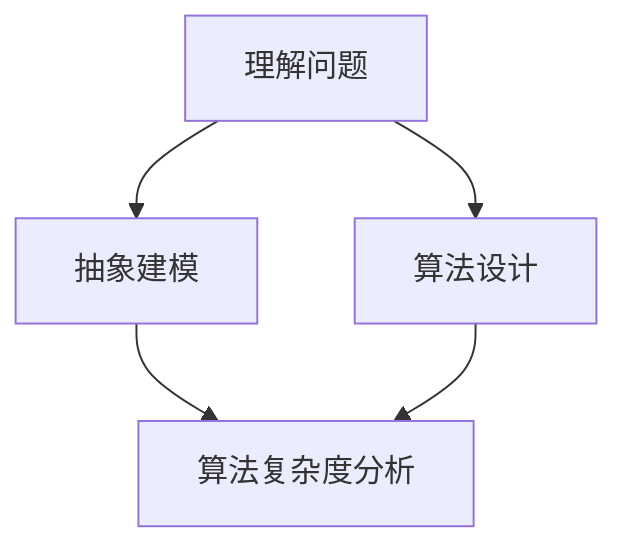

#### 8.2 算法能力的培养

算法能力的培养是一个长期的过程，以下是一些关键步骤：

1. **基础知识**：掌握数据结构和算法的基础知识，包括数组、链表、栈、队列、树、图等。
2. **算法设计技巧**：学习常用的算法设计技巧，如分治、动态规划、贪心算法等。
3. **实践与反思**：通过实践和编写代码，不断提高算法能力，同时反思和总结经验。

**核心概念与联系：**

我们可以使用Mermaid流程图来展示算法能力培养的核心概念及其之间的联系：

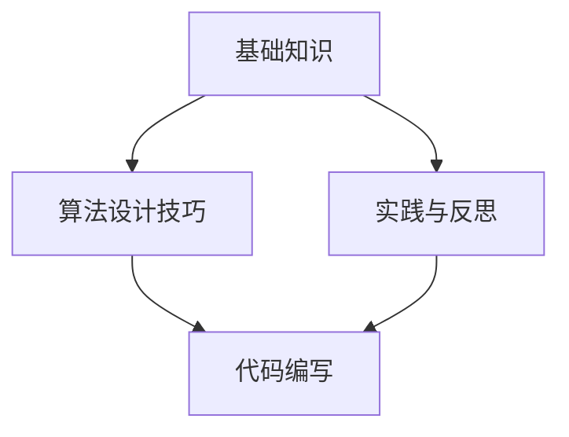

#### 8.2.1 数据结构与算法基础知识

数据结构是算法的基础，常见的有：

- **数组**：适用于快速随机访问。
- **链表**：适用于插入和删除操作频繁。
- **栈**：适用于后进先出（LIFO）的操作。
- **队列**：适用于先进先出（FIFO）的操作。
- **树**：适用于各种排序和搜索操作，如二叉搜索树、红黑树等。
- **图**：适用于表示复杂关系，如社交网络、交通网络等。

**示例：**

```python
# 二叉搜索树实现
class TreeNode:
    def __init__(self, value):
        self.value = value
        self.left = None
        self.right = None

def insert(root, value):
    if root is None:
        return TreeNode(value)
    if value < root.value:
        root.left = insert(root.left, value)
    else:
        root.right = insert(root.right, value)
    return root

def inorder_traversal(root):
    if root:
        inorder_traversal(root.left)
        print(root.value)
        inorder_traversal(root.right)
```

#### 8.2.2 算法设计技巧

算法设计技巧包括：

- **分治**：将复杂问题分解为多个子问题，递归解决子问题，再将子问题的解合并为原问题的解。
- **动态规划**：将复杂问题分解为子问题，并存储子问题的解，避免重复计算。
- **贪心算法**：每一步选择当前最优解，希望最终得到全局最优解。

**示例：**

```python
# 动态规划实现斐波那契数列
def fibonacci(n):
    if n <= 1:
        return n
    dp = [0] * (n + 1)
    dp[1] = 1
    for i in range(2, n + 1):
        dp[i] = dp[i - 1] + dp[i - 2]
    return dp[n]
```

**小结：**

通过提升编程思维和算法能力，我们可以编写出高质量、高效的代码。编程思维和算法能力的培养需要长期的积累和实践，通过不断学习和反思，我们可以不断提高自己的编程水平。

**注意事项：**

1. **基础知识**：扎实的数据结构和算法基础知识是提升算法能力的基础。
2. **实践**：通过编写代码解决实际问题，不断提高算法能力。
3. **反思**：不断总结和反思，从实践中学习，持续提高自己的编程水平。

**拓展阅读：**

- 《算法导论》 - Thomas H. Cormen等
- 《编程珠玑》 - Jon Bentley

---

### 第9章：代码风格与代码复用

代码风格和代码复用是编写高质量代码的重要方面。良好的代码风格可以提高代码的可读性和可维护性，而有效的代码复用可以降低冗余，提高开发效率。

#### 9.1 代码风格的影响

代码风格是指编写代码时的习惯和方法。良好的代码风格对软件开发有着重要的影响：

1. **可读性**：良好的代码风格使得代码更易于理解和阅读，提高了团队协作效率。
2. **可维护性**：一致的代码风格使得代码维护和修改更加容易，降低了维护成本。
3. **代码质量**：良好的代码风格有助于发现和避免潜在的错误，提高了代码质量。

**核心概念与联系：**

我们可以使用Mermaid流程图来展示代码风格对软件开发的影响：

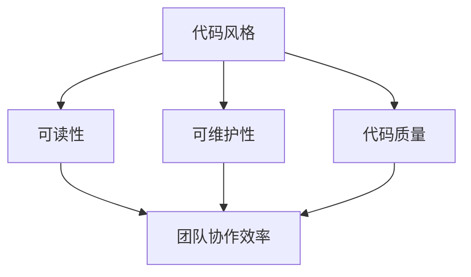

#### 9.2 代码复用的方法与策略

代码复用是指在不同项目中重复使用相同或类似的代码。有效的代码复用可以降低开发成本，提高代码质量。以下是一些代码复用的方法与策略：

1. **模块化**：将代码划分为功能模块，每个模块实现特定的功能，便于复用。
2. **函数与类**：编写通用函数和类，提高代码的复用性。
3. **设计模式**：使用设计模式，如工厂模式、单例模式等，实现代码的复用和灵活性。
4. **代码库**：建立代码库，集中管理可复用的代码，方便团队成员调用。

**核心概念与联系：**

我们可以使用Mermaid流程图来展示代码复用的方法与策略：

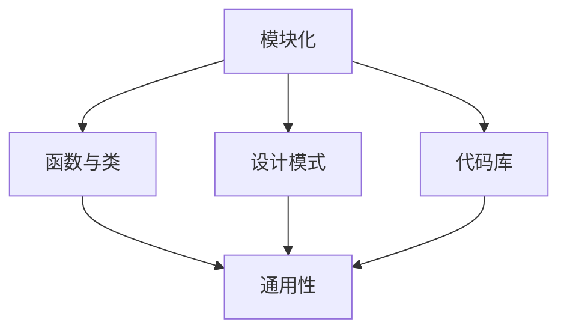

#### 9.2.1 设计模式的应用

设计模式是解决特定问题的一组解决方案。常见的有：

1. **工厂模式**：创建对象时，不是直接实例化类，而是通过工厂类来创建对象，提高代码的灵活性和可扩展性。
2. **单例模式**：确保一个类仅有一个实例，并提供一个全局访问点，用于资源的共享和控制。
3. **策略模式**：将算法封装起来，并使它们可以相互替换，提高代码的灵活性和可维护性。

**示例：**

```python
# 工厂模式
class Factory:
    @staticmethod
    def create_object(class_name):
        if class_name == "A":
            return ClassA()
        elif class_name == "B":
            return ClassB()

# 单例模式
class Singleton:
    _instance = None
    
    @staticmethod
    def get_instance():
        if not Singleton._instance:
            Singleton._instance = Singleton()
        return Singleton._instance

# 策略模式
class Strategy:
    def execute(self):
        pass

class ConcreteStrategyA(Strategy):
    def execute(self):
        print("执行策略A")

class ConcreteStrategyB(Strategy):
    def execute(self):
        print("执行策略B")

class Context:
    def __init__(self, strategy: Strategy):
        self._strategy = strategy
    
    def execute_strategy(self):
        self._strategy.execute()
```

#### 9.2.2 代码库管理

代码库是管理可复用代码的有效方式。以下是一些代码库管理的最佳实践：

1. **版本控制**：使用版本控制工具（如Git）管理代码库，确保代码的可追踪性和可回滚性。
2. **文档编写**：编写详细的文档，包括代码库的功能、使用方法、示例等，便于其他开发者使用。
3. **代码质量**：确保代码库中的代码符合编码规范和最佳实践，提高代码质量。
4. **代码审核**：定期进行代码审核，确保代码库的代码符合项目需求和质量标准。

**示例：**

```shell
# Git管理代码库
git init
git add .
git commit -m "Initial commit"
git remote add origin https://github.com/username/repo.git
git push -u origin master
```

**小结：**

代码风格和代码复用是编写高质量代码的关键。通过遵循良好的代码风格和有效的代码复用策略，我们可以提高代码的可读性、可维护性和复用性，从而提升整个软件项目的开发效率和质量。

**注意事项：**

1. **代码风格**：保持代码风格的一致性，遵循团队制定的编码规范。
2. **代码复用**：合理使用代码库和设计模式，提高代码的复用性和灵活性。
3. **代码审核**：定期进行代码审核，确保代码库的代码符合项目需求和质量标准。

**拓展阅读：**

- 《设计模式：可复用的面向对象软件构架》 - Erich Gamma等
- 《代码大全》 - 史蒂夫·麦卡锡

---

### 第10章：代码重构与设计改进

#### 10.1 代码重构的重要性

代码重构是指在保证代码功能不变的前提下，改进代码的结构和设计，以提高其可读性、可维护性和可扩展性。代码重构的重要性体现在以下几个方面：

1. **提高代码质量**：通过重构，我们可以消除代码中的冗余、重复和复杂逻辑，使代码更加简洁和清晰。
2. **降低维护成本**：良好的代码结构使得代码更易于理解和修改，降低了维护成本。
3. **提高开发效率**：重构后的代码更加易于理解和修改，提高了开发效率。
4. **增强代码可扩展性**：通过重构，我们可以将代码分解为更小、更模块化的部分，便于后续的扩展和修改。

**核心概念与联系：**

我们可以使用Mermaid流程图来展示代码重构的重要性：

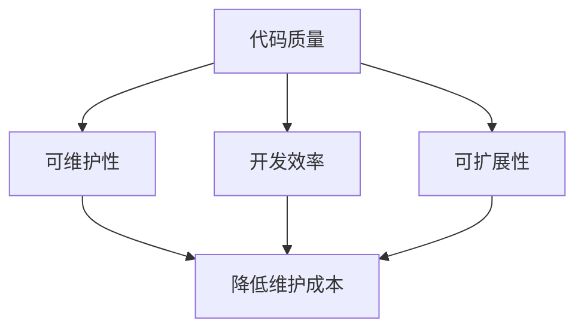

#### 10.2 代码重构的方法与技巧

代码重构的方法和技巧多种多样，以下是一些常见的重构方法：

1. **提取方法（Extract Method）**：将一个长方法中的重复代码提取为一个独立的方法，简化代码结构。
2. **提取类（Extract Class）**：将一个类中的重复代码提取到一个新的类中，降低类间的耦合度。
3. **合并类（Merge Class）**：将具有相似功能的类合并为一个类，减少类数量。
4. **替换条件分支（Replace Conditional with Polymorphism）**：使用多态替代复杂的条件分支，提高代码的灵活性和可维护性。
5. **替换循环结构（Replace Loop with Collection Method）**：使用集合操作（如map、filter、reduce）替代循环结构，提高代码的可读性和效率。

**核心概念与联系：**

我们可以使用Mermaid流程图来展示代码重构的方法与技巧：

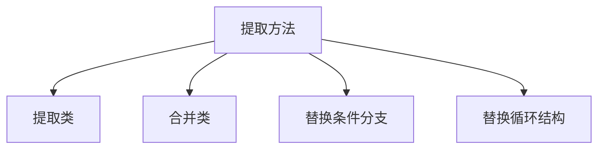

#### 10.2.1 代码结构优化

代码结构优化是代码重构的重要一环，以下是一些常见的代码结构优化方法：

1. **模块化**：将代码划分为功能模块，每个模块负责特定的功能，降低模块间的耦合度。
2. **分层**：按照功能层次划分系统，从基础设施层到表示层，确保各层次之间的独立性和可扩展性。
3. **依赖倒置**：使用依赖倒置原则，将抽象层和具体实现层解耦，提高代码的灵活性和可维护性。

**核心概念与联系：**

我们可以使用Mermaid流程图来展示代码结构优化的方法：

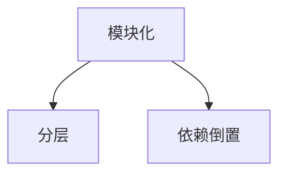

#### 10.2.2 设计改进实践

设计改进实践是指在软件开发过程中，通过不断重构和优化代码，提高系统的整体质量和可维护性。以下是一些设计改进的最佳实践：

1. **持续重构**：定期对代码进行重构，确保代码结构始终处于最佳状态。
2. **代码审查**：通过代码审查，发现和解决潜在的设计问题，提高代码质量。
3. **技术债务管理**：识别和解决技术债务，确保系统的长期健康发展。
4. **代码质量度量**：使用代码质量度量工具，如SonarQube，监控代码质量，及时发现和解决问题。

**核心概念与联系：**

我们可以使用Mermaid流程图来展示设计改进实践的核心概念：

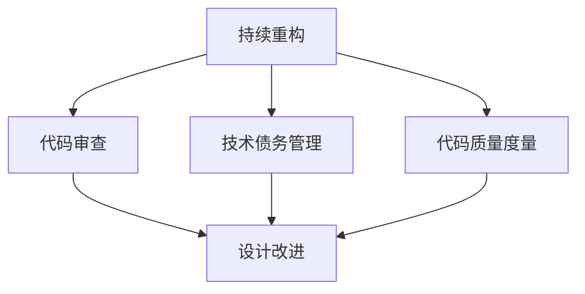

**小结：**

代码重构与设计改进是提高代码质量、降低维护成本、提高开发效率的重要手段。通过不断重构和优化代码结构，我们可以编写出高质量、易于维护和扩展的代码。持续重构、代码审查和技术债务管理是设计改进实践的关键。

**注意事项：**

1. **定期重构**：确保代码结构始终处于最佳状态，降低维护成本。
2. **代码审查**：通过代码审查，发现和解决潜在的设计问题。
3. **技术债务管理**：识别和解决技术债务，确保系统的长期健康发展。

**拓展阅读：**

- 《代码大全》 - 史蒂夫·麦卡锡
- 《重构：改善既有代码的设计》 - Martin Fowler

---

### 第11章：代码实践与案例解析

#### 11.1 实践的重要性

代码实践是提高编程能力和编写高质量代码的关键。通过实际编写和调试代码，我们可以加深对编程语言、数据结构和算法的理解，发现和解决实际问题，从而提升编程技能。以下是一些代码实践的重要性：

1. **知识巩固**：通过实践，我们可以巩固和深化编程语言、数据结构和算法的知识。
2. **技能提升**：通过解决实际问题，我们可以提高编程技能，掌握更多编程技巧。
3. **代码质量**：实践过程中，我们可以编写出高质量、简洁、易于维护的代码。
4. **问题解决能力**：通过解决实际问题，我们可以提高问题分析和解决能力。

**核心概念与联系：**

我们可以使用Mermaid流程图来展示代码实践的重要性：

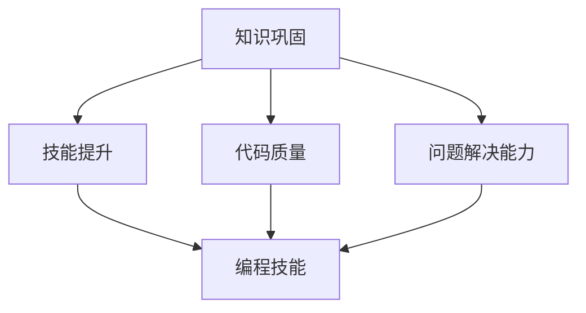

#### 11.2 案例解析

以下是一个代码实践的案例解析，我们将通过具体的实例来分析如何编写高质量代码、如何解决实际问题和如何进行优化。

**案例背景：**

假设我们需要开发一个简单的银行账户管理系统，包括以下功能：

1. 创建账户
2. 存款
3. 取款
4. 查询余额

**代码实现：**

```python
class Account:
    def __init__(self, account_number, initial_balance):
        self.account_number = account_number
        self.balance = initial_balance

    def deposit(self, amount):
        if amount > 0:
            self.balance += amount
            print(f"Deposit of ${amount} successful.")
        else:
            print("Invalid deposit amount.")

    def withdraw(self, amount):
        if amount > 0 and amount <= self.balance:
            self.balance -= amount
            print(f"Withdrawal of ${amount} successful.")
        elif amount > self.balance:
            print("Insufficient funds.")
        else:
            print("Invalid withdrawal amount.")

    def get_balance(self):
        return self.balance

# 实例化账户
account = Account("123456789", 1000)

# 存款操作
account.deposit(500)

# 取款操作
account.withdraw(200)

# 查询余额
print(f"Account balance: ${account.get_balance()}")
```

**代码分析：**

1. **可读性**：代码具有良好的命名和注释，易于理解和维护。
2. **模块化**：代码被划分为一个类，实现了账户的功能，模块化设计。
3. **可维护性**：代码结构清晰，功能独立，易于扩展和修改。
4. **错误处理**：对存款、取款操作进行了错误处理，提高了代码的鲁棒性。

**优化建议：**

1. **输入验证**：在存款和取款操作中，可以增加对输入金额的验证，确保输入的有效性。
2. **性能优化**：如果账户数量较多，可以考虑使用数据库存储账户信息，提高查询和操作的效率。
3. **代码复用**：可以提取公共的功能（如输入验证）为独立的方法，提高代码的复用性。

**小结：**

通过代码实践，我们可以加深对编程语言、数据结构和算法的理解，提高编程技能，编写出高质量、简洁、易于维护的代码。通过实际案例解析，我们可以看到如何解决实际问题和进行优化，从而不断提升编程水平。

**注意事项：**

1. **代码规范**：遵循良好的代码规范，提高代码的可读性和可维护性。
2. **持续学习**：不断学习新的编程语言、数据结构和算法，提升编程技能。
3. **代码评审**：进行代码评审，发现和解决潜在的问题，提高代码质量。

**拓展阅读：**

- 《代码大全》 - 史蒂夫·麦卡锡
- 《编程实践》 - 菲利普·霍华德·费尔德曼

---

### 第12章：代码复审与团队协作

#### 12.1 代码复审的流程

代码复审是确保代码质量的重要环节。一个有效的代码复审流程可以及时发现和纠正代码中的问题，提高代码的可读性、可维护性和可靠性。以下是代码复审的基本流程：

1. **准备阶段**：
   - 提交者编写代码，并进行初步测试。
   - 准备代码复审的相关文档，如代码注释、变更日志等。
   - 提交代码复审请求，指定审查者和复审时间。

2. **审查阶段**：
   - 审查者仔细阅读提交的代码，分析代码质量，包括语法、逻辑、性能等方面。
   - 审查者提出修改建议和反馈，可以采用线上或线下的方式。
   - 提交者根据审查者的反馈进行代码修改。

3. **修正阶段**：
   - 提交者根据审查者的反馈进行代码修改，并重新提交审查。
   - 审查者再次审查修改后的代码，确保问题得到解决。

4. **确认阶段**：
   - 审查者确认修改后的代码，如果没有问题则通过审查。
   - 如果仍有问题，继续进行反馈和修正。

**核心概念与联系：**

我们可以使用Mermaid流程图来展示代码复审的流程：

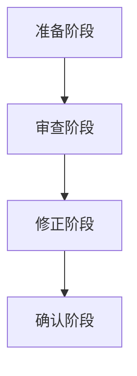

#### 12.2 团队协作与代码管理

团队协作和代码管理是软件开发成功的关键。有效的团队协作和代码管理可以确保代码质量和项目的顺利进行。以下是团队协作和代码管理的一些最佳实践：

1. **版本控制**：
   - 使用版本控制工具（如Git）管理代码库，确保代码的可追踪性和可回滚性。
   - 制定代码提交和合并的规范，确保代码库的整洁和一致性。

2. **代码评审**：
   - 定期进行代码评审，确保代码质量，及时发现和纠正问题。
   - 鼓励团队成员积极参与代码评审，提高代码的可读性和可维护性。

3. **持续集成**：
   - 使用持续集成工具（如Jenkins、GitLab CI）自动化构建、测试和部署代码，确保代码的稳定性和可靠性。
   - 制定持续集成的策略和流程，确保项目的持续交付。

4. **文档管理**：
   - 编写详细的文档，包括需求文档、设计文档和用户手册，帮助团队成员了解项目背景和功能。
   - 使用文档管理工具（如Confluence）集中管理文档，确保文档的可访问性和一致性。

**核心概念与联系：**

我们可以使用Mermaid流程图来展示团队协作和代码管理的核心概念：

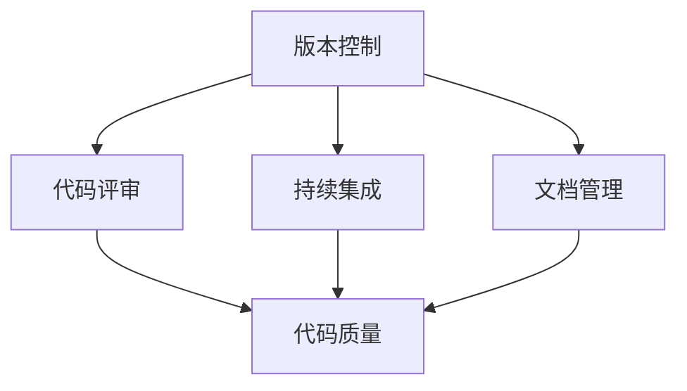

#### 12.2.1 版本控制工具的使用

以下是使用Git进行版本控制的一些最佳实践：

1. **初始化仓库**：
   - `git init`：初始化本地Git仓库。
   - `git clone <url>`：从远程仓库克隆项目。

2. **提交代码**：
   - `git add .`：将所有更改的文件添加到暂存区。
   - `git commit -m "Commit message"`：提交代码到本地仓库。

3. **分支管理**：
   - `git branch <branch_name>`：创建新分支。
   - `git checkout <branch_name>`：切换到指定分支。

4. **合并代码**：
   - `git merge <branch_name>`：将指定分支的代码合并到当前分支。

5. **远程仓库**：
   - `git remote add origin <url>`：添加远程仓库。
   - `git push origin <branch_name>`：将本地分支推送到远程仓库。

**示例：**

```shell
# 初始化仓库
git init

# 添加远程仓库
git remote add origin https://github.com/username/repo.git

# 克隆项目
git clone https://github.com/username/repo.git

# 提交代码
git add .
git commit -m "Commit message"

# 切换分支
git checkout -b feature/new_function

# 合并代码
git checkout main
git merge feature/new_function

# 推送到远程仓库
git push origin main
```

#### 12.2.2 团队协作的最佳实践

以下是团队协作的一些最佳实践：

1. **明确目标**：确保团队成员对项目的目标、需求和预期结果有清晰的认识。

2. **分工协作**：根据团队成员的技能和兴趣，合理分配任务，确保团队的高效协作。

3. **有效沟通**：定期召开会议，讨论项目的进展、问题和解决方案，确保团队成员之间的信息畅通。

4. **文档记录**：编写详细的文档，记录项目背景、需求、设计、测试和部署等，方便团队成员查阅。

5. **代码评审**：定期进行代码评审，确保代码质量，及时发现和纠正问题。

6. **持续集成**：使用持续集成工具，自动化构建、测试和部署代码，确保项目的稳定性和可靠性。

**小结：**

代码复审和团队协作是确保代码质量和项目成功的关键。通过有效的代码复审流程、团队协作和代码管理，我们可以提高代码质量、开发效率和项目成功率。

**注意事项：**

1. **代码质量**：确保代码符合编码规范、可读性强、易于维护。

2. **团队协作**：鼓励团队成员积极参与、有效沟通、分工协作。

3. **持续改进**：定期回顾和总结项目经验，持续改进代码质量和团队协作效率。

**拓展阅读：**

- 《敏捷软件开发：原则、实践与模式》 - 弗里曼·普雷斯特里
- 《Git权威指南》 - Scott Chacon

---

## 附录A：编程资源与工具

#### A.1 编程资源推荐

以下是一些推荐的编程资源，这些资源可以帮助您提高编程技能、了解最新技术动态和解决实际问题：

1. **在线教程与学习平台**：
   - [freeCodeCamp](https://www.freecodecamp.org/): 提供免费的编程课程和实践项目。
   - [Codecademy](https://www.codecademy.com/): 提供互动式的编程课程。
   - [edX](https://www.edx.org/): 全球顶尖大学提供的在线课程。

2. **技术博客与社区**：
   - [GitHub](https://github.com/): 全球最大的代码托管平台，可以查看和学习其他开发者的项目。
   - [Stack Overflow](https://stackoverflow.com/): 开发者提问和解答问题的社区。
   - [Medium](https://medium.com/): 许多技术专家和公司的技术博客。

3. **电子书与文档**：
   - [《代码大全》](https://book.douban.com/subject/25773595/): 史蒂夫·麦卡锡的经典著作，关于编写高质量代码的指南。
   - [《Effective Java》](https://book.douban.com/subject/20481272/): Joshua Bloch关于Java编程的最佳实践。

#### A.2 常用编程工具介绍

以下是一些常用的编程工具，它们可以帮助您更高效地开发和管理代码：

1. **版本控制工具**：
   - **Git**：最流行的版本控制工具，支持分布式版本控制和强大的分支管理。
   - **GitHub**：基于Git的代码托管平台，提供协作工具和代码审查功能。

2. **集成开发环境（IDE）**：
   - **Visual Studio Code**：跨平台的开源IDE，支持多种编程语言，拥有丰富的插件生态。
   - **IntelliJ IDEA**：强大的Java和Python IDE，提供智能代码补全、调试和性能分析功能。
   - **PyCharm**：专门为Python开发的IDE，支持多种编程语言，拥有丰富的插件和工具。

3. **测试工具**：
   - **JUnit**：Java编程语言的标准单元测试框架。
   - **pytest**：Python的测试框架，支持丰富的断言和插件。
   - **Selenium**：Web应用测试工具，支持多种浏览器和编程语言。

4. **持续集成与持续部署工具**：
   - **Jenkins**：开源的持续集成工具，支持多种构建工具和插件。
   - **GitLab CI/CD**：GitLab内置的持续集成和持续部署工具，支持自动化构建、测试和部署。

5. **性能分析工具**：
   - **cProfile**：Python的内置性能分析工具，用于分析程序的运行时间和函数调用。
   - **VisualVM**：Java虚拟机性能分析工具，用于监控和分析Java应用程序的性能。

**小结：**

通过利用这些编程资源和工具，您可以提高编程技能、掌握最新技术动态和更高效地开发和管理代码。不断学习和实践，将有助于您成为更加优秀的开发者。

---

## 附录B：参考文献与扩展阅读

以下是一些建议的参考文献和扩展阅读资源，这些资源将帮助您深入了解好代码的标准和修炼方法，拓展您的技术视野：

### 1. 参考文献与专业书籍

- **《代码大全》** - 史蒂夫·麦卡锡（Steve McConnell）
  - 内容摘要：本书详细阐述了编写高质量代码的实践和方法，包括编码原则、设计模式、测试技巧等。
- **《Effective Java》** - Joshua Bloch
  - 内容摘要：本书提供了Java编程的最佳实践，包括代码风格、性能优化、异常处理等方面。
- **《设计模式：可复用的面向对象软件构架》** - Erich Gamma等
  - 内容摘要：本书介绍了多种设计模式，包括工厂模式、单例模式、策略模式等，以及它们在软件设计中的应用。
- **《敏捷软件开发：原则、实践与模式》** - 弗里曼·普雷斯特里（Freeman P. Rymer）
  - 内容摘要：本书介绍了敏捷开发的方法和实践，包括迭代开发、用户故事、持续集成等。

### 2. 技术博客与社区

- **freeCodeCamp** (https://www.freecodecamp.org/)
  - 内容摘要：提供免费的编程课程和实践项目，适合初学者入门。
- **Codecademy** (https://www.codecademy.com/)
  - 内容摘要：互动式的编程课程，涵盖多种编程语言和前端开发。
- **Stack Overflow** (https://stackoverflow.com/)
  - 内容摘要：开发者提问和解答问题的社区，涵盖各种编程语言和技术问题。

### 3. 在线课程平台

- **edX** (https://www.edx.org/)
  - 内容摘要：全球顶尖大学提供的在线课程，涵盖计算机科学、软件开发等多个领域。
- **Udacity** (https://www.udacity.com/)
  - 内容摘要：提供多种在线课程和纳米学位，包括数据科学、人工智能等前沿技术。

### 4. 论文与研究报告

- **《大数据时代的数据挖掘挑战与机遇》** - 清华大学数据科学研究院
  - 内容摘要：分析了大数据时代的数据挖掘挑战和机遇，探讨了数据挖掘技术在各种领域的应用。
- **《深度学习：自适应系统的机遇与挑战》** - 吴恩达
  - 内容摘要：介绍了深度学习的基本原理、算法和应用，探讨了深度学习在人工智能领域的未来发展趋势。

**小结：**

通过阅读以上参考文献和扩展阅读资源，您可以深入了解好代码的标准和修炼方法，掌握最新的技术动态，提升自己的编程技能和软件工程能力。不断学习和实践，将帮助您成为更加优秀的开发者。

