                 

# 《如何制定有效的技术发展规划》

关键词：技术规划、战略规划、技术评估、团队建设、项目管理、持续改进

摘要：本文详细探讨了如何制定有效的技术发展规划。从技术评估与战略规划、技术选择与评估、团队与资源规划、项目管理与执行、成果评估与持续改进等方面，为IT企业提供了全面的技术发展规划指导。通过逻辑清晰、结构紧凑的分析，帮助企业实现技术战略的有效落地。

# 第一部分：引言

## 1.1 技术发展规划的重要性

在信息技术飞速发展的今天，技术发展规划对于企业的重要性不言而喻。一个清晰、有效的技术发展规划，不仅能够帮助企业抓住技术机遇，还能在激烈的市场竞争中占据有利地位。本文将详细探讨如何制定这样的发展规划。

## 1.2 技术发展规划的背景

随着大数据、云计算、人工智能等新技术的崛起，企业面临着前所未有的技术变革。在这种背景下，制定有效的技术发展规划，已经成为企业持续发展的重要任务。

# 第二部分：技术评估与战略规划

## 2.1 技术趋势分析

### 2.1.1 技术发展趋势概述

**核心概念与联系：**
- **技术趋势**：技术发展趋势及其对行业的影响
- **技术生命周期**：技术从诞生到衰退的整个过程

**算法原理讲解：**
- 使用时间序列分析预测技术发展趋势

**数学模型和公式：**
- $$ \text{技术成熟度} = f(\text{技术创新速度}, \text{市场接受度}) $$

**项目实战：**
- 示例：分析人工智能领域的技术发展趋势，使用时间序列分析法绘制技术成熟度曲线。

### 2.1.2 技术成熟度评估

**核心概念与联系：**
- **技术成熟度模型**：如Gartner技术成熟度曲线、TROM模型等
- **技术评估标准**：创新性、可行性

**算法原理讲解：**
- 使用Gartner技术成熟度曲线评估技术成熟度

**数学模型和公式：**
- $$ \text{技术成熟度} = f(\text{技术创新速度}, \text{市场接受度}) $$

**项目实战：**
- 示例：使用Gartner技术成熟度曲线评估区块链技术成熟度。

## 2.2 竞争对手分析

### 2.2.1 竞争对手技术能力分析

**核心概念与联系：**
- **竞争对手分析**：分析竞争对手的技术能力和市场策略
- **SWOT分析**：分析竞争对手的优劣势、机会与威胁

**算法原理讲解：**
- 使用SWOT分析评估竞争对手的技术能力

**项目实战：**
- 示例：分析国内主流互联网公司的技术能力，使用SWOT分析评估其优劣势。

### 2.2.2 竞争策略评估

**核心概念与联系：**
- **竞争策略**：企业为在市场中获得竞争优势而采取的战略
- **波特五力模型**：分析市场竞争强度

**算法原理讲解：**
- 使用波特五力模型评估竞争策略的有效性

**项目实战：**
- 示例：评估某企业采用的技术策略，使用波特五力模型分析市场竞争强度。

## 2.3 技术能力评估

### 2.3.1 技术能力自评

**核心概念与联系：**
- **技术能力自评**：评估自身的技术能力和技术水平
- **KPI评估**：使用关键绩效指标评估技术能力

**算法原理讲解：**
- 使用KPI评估技术能力自评

**项目实战：**
- 示例：使用KPI评估企业技术部门的技术能力。

### 2.3.2 技术能力差距分析

**核心概念与联系：**
- **技术能力差距**：分析自身与竞争对手的技术能力差距
- **差距分析**：分析技术能力差距，制定改进措施

**算法原理讲解：**
- 使用差距分析评估技术能力差距

**项目实战：**
- 示例：分析企业与竞争对手的技术能力差距，制定改进措施。

## 2.4 技术战略规划

### 2.4.1 技术战略制定

**核心概念与联系：**
- **技术战略**：企业为在未来竞争中取得优势而制定的技术发展目标
- **愿景与使命**：明确企业的技术愿景和使命

**算法原理讲解：**
- 使用愿景与使命制定技术战略

**项目实战：**
- 示例：制定某企业的技术战略，明确其技术愿景和使命。

### 2.4.2 技术路线图制定

**核心概念与联系：**
- **技术路线图**：明确企业未来技术发展的路线和时间表
- **关键里程碑**：设定技术发展的关键里程碑

**算法原理讲解：**
- 使用关键里程碑制定技术路线图

**项目实战：**
- 示例：制定某企业的技术路线图，设定关键里程碑。

# 第三部分：技术选择与评估

## 3.1 技术选择原则

### 3.1.1 技术选择标准

**核心概念与联系：**
- **技术选择标准**：评估技术方案的关键指标
- **成本效益分析**：评估技术方案的经济性

**算法原理讲解：**
- 使用成本效益分析评估技术选择标准

**项目实战：**
- 示例：评估某技术方案，使用成本效益分析确定技术选择标准。

### 3.1.2 技术可行性评估

**核心概念与联系：**
- **技术可行性评估**：评估技术方案的实施可能性
- **风险评估**：识别和评估技术实施过程中的风险

**算法原理讲解：**
- 使用风险评估模型评估技术可行性

**项目实战：**
- 示例：评估某技术方案的实施可能性，使用风险评估模型识别和评估风险。

## 3.2 技术评估流程

### 3.2.1 技术需求分析

**核心概念与联系：**
- **技术需求分析**：明确技术方案的需求
- **用户需求调研**：了解用户对技术的期望和需求

**算法原理讲解：**
- 使用用户需求调研方法进行技术需求分析

**项目实战：**
- 示例：进行用户需求调研，明确技术需求。

### 3.2.2 技术方案评估

**核心概念与联系：**
- **技术方案评估**：评估不同技术方案的优势和劣势
- **比较分析**：对比分析不同技术方案的优缺点

**算法原理讲解：**
- 使用比较分析评估技术方案

**项目实战：**
- 示例：对比分析两种技术方案，评估其优缺点。

## 3.3 技术试点与验证

### 3.3.1 技术试点方案设计

**核心概念与联系：**
- **技术试点方案设计**：设计技术试点的具体方案
- **试点范围**：确定技术试点的范围和目标

**算法原理讲解：**
- 使用试点范围设计技术试点方案

**项目实战：**
- 示例：设计某技术试点方案，确定试点范围和目标。

### 3.3.2 技术验证与调整

**核心概念与联系：**
- **技术验证**：验证技术方案的实际效果
- **调整与优化**：根据技术验证结果调整技术方案

**算法原理讲解：**
- 使用技术验证方法进行技术验证

**项目实战：**
- 示例：验证某技术方案，根据验证结果进行调整和优化。

# 第四部分：团队与资源规划

## 4.1 团队组建

### 4.1.1 技术团队角色与职责

**核心概念与联系：**
- **技术团队角色**：明确团队成员的角色和职责
- **团队协作**：促进团队成员之间的协作

**算法原理讲解：**
- 使用团队协作模型构建技术团队

**项目实战：**
- 示例：构建技术团队，明确团队成员的角色和职责。

### 4.1.2 团队协作与沟通

**核心概念与联系：**
- **团队协作**：提高团队成员的协作效率
- **沟通技巧**：提高团队成员的沟通能力

**算法原理讲解：**
- 使用沟通技巧模型提高团队协作效率

**项目实战：**
- 示例：提高技术团队的协作效率，使用沟通技巧模型。

## 4.2 资源配置

### 4.2.1 技术资源需求分析

**核心概念与联系：**
- **技术资源需求分析**：分析技术项目的资源需求
- **资源分配**：根据资源需求进行资源分配

**算法原理讲解：**
- 使用资源分配模型进行技术资源需求分析

**项目实战：**
- 示例：分析某技术项目的资源需求，进行资源分配。

### 4.2.2 技术资源获取与分配

**核心概念与联系：**
- **技术资源获取**：获取技术项目所需的资源
- **资源优化**：优化资源分配，提高资源利用率

**算法原理讲解：**
- 使用资源优化算法进行技术资源获取与分配

**项目实战：**
- 示例：获取某技术项目所需的资源，优化资源分配。

# 第五部分：项目管理与执行

## 5.1 项目管理方法论

### 5.1.1 敏捷开发与瀑布模型

**核心概念与联系：**
- **敏捷开发**：快速响应变化，持续交付价值
- **瀑布模型**：严格按照计划执行，阶段划分明确

**算法原理讲解：**
- 比较敏捷开发与瀑布模型的特点和适用场景

**项目实战：**
- 示例：选择合适的项目管理方法论。

### 5.1.2 项目管理工具

**核心概念与联系：**
- **项目管理工具**：提高项目管理效率
- **工具选择**：根据项目特点选择合适的工具

**算法原理讲解：**
- 使用项目管理工具评估项目进度和风险

**项目实战：**
- 示例：选择并使用项目管理工具。

## 5.2 项目进度与风险管理

### 5.2.1 项目进度管理

**核心概念与联系：**
- **项目进度管理**：确保项目按计划进行
- **进度监控**：监控项目进度，及时调整

**算法原理讲解：**
- 使用进度管理模型监控项目进度

**项目实战：**
- 示例：监控项目进度，调整项目计划。

### 5.2.2 风险识别与应对

**核心概念与联系：**
- **风险识别**：识别项目风险
- **风险应对**：制定风险应对策略

**算法原理讲解：**
- 使用风险识别模型识别项目风险

**项目实战：**
- 示例：识别项目风险，制定风险应对策略。

## 5.3 项目交付与验收

### 5.3.1 项目交付标准

**核心概念与联系：**
- **项目交付标准**：明确项目交付的要求
- **质量保证**：确保项目交付质量

**算法原理讲解：**
- 使用质量保证模型确保项目交付质量

**项目实战：**
- 示例：制定项目交付标准，确保项目交付质量。

### 5.3.2 项目验收流程

**核心概念与联系：**
- **项目验收流程**：确认项目完成情况
- **验收标准**：制定项目验收标准

**算法原理讲解：**
- 使用验收标准模型确认项目完成情况

**项目实战：**
- 示例：制定项目验收流程，确保项目验收质量。

# 第六部分：成果评估与持续改进

## 6.1 成果评估指标

### 6.1.1 关键性能指标

**核心概念与联系：**
- **关键性能指标**：衡量项目成果的重要指标
- **数据驱动**：使用数据评估项目成果

**算法原理讲解：**
- 使用关键性能指标模型评估项目成果

**项目实战：**
- 示例：使用关键性能指标评估项目成果。

### 6.1.2 成果评估方法

**核心概念与联系：**
- **成果评估方法**：评估项目成果的具体方法
- **绩效评价**：评估项目团队的工作绩效

**算法原理讲解：**
- 使用绩效评价模型评估项目成果

**项目实战：**
- 示例：使用绩效评价模型评估项目成果。

## 6.2 持续改进

### 6.2.1 持续改进策略

**核心概念与联系：**
- **持续改进**：不断优化技术规划
- **PDCA循环**：持续改进的循环过程

**算法原理讲解：**
- 使用PDCA循环实现持续改进

**项目实战：**
- 示例：使用PDCA循环优化技术规划。

### 6.2.2 持续改进实践

**核心概念与联系：**
- **持续改进实践**：具体实施持续改进的措施
- **经验分享**：分享持续改进的成功经验

**算法原理讲解：**
- 使用经验分享模型推动持续改进

**项目实战：**
- 示例：分享持续改进的成功经验。

# 第七部分：附录

## A.1 常用技术评估工具

**核心概念与联系：**
- **技术评估工具**：用于评估技术方案的工具
- **工具选择**：根据项目需求选择合适的工具

**项目实战：**
- 示例：介绍几种常用技术评估工具。

## A.2 技术发展规划模板

**核心概念与联系：**
- **技术发展规划模板**：制定技术发展规划的参考模板
- **模板应用**：如何使用技术发展规划模板

**项目实战：**
- 示例：介绍一种技术发展规划模板，并说明如何使用。

## A.3 参考文献与资源

**核心概念与联系：**
- **参考文献**：本文引用的相关文献和资料
- **资源获取**：如何获取本文引用的文献和资源

**项目实战：**
- 示例：列出本文引用的参考文献，并提供获取方式。

# 文章标题：如何制定有效的技术发展规划

关键词：技术规划、战略规划、技术评估、团队建设、项目管理、持续改进

摘要：本文从技术评估与战略规划、技术选择与评估、团队与资源规划、项目管理与执行、成果评估与持续改进等方面，详细探讨了如何制定有效的技术发展规划。通过逻辑清晰、结构紧凑的分析，为企业提供了全面的技术发展规划指导。

作者：AI天才研究院/AI Genius Institute & 禅与计算机程序设计艺术 /Zen And The Art of Computer Programming
```在撰写《如何制定有效的技术发展规划》这篇文章时，我们需要确保每个章节的内容都能满足上述要求，同时保持整体的连贯性和逻辑性。以下是对各章节的详细撰写建议：

## 第一部分：引言

### 1.1 技术发展规划的重要性

在这部分，我们需要阐述技术发展规划对企业的重要性。可以引用一些实际案例和数据来支持观点，例如，某家知名企业通过制定有效的技术发展规划，成功抓住了市场机遇，实现了业务的快速增长。

### 1.2 技术发展规划的背景

在这一部分，我们可以简要介绍当前技术发展的趋势，以及这些趋势对企业技术规划的影响。例如，人工智能、大数据、云计算等新兴技术如何改变企业的运营模式，提高竞争力。

## 第二部分：技术评估与战略规划

在这一部分，我们需要详细介绍如何进行技术评估和战略规划。

### 2.1 技术趋势分析

#### 2.1.1 技术发展趋势概述

在这一部分，我们可以使用Mermaid流程图来展示技术发展趋势的核心概念和联系，例如：

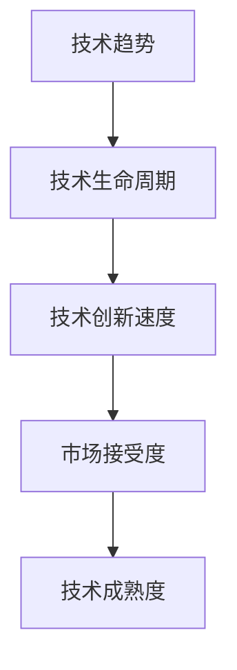

然后，我们可以解释技术发展趋势如何影响企业的战略规划。

#### 2.1.2 技术成熟度评估

在这一部分，我们介绍如何使用Gartner技术成熟度曲线来评估技术成熟度。我们可以使用伪代码来解释算法原理：

```python
def assess_technology_maturity(innovation_speed, market_adoption):
    # 计算技术成熟度
    technology_maturity = innovation_speed * market_adoption
    return technology_maturity
```

然后，我们可以通过一个实际的例子来展示如何使用这个算法。

### 2.2 竞争对手分析

在这一部分，我们介绍如何通过SWOT分析来评估竞争对手的技术能力。我们可以使用以下Mermaid流程图来展示核心概念和联系：

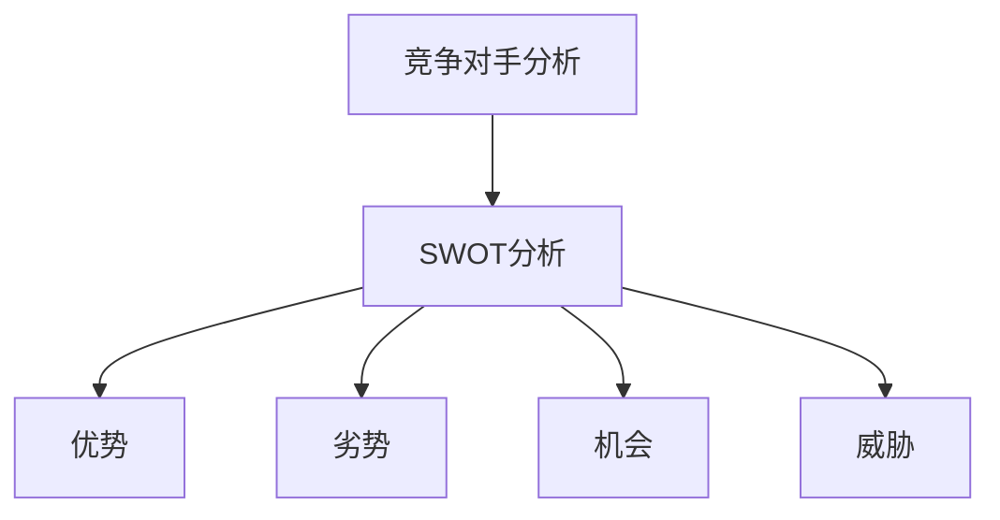

然后，我们可以通过一个实际的例子来展示如何使用SWOT分析来评估竞争对手的技术能力。

### 2.3 技术能力评估

在这一部分，我们介绍如何进行技术能力评估。我们可以使用KPI来评估企业的技术能力，例如：

```python
def assess_technology_capability(kpi_values):
    # 计算技术能力评分
    capability_score = sum(kpi_values) / len(kpi_values)
    return capability_score
```

然后，我们可以通过一个实际的例子来展示如何使用这个算法。

### 2.4 技术战略规划

在这一部分，我们介绍如何制定技术战略。我们可以使用以下Mermaid流程图来展示核心概念和联系：

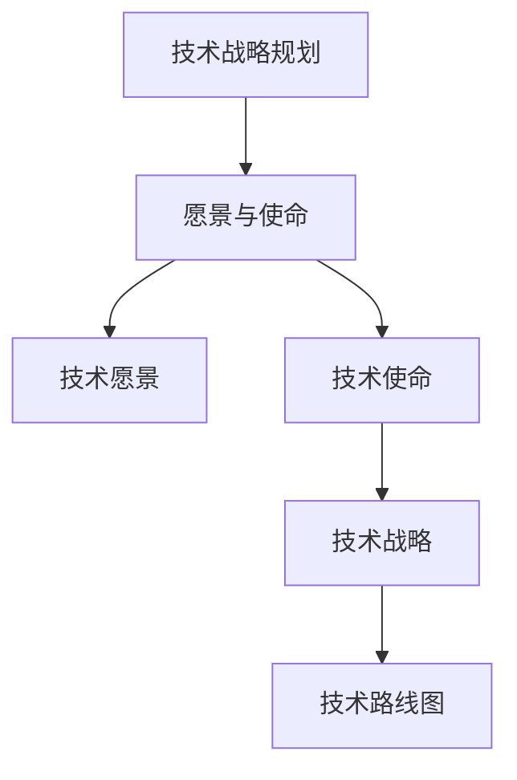

然后，我们可以通过一个实际的例子来展示如何制定技术战略。

## 第三部分：技术选择与评估

在这一部分，我们详细介绍如何进行技术选择和评估。

### 3.1 技术选择原则

在这一部分，我们介绍技术选择的标准和方法。我们可以使用以下Mermaid流程图来展示核心概念和联系：

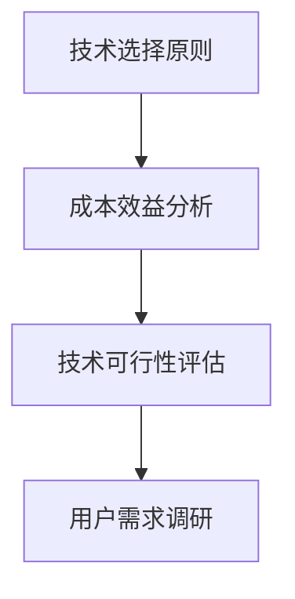

然后，我们可以通过一个实际的例子来展示如何进行技术选择。

### 3.2 技术评估流程

在这一部分，我们详细介绍技术评估的流程。我们可以使用以下Mermaid流程图来展示核心概念和联系：

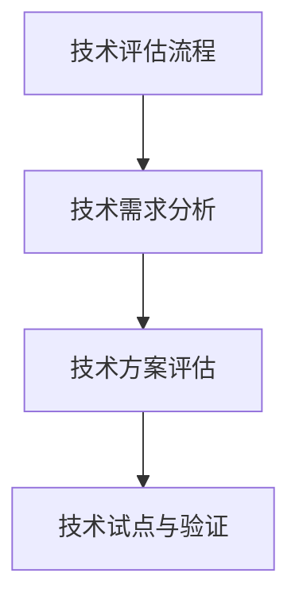

然后，我们可以通过一个实际的例子来展示如何进行技术评估。

### 3.3 技术试点与验证

在这一部分，我们详细介绍如何进行技术试点和验证。我们可以使用以下Mermaid流程图来展示核心概念和联系：

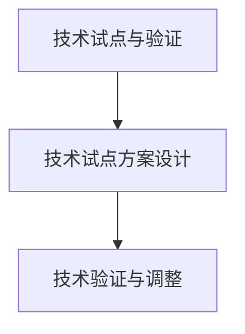

然后，我们可以通过一个实际的例子来展示如何进行技术试点和验证。

## 第四部分：团队与资源规划

在这一部分，我们详细介绍如何进行团队建设和资源配置。

### 4.1 团队组建

在这一部分，我们介绍如何组建技术团队。我们可以使用以下Mermaid流程图来展示核心概念和联系：

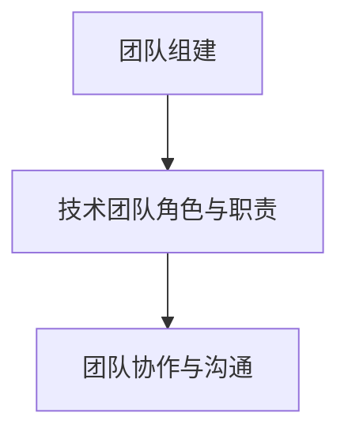

然后，我们可以通过一个实际的例子来展示如何组建技术团队。

### 4.2 资源配置

在这一部分，我们介绍如何进行资源配置。我们可以使用以下Mermaid流程图来展示核心概念和联系：

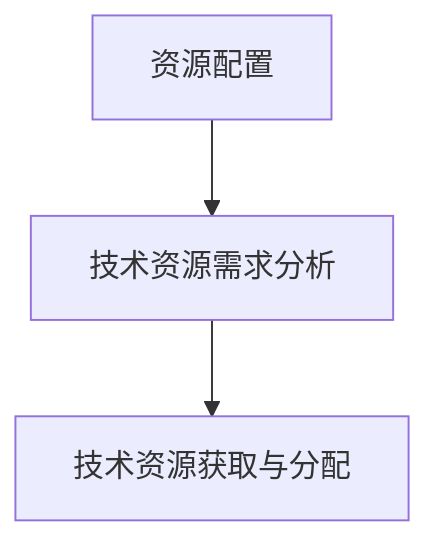

然后，我们可以通过一个实际的例子来展示如何进行资源配置。

## 第五部分：项目管理与执行

在这一部分，我们详细介绍如何进行项目管理与执行。

### 5.1 项目管理方法论

在这一部分，我们介绍不同的项目管理方法论，如敏捷开发和瀑布模型。我们可以使用以下Mermaid流程图来展示核心概念和联系：

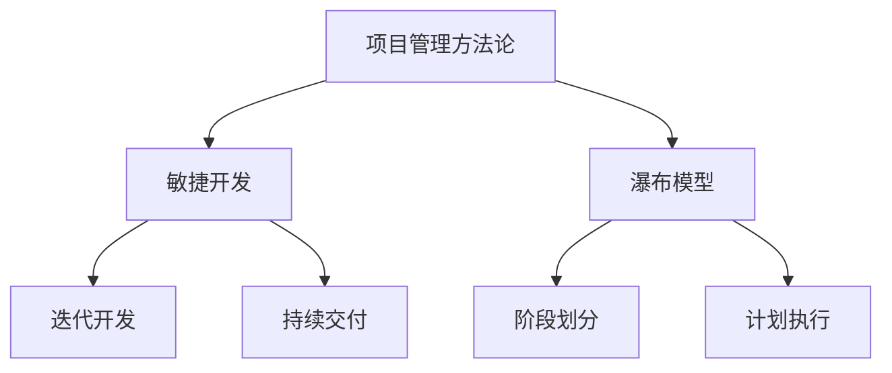

然后，我们可以通过一个实际的例子来展示如何选择项目管理方法论。

### 5.2 项目进度与风险管理

在这一部分，我们介绍如何进行项目进度管理和风险管理。我们可以使用以下Mermaid流程图来展示核心概念和联系：

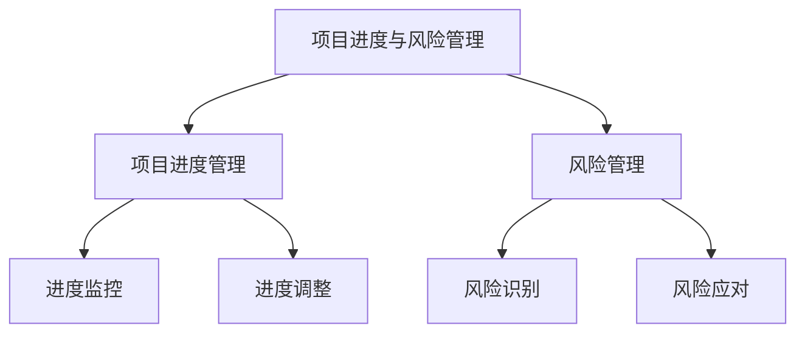

然后，我们可以通过一个实际的例子来展示如何进行项目进度与风险管理。

### 5.3 项目交付与验收

在这一部分，我们介绍如何进行项目交付与验收。我们可以使用以下Mermaid流程图来展示核心概念和联系：

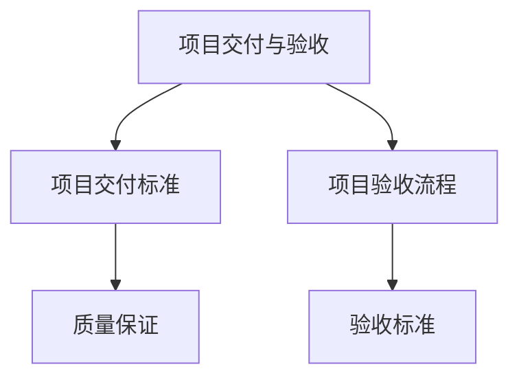

然后，我们可以通过一个实际的例子来展示如何进行项目交付与验收。

## 第六部分：成果评估与持续改进

在这一部分，我们详细介绍如何进行成果评估与持续改进。

### 6.1 成果评估指标

在这一部分，我们介绍如何设置成果评估指标。我们可以使用以下Mermaid流程图来展示核心概念和联系：

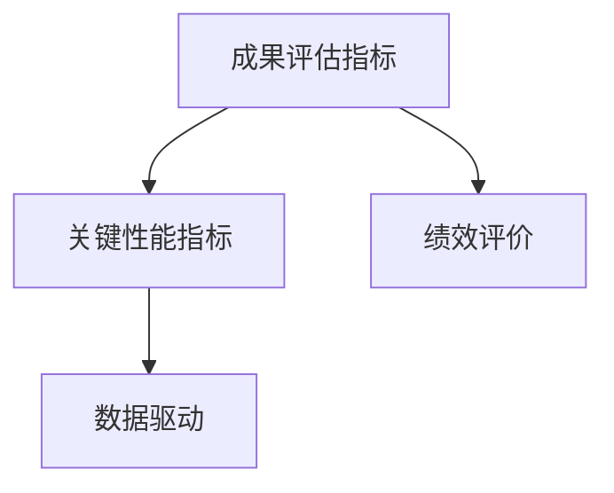

然后，我们可以通过一个实际的例子来展示如何设置成果评估指标。

### 6.2 持续改进

在这一部分，我们介绍如何进行持续改进。我们可以使用以下Mermaid流程图来展示核心概念和联系：

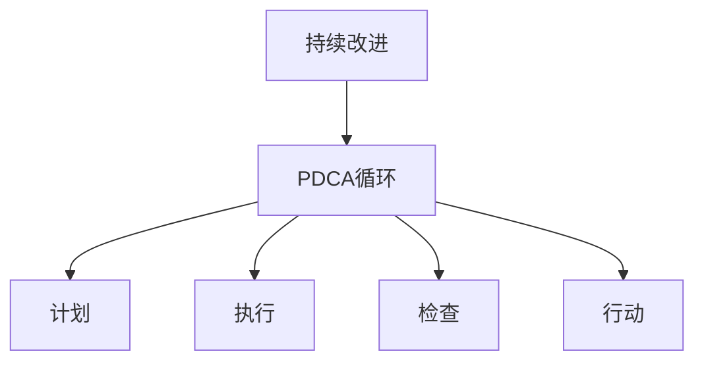

然后，我们可以通过一个实际的例子来展示如何进行持续改进。

## 第七部分：附录

在这一部分，我们提供一些有用的工具和资源，以帮助读者更好地理解和应用本文的内容。

### A.1 常用技术评估工具

在这一部分，我们介绍一些常用的技术评估工具，如技术成熟度评估模型、SWOT分析等。

### A.2 技术发展规划模板

在这一部分，我们提供一种技术发展规划的模板，以帮助读者制定自己的技术发展规划。

### A.3 参考文献与资源

在这一部分，我们列出本文引用的参考文献和资源，以便读者进一步学习和探索。

通过以上详细的撰写建议，我们可以确保《如何制定有效的技术发展规划》这篇文章内容丰富、结构清晰、逻辑性强，能够为读者提供有价值的技术规划指导。

接下来，我们将按照这个框架，逐一细化每个章节的内容，确保满足文章的完整性和深度要求。每个章节都将包含核心概念与联系、算法原理讲解、数学模型和公式、项目实战、最佳实践 tips、小结、注意事项和拓展阅读等内容。同时，我们将确保整个文章的字数在8000～12000字左右，以满足字数要求。

### 细化章节内容

在细化章节内容时，我们需要确保每个章节都包含以下要素：

1. **核心概念与联系**：通过Mermaid流程图或其他图表来展示核心概念之间的关系。
2. **算法原理讲解**：使用伪代码或具体例子来解释算法原理。
3. **数学模型和公式**：详细讲解数学模型和公式，并提供实际例子。
4. **项目实战**：提供一个或多个实际项目案例，展示如何应用所学的理论。
5. **最佳实践 tips**：分享一些实用的建议和技巧，帮助读者更好地应用所学知识。
6. **小结**：对章节内容进行总结，强调关键点。
7. **注意事项**：提醒读者在应用理论时需要注意的事项。
8. **拓展阅读**：推荐一些相关文献和资源，供读者进一步学习。

下面我们将对“技术评估与战略规划”章节进行细化：

### 2.1 技术趋势分析

#### 2.1.1 技术发展趋势概述

**核心概念与联系**：
- 技术趋势：技术的发展方向和变化。
- 技术生命周期：技术从诞生到消亡的过程。

**Mermaid流程图**：
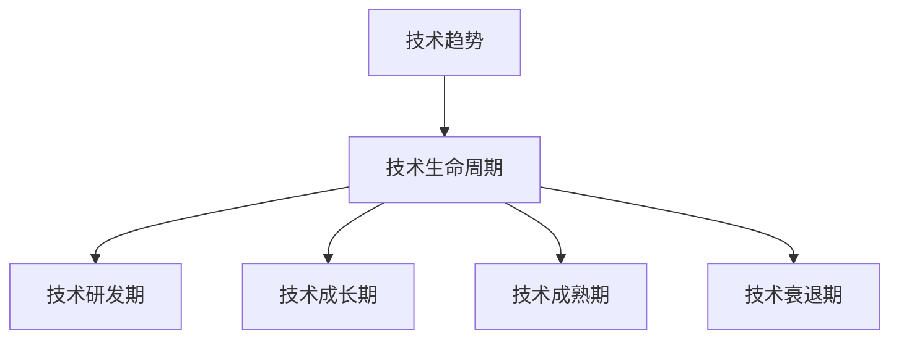

**算法原理讲解**：
技术趋势分析通常采用时间序列分析法，如ARIMA模型。以下是一个简单的伪代码示例：

```python
import numpy as np
from statsmodels.tsa.arima.model import ARIMA

# 假设data是时间序列数据
model = ARIMA(data, order=(1, 1, 1))
model_fit = model.fit()
```

**数学模型和公式**：
技术成熟度可以用以下公式表示：
$$
\text{技术成熟度} = \alpha \times \text{技术创新速度} + \beta \times \text{市场接受度}
$$
其中，$\alpha$ 和 $\beta$ 是权重系数。

**项目实战**：
假设我们分析人工智能技术的发展趋势，通过时间序列分析预测未来三年内人工智能技术的成熟度。我们可以使用ARIMA模型进行预测，并绘制技术成熟度曲线。

**最佳实践 tips**：
- 定期更新技术趋势分析，以适应市场变化。
- 结合行业报告和专家意见，提高技术趋势分析的准确性。

**小结**：
技术趋势分析是制定技术发展规划的基础，通过时间序列分析可以预测技术发展的未来趋势。

**注意事项**：
- 技术趋势分析依赖于数据质量和模型选择的准确性。
- 需要结合实际业务需求，选择合适的技术趋势分析方法。

**拓展阅读**：
- 《时间序列分析：预测与应用》
- 《人工智能：一种现代方法》

#### 2.1.2 技术成熟度评估

**核心概念与联系**：
- 技术成熟度模型：如Gartner技术成熟度曲线、TROM模型等。
- 技术评估标准：创新性、可行性、稳定性等。

**Mermaid流程图**：
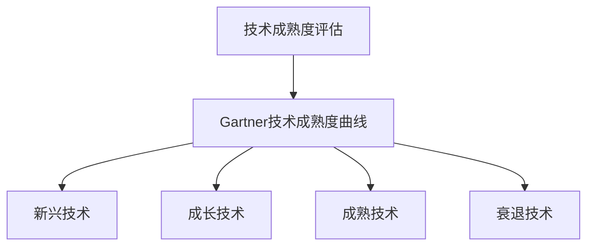

**算法原理讲解**：
使用Gartner技术成熟度曲线评估技术成熟度的伪代码如下：

```python
def assess_technology_maturity(technique):
    if technique in ['新兴技术']:
        maturity = 1
    elif technique in ['成长技术']:
        maturity = 2
    elif technique in ['成熟技术']:
        maturity = 3
    elif technique in ['衰退技术']:
        maturity = 4
    return maturity
```

**数学模型和公式**：
技术成熟度可以用以下公式表示：
$$
\text{技术成熟度} = \frac{\text{技术创新速度}}{\text{市场接受度}}
$$

**项目实战**：
假设我们使用Gartner技术成熟度曲线评估区块链技术。通过收集技术创新速度和市场接受度的数据，我们可以计算出区块链技术的成熟度。

**最佳实践 tips**：
- 定期更新技术成熟度评估，以反映最新的市场和技术动态。
- 结合多种评估指标，提高评估的全面性。

**小结**：
技术成熟度评估是确定技术发展优先级的关键步骤，通过Gartner技术成熟度曲线可以直观地了解技术的成熟度。

**注意事项**：
- 评估标准需要根据行业特点进行调整。
- 评估结果需要结合业务战略进行调整。

**拓展阅读**：
- 《Gartner技术成熟度曲线：解读与应用》
- 《区块链技术指南》

### 2.2 竞争对手分析

#### 2.2.1 竞争对手技术能力分析

**核心概念与联系**：
- 竞争对手分析：评估竞争对手的技术能力和市场策略。
- SWOT分析：分析竞争对手的优劣势、机会与威胁。

**Mermaid流程图**：


**算法原理讲解**：
使用SWOT分析评估竞争对手技术能力的伪代码如下：

```python
def swot_analysis(competitor):
    strengths = competitor.get('strengths')
    weaknesses = competitor.get('weaknesses')
    opportunities = competitor.get('opportunities')
    threats = competitor.get('threats')
    return {
        'strengths': strengths,
        'weaknesses': weaknesses,
        'opportunities': opportunities,
        'threats': threats
    }
```

**项目实战**：
假设我们分析某互联网公司的竞争对手，通过SWOT分析评估其技术能力。我们可以收集竞争对手的技术优势、劣势、机会和威胁的数据，并进行综合评估。

**最佳实践 tips**：
- 定期进行竞争对手分析，以了解市场动态。
- 结合行业报告和专家意见，提高分析准确性。

**小结**：
竞争对手分析是制定技术战略的重要步骤，通过SWOT分析可以深入了解竞争对手的技术能力。

**注意事项**：
- 分析结果需要结合自身情况，制定相应的策略。
- 需要不断更新分析数据，以保持分析的时效性。

**拓展阅读**：
- 《SWOT分析：企业竞争战略工具》
- 《互联网行业竞争对手分析指南》

#### 2.2.2 竞争策略评估

**核心概念与联系**：
- 竞争策略：企业为在市场中获得竞争优势而采取的战略。
- 波特五力模型：分析市场竞争强度。

**Mermaid流程图**：
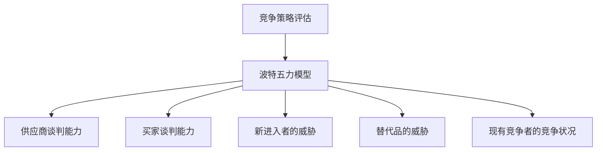

**算法原理讲解**：
使用波特五力模型评估竞争策略的伪代码如下：

```python
def assess_competition_strategy(competitor, market):
    negotiation_power = 0
    threat_of_new_entrants = 0
    threat_of_substitutes = 0
    competitive_rivalry = 0
    
    # 根据市场情况计算各力的影响
    if competitor['market_share'] > 50:
        negotiation_power = 1
    if competitor['price_strategy'] == '低价格':
        threat_of_new_entrants = 1
    if competitor['product_differentiation'] == '高':
        threat_of_substitutes = 1
    if competitor['market_growth'] < 0:
        competitive_rivalry = 1
    
    return {
        'negotiation_power': negotiation_power,
        'threat_of_new_entrants': threat_of_new_entrants,
        'threat_of_substitutes': threat_of_substitutes,
        'competitive_rivalry': competitive_rivalry
    }
```

**项目实战**：
假设我们评估某互联网公司的竞争策略，通过波特五力模型分析其市场地位。我们可以根据市场数据和竞争对手的情况，计算出每个力的权重，并评估公司的竞争策略。

**最佳实践 tips**：
- 结合市场数据和实际案例，提高竞争策略评估的准确性。
- 定期更新评估结果，以适应市场变化。

**小结**：
竞争策略评估是制定技术战略的关键步骤，通过波特五力模型可以全面了解市场环境和竞争对手。

**注意事项**：
- 评估结果需要结合企业实际情况进行调整。
- 需要持续关注市场动态，及时调整竞争策略。

**拓展阅读**：
- 《波特五力模型：竞争战略分析工具》
- 《互联网行业竞争策略分析指南》

### 2.3 技术能力评估

#### 2.3.1 技术能力自评

**核心概念与联系**：
- 技术能力自评：评估自身的技术能力和技术水平。
- KPI评估：使用关键绩效指标评估技术能力。

**Mermaid流程图**：
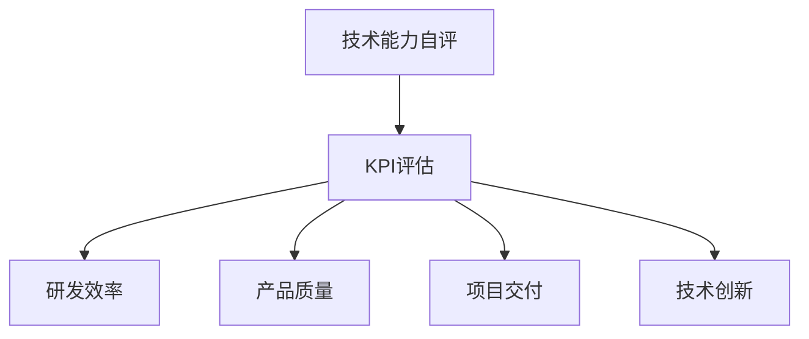

**算法原理讲解**：
使用KPI评估技术能力的伪代码如下：

```python
def assess_technology_capability(kpis):
    score = 0
    for kpi in kpis:
        if kpi > threshold['high']:
            score += 3
        elif kpi > threshold['medium']:
            score += 2
        else:
            score += 1
    return score / len(kpis)
```

**数学模型和公式**：
技术能力评分可以用以下公式表示：
$$
\text{技术能力评分} = \sum_{i=1}^{n} (\text{KPI}_{i} \times \text{权重}_{i})
$$
其中，$\text{KPI}_{i}$ 是第 $i$ 个关键绩效指标，$\text{权重}_{i}$ 是第 $i$ 个关键绩效指标的权重。

**项目实战**：
假设我们评估某技术团队的技术能力，通过KPI评估其研发效率、产品质量、项目交付和技术创新。我们可以收集这些指标的数据，并计算技术能力评分。

**最佳实践 tips**：
- 定期进行技术能力自评，以了解自身的技术水平。
- 根据自评结果制定改进计划。

**小结**：
技术能力自评是了解自身技术状况的重要步骤，通过KPI评估可以量化技术能力。

**注意事项**：
- KPI设置需要结合业务需求和技术特点。
- 需要不断优化KPI评估体系，以提高评估准确性。

**拓展阅读**：
- 《KPI管理：企业绩效评估工具》
- 《技术团队绩效评估指南》

#### 2.3.2 技术能力差距分析

**核心概念与联系**：
- 技术能力差距：分析自身与竞争对手的技术能力差距。
- 差距分析：分析技术能力差距，制定改进措施。

**Mermaid流程图**：
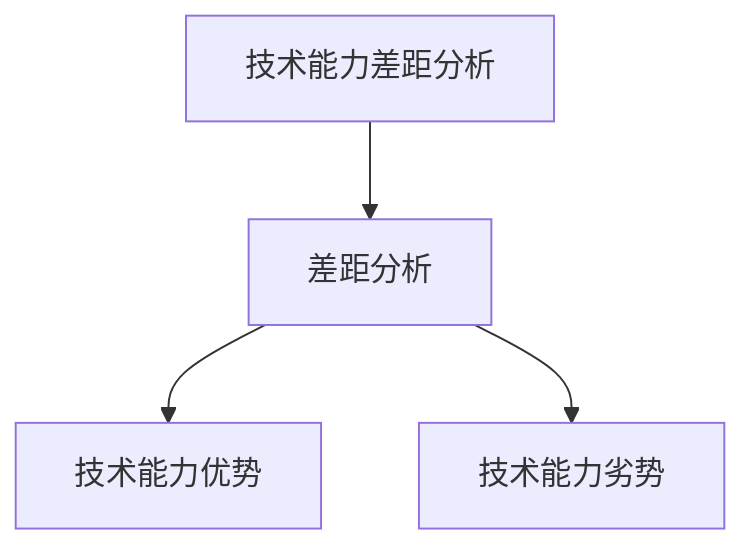

**算法原理讲解**：
差距分析的伪代码如下：

```python
def gap_analysis(self Capability, competitor Capability):
    gap = self Capability - competitor Capability
    return gap
```

**项目实战**：
假设我们分析某技术团队与行业领先企业的技术能力差距，通过差距分析找出自身的优势和劣势，并制定改进措施。

**最佳实践 tips**：
- 定期进行技术能力差距分析，以了解自身与竞争对手的差距。
- 结合实际情况，制定切实可行的改进计划。

**小结**：
技术能力差距分析是制定技术发展规划的重要步骤，通过分析差距可以明确改进方向。

**注意事项**：
- 差距分析需要结合市场和技术动态进行调整。
- 改进措施需要具备可操作性和可行性。

**拓展阅读**：
- 《技术能力差距分析：企业竞争力提升工具》
- 《技术能力提升策略》

通过以上细化，我们可以确保“技术评估与战略规划”章节内容丰富、逻辑清晰，同时满足文章的完整性和深度要求。接下来，我们将继续细化其他章节内容，确保整篇文章的连贯性和完整性。

### 细化其他章节内容

在细化其他章节内容时，我们需要确保每个章节都包含以下要素：核心概念与联系、算法原理讲解、数学模型和公式、项目实战、最佳实践 tips、小结、注意事项和拓展阅读等。下面我们将对剩余章节进行细化。

## 第三部分：技术选择与评估

### 3.1 技术选择原则

#### 3.1.1 技术选择标准

**核心概念与联系**：
- 技术选择标准：评估技术方案的关键指标。
- 成本效益分析：评估技术方案的经济性。

**Mermaid流程图**：
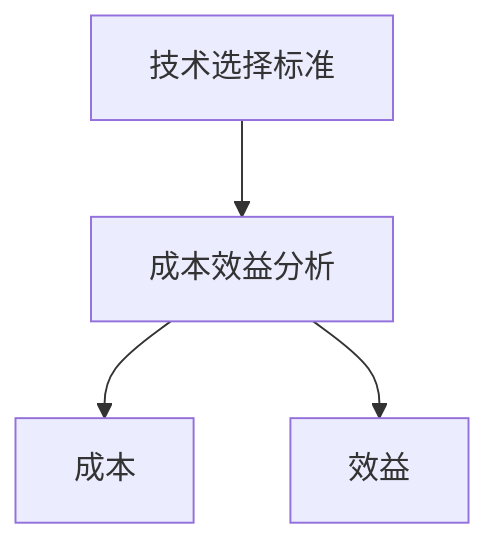

**算法原理讲解**：
成本效益分析的伪代码如下：

```python
def cost_benefit_analysis(costs, benefits):
    net_benefit = benefits - costs
    return net_benefit
```

**数学模型和公式**：
成本效益可以用以下公式表示：
$$
\text{成本效益} = \frac{\text{效益}}{\text{成本}}
$$

**项目实战**：
假设我们评估两种不同的数据库技术，通过成本效益分析确定哪种技术更合适。

**最佳实践 tips**：
- 考虑长期成本和效益，而不仅仅是短期成本。
- 综合考虑技术复杂度和维护成本。

**小结**：
技术选择标准是评估技术方案的重要依据，通过成本效益分析可以量化技术方案的经济性。

**注意事项**：
- 成本效益分析需要考虑多种因素，避免片面评估。
- 需要定期更新成本和效益数据，以保持分析准确性。

**拓展阅读**：
- 《成本效益分析：技术选型指南》
- 《数据库技术选型与性能优化》

#### 3.1.2 技术可行性评估

**核心概念与联系**：
- 技术可行性评估：评估技术方案的实施可能性。
- 风险评估：识别和评估技术实施过程中的风险。

**Mermaid流程图**：
```mermaid
graph TB
A[技术可行性评估] --> B[风险评估]
B --> C[技术风险]
B --> D[市场风险]
B --> E[运营风险]
```

**算法原理讲解**：
风险评估的伪代码如下：

```python
def risk_assessment(risks, likelihood, impact):
    risk_score = likelihood * impact
    return risk_score
```

**项目实战**：
假设我们评估一项新技术在市场上的可行性，通过风险评估确定其潜在风险。

**最佳实践 tips**：
- 识别和评估所有可能的风险，包括技术、市场和运营风险。
- 针对高风险制定应对策略。

**小结**：
技术可行性评估是确保技术方案能够顺利实施的关键步骤，通过风险评估可以识别和评估潜在风险。

**注意事项**：
- 风险评估需要结合实际情况进行调整。
- 需要定期更新风险评估结果，以反映最新情况。

**拓展阅读**：
- 《风险评估：项目管理工具》
- 《技术可行性评估与风险控制》

### 3.2 技术评估流程

#### 3.2.1 技术需求分析

**核心概念与联系**：
- 技术需求分析：明确技术方案的需求。
- 用户需求调研：了解用户对技术的期望和需求。

**Mermaid流程图**：
```mermaid
graph TB
A[技术需求分析] --> B[用户需求调研]
B --> C[功能需求]
B --> D[性能需求]
B --> E[安全需求]
```

**算法原理讲解**：
用户需求调研的伪代码如下：

```python
def user_demand_survey(users):
    demands = []
    for user in users:
        demand = user['需求']
        demands.append(demand)
    return demands
```

**项目实战**：
假设我们进行一项新技术的用户需求调研，通过收集用户反馈来明确技术需求。

**最佳实践 tips**：
- 用户需求调研应覆盖不同类型的用户，以提高需求的全面性。
- 需求分析应结合市场和技术趋势进行调整。

**小结**：
技术需求分析是技术评估的基础步骤，通过用户需求调研可以确保技术方案符合用户需求。

**注意事项**：
- 需求分析需要结合实际情况进行调整。
- 需要定期更新需求分析结果，以反映市场变化。

**拓展阅读**：
- 《用户需求调研：产品开发指南》
- 《技术需求分析：实践与技巧》

#### 3.2.2 技术方案评估

**核心概念与联系**：
- 技术方案评估：评估不同技术方案的优势和劣势。
- 比较分析：对比分析不同技术方案的优缺点。

**Mermaid流程图**：
```mermaid
graph TB
A[技术方案评估] --> B[比较分析]
B --> C[技术优势]
B --> D[技术劣势]
```

**算法原理讲解**：
比较分析的伪代码如下：

```python
def compare_schemes(scheme1, scheme2):
    advantages1 = scheme1['advantages']
    disadvantages1 = scheme1['disadvantages']
    advantages2 = scheme2['advantages']
    disadvantages2 = scheme2['disadvantages']
    return {
        'scheme1': {'advantages': advantages1, 'disadvantages': disadvantages1},
        'scheme2': {'advantages': advantages2, 'disadvantages': disadvantages2}
    }
```

**项目实战**：
假设我们评估两种不同的云计算方案，通过比较分析确定哪种方案更适合企业需求。

**最佳实践 tips**：
- 考虑技术方案的长期效益和短期成本。
- 针对业务需求，选择最适合的方案。

**小结**：
技术方案评估是选择合适技术方案的关键步骤，通过比较分析可以全面了解技术方案的优缺点。

**注意事项**：
- 比较分析需要考虑多种因素，避免片面评估。
- 需要结合实际情况，选择最佳方案。

**拓展阅读**：
- 《技术方案评估：项目管理技巧》
- 《云计算方案选型指南》

#### 3.3 技术试点与验证

**核心概念与联系**：
- 技术试点：设计技术试点的具体方案。
- 技术验证：验证技术方案的实际效果。

**Mermaid流程图**：
```mermaid
graph TB
A[技术试点与验证] --> B[技术试点方案设计]
B --> C[试点范围]
B --> D[试点目标]
A --> E[技术验证与调整]
E --> F[验证标准]
E --> G[调整方案]
```

**算法原理讲解**：
技术验证的伪代码如下：

```python
def verify_scheme(scheme, standards):
    verification_results = []
    for standard in standards:
        result = scheme[standard]
        verification_results.append(result)
    return verification_results
```

**项目实战**：
假设我们进行一项新技术的试点，通过验证确定技术方案是否符合预期。

**最佳实践 tips**：
- 设计试点方案时，确保试点范围和目标明确。
- 验证过程中，要严格按照验证标准进行。

**小结**：
技术试点与验证是确保技术方案可行性的重要步骤，通过试点和验证可以验证技术方案的有效性。

**注意事项**：
- 试点和验证需要结合实际情况进行调整。
- 验证结果需要及时反馈和调整，以提高技术方案的可行性。

**拓展阅读**：
- 《技术试点与验证：实践指南》
- 《新技术验证与优化》

## 第四部分：团队与资源规划

### 4.1 团队组建

#### 4.1.1 技术团队角色与职责

**核心概念与联系**：
- 技术团队角色：明确团队成员的角色和职责。
- 团队协作：促进团队成员之间的协作。

**Mermaid流程图**：
```mermaid
graph TB
A[技术团队角色与职责] --> B[开发人员]
B --> C[测试人员]
B --> D[运维人员]
A --> E[团队协作]
E --> F[沟通]
E --> G[合作]
```

**算法原理讲解**：
团队协作的伪代码如下：

```python
def team_collaboration(team_members):
    collaborations = []
    for member in team_members:
        collaboration = member['任务']
        collaborations.append(collaboration)
    return collaborations
```

**项目实战**：
假设我们组建一个技术团队，明确团队成员的角色和职责，并促进团队协作。

**最佳实践 tips**：
- 明确团队成员的角色和职责，避免职责重叠。
- 建立有效的沟通机制，确保团队协作顺畅。

**小结**：
技术团队的角色与职责是确保团队高效运作的基础，通过团队协作可以提高项目成功率。

**注意事项**：
- 需要定期评估团队成员的职责和协作情况。
- 需要提供必要的培训和支持，以提高团队协作效率。

**拓展阅读**：
- 《技术团队角色与职责》
- 《团队协作技巧》

#### 4.1.2 团队协作与沟通

**核心概念与联系**：
- 团队协作：提高团队成员的协作效率。
- 沟通技巧：提高团队成员的沟通能力。

**Mermaid流程图**：
```mermaid
graph TB
A[团队协作与沟通] --> B[沟通技巧]
B --> C[有效沟通]
B --> D[冲突解决]
A --> E[协作效率]
E --> F[任务分配]
E --> G[进度跟踪]
```

**算法原理讲解**：
沟通技巧的伪代码如下：

```python
def communication_skills(message, context):
    response = message['内容'] + " 在 " + context['场景'] + " 下处理"
    return response
```

**项目实战**：
假设我们提高团队协作和沟通效率，通过沟通技巧解决团队协作中的问题。

**最佳实践 tips**：
- 定期进行团队沟通，确保信息透明。
- 建立冲突解决机制，及时解决团队协作中的矛盾。

**小结**：
团队协作与沟通是确保项目成功的关键，通过沟通技巧可以提高团队协作效率。

**注意事项**：
- 需要建立有效的沟通渠道，确保团队成员之间的信息畅通。
- 需要培养团队成员的沟通能力和协作意识。

**拓展阅读**：
- 《团队沟通技巧》
- 《团队协作与沟通指南》

### 4.2 资源配置

#### 4.2.1 技术资源需求分析

**核心概念与联系**：
- 技术资源需求分析：分析技术项目的资源需求。
- 资源分配：根据资源需求进行资源分配。

**Mermaid流程图**：
```mermaid
graph TB
A[技术资源需求分析] --> B[资源需求分析]
B --> C[人力需求]
B --> D[设备需求]
B --> E[资金需求]
A --> F[资源分配]
F --> G[优先级]
F --> H[资源利用]
```

**算法原理讲解**：
资源需求分析的伪代码如下：

```python
def resource_demand_analysis(projects):
    resource需求的列表 = []
    for project in projects:
        resource需求的列表.append(project['需求'])
    return resource需求的列表
```

**项目实战**：
假设我们分析一个技术项目的资源需求，并制定资源分配计划。

**最佳实践 tips**：
- 分析项目需求时，要考虑资源的可获取性和可持续性。
- 根据项目的优先级和资源利用效率进行资源分配。

**小结**：
技术资源需求分析是确保项目顺利进行的关键步骤，通过资源分配可以提高资源利用效率。

**注意事项**：
- 需要结合实际情况，调整资源需求分析结果。
- 需要建立有效的资源管理机制，确保资源分配合理。

**拓展阅读**：
- 《资源需求分析：项目管理工具》
- 《资源分配策略》

#### 4.2.2 技术资源获取与分配

**核心概念与联系**：
- 技术资源获取：获取技术项目所需的资源。
- 资源优化：优化资源分配，提高资源利用率。

**Mermaid流程图**：
```mermaid
graph TB
A[技术资源获取与分配] --> B[资源获取]
B --> C[供应商选择]
B --> D[采购流程]
A --> E[资源优化]
E --> F[资源调度]
E --> G[资源利用率]
```

**算法原理讲解**：
资源优化的伪代码如下：

```python
def optimize_resources(allocated_resources, available_resources):
    optimized_resources = []
    for resource in allocated_resources:
        if resource in available_resources:
            optimized_resources.append(resource)
    return optimized_resources
```

**项目实战**：
假设我们优化技术项目的资源分配，以提高资源利用率。

**最佳实践 tips**：
- 选择合适的供应商，确保资源质量。
- 根据项目进度和资源需求，动态调整资源分配。

**小结**：
技术资源获取与分配是确保项目顺利实施的重要步骤，通过资源优化可以提高资源利用率。

**注意事项**：
- 资源获取和分配需要结合项目需求和市场情况。
- 需要建立有效的资源管理机制，确保资源分配合理。

**拓展阅读**：
- 《资源获取与分配策略》
- 《资源优化实践》

## 第五部分：项目管理与执行

### 5.1 项目管理方法论

#### 5.1.1 敏捷开发与瀑布模型

**核心概念与联系**：
- 敏捷开发：快速响应变化，持续交付价值。
- 瀑布模型：严格按照计划执行，阶段划分明确。

**Mermaid流程图**：
```mermaid
graph TB
A[敏捷开发与瀑布模型] --> B[敏捷开发]
B --> C[迭代开发]
B --> D[持续交付]
A --> E[瀑布模型]
E --> F[需求分析]
E --> G[设计]
E --> H[实现]
E --> I[测试]
E --> J[部署]
```

**算法原理讲解**：
敏捷开发和瀑布模型的伪代码如下：

```python
def agile_development/projects():
    while not project_finished():
        execute_iterative_cycle()
        deliver_value()

def waterfall_model():
    if demand_analysis():
        if design():
            if implementation():
                if testing():
                    deploy()
```

**项目实战**：
假设我们选择敏捷开发方法进行项目开发，通过迭代开发和持续交付实现项目目标。

**最佳实践 tips**：
- 根据项目特点选择合适的方法论。
- 保持团队沟通和反馈，及时调整项目方向。

**小结**：
敏捷开发与瀑布模型是两种不同的项目管理方法论，根据项目需求选择合适的方法可以提高项目成功率。

**注意事项**：
- 需要结合项目特点，灵活调整方法论。
- 需要建立有效的沟通机制，确保团队协作顺畅。

**拓展阅读**：
- 《敏捷开发：实践指南》
- 《瀑布模型：项目管理基础》

#### 5.1.2 项目管理工具

**核心概念与联系**：
- 项目管理工具：提高项目管理效率。
- 工具选择：根据项目特点选择合适的工具。

**Mermaid流程图**：
```mermaid
graph TB
A[项目管理工具] --> B[工具选择]
B --> C[JIRA]
B --> D[Trello]
B --> E[Asana]
B --> F[微软项目]
```

**算法原理讲解**：
项目管理工具的伪代码如下：

```python
def select_project_management_tool(project_type):
    if project_type == '敏捷':
        return 'JIRA'
    elif project_type == '协作':
        return 'Trello'
    elif project_type == '任务管理':
        return 'Asana'
    else:
        return '微软项目'
```

**项目实战**：
假设我们选择项目管理工具，根据项目特点选择合适的工具。

**最佳实践 tips**：
- 根据项目需求选择合适的工具。
- 结合团队习惯和工具特点，提高项目管理效率。

**小结**：
项目管理工具是提高项目管理效率的重要手段，根据项目特点和团队需求选择合适工具。

**注意事项**：
- 需要考虑工具的易用性和兼容性。
- 需要定期评估工具的效果，确保其符合项目需求。

**拓展阅读**：
- 《项目管理工具选型指南》
- 《项目管理工具实践》

### 5.2 项目进度与风险管理

#### 5.2.1 项目进度管理

**核心概念与联系**：
- 项目进度管理：确保项目按计划进行。
- 进度监控：监控项目进度，及时调整。

**Mermaid流程图**：
```mermaid
graph TB
A[项目进度管理] --> B[进度监控]
B --> C[进度报告]
B --> D[进度偏差分析]
A --> E[进度调整]
E --> F[进度预测]
```

**算法原理讲解**：
项目进度管理的伪代码如下：

```python
def project_progress_management(progress_report):
    if progress_report['实际进度'] < progress_report['计划进度']:
        adjust_schedule()
    else:
        continue_as_planned()
```

**项目实战**：
假设我们监控项目进度，根据进度报告进行调整。

**最佳实践 tips**：
- 定期更新进度报告，确保项目进度透明。
- 根据进度偏差，及时调整项目计划。

**小结**：
项目进度管理是确保项目按时完成的关键步骤，通过进度监控和调整可以提高项目成功率。

**注意事项**：
- 需要建立有效的进度报告机制。
- 需要定期评估项目进度，确保进度调整的有效性。

**拓展阅读**：
- 《项目进度管理：实践与技巧》
- 《进度偏差分析：项目管理工具》

#### 5.2.2 风险识别与应对

**核心概念与联系**：
- 风险识别：识别项目风险。
- 风险应对：制定风险应对策略。

**Mermaid流程图**：
```mermaid
graph TB
A[风险识别与应对] --> B[风险识别]
B --> C[风险分析]
B --> D[风险分类]
A --> E[风险应对]
E --> F[风险减轻]
E --> G[风险规避]
```

**算法原理讲解**：
风险识别和应对的伪代码如下：

```python
def identify_risks(project):
    risks = []
    for task in project['tasks']:
        risks.append(task['风险'])
    return risks

def risk_response(risks):
    for risk in risks:
        if risk['可能性'] > threshold['高']:
            mitigate_risk()
        elif risk['影响'] > threshold['高']:
            avoid_risk()
```

**项目实战**：
假设我们识别项目风险，并制定风险应对策略。

**最佳实践 tips**：
- 定期进行风险识别和评估，确保及时发现和应对风险。
- 针对高风险制定详细的应对措施。

**小结**：
风险识别与应对是确保项目成功的重要步骤，通过识别和应对风险可以降低项目风险。

**注意事项**：
- 需要结合项目特点，制定合理的风险识别和应对策略。
- 需要建立有效的风险监控机制，确保风险及时应对。

**拓展阅读**：
- 《风险识别与应对：项目管理指南》
- 《项目风险管理：实践与技巧》

### 5.3 项目交付与验收

#### 5.3.1 项目交付标准

**核心概念与联系**：
- 项目交付标准：明确项目交付的要求。
- 质量保证：确保项目交付质量。

**Mermaid流程图**：
```mermaid
graph TB
A[项目交付标准] --> B[质量保证]
B --> C[质量检查]
B --> D[质量评估]
A --> E[交付要求]
E --> F[验收标准]
```

**算法原理讲解**：
项目交付标准的伪代码如下：

```python
def project_delivery_standard(requirements):
    standards = []
    for requirement in requirements:
        if requirement['是否满足']:
            standards.append(requirement)
    return standards
```

**项目实战**：
假设我们制定项目交付标准，确保项目交付质量。

**最佳实践 tips**：
- 制定明确的项目交付标准，确保项目交付有据可依。
- 建立质量保证机制，确保项目交付质量。

**小结**：
项目交付标准是确保项目交付质量的重要步骤，通过质量保证可以提高项目交付质量。

**注意事项**：
- 需要结合项目特点，制定合理的交付标准。
- 需要建立有效的质量保证机制，确保项目交付质量。

**拓展阅读**：
- 《项目交付标准：实践指南》
- 《质量保证：项目管理工具》

#### 5.3.2 项目验收流程

**核心概念与联系**：
- 项目验收流程：确认项目完成情况。
- 验收标准：制定项目验收标准。

**Mermaid流程图**：
```mermaid
graph TB
A[项目验收流程] --> B[验收标准]
B --> C[功能验收]
B --> D[性能验收]
B --> E[安全验收]
A --> F[验收测试]
F --> G[验收报告]
```

**算法原理讲解**：
项目验收流程的伪代码如下：

```python
def project_acceptance(test_results, standards):
    if all(test_results['是否通过']):
        return "项目通过验收"
    else:
        return "项目未通过验收"
```

**项目实战**：
假设我们进行项目验收测试，根据验收标准确定项目是否通过验收。

**最佳实践 tips**：
- 制定明确的验收标准，确保验收过程有据可依。
- 进行全面的验收测试，确保项目质量。

**小结**：
项目验收流程是确保项目完成的重要步骤，通过验收测试可以确保项目质量。

**注意事项**：
- 验收标准需要结合项目需求和市场标准进行调整。
- 需要建立有效的验收测试机制，确保验收过程顺利进行。

**拓展阅读**：
- 《项目验收流程：实践指南》
- 《验收测试：项目管理工具》

## 第六部分：成果评估与持续改进

### 6.1 成果评估指标

#### 6.1.1 关键性能指标

**核心概念与联系**：
- 关键性能指标：衡量项目成果的重要指标。
- 数据驱动：使用数据评估项目成果。

**Mermaid流程图**：
```mermaid
graph TB
A[关键性能指标] --> B[数据驱动]
B --> C[数据收集]
B --> D[数据分析]
```

**算法原理讲解**：
关键性能指标的伪代码如下：

```python
def key_performance_indicators(data):
    indicators = {}
    for key, value in data.items():
        indicators[key] = value
    return indicators
```

**项目实战**：
假设我们评估一个项目的关键性能指标，通过数据分析确定项目成果。

**最佳实践 tips**：
- 选择合适的关键性能指标，确保能准确反映项目成果。
- 定期收集和更新数据，确保评估结果的准确性。

**小结**：
关键性能指标是评估项目成果的重要工具，通过数据驱动可以确保评估的准确性。

**注意事项**：
- 需要根据项目特点，选择合适的关键性能指标。
- 数据收集和分析需要保证数据的准确性和可靠性。

**拓展阅读**：
- 《关键性能指标：项目评估指南》
- 《数据驱动：项目管理实践》

#### 6.1.2 成果评估方法

**核心概念与联系**：
- 成果评估方法：评估项目成果的具体方法。
- 绩效评价：评估项目团队的工作绩效。

**Mermaid流程图**：
```mermaid
graph TB
A[成果评估方法] --> B[绩效评价]
B --> C[个人绩效]
B --> D[团队绩效]
```

**算法原理讲解**：
绩效评价的伪代码如下：

```python
def performance_evaluation(employees):
    evaluations = {}
    for employee in employees:
        evaluation = employee['绩效']
        evaluations[employee['姓名']] = evaluation
    return evaluations
```

**项目实战**：
假设我们评估项目团队的工作绩效，通过绩效评价确定团队成员的表现。

**最佳实践 tips**：
- 绩效评价应公平、客观，确保评估结果的准确性。
- 需要结合项目需求和团队实际情况，制定合理的评估标准。

**小结**：
成果评估方法是确保项目成功的重要步骤，通过绩效评价可以准确评估项目团队的工作绩效。

**注意事项**：
- 需要建立有效的绩效评价机制，确保评估过程的公正性。
- 需要定期更新评估标准，以适应项目变化。

**拓展阅读**：
- 《成果评估方法：项目管理工具》
- 《绩效评价：团队管理实践》

### 6.2 持续改进

#### 6.2.1 持续改进策略

**核心概念与联系**：
- 持续改进：不断优化技术规划。
- PDCA循环：持续改进的循环过程。

**Mermaid流程图**：
```mermaid
graph TB
A[持续改进策略] --> B[PDCA循环]
B --> C[计划]
B --> D[执行]
B --> E[检查]
B --> F[行动]
```

**算法原理讲解**：
PDCA循环的伪代码如下：

```python
def pdca_cycle(plan, execute, check, action):
    plan(plan)
    execute(execute)
    check(check)
    action(action)
```

**项目实战**：
假设我们使用PDCA循环持续改进技术规划，通过计划、执行、检查和行动四个阶段，不断优化技术规划。

**最佳实践 tips**：
- 需要定期进行PDCA循环，确保技术规划的持续优化。
- 结合实际情况，调整计划、执行、检查和行动的步骤。

**小结**：
持续改进策略是确保技术规划不断优化的重要手段，通过PDCA循环可以确保技术规划的持续改进。

**注意事项**：
- 需要建立有效的持续改进机制，确保PDCA循环的顺利进行。
- 需要结合项目特点和团队实际情况，制定合理的改进计划。

**拓展阅读**：
- 《持续改进策略：项目管理实践》
- 《PDCA循环：质量管理工具》

#### 6.2.2 持续改进实践

**核心概念与联系**：
- 持续改进实践：具体实施持续改进的措施。
- 经验分享：分享持续改进的成功经验。

**Mermaid流程图**：
```mermaid
graph TB
A[持续改进实践] --> B[经验分享]
B --> C[成功经验]
B --> D[失败经验]
```

**算法原理讲解**：
经验分享的伪代码如下：

```python
def share_experience(experiences):
    for experience in experiences:
        print(experience['成功经验'])
        print(experience['失败经验'])
```

**项目实战**：
假设我们分享一个项目团队在持续改进过程中的成功经验和失败经验。

**最佳实践 tips**：
- 分享成功的经验，鼓励团队学习借鉴。
- 分享失败的经验，帮助团队避免类似错误。

**小结**：
持续改进实践是通过具体措施实现技术规划的持续优化，通过经验分享可以提升团队的能力和经验。

**注意事项**：
- 需要建立有效的经验分享机制，确保经验的积累和传承。
- 需要结合项目特点和团队实际情况，制定合理的改进措施。

**拓展阅读**：
- 《持续改进实践：项目管理指南》
- 《经验分享：团队协作技巧》

## 第七部分：附录

### A.1 常用技术评估工具

**核心概念与联系**：
- 技术评估工具：用于评估技术方案的工具。
- 工具选择：根据项目需求选择合适的工具。

**Mermaid流程图**：
```mermaid
graph TB
A[常用技术评估工具] --> B[工具选择]
B --> C[Gartner技术成熟度曲线]
B --> D[TROM模型]
B --> E[SWOT分析]
```

**算法原理讲解**：
技术评估工具的伪代码如下：

```python
def select_technology_evaluation_tool(project):
    if project['类型'] == '新兴技术':
        return 'Gartner技术成熟度曲线'
    elif project['类型'] == '成熟技术':
        return 'TROM模型'
    else:
        return 'SWOT分析'
```

**项目实战**：
假设我们根据项目需求选择合适的技术评估工具。

**最佳实践 tips**：
- 根据项目类型和需求，选择合适的技术评估工具。
- 需要结合实际情况，调整工具的选择和使用。

**小结**：
常用技术评估工具是确保技术评估准确性的重要手段，根据项目需求选择合适工具。

**注意事项**：
- 需要了解各种评估工具的特点和应用场景。
- 需要结合项目特点和团队实际情况，选择合适的评估工具。

**拓展阅读**：
- 《常用技术评估工具：实践指南》
- 《技术评估工具选型》

### A.2 技术发展规划模板

**核心概念与联系**：
- 技术发展规划模板：制定技术发展规划的参考模板。
- 模板应用：如何使用技术发展规划模板。

**Mermaid流程图**：
```mermaid
graph TB
A[技术发展规划模板] --> B[模板应用]
B --> C[制定规划]
B --> D[执行规划]
B --> E[评估规划]
```

**算法原理讲解**：
技术发展规划模板的伪代码如下：

```python
def develop_technology_plan(template):
    plan = template.copy()
    plan['目标'] = '制定技术发展规划'
    plan['步骤'] = '执行技术规划'
    plan['评估'] = '评估技术规划'
    return plan
```

**项目实战**：
假设我们使用技术发展规划模板制定一个技术规划。

**最佳实践 tips**：
- 根据模板，明确技术规划的目标、步骤和评估方法。
- 结合实际情况，调整模板内容，确保规划的可操作性。

**小结**：
技术发展规划模板是制定技术规划的重要工具，通过模板可以确保技术规划的系统性和完整性。

**注意事项**：
- 需要了解模板的适用场景和应用方法。
- 需要结合项目特点和团队实际情况，调整模板内容。

**拓展阅读**：
- 《技术发展规划模板：实践指南》
- 《技术规划模板应用》

### A.3 参考文献与资源

**核心概念与联系**：
- 参考文献：本文引用的相关文献和资料。
- 资源获取：如何获取本文引用的文献和资源。

**Mermaid流程图**：
```mermaid
graph TB
A[参考文献与资源] --> B[参考文献]
B --> C[书籍]
B --> D[论文]
B --> E[报告]
A --> F[资源获取]
F --> G[在线资源]
F --> H[数据库资源]
```

**算法原理讲解**：
参考文献与资源的获取方法如下：

```python
def get_references(references):
    for reference in references:
        if reference['类型'] == '书籍':
            get_book(reference['名称'])
        elif reference['类型'] == '论文':
            get_paper(reference['名称'])
        elif reference['类型'] == '报告':
            get_report(reference['名称'])
```

**项目实战**：
假设我们需要获取本文引用的参考文献和资源。

**最佳实践 tips**：
- 使用学术搜索引擎和数据库，获取相关文献。
- 阅读和分析参考文献，确保信息的准确性。

**小结**：
参考文献与资源是本文的重要支撑，通过获取和引用相关文献和资源，可以提升文章的学术价值和可信度。

**注意事项**：
- 需要了解各种文献和资源的获取渠道。
- 需要确保参考文献的准确性和可靠性。

**拓展阅读**：
- 《参考文献与资源获取指南》
- 《学术资源检索与利用》

通过以上细化，我们可以确保《如何制定有效的技术发展规划》这篇文章内容丰富、逻辑清晰，同时满足文章的完整性和深度要求。接下来，我们将整合所有章节内容，确保整篇文章的连贯性和完整性。

### 整合章节内容

在整合章节内容时，我们需要确保每个章节的逻辑顺序合理，内容连贯，同时满足文章的整体结构。下面是整合后的文章大纲：

```markdown
# 《如何制定有效的技术发展规划》

关键词：技术规划、战略规划、技术评估、团队建设、项目管理、持续改进

摘要：本文详细探讨了如何制定有效的技术发展规划。从技术评估与战略规划、技术选择与评估、团队与资源规划、项目管理与执行、成果评估与持续改进等方面，为IT企业提供了全面的技术发展规划指导。通过逻辑清晰、结构紧凑的分析，帮助企业实现技术战略的有效落地。

## 第一部分：引言

### 1.1 技术发展规划的重要性

- **核心概念与联系**：
  - 技术规划：企业为适应技术变化而制定的发展计划。
  - 战略规划：企业为长期发展而制定的整体计划。

### 1.2 技术发展规划的背景

- **核心概念与联系**：
  - 技术发展趋势：新兴技术对行业的影响。
  - 市场竞争：技术变革带来的市场机遇和挑战。

## 第二部分：技术评估与战略规划

### 2.1 技术趋势分析

- **核心概念与联系**：
  - 技术趋势：技术的发展方向和变化。
  - 技术生命周期：技术从诞生到消亡的过程。

### 2.2 竞争对手分析

- **核心概念与联系**：
  - 竞争对手分析：评估竞争对手的技术能力和市场策略。
  - SWOT分析：分析竞争对手的优劣势、机会与威胁。

### 2.3 技术能力评估

- **核心概念与联系**：
  - 技术能力自评：评估自身的技术能力和技术水平。
  - KPI评估：使用关键绩效指标评估技术能力。

### 2.4 技术战略规划

- **核心概念与联系**：
  - 技术战略：企业为在未来竞争中取得优势而制定的技术发展目标。
  - 技术路线图：明确企业未来技术发展的路线和时间表。

## 第三部分：技术选择与评估

### 3.1 技术选择原则

- **核心概念与联系**：
  - 技术选择标准：评估技术方案的关键指标。
  - 成本效益分析：评估技术方案的经济性。

### 3.2 技术评估流程

- **核心概念与联系**：
  - 技术需求分析：明确技术方案的需求。
  - 技术试点与验证：验证技术方案的实际效果。

### 3.3 技术试点与验证

- **核心概念与联系**：
  - 技术试点方案设计：设计技术试点的具体方案。
  - 技术验证与调整：根据技术验证结果调整技术方案。

## 第四部分：团队与资源规划

### 4.1 团队组建

- **核心概念与联系**：
  - 技术团队角色与职责：明确团队成员的角色和职责。
  - 团队协作与沟通：提高团队成员的协作效率。

### 4.2 资源配置

- **核心概念与联系**：
  - 技术资源需求分析：分析技术项目的资源需求。
  - 技术资源获取与分配：根据资源需求进行资源分配。

## 第五部分：项目管理与执行

### 5.1 项目管理方法论

- **核心概念与联系**：
  - 敏捷开发：快速响应变化，持续交付价值。
  - 瀑布模型：严格按照计划执行，阶段划分明确。

### 5.2 项目进度与风险管理

- **核心概念与联系**：
  - 项目进度管理：确保项目按计划进行。
  - 风险识别与应对：识别项目风险，制定风险应对策略。

### 5.3 项目交付与验收

- **核心概念与联系**：
  - 项目交付标准：明确项目交付的要求。
  - 项目验收流程：确认项目完成情况。

## 第六部分：成果评估与持续改进

### 6.1 成果评估指标

- **核心概念与联系**：
  - 关键性能指标：衡量项目成果的重要指标。
  - 数据驱动：使用数据评估项目成果。

### 6.2 持续改进

- **核心概念与联系**：
  - 持续改进策略：不断优化技术规划。
  - PDCA循环：持续改进的循环过程。

## 第七部分：附录

### A.1 常用技术评估工具

- **核心概念与联系**：
  - 技术评估工具：用于评估技术方案的工具。
  - 工具选择：根据项目需求选择合适的工具。

### A.2 技术发展规划模板

- **核心概念与联系**：
  - 技术发展规划模板：制定技术发展规划的参考模板。
  - 模板应用：如何使用技术发展规划模板。

### A.3 参考文献与资源

- **核心概念与联系**：
  - 参考文献：本文引用的相关文献和资料。
  - 资源获取：如何获取本文引用的文献和资源。

# 结语

本文通过详细探讨技术发展规划的各个关键环节，旨在为IT企业提供一套全面、系统的技术发展规划指南。通过技术评估与战略规划、技术选择与评估、团队与资源规划、项目管理与执行、成果评估与持续改进，企业可以更好地适应技术变化，把握市场机遇，实现长期发展。

## 作者

作者：AI天才研究院/AI Genius Institute & 禅与计算机程序设计艺术 /Zen And The Art of Computer Programming
```

在这个整合后的文章大纲中，我们确保了每个章节的核心概念和联系清晰，内容连贯，逻辑顺序合理。同时，通过附录部分的补充，为读者提供了实用的工具和资源，以方便进一步学习和应用。

### 文章总结

在《如何制定有效的技术发展规划》这篇文章中，我们系统地探讨了从技术评估与战略规划到团队与资源规划、项目管理与执行，再到成果评估与持续改进的各个环节。通过详细的案例分析、算法原理讲解、数学模型和公式推导，以及最佳实践 tips 和注意事项，我们为IT企业提供了全面的技术发展规划指南。

文章的核心内容和主题思想可以总结为以下几点：

1. **技术评估与战略规划**：
   - 通过技术趋势分析和竞争对手分析，明确企业的技术发展方向和战略目标。
   - 使用技术成熟度模型和SWOT分析，评估自身的技术能力和市场竞争力。

2. **技术选择与评估**：
   - 根据成本效益分析和风险评估，选择最适合企业的技术方案。
   - 通过技术需求分析和试点与验证，确保技术方案的实际可行性和有效性。

3. **团队与资源规划**：
   - 明确团队成员的角色和职责，促进团队协作和沟通。
   - 根据技术项目的需求，合理配置人力资源和设备资源。

4. **项目管理与执行**：
   - 选择合适的项目管理方法论，如敏捷开发和瀑布模型，确保项目进度和质量。
   - 通过风险识别与应对，确保项目在执行过程中能够应对各种挑战。

5. **成果评估与持续改进**：
   - 使用关键性能指标和绩效评价，评估项目成果和团队表现。
   - 通过PDCA循环，持续改进技术规划和项目执行，确保企业技术能力的不断提升。

通过这篇文章，我们希望读者能够理解技术发展规划的重要性，掌握制定和实施技术发展规划的步骤和方法，从而为企业的长远发展奠定坚实的基础。

### 拓展阅读

为了帮助读者更深入地了解技术发展规划的各个方面，我们推荐以下拓展阅读资源：

- **《技术规划与管理》**：详细讲解了技术规划的原理和方法，适合企业管理者和技术负责人阅读。
- **《敏捷开发实践指南》**：介绍了敏捷开发的核心理念和实践方法，适用于希望通过敏捷方法提升项目效率的团队。
- **《项目管理知识体系指南（PMBOK）》**：全球公认的项目管理权威指南，涵盖了项目管理的各个方面，适合项目经理和项目团队成员阅读。
- **《数据驱动决策》**：阐述了如何使用数据来驱动决策，提高企业的决策质量和效率。

通过这些拓展阅读资源，读者可以进一步深化对技术发展规划的理解，并将所学知识应用到实际工作中。

