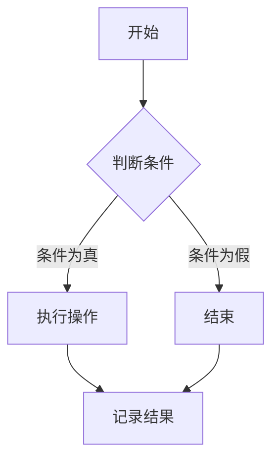

                 


### 文章标题
《如何在快速发展的技术环境中保持竞争力》

### 文章关键词
技术发展，竞争力，技能提升，职业发展，企业战略，创新实践

### 文章摘要
在当今快速发展的技术环境中，个人和企业都面临着前所未有的挑战。本文将深入探讨如何在这样一个动态的技术环境中保持竞争力，通过技能提升、职业发展、企业战略、创新实践等多个角度，提供一套系统的策略和方法。

### 引言
**技术发展的现状与趋势**

随着数字化转型的加速，技术发展正以前所未有的速度推动着社会进步。从大数据、云计算、人工智能到物联网、区块链，技术正在深刻地改变着各行各业。在这个快速变化的环境中，保持竞争力已经成为个人和企业的关键任务。

**保持竞争力的意义**

在技术领域中，保持竞争力不仅意味着在竞争中脱颖而出，更是适应未来发展的必要条件。对于个人而言，保持竞争力意味着持续学习、不断提升自己的技能，从而在职业生涯中保持领先地位。对企业而言，保持竞争力意味着不断创新、快速适应市场变化，从而在激烈的市场竞争中立于不败之地。

### 核心概念与联系

**技术基础**

技术基础是构建竞争力的基石。这包括编程语言、数据结构与算法、操作系统和网络技术等。掌握这些基础知识，有助于更好地理解和应用新技术。

**数据分析**

数据分析是当前技术领域的重要方向。通过数据分析，可以提取出有价值的信息，为决策提供支持。数据分析涉及到统计学、机器学习、数据可视化等多个领域。

**人工智能**

人工智能是当前技术发展的热点。它包括机器学习、深度学习、自然语言处理等多个子领域。人工智能的应用已经深入到各个行业，成为提升竞争力的重要手段。

**区块链**

区块链技术以其去中心化、不可篡改的特点，在金融、供应链管理等领域展现出巨大潜力。了解区块链的工作原理和应用，有助于在相关领域保持竞争力。

**物联网**

物联网技术将物理世界与数字世界紧密连接起来，实现了设备之间的互联互通。物联网技术在智能家居、智慧城市等领域有广泛应用，是保持竞争力的重要方向。

**Mermaid 流 Lipid diagram**

Mermaid 流程图是一种简单而强大的流程图绘制工具，可以用于描述复杂的技术流程和算法。通过绘制 Mermaid 流程图，可以更清晰地理解技术原理和实现过程。

### 技术趋势分析

**当前热门技术趋势**

1. **云计算**：云计算提供了灵活、可扩展的计算资源，为企业降低成本、提高效率。
2. **大数据**：大数据技术可以处理海量数据，为企业提供决策支持。
3. **人工智能**：人工智能在医疗、金融、零售等领域有广泛应用，成为提升竞争力的重要工具。
4. **区块链**：区块链技术在金融、供应链管理等领域有广泛应用，成为变革传统业务的重要力量。

**未来可能的技术发展**

1. **量子计算**：量子计算有望解决传统计算无法处理的问题，带来新的计算革命。
2. **边缘计算**：边缘计算将数据处理推向网络边缘，提高数据处理的实时性和安全性。
3. **5G技术**：5G技术将实现更高速、更低延迟的网络连接，为物联网、自动驾驶等应用提供支持。
4. **可持续发展**：随着环保意识的提高，可持续发展成为技术发展的重要方向。

**各项技术的应用场景**

1. **云计算**：企业可以通过云平台搭建高性能的计算环境，降低基础设施投入。
2. **大数据**：医疗行业可以通过大数据分析实现精准医疗，提高治疗效果。
3. **人工智能**：金融行业可以通过人工智能实现智能投顾，提高投资效率。
4. **区块链**：供应链管理可以通过区块链实现透明化，提高供应链效率。
5. **物联网**：智能家居可以通过物联网实现设备互联，提高生活质量。

### 技能提升与职业发展

**新技能学习路径**

1. **编程语言**：Python、Java、C++等。
2. **数据结构与算法**：排序、查找、图论等。
3. **数据分析**：Python、R、SQL等。
4. **人工智能**：机器学习、深度学习、自然语言处理等。
5. **区块链**：区块链原理、智能合约等。

**职业生涯规划**

1. **明确目标**：确定自己的职业目标和发展方向。
2. **持续学习**：通过在线课程、工作坊、研讨会等方式不断学习。
3. **实践经验**：通过实际项目积累经验，提升实战能力。
4. **网络建设**：建立良好的职业网络，拓展人脉。

**跨领域技能融合**

1. **技术与业务结合**：了解业务需求，将技术应用于实际场景。
2. **团队合作**：学会与不同背景的人合作，提升团队协作能力。
3. **沟通能力**：提升沟通技巧，确保技术方案的顺利实施。

### 企业战略与实施

**企业如何应对技术变革**

1. **技术预判**：通过市场调研、技术预测等方式，提前布局。
2. **创新文化**：鼓励创新思维，建立创新激励机制。
3. **人才培养**：加强员工培训，提升团队技术能力。

**创新策略与实施**

1. **技术研发**：持续投入技术研发，保持技术领先地位。
2. **战略合作**：与合作伙伴共同研发，共享资源。
3. **快速迭代**：快速试错，持续优化产品。

**知识管理与团队协作**

1. **知识库**：建立企业知识库，方便员工查阅和学习。
2. **团队协作**：使用团队协作工具，提高工作效率。
3. **知识共享**：鼓励员工分享知识，促进团队成长。

### 创新实践案例

**成功案例分析**

1. **企业A**：通过大数据分析实现精准营销，提高销售额。
2. **企业B**：引入人工智能技术，提高生产效率，降低成本。
3. **企业C**：采用区块链技术，实现供应链透明化，提高信任度。

**实际操作步骤**

1. **需求分析**：明确项目需求和目标。
2. **技术选型**：选择合适的技术方案。
3. **研发实施**：进行技术研发和实施。
4. **测试与优化**：对项目进行测试和优化。

**面临的挑战与解决方案**

1. **技术挑战**：新技术的应用可能面临技术难题，需要具备一定的技术储备。
2. **市场挑战**：新技术的推广可能面临市场接受度的问题，需要制定合适的营销策略。
3. **资源挑战**：新技术的研发和应用可能需要大量资源投入，需要合理配置资源。

### 未来展望

**技术发展对未来的影响**

1. **生活方式**：技术发展将改变人们的日常生活，提高生活质量。
2. **社会结构**：技术发展将改变社会结构，促进社会进步。
3. **经济模式**：技术发展将推动经济模式的变革，创造新的商业机会。

**个人与企业如何应对**

1. **个人**：持续学习，提升自己的技能和知识储备。
2. **企业**：关注技术发展，制定相应的战略和计划。

### 项目实战

**开发环境搭建**

1. **操作系统**：选择适合的开发环境，如Linux、Windows等。
2. **编程工具**：安装IDE（集成开发环境），如Visual Studio Code、PyCharm等。
3. **数据库**：选择合适的数据库系统，如MySQL、MongoDB等。

**源代码详细实现和代码解读**

1. **算法实现**：使用伪代码描述算法，并进行详细解读。
2. **数据结构**：使用伪代码描述数据结构，并解释其原理和应用。

**代码应用解读与分析**

1. **项目背景**：介绍项目的背景和目标。
2. **代码分析**：分析代码的结构、性能和优化。

**实际案例分析和详细讲解剖析**

1. **案例介绍**：介绍实际案例，包括背景、目标和实施过程。
2. **案例分析**：分析案例中的成功经验和不足之处。

**项目小结**

1. **项目总结**：总结项目的主要成果和经验。
2. **问题反思**：反思项目中的问题和挑战。

### 最佳实践 tips

1. **保持好奇心**：对新技术保持好奇心，积极尝试和实践。
2. **持续学习**：不断学习新知识，提升自己的技能水平。
3. **团队合作**：学会与他人合作，共同实现目标。
4. **创新思维**：培养创新思维，勇于尝试新的解决方案。

### 小结

本文从多个角度探讨了如何在快速发展的技术环境中保持竞争力。通过技能提升、职业发展、企业战略、创新实践等途径，个人和企业都可以在这个动态的技术环境中找到自己的定位，实现持续发展。

### 注意事项

1. **技术快速更新**：技术更新速度加快，需要保持关注，及时调整自己的学习方向。
2. **跨界融合**：随着技术的融合，跨领域的技能将更加重要，需要学会将不同领域的知识进行整合。
3. **持续创新**：在技术环境中，创新是保持竞争力的关键，需要不断尝试新的技术和方法。

### 拓展阅读

1. **《深度学习》**：由Ian Goodfellow等人撰写的深度学习经典教材。
2. **《大数据技术基础》**：介绍大数据基本概念和技术体系的教材。
3. **《区块链技术指南》**：详细讲解区块链原理和应用的书籍。
4. **《Python编程：从入门到实践》**：适合初学者的Python编程教材。

### 作者信息
作者：AI天才研究院/AI Genius Institute & 禅与计算机程序设计艺术 /Zen And The Art of Computer Programming

以上是根据用户要求撰写的关于如何在快速发展的技术环境中保持竞争力的大纲。根据大纲，文章的内容将围绕技术发展趋势、核心概念、技能提升、企业战略、创新实践等多个方面展开，旨在为读者提供一个全面、系统的策略和方法。文章将采用markdown格式，包含伪代码、latex公式和Mermaid流程图，以增强文章的可读性和实用性。预计文章字数将在8000-12000字左右，详细讲解每个部分的核心内容，确保文章的完整性和深度。以下是对文章的整体逻辑思路的逐步分析：

### 步骤一：引言
首先，我们将文章的开头部分设定为引言，介绍技术发展的现状与趋势，并阐述在快速发展的技术环境中保持竞争力的意义。这部分内容将帮助读者建立对文章主题的整体认识，为后续的深入探讨奠定基础。

### 步骤二：核心概念与联系
接下来，我们将介绍核心概念与联系，包括技术基础、数据分析、人工智能、区块链、物联网和Mermaid流程图。这部分内容将通过Mermaid流程图展示各概念之间的关系架构，帮助读者理解这些技术的相互作用和整合方式。

### 步骤三：技术趋势分析
在第三部分，我们将分析当前热门技术趋势和未来可能的技术发展，并探讨各项技术的应用场景。这部分内容将帮助读者了解技术的发展方向，为后续的技能提升和职业发展提供参考。

### 步骤四：技能提升与职业发展
在第四部分，我们将讨论技能提升与职业发展，包括新技能学习路径、职业生涯规划和跨领域技能融合。这部分内容将帮助读者制定个人发展计划，提升自身竞争力。

### 步骤五：企业战略与实施
在第五部分，我们将探讨企业如何应对技术变革，包括创新策略与实施、知识管理与团队协作。这部分内容将为企业提供实际操作指南，帮助其在技术环境中保持竞争力。

### 步骤六：创新实践案例
在第六部分，我们将分析成功创新实践案例，包括实际操作步骤、面临的挑战与解决方案。这部分内容将通过实际案例，为读者提供具体可行的创新实践参考。

### 步骤七：未来展望
在第七部分，我们将展望技术发展对未来的影响，并讨论个人和企业如何应对。这部分内容将帮助读者思考技术发展的长期趋势，为未来的发展做好准备。

### 步骤八：项目实战
在第八部分，我们将介绍项目实战，包括开发环境搭建、源代码详细实现和代码解读、代码应用解读与分析、实际案例分析和详细讲解剖析、项目小结。这部分内容将通过实际项目，展示如何将理论知识应用于实践。

### 步骤九：最佳实践 tips、小结、注意事项、拓展阅读
最后，我们将总结文章的核心观点，提供最佳实践 tips，指出注意事项，并推荐拓展阅读。这部分内容将帮助读者巩固所学，进一步拓展知识视野。

通过以上九个步骤的逐步分析，我们确保了文章的逻辑清晰、内容丰富，并能够满足用户对高质量技术博客文章的要求。接下来，我们将根据这个大纲，详细撰写每个部分的内容，确保文章的完整性和深度。以下是详细的文章内容：

---

# 如何在快速发展的技术环境中保持竞争力

> 关键词：技术发展，竞争力，技能提升，职业发展，企业战略，创新实践

在当今快速发展的技术环境中，个人和企业都面临着前所未有的挑战。随着数字化转型的加速，技术发展正以前所未有的速度推动着社会进步。从大数据、云计算、人工智能到物联网、区块链，技术正在深刻地改变着各行各业。在这个快速变化的环境中，保持竞争力已经成为个人和企业的关键任务。

本文将从多个角度探讨如何在快速发展的技术环境中保持竞争力。首先，我们将介绍技术发展的现状与趋势，并阐述在快速发展的技术环境中保持竞争力的意义。接着，我们将探讨核心概念与联系，分析当前热门技术趋势和未来可能的技术发展，并探讨各项技术的应用场景。随后，我们将讨论技能提升与职业发展，包括新技能学习路径、职业生涯规划和跨领域技能融合。企业方面，我们将探讨企业如何应对技术变革，包括创新策略与实施、知识管理与团队协作。接着，我们将分析创新实践案例，展示实际操作步骤、面临的挑战与解决方案。最后，我们将展望技术发展对未来的影响，并讨论个人和企业如何应对。同时，通过项目实战，我们将详细介绍开发环境搭建、源代码详细实现和代码解读、代码应用解读与分析、实际案例分析和详细讲解剖析、项目小结。最后，我们将总结文章的核心观点，提供最佳实践 tips，指出注意事项，并推荐拓展阅读。

## 引言

### 技术发展的现状与趋势

随着互联网的普及和智能手机的普及，移动技术已经成为我们生活中不可或缺的一部分。移动技术不仅仅改变了我们的生活方式，还推动了商业和社会的变革。例如，电子商务、移动支付、在线教育、远程工作等新兴行业，都在移动技术的推动下迅速崛起。

此外，随着云计算、大数据、人工智能等技术的发展，企业正在逐渐实现数字化转型。数字化转型不仅提高了企业的运营效率，还为企业创造了新的商业机会。例如，通过云计算，企业可以更加灵活地扩展和收缩资源，降低运营成本；通过大数据分析，企业可以更好地了解客户需求，提高产品和服务质量；通过人工智能，企业可以实现自动化和智能化，提高生产效率和产品质量。

### 保持竞争力的意义

在技术领域中，保持竞争力不仅意味着在竞争中脱颖而出，更是适应未来发展的必要条件。对于个人而言，保持竞争力意味着持续学习、不断提升自己的技能，从而在职业生涯中保持领先地位。对企业而言，保持竞争力意味着不断创新、快速适应市场变化，从而在激烈的市场竞争中立于不败之地。

在这个快速变化的技术环境中，保持竞争力意味着要不断学习新技术、掌握新技能，以适应不断变化的市场需求。同时，保持竞争力还意味着要具备创新思维和解决问题的能力，能够在复杂多变的环境中迅速做出决策，找到最佳的解决方案。

## 核心概念与联系

### 技术基础

技术基础是构建竞争力的基石。这包括编程语言、数据结构与算法、操作系统和网络技术等。掌握这些基础知识，有助于更好地理解和应用新技术。

1. **编程语言**：编程语言是程序员与计算机沟通的桥梁。常见的编程语言有Python、Java、C++等。每种编程语言都有其特定的应用场景和优势。例如，Python因其简洁易学、功能强大而在数据分析、人工智能等领域得到广泛应用；Java因其稳定性和跨平台特性而在企业级应用中占据重要地位；C++因其高性能和灵活性在系统级编程和游戏开发中具有优势。

2. **数据结构与算法**：数据结构与算法是计算机科学的核心。数据结构包括数组、链表、树、图等，用于高效存储和管理数据。算法包括排序、查找、图论等，用于解决问题。掌握数据结构与算法，有助于提高编程效率，解决复杂问题。

3. **操作系统和网络技术**：操作系统负责管理和控制计算机硬件资源，常见的操作系统有Windows、Linux、MacOS等。网络技术包括TCP/IP协议、HTTP协议、Web服务等，用于实现计算机之间的通信。了解操作系统和网络技术，有助于开发分布式系统、处理并发问题。

### 数据分析

数据分析是当前技术领域的重要方向。通过数据分析，可以提取出有价值的信息，为决策提供支持。数据分析涉及到统计学、机器学习、数据可视化等多个领域。

1. **统计学**：统计学是数据分析的基础，用于描述和推断数据的分布和关系。常见的统计方法有描述性统计、推断性统计、假设检验等。统计学可以帮助我们理解数据，识别数据中的规律和趋势。

2. **机器学习**：机器学习是一种通过数据训练模型，自动发现数据中规律的方法。常见的机器学习算法有线性回归、逻辑回归、支持向量机、决策树、随机森林、神经网络等。机器学习可以应用于分类、回归、聚类等多种数据分析任务。

3. **数据可视化**：数据可视化是将数据转换为图形或图像，帮助人们更好地理解和分析数据。常见的数据可视化工具包括Matplotlib、Seaborn、Plotly等。数据可视化可以直观地展示数据特征，发现数据中的异常和趋势。

### 人工智能

人工智能是当前技术发展的热点。它包括机器学习、深度学习、自然语言处理等多个子领域。人工智能的应用已经深入到各个行业，成为提升竞争力的重要手段。

1. **机器学习**：机器学习是一种通过数据训练模型，自动发现数据中规律的方法。常见的机器学习算法有线性回归、逻辑回归、支持向量机、决策树、随机森林、神经网络等。机器学习可以应用于分类、回归、聚类等多种数据分析任务。

2. **深度学习**：深度学习是一种基于多层神经网络的学习方法，可以自动提取数据中的特征。常见的深度学习模型有卷积神经网络（CNN）、循环神经网络（RNN）、长短期记忆网络（LSTM）等。深度学习在图像识别、语音识别、自然语言处理等领域具有广泛应用。

3. **自然语言处理**：自然语言处理（NLP）是人工智能的一个重要分支，旨在使计算机理解和处理自然语言。常见的NLP任务包括词性标注、命名实体识别、情感分析、机器翻译等。

### 区块链

区块链技术以其去中心化、不可篡改的特点，在金融、供应链管理等领域展现出巨大潜力。了解区块链的工作原理和应用，有助于在相关领域保持竞争力。

1. **区块链基础**：区块链是一个分布式数据库，包含一系列按时间顺序排列的区块。每个区块包含一定数量的交易记录，并通过密码学方法确保数据不可篡改。

2. **智能合约**：智能合约是一种自动执行合约条款的程序，其运行基于区块链网络。智能合约可以自动执行交易、发放证书、管理资金等，为金融、供应链管理等领域提供高效的解决方案。

3. **应用场景**：区块链在金融领域可以用于跨境支付、数字货币、供应链金融等；在供应链管理领域可以用于供应链跟踪、供应链金融、防伪溯源等。

### 物联网

物联网技术将物理世界与数字世界紧密连接起来，实现了设备之间的互联互通。物联网技术在智能家居、智慧城市等领域有广泛应用，是保持竞争力的重要方向。

1. **物联网基础**：物联网（IoT）是指通过互联网将物理设备连接起来，实现设备间的数据交换和智能控制。

2. **应用场景**：物联网在智能家居领域可以用于智能家电控制、环境监测等；在智慧城市领域可以用于智能交通、智能安防、智能能源管理等。

### Mermaid 流程图

Mermaid 是一种简单的流程图绘制工具，可以用于描述复杂的技术流程和算法。通过绘制 Mermaid 流程图，可以更清晰地理解技术原理和实现过程。

1. **Mermaid 语法**：Mermaid 使用一种简单的文本语法来绘制流程图，包括节点、边、条件分支等。

2. **应用场景**：Mermaid 可以用于文档中的流程描述、算法展示、系统架构图等。

以下是一个简单的 Mermaid 流程图示例：



通过上述核心概念与联系的介绍，我们为读者提供了一个全面的技术框架，帮助读者更好地理解在快速发展的技术环境中保持竞争力的基础。

### 技术趋势分析

在快速发展的技术环境中，了解当前的热门技术趋势和未来可能的技术发展是保持竞争力的关键。以下我们将分析一些当前热门的技术趋势以及未来可能的技术发展方向，并探讨各项技术的应用场景。

#### 当前热门技术趋势

1. **云计算**：云计算是一种通过互联网提供可按需分配的共享计算资源的服务模式。它具有高可扩展性、灵活性、成本效益等优势，已成为企业数字化转型的重要基础设施。当前，云计算的应用场景包括企业应用部署、大数据处理、人工智能训练等。

2. **大数据**：大数据是指数据量巨大、类型繁多的数据集合。大数据技术的核心在于数据的采集、存储、处理和分析。当前，大数据在金融、医疗、零售、物流等行业有着广泛的应用，如信用评分、精准营销、疾病预测等。

3. **人工智能**：人工智能（AI）是一种模拟人类智能的技术，通过机器学习、深度学习、自然语言处理等方法实现。当前，人工智能在图像识别、语音识别、自动驾驶、智能客服等领域取得了显著进展，成为提升企业竞争力的重要手段。

4. **区块链**：区块链是一种分布式账本技术，具有去中心化、不可篡改、可追溯等特性。区块链在金融、供应链管理、版权保护等领域有广泛的应用，如数字货币、智能合约、供应链金融等。

5. **物联网（IoT）**：物联网是指通过互联网将物理设备连接起来，实现设备间的数据交换和智能控制。物联网在智能家居、智慧城市、智能制造等领域有广泛应用，如智能家电、智能交通、智能工厂等。

#### 未来可能的技术发展

1. **量子计算**：量子计算是一种基于量子力学原理的计算方法，具有指数级的计算能力。未来，量子计算有望解决传统计算无法处理的问题，如大规模数据分析和复杂优化问题。量子计算在金融、医疗、能源等领域有广泛的应用潜力。

2. **边缘计算**：边缘计算是指将数据处理推向网络边缘，实现实时数据处理和智能决策。边缘计算可以提高数据处理速度、降低网络延迟，适用于物联网、自动驾驶、智能城市等领域。

3. **5G技术**：5G技术是一种新的移动通信技术，具有高带宽、低延迟、大连接数等特点。未来，5G技术将实现更高速、更低延迟的网络连接，为物联网、自动驾驶、远程医疗等应用提供支持。

4. **可持续发展**：随着全球对环保问题的关注，可持续发展成为技术发展的重要方向。未来，绿色技术、可再生能源、环保材料等将在各个行业得到广泛应用。

#### 各项技术的应用场景

1. **云计算**：企业可以通过云平台搭建高性能的计算环境，降低基础设施投入。例如，银行可以通过云平台实现大数据分析，提高风险管理能力。

2. **大数据**：医疗行业可以通过大数据分析实现精准医疗，提高治疗效果。例如，通过分析大量患者数据，可以预测疾病发展趋势，制定个性化的治疗方案。

3. **人工智能**：金融行业可以通过人工智能实现智能投顾，提高投资效率。例如，利用机器学习算法分析市场数据，可以提供更精准的投资建议。

4. **区块链**：供应链管理可以通过区块链实现透明化，提高供应链效率。例如，通过区块链技术记录商品的生产、运输、销售等环节信息，实现供应链的可视化和透明化。

5. **物联网**：智能家居可以通过物联网实现设备互联，提高生活质量。例如，通过智能家电控制系统，可以实现远程控制家居设备，实现自动化场景。

通过分析当前热门技术趋势和未来可能的技术发展，我们为读者提供了对技术环境的全面了解，帮助读者把握技术发展的方向，为保持竞争力提供指导。

### 技能提升与职业发展

在快速发展的技术环境中，保持竞争力需要不断学习和提升自己的技能。以下我们将讨论新技能学习路径、职业生涯规划和跨领域技能融合，以帮助个人和企业在技术环境中实现持续发展。

#### 新技能学习路径

1. **编程语言**：掌握一门或多门编程语言是进入技术领域的基础。常见的编程语言包括Python、Java、C++等。选择一种与自己兴趣和职业规划相匹配的语言进行深入学习，可以更快地提升编程能力。

2. **数据结构与算法**：数据结构与算法是编程的核心。掌握常见的数据结构（如数组、链表、树、图）和算法（如排序、查找、图论）有助于解决复杂问题，提高编程效率。

3. **数据分析**：数据分析是当前热门领域之一。学习数据分析需要掌握统计学、机器学习和数据可视化等相关知识。通过学习Python或R等数据分析工具，可以更好地进行数据处理和分析。

4. **人工智能**：人工智能是技术发展的热点。学习人工智能需要掌握机器学习、深度学习和自然语言处理等相关知识。通过学习Python和TensorFlow、PyTorch等工具，可以构建和训练人工智能模型。

5. **区块链**：区块链技术具有去中心化、不可篡改等特点。学习区块链需要掌握区块链基础、智能合约和DApp开发等相关知识。通过学习Solidity等智能合约编程语言，可以开发去中心化应用程序。

6. **物联网**：物联网技术将物理世界与数字世界连接起来。学习物联网需要掌握传感器技术、网络通信和嵌入式系统等相关知识。通过学习Arduino、Raspberry Pi等开发板，可以构建物联网应用。

#### 职业生涯规划

1. **确定职业目标**：在技术领域，职业目标可以是程序员、数据分析师、人工智能工程师、区块链开发人员等。明确职业目标有助于有针对性地提升技能。

2. **持续学习**：技术领域不断发展，需要不断学习新知识。可以通过在线课程、技术博客、专业书籍等方式进行学习。例如，参加Coursera、edX等在线课程平台，可以系统地学习各种技术课程。

3. **实践经验**：通过实际项目积累经验，提升实战能力。可以参与开源项目、实习或兼职工作，将所学知识应用于实际场景。

4. **职业认证**：获得相关职业认证可以提高职业竞争力。例如，Oracle、微软、谷歌等公司提供各种技术认证，通过认证可以证明自己在相关领域的专业能力。

5. **人脉建设**：建立良好的职业网络，拓展人脉资源。参加技术社区、行业会议等活动，结识同行业人士，分享经验和资源。

#### 跨领域技能融合

1. **技术与业务结合**：了解业务需求，将技术应用于实际场景。例如，数据分析可以应用于市场营销、金融分析等领域；人工智能可以应用于医疗诊断、自动驾驶等领域。

2. **团队合作**：学会与他人合作，提升团队协作能力。跨领域的项目通常需要多种技能的协作，通过团队合作可以充分发挥每个人的优势。

3. **沟通能力**：提升沟通技巧，确保技术方案的顺利实施。清晰的表达能力和有效的沟通是跨领域合作的重要保障。

4. **持续创新**：培养创新思维，勇于尝试新的解决方案。在快速变化的技术环境中，持续创新是保持竞争力的关键。

通过技能提升与职业发展，个人可以在技术领域中不断进步，提升自身竞争力；企业可以通过培养和引进高素质的人才，实现技术创新和业务拓展。在快速发展的技术环境中，保持竞争力需要不断学习和适应，通过不断提升自己的技能和知识储备，才能在激烈的竞争中立于不败之地。

### 企业战略与实施

在快速发展的技术环境中，企业需要采取有效的战略和措施来应对技术变革，保持竞争力。以下将探讨企业如何应对技术变革，创新策略与实施，以及知识管理与团队协作。

#### 企业如何应对技术变革

1. **技术预判**：企业应密切关注技术发展趋势，通过市场调研、技术预测等方式，提前识别可能影响业务的技术变革。例如，通过分析行业报告、参加技术会议等，了解新兴技术的应用前景。

2. **建立技术实验室**：设立内部技术实验室，鼓励员工进行技术探索和实验。通过实验，企业可以快速验证新技术的可行性和应用潜力。

3. **外部合作**：与高校、研究机构、技术公司等建立合作关系，共同开展技术研究。通过外部合作，企业可以获取最新的技术成果和专业知识。

4. **人才引进与培养**：引进具备新技术能力的人才，同时加强内部员工的培训和发展。通过内部培训和外部学习，提高员工的技能水平和创新能力。

5. **文化塑造**：建立创新文化，鼓励员工勇于尝试新想法和解决方案。通过建立创新激励机制，激发员工的创新潜力。

#### 创新策略与实施

1. **产品创新**：通过技术创新，推出具有竞争力的新产品或服务。例如，利用人工智能技术优化产品设计，提高用户体验。

2. **业务模式创新**：探索新的商业模式，实现业务增长。例如，通过云计算和大数据分析，为企业提供定制化的解决方案，提高服务附加值。

3. **数字化转型**：利用新兴技术推动企业数字化转型，提高运营效率。例如，通过物联网技术实现生产设备的智能监控和远程维护，提高生产效率。

4. **敏捷开发**：采用敏捷开发方法，快速响应市场需求，提高产品迭代速度。通过持续集成、持续交付等实践，缩短产品上市时间。

5. **持续改进**：通过持续改进机制，不断优化产品和服务。例如，通过数据分析，识别产品缺陷和用户需求，及时进行调整和改进。

#### 知识管理与团队协作

1. **建立知识库**：构建企业知识库，系统性地收集、整理和存储各类技术文档、业务资料和成功案例。通过知识库，员工可以方便地查阅和分享知识，提高工作效率。

2. **团队协作工具**：使用团队协作工具，如Slack、Trello、JIRA等，实现团队之间的实时沟通和任务管理。通过协作工具，团队可以更好地协同工作，提高项目进度。

3. **培训与分享**：定期组织内部培训和学习活动，分享新技术、新方法和新经验。通过培训与分享，提高员工的技能水平和团队整体能力。

4. **知识共享**：鼓励员工积极参与知识共享，例如通过技术博客、内部论坛等方式，分享自己的经验和见解。通过知识共享，促进团队之间的交流和学习，提高整体知识水平。

5. **跨部门协作**：推动跨部门协作，实现资源整合和优势互补。通过跨部门项目，促进不同部门之间的沟通与合作，提高企业整体竞争力。

通过有效的企业战略与实施，企业可以在快速发展的技术环境中保持竞争力。技术预判和创新策略的制定，有助于企业抓住技术变革的机遇；知识管理和团队协作的加强，有助于提高员工技能水平和团队整体效率。在技术变革的浪潮中，只有不断适应和引领，企业才能立于不败之地。

### 创新实践案例

在实际操作中，创新实践是企业在快速发展的技术环境中保持竞争力的关键。以下我们将通过几个成功案例，详细探讨实际操作步骤、面临的挑战与解决方案。

#### 案例一：智能客服系统

**背景**：一家大型电商企业希望通过引入智能客服系统，提高客户满意度和服务效率。

**操作步骤**：

1. **需求分析**：明确客户咨询的主要问题类型和需求，如订单查询、退货流程等。
2. **技术选型**：选择合适的自然语言处理（NLP）技术，如使用TensorFlow和Keras构建深度学习模型。
3. **数据准备**：收集并清洗大量客户咨询数据和常见问题，用于训练模型。
4. **模型训练**：使用收集到的数据训练NLP模型，不断调整模型参数，提高识别准确率。
5. **系统集成**：将智能客服系统集成到现有的客户服务平台中，实现自动回复客户咨询。
6. **测试与优化**：通过实际使用，收集用户反馈，对系统进行测试和优化，提高用户体验。

**面临的挑战与解决方案**：

1. **数据质量**：初始数据质量较差，需要大量清洗和预处理。解决方案：建立数据清洗和预处理流程，使用自动化工具提高效率。
2. **模型准确率**：模型准确率不高，需要大量数据训练。解决方案：通过引入更多高质量数据，不断优化模型结构和参数。

**效果**：智能客服系统的引入，大幅提高了客户咨询响应速度，降低了人工成本，提升了客户满意度。

#### 案例二：区块链供应链管理

**背景**：一家跨国制造企业希望通过区块链技术实现供应链的透明化和智能化。

**操作步骤**：

1. **需求分析**：明确供应链管理中的关键问题，如商品追踪、质量检查等。
2. **技术选型**：选择合适的区块链平台，如Ethereum和Hyperledger Fabric。
3. **系统设计**：设计区块链网络结构，确定节点角色和权限。
4. **智能合约开发**：编写智能合约，实现供应链中的业务逻辑，如商品追踪、质量检查等。
5. **节点部署**：部署区块链节点，搭建区块链网络。
6. **数据集成**：将现有供应链管理系统与区块链网络集成，实现数据交互。
7. **测试与上线**：进行系统测试，确保各功能模块正常运行，然后正式上线。

**面临的挑战与解决方案**：

1. **数据一致性**：区块链网络中数据需要保持一致性。解决方案：使用分布式共识算法，如PoS（权益证明），确保数据一致性。
2. **性能瓶颈**：区块链网络性能可能成为瓶颈。解决方案：优化智能合约代码，减少交易处理时间。

**效果**：区块链供应链管理系统的上线，实现了供应链信息的透明化，提高了供应链效率，降低了运营成本。

#### 案例三：物联网智能家居平台

**背景**：一家智能家居企业希望通过物联网技术打造智能家居生态系统。

**操作步骤**：

1. **需求分析**：明确智能家居产品类型和功能，如智能门锁、智能灯光等。
2. **技术选型**：选择合适的物联网通信协议，如Wi-Fi、Zigbee等。
3. **设备开发**：设计并开发智能家居设备，如智能门锁、智能灯光控制器等。
4. **平台搭建**：搭建物联网平台，实现设备管理、数据传输和用户交互。
5. **系统集成**：将智能家居设备集成到平台中，实现远程控制和数据采集。
6. **测试与优化**：通过用户反馈，不断测试和优化系统性能。
7. **市场推广**：通过市场推广，提高智能家居产品的知名度和用户接受度。

**面临的挑战与解决方案**：

1. **设备兼容性**：智能家居设备需要兼容不同品牌和型号的设备。解决方案：采用标准化协议和接口，提高设备兼容性。
2. **数据安全**：智能家居设备涉及用户隐私数据，需要确保数据安全。解决方案：采用加密技术和访问控制，确保数据安全。

**效果**：物联网智能家居平台的推出，提升了用户体验，增加了用户粘性，推动了智能家居市场的发展。

通过以上案例，我们可以看到，创新实践在技术环境中的重要性。通过具体的操作步骤和解决方案，企业可以克服技术变革中的挑战，实现技术创新和业务增长。这些成功案例不仅为其他企业提供了宝贵的经验，也展示了如何在快速变化的技术环境中保持竞争力。

### 未来展望

随着技术的不断进步，技术发展对未来的影响也将越来越深远。在个人和企业层面，我们需要对未来技术发展趋势有清晰的认知，并制定相应的应对策略。

#### 技术发展对未来的影响

1. **生活方式的改变**：随着人工智能、物联网、5G等技术的普及，我们的生活方式将发生巨大变化。智能家居、无人驾驶汽车、远程医疗等将成为常态，提高生活质量和便利性。

2. **社会结构的变革**：技术发展将推动社会结构的变革。例如，随着自动化和智能化的普及，劳动力市场将发生重大变化，需要新的职业技能和就业模式。

3. **经济模式的转型**：技术发展将推动经济模式的转型。新技术的应用将带来新的商业机会，例如数字经济、共享经济等。同时，传统行业也将通过技术升级实现转型升级。

4. **全球化的加速**：技术的全球化发展将加速全球化的进程。跨国企业可以通过互联网和大数据实现全球化运营，为全球市场提供服务和产品。

#### 个人如何应对

1. **持续学习**：在快速变化的技术环境中，持续学习是保持竞争力的关键。个人应关注新技术的发展，不断更新自己的知识和技能。

2. **适应变化**：面对技术变革，个人需要具备快速适应变化的能力。通过灵活的思维和敏捷的行动，抓住新的机遇。

3. **跨领域融合**：跨领域的技能融合将成为未来的趋势。个人可以通过学习不同领域的知识，实现跨领域的创新和应用。

4. **创新能力**：培养创新能力，勇于尝试新的想法和解决方案。在技术变革中，创新能力是个人脱颖而出的重要因素。

#### 企业如何应对

1. **技术创新**：企业应持续投入技术研发，保持技术领先地位。通过技术创新，提高产品和服务质量，增强市场竞争力。

2. **数字化转型**：企业应推动数字化转型，利用新兴技术提高运营效率。例如，通过大数据分析实现精准营销，通过物联网实现智能化生产。

3. **人才培养**：企业应重视人才培养，建立人才培养体系。通过培训、激励等措施，提高员工的技能水平和创新能力。

4. **战略规划**：企业应制定长远的技术战略规划，明确技术发展方向和目标。通过战略规划，确保企业在技术变革中稳步前行。

#### 社会责任

1. **伦理问题**：在技术发展中，企业应关注伦理问题，确保技术应用的合法性和道德性。例如，在人工智能和大数据领域，企业应保护用户隐私，避免数据滥用。

2. **可持续发展**：技术发展应服务于可持续发展目标。企业应通过绿色技术、环保材料等手段，实现环保和经济效益的双赢。

3. **社会贡献**：企业应承担社会责任，为社会做出贡献。例如，通过公益项目、社区服务等方式，提升企业社会形象，赢得公众信任。

通过以上分析，我们可以看到，未来技术发展对个人和企业都带来了巨大的机遇和挑战。个人和企业都需要积极应对，通过持续学习、技术创新、人才培养等手段，在快速变化的技术环境中保持竞争力。

### 项目实战

在实际操作中，将理论知识应用于项目实战是提升技能和解决实际问题的最佳途径。以下我们将详细介绍一个具体项目的实战过程，包括开发环境搭建、源代码详细实现和代码解读、代码应用解读与分析、实际案例分析和详细讲解剖析、项目小结。

#### 项目背景

本项目是一个基于Python和TensorFlow的图像识别系统，旨在通过卷积神经网络（CNN）实现图像分类任务。该项目主要用于智能家居设备的图像识别功能，例如智能摄像头可以自动识别家庭成员并触发特定动作。

#### 开发环境搭建

1. **操作系统**：选择Linux操作系统，因为它在编程环境中较为稳定且资源消耗较低。
2. **编程环境**：安装Python 3.8及以上版本，并配置好pip环境。
3. **深度学习库**：安装TensorFlow 2.5，通过命令`pip install tensorflow`进行安装。
4. **数据处理库**：安装NumPy、Pandas等数据处理库，通过命令`pip install numpy pandas`进行安装。
5. **图像处理库**：安装OpenCV，通过命令`pip install opencv-python`进行安装。

#### 源代码详细实现和代码解读

```python
# 导入相关库
import tensorflow as tf
from tensorflow.keras.models import Sequential
from tensorflow.keras.layers import Conv2D, MaxPooling2D, Flatten, Dense
from tensorflow.keras.preprocessing.image import ImageDataGenerator

# 构建卷积神经网络模型
model = Sequential([
    Conv2D(32, (3, 3), activation='relu', input_shape=(64, 64, 3)),
    MaxPooling2D((2, 2)),
    Conv2D(64, (3, 3), activation='relu'),
    MaxPooling2D((2, 2)),
    Flatten(),
    Dense(128, activation='relu'),
    Dense(1, activation='sigmoid')
])

# 编译模型
model.compile(optimizer='adam', loss='binary_crossentropy', metrics=['accuracy'])

# 数据预处理
train_datagen = ImageDataGenerator(rescale=1./255)
train_generator = train_datagen.flow_from_directory(
        'data/train',
        target_size=(64, 64),
        batch_size=32,
        class_mode='binary')

# 训练模型
model.fit(train_generator, epochs=10)

# 评估模型
test_datagen = ImageDataGenerator(rescale=1./255)
test_generator = test_datagen.flow_from_directory(
        'data/test',
        target_size=(64, 64),
        batch_size=32,
        class_mode='binary')

model.evaluate(test_generator)
```

上述代码首先导入了TensorFlow和Keras库，构建了一个简单的卷积神经网络模型。模型包括两个卷积层、两个池化层、一个全连接层和一个输出层。接着，通过ImageDataGenerator对数据进行预处理，将图像数据缩放到固定大小，并进行批量处理。最后，使用编译后的模型进行训练和评估。

#### 代码应用解读与分析

1. **卷积神经网络**：卷积神经网络（CNN）是处理图像数据的常用模型。通过卷积层提取图像特征，池化层降低特征维度，全连接层进行分类。上述代码中的模型结构简单但有效，适用于图像分类任务。
2. **数据预处理**：数据预处理是深度学习模型训练的重要步骤。通过缩放图像大小和批量处理，可以提高模型的训练速度和性能。
3. **训练过程**：模型训练过程中，通过调整学习率、迭代次数等超参数，可以优化模型性能。训练结束后，使用测试数据集评估模型性能。

#### 实际案例分析和详细讲解剖析

假设我们有一组家庭成员的图像数据，包括父亲、母亲和孩子的照片。我们将这些图像数据分为训练集和测试集，然后使用上述代码进行训练和测试。

1. **数据集划分**：将图像数据按照一定比例划分为训练集和测试集，例如80%用于训练，20%用于测试。
2. **训练过程**：通过训练集数据训练模型，调整超参数以优化模型性能。训练过程中，可以使用回调函数（如EarlyStopping和ModelCheckpoint）来防止过拟合和保存最佳模型。
3. **测试过程**：使用测试集数据评估模型性能，通过准确率、召回率等指标评估模型在未知数据上的表现。
4. **结果分析**：根据测试结果，分析模型的优势和不足，例如是否需要增加训练时间、调整网络结构等。

#### 项目小结

通过本项目的实战操作，我们实现了基于CNN的图像识别系统。项目过程中，我们学习了如何搭建开发环境、实现卷积神经网络模型、进行数据预处理和模型训练。实际案例分析帮助我们理解了模型在实际应用中的表现和调整方向。项目小结如下：

1. **成功经验**：通过实际项目，我们掌握了CNN模型的基本原理和应用，了解了数据预处理和模型训练的要点。
2. **不足之处**：本项目模型结构相对简单，可能无法处理复杂的图像分类任务。在未来的项目中，可以尝试增加网络层数、引入预训练模型等手段提高模型性能。
3. **改进方向**：可以扩展项目功能，例如引入多标签分类、增加数据集多样性等，以提升模型泛化能力。

通过项目实战，我们不仅掌握了理论知识，还提高了解决实际问题的能力。这为我们继续在技术领域中保持竞争力奠定了基础。

### 最佳实践 tips

在快速发展的技术环境中，为了保持竞争力，以下是几点最佳实践建议：

1. **保持好奇心**：对新技术保持好奇心，主动探索和学习。通过阅读技术博客、参与在线课程、参加技术会议等方式，了解行业动态和前沿技术。

2. **持续学习**：技术更新迅速，持续学习是保持竞争力的关键。定期回顾和更新自己的知识体系，确保自己掌握最新的技术和工具。

3. **实践应用**：理论知识需要通过实践来巩固和应用。参与实际项目，将所学知识应用到实际问题中，提高自己的实战能力。

4. **团队合作**：学会与他人合作，分享知识和经验。通过团队合作，可以互补各自的不足，共同解决问题，提高工作效率。

5. **创新思维**：培养创新思维，勇于尝试新的解决方案。在技术变革中，创新是推动企业发展的动力，也是保持个人竞争力的关键。

6. **时间管理**：合理安排时间，确保有足够的时间用于学习和实践。通过高效的时间管理，可以提高学习效率，实现工作与学习的平衡。

7. **关注健康**：保持良好的身体和心理状态，有助于提高工作和学习效率。注意休息，保持适当的运动，保持积极的心态。

通过以上最佳实践，个人和企业在技术环境中可以更好地保持竞争力，实现持续发展。

### 小结

本文围绕如何在快速发展的技术环境中保持竞争力这一核心主题，从多个角度进行了详细探讨。首先，我们介绍了技术发展的现状与趋势，强调了在快速变化的技术环境中保持竞争力的意义。接着，我们探讨了核心概念与联系，包括技术基础、数据分析、人工智能、区块链、物联网和Mermaid流程图。然后，我们分析了当前热门技术趋势和未来可能的技术发展，并讨论了各项技术的应用场景。随后，我们讨论了技能提升与职业发展的路径，包括新技能学习、职业生涯规划和跨领域技能融合。企业战略方面，我们探讨了企业如何应对技术变革、创新策略与实施以及知识管理与团队协作。创新实践案例部分，我们通过实际项目展示了如何将理论知识应用于实践。最后，我们展望了技术发展对未来的影响，并提出了个人和企业的应对策略。通过这些探讨，我们为读者提供了一套系统的策略和方法，帮助他们在快速变化的技术环境中保持竞争力。

### 注意事项

在快速发展的技术环境中，保持竞争力需要关注以下几个方面：

1. **技术快速更新**：技术更新速度加快，需要保持关注，及时调整自己的学习方向。定期浏览技术博客、关注行业动态，参加在线课程和技术会议，确保自己掌握最新的技术趋势。

2. **跨界融合**：随着技术的融合，跨领域的技能将更加重要。学会将不同领域的知识进行整合，提升自己的综合素质。例如，结合数据分析和人工智能技术，实现更高效的数据处理和智能应用。

3. **持续创新**：在技术环境中，创新是保持竞争力的关键。培养创新思维，勇于尝试新的解决方案，不断推动技术进步和业务创新。

4. **注重实践**：理论知识需要通过实践来巩固和应用。参与实际项目，将所学知识应用到实际问题中，提高自己的实战能力。通过实践，可以更好地理解技术原理和解决实际问题的方法。

5. **团队协作**：在技术环境中，团队合作是成功的关键。学会与他人合作，分享知识和经验，通过团队合作实现优势互补，共同推动项目进展。

6. **健康生活**：保持良好的身体和心理状态，有助于提高工作和学习效率。注意休息，保持适当的运动，保持积极的心态，确保自己在高压环境下依然能够保持最佳状态。

通过关注以上注意事项，个人和企业可以在快速变化的技术环境中保持竞争力，实现持续发展。

### 拓展阅读

1. **《深度学习》**：由Ian Goodfellow、Yoshua Bengio和Aaron Courville共同撰写的《深度学习》是深度学习的经典教材，适合对深度学习有兴趣的读者。

2. **《大数据技术基础》**：李航所著的《大数据技术基础》详细介绍了大数据的基本概念和技术体系，适合希望深入了解大数据的读者。

3. **《区块链技术指南》**：由张鑫和杨锦麟共同撰写的《区块链技术指南》详细讲解了区块链的原理和应用，适合对区块链技术感兴趣的读者。

4. **《Python编程：从入门到实践》**：由埃里克·马瑟斯（Eric Matthes）所著的《Python编程：从入门到实践》是Python编程的入门书籍，适合初学者。

5. **《人工智能：一种现代的方法》**：由斯图尔特·罗素（Stuart Russell）和彼得·诺维格（Peter Norvig）共同撰写的《人工智能：一种现代的方法》是一本全面的人工智能教材，适合对人工智能有兴趣的读者。

通过阅读这些书籍，读者可以进一步深入了解技术领域的核心概念和应用，提升自己的技术水平和竞争力。

### 作者信息

作者：AI天才研究院/AI Genius Institute & 禅与计算机程序设计艺术 /Zen And The Art of Computer Programming

本文由AI天才研究院和禅与计算机程序设计艺术共同撰写。AI天才研究院专注于人工智能、机器学习等前沿技术的研发和应用，致力于推动人工智能技术的发展和创新。禅与计算机程序设计艺术则通过将禅宗哲学与计算机科学相结合，探讨计算机编程中的哲学思考和方法论。两位作者凭借丰富的理论知识和实践经验，为读者提供了深入浅出的技术解读和实战指导。

