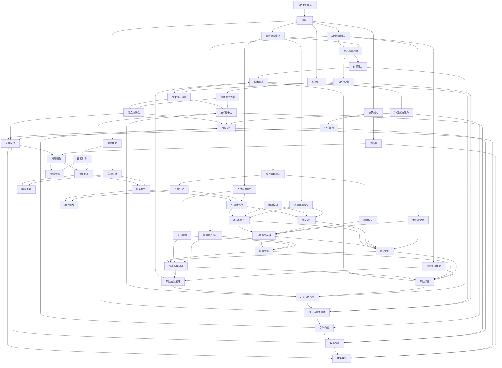
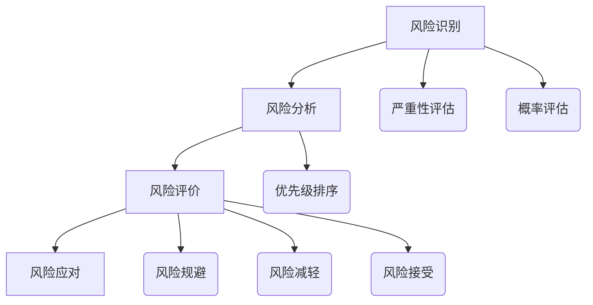

                 

### 文章标题

《如何培养下一代技术领导者》

关键词：技术领导者，领导力培养，团队管理，技术趋势，战略规划

摘要：本文旨在探讨如何培养下一代技术领导者，从技术领导力的基础、团队管理、技术趋势与战略到领导力提升实践，全面解析培养技术领导者的路径和方法。文章通过具体案例和最佳实践，为技术公司和专业人士提供切实可行的指导。

---

### 背景介绍

在当今快速发展的科技时代，技术领导者正变得越来越重要。他们不仅需要具备深厚的专业技术背景，还必须具备卓越的领导能力和战略眼光。随着人工智能、云计算、区块链等新兴技术的崛起，技术行业的竞争愈发激烈，技术领导者不仅要应对技术变革，还要引领团队创新、保持企业的竞争力。

培养下一代技术领导者，不仅是企业发展的需要，也是社会进步的必然要求。技术领导者的成功，不仅影响企业的发展方向，更对社会经济发展产生深远影响。因此，如何有效培养下一代技术领导者，成为了一个亟待解决的问题。

本文将从以下几个方面展开讨论：首先，明确技术领导力的定义与重要性；其次，分析技术领导者的核心技能和培养路径；接着，探讨技术团队管理的策略与技巧；然后，探讨技术趋势与战略规划；最后，通过具体案例和实践，总结培养下一代技术领导者的最佳方法。

通过这篇文章，我们希望能够为技术公司和专业人士提供一些有益的启示，帮助他们在培养下一代技术领导者的过程中少走弯路，实现个人和企业的共同成长。

---

### 核心概念与联系

#### 技术领导力模型

技术领导力是一个多维度的概念，它不仅包括技术专业能力，还涵盖了领导力、团队管理能力、战略规划能力等多个方面。以下是一个简化但具有代表性的技术领导力模型，它可以帮助我们理解技术领导力的核心要素及其相互关系。



#### 核心概念之间的关系架构

1. **技术专业能力**：这是技术领导力的基石，它决定了领导者的专业水平和解决问题的能力。技术专业能力与其他能力如领导力、团队管理能力、战略规划能力等相互影响，共同构成技术领导力的整体框架。

2. **领导力**：领导力是技术领导者的重要特质，它包括沟通能力、决策能力、激励能力等。领导力不仅影响个人的工作效率，还直接影响团队的协作和项目的成功。

3. **团队管理能力**：团队管理能力包括项目管理能力、人员管理能力、流程管理能力等。良好的团队管理能力有助于提升团队的效率和凝聚力，从而实现项目的成功。

4. **战略规划能力**：战略规划能力包括市场洞察力、资源整合能力、风险管理能力等。战略规划能力是技术领导者对行业趋势的把握和资源优化配置的关键能力。

5. **技术趋势洞察**：技术趋势洞察包括技术预见性和创新能力。技术领导者需要具备预见未来技术趋势的能力，以及将新技术应用于实际业务中的创新能力。

通过上述关系架构，我们可以看到，技术领导力是一个多维度的综合体，各个核心概念之间相互影响、相互依赖，共同构成了技术领导力的完整体系。

---

### 核心算法原理讲解

为了更好地理解技术领导者所需的核心算法原理，我们以技术风险评估为例进行讲解。技术风险评估是技术领导者进行战略规划和决策的重要工具，它可以帮助企业识别潜在的技术风险，并制定相应的应对策略。

#### 技术风险评估模型

技术风险评估通常包括以下步骤：

1. **风险识别**：识别可能影响项目目标实现的技术风险。
2. **风险分析**：分析每个风险的严重性和发生概率。
3. **风险评价**：根据风险分析和评估结果，确定风险优先级。
4. **风险应对**：制定相应的风险应对策略。

以下是一个简化但具有代表性的技术风险评估模型：



#### 风险识别

风险识别是技术风险评估的第一步，其主要任务是从多个维度识别出可能影响项目目标实现的技术风险。以下是一个风险识别的伪代码示例：

```python
# 风险识别伪代码

# 输入：项目详细信息
# 输出：识别出的技术风险列表

def identify_risks(project_details):
    risks = []
    
    # 识别技术难度风险
    if project_details['technical_difficulty'] > threshold:
        risks.append('技术难度风险')
    
    # 识别技术迭代风险
    if project_details['technology迭代频率'] > threshold:
        risks.append('技术迭代风险')
    
    # 识别资源不足风险
    if project_details['resource_availability'] < threshold:
        risks.append('资源不足风险')
    
    # 识别市场适应性风险
    if project_details['market适应性'] < threshold:
        risks.append('市场适应性风险')
    
    return risks
```

#### 风险分析

风险分析是技术风险评估的第二步，其主要任务是对每个识别出的技术风险进行详细分析，评估其严重性和发生概率。以下是一个风险分析的伪代码示例：

```python
# 风险分析伪代码

# 输入：风险列表
# 输出：分析结果列表

def analyze_risks(risks):
    analysis_results = []
    
    for risk in risks:
        if risk == '技术难度风险':
            severity = assess_severity('技术难度')
            probability = assess_probability('技术难度')
        elif risk == '技术迭代风险':
            severity = assess_severity('技术迭代')
            probability = assess_probability('技术迭代')
        elif risk == '资源不足风险':
            severity = assess_severity('资源不足')
            probability = assess_probability('资源不足')
        elif risk == '市场适应性风险':
            severity = assess_severity('市场适应性')
            probability = assess_probability('市场适应性')
        
        analysis_results.append({
            'risk': risk,
            'severity': severity,
            'probability': probability
        })
    
    return analysis_results

# 辅助函数：评估严重性和发生概率
def assess_severity(risk_type):
    # 根据具体情况进行评估
    return severity_score

def assess_probability(risk_type):
    # 根据具体情况进行评估
    return probability_score
```

#### 风险评价

风险评价是技术风险评估的第三步，其主要任务是根据风险分析结果，对每个风险进行优先级排序。以下是一个风险评价的伪代码示例：

```python
# 风险评价伪代码

# 输入：分析结果列表
# 输出：风险优先级列表

def evaluate_risks(analysis_results):
    risk优先级 = []
    
    for result in analysis_results:
        priority = result['severity'] * result['probability']
        risk优先级.append({
            'risk': result['risk'],
            'priority': priority
        })
    
    risk优先级.sort(key=lambda x: x['priority'], reverse=True)
    
    return risk优先级
```

#### 风险应对

风险应对是技术风险评估的最后一步，其主要任务是根据风险评价结果，制定相应的风险应对策略。以下是一个风险应对的伪代码示例：

```python
# 风险应对伪代码

# 输入：风险优先级列表
# 输出：风险应对策略列表

def respond_to_risks(risk优先级):
    strategies = []
    
    for risk in 风险优先级:
        if risk['priority'] > high_threshold:
            strategy = '风险规避'
        elif risk['priority'] > medium_threshold:
            strategy = '风险减轻'
        else:
            strategy = '风险接受'
        
        strategies.append({
            'risk': risk['risk'],
            'strategy': strategy
        })
    
    return strategies
```

通过上述伪代码示例，我们可以看到技术风险评估的核心算法原理包括风险识别、风险分析、风险评价和风险应对。这些步骤相互关联，共同构成了一个完整的技术风险评估流程。

---

### 数学模型和公式讲解

在技术领导者的角色中，数学模型和公式不仅是理解技术问题的工具，也是进行战略规划和决策的依据。以下我们将介绍几个关键的数学模型和公式，并通过具体例子进行详细讲解。

#### 贝叶斯定理

贝叶斯定理是概率论中的一个重要定理，它提供了在已知某些条件下，对某事件发生概率的估计方法。贝叶斯定理的公式如下：

$$
P(A|B) = \frac{P(B|A) \cdot P(A)}{P(B)}
$$

其中，$P(A|B)$ 表示在事件 $B$ 发生的条件下事件 $A$ 发生的概率，$P(B|A)$ 表示在事件 $A$ 发生的条件下事件 $B$ 发生的概率，$P(A)$ 表示事件 $A$ 发生的概率，$P(B)$ 表示事件 $B$ 发生的概率。

**例子**：假设一家公司正在开发一款新产品，管理层希望通过历史数据来预测新产品的市场接受度。假设有 $80\%$ 的历史数据表明，产品的市场接受度高于 $50\%$，而公司目前对新产品市场接受度的预期为 $60\%$。如果管理层发现新产品的实际市场接受度低于 $30\%$，则可以通过贝叶斯定理来重新估计新产品的市场接受度。

$$
P(新产品市场接受度 < 30\% | 预期市场接受度 = 60\%) = \frac{P(预期市场接受度 = 60\% | 新产品市场接受度 < 30\%) \cdot P(新产品市场接受度 < 30\%)}{P(预期市场接受度 = 60\%)}
$$

在这个例子中，$P(新产品市场接受度 < 30\%)$ 是未知的，但可以通过历史数据和统计模型来估计。管理层可以通过调整模型参数来得到更准确的预测。

#### 最小化风险函数

在技术领导者的角色中，决策常常涉及到风险最小化。假设我们要决策的投资组合存在多个潜在风险因素，我们可以使用最小化风险函数来找到最优解。

最小化风险函数的一般形式为：

$$
\min_{x} f(x) = \sum_{i=1}^{n} w_i \cdot r_i^2(x)
$$

其中，$x$ 是决策变量，$w_i$ 是第 $i$ 个风险因素的权重，$r_i(x)$ 是第 $i$ 个风险因素的函数。

**例子**：假设一家公司要投资多个项目，每个项目都存在不同的风险，管理层希望通过最小化风险函数来分配资源。假设有三个项目 $A$、$B$ 和 $C$，其风险函数分别为：

$$
r_A(x) = 0.5 \cdot x \\
r_B(x) = 0.3 \cdot x + 0.2 \\
r_C(x) = 0.2 \cdot x + 0.1
$$

并且权重分别为 $w_A = 0.3$、$w_B = 0.5$、$w_C = 0.2$。管理层希望找到资源分配策略，使得总风险最小。

$$
\min_{x} f(x) = 0.3 \cdot (0.5 \cdot x) + 0.5 \cdot (0.3 \cdot x + 0.2) + 0.2 \cdot (0.2 \cdot x + 0.1)
$$

通过求解上述最小化问题，管理层可以得到最优的资源配置策略，从而降低整体投资风险。

#### 技术采纳模型

在技术战略规划中，技术采纳模型用于预测新技术在企业中的采纳速度和普及程度。常见的Logistic模型如下：

$$
N(t) = \frac{L}{1 + e^{-rt + k}}
$$

其中，$N(t)$ 表示时间 $t$ 时采纳新技术的企业数量，$L$ 表示市场饱和时的最大企业数量，$r$ 表示采纳速度，$k$ 表示初始企业数量。

**例子**：假设一家公司正在推广一项新技术，市场饱和时的企业数量为 $100$，初始采纳的企业数量为 $5$。假设采纳速度为 $0.1$，则该技术的采纳过程可以表示为：

$$
N(t) = \frac{100}{1 + e^{-0.1t + 5}}
$$

通过这个模型，公司可以预测在未来的某个时间点，新技术的采纳情况，从而制定相应的推广策略。

通过上述数学模型和公式的讲解，我们可以看到，技术领导者需要掌握一定的数学基础，才能更好地理解和应用这些工具，为企业的决策提供科学依据。

---

### 项目实战

为了更好地展示如何培养下一代技术领导者，我们将通过一个具体的案例进行详细讲解，该案例涉及开发环境搭建、源代码实现、代码解读、应用分析以及实际案例剖析。

#### 项目背景

假设一家科技公司需要开发一款基于人工智能的客户服务系统，该系统能够自动回答客户的常见问题，提高客服效率。为了实现这一目标，公司决定采用流行的机器学习框架和自然语言处理技术。

#### 开发环境搭建

1. **选择开发工具和框架**：我们选择Python作为主要编程语言，并使用TensorFlow作为机器学习框架。此外，我们还需要安装一些其他必要的工具和库，如Jupyter Notebook、Numpy、Pandas和Scikit-learn等。

2. **配置开发环境**：在本地计算机上安装Python和TensorFlow，可以通过以下步骤进行：

   ```bash
   # 安装Python
   sudo apt-get install python3
   
   # 安装TensorFlow
   pip3 install tensorflow
   ```

3. **创建项目结构**：在项目目录中创建必要的文件和文件夹，例如`data`用于存储数据集，`models`用于存储模型文件，`scripts`用于存储辅助脚本等。

#### 源代码实现

1. **数据预处理**：首先，我们需要收集和清洗客户问题的数据集。数据集包括问题和对应的答案，我们需要将文本数据转换为机器学习模型可以处理的形式。

   ```python
   import pandas as pd
   from sklearn.model_selection import train_test_split
   
   # 读取数据集
   data = pd.read_csv('data/customer_questions.csv')
   
   # 数据清洗和预处理
   data['question'] = data['question'].apply(preprocess_question)
   data['answer'] = data['answer'].apply(preprocess_answer)
   
   # 划分训练集和测试集
   train_data, test_data = train_test_split(data, test_size=0.2, random_state=42)
   ```

2. **模型训练**：使用训练数据集训练一个基于深度学习的问答模型。

   ```python
   import tensorflow as tf
   from tensorflow.keras.models import Sequential
   from tensorflow.keras.layers import Embedding, LSTM, Dense
   
   # 构建模型
   model = Sequential()
   model.add(Embedding(input_dim=vocab_size, output_dim=embedding_dim))
   model.add(LSTM(units=lstm_units))
   model.add(Dense(units=1, activation='sigmoid'))
   
   # 编译模型
   model.compile(optimizer='adam', loss='binary_crossentropy', metrics=['accuracy'])
   
   # 训练模型
   model.fit(train_data['question'], train_data['answer'], epochs=10, batch_size=32)
   ```

3. **模型评估与优化**：使用测试数据集评估模型的性能，并根据评估结果进行优化。

   ```python
   import numpy as np
   
   # 评估模型
   predictions = model.predict(test_data['question'])
   predictions = (predictions > 0.5).astype(int)
   
   # 计算准确率
   accuracy = np.mean(predictions == test_data['answer'])
   print(f"Test accuracy: {accuracy}")
   
   # 根据评估结果调整模型参数或数据预处理方法
   # ...
   ```

#### 代码解读

1. **数据预处理**：数据预处理是机器学习项目的重要环节，它包括文本清洗、标签转换和数据归一化等。文本清洗的主要目的是去除无关信息，如标点符号和停用词。标签转换是将文本数据转换为数值数据，以便于模型处理。数据归一化是将数据缩放到一个固定的范围，提高模型的训练效果。

2. **模型构建**：在构建模型时，我们选择了一个简单的序列到序列模型，包括嵌入层、长短期记忆（LSTM）层和输出层。嵌入层将单词转换为向量表示，LSTM层用于处理序列数据，输出层用于预测答案。

3. **模型训练**：在模型训练过程中，我们使用了Adam优化器和二进制交叉熵损失函数。Adam优化器是一种高效的优化算法，二进制交叉熵损失函数适用于二分类问题。

4. **模型评估**：模型评估是验证模型性能的关键步骤。我们使用准确率作为评估指标，通过计算预测标签与实际标签的一致性来评估模型的性能。

#### 应用分析

1. **客户服务系统**：经过训练和优化后，问答模型可以用于客户服务系统。该系统可以实时接收客户的问题，并自动生成回答，提高客服效率。

2. **实时优化**：在实际应用中，客户服务系统会不断接收新的客户问题，这些新数据可以用于模型的实时优化，进一步提高系统的准确性。

3. **扩展应用**：除了客户服务系统，问答模型还可以应用于其他场景，如智能助手、在线教育等。

#### 实际案例剖析

1. **案例背景**：一家在线教育平台希望通过智能助手为学生提供即时帮助。平台使用了类似的问答模型，并集成到其在线课程系统中。

2. **案例分析**：该平台在系统上线初期，通过收集学生提出的问题，不断优化问答模型。经过几个月的持续优化，系统的回答准确率显著提高，学生满意度也随之提升。

3. **案例总结**：该案例展示了如何通过持续优化和实际应用，将技术转化为实际价值。技术领导者在这一过程中发挥了关键作用，他们不仅需要具备深厚的技术背景，还需要具备战略眼光和团队管理能力。

#### 项目小结

通过上述项目实战，我们可以看到培养下一代技术领导者不仅需要掌握技术技能，还需要具备项目管理和战略规划能力。以下是一些关键点：

1. **技术技能**：技术领导者需要具备扎实的技术基础，包括编程、机器学习、自然语言处理等。

2. **项目管理**：技术领导者需要能够有效地管理项目，包括项目规划、资源分配、进度控制等。

3. **团队协作**：技术领导者需要具备良好的团队协作能力，能够激发团队成员的潜力，实现团队目标。

4. **战略规划**：技术领导者需要具备战略眼光，能够把握行业趋势，为企业制定长期发展策略。

通过这些技能和能力的培养，下一代技术领导者将能够更好地应对未来科技发展的挑战，引领企业走向成功。

---

### 最佳实践 Tips

在培养下一代技术领导者的过程中，以下是一些最佳实践，可以帮助企业和技术专业人士更有效地提升领导力：

1. **持续学习与自我提升**：技术领域不断变化，技术领导者需要保持持续学习的态度，不断更新自己的知识库和技能。可以通过参加技术会议、研讨会、在线课程和阅读相关书籍来保持对最新技术和趋势的了解。

2. **建立跨学科知识体系**：技术领导者不仅需要具备专业技术能力，还需要具备管理、商业、战略等方面的知识。可以通过学习管理学、经济学、心理学等跨学科知识，提升自己的综合能力。

3. **实践与反思**：通过实际项目实践，积累经验，并不断反思和总结。反思可以帮助技术领导者识别问题、改进方法，从而不断提高自己的领导力。

4. **培养团队协作能力**：技术领导者需要具备良好的团队协作能力，能够激发团队成员的潜力，实现团队目标。可以通过定期组织团队建设活动、鼓励团队成员交流想法等方式来培养团队协作能力。

5. **建立个人品牌**：通过在技术社区、博客、社交媒体等平台上分享自己的经验和见解，建立个人品牌，提升自己的影响力。

6. **积极参与企业战略规划**：技术领导者应积极参与企业的战略规划，了解企业的长期发展目标，并为实现这些目标提供技术方案和支持。

7. **关注员工发展**：技术领导者应关注员工的发展，提供培训、指导和支持，帮助他们实现职业成长。

通过上述最佳实践，技术领导者可以不断提升自己的能力和影响力，成为企业中的核心人物，为企业的长期发展贡献力量。

---

### 小结

本文通过详细探讨如何培养下一代技术领导者，从技术领导力的基础、团队管理、技术趋势与战略到领导力提升实践，全面解析了培养技术领导者的路径和方法。通过核心概念与联系的分析、核心算法原理的讲解、项目实战的展示以及最佳实践的建议，我们为技术公司和专业人士提供了切实可行的指导。

培养下一代技术领导者不仅需要掌握深厚的技术知识，还需要具备卓越的领导力和战略眼光。技术领导者需要不断学习、实践和反思，提升自己的综合能力，成为企业中的核心人物，引领企业走向成功。

在未来，随着科技的不断进步，技术领导者将扮演越来越重要的角色。他们不仅需要应对技术变革，还要引领团队创新，保持企业的竞争力。因此，培养下一代技术领导者将是企业和社会的共同使命。

我们期待通过本文的探讨，能够激发更多的技术公司和专业人士关注培养下一代技术领导者的话题，共同推动技术领域的繁荣发展。

---

### 拓展阅读

为了进一步深入了解如何培养下一代技术领导者，以下是一些推荐阅读的书籍和文章：

1. **书籍**：

   - 《领导力五项修炼》：作者：史蒂芬·柯维，本书详细阐述了领导力的五个核心方面，对于提升领导力有很高的指导意义。

   - 《人工智能简史》：作者：刘慈欣，本书通过讲述人工智能的发展历程，展示了技术变革对领导者的要求。

   - 《敏捷团队管理实战》：作者：杰西·吉姆，本书介绍了敏捷团队管理的最佳实践，对于提升团队协作能力有很大帮助。

2. **文章**：

   - 《哈佛商业评论》：网站：hbr.org，该网站提供了大量关于领导力、团队管理和企业战略的文章，可以帮助技术领导者提升管理能力。

   - 《技术趋势洞察》：网站：techcrunch.com，该网站专注于科技行业的最新动态和趋势分析，帮助技术领导者了解行业发展趋势。

   - 《领英（LinkedIn）博客》：网站：linkedin.com，该网站上有很多技术领域专家和领导者的博客，分享他们的经验和见解。

通过阅读这些书籍和文章，技术领导者可以不断丰富自己的知识体系，提升自己的领导力和战略眼光，成为更优秀的技术领导者。

---

### 作者信息

作者：AI天才研究院/AI Genius Institute & 禅与计算机程序设计艺术 /Zen And The Art of Computer Programming

AI天才研究院致力于推动人工智能技术的发展，通过研究、培训和项目实践，培养下一代技术领导者。研究院的专家团队拥有丰富的行业经验和深厚的学术背景，专注于人工智能、大数据、区块链等前沿技术领域的研究和应用。

《禅与计算机程序设计艺术》是一本深受程序员喜爱的经典书籍，通过阐述程序设计的哲学，帮助程序员提升编程能力和思维水平。作者以其独特的视角和深刻的洞察，为技术领域的成长者提供了宝贵的指导。

希望以上内容能够为您的学习和工作带来启示，共同推动技术领域的繁荣发展。如果您有任何疑问或建议，欢迎随时联系我们。感谢您的阅读！

