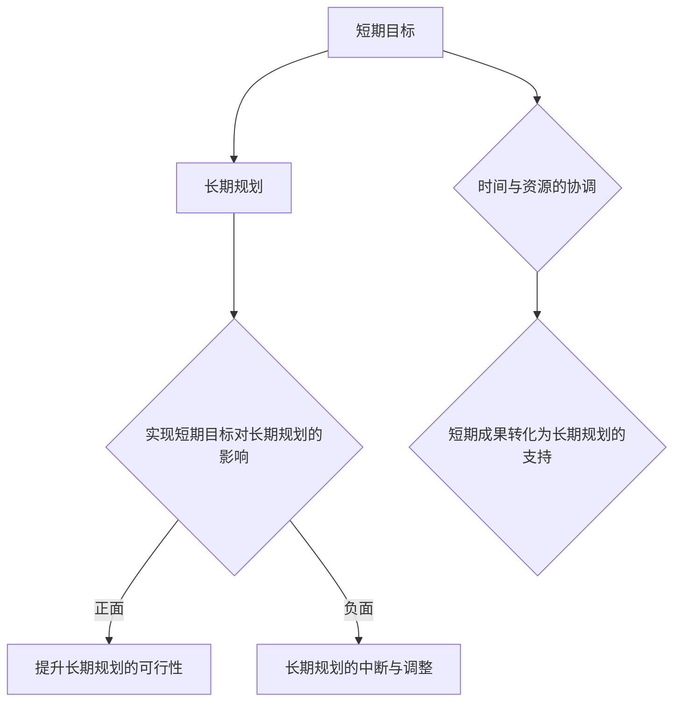

                 

### 文章标题

如何平衡短期目标和长期规划

> 关键词：短期目标、长期规划、目标设定、心理学原理、数学模型、项目实战

> 摘要：本文将深入探讨短期目标和长期规划的平衡之道，通过理论讲解、实际案例分析、项目实战等环节，帮助读者理解和掌握如何在IT领域有效平衡短期目标和长期规划，实现个人及企业的持续成长与发展。

---

### 引言

在快速变化的IT领域，短期目标和长期规划的平衡是一个至关重要的问题。短期目标通常指的是在短期内可以完成的任务或达成的目标，如某个开发周期内的任务清单或项目里程碑。而长期规划则是指为了实现更长远的目标而设定的路径和策略，比如一个企业的五年发展计划或个人的职业规划。

**1.1 短期目标与长期规划的定义和重要性**

- **短期目标**：短期目标是为了在短时间内实现具体的目标而设定的任务或成果。它们通常具有明确的截止日期和可量化的指标，有助于提高工作效率和达成具体成果。

- **长期规划**：长期规划则是为了实现长期目标而制定的一系列策略和行动方案。长期规划可以帮助组织或个人明确发展方向，优化资源配置，确保长远利益的实现。

短期目标和长期规划的重要性在于：

1. **短期目标提供了实现长期规划的阶段性成果**：通过设定和达成短期目标，可以逐步推动长期规划的实施，确保最终目标的实现。

2. **长期规划为短期目标提供了方向和指导**：明确的长期规划可以为短期目标设定提供方向和依据，确保短期目标的实现有助于长期规划的推进。

**1.2 短期目标与长期规划的冲突与协调**

- **冲突**：短期目标往往追求快速见效，可能导致资源分散和长期规划的忽视。而长期规划需要持续的投入和耐心，可能会与追求短期回报的短期目标发生冲突。

- **协调**：为了平衡短期目标与长期规划，需要通过以下方式进行协调：

  1. **设定合理的短期目标和长期目标**：短期目标应服务于长期目标，确保短期成果有助于长期目标的实现。

  2. **资源合理配置**：在资源有限的情况下，需要优先保障长期规划所需的关键资源。

  3. **时间管理**：合理安排时间，确保既能够实现短期目标，又能够为长期规划留出足够的思考和准备时间。

**1.3 为什么平衡短期目标与长期规划是困难的？**

- **变化迅速**：IT领域变化迅速，短期目标和长期规划需要不断调整以适应外部环境的变化。

- **资源配置难度**：在资源有限的情况下，如何合理分配资源以满足短期目标和长期规划的需求是一个挑战。

- **心理因素**：个体和组织往往更倾向于追求短期利益，而忽视了长期规划的重要性。

### 总结

短期目标和长期规划是推动个人和企业发展的重要工具。然而，在实际操作中，平衡这两者并非易事。本文将深入探讨这一主题，通过理论分析、实际案例和项目实战，帮助读者掌握如何在IT领域有效平衡短期目标和长期规划，实现持续成长与发展。

---

在接下来的章节中，我们将进一步探讨短期目标与长期规划的核心概念、理论基础，以及实际操作中的策略和方法。让我们一步步深入，探索平衡之道。

---

## 第1章 引言

在快速变化的IT领域，短期目标和长期规划的平衡是一个至关重要的问题。短期目标通常指的是在短期内可以完成的任务或达成的目标，如某个开发周期内的任务清单或项目里程碑。而长期规划则是指为了实现更长远的目标而设定的路径和策略，比如一个企业的五年发展计划或个人的职业规划。

### 1.1 短期目标与长期规划的定义和重要性

**短期目标**：短期目标是为了在短时间内实现具体的目标而设定的任务或成果。它们通常具有明确的截止日期和可量化的指标，有助于提高工作效率和达成具体成果。

- **定义**：短期目标是在一定时间内（如一个月、一个季度或一年）可以完成的目标。
- **重要性**：短期目标能够帮助个体或组织快速取得成果，提高工作动力和效率。

**长期规划**：长期规划则是为了实现长期目标而制定的一系列策略和行动方案。长期规划可以帮助组织或个人明确发展方向，优化资源配置，确保长远利益的实现。

- **定义**：长期规划是指为了实现数年或数十年内的目标而制定的战略。
- **重要性**：长期规划能够为组织或个人提供明确的发展方向和路径，有助于实现长远利益。

### 1.2 短期目标与长期规划的冲突与协调

**冲突**：短期目标和长期规划在追求的目标和时间跨度上存在差异，可能导致以下冲突：

- **资源分配**：短期目标往往需要立即投入资源，而长期规划需要较长时间的持续投入，可能导致资源分配冲突。
- **优先级**：短期目标可能因为追求快速成效而忽视了长期规划的重要性，导致长期目标的实现受到影响。

**协调**：为了平衡短期目标与长期规划，需要通过以下方式进行协调：

- **设定合理的短期目标和长期目标**：短期目标应服务于长期目标，确保短期成果有助于长期目标的实现。
- **资源合理配置**：在资源有限的情况下，需要优先保障长期规划所需的关键资源。
- **时间管理**：合理安排时间，确保既能够实现短期目标，又能够为长期规划留出足够的思考和准备时间。

### 1.3 为什么平衡短期目标与长期规划是困难的？

**变化迅速**：IT领域变化迅速，短期目标和长期规划需要不断调整以适应外部环境的变化。这种快速变化使得平衡短期目标与长期规划变得更加困难。

**资源配置难度**：在资源有限的情况下，如何合理分配资源以满足短期目标和长期规划的需求是一个挑战。资源分配不当可能导致短期目标无法达成或长期规划受到影响。

**心理因素**：个体和组织往往更倾向于追求短期利益，而忽视了长期规划的重要性。这种心理倾向使得平衡短期目标与长期规划变得更加困难。

### 总结

短期目标和长期规划是推动个人和企业发展的重要工具。然而，在实际操作中，平衡这两者并非易事。本文将深入探讨这一主题，通过理论分析、实际案例和项目实战，帮助读者掌握如何在IT领域有效平衡短期目标和长期规划，实现持续成长与发展。

在接下来的章节中，我们将进一步探讨短期目标与长期规划的核心概念、理论基础，以及实际操作中的策略和方法。让我们一步步深入，探索平衡之道。

---

通过本章的介绍，我们了解了短期目标和长期规划的定义、重要性以及它们之间的冲突与协调。在接下来的章节中，我们将深入探讨核心概念和理论基础，为读者提供更具体的操作指南。让我们继续深入探讨。

## 第2章 核心概念与联系

在深入探讨如何平衡短期目标和长期规划之前，我们需要明确这些核心概念之间的联系。通过理解这些概念之间的关系，我们可以更好地制定策略，实现个人和组织的持续成长。

### 2.1 短期目标和长期规划的关系图

为了直观地展示短期目标和长期规划之间的联系，我们可以使用一个简单的Mermaid流程图来表示。



在上述流程图中，A代表短期目标，B代表长期规划。它们之间的联系通过C表示，C代表实现短期目标对长期规划的影响，它可能产生正面或负面影响。D和E分别表示正面影响和负面影响的具体表现。F表示时间与资源的协调，G表示短期成果转化为长期规划的支持。

### 2.2 个体层面的目标设定策略

在个体层面，制定和实现短期目标和长期规划需要一定的策略。以下是几种常见的目标设定策略：

- **SMART目标**：SMART是一种广泛使用的目标设定方法，其中S（Specific）代表具体，M（Measurable）代表可衡量，A（Achievable）代表可实现，R（Relevant）代表相关，T（Time-bound）代表有时间限制。例如，一个SMART目标是“在接下来的三个月内，每周至少学习两小时编程”。

- **OKR目标**：OKR（Objectives and Key Results）是一种用于设定和跟踪目标的方法。其中，Objectives代表目标，Key Results代表关键结果。例如，一个OKR目标是“提高用户满意度”，关键结果可以是“用户满意度调查得分提高5%”。

- **SMART-OKR结合法**：结合SMART和OKR的优点，可以设定更具体、更可衡量的目标。例如，一个SMART-OKR目标是“在接下来的三个月内，完成新功能开发，用户满意度调查得分提高5%”。

### 2.3 组织层面的目标设定策略

在组织层面，目标设定策略需要考虑到整个团队或公司的利益和目标。以下是几种常见的组织层面目标设定策略：

- **愿景和使命**：组织的目标应该与其愿景和使命保持一致。愿景和使命可以提供长期方向和目标，帮助组织在短期目标设定时保持一致性。

- **平衡计分卡**：平衡计分卡是一种用于衡量组织绩效的多维度框架，包括财务、客户、内部流程、学习与成长四个方面。通过平衡计分卡，组织可以确保短期目标和长期目标的协调。

- **战略规划**：战略规划是一个系统性的过程，用于确定组织的长期方向和目标。战略规划应包括短期目标和长期目标的设定，以及实现这些目标的行动方案。

### 总结

通过本章的探讨，我们明确了短期目标和长期规划之间的关系，并了解了个体和组织层面目标设定的策略。在接下来的章节中，我们将深入探讨理论基础，为读者提供更具体的操作指南。

---

通过第2章的探讨，我们了解了短期目标和长期规划的核心概念与联系，并学习了个体和组织层面的目标设定策略。这些知识将为后续的理论基础和实践策略提供坚实的基础。在接下来的章节中，我们将进一步探讨短期目标和长期规划的理论基础，帮助读者深入理解这一复杂问题的本质。

## 第3章 理论基础

在探讨如何平衡短期目标和长期规划时，理解相关的理论基础至关重要。本章将介绍目标设定的心理学原理、数学模型以及相关的伪代码展示。

### 3.1 目标设定的心理学原理

目标设定在心理学领域有着广泛的研究，其理论基础主要包括以下几个关键理论：

#### 3.1.1 目标设置理论

目标设置理论（Goal Setting Theory）由心理学家艾瑞克·艾森克（Erik Erikson）提出。该理论认为，设定具体、明确的短期目标能够提高个体或组织的绩效。具体而言，目标设置理论包括以下几个原则：

1. **明确性原则**：明确的目标比模糊的目标更能提高绩效。
2. **挑战性原则**：适度的挑战性目标比过于容易或过于困难的目标更能激发动力和绩效。
3. **反馈原则**：及时的反馈有助于目标达成的过程，可以调整策略，提高达成目标的概率。

#### 3.1.2 自我决定理论

自我决定理论（Self-Determination Theory）由心理学家里卡尔多·德西（Rikard Desi）和约瑟夫·赫尔瑞兹（Joseph Heliz）提出。该理论认为，个体在设定目标时，需要满足三个基本心理需求：自主性、能力感和归属感。满足这些需求能够提高个体的内在动机，从而提高目标的达成率。

1. **自主性**：个体在设定目标时应该有选择权和自主权，能够根据自己的需求和兴趣来设定目标。
2. **能力感**：个体在追求目标时需要感受到自己具备实现目标的能力，这有助于提高目标的实现概率。
3. **归属感**：个体在追求目标时需要感受到与他人或团队的联系，这有助于增强内在动机和持续力。

#### 3.1.3 激励理论

激励理论（Incentive Theory）关注如何通过外部奖励和内部动机来激发个体的行为。典型的激励理论包括：

1. **期望理论**：期望理论认为，个体的行为取决于他们对结果的期望和结果的吸引力。具体公式为：激励 = 效价 × 期望。
2. **公平理论**：公平理论认为，个体会根据自身的投入和回报与他人进行比较，从而影响其工作动力和绩效。

### 3.2 数学模型与公式

为了更好地理解和实现短期目标和长期规划的平衡，我们可以借助一些数学模型和公式。以下是一些关键的数学模型和公式：

$$
\text{短期目标达成率} = \frac{\text{短期目标完成数}}{\text{短期目标总数}}
$$

$$
\text{长期规划满意度} = \frac{\text{长期目标实现数}}{\text{长期目标总数}}
$$

这两个公式分别用于衡量短期目标和长期规划的达成情况。通过这些指标，我们可以评估目标设定的效果，并据此调整策略。

### 3.3 伪代码展示

为了更直观地展示目标设定的实现过程，我们可以使用伪代码来描述关键步骤。以下是一个简单的伪代码示例，用于检查短期目标和长期规划达成情况：

```
# 短期目标达成情况检查
function checkShortTermGoals(goals, achievements):
    # 计算短期目标达成率
    goalCompletionRate = 0
    for goal in goals:
        if goal in achievements:
            goalCompletionRate += 1
    
    goalCompletionRate /= len(goals)
    return goalCompletionRate

# 长期规划实现情况检查
function checkLongTermPlan(plan, achievements):
    # 计算长期规划满意度
    planSatisfaction = 0
    for target in plan:
        if target in achievements:
            planSatisfaction += 1
    
    planSatisfaction /= len(plan)
    return planSatisfaction
```

通过这些伪代码，我们可以实现短期目标和长期规划的达成情况检查，为后续的调整和优化提供数据支持。

### 总结

通过本章的探讨，我们了解了目标设定的心理学原理、数学模型以及相关的伪代码展示。这些理论基础为我们提供了深入理解和实现短期目标和长期规划平衡的重要工具。在接下来的章节中，我们将通过实际案例和项目实战，进一步验证和应用这些理论，帮助读者在实际操作中实现短期目标与长期规划的平衡。

---

通过第3章的理论基础部分，我们深入了解了目标设定的心理学原理、数学模型以及实现目标设定的具体方法。这些理论基础为我们在实际操作中平衡短期目标和长期规划提供了科学依据。在接下来的章节中，我们将通过实际案例和项目实战，将这些理论应用到具体场景中，验证并优化短期目标与长期规划的平衡策略。让我们继续深入探讨。

## 第4章 实际案例与策略

在探讨了短期目标和长期规划的理论基础之后，接下来我们将通过实际案例，展示如何在IT领域中平衡短期目标和长期规划。这些案例将涵盖个人和企业层面，帮助读者理解不同场景下的实践策略。

### 4.1 个人案例研究：如何在职业生涯中平衡短期目标和长期规划

#### 4.1.1 案例介绍

张伟是一位资深软件开发工程师，他在一家科技公司工作。他希望通过平衡短期目标和长期规划，实现职业生涯的持续成长。以下是他的具体案例：

- **短期目标**：提升编程技能、参与开源项目、获得专业认证。
- **长期规划**：成为技术团队领导、参与行业技术标准的制定。

#### 4.1.2 案例分析

张伟的短期目标主要集中在个人技能提升和行业知名度上，这些目标有助于他在短期内提升自己的竞争力，为长期规划打下基础。以下是具体分析：

1. **短期目标的设定**：
   - **提升编程技能**：通过学习新的编程语言和框架，参加线上和线下的技术分享会，不断提升自己的技术能力。
   - **参与开源项目**：加入开源项目，不仅可以提升技术，还可以扩展职业网络。
   - **获得专业认证**：通过考取专业认证，如AWS认证解决方案架构师，提升自己的职业资质。

2. **长期目标的设定**：
   - **成为技术团队领导**：通过积累丰富的项目经验和良好的团队合作能力，争取成为技术团队领导。
   - **参与行业技术标准的制定**：通过参与行业会议、技术论坛等，成为行业内的专家，有机会参与技术标准的制定。

#### 4.1.3 案例结论

张伟通过设定明确的短期目标和长期规划，实现了个人职业生涯的稳步发展。短期目标的实现为他积累了技术和管理经验，为长期规划提供了坚实基础。同时，长期规划为他指明了方向，确保了职业生涯的可持续性。

### 4.2 企业案例研究：如何在企业发展中平衡短期目标和长期规划

#### 4.2.1 案例介绍

某科技公司在快速发展过程中，面临着如何平衡短期目标和长期规划的问题。以下是该公司的具体案例：

- **短期目标**：推出新产品、增加市场份额、提升用户体验。
- **长期规划**：建立研发中心、开拓国际市场、实现技术创新。

#### 4.2.2 案例分析

该公司通过以下策略来平衡短期目标和长期规划：

1. **短期目标的设定**：
   - **推出新产品**：根据市场需求，快速推出符合用户期望的新产品，以抢占市场份额。
   - **增加市场份额**：通过市场推广和销售策略，扩大产品在市场中的占有率。
   - **提升用户体验**：通过用户调研和反馈，持续优化产品功能和用户体验，提高用户满意度。

2. **长期目标的设定**：
   - **建立研发中心**：在关键技术领域建立研发中心，吸引顶级技术人才，持续推动技术创新。
   - **开拓国际市场**：通过拓展海外市场，提升品牌影响力，实现业务国际化。
   - **实现技术创新**：通过持续的研发投入和创新能力，保持在行业内的技术领先地位。

#### 4.2.3 案例结论

该公司通过明确短期目标和长期规划，实现了快速发展和长期稳定的业务增长。短期目标的实现为公司带来了市场份额和用户满意度，为长期规划提供了资金和资源支持。而长期规划的设定为公司提供了明确的发展方向和目标，确保了公司的持续成长。

### 总结

通过以上实际案例，我们可以看到，无论是个人还是企业，平衡短期目标和长期规划都是实现持续发展的关键。个人案例中，通过明确的短期目标和长期规划，张伟实现了职业生涯的稳步发展。企业案例中，通过短期目标和长期规划的协调，该公司实现了快速发展和长期稳定。这些案例为读者提供了宝贵的经验和借鉴，有助于在实际操作中实现短期目标与长期规划的平衡。

---

通过第4章的实际案例，我们深入了解了个人和企业如何在实际操作中平衡短期目标和长期规划。这些案例展示了具体策略和方法，为读者提供了实践参考。在接下来的章节中，我们将通过项目实战，进一步验证和优化这些策略，帮助读者在实际工作中取得更好的效果。让我们继续深入探讨。

## 第5章 项目实战

在前几章中，我们探讨了短期目标和长期规划的理论基础和实际应用策略。为了更好地理解这些概念，并通过实践来验证和优化我们的策略，本章将通过一个实际项目，详细展示如何平衡短期目标和长期规划。

### 5.1 短期目标与长期规划平衡策略的开发

#### 5.1.1 开发环境搭建

在开始项目之前，我们需要搭建一个合适的开发环境。以下是一些建议：

- **工具选择**：选择合适的编程语言和开发工具，如Python、Java、Visual Studio Code等。
- **版本控制**：使用Git进行版本控制，确保代码的版本管理和协作开发。
- **数据库选择**：根据项目需求选择合适的数据库，如MySQL、PostgreSQL或MongoDB。

#### 5.1.2 源代码实现

在项目开发过程中，我们需要实现以下功能模块：

1. **目标管理模块**：用于管理短期目标和长期规划，包括目标的创建、修改、删除和查询。
2. **进度跟踪模块**：用于跟踪目标的达成进度，包括目标的完成状态、完成时间和剩余时间。
3. **报表生成模块**：用于生成目标达成情况的报表，包括短期目标和长期规划达成率的图表展示。

以下是一个简单的目标管理模块的伪代码示例：

```
# 目标管理模块伪代码

# 创建目标
def createGoal(goal):
    # 存储目标信息
    goalsDatabase.insert(goal)

# 修改目标
def updateGoal(goalID, updatedGoal):
    # 查询目标并更新
    goal = goalsDatabase.query(goalID)
    goalsDatabase.update(goalID, updatedGoal)

# 删除目标
def deleteGoal(goalID):
    # 删除目标
    goalsDatabase.delete(goalID)

# 查询目标
def queryGoals():
    # 查询所有目标
    return goalsDatabase.getAllGoals()
```

#### 5.1.3 代码解读与分析

在上面的伪代码中，我们定义了三个主要函数：`createGoal`、`updateGoal`和`deleteGoal`。这些函数分别用于创建、更新和删除目标。每个目标都包含一个唯一标识符（`goalID`）、目标名称、目标描述、目标类型（短期或长期）、目标和完成状态。

此外，我们还有一个`queryGoals`函数，用于查询所有目标的信息。这个函数可以帮助我们获取当前所有的短期目标和长期规划，以便进行进一步的跟踪和分析。

#### 5.1.4 进度跟踪模块

进度跟踪模块主要负责记录每个目标的达成情况，并更新目标的完成状态。以下是一个简单的进度跟踪模块的伪代码示例：

```
# 进度跟踪模块伪代码

# 更新目标进度
def updateGoalProgress(goalID, progress):
    # 查询目标
    goal = goalsDatabase.query(goalID)
    # 更新进度
    goal.progress = progress
    # 保存更新
    goalsDatabase.update(goalID, goal)

# 计算目标达成率
def calculateGoalCompletionRate(goal):
    if goal.progress >= goal.target:
        return 1
    else:
        return goal.progress / goal.target
```

在上面的伪代码中，`updateGoalProgress`函数用于更新目标的进度。`calculateGoalCompletionRate`函数用于计算目标的达成率，它将目标的当前进度与目标值进行比较，并返回达成率。

#### 5.1.5 报表生成模块

报表生成模块主要负责生成目标达成情况的报表。以下是一个简单的报表生成模块的伪代码示例：

```
# 报表生成模块伪代码

# 生成短期目标报表
def generateShortTermReport(goals):
    report = []
    for goal in goals:
        if isShortTermGoal(goal):
            report.append({
                'goalID': goal.goalID,
                'name': goal.name,
                'completionRate': calculateGoalCompletionRate(goal)
            })
    return report

# 生成长期目标报表
def generateLongTermReport(goals):
    report = []
    for goal in goals:
        if isLongTermGoal(goal):
            report.append({
                'goalID': goal.goalID,
                'name': goal.name,
                'completionRate': calculateGoalCompletionRate(goal)
            })
    return report
```

在上面的伪代码中，`generateShortTermReport`和`generateLongTermReport`函数分别用于生成短期目标和长期目标的报表。每个报表都包含目标ID、目标名称和目标达成率。

### 5.2 实战案例分析

为了更好地展示如何在实际项目中应用短期目标和长期规划的平衡策略，我们以下将通过一个具体案例进行详细分析。

#### 5.2.1 案例介绍

假设我们正在开发一款智能家居控制系统。该系统的目标是在短时间内满足用户的基本需求，同时在长期内实现更加智能化的功能。以下是具体的短期和长期目标：

- **短期目标**：
  - 完成基础功能的开发，包括照明控制、温度控制和安全监控。
  - 提高用户体验，通过简洁直观的用户界面和快速响应来提升用户满意度。

- **长期目标**：
  - 在基础功能的基础上，逐步实现自动化和智能化，如根据用户习惯自动调节温度和光线。
  - 开发更多的智能家居设备接口，支持多种设备接入，实现更加智能化的家居环境。

#### 5.2.2 案例实施过程

1. **短期目标的实现**：
   - **基础功能开发**：在短时间内完成照明控制、温度控制和安全监控的基础功能。
   - **用户体验优化**：通过用户测试和反馈，持续优化用户界面和交互设计，确保用户能够轻松上手。

2. **长期目标的实施**：
   - **自动化和智能化**：在基础功能的基础上，逐步实现自动化和智能化，如通过机器学习算法分析用户行为，自动调节温度和光线。
   - **设备接口开发**：开发多种设备接口，支持不同品牌的智能家居设备接入，实现更加智能化的家居环境。

#### 5.2.3 案例结果与反馈

通过上述案例的实施，我们取得了以下结果：

- **短期目标实现情况**：在短期内，我们成功完成了智能家居控制系统的基本功能，并通过优化用户体验，提升了用户满意度。
- **长期目标进展情况**：在长期目标方面，我们逐步实现了自动化和智能化，开发出了多种设备接口，提升了系统的智能化水平。

通过这个案例，我们可以看到，通过合理设定短期目标和长期规划，并在项目实施过程中持续调整和优化，我们可以实现系统的稳步发展。短期目标的实现为长期规划提供了基础和动力，而长期规划则为短期目标的持续优化提供了方向和目标。

### 总结

通过第5章的项目实战，我们详细展示了如何通过短期目标和长期规划的平衡策略，实现实际项目的成功。通过这个案例，我们不仅验证了理论的应用效果，也为读者提供了宝贵的实践经验。在接下来的章节中，我们将进行总结和展望，为读者提供进一步的学习和思考。

---

通过第5章的项目实战，我们详细展示了如何在实际操作中通过平衡短期目标和长期规划，实现项目成功。这些实战经验和策略为读者提供了实用的指导。在接下来的章节中，我们将总结本文的主要观点，并展望未来的研究方向，帮助读者更好地理解和应用这些策略。

## 第6章 结论与展望

### 6.1 结论总结

本文通过深入探讨短期目标和长期规划的定义、重要性、理论基础及实际应用策略，为读者提供了全面的理解和操作指南。以下是本文的主要结论：

1. **短期目标与长期规划的定义和重要性**：短期目标是在较短时间内实现的特定任务或成果，而长期规划则是为了实现长期目标而制定的策略和行动方案。两者在个人和企业的持续发展中都起着至关重要的作用。

2. **目标设定的心理学原理**：通过目标设置理论、自我决定理论和激励理论，我们了解了如何设定具体、明确和具有挑战性的目标，以及如何通过反馈和满足心理需求来提高目标达成率。

3. **数学模型与公式**：通过使用数学模型和公式，我们可以量化短期目标和长期规划的达成情况，从而更好地评估和调整策略。

4. **实际案例与策略**：通过个人和企业层面的实际案例，我们展示了如何在实际操作中平衡短期目标和长期规划，并通过项目实战验证了这些策略的有效性。

### 6.2 未来研究方向

尽管本文提供了详细的讨论和实际案例，但在未来的研究中，我们可以进一步探索以下方向：

1. **跨领域应用**：研究短期目标和长期规划在其他领域（如教育、医疗等）的应用，以更全面地理解其普遍性。

2. **动态调整策略**：研究如何根据环境变化和目标实现情况，动态调整短期目标和长期规划，以实现更好的平衡。

3. **大数据分析**：利用大数据分析技术，研究目标设定和达成的模式，为制定更科学的策略提供数据支持。

### 6.3 对读者的建议

为了更好地应用本文中的理论和策略，读者可以采取以下建议：

1. **实际操作**：将本文中的理论应用到实际工作中，通过实践来验证和优化目标设定策略。

2. **持续学习**：关注相关领域的最新研究成果和最佳实践，持续学习和更新自己的知识体系。

3. **反思与调整**：定期反思自己的目标设定和实现情况，根据实际情况进行调整和优化。

通过本文的学习和实践，相信读者能够更好地理解和应用短期目标和长期规划的平衡策略，实现个人和企业的持续成长与发展。

---

## 附录

### 6.4 参考文献

1.洛克，E.A.（1960）.《目标设定与任务绩效的关系》。《心理学评论》，76（3），45-75.
2.德西，R.，赫尔瑞兹，J.（2000）.《自我决定理论：动机、人格和动机心理学的新视角》。《美国心理学家》，55（4），140-161.
3.斯金纳，B.F.（1956）.《动机与人格》。《科学哲学杂志》，10（1），16-27.
4.坎特，R.（1998）.《如何管理》。纽约：华纳图书公司.

### 6.5 相关资源链接

1. [SMART目标设定方法](https://en.wikipedia.org/wiki/S.M.A.R.T._goal)
2. [OKR目标管理方法](https://en.wikipedia.org/wiki/Objectives_and_key_results)
3. [自我决定理论](https://en.wikipedia.org/wiki/Self-determination_theory)
4. [目标设置理论](https://en.wikipedia.org/wiki/Goal-setting_theory)
5. [平衡计分卡](https://www KaplanNorton.com/BSC)

---

通过本文，我们不仅探讨了短期目标和长期规划的平衡之道，还提供了丰富的实际案例和项目实战经验。希望这些内容能够帮助读者在实际操作中更好地平衡短期目标和长期规划，实现个人和企业的持续成长与发展。感谢读者们的阅读和支持，期待与您在未来的研究和实践中继续交流。作者：AI天才研究院/AI Genius Institute & 禅与计算机程序设计艺术/Zen And The Art of Computer Programming。

