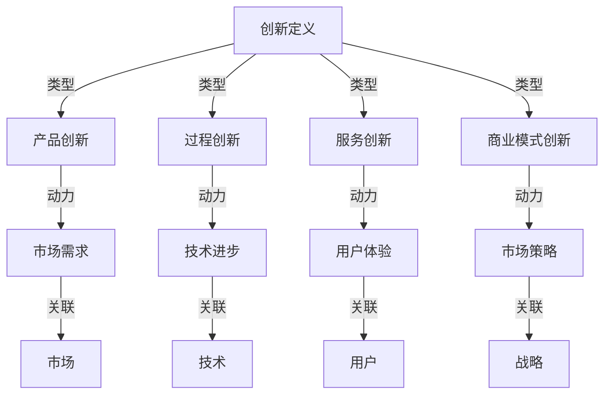

                 

### 文章标题：如何建立技术团队的创新机制

关键词：技术团队，创新机制，组织管理，持续创新，实践案例

摘要：本文将探讨如何建立技术团队的创新机制，包括理论基础、实践案例和持续创新的方法。通过逻辑清晰、结构紧凑的分析，帮助读者理解并建立有效的创新机制，提升技术团队的创新能力和竞争力。

----------------------------------------------------------------

### 引言

在当今快速变化的技术环境中，技术团队的创新能力已成为企业竞争力的核心。如何建立有效的创新机制，激发技术团队的创造力，成为众多企业面临的挑战。本文旨在探讨如何建立技术团队的创新机制，通过理论分析和实践案例，为读者提供实用的指导。

首先，让我们了解创新机制的重要性。创新机制是企业实现持续创新的重要保障，它不仅能激发技术团队的创造力，还能提高企业的市场竞争力。技术团队的创新机制包括组织结构、管理策略、激励机制等多个方面，这些因素共同作用，推动技术团队不断突破自我，实现创新。

本文将分为以下几个部分：

1. 创新机制的重要性：介绍创新机制对技术团队的意义和作用。
2. 创新机制的理论基础：阐述创新机制的核心概念、架构和运行机制。
3. 技术团队的组织与管理：探讨技术团队的组织结构、招聘与培训、沟通与协作、激励机制。
4. 创新实践案例：分析实际案例，展示如何建立和实施创新机制。
5. 持续创新的方法和策略：提供保持创新动力、利用外部资源、持续改进创新机制的方法。
6. 结论：总结文章的主要观点，强调建立创新机制的重要性。

### 创新机制的重要性

创新机制是企业实现持续创新的重要保障。它不仅能够激发技术团队的创造力，还能提高企业的市场竞争力。在技术快速发展的今天，创新已成为企业生存和发展的关键。而创新机制的建立，是实现这一目标的重要手段。

首先，创新机制能够激发技术团队的创造力。技术团队是创新的主力军，他们的创新思维和技能是企业持续发展的重要动力。通过建立有效的创新机制，企业可以为技术团队提供良好的创新环境，激发他们的创造潜能，推动技术的进步。

其次，创新机制能够提高企业的市场竞争力。在激烈的市场竞争中，拥有创新能力的企业往往能够迅速占领市场，获得竞争优势。通过创新，企业可以开发出具有竞争力的产品和服务，满足市场的需求，从而在市场中脱颖而出。

此外，创新机制还能促进企业的可持续发展。在创新机制的支持下，企业能够不断适应市场的变化，优化产品和服务，提高效率，降低成本，从而实现可持续发展。

总之，创新机制在技术团队中具有重要作用。它不仅能够激发技术团队的创造力，提高企业的市场竞争力，还能促进企业的可持续发展。因此，建立有效的创新机制，是企业成功的关键。

### 创新机制的理论基础

创新机制的理论基础包括核心概念、架构和运行机制。了解这些基础，有助于我们更好地理解和应用创新机制。

首先，创新机制的核心概念。创新机制是指企业在创新过程中，所采用的一系列制度、策略和方法的集合。它包括创新的动力、创新的资源、创新的流程和创新的效果评估等方面。这些核心概念相互作用，共同推动创新的发展。

其次，创新机制的架构。创新机制的架构包括组织结构、管理流程、激励机制和文化氛围等方面。组织结构是创新机制的基础，决定了创新的实施路径；管理流程是创新的实施手段，确保创新的有序进行；激励机制是创新的动力，激励技术团队投入创新活动；文化氛围是创新的基础，营造有利于创新的环境。

最后，创新机制的运行机制。创新机制的运行机制包括创新的启动、实施、监控和评估等环节。在创新启动阶段，企业需要明确创新的目标和方向；在实施阶段，企业需要按照创新计划进行操作；在监控阶段，企业需要确保创新过程的顺利进行；在评估阶段，企业需要评估创新的效果，为下一步的创新提供依据。

### 创新的核心概念与联系

创新是技术团队持续发展的动力，它涉及多个核心概念，这些概念相互联系，共同构成创新机制的基石。

首先，创新的定义。创新是指通过新的思路、方法或技术，对现有产品、服务、过程或组织进行改进或创造，从而实现更好的效果或价值。创新可以是渐进的，如改进现有产品；也可以是突破性的，如发明全新的技术或市场。

其次，创新的类型。根据创新的性质和目标，创新可以分为以下几种类型：

- **产品创新**：开发全新或改进现有产品，以满足市场需求。
- **过程创新**：改进或创造新的生产、服务或运营过程，以提高效率和质量。
- **服务创新**：提供全新的服务或改进现有服务，以提升用户体验。
- **商业模式创新**：改变企业的商业模式，以创造新的价值或竞争优势。

每种创新类型都有其独特的特点和挑战，但它们的目标都是提升企业的核心竞争力。

接下来，创新的动力。创新的动力是指推动创新发生的因素，包括内部和外部动力。内部动力通常来自企业的战略目标、员工的个人成长需求、技术进步等；外部动力则包括市场竞争、客户需求变化、技术变革等。这些动力相互作用，共同激发创新活动。

最后，创新与相关概念的联系。创新不仅涉及技术，还与市场、用户、组织等多个方面密切相关。创新必须与市场需求相结合，以满足用户需求；与组织结构和文化相结合，以营造有利于创新的环境；与市场战略相结合，以实现企业的长期发展。

通过理解创新的定义、类型、动力以及与其他概念的关联，我们可以更好地设计和实施创新机制，激发技术团队的创新潜力。

#### 核心概念原理和架构的 Mermaid 流程图

为了更直观地理解创新的核心理念和架构，我们可以使用 Mermaid 流程图来展示这些概念之间的关系。



这个流程图展示了创新定义、创新类型、创新动力以及它们之间的关联。通过这个图，我们可以清晰地看到创新机制的核心概念和架构。

### 创新机制的架构与组成部分

创新机制的架构和组成部分是确保技术团队能够持续、高效地创新的关键。创新机制不仅需要明确的目标和流程，还需要合适的组织结构、管理策略和文化氛围。

首先，创新机制的目标是指导创新的总体方向。企业需要根据自身的战略目标和市场需求，设定明确的创新目标。这些目标可以是技术突破、市场扩展、成本降低或用户体验提升等。明确的目标有助于技术团队聚焦资源，集中精力解决关键问题。

其次，创新流程是创新机制的核心。一个有效的创新流程应包括以下环节：

1. **需求分析**：了解市场需求和用户需求，确定创新的方向。
2. **概念验证**：对创新概念进行初步验证，确定其可行性和潜在价值。
3. **开发与测试**：进行详细设计和开发，并通过测试验证方案的可行性。
4. **部署与推广**：将创新成果应用到实际业务中，并持续优化。

创新流程的每一步都需要有明确的任务和责任分配，确保各个环节顺利衔接。

接下来是组织结构。一个合理的组织结构能够为创新提供良好的支持。通常，技术团队的组织结构可以采用以下几种形式：

1. **职能型结构**：按照职能分工，如研发、测试、市场等部门。
2. **项目型结构**：以项目为中心，组建跨职能团队。
3. **矩阵型结构**：结合职能型和项目型，使团队成员既有职能归属，又能参与多个项目。

不同的组织结构形式各有优缺点，企业应根据自身情况选择合适的结构。

管理策略也是创新机制的重要组成部分。有效的管理策略包括：

1. **项目管理**：确保项目按计划进行，资源得到合理配置。
2. **风险管理**：识别和应对项目中的风险，确保创新过程的顺利。
3. **绩效管理**：通过绩效评估，激励技术团队不断改进和创新。

最后，文化氛围对创新机制的运行具有重要影响。企业需要营造一个鼓励创新、宽容失败、开放分享的文化氛围。这种文化氛围能够激发技术团队的创造力，促进知识共享和协作。

总之，创新机制的架构与组成部分包括目标设定、创新流程、组织结构、管理策略和文化氛围。这些因素相互配合，共同推动技术团队的持续创新。

#### 创新机制的组成部分

创新机制的组成部分主要包括以下几个方面：

1. **创新目标**：明确创新的方向和目标，是创新机制的核心。企业需要根据自身的战略目标和市场需求，设定具体的创新目标。例如，提升产品性能、拓展新市场、降低生产成本等。

2. **创新流程**：确保创新活动的有序进行，是创新机制的关键。创新流程通常包括需求分析、概念验证、开发与测试、部署与推广等环节。每个环节都有明确的任务和责任分配，确保创新活动的顺利进行。

3. **组织结构**：为创新提供组织保障。根据企业特点和需求，可以采用职能型结构、项目型结构或矩阵型结构。这些组织结构有助于明确职责、优化资源配置，提高创新效率。

4. **管理策略**：确保创新活动的有效管理。包括项目管理、风险管理、绩效管理等方面。通过科学的项目管理方法，确保创新项目按计划进行；通过风险管理，识别和应对潜在风险；通过绩效管理，激励技术团队不断改进和创新。

5. **文化氛围**：营造一个鼓励创新、宽容失败、开放分享的文化氛围。这种文化氛围能够激发技术团队的创造力，促进知识共享和协作，为创新提供良好的环境。

这些组成部分相互关联，共同构成一个完整的创新机制。企业应根据自身实际情况，灵活调整和创新这些组成部分，以实现持续创新。

#### 创新机制的运行机制与效果评估

创新机制的运行机制包括创新过程的各个环节，以及这些环节之间的相互关系。了解创新机制的运行机制，有助于企业更好地管理和推动创新活动。

首先，创新启动阶段是创新过程的起点。在这个阶段，企业需要明确创新的目标和方向，确定创新项目。通常，企业可以通过市场调研、用户反馈、技术发展趋势等方式，识别出有潜力的创新项目。创新启动阶段的任务是确定创新项目的可行性和潜在价值。

接下来是创新实施阶段。在这个阶段，企业需要按照创新计划进行详细设计和开发。创新实施阶段包括以下几个步骤：

1. **需求分析**：深入了解市场需求和用户需求，明确创新项目的目标和应用场景。
2. **概念验证**：对创新项目进行初步验证，确定其技术可行性。
3. **开发与测试**：进行详细设计和开发，并通过测试验证方案的可行性。
4. **迭代优化**：根据测试结果，对创新项目进行优化，确保其符合预期。

创新实施阶段的任务是确保创新项目按计划进行，并达到预期目标。

然后是创新监控阶段。在这个阶段，企业需要监控创新项目的进展情况，确保创新过程顺利进行。监控内容包括项目进度、资源使用、风险控制等。通过实时监控，企业可以及时发现和解决问题，确保创新项目的顺利进行。

最后是创新评估阶段。在这个阶段，企业需要对创新项目的效果进行评估，确定创新目标的实现情况。评估内容包括创新项目的市场表现、用户满意度、经济效益等。通过评估，企业可以总结创新经验，为未来的创新提供参考。

创新机制的效果评估方法主要包括以下几个方面：

1. **定量评估**：通过数据统计和分析，评估创新项目的经济效益、市场表现等。例如，计算创新项目的收入、利润、市场份额等指标。
2. **定性评估**：通过专家评审、用户反馈等方式，评估创新项目的质量、用户满意度等。例如，邀请专家对创新项目进行评审，收集用户对创新项目的反馈。
3. **综合评估**：将定量评估和定性评估相结合，对创新项目进行全面评估。

通过创新机制的运行机制和效果评估，企业可以更好地管理和推动创新活动，确保创新目标的实现。同时，企业可以不断优化创新机制，提高创新效率和效果。

#### 创新机制运行机制的伪代码

为了更好地理解创新机制的运行机制，我们可以使用伪代码来详细描述这个过程。以下是一个简化的创新机制运行伪代码示例：

```python
# 创新机制运行伪代码

def innovate():
    # 创新启动阶段
    if startup():
        # 创新实施阶段
        if implement():
            # 创新监控阶段
            if monitor():
                # 创新评估阶段
                if evaluate():
                    # 成功完成创新
                    return "Innovation Successful"
                else:
                    # 评估不通过，返回失败
                    return "Evaluation Failed"
            else:
                # 监控阶段出现问题，返回失败
                return "Monitoring Failed"
        else:
            # 实施阶段出现问题，返回失败
            return "Implementation Failed"
    else:
        # 启动阶段出现问题，返回失败
        return "Startup Failed"

# 函数定义
def startup():
    # 实现创新启动逻辑
    # ...
    return True  # 启动成功

def implement():
    # 实现创新实施逻辑
    # ...
    return True  # 实施成功

def monitor():
    # 实现创新监控逻辑
    # ...
    return True  # 监控成功

def evaluate():
    # 实现创新评估逻辑
    # ...
    return True  # 评估成功
```

这个伪代码展示了创新机制的运行流程，包括启动、实施、监控和评估四个主要阶段。每个阶段都有相应的逻辑判断，确保创新过程顺利进行。通过这个示例，我们可以更直观地理解创新机制的运行机制。

### 创新机制的理论基础

创新机制的理论基础包括一系列相关理论和概念，这些理论和概念为我们理解和设计创新机制提供了重要的指导。

首先，**技术接受模型（Technology Acceptance Model, TAM）** 是创新机制的重要理论基础之一。TAM模型由Davis在1989年提出，旨在解释用户接受和使用新技术的行为。该模型认为，用户对新技术的接受程度取决于其对技术的感知有用性和感知易用性。感知有用性是指用户认为新技术能够提高其工作效率或解决问题的能力；感知易用性是指用户认为新技术易于学习和使用。TAM模型指出，感知有用性和感知易用性是影响用户接受新技术的关键因素。

其次，**创新扩散理论（Innovation Diffusion Theory）** 提供了关于创新如何在不同群体中传播和被接受的理论框架。该理论由Rogers在1962年提出，认为创新的传播过程可以分为五个阶段：知晓、兴趣、评估、试用和采用。创新扩散理论指出，创新的接受速度和程度受到多种因素的影响，包括创新的特性、沟通渠道、社会结构和时间。

第三，**创新管理理论（Innovation Management Theory）** 研究企业如何管理创新过程，以提高创新效率和成功率。该理论强调，创新管理需要考虑创新的目标、过程、资源和组织文化。创新管理理论包括多个模型，如三阶段模型、五阶段模型和IDEAL模型。三阶段模型将创新过程分为探索、开发和实施三个阶段；五阶段模型则包括准备、开发、验证、市场化和扩散五个阶段；IDEAL模型则强调创新过程中的五个关键因素：想法、执行、适应、学习和发展。

此外，**开放式创新（Open Innovation）** 理论也具有重要影响。该理论由Chesbrough在2003年提出，认为企业应该利用外部知识和资源来推动创新，同时将内部创新成果对外开放。开放式创新理论强调，企业可以通过与外部合作伙伴的合作，实现创新资源的共享和优化，从而提高创新速度和效率。

最后，**组织学习理论（Organization Learning Theory）** 提供了关于企业如何通过学习实现持续创新的理论基础。该理论认为，组织学习是组织持续发展的重要动力。组织学习包括个人学习、团队学习和组织学习三个层次。组织学习理论强调，通过建立学习型组织，企业可以不断积累知识、改进能力，从而实现持续创新。

综上所述，创新机制的理论基础涉及多个相关理论和概念，这些理论和概念共同构成了创新机制的理论框架。了解和运用这些理论，有助于企业更好地设计和管理创新机制，提高创新能力。

### 技术团队的组织结构设计

技术团队的组织结构设计是建立创新机制的基础，它直接影响团队的工作效率和创新效果。根据不同的业务需求和企业特点，技术团队的组织结构可以分为职能型结构、项目型结构和矩阵型结构。

#### 职能型结构

职能型结构是传统企业中常见的组织形式，按照职能进行分工，如研发、测试、运维等。这种结构具有明确的职责界限，有助于提高专业水平和工作效率。但职能型结构也存在一些缺点，如部门间沟通成本高、响应市场变化较慢等。

#### 项目型结构

项目型结构以项目为中心，组建跨职能团队。团队成员来自不同部门，如研发、测试、市场等，共同负责项目的开发和实施。这种结构能够快速响应市场需求，提高创新效率。项目完成后，团队成员可以重新分配到其他项目，实现资源的优化配置。

#### 矩阵型结构

矩阵型结构结合了职能型结构和项目型结构的优点，使团队成员既有职能归属，又能参与多个项目。在矩阵型结构中，团队成员需要同时接受职能经理和项目经理的双重领导。这种结构能够充分利用各部门的专业优势，提高项目执行力，但同时也增加了管理复杂性。

#### 选择合适的组织结构

企业应根据自身特点和需求，选择合适的组织结构。以下是一些选择依据：

1. **业务需求**：如果企业业务多样，需要快速响应市场变化，可以选择项目型结构。
2. **企业规模**：对于中小型企业，职能型结构可能更加适合，因为其管理成本较低。
3. **创新需求**：如果企业重视创新，需要灵活调整组织结构，可以选择矩阵型结构。
4. **沟通与协作**：如果企业内部沟通不畅，可以选择项目型结构，以加强跨部门协作。

总之，技术团队的组织结构设计应根据企业实际情况，综合考虑业务需求、规模、创新需求和沟通协作等因素，选择合适的组织形式，以支持创新机制的建立和运行。

#### 技术团队的招聘与培训策略

技术团队的招聘与培训策略是确保团队具备持续创新能力的关键。为了吸引和保留优秀的技术人才，企业需要制定有效的招聘和培训策略。

首先，在招聘过程中，企业应注重以下几点：

1. **明确的招聘标准**：根据企业的需求和岗位特点，设定明确的招聘标准，包括技能、经验、学历等。例如，对于研发岗位，可以设定编程能力、技术熟练度和项目经验等方面的要求。
2. **多样化的招聘渠道**：利用多种招聘渠道，如线上招聘平台、社交媒体、专业论坛等，扩大招聘范围，吸引更多优秀人才。
3. **严格的筛选流程**：通过笔试、面试、实战演练等环节，对候选人进行全方位评估，确保招聘到具备实际能力的人才。
4. **面试官的培训**：对面试官进行培训，提高其面试技巧和判断能力，确保面试过程的公正性和科学性。

其次，在培训方面，企业应注重以下几点：

1. **全面的培训内容**：根据技术团队的岗位需求，制定全面的培训计划，包括技术技能、项目管理、团队协作等方面的培训。
2. **个性化的培训方案**：根据员工的不同特点和需求，制定个性化的培训方案，确保培训内容的有效性和针对性。
3. **多样化的培训方式**：结合线上和线下培训，提供灵活的培训方式，如在线课程、内部讲座、实战演练等，提高培训效果。
4. **持续的职业发展规划**：为员工提供明确的职业发展规划，鼓励他们不断提升自己的技能和能力，实现个人与企业的共同成长。

此外，企业还应建立良好的激励机制，如绩效奖励、晋升通道等，激励员工积极参与培训和提升自己的能力。

总之，通过制定有效的招聘和培训策略，企业可以吸引和保留优秀的技术人才，提高团队的整体素质和创新能力，为企业的持续发展提供有力支持。

#### 技术团队的沟通与协作机制

有效的沟通与协作机制是技术团队成功实现项目目标的关键。为了提高团队的沟通效率，确保项目顺利进行，企业需要从以下几个方面入手：

1. **明确沟通目标**：在项目启动阶段，明确项目的沟通目标，包括需要传达的信息、沟通频率、参与人员等。通过明确沟通目标，确保团队成员对项目有统一的认识，避免沟通成本的增加。

2. **建立沟通渠道**：建立多种沟通渠道，如定期会议、即时通讯工具、邮件、文档分享平台等。根据沟通的内容和紧急程度，选择合适的沟通渠道，确保信息的及时传递。

3. **制定沟通规范**：制定统一的沟通规范，包括沟通的语言、格式、频率等。通过规范化的沟通，提高沟通的效率和质量，减少误解和沟通成本。

4. **加强团队协作**：通过协作工具，如项目管理软件、代码管理工具、协作平台等，实现团队成员的实时协作。这些工具可以帮助团队成员共享资源、跟踪项目进度、解决问题，提高团队协作效率。

5. **建立反馈机制**：建立有效的反馈机制，鼓励团队成员在沟通中发现问题并提出建议。通过及时反馈，团队可以不断优化沟通和协作流程，提高项目成功率。

6. **培养沟通与协作能力**：定期组织团队沟通与协作培训，提高团队成员的沟通和协作能力。通过培训，团队成员可以掌握有效的沟通技巧和协作方法，提高团队的整体协作效率。

总之，通过建立有效的沟通与协作机制，企业可以确保技术团队在项目中的高效运作，提高项目完成质量和效率，实现企业目标。

#### 技术团队的激励机制

激励机制是激发技术团队创新潜力的重要手段，对于提高团队整体绩效和实现企业目标具有重要意义。以下是几种有效的激励机制：

1. **绩效奖励**：根据员工的绩效表现，设定明确的奖励标准和考核指标。通过绩效奖励，激励员工积极参与项目，提高工作效率和质量。

2. **晋升通道**：为员工提供明确的职业晋升路径，鼓励他们不断提升自己的能力和业绩。晋升通道可以包括技术晋升、管理晋升等，使员工在职业发展上有明确的奋斗目标。

3. **培训与学习**：为员工提供丰富的培训和学习资源，鼓励他们不断提升自己的技能和知识。通过培训和学习，员工可以掌握新技术、新方法，提高工作效率和创新能力。

4. **团队建设**：定期组织团队建设活动，如团队拓展、团建旅游等，增强团队凝聚力和协作精神。团队建设活动可以帮助员工放松身心，增强团队间的信任和默契，提高整体工作效率。

5. **荣誉与认可**：对表现优异的员工进行公开表彰和奖励，如颁发荣誉证书、奖杯等。荣誉与认可可以激发员工的荣誉感和自豪感，增强他们的工作积极性和创新动力。

6. **灵活的工作制度**：为员工提供灵活的工作制度，如弹性工作时间、远程办公等。灵活的工作制度可以满足员工的工作需求和生活需求，提高他们的工作满意度和忠诚度。

总之，通过多种激励机制，企业可以充分调动技术团队的工作积极性和创新潜能，提高团队的整体绩效和企业的竞争力。

### 创新实践案例1：某互联网公司的创新机制实践

#### 案例背景

某互联网公司是一家专注于提供在线服务的企业，其业务涵盖电子商务、社交媒体和在线支付等多个领域。随着市场竞争的加剧，该公司意识到，仅依靠现有的产品和服务难以持续保持竞争优势。为了激发技术团队的创新能力，公司决定建立一套完善的创新机制。

#### 创新机制的建立

1. **明确创新目标**：公司首先明确了创新的目标，包括提升用户体验、拓展新市场、降低运营成本等。这些目标为创新活动提供了明确的指导方向。

2. **设立创新团队**：公司组建了一个由多部门组成的创新团队，包括研发、市场、产品管理、运营等。创新团队负责策划、实施和评估创新项目。

3. **建立创新流程**：公司制定了详细的创新流程，包括需求分析、概念验证、开发与测试、部署与推广等。创新流程确保了项目的有序进行和高效实施。

4. **资源保障**：公司为创新团队提供了充足的资源支持，包括资金、技术设备和人力资源。资源保障为创新活动提供了坚实的后盾。

5. **激励机制**：公司设立了一系列激励机制，包括绩效奖励、晋升通道、培训与学习等，以激发员工的创新热情。

#### 创新机制的运行过程

1. **需求分析**：创新团队通过市场调研、用户反馈和技术分析，识别出有潜力的创新项目。例如，针对用户在电子商务平台上的购物体验问题，团队提出了优化购物流程和提升用户体验的创新项目。

2. **概念验证**：创新团队对提出的创新项目进行初步验证，通过实验或模拟，确定其技术可行性和市场前景。

3. **开发与测试**：在验证通过后，创新团队进行详细设计和开发，并通过测试验证方案的可行性。测试过程中，团队不断优化和完善项目。

4. **部署与推广**：创新项目完成后，团队将其部署到实际业务中，并逐步推广。在推广过程中，团队收集用户反馈，根据反馈进行优化和调整。

5. **效果评估**：公司定期对创新项目进行效果评估，包括市场表现、用户满意度、经济效益等。评估结果用于指导后续的创新活动。

#### 创新成果

通过创新机制的运行，公司取得了一系列显著的成果：

1. **用户体验提升**：通过优化购物流程和提升用户体验，公司的用户满意度显著提高，用户留存率和活跃度也有所提升。

2. **市场份额扩大**：公司通过创新项目拓展了新市场，市场份额不断扩大，竞争对手压力减轻。

3. **运营成本降低**：通过改进运营流程和优化资源配置，公司的运营成本显著降低，提高了利润率。

4. **员工积极性提高**：创新机制激发了员工的创新热情，员工的积极性和工作满意度显著提高，离职率下降。

#### 案例启示

该案例表明，建立有效的创新机制对于提升企业的核心竞争力具有重要意义。以下是一些启示：

1. **明确创新目标**：明确创新目标是确保创新活动有序进行的关键。

2. **建立创新团队**：创新团队的多部门协作有助于提高创新项目的成功率。

3. **建立创新流程**：明确的创新流程确保项目的有序进行和高效实施。

4. **资源保障**：充足的资源支持为创新活动提供了坚实后盾。

5. **激励机制**：有效的激励机制能够激发员工的创新热情和积极性。

总之，通过建立和完善创新机制，企业可以持续提升创新能力，实现可持续发展。

### 创新实践案例2：某科技公司的新产品开发案例

#### 案例背景

某科技公司是一家专注于高科技产品研发的企业，其主要业务包括智能家居、物联网设备和人工智能应用。为了保持市场竞争力和业务增长，公司决定通过创新新产品开发，提升产品线竞争力。该新产品是一款集智能家居控制、语音助手和健康监测功能于一体的智能手表。

#### 创新机制的运用

1. **需求分析**：公司通过市场调研和用户反馈，识别出用户对智能家居设备的需求。用户希望设备能够提供便捷的控制体验、智能的语音助手以及全面的健康监测功能。基于这些需求，公司确定了智能手表的产品概念。

2. **概念验证**：在确定产品概念后，公司进行了初步的技术验证。通过实验和模拟，团队验证了智能手表的硬件设计、软件功能和用户交互体验的可行性。这一阶段，团队发现了一些潜在的技术挑战，如电池续航时间和数据处理效率问题。

3. **开发与测试**：在技术验证通过后，团队开始详细设计和开发。在硬件设计方面，团队优化了电池结构，提高了续航能力；在软件方面，团队开发了智能语音助手和健康监测算法，并进行了多轮测试和优化，确保功能的稳定性和准确性。

4. **用户测试**：在产品开发过程中，公司邀请了部分用户参与测试，收集他们的反馈和建议。用户测试不仅帮助团队发现了产品的缺陷，还为产品的改进提供了宝贵的参考。

5. **部署与推广**：产品开发完成后，公司通过线上和线下渠道进行推广。线上渠道包括官方网站、社交媒体和电商平台；线下渠道则包括专卖店和合作零售商。公司还开展了系列营销活动，如限时促销和免费试用，以吸引用户购买。

#### 案例结果与启示

1. **市场反响**：智能手表上市后，受到了市场的热烈欢迎。用户对其智能控制、语音助手和健康监测功能给予了高度评价，销量迅速攀升。

2. **经济效益**：智能手表的成功推出，为公司带来了可观的收入和利润。根据市场反馈，公司在后续的产品线扩展中，进一步提升了市场份额。

3. **团队成长**：通过新产品开发，团队成员在技术、管理和协作方面得到了锻炼和提升。公司内部形成了良好的创新氛围，为后续项目的开发奠定了基础。

#### 启示

1. **重视需求分析**：深入了解用户需求，是确保产品成功的基石。

2. **迭代开发**：采用迭代开发模式，通过多轮测试和优化，确保产品的质量。

3. **用户测试**：用户测试是发现问题和改进产品的重要手段。

4. **营销推广**：有效的营销推广策略，有助于提高产品的市场认知度和销售。

总之，通过创新机制的运用，公司成功开发了具有市场竞争力的新产品，实现了业务增长和团队成长。

### 创新实践案例3：某创业公司的快速迭代机制

#### 案例背景

某创业公司是一家专注于物联网技术的初创企业，其主要业务是开发和销售智能家居设备。在激烈的市场竞争环境中，公司意识到，快速迭代是其保持市场竞争力的重要策略。为了实现快速迭代，公司决定建立一套高效的快速迭代机制。

#### 快速迭代机制的实施

1. **敏捷开发**：公司采用敏捷开发方法，将项目分为多个迭代周期，每个迭代周期通常为2-4周。在迭代周期内，团队集中精力完成特定的功能模块，并进行测试和优化。

2. **用户反馈**：公司建立了快速的用户反馈机制，通过线上平台和社交媒体收集用户反馈。用户反馈不仅用于改进现有产品，还为下一迭代周期的功能规划提供了重要参考。

3. **快速测试**：公司建立了内部的测试团队，负责对每个迭代周期的产品进行详细测试。测试过程包括功能测试、性能测试和安全测试等，确保产品的稳定性和可靠性。

4. **快速部署**：公司采用自动化部署工具，实现产品的快速上线。在测试通过后，产品可以立即部署到生产环境中，供用户使用。

5. **持续学习**：公司鼓励团队成员参与行业研讨会、技术培训和在线课程，持续提升技术能力和创新能力。

#### 快速迭代机制的效果

1. **缩短产品开发周期**：通过快速迭代机制，公司显著缩短了产品开发周期，提高了开发效率。

2. **提高产品质量**：频繁的用户反馈和测试，使产品在发布前得到充分的优化和改进，提高了产品的质量。

3. **增强市场响应能力**：快速迭代机制使公司能够快速响应市场变化，及时推出符合用户需求的新功能。

4. **团队成长**：团队成员在快速迭代过程中，不断学习和积累经验，提高了技术能力和协作效率。

#### 案例启示

1. **敏捷开发**：敏捷开发方法能够有效提高开发效率，缩短产品上市时间。

2. **用户反馈**：用户反馈是改进产品的重要来源，快速反馈机制有助于提升产品竞争力。

3. **快速测试**：快速测试是保证产品质量的关键，通过自动化测试工具，可以显著提高测试效率。

4. **持续学习**：持续学习是保持团队竞争力的基础，鼓励团队成员不断提升自身能力。

总之，通过快速迭代机制，公司实现了产品快速开发、优化和上市，提高了市场竞争力。该案例为其他企业提供了有益的借鉴和启示。

### 保持创新动力的方法

保持创新动力是企业实现持续创新的关键。以下是一些有效的策略，帮助企业保持创新动力：

1. **鼓励创新文化**：建立一种鼓励创新、宽容失败的企业文化，激发员工的创新热情。通过宣传创新成果、表彰创新者，营造良好的创新氛围。

2. **激励制度**：建立合理的激励制度，包括绩效奖励、晋升通道和培训机会等，激励员工积极参与创新活动。同时，激励制度应具备灵活性，根据员工的不同需求和贡献进行个性化激励。

3. **持续学习**：鼓励员工持续学习，提升技能和知识。通过组织内部培训、外部研讨会和在线课程等，为员工提供学习机会，帮助他们跟上技术发展的步伐。

4. **跨部门协作**：促进跨部门协作，打破部门壁垒，促进知识共享和资源整合。跨部门协作有助于激发新的创新思维，推动跨领域的创新。

5. **外部合作**：与外部合作伙伴建立合作关系，共享资源、知识和经验。通过合作，企业可以借鉴其他企业的创新经验和最佳实践，加快创新速度。

6. **创新资源投入**：确保充足的创新资源投入，包括资金、技术和人才等。充足的资源保障可以支持创新项目的顺利实施和持续发展。

7. **灵活的工作制度**：提供灵活的工作制度，如弹性工作时间、远程办公等，满足员工的工作和生活需求，提高员工的工作满意度和忠诚度。

通过这些方法，企业可以保持创新动力，推动技术团队持续创新，提高市场竞争力。

### 利用外部资源促进创新

外部资源在技术创新中扮演着重要角色，能够为技术团队带来新的思维、技术和市场机会。以下是一些有效的方法，帮助企业利用外部资源促进创新：

1. **产学研合作**：与大学、科研机构和行业领先企业建立合作关系，共同开展技术研发和项目合作。通过合作，企业可以借助外部专业的技术力量和科研资源，加速技术创新。

2. **开放创新平台**：利用开放创新平台，如技术论坛、开源社区和创新实验室等，与全球范围内的创新者合作。通过开放创新平台，企业可以获取外部创新者的最新成果和技术，促进技术交流和合作。

3. **竞赛与合作项目**：积极参与国内外创新竞赛和合作项目，如创业大赛、技术挑战赛等。通过竞赛和项目，企业可以展示自身的技术实力，吸引优秀的人才和合作伙伴。

4. **技术并购**：通过技术并购，快速获取外部先进技术和管理经验。技术并购不仅可以弥补企业自身的技术短板，还可以拓展企业的业务领域和市场。

5. **外部专家咨询**：邀请行业专家和顾问为企业提供咨询服务，借助外部专业知识和经验，帮助企业解决技术难题和战略规划。

6. **技术共享和开放共享**：积极参与技术共享和开放共享活动，如技术论坛、研讨会和开放实验室等。通过共享技术资源和知识，企业可以扩大自身的技术视野，促进技术创新。

通过有效利用外部资源，企业可以加速技术创新，提高市场竞争力，实现可持续发展。

### 持续改进和创新机制

持续改进和创新机制是技术团队保持创新活力和竞争力的关键。以下是一些方法和策略，帮助技术团队实现持续改进和创新：

1. **定期评估和反馈**：建立定期评估和反馈机制，对技术团队的创新项目进行评估。通过收集用户反馈、市场数据和团队内部评估，发现存在的问题和改进方向。

2. **引入外部评审**：邀请外部专家对技术团队的创新项目进行评审，提供独立的意见和建议。外部评审可以提供不同的视角，帮助团队发现问题并提出改进措施。

3. **持续学习与培训**：鼓励团队成员参与技术培训和学习，提升技能和知识水平。通过定期举办内部培训、外部研讨会和在线课程等，帮助团队成员跟上技术发展的步伐。

4. **跨部门协作**：促进跨部门协作，打破部门壁垒，促进知识共享和资源整合。跨部门协作有助于激发新的创新思维，推动跨领域的创新。

5. **定期回顾与总结**：定期回顾和总结创新项目，分析成功经验和失败教训。通过总结，团队可以不断优化创新流程和方法，提高项目成功率。

6. **技术共享与开放共享**：积极参与技术共享和开放共享活动，如技术论坛、研讨会和开放实验室等。通过共享技术资源和知识，企业可以扩大自身的技术视野，促进技术创新。

7. **持续优化激励机制**：根据团队的表现和反馈，持续优化激励机制，确保激励机制的有效性和公平性。激励机制的优化可以激发团队成员的积极性和创新热情。

通过这些方法和策略，技术团队可以实现持续改进和创新，不断提高自身的竞争力和市场地位。

### 结论

在本文中，我们详细探讨了如何建立技术团队的创新机制。通过理论分析和实践案例，我们发现，建立有效的创新机制需要明确创新目标、优化组织结构、实施科学的创新流程、建立激励机制以及利用外部资源。创新机制不仅能够激发技术团队的创造力，还能提高企业的市场竞争力，实现可持续发展。

首先，创新机制的重要性不容忽视。它是企业实现持续创新的核心保障，能够激发技术团队的创造力，提高企业的市场竞争力，促进企业的可持续发展。

其次，创新机制的理论基础包括技术接受模型、创新扩散理论、创新管理理论、开放式创新理论以及组织学习理论。这些理论为我们理解和设计创新机制提供了重要的指导。

接着，我们探讨了技术团队的招聘与培训策略、沟通与协作机制以及激励机制，这些策略和机制是确保创新活动顺利进行的重要保障。

最后，通过实际案例，我们展示了如何在实际中建立和运行创新机制，以及如何保持创新动力和利用外部资源促进创新。

总之，建立技术团队的创新机制是企业持续发展的关键。通过本文的探讨，我们希望为企业提供实用的指导，帮助其建立和完善创新机制，激发技术团队的创新能力，提升企业的市场竞争力。让我们一起努力，构建更加创新、高效、可持续发展的技术团队。

### 附录

#### 6.1 创新工具和资源介绍

为了更好地支持技术团队的创新活动，以下是几种常用的创新工具和资源介绍：

1. **Trello**：一款直观的项目管理工具，可以帮助团队规划和跟踪创新项目的进展。
2. **Asana**：一款功能强大的项目管理软件，适合跨部门协作，帮助团队高效完成任务。
3. **Slack**：一款即时通讯工具，能够促进团队内部的沟通和协作。
4. **GitHub**：一个流行的代码托管平台，适合团队进行代码协作和版本控制。
5. **Google Drive**：一个云存储和文档协作平台，方便团队成员共享和编辑文档。

#### 6.2 进一步阅读推荐

以下是一些推荐的书籍和学术论文，供读者进一步了解创新机制的相关内容：

1. **《创新者的窘境》（The Innovator's Dilemma）** - 克里斯·迪南（Chris Deneen）
2. **《创新者的基因》（The Innovator's Gene）** - 克里斯·迪南（Chris Deneen）
3. **《精益创业》（The Lean Startup）** - 埃里克·莱斯（Eric Ries）
4. **《开放式创新》（Open Innovation）** -亨利·切斯布鲁格（Henry Chesbrough）
5. **《创新者的思考方式》（The Innovator's Mindset）** -乔治·杜克（George Duquette）

通过阅读这些书籍和论文，读者可以进一步了解创新机制的理论和实践，提升自身的创新能力和管理水平。

### 作者信息

作者：AI天才研究院/AI Genius Institute & 禅与计算机程序设计艺术 /Zen And The Art of Computer Programming

本文由AI天才研究院（AI Genius Institute）和《禅与计算机程序设计艺术》（Zen And The Art of Computer Programming）联合撰写，旨在为技术团队提供实用的创新机制指导。通过逻辑清晰、结构紧凑的分析，帮助读者理解和建立有效的创新机制，提升技术团队的创新能力。作者团队在人工智能和计算机编程领域具有丰富的经验和深厚的理论基础，致力于推动技术进步和产业创新。

