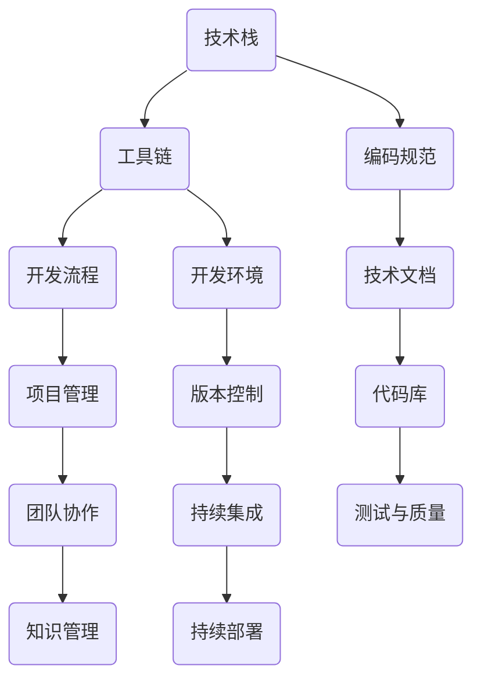

                 

### 如何建立技术团队的知识体系

在当今快速发展的技术时代，技术团队的知识体系成为了企业核心竞争力的重要组成部分。一个高效、完善的知识体系不仅能够提高团队的协作效率，还能促进技术创新和业务发展。因此，如何建立技术团队的知识体系成为了许多企业面临的重要课题。本文将逐步分析如何构建一个科学、系统且实用的技术团队知识体系，从基础知识与概念、团队协作与沟通、技术能力建设、项目管理与流程优化以及团队文化建设五个方面进行探讨。

### 一、基础知识与概念

**引言：技术团队知识体系的重要性**

技术团队的知识体系是团队持续发展和技术创新的基石。一个完善的知识体系不仅有助于团队成员掌握核心技能和知识，还能提高团队的整体效率。具体来说，知识体系的重要性体现在以下几个方面：

1. **技能传承**：通过系统化的知识体系，技术经验和管理经验能够得到有效的传承，避免因人员流动导致的知识断层。
2. **提高效率**：团队成员能够快速获取所需信息，减少重复劳动，提高工作效率。
3. **促进创新**：知识体系为团队成员提供了丰富的信息资源，有助于激发创新思维，推动技术进步。
4. **团队协作**：统一的知识体系有助于团队成员之间的沟通与协作，减少因信息不对称导致的误解和冲突。

**核心概念与联系**

为了构建一个高效的知识体系，我们首先需要明确核心概念及其相互关系。以下是一个简化版的Mermaid流程图，展示了技术团队知识体系的核心概念：

**知识体系的构建原则**

1. **知识分类与分层**：将知识按照不同维度进行分类和分层，例如按照技术领域、知识层次（基础知识、应用知识、创新知识）进行分类，便于管理和查找。
2. **知识获取与整理**：通过培训、学习、经验总结等方式获取知识，并对其进行整理和系统化。
3. **知识共享与传递**：建立知识共享机制，如知识库、内部培训、研讨会等，确保知识能够在团队内部有效传递。

### 二、团队协作与沟通

**团队协作模式**

1. **团队组织结构**：根据项目特点和企业文化，设计合适的团队组织结构，如矩阵式、职能式或项目式。
2. **团队沟通工具与技巧**：利用现代沟通工具（如Slack、Microsoft Teams、Zoom等）和沟通技巧（如主动倾听、清晰表达、有效反馈等）提高团队协作效率。

**知识共享与传递**

1. **知识管理工具与实践**：引入知识管理工具（如Confluence、Notion、GitLab等），实现知识的系统化管理。
2. **知识地图与知识库**：构建知识地图，明确知识结构和相互关系，建立知识库，方便团队成员查询和获取知识。

### 三、技术能力建设

**技术能力评估与提升**

1. **技术能力评估模型**：设计科学的技术能力评估模型，如基于KPI、360度评估等，对团队成员的技术能力进行量化评估。
2. **技术能力提升策略**：通过培训、外部合作、内部分享等方式提升团队成员的技术能力。

**技术学习与培训**

1. **技术学习的路径与方法**：制定明确的技术学习路径，采用自学、导师制、在线课程等多种学习方式。
2. **技术培训的实施与评估**：确保技术培训的内容和效果，通过定期评估和反馈进行改进。

### 四、项目管理与流程优化

**项目管理方法论**

1. **传统项目管理方法**：如PMP、敏捷开发等，结合项目特点和需求进行选择和应用。
2. **精益开发与敏捷方法**：采用精益开发思想，通过快速迭代、持续交付等方式提高项目效率。

**流程优化与改进**

1. **流程分析工具与方法**：利用流程图、价值流图等工具对现有流程进行分析和优化。
2. **流程改进案例与实践**：结合实际案例，探讨流程改进的方法和效果，为团队提供实践指导。

### 五、团队文化建设

**团队文化的建设与维护**

1. **团队价值观与使命**：明确团队的价值观和使命，形成共同的目标和信念。
2. **团队氛围与士气**：营造积极向上的团队氛围，提高团队成员的士气和工作满意度。

**团队激励机制**

1. **激励机制设计**：设计合理的激励机制，如绩效考核、晋升机制、奖励计划等，激发团队成员的积极性。
2. **奖励与惩罚机制**：建立明确的奖励与惩罚机制，确保团队成员的行为符合团队价值观和目标。

### 六、实战案例与总结

**实战案例研究**

通过实际案例，探讨不同类型的技术团队在知识体系建设中的实践经验和教训，为读者提供借鉴和启示。

**总结与展望**

对全文进行总结，指出技术团队知识体系建设的核心观点和关键点，并对未来技术团队知识体系建设的发展趋势进行展望。

### 七、文章小结

本文从基础知识与概念、团队协作与沟通、技术能力建设、项目管理与流程优化以及团队文化建设五个方面，详细阐述了如何建立技术团队的知识体系。通过合理构建和不断完善知识体系，技术团队将能够提高协作效率、促进技术创新和业务发展。希望本文能为企业在构建技术团队知识体系方面提供有益的参考。

### 作者信息

作者：AI天才研究院/AI Genius Institute & 禅与计算机程序设计艺术 /Zen And The Art of Computer Programming

### 关键词

技术团队、知识体系、团队协作、技术能力、项目管理、团队文化建设

### 文章摘要

本文深入探讨了如何构建一个科学、系统且实用的技术团队知识体系，从基础知识与概念、团队协作与沟通、技术能力建设、项目管理与流程优化以及团队文化建设五个方面进行了详细阐述，为企业提供了全面的指导和建议。通过合理构建和不断完善知识体系，技术团队将能够提高协作效率、促进技术创新和业务发展。希望本文能为企业在构建技术团队知识体系方面提供有益的参考。

