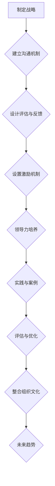
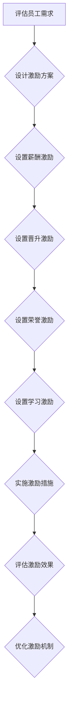

                 

## 第1章：技术团队的绩效文化概述

### 1.1 绩效文化的概念与重要性

#### 绩效文化的定义

绩效文化，是指在组织内部，通过共同的价值观和行为准则，形成一种对高绩效的追求和认可的文化氛围。它不仅包括明确的绩效目标设定，还涉及绩效评估、反馈机制、激励机制等具体操作方法。绩效文化是一种组织行为模式，它能够促进员工的工作动力，提高团队的绩效水平。

#### 绩效文化的重要性

1. **提升团队凝聚力**：绩效文化强调团队合作和共同目标，有助于增强团队成员之间的信任和协作。
2. **激发员工潜力**：明确的绩效目标和激励机制能够激发员工的工作热情，提高个人的工作质量和效率。
3. **促进组织成长**：良好的绩效文化能够推动组织的整体进步，使团队在面对挑战时能够保持灵活和适应性。
4. **增强竞争力**：在市场竞争激烈的今天，绩效文化能够帮助组织培养出具有竞争力的团队，从而在市场中立于不败之地。

#### 绩效文化与组织目标的关系

绩效文化是组织实现目标的重要保障。一个具有绩效文化的组织，能够在以下几个方面更好地实现组织目标：

1. **提高工作效率**：绩效文化鼓励高效工作，减少浪费，使资源得到最佳配置。
2. **增强创新能力**：绩效文化不仅关注当前的绩效，还鼓励创新和持续改进，有助于组织在行业中保持领先地位。
3. **提升员工满意度**：良好的绩效文化能够提高员工的职业成就感和归属感，从而降低员工流失率。
4. **优化组织结构**：绩效文化有助于组织不断优化内部结构，使其更加适应外部环境的变化。

### 1.2 技术团队绩效文化面临的挑战

#### 团队规模与绩效文化的关联

随着团队规模的扩大，绩效文化的建立和维护变得更加复杂。大型团队往往需要更加精细的管理和沟通机制，以确保绩效文化的一致性和有效性。以下是一些挑战：

1. **管理难度增加**：大型团队的管理成本增加，对领导者的管理能力提出了更高的要求。
2. **沟通效率降低**：随着团队成员的增加，沟通渠道和层次变得更加复杂，容易导致信息传递的滞后和失真。
3. **绩效评估的难度**：大型团队中的绩效评估需要更多的数据支持和评估方法，确保每个成员的贡献得到公正的评价。

#### 技术变革对绩效文化的影响

技术不断进步，给技术团队带来了新的挑战和机遇。以下是一些影响：

1. **技能更新需求**：技术团队需要不断学习新技术，以保持竞争力。这要求绩效文化能够鼓励持续学习和技能提升。
2. **团队协作模式的变化**：随着远程办公和分布式团队的兴起，绩效文化需要适应新的工作模式，确保团队成员之间的协作顺畅。
3. **项目管理的复杂性**：技术项目的规模和复杂度不断增加，绩效文化需要提供有效的项目管理工具和方法，帮助团队高效完成任务。

#### 团员多样性与绩效文化的融合

技术团队的多样性不仅体现在性别、年龄和文化背景上，还包括技能水平和专业背景的差异。以下是一些挑战：

1. **管理多样化团队**：领导者需要具备多元思维，理解和尊重团队成员的差异，确保团队文化的包容性和协同性。
2. **技能互补与平衡**：团队成员的多样性可以为团队带来不同的视角和技能，但同时也可能带来沟通和协作上的挑战，需要通过有效的绩效文化来平衡。
3. **绩效评估的公平性**：在多样性的团队中，确保绩效评估的公平性尤为重要，需要建立透明和客观的评估标准。

### 1.3 主流绩效文化模型解析

#### 绩效驱动的组织文化模型

这种模型强调以绩效为导向，通过明确的目标设定、严格的绩效评估和有效的激励机制，推动团队和个人追求高绩效。

1. **目标导向**：绩效驱动的文化注重目标的明确性和可衡量性，通过设定SMART目标（具体、可衡量、可实现、相关、时限性），确保团队成员的目标与组织目标一致。
2. **绩效评估**：通过定期的绩效评估，对团队成员的工作进行客观的评估，提供及时的反馈和改进建议。
3. **激励机制**：通过奖励机制，激励团队成员为实现组织目标做出更大的贡献。

#### 目标导向型绩效文化模型

目标导向型绩效文化模型强调以目标和结果为导向，鼓励团队成员自主设定目标并努力实现。

1. **自主设定目标**：团队成员根据组织目标和个人能力，自主设定目标，确保个人目标与团队目标的一致性。
2. **目标跟踪与反馈**：通过工具和机制，跟踪目标的进展情况，及时提供反馈，帮助团队成员调整方向和策略。
3. **激励机制**：通过激励措施，鼓励团队成员不断追求更高的目标，实现自我超越。

#### 激励型绩效文化模型

激励型绩效文化模型注重通过多种激励机制，激发团队成员的工作热情和创造力，推动团队整体绩效的提升。

1. **激励多样性**：采用多样化的激励方式，如薪酬激励、晋升激励、荣誉激励等，满足不同员工的需求。
2. **激励机制与价值观一致**：确保激励机制与组织的核心价值观相符，促进团队文化的建立和强化。
3. **个性化激励**：根据员工的特点和需求，提供个性化的激励措施，提高激励的效果。

## 第2章：建立绩效文化的核心要素

### 2.1 明确团队目标

#### 目标设定的原则

在建立技术团队绩效文化时，明确团队目标是至关重要的。以下是目标设定的几个关键原则：

1. **具体性（Specific）**：目标应当清晰明确，具体描述团队成员需要达成的成果和任务。
2. **可衡量性（Measurable）**：目标需要具备可衡量的标准，以便在后续的评估过程中能够客观判断是否达成目标。
3. **可实现性（Achievable）**：目标需要是可实现的，确保团队成员通过努力能够达成，同时也要有适当的挑战性。
4. **相关性（Relevant）**：目标应当与团队和组织的整体目标保持一致，确保团队成员的工作对组织的整体发展有积极的贡献。
5. **时限性（Time-bound）**：目标需要有明确的完成时限，以便团队成员能够集中精力，有计划地推进工作。

#### 如何制定SMART目标

SMART目标是一种有效的目标设定方法，它结合了上述五个原则。以下是一个SMART目标的示例：

- **具体（Specific）**：提高项目A的代码质量。
- **可衡量（Measurable）**：通过代码审查发现和修复的bug数量从每月10个减少到5个。
- **可实现（Achievable）**：团队成员具备相关的代码审查和修复技能，且项目时间允许。
- **相关（Relevant）**：提高代码质量将减少项目后期的维护成本，对项目的长期成功有重要影响。
- **时限性（Time-bound）**：目标需要在下个月的代码审查周期内实现。

通过制定SMART目标，技术团队能够更加清晰地了解自己的工作方向和期望成果，从而提高团队的凝聚力和工作效率。

#### 目标与个人发展的结合

在绩效文化的建设中，将团队目标与个人发展相结合是实现团队与个人双赢的关键。以下是一些建议：

1. **制定个人发展计划**：鼓励团队成员根据自己的职业规划，制定个人发展计划。这个计划应与团队目标相协调，确保个人发展能够为团队目标做出贡献。
2. **定期沟通与反馈**：定期与团队成员沟通，了解他们在实现目标过程中遇到的困难和需求，提供必要的支持和资源。
3. **将个人成就与团队目标关联**：确保团队成员能够看到自己的工作如何与团队目标相联系，从而增强他们的成就感和归属感。
4. **奖励与认可**：在团队达成目标的同时，也要对个人在实现目标过程中所做出的贡献给予认可和奖励，激发个人的工作动力和创造力。

通过将团队目标与个人发展有机结合，技术团队能够在追求卓越绩效的同时，促进团队成员的职业成长和满意度，从而建立一个更加健康和高效的绩效文化。

### 2.2 有效的沟通机制

#### 沟通的重要性

有效的沟通机制在建立技术团队绩效文化中扮演着核心角色。沟通不仅能够确保信息的准确传递，还能够增强团队协作，提升工作绩效。以下是一些沟通的重要性：

1. **确保信息传递的准确性**：良好的沟通机制能够确保信息在团队成员之间的传递过程中不失真，减少误解和冲突。
2. **促进团队协作**：有效的沟通能够促进团队成员之间的协作，确保每个人都能明确自己的任务和责任，从而提高工作效率。
3. **增强团队凝聚力**：通过积极的沟通，团队成员能够更好地理解彼此的角色和贡献，增强团队凝聚力和归属感。
4. **提升决策质量**：良好的沟通机制能够促进团队内部的信息共享和观点交流，有助于做出更加全面和高质量的决策。

#### 建立开放的沟通环境

建立开放的沟通环境是确保团队沟通有效性的基础。以下是一些关键步骤：

1. **鼓励双向沟通**：鼓励团队成员在沟通中积极表达自己的意见和想法，同时也要倾听他人的观点。这种双向沟通能够促进信息的充分交换。
2. **建立信任**：信任是开放沟通的基础。领导者需要通过透明和公正的行为建立信任，确保团队成员感到他们的意见和反馈能够被认真对待。
3. **提供反馈渠道**：确保团队成员有一个安全的环境，可以自由地表达他们的担忧和建议，而不用担心受到惩罚或歧视。
4. **定期团队会议**：定期组织团队会议，让每个成员都有机会分享他们的进展、挑战和想法。这些会议应该是一个开放和包容的讨论平台。

#### 沟通工具与技术

在技术团队中，选择合适的沟通工具和技术对于建立有效的沟通机制至关重要。以下是一些常用的工具和技术：

1. **电子邮件**：电子邮件是一种正式的沟通方式，适用于需要记录和文档化的信息交流。
2. **即时通讯工具**：如Slack、Microsoft Teams等，适用于快速交流和即时反馈。
3. **视频会议系统**：如Zoom、Microsoft Teams等，适用于远程团队和跨地域的沟通需求。
4. **项目管理工具**：如Jira、Trello等，可以帮助团队管理任务、跟踪进度和协作。
5. **文档共享平台**：如Google Docs、Confluence等，便于团队成员共享和编辑文档。

通过合理选择和使用这些沟通工具和技术，技术团队能够在各个层级和环节中保持高效和畅通的沟通，从而为绩效文化的建立提供有力支持。

### 2.3 绩效评估与反馈

#### 绩效评估的指标

在建立技术团队绩效文化时，绩效评估是一个关键环节。科学的绩效评估能够为团队成员提供明确的反馈，帮助他们不断提升工作表现。以下是一些关键的绩效评估指标：

1. **任务完成度**：衡量团队成员在预定时间内完成任务的百分比。任务完成度是评估工作效率和计划执行情况的重要指标。
2. **质量指标**：包括代码审查得分、Bug修复率、系统稳定性等。这些指标反映了团队成员的工作质量和项目成果的稳定性。
3. **团队协作**：评估团队成员在项目中的合作精神和协作能力，包括跨部门沟通、代码共享、知识传承等。
4. **创新与改进**：鼓励团队成员在项目中的创新思维和持续改进行为，如提出新功能、优化现有流程等。
5. **客户满意度**：对于面向客户的团队，客户满意度是一个重要的绩效评估指标，反映项目交付成果的用户体验。

#### 绩效评估的流程

一个有效的绩效评估流程应包括以下步骤：

1. **目标设定**：在项目启动时，与团队成员共同设定明确的绩效目标，确保目标与团队和组织的整体目标一致。
2. **任务分配**：根据目标，将任务分配给团队成员，明确每个人的职责和预期成果。
3. **过程监控**：在项目执行过程中，定期监控任务进展情况，确保团队成员在正确的轨道上工作。
4. **绩效评估**：在项目或任务完成后，对团队成员的工作进行综合评估，根据设定的绩效指标进行打分。
5. **反馈与改进**：向团队成员提供详细的绩效评估结果，讨论他们的优点和不足，并制定改进计划。

#### 反馈的技巧与策略

有效的反馈是绩效评估的重要部分，它能够帮助团队成员了解自己的表现，找到改进的方向。以下是一些反馈的技巧和策略：

1. **正面反馈**：首先强调团队成员的成就和优点，激励他们继续保持良好表现。
2. **具体和客观**：提供具体的反馈，说明团队成员在工作中的具体行为和成果，避免模糊和主观的评价。
3. **建设性反馈**：指出团队成员的不足，并提供具体的改进建议，帮助他们提升工作能力。
4. **及时反馈**：在问题出现时及时给予反馈，避免问题积累导致更大的影响。
5. **私下反馈**：尽量在私下进行反馈，保护团队成员的面子，避免公开场合下的尴尬和抵触情绪。

通过科学合理的绩效评估和有效的反馈机制，技术团队能够持续改进，不断提升工作绩效，从而建立和维护良好的绩效文化。

### 2.4 激励机制设计

#### 激励机制的种类

在技术团队中，激励机制的设计对于激发员工的工作热情和创造力至关重要。以下是一些常见的激励机制：

1. **薪酬激励**：通过提高薪资、奖金和福利等物质奖励，激发员工的工作动力。
2. **晋升激励**：为表现出色的员工提供晋升机会，让他们看到职业发展的前景。
3. **荣誉激励**：通过颁发荣誉证书、奖杯、奖项等荣誉形式，表彰员工的突出贡献。
4. **学习激励**：提供培训、学习机会，鼓励员工不断提升自己的技能和知识水平。
5. **工作环境激励**：营造一个舒适、开放和有激励性的工作环境，提高员工的工作满意度和归属感。
6. **灵活性激励**：提供灵活的工作安排，如远程办公、弹性工作时间等，以满足员工的不同需求。

#### 激励机制的合理设置

为了确保激励机制的有效性，需要根据团队成员的个性和需求进行合理设置。以下是一些关键点：

1. **了解员工需求**：通过调查问卷、访谈等方式，了解员工对薪酬、晋升、荣誉、学习和工作环境的期望和需求。
2. **差异化激励**：根据员工的不同特点和需求，提供个性化的激励措施，使激励机制更具吸引力。
3. **透明和公正**：确保激励机制透明和公正，让所有员工都明白激励条件和标准，避免不公平感。
4. **短期与长期激励相结合**：设置短期激励，如项目奖金、季度考核奖励等，以及长期激励，如晋升、股权激励等，以平衡短期绩效和长期发展。
5. **持续优化**：定期评估激励机制的有效性，根据反馈进行调整和优化，确保其始终符合团队和员工的需求。

通过合理设置激励机制，技术团队能够更好地激发员工的工作热情和创造力，从而提升团队的整体绩效和竞争力。

### 2.5 绩效文化的影响因素

#### 领导风格

领导风格在建立和维护技术团队绩效文化中扮演着重要角色。不同的领导风格会对团队成员的行为和绩效产生不同的影响：

1. **专制型领导**：这种领导风格通常由领导者制定所有决策，团队成员被动执行。这种风格可能会导致员工缺乏主动性和创造力，影响绩效文化的发展。
2. **民主型领导**：民主型领导鼓励团队成员参与决策过程，尊重员工的意见和贡献。这种领导风格能够促进团队成员之间的沟通和协作，有利于建立积极的绩效文化。
3. **变革型领导**：变革型领导通过激励和启发团队成员，推动他们实现超越自我目标的追求。这种领导风格能够激发员工的工作热情和创造力，有助于建立高绩效的文化。

#### 组织结构

组织结构对技术团队的绩效文化有深远的影响。以下是一些关键点：

1. **扁平化组织结构**：扁平化的组织结构减少了管理层级，提高了决策效率和沟通效率，有助于建立开放的绩效文化。
2. **矩阵式组织结构**：矩阵式组织结构通过跨部门和跨职能的协作，促进了不同团队之间的知识共享和资源整合，有助于建立协作和创新的文化。
3. **职能式组织结构**：职能式组织结构按照职能划分团队，有利于专业化和精细化分工，但在跨部门协作和沟通上可能存在一定的障碍，需要额外的机制来促进团队间的合作。

#### 企业文化

企业文化是组织内部的共同价值观和行为准则，对技术团队的绩效文化具有重要影响。以下是一些关键点：

1. **价值观的一致性**：企业的核心价值观应该与绩效文化相一致，确保员工在追求个人绩效的同时，也能够为组织的整体目标做出贡献。
2. **诚信与透明**：企业文化的诚信和透明度能够增强员工对组织的信任，促进开放和真诚的沟通，有利于绩效文化的建立。
3. **创新与学习**：鼓励创新和持续学习的文化能够激发团队成员的创造力，推动技术团队不断进步和成长。

#### 技术环境

技术环境是技术团队绩效文化的重要基础。以下是一些关键点：

1. **先进的工具和技术**：提供先进的工具和技术，使团队成员能够高效地完成任务，提高工作满意度。
2. **稳定的开发环境**：确保团队成员在一个稳定和可靠的开发环境中工作，减少技术问题带来的困扰，有助于保持良好的工作状态。
3. **持续的技术更新**：鼓励技术团队不断学习和更新技术知识，以适应快速变化的技术环境，保持团队的竞争力。

通过综合考虑领导风格、组织结构、企业文化和技术环境等多方面因素，技术团队能够建立和维护一个健康和高效的绩效文化，从而实现组织的长期发展目标。

## 第3章：领导力与绩效文化的建立

### 3.1 领导力在绩效文化中的作用

#### 领导者角色与职责

在建立技术团队的绩效文化中，领导者扮演着至关重要的角色。领导者的角色不仅包括制定目标和战略，还涉及激励和引导团队成员，确保绩效文化得以有效实施。

1. **设定愿景和目标**：领导者需要明确团队的愿景和目标，确保团队成员了解他们的工作对整体组织目标的重要性。
2. **激励团队成员**：领导者通过激励措施，激发团队成员的工作热情和创造力，推动他们达成更高的绩效。
3. **培养团队文化**：领导者需要积极培养和维护绩效文化，通过树立榜样和规范行为，推动团队形成积极向上的工作氛围。
4. **提供反馈和支持**：领导者应当为团队成员提供及时的反馈和必要的支持，帮助他们克服困难，不断提升工作能力。

#### 领导者如何影响团队文化

领导者的行为和决策对团队文化有深远的影响。以下是一些关键策略：

1. **树立榜样**：领导者通过自身的行为树立榜样，传递正确的价值观和行为准则，影响团队成员。
2. **透明沟通**：领导者应保持开放和透明的沟通，确保团队成员了解组织的目标、策略和决策过程，增强信任和归属感。
3. **鼓励反馈**：领导者鼓励团队成员提出意见和建议，建立一种开放和包容的文化，促进团队创新和持续改进。
4. **合理授权**：领导者通过合理授权，赋予团队成员更多的自主权，激发他们的责任感和创造力。

#### 领导力模型的应用

为了更好地理解领导力在绩效文化中的作用，可以借鉴一些经典的领导力模型：

1. **变革型领导**：变革型领导通过激励和启发团队成员，推动他们实现超越自我目标的追求。这种领导风格有助于建立积极向上的绩效文化，激发团队的创造力和创新精神。
2. **情境领导**：情境领导理论根据团队成员的不同成熟度，采取不同的领导风格。这种灵活的领导方式能够更好地适应团队的需求，促进绩效文化的有效实施。
3. **服务型领导**：服务型领导强调领导者为团队成员提供服务，帮助他们实现个人和职业发展。这种领导风格有助于建立信任和合作，促进团队文化的建设。

### 3.2 培养团队信任

#### 信任的定义与重要性

信任是建立高效团队和绩效文化的基础。信任是指团队成员对彼此的诚实、可靠和胜任能力的信任。以下是信任的几个重要方面：

1. **诚实**：团队成员之间的诚实是信任的基础。只有当团队成员彼此诚实，才能建立真正的信任关系。
2. **可靠性**：团队成员需要能够履行他们的承诺和责任，保持一致的行为和结果，这有助于建立可靠性。
3. **胜任能力**：团队成员需要相信彼此具有完成工作任务的能力，这种信任能够增强团队的协作和效率。

信任对绩效文化的重要性体现在以下几个方面：

1. **增强团队协作**：信任能够减少团队成员之间的摩擦和冲突，增强协作效率，提高整体绩效。
2. **提高创新力**：在信任的文化中，团队成员更愿意分享他们的想法和意见，这有助于促进创新和持续改进。
3. **减少监督成本**：信任能够减少对团队成员的过度监督和控制，降低管理成本，提高团队的自主性和灵活性。
4. **增强团队凝聚力**：信任能够增强团队成员之间的联系和凝聚力，使团队更加团结和协调。

#### 如何建立团队信任

建立团队信任需要时间和持续的努力。以下是一些关键步骤：

1. **透明沟通**：领导者应保持开放和透明的沟通，确保团队成员了解组织的目标、策略和决策过程，增强信任和归属感。
2. **信任承诺**：领导者应通过言行一致，树立信任的榜样，并鼓励团队成员做出信任的承诺。
3. **建立共同目标**：通过设定共同的目标和愿景，团队成员可以更加紧密地合作，增强信任。
4. **共享信息**：领导者应鼓励团队成员共享信息和资源，避免信息孤岛，增强透明度和协作。
5. **鼓励反馈**：领导者应鼓励团队成员提出意见和建议，建立一种开放和包容的文化，促进团队创新和持续改进。

通过以上步骤，技术团队能够逐渐建立起信任文化，为绩效文化的建设奠定坚实的基础。

### 3.3 持续改进与学习

#### 持续改进的文化建设

持续改进是技术团队保持竞争力的关键。建设一种持续改进的文化，能够推动团队成员不断追求卓越，提高工作效率和产品质量。

1. **设立改进目标**：团队应设定明确的改进目标，如提高代码质量、优化工作流程等，确保持续改进的方向和重点。
2. **建立反馈机制**：团队应建立有效的反馈机制，鼓励成员在项目中不断反思和总结经验教训，为改进提供依据。
3. **鼓励创新思维**：团队应培养创新思维，鼓励成员提出新的想法和解决方案，推动技术的不断进步。
4. **提供培训和支持**：团队应提供必要的培训和资源，帮助成员提升技能和知识，为持续改进提供能力保障。

#### 学习型团队的特征

学习型团队具有以下特征，能够有效推动团队的发展：

1. **共同愿景**：团队拥有共同的愿景和目标，成员对团队的未来充满信心和期待。
2. **相互学习**：团队成员之间积极分享知识和经验，相互学习和成长，提高整体团队的认知水平。
3. **自我反思**：团队成员经常进行自我反思，审视自己的行为和表现，不断寻找改进的机会。
4. **自主管理**：团队成员具备自主管理的能力，能够独立思考和解决问题，提高团队的工作效率。
5. **持续创新**：团队持续进行创新，不断探索新的技术和方法，推动团队的持续进步。

#### 如何培养学习型文化

要培养学习型文化，团队可以从以下几个方面着手：

1. **领导者的引领**：领导者应树立学习榜样，鼓励团队成员不断学习和成长，推动学习型文化的建设。
2. **知识共享**：团队应建立知识共享的平台和机制，鼓励成员分享知识和经验，促进知识的传播和应用。
3. **培训与学习**：团队应定期组织培训和研讨会，提供学习机会，帮助成员提升技能和知识水平。
4. **鼓励反思**：团队应建立反思机制，鼓励成员在项目结束后进行总结和反思，为未来的改进提供参考。
5. **激励与认可**：团队应设立激励和认可机制，鼓励成员积极参与学习和创新，提高团队的学习动力。

通过以上措施，技术团队能够逐渐培养出学习型文化，提高团队的整体素质和竞争力，为绩效文化的建设提供有力支持。

### 第4章：技术团队绩效文化的实践与案例

#### 4.1 实践案例分析

在技术团队的绩效文化建设中，成功的实践案例为其他团队提供了宝贵的经验和借鉴。以下是一些典型的实践案例分析：

**案例1：成功建立绩效文化的公司案例**

- **公司背景**：该公司是一家全球领先的软件开发公司，拥有多个大型技术团队。
- **实施步骤**：
  1. **目标设定**：公司首先明确长期愿景和短期目标，确保团队目标与公司目标一致。
  2. **培训与沟通**：公司组织了一系列培训活动，提高团队成员对绩效文化的理解，同时建立了开放和透明的沟通渠道。
  3. **绩效评估**：公司引入了科学的绩效评估系统，通过定期评估，提供详细的反馈和改进建议。
  4. **激励机制**：公司设置了多种激励机制，包括奖金、晋升和荣誉，以激励团队成员追求高绩效。
- **效果**：通过以上措施，公司的技术团队绩效显著提升，员工满意度和忠诚度也大幅增加。

**案例2：绩效文化改进的实际应用**

- **公司背景**：该公司是一家中小型软件开发企业，面临团队成员流动性大、工作效率不高的挑战。
- **实施步骤**：
  1. **领导力培养**：公司重点培养领导者的领导力，通过培训和管理实践，提高领导者的管理能力。
  2. **沟通机制优化**：公司建立了定期的团队会议和反馈机制，确保团队成员之间的沟通畅通。
  3. **改进绩效评估**：公司对绩效评估系统进行了调整，更加注重团队成员的贡献和团队协作。
  4. **激励制度优化**：公司重新设计了激励制度，增加了员工参与和反馈的机会，提高了激励的有效性。
- **效果**：通过绩效文化的改进，公司的团队协作显著增强，员工的工作满意度和工作效率都有所提升。

**案例3：绩效文化与团队绩效的提升**

- **公司背景**：该公司是一家技术创新型公司，重视技术团队的创新能力和绩效文化。
- **实施步骤**：
  1. **建立学习型文化**：公司鼓励团队成员持续学习和创新，建立了学习型团队。
  2. **透明沟通**：公司建立了开放的沟通环境，确保团队成员能够自由地表达意见和建议。
  3. **个性化激励**：公司根据团队成员的个人需求和职业发展，提供了个性化的激励措施。
  4. **持续改进**：公司通过定期的项目评估和反馈，推动团队的持续改进。
- **效果**：通过建立绩效文化和学习型文化，公司的技术团队在创新能力和团队绩效方面都有了显著提升，为公司的发展做出了重要贡献。

通过这些实践案例分析，我们可以看到，绩效文化的建立和改进需要从多个方面入手，包括目标设定、领导力培养、沟通机制优化、绩效评估和激励机制设计等。只有通过系统的实践和不断的优化，技术团队能够建立起健康和高效的绩效文化，从而提升团队的整体绩效和竞争力。

### 4.2 实施步骤

建立技术团队的绩效文化并非一蹴而就，而是一个系统化和持续的过程。以下是一些关键的步骤，可以帮助团队有效实施绩效文化的建设：

#### 步骤1：制定绩效文化的战略

1. **明确组织愿景和目标**：首先，组织需要明确其愿景和长期目标，确保绩效文化的建立与组织的发展方向一致。
2. **制定短期目标和关键绩效指标（KPIs）**：在明确长期目标的基础上，制定具体的短期目标和关键绩效指标，确保每个团队和成员都有明确的工作方向和衡量标准。
3. **制定绩效文化框架**：根据组织愿景和目标，制定绩效文化的框架，明确绩效文化的基本原则、核心价值观和核心行为准则。

#### 步骤2：实施绩效文化的关键活动

1. **培训和沟通**：为了确保团队成员对绩效文化有清晰的理解，组织应开展定期的培训和沟通活动，包括绩效管理培训、沟通技巧培训和团队建设活动等。
2. **建立透明和开放的沟通机制**：通过建立定期的团队会议、开放反馈渠道和内部沟通平台，促进团队成员之间的沟通和信息共享。
3. **制定和优化绩效评估流程**：确保绩效评估流程的公正、透明和可操作性，包括设定评估指标、制定评估标准和定期进行评估。

#### 步骤3：监控与调整

1. **定期监控绩效文化实施情况**：通过定期的员工满意度调查、绩效数据分析和团队反馈，监控绩效文化的实施效果，识别问题和改进机会。
2. **调整和优化绩效文化策略**：根据监控结果，及时调整和优化绩效文化策略，包括修改目标、改进激励机制和优化沟通机制等。
3. **提供持续支持**：通过提供培训、资源和指导，确保团队成员能够持续适应和践行绩效文化，实现个人和团队的目标。

通过以上步骤，技术团队能够系统地建立和实施绩效文化，逐步提升团队的整体绩效和竞争力。

### 第5章：技术团队绩效文化的评估与优化

#### 5.1 绩效文化的评估指标

为了有效评估技术团队绩效文化的实施效果，需要设立一系列具体的评估指标。以下是一些关键的绩效文化评估指标：

1. **团队协作度**：评估团队成员之间的协作情况，包括沟通效率、团队解决问题能力和共同完成任务的能力。
2. **员工满意度**：通过员工满意度调查，了解团队成员对绩效文化的认可程度和满意度，评估绩效文化的接受度和适应性。
3. **员工忠诚度**：评估员工对组织的忠诚度，包括员工流失率和员工在组织内的职业发展情况。
4. **绩效完成率**：评估团队和成员完成绩效目标的程度，包括任务的完成质量、进度和成果。
5. **创新与改进**：评估团队在技术、流程、产品等方面的创新和改进能力，反映绩效文化对团队成员积极性和创造力的影响。
6. **组织文化适应性**：评估绩效文化是否与组织整体文化相融合，确保绩效文化能够在组织内部得到广泛认同和支持。

#### 绩效文化成熟度模型

为了更系统地评估绩效文化的成熟度，可以采用绩效文化成熟度模型。以下是一个简单的绩效文化成熟度模型：

1. **初始阶段**：绩效文化尚未建立，团队成员对绩效文化和目标缺乏了解，绩效评估和反馈机制也不完善。
2. **初步建立阶段**：绩效文化开始建立，团队成员对绩效目标和评估标准有基本的了解，但尚未形成统一的价值观和行为准则。
3. **成熟阶段**：绩效文化已经深入人心，团队成员普遍认同和践行绩效文化，绩效评估和反馈机制完善，创新和改进能力显著提升。
4. **持续发展阶段**：绩效文化成熟且持续发展，团队成员始终保持高绩效状态，组织能够根据外部环境变化和内部需求不断优化绩效文化。

#### 评估工具与方法

为了有效地评估绩效文化，可以使用以下工具和方法：

1. **问卷调查**：通过设计问卷，了解团队成员对绩效文化的看法、满意度和建议。
2. **访谈**：与团队成员进行一对一访谈，深入了解他们对绩效文化的真实感受和反馈。
3. **绩效数据分析**：分析绩效数据和项目完成情况，评估绩效文化对团队绩效的影响。
4. **行为观察**：观察团队成员的工作行为，评估绩效文化在日常工作中的应用和效果。
5. **关键绩效指标（KPIs）**：根据设定的绩效文化评估指标，通过KPIs进行量化评估，确保评估的客观性和科学性。

#### 评估结果的应用

评估结果的应用是绩效文化优化的重要环节。以下是一些关键的应用步骤：

1. **识别问题和改进机会**：通过评估结果，识别绩效文化中的问题和改进机会，如沟通不畅、激励机制不合理等。
2. **制定改进计划**：根据识别的问题和改进机会，制定详细的改进计划，包括具体措施、责任人和时间表。
3. **实施改进措施**：根据改进计划，逐步实施改进措施，确保改进措施的落实和执行。
4. **监控改进效果**：在改进措施实施过程中，持续监控改进效果，及时调整和优化改进计划，确保绩效文化的不断优化和提升。

通过以上步骤，技术团队能够持续优化绩效文化，提升团队的整体绩效和竞争力。

### 5.2 优化策略

#### 改进绩效文化的方法

要优化技术团队的绩效文化，需要采取一系列具体的改进措施。以下是一些关键方法：

1. **强化领导力**：通过领导力培训和发展计划，提升领导者的管理能力和影响力，使他们能够更好地推动绩效文化的建立和维护。
2. **优化绩效评估体系**：对现有的绩效评估体系进行优化，确保评估指标科学合理，评估流程公正透明，以增强评估的准确性和有效性。
3. **加强员工参与**：鼓励员工参与绩效文化的建设，通过员工座谈会、意见征集等方式，让他们对绩效文化提出建议，提高他们的参与感和认同感。
4. **建立持续反馈机制**：建立有效的反馈机制，确保团队成员能够及时了解自己的绩效表现和改进方向，同时为团队的整体绩效提升提供反馈。

#### 克服绩效文化障碍的策略

在优化绩效文化的过程中，可能会遇到各种障碍。以下是一些克服障碍的策略：

1. **解决沟通问题**：通过定期团队会议、内部沟通平台和培训等方式，增强团队成员之间的沟通，解决信息不对称和沟通障碍。
2. **提高透明度**：通过提高决策的透明度，确保团队成员了解组织的战略目标和决策过程，增强他们对绩效文化的信任和认同。
3. **建立信任**：通过领导者的诚信行为和有效的沟通，建立团队之间的信任，减少误解和冲突，为绩效文化的实施创造良好的氛围。
4. **提供培训和支持**：为团队成员提供必要的培训和资源，帮助他们提升技能和知识，克服在绩效文化实施过程中遇到的技术和管理难题。

#### 持续优化与发展的路径

优化绩效文化是一个持续的过程，需要不断调整和改进。以下是一些持续优化与发展的路径：

1. **定期评估**：定期对绩效文化进行评估，了解其效果和存在的问题，及时调整和优化。
2. **学习与借鉴**：通过学习其他成功团队的绩效文化实践，借鉴其经验和方法，不断改进自己的绩效文化。
3. **创新与改进**：鼓励团队成员不断创新和改进，推动绩效文化的持续发展，以适应不断变化的外部环境和内部需求。
4. **建立反馈循环**：建立有效的反馈循环机制，确保团队成员能够持续反馈意见和建议，促进绩效文化的不断优化和提升。

通过以上策略和路径，技术团队能够不断优化绩效文化，提升团队的整体绩效和竞争力。

### 第6章：技术团队绩效文化与组织文化的整合

#### 6.1 组织文化与团队绩效文化的关系

组织文化和团队绩效文化之间存在着密切的关系，它们共同作用于团队和组织的长期成功。以下是这两个文化之间的联系和相互作用：

1. **相互强化**：一个健康和积极的组织文化可以支持和强化团队绩效文化，使团队成员更有动力去追求高绩效。反之，强大的团队绩效文化也能够推动组织文化的优化，提升整体组织效能。
2. **相互补充**：组织文化通常涵盖价值观、使命、愿景和行为准则，而团队绩效文化则侧重于具体的绩效目标、评估标准和激励机制。两者相互补充，共同构建出一个支持个人和团队发展的文化环境。
3. **相互影响**：组织文化对团队绩效文化有直接的影响，而团队绩效文化的变化也会反作用于组织文化。例如，一个强调创新和学习的团队绩效文化可能会推动组织整体向更加开放和创新的方向发展。

#### 建立一致性的价值观

要确保技术团队绩效文化与组织文化的一致性，关键在于建立共同的价值观。以下是一些关键步骤：

1. **明确组织核心价值观**：组织需要明确其核心价值观，并将其传达给所有团队成员，确保他们对这些价值观有清晰的理解。
2. **整合团队价值观**：技术团队应根据组织核心价值观，制定自身的价值观和行为准则，确保团队价值观与组织文化保持一致。
3. **培训和宣传**：通过定期的培训和宣传，确保团队成员对组织核心价值观和团队价值观有深刻的理解和认同。
4. **行为一致性**：领导者应当以身作则，通过自身的行为体现核心价值观，树立榜样，确保团队成员能够在实际工作中践行这些价值观。

#### 构建协作的文化环境

构建协作的文化环境是确保技术团队绩效文化与组织文化一致性的重要途径。以下是一些策略：

1. **促进跨部门合作**：通过跨部门项目、团队建设活动和协作平台，促进不同部门之间的沟通和合作，增强团队的协作精神。
2. **建立协作机制**：制定明确的协作流程和规范，确保团队成员在协作过程中能够高效沟通和合作，减少冲突和误解。
3. **鼓励知识共享**：鼓励团队成员分享知识和经验，建立知识共享的文化，促进团队整体的知识积累和创新。
4. **认可和奖励协作行为**：通过奖励和认可，鼓励团队成员积极参与协作，提高他们对协作文化的认同和积极性。

#### 促进组织文化的变革

技术团队的绩效文化可能会对组织文化产生积极的影响，但也可能需要组织文化的变革来更好地支持和推动绩效文化的实施。以下是一些促进组织文化变革的策略：

1. **高层支持**：获得组织高层的支持是推动文化变革的关键。领导者应当明确表达对绩效文化和文化变革的支持，确保变革得到组织的广泛认同。
2. **文化诊断**：通过文化诊断工具，分析现有组织文化的优势和不足，识别需要变革的领域和方向。
3. **制定变革计划**：根据文化诊断的结果，制定详细的变革计划，包括具体的变革目标、实施步骤和评估指标。
4. **培训和沟通**：通过定期的培训和沟通活动，提高团队成员对文化变革的理解和支持，确保变革计划的顺利实施。
5. **持续监督与反馈**：在变革实施过程中，持续监督变革的进展，及时收集反馈，根据实际情况调整和优化变革计划。

通过以上措施，技术团队能够与组织文化相互整合，建立一致性的价值观和协作的文化环境，推动组织文化的变革，从而实现团队和组织的共同发展。

### 第7章：技术团队绩效文化的未来趋势

#### 7.1 数字化转型对绩效文化的影响

数字化转型正在深刻改变技术团队的运营方式和绩效文化。以下是一些关键影响：

1. **自动化与人工智能**：随着自动化和人工智能技术的广泛应用，技术团队需要适应新的工作方式，如编写自动化脚本、使用AI工具进行数据分析和预测等。这要求团队成员具备新的技能和知识。
2. **远程办公与协作**：远程办公和协作工具的普及，使得团队成员不再受地域限制，但同时也带来了沟通和协作的挑战。绩效文化需要适应这种新的工作模式，确保团队成员之间的有效沟通和协作。
3. **数据分析与决策**：数字化转型带来了大量的数据，技术团队需要具备数据分析的能力，利用数据驱动决策，提高绩效和效率。
4. **持续学习与技能更新**：技术环境不断变化，团队成员需要持续学习新技能，以保持竞争力。绩效文化应鼓励和支持团队成员的持续学习和技能更新。

#### 持续学习与技能发展

持续学习与技能发展是技术团队保持竞争力的重要保障。以下是一些策略：

1. **培训与学习平台**：建立完善的培训和学习平台，提供丰富的在线课程和培训资源，方便团队成员随时学习。
2. **内部知识共享**：鼓励团队成员通过内部知识共享平台，分享经验、技巧和最佳实践，促进团队整体的知识积累和创新。
3. **职业发展计划**：为团队成员制定明确的职业发展计划，包括技能提升、晋升路径和职业规划，激励他们不断提升自己的能力和价值。
4. **外部学习资源**：推荐和资助团队成员参加行业会议、研讨会和专业培训，拓展他们的视野和知识。

#### 未来趋势展望

技术团队绩效文化的未来趋势将受到多种因素的影响，包括技术创新、组织变革和员工需求的变化。以下是一些未来趋势的展望：

1. **智能化绩效管理**：随着人工智能和大数据技术的应用，绩效管理将变得更加智能化和精准化，能够实时评估团队成员的表现并提供个性化的反馈和改进建议。
2. **灵活性工作模式**：远程办公和灵活工作时间的普及，将使绩效文化的实施更加灵活，团队需要适应这种新的工作方式，确保团队成员能够在不同环境下保持高绩效。
3. **扁平化组织结构**：随着信息透明度和团队协作效率的提升，扁平化组织结构将成为趋势，减少管理层级，提高决策效率和团队响应速度。
4. **注重员工体验**：未来的绩效文化将更加注重员工的体验和满意度，通过提供有吸引力的工作环境、灵活的工作安排和个性化的激励机制，提升员工的工作动力和忠诚度。
5. **可持续发展**：在可持续发展理念的推动下，技术团队将更加关注环境保护和社会责任，将可持续发展的目标纳入绩效文化中，促进组织的长期健康发展。

通过适应这些未来趋势，技术团队能够不断提升自身的绩效和文化，为组织的成功和持续发展做出贡献。

### 附录 A：绩效文化相关工具与资源

在建立和维护技术团队绩效文化过程中，可以使用多种工具和资源来提高效率和管理效果。以下是一些推荐的工具和资源：

#### 绩效文化评估工具

1. **Culture Amp**：一款全面的员工满意度调查工具，可以帮助组织评估绩效文化和员工体验。
2. **Gallup Q12**：一个经典的员工满意度调查工具，专注于员工参与度和敬业度。
3. **Pulse Survey**：用于定期收集员工反馈和满意度调查的工具，提供实时数据分析和报告。

#### 绩效管理软件

1. **Lattice**：一款集绩效评估、员工反馈和职业发展于一体的绩效管理软件。
2. **15Five**：一个简单易用的绩效管理平台，包括目标设定、反馈和职业发展等功能。
3. **Kenexa**：一款功能强大的绩效管理系统，提供详细的绩效数据和报告。

#### 相关书籍与参考文献

1. **《绩效文化：打造高效团队的七个关键要素》** - [克里斯·弗里曼（Chris Freeman）]
2. **《激发潜能：绩效文化的关键》** - [约翰·P·卡茨（John P. Kotter）]
3. **《绩效管理：实践指南》** - [威廉·J·卡佩拉诺（William J. Kaplan）和戴维·P·诺顿（David P. Norton）]

通过使用这些工具和资源，技术团队能够更好地评估和优化绩效文化，提升团队的整体绩效和员工满意度。

### 附录 B：Mermaid 流程图

#### B.1 绩效文化建立流程

以下是一个使用Mermaid语法编写的流程图，展示了技术团队建立绩效文化的主要步骤：



#### B.2 绩效评估流程

以下是另一个Mermaid流程图，展示了绩效评估的基本流程：

```mermaid
graph TD
    A[设定绩效目标] --> B[制定评估指标}
    B --> C{收集数据}
    C --> D[分析结果]
    D --> E{提供反馈}
    E --> F[行动计划]
    F --> G[持续改进]
```

#### B.3 激励机制设计

以下是一个用于描述激励机制设计的Mermaid流程图：



通过使用这些Mermaid流程图，技术团队可以更直观地理解和规划绩效文化建立和优化的各个步骤，从而提高绩效管理的效率和效果。

