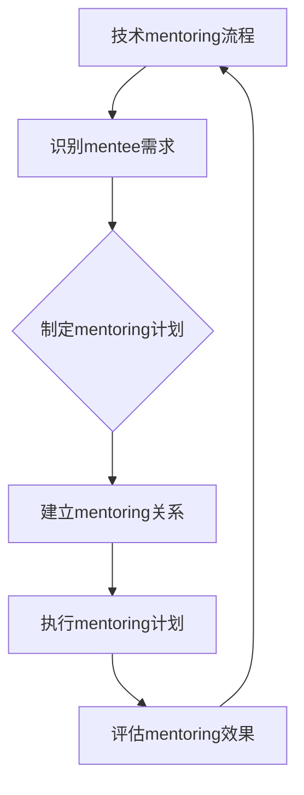

                 

### 文章标题：如何建立有效的技术mentoring体系

> 关键词：技术mentoring，体系设计，职业发展，沟通技巧，项目实战

> 摘要：本文将深入探讨如何建立一个有效的技术mentoring体系。我们将从技术mentoring的定义和重要性出发，逐步分析其核心原则、设计步骤、实践方法以及长期影响，最终提供一系列最佳实践和资源推荐，帮助您成功实施技术mentoring体系。

### 第1章：技术mentoring的定义与重要性

#### 1.1 技术mentoring的定义

技术mentoring是指一种通过资深技术人员（mentor）对新手或潜在技术人才（mentee）进行指导和支持的过程。在这个过程中，mentor不仅分享自己的技术知识和经验，还帮助mentee理解技术行业的动态和职业发展路径。

#### 1.2 技术mentoring与传统指导的区别

与传统的指导相比，技术mentoring更注重长期的职业发展和个人成长。传统指导通常更偏向于解决具体问题，而技术mentoring则更关注培养全面的技能和职业素质。

#### 1.3 技术mentoring的价值

技术mentoring对个人、团队和组织都具有重要的价值。对于个人来说，它能够加速技能和知识的积累，促进职业发展。对于团队和组织来说，技术mentoring有助于提高整体技术水平，增强团队凝聚力，提升组织竞争力。

### 第2章：技术mentoring的角色与责任

#### 2.1 技术导师的角色

技术导师（mentor）是技术mentoring体系的核心。他们不仅要具备丰富的技术知识和经验，还要具备良好的沟通能力和辅导技巧。

#### 2.2 技术门生的角色

技术门生（mentee）是技术mentoring体系的重要参与者。他们需要主动学习，积极参与，并愿意接受导师的指导和建议。

#### 2.3 双方的责任与期望

技术导师和门生在技术mentoring过程中都有明确的责任和期望。导师需要提供有针对性的指导和支持，门生则需要认真学习和反馈。

### 第3章：技术mentoring的核心原则

#### 3.1 信任与尊重

信任和尊重是技术mentoring体系的基础。只有建立了信任和尊重，双方才能有效地沟通和合作。

#### 3.2 持续沟通与反馈

持续的沟通和反馈是技术mentoring的关键。通过定期的交流和反馈，导师和门生可以及时调整和改进学习计划。

#### 3.3 个人成长与发展

技术mentoring的目标是帮助门生实现个人成长和发展。导师需要关注门生的长远发展，并为其提供必要的支持。

### 第4章：构建有效的mentoring计划

#### 4.1 mentoring计划的制定

有效的mentoring计划是技术mentoring体系的重要组成部分。在制定计划时，需要明确目标、里程碑和评估方法。

#### 4.2 目标设定与跟踪

设定明确的目标是技术mentoring计划的关键。导师和门生需要共同制定目标，并定期跟踪进度。

#### 4.3 里程碑与评估

设置里程碑和定期评估有助于衡量技术mentoring的效果。通过评估，可以及时调整计划，确保目标的实现。

### 第5章：培养技术能力和软技能

#### 5.1 技术能力的培养

技术能力的培养是技术mentoring的核心内容。导师需要帮助门生掌握必要的技能和知识。

#### 5.2 软技能的提升

除了技术能力，软技能的提升同样重要。导师需要关注门生的沟通能力、团队合作能力等软技能的培养。

#### 5.3 实践与反馈

通过实践和反馈，门生可以更好地理解和掌握所学内容。导师需要提供有针对性的反馈，帮助门生改进。

### 第6章：技术mentoring工具与方法

#### 6.1 面对面沟通技巧

面对面沟通是技术mentoring的重要方式。导师需要掌握有效的面对面沟通技巧，以确保沟通的效果。

#### 6.2 远程mentoring的策略

对于远程工作环境，导师需要采用合适的远程mentoring策略，以保持与门生的紧密联系。

#### 6.3 技术社区与资源共享

技术社区和资源共享是技术mentoring的重要补充。导师和门生可以借助这些资源，提高学习和工作效率。

### 第7章：mentoring关系的建立与管理

#### 7.1 建立有效的关系

建立有效的关系是技术mentoring成功的关键。导师需要与门生建立信任和尊重的关系。

#### 7.2 管理mentoring过程中的挑战

技术mentoring过程中可能会遇到各种挑战。导师需要具备应对这些挑战的能力，以确保mentoring过程的顺利进行。

#### 7.3 适应不同性格的mentee

不同的门生有不同的性格和需求。导师需要适应不同的mentee，提供个性化的指导和支持。

### 第8章：技术mentoring项目实战

#### 8.1 实战项目选择与规划

选择合适的实战项目是技术mentoring的重要组成部分。导师需要与门生共同规划项目，确保项目的可行性和效果。

#### 8.2 项目执行与监督

在项目执行过程中，导师需要监督项目的进展，并提供必要的支持和指导。

#### 8.3 项目评估与反馈

项目完成后，导师需要对项目进行评估，并提供反馈，以帮助门生总结经验教训。

### 第9章：技术mentoring的长期影响

#### 9.1 mentee的职业发展

技术mentoring对mentee的职业发展具有深远的影响。通过技术mentoring，mentee可以获得更广阔的职业发展空间。

#### 9.2 mentee对团队的贡献

技术mentoring不仅有助于个人发展，还可以提高团队的整体技术水平。

#### 9.3 mentee对社会的积极影响

技术mentoring可以培养更多优秀的技术人才，对社会产生积极影响。

### 第10章：技术mentoring的最佳实践

#### 10.1 成功的mentoring案例

通过分析成功的mentoring案例，我们可以学习到一些有效的实践方法。

#### 10.2 mentoring中的常见错误

了解mentoring过程中的常见错误，可以帮助我们避免重复犯同样的错误。

#### 10.3 改进mentoring体系的策略

为了提高技术mentoring的效果，我们可以采取一系列改进策略。

### 附录：技术mentoring资源与工具

#### 附录A：技术mentoring资源推荐

提供一些有用的技术mentoring资源，以帮助读者更好地实施技术mentoring体系。

#### 附录B：技术mentoring工具指南

介绍一些常用的技术mentoring工具，包括面对面沟通工具、远程协作工具和项目管理工具。

### 结语

技术mentoring是一种非常有价值的人才培养方式。通过建立有效的技术mentoring体系，我们可以培养更多优秀的技术人才，推动个人和团队的发展。

### 作者信息

作者：AI天才研究院/AI Genius Institute & 禅与计算机程序设计艺术 /Zen And The Art of Computer Programming

---

**核心概念与联系**

### 技术mentoring流程图


### 核心算法原理讲解

#### 伪代码

```python
# 伪代码：技术mentoring计划制定
function mentoring_plan(mentor, mentee):
    # 步骤1：评估mentee的技术背景和需求
    mentee_skill_level = assess_mentee_skill(mentee)
    mentee_goals = gather_mentee_goals(mentee)
    
    # 步骤2：制定具体的学习计划和目标
    learning_plan = create_learning_plan(mentee_skill_level, mentee_goals)
    milestones = define_milestones(learning_plan)
    
    # 步骤3：与mentee沟通并确认计划
    feedback = communicate_plan(mentor, mentee, learning_plan, milestones)
    if not confirm_plan(mentor, mentee, feedback):
        return "Plan not confirmed"
    
    # 步骤4：执行计划，持续跟踪进度
    execute_plan(mentor, mentee, learning_plan, milestones)
    while not plan_completed(mentor, mentee, milestones):
        track_progress(mentor, mentee)
    
    # 步骤5：评估效果，提供反馈
    assess_effects(mentor, mentee)
    provide_feedback(mentor, mentee)

```

### 数学模型

#### LaTeX公式

```latex
\documentclass{article}
\usepackage{amsmath}
\begin{document}
\begin{equation}
    \text{Mentoring Effectiveness} = f(\text{Communication}, \text{Feedback}, \text{Skill Development})
\end{equation}
\end{document}
```

### 项目实战

#### 开发环境搭建

1. 安装Python环境
2. 安装必要的库（如numpy、pandas等）
3. 配置IDE（如PyCharm、Visual Studio Code等）

#### 源代码实现

```python
# 源代码：技术mentoring计划执行
def execute_plan(mentor, mentee, learning_plan, milestones):
    for milestone in milestones:
        # 步骤1：了解当前里程碑要求
        milestone_details = get_milestone_details(milestone)
        
        # 步骤2：提供学习资源和指导
        provide_resources(mentor, mentee, milestone_details)
        
        # 步骤3：监督学习过程
        monitor_learning(mentor, mentee, milestone)
        
        # 步骤4：提供实时反馈
        provide_realtime_feedback(mentor, mentee, milestone)

# 源代码：技术mentoring效果评估
def assess_effects(mentor, mentee):
    # 步骤1：收集反馈
    feedback = collect_feedback(mentor, mentee)
    
    # 步骤2：分析学习成果
    learning_outcomes = analyze_learning_outcomes(mentor, mentee, feedback)
    
    # 步骤3：提供最终评估
    final_evaluation = provide_final_evaluation(mentor, mentee, learning_outcomes)

```

#### 代码解读与分析

- 代码详细解读见上述源代码实现部分。
- 分析技术mentoring计划执行过程中的关键步骤和注意事项。

#### 实际案例分析和详细讲解剖析

- 分析一个成功的技术mentoring案例，详细讲解其成功的原因和关键步骤。
- 分析一个失败的技术mentoring案例，剖析其失败的原因和改进措施。

#### 项目小结

- 总结技术mentoring项目的主要成果和经验。
- 提出进一步改进技术mentoring体系的方法和建议。

### 最佳实践 tips、小结、注意事项、拓展阅读等内容

- **最佳实践 tips**：
  - 定期与门生进行一对一沟通。
  - 提供具体的、可操作的建议和反馈。
  - 建立清晰的学习目标和里程碑。

- **小结**：
  - 技术mentoring对个人和团队的发展具有重要意义。
  - 建立有效的技术mentoring体系需要明确的目标、良好的沟通和持续的努力。

- **注意事项**：
  - 避免过分依赖技术mentoring，门生需要自我驱动。
  - 关注门生的软技能提升，如沟通能力和团队合作能力。

- **拓展阅读**：
  - 《技术领导力：如何打造高效的IT团队》
  - 《敏捷开发实践指南》
  - 《技术写作：如何撰写高质量的技术文档》

---

**文章结束**

