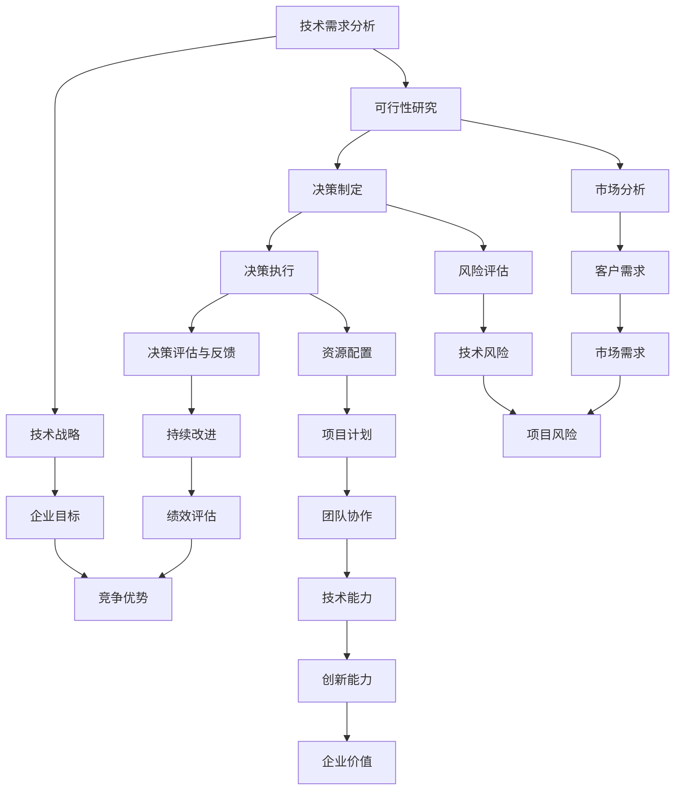

                 

## 文章标题

### 如何建立有效的技术决策机制？

> 关键词：技术决策、决策流程、决策方法、决策工具、案例分析、决策优化

> 摘要：本文旨在探讨如何建立有效的技术决策机制，从技术决策的背景、核心概念、决策流程、决策方法、决策工具、案例分析到决策优化，详细分析并介绍了一系列技术决策机制构建的方法和实践。

----------------------------------------------------------------

### 技术决策的背景

在当今快速变化的技术环境中，技术决策对企业的发展至关重要。技术决策不仅仅是对技术方案的选择，更是对企业战略方向、资源配置和竞争优势的全面考量。有效的技术决策机制能够帮助企业及时响应市场变化，抓住机遇，规避风险，实现长期可持续发展。

#### 技术决策的重要性

1. **战略定位：** 技术决策是企业在技术领域的战略选择，直接影响到企业的长期发展方向和竞争优势。
2. **资源配置：** 技术决策决定了企业的资源投入方向和力度，包括人力、资金、技术等。
3. **创新驱动：** 技术决策推动企业的技术创新，促进产品和服务升级，提高市场竞争力。
4. **风险控制：** 通过技术决策，企业可以评估和应对潜在的技术风险，降低不确定性带来的负面影响。

#### 技术决策与传统管理的差异

传统管理更注重流程和规范，而技术决策则强调创新性和灵活性。技术决策需要面对的不确定性和复杂性更高，因此需要更为科学和系统的决策方法。与传统管理相比，技术决策具有以下特点：

1. **动态性：** 技术环境和市场变化迅速，技术决策需要具备快速响应和调整的能力。
2. **创新性：** 技术决策鼓励创新思维，注重探索新的技术方向和应用场景。
3. **数据驱动：** 技术决策越来越多地依赖数据分析，以事实和证据为基础进行决策。

---

### 核心概念与联系

在构建有效的技术决策机制之前，我们需要明确一些核心概念，并理解它们之间的联系。以下是几个关键概念及其关系的Mermaid流程图：

#### 核心概念解释

1. **技术需求分析**：分析企业内外部环境，确定技术需求。
2. **可行性研究**：评估技术方案的实施可能性。
3. **决策制定**：基于分析结果，制定具体的决策方案。
4. **决策执行**：实施决策方案，进行资源调配和任务分配。
5. **决策评估与反馈**：对决策效果进行评估，并根据反馈进行改进。

#### 概念之间的关系

- **技术需求分析与决策制定**：技术需求分析是决策制定的基础，确保决策与实际需求相符。
- **决策制定与决策执行**：决策制定是决策执行的前提，决策执行是决策落实的过程。
- **决策评估与反馈**：决策评估与反馈是持续改进的关键环节，有助于优化决策流程。

---

在接下来的部分中，我们将深入探讨技术决策的具体流程、方法、工具以及实践案例，帮助读者建立全面的技术决策机制。请继续阅读，以获取更多宝贵的信息。

