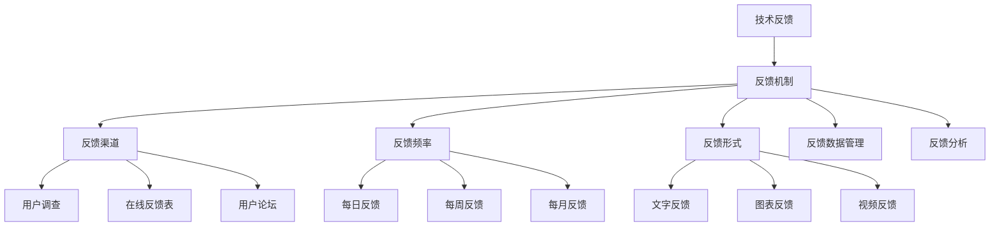

                 

### 文章标题

“如何建立有效的技术反馈机制”

> 关键词：技术反馈机制，设计原则，实践应用，优化策略，反馈效率

> 摘要：本文详细探讨了如何建立有效的技术反馈机制。通过分析技术反馈的基本概念、重要性及现状，提出了设计原则和方法，并结合实际案例展示了技术反馈在软件开发、IT服务管理和产品创新中的应用。文章最后提出了反馈机制的优化策略和未来展望，旨在帮助读者提升技术团队的反馈效率和质量。

### 目的

本文旨在为IT行业从业者提供一份全面、系统的技术反馈机制建立指南。文章首先介绍技术反馈的基本概念和重要性，接着深入讨论技术反馈机制的设计原则与方法，并通过具体案例展示其在实际中的应用。最后，文章将探讨如何评估和优化技术反馈机制，为技术团队的持续改进提供方向。通过本文的阅读，读者将能够：

1. 理解技术反馈的基本概念及其重要性。
2. 掌握建立有效技术反馈机制的设计原则与方法。
3. 了解技术反馈在不同领域的应用案例。
4. 学习如何评估和优化技术反馈机制。

### 背景介绍

在信息技术迅猛发展的今天，技术反馈机制已经成为提升产品和服务质量的重要手段。技术反馈机制是指通过系统化的方法，收集、处理和利用用户和团队成员的意见、建议和问题，以持续改进技术和产品的过程。有效的技术反馈机制不仅能够帮助企业快速响应市场需求，提高产品质量，还能增强团队协作，促进创新。

然而，当前许多企业在技术反馈机制的建立和实施过程中面临诸多挑战。一方面，技术反馈渠道单一、反馈频率低、反馈内容不具体，导致反馈信息难以充分利用。另一方面，缺乏有效的反馈数据管理和分析手段，使得反馈结果难以量化，影响决策的科学性和有效性。此外，反馈过程中的隐私保护和数据安全也引发了许多担忧。

因此，建立一套科学、高效的技术反馈机制，对于现代企业来说至关重要。有效的技术反馈机制能够：

1. 提高问题识别和解决速度，降低故障率和产品缺陷。
2. 增强用户满意度，提升产品市场竞争力。
3. 促进团队协作和知识共享，提升团队整体技术水平。
4. 驱动持续改进和创新，推动企业持续发展。

### 核心概念与联系

为了更好地理解技术反馈机制，我们需要明确几个核心概念及其相互关系。以下是几个关键概念的定义及它们之间的联系：

1. **技术反馈**：指通过系统化的方式，收集、处理和利用用户和团队成员的意见、建议和问题。
2. **反馈机制**：指用于实现技术反馈的一系列流程、工具和方法。
3. **反馈渠道**：指用于收集反馈信息的途径，如用户调查、在线反馈表、用户论坛等。
4. **反馈频率**：指反馈信息收集的频率，如每日、每周、每月等。
5. **反馈形式**：指反馈信息的呈现方式，如文字、图表、视频等。
6. **反馈数据管理**：指对收集到的反馈数据进行存储、整理和分析的过程。
7. **反馈分析**：指对反馈数据进行分析，以识别问题和机会的过程。

这些概念之间的关系可以用以下Mermaid流程图表示：

通过上述定义和关系图，我们可以更清晰地理解技术反馈机制的概念，并为后续的内容展开打下基础。

### 设计原则

建立有效的技术反馈机制需要遵循一系列设计原则，以确保反馈流程的全面性、准确性和及时性。以下是一些关键设计原则：

1. **目标明确**：在建立反馈机制之前，首先要明确反馈的目标和范围。这包括确定需要收集哪类反馈，以及这些反馈将如何用于改进技术和产品。明确的目标有助于确保反馈工作的方向性和有效性。

2. **渠道多样**：设计多样化的反馈渠道，以满足不同用户的需求。例如，可以结合在线反馈表、用户论坛、社交媒体、邮件等多种渠道。多样化的渠道有助于全面收集用户意见，提高反馈的覆盖面和代表性。

3. **频率适宜**：反馈频率应根据具体情况设定。过高的频率可能导致信息过载，影响反馈质量；而过低的频率则可能无法及时捕捉用户需求变化。一般而言，根据产品特性和用户群体特点，可以设定每日、每周或每月的反馈周期。

4. **形式灵活**：反馈形式应灵活多样，以适应不同用户和场景的需求。例如，可以采用文字、图表、视频等多种形式，使反馈内容更加直观、易懂。灵活的反馈形式有助于提高用户参与度和反馈质量。

5. **数据管理**：建立有效的数据管理机制，确保反馈数据的准确性、完整性和安全性。这包括数据收集、存储、整理和分析等环节。良好的数据管理有助于提高反馈信息的利用效率。

6. **隐私保护**：在收集和处理反馈信息时，必须严格遵守隐私保护原则，确保用户信息安全。例如，可以采用加密技术、匿名化处理等措施，防止用户信息泄露。

7. **反馈闭环**：建立反馈闭环机制，确保反馈结果能够及时反馈给相关团队和个人，并进行后续跟进和改进。反馈闭环有助于提高反馈机制的执行力和改进效果。

通过遵循上述设计原则，可以构建一套科学、高效的反馈机制，确保反馈工作的顺利进行，为技术改进提供有力支持。

### 实践应用

在实际操作中，技术反馈机制的建立和实施需要考虑多个方面，包括反馈团队的组建、反馈流程的设计和实施、以及反馈数据的管理。以下将详细探讨这些方面的具体做法。

#### 反馈团队的组建

1. **团队构成**：一个有效的反馈团队应包括产品经理、项目经理、开发人员、测试人员、用户支持人员等多个角色。每个角色在反馈过程中都有其特定的职责和作用。例如，产品经理负责定义反馈目标和范围，项目经理负责协调反馈工作，开发人员负责分析反馈问题并进行改进，测试人员负责验证改进效果。

2. **职责分配**：明确每个团队成员的职责，确保反馈工作有序进行。例如，产品经理负责收集和分析用户反馈，制定反馈处理计划；项目经理负责协调团队资源，确保反馈工作的按时完成；开发人员负责具体问题的分析和解决；测试人员则负责验证改进后的效果。

3. **培训与支持**：为团队成员提供必要的培训和支持，提高其反馈处理能力。例如，可以通过内部培训、外部咨询、在线课程等方式，帮助团队成员了解反馈机制的重要性、操作流程和方法，掌握相关技能。

#### 反馈流程的设计和实施

1. **收集反馈**：设计多种反馈收集渠道，如在线反馈表、用户论坛、社交媒体、邮件等。根据用户习惯和产品特性，选择合适的渠道进行反馈收集。例如，对于移动应用，可以通过推送通知、弹窗问卷等方式直接向用户收集反馈。

2. **分类整理**：将收集到的反馈按照类型和优先级进行分类整理。例如，可以将反馈分为功能性问题、性能问题、用户体验问题等，并按照严重程度和影响范围进行优先级排序。分类整理有助于快速识别关键问题和优先处理。

3. **分析处理**：对分类整理后的反馈进行分析和处理。例如，开发人员可以根据反馈内容进行问题定位和原因分析，制定具体的解决方案。测试人员则负责验证解决方案的有效性。

4. **反馈闭环**：建立反馈闭环机制，确保反馈结果能够及时反馈给相关团队和个人，并进行后续跟进和改进。例如，可以在项目管理工具中建立反馈跟踪功能，记录反馈处理进度和结果，确保每个问题都有明确的解决路径。

#### 反馈数据的管理

1. **数据收集**：采用自动化工具进行反馈数据的收集和存储。例如，可以使用API接口、日志分析工具等，实时收集用户反馈数据，并存储在数据库中。

2. **数据整理**：对收集到的反馈数据进行清洗、整理和分析。例如，可以采用数据挖掘和机器学习算法，对反馈数据进行分类和聚类，识别出共性问题和趋势。

3. **数据分析**：基于整理后的数据，进行深度分析，识别出关键问题和改进机会。例如，可以通过统计分析方法，分析反馈频率、严重程度和用户满意度等指标，评估反馈机制的效果。

4. **数据可视化**：将分析结果以可视化形式展示，帮助团队成员更直观地了解反馈情况。例如，可以使用图表、仪表盘等工具，展示反馈数据的分布、趋势和变化。

通过以上实践应用，可以确保技术反馈机制的有效建立和实施，提高反馈效率和改进效果，为技术改进提供有力支持。

### 应用案例

为了更好地理解技术反馈机制在实际操作中的应用，我们将通过以下三个案例进行详细探讨：软件开发中的技术反馈、IT服务管理中的技术反馈以及产品创新中的技术反馈。

#### 案例一：软件开发中的技术反馈

在软件开发过程中，技术反馈机制起着至关重要的作用。以下是一个典型的应用案例：

**1. 反馈收集**

- **开发阶段**：在软件开发的各个阶段，通过代码审查、用户测试等方式收集用户反馈。例如，在开发初期，可以通过用户访谈、问卷调查等方式了解用户需求。
- **发布后**：在软件发布后，通过用户论坛、在线反馈表、社交媒体等渠道收集用户反馈。例如，可以在应用商店、官方网站等地方设立反馈入口，方便用户提交反馈。

**2. 反馈利用**

- **问题识别**：对收集到的反馈进行分类整理，识别出共性问题和关键问题。例如，可以将反馈分为功能性问题、性能问题、用户体验问题等，并按照严重程度和影响范围进行优先级排序。
- **问题解决**：针对识别出的问题，开发团队进行问题定位和原因分析，制定具体的解决方案。例如，对于功能性问题，可以通过修改代码、优化算法等方式解决；对于性能问题，可以通过优化数据库查询、调整系统配置等方式解决。

**3. 负面反馈处理策略**

- **及时响应**：对于用户提交的负面反馈，开发团队应尽快响应，解决用户问题。例如，可以在24小时内回复用户，告知解决方案和进度。
- **用户沟通**：与用户保持积极沟通，了解用户需求和建议。例如，可以通过邮件、电话、在线聊天等方式与用户进行交流，获取更多反馈信息。

**4. 正面反馈激励措施**

- **奖励机制**：对积极提交反馈的用户给予奖励，例如积分、优惠券等。这不仅可以激励用户参与反馈，还可以提高用户的满意度和忠诚度。
- **公开表彰**：对提出重要改进建议的用户进行公开表彰，例如在官方网站、社交媒体等地方展示用户反馈和改进结果。

#### 案例二：IT服务管理中的技术反馈

在IT服务管理中，技术反馈机制同样发挥着重要作用。以下是一个典型的应用案例：

**1. 反馈机制**

- **用户满意度调查**：定期进行用户满意度调查，了解用户对IT服务的满意度和不满意度。例如，可以采用在线问卷、电话访谈等方式收集用户反馈。
- **服务台反馈**：设立服务台，收集用户遇到的技术问题和需求。例如，用户可以通过服务台提交问题工单，反馈服务过程中遇到的问题。

**2. 反馈处理**

- **问题分类**：对收集到的反馈进行分类整理，识别出共性问题和关键问题。例如，可以将反馈分为技术问题、服务态度问题、操作流程问题等，并按照严重程度和影响范围进行优先级排序。
- **问题解决**：针对识别出的问题，IT服务团队进行问题定位和原因分析，制定具体的解决方案。例如，对于技术问题，可以通过调整系统配置、升级软件版本等方式解决；对于服务态度问题，可以通过培训、激励等方式改善服务态度。

**3. 服务优化**

- **基于数据的反馈优化**：通过对反馈数据的分析，识别出服务改进的机会。例如，可以通过分析用户满意度调查结果，发现服务短板，制定针对性的优化措施。
- **持续改进**：建立持续改进机制，确保反馈结果能够及时应用到服务优化中。例如，可以制定定期服务评审会议，讨论反馈处理和优化方案，确保改进措施得到有效实施。

#### 案例三：产品创新中的技术反馈

在产品创新过程中，技术反馈机制同样发挥着关键作用。以下是一个典型的应用案例：

**1. 用户反馈收集**

- **原型测试**：在产品原型阶段，通过用户测试、用户体验等方式收集用户反馈。例如，可以通过线上问卷、用户访谈、焦点小组等方式获取用户意见和建议。
- **上市后**：在产品上市后，通过用户论坛、社交媒体、在线反馈表等渠道收集用户反馈。例如，可以在官方网站、应用商店等地方设立反馈入口，方便用户提交反馈。

**2. 反馈利用**

- **需求分析**：对收集到的用户反馈进行需求分析，识别出用户的真实需求和期望。例如，可以通过用户访谈、问卷调查等方式，了解用户对产品功能的期望、使用场景等。
- **产品改进**：基于用户反馈，进行产品改进和优化。例如，可以根据用户反馈，调整产品功能、优化用户界面、改进使用体验等。

**3. 创新驱动**

- **用户画像与需求分析**：通过用户反馈数据，建立用户画像，分析用户需求和行为模式。例如，可以通过数据分析工具，识别出高频用户、潜在用户等群体，制定有针对性的产品改进策略。
- **反馈循环**：建立反馈循环机制，确保用户反馈能够及时反馈到产品设计和开发中。例如，可以设立定期产品评审会议，讨论反馈处理和优化方案，确保改进措施得到有效实施。

通过以上三个案例，我们可以看到技术反馈机制在软件开发、IT服务管理和产品创新中的广泛应用。有效的技术反馈机制不仅能够帮助企业快速响应市场需求，提高产品质量，还能驱动创新，推动企业持续发展。

### 评估与改进

技术反馈机制的评估与改进是确保其持续有效运行的关键环节。以下将介绍评估反馈机制效果的方法、基于数据驱动的反馈优化策略、反馈机制的持续迭代以及如何通过组织文化的培养与反馈，实现技术反馈机制的持续改进。

#### 评估反馈机制效果的方法

1. **关键指标**：设定关键指标（KPI），用于评估反馈机制的效果。常见的关键指标包括：
   - **反馈率**：反馈数量与用户总数之比，反映用户参与度。
   - **处理速度**：从收到反馈到处理完成的时间，反映反馈机制的响应速度。
   - **反馈满意度**：用户对反馈处理结果满意度的评分，反映用户对反馈机制的整体感受。
   - **问题解决率**：解决反馈问题数量与总反馈数量之比，反映反馈机制的问题解决能力。

2. **数据分析**：通过数据分析工具，对反馈数据进行统计和分析，评估反馈机制的效果。例如，可以采用数据分析软件对反馈数据的分布、频率、趋势等进行分析，识别出存在的问题和改进机会。

3. **用户调查**：定期进行用户调查，收集用户对反馈机制的评价和建议。通过用户反馈，评估反馈机制的实用性和用户满意度。

#### 基于数据驱动的反馈优化策略

1. **数据挖掘**：利用数据挖掘技术，从反馈数据中挖掘出潜在的问题和趋势。例如，可以通过聚类分析、关联规则挖掘等方法，识别出共性问题和用户痛点。

2. **机器学习**：应用机器学习算法，对反馈数据进行分类和预测。例如，可以使用自然语言处理（NLP）技术，自动分类和分优先级，提高反馈处理效率。

3. **实时监控**：建立实时数据监控系统，对反馈数据实时收集、分析和反馈。例如，可以使用大数据平台，实现数据实时处理和可视化，帮助团队快速响应和处理问题。

#### 反馈机制的持续迭代

1. **定期回顾**：定期回顾反馈机制的实施情况，总结经验教训，识别改进机会。例如，可以设立定期反馈机制评审会议，讨论反馈处理效果和改进措施。

2. **持续优化**：根据评估结果和用户反馈，持续优化反馈机制。例如，可以调整反馈渠道、改进数据处理流程、优化反馈形式等，提高反馈机制的有效性。

3. **敏捷迭代**：采用敏捷开发方法，快速迭代反馈机制。例如，可以设立反馈迭代周期，不断收集用户反馈，快速改进反馈机制，实现持续优化。

#### 组织文化的培养与反馈

1. **鼓励反馈**：建立开放、包容的组织文化，鼓励员工和用户积极反馈。例如，可以设立反馈奖励机制，激励用户和员工提交反馈。

2. **反馈教育**：为员工提供反馈教育，提高其对反馈机制的理解和运用能力。例如，可以通过培训课程、内部讲座等方式，帮助员工了解反馈机制的重要性、操作方法和技巧。

3. **透明沟通**：建立透明的沟通机制，确保反馈结果能够及时、准确地传达给相关团队和个人。例如，可以在项目管理工具中建立反馈跟踪功能，记录反馈处理进度和结果，确保每个问题都有明确的解决路径。

通过以上方法，技术反馈机制可以持续改进，不断提高反馈效率和改进效果，为企业的持续发展提供有力支持。

### 总结

本文详细探讨了如何建立有效的技术反馈机制，从技术反馈的基本概念、设计原则、实践应用、评估与改进等方面进行了全面分析。通过具体案例展示了技术反馈在软件开发、IT服务管理和产品创新中的实际应用，强调了技术反馈机制在提升产品质量、驱动创新和优化服务中的重要性。

首先，技术反馈机制是现代企业提高产品质量、增强市场竞争力的关键手段。通过系统化的反馈流程，企业能够快速识别问题、优化产品和服务，实现持续改进和创新。

其次，建立有效的技术反馈机制需要遵循明确的目标、多样化渠道、适宜频率、灵活形式、数据管理和隐私保护等设计原则。这些原则确保了反馈机制的全面性、准确性和及时性，为技术改进提供了坚实基础。

在实践应用方面，技术反馈机制在软件开发、IT服务管理和产品创新中具有广泛的应用。通过反馈收集、分类整理、分析处理和反馈闭环等流程，企业能够有效利用用户和团队成员的意见，提高问题解决速度和改进效果。

最后，通过评估与改进，技术反馈机制可以持续优化，不断提高反馈效率和改进效果。组织文化的培养与反馈也至关重要，鼓励员工和用户积极反馈，建立开放、包容的沟通机制，推动技术反馈机制的持续发展。

展望未来，随着人工智能和大数据技术的发展，技术反馈机制将更加智能化、自动化。通过数据挖掘、机器学习和实时监控等技术手段，反馈机制将更加高效、精准，为企业的持续改进和创新提供更强支持。

总之，建立有效的技术反馈机制是现代企业不可或缺的一部分。通过系统化、科学化的反馈流程，企业能够不断提升产品质量和服务水平，实现可持续发展。

### 作者信息

作者：AI天才研究院/AI Genius Institute & 禅与计算机程序设计艺术 /Zen And The Art of Computer Programming

### 附录

#### 附录A：技术反馈机制设计工具与资源

**A.1 主流反馈工具介绍**

- **UserVoice**：一款功能强大的用户反馈管理工具，支持多种反馈渠道，如在线问卷、电子邮件、社交媒体等，提供数据分析功能，帮助企业快速识别问题和优化产品。
- **Zapier**：一款集成多个应用程序的自动化工具，可以实现用户反馈的自动化收集、分类和分配，提高反馈处理效率。
- **Google Form**：Google提供的免费在线问卷工具，支持多种题型，易于创建和管理，可以与Google Sheets等工具集成，实现反馈数据的自动整理和分析。

**A.2 技术反馈案例库**

- **GitHub**：GitHub上有大量关于技术反馈的案例和最佳实践，可以参考和借鉴，包括反馈渠道设计、数据处理和分析、反馈机制优化等方面的内容。
- **Stack Overflow**：Stack Overflow是一个面向程序员的技术问答社区，用户可以在此分享问题和解决方案，通过投票和评论功能，识别出有价值的问题和反馈。
- **Atlassian Jira**：Jira是一款流行的项目管理工具，支持反馈收集、跟踪和报告，适用于软件开发、IT服务管理等多个领域，通过Jira的反馈功能，可以建立高效的反馈闭环机制。

### 最佳实践 Tips

- **确保反馈渠道的多样性和便捷性**：设计多样化的反馈渠道，如在线问卷、用户论坛、社交媒体等，以满足不同用户的需求。同时，确保反馈渠道的便捷性，如提供简短、直观的反馈表单，方便用户快速提交反馈。
- **定期进行用户调查**：定期进行用户满意度调查，了解用户对产品或服务的整体感受和具体需求，及时发现潜在问题和改进机会。
- **建立反馈闭环机制**：确保反馈结果能够及时反馈给相关团队和个人，并进行后续跟进和改进。通过项目管理工具记录反馈处理进度和结果，确保每个问题都有明确的解决路径。
- **重视负面反馈**：负面反馈往往反映了用户的核心需求和痛点，应给予高度重视。及时响应负面反馈，积极解决问题，可以提升用户满意度和忠诚度。
- **培养反馈文化**：建立开放、包容的组织文化，鼓励员工和用户积极反馈。通过培训和教育，提高员工对反馈机制的理解和运用能力，推动组织整体反馈文化的建设。

### 小结

本文通过详细探讨如何建立有效的技术反馈机制，为读者提供了系统、全面的设计指南和实践案例。技术反馈机制在提升产品质量、驱动创新和优化服务中具有重要意义，通过遵循设计原则、优化反馈流程和持续改进，企业能够不断提高反馈效率和改进效果。希望本文能为读者在技术反馈机制的建立和实施过程中提供有益的参考和启示。

### 注意事项

- **数据隐私保护**：在收集和处理用户反馈时，务必遵守数据隐私保护原则，确保用户信息安全。
- **反馈渠道选择**：根据产品特性和用户习惯，选择合适的反馈渠道，确保用户能够方便地提交反馈。
- **及时性**：确保反馈处理的高效性和及时性，避免拖延和遗漏，提高用户满意度。
- **持续优化**：技术反馈机制应定期评估和优化，根据用户反馈和实际情况进行调整，确保其持续有效性。

### 拓展阅读

- **《用户体验要素》**：由唐纳德·诺曼（Donald Norman）所著，详细介绍了用户体验设计的方法和原则，对理解技术反馈机制的设计和实施具有重要意义。
- **《敏捷开发实践指南》**：由杰夫·萨瑟兰（Jeff Sutherland）所著，介绍了敏捷开发的方法和实践，对于建立高效的技术反馈机制具有重要的参考价值。
- **《数据分析方法与应用》**：由张江涛所著，介绍了数据分析的基本方法和应用场景，对于利用数据优化技术反馈机制具有重要参考意义。

