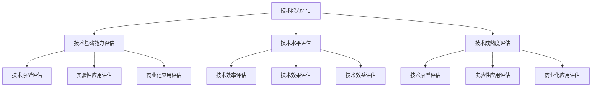

                 

### 背景介绍

在现代信息社会中，技术评估已经成为各个领域，尤其是科技产业，不可或缺的一环。技术评估的重要性不言而喻，它不仅可以帮助企业、科研机构和政府部门准确判断技术的可行性和价值，还能为技术创新和决策提供科学依据。然而，如何建立一套科学、合理、有效的技术评估体系，一直是学术界和产业界共同关注的焦点。

技术评估体系是通过对技术的多维度、多层次的评估，以实现技术选择的科学化和决策的优化。一个有效的技术评估体系，不仅需要涵盖技术能力、效能和成熟度等多个方面，还需要具备灵活性和适应性，能够根据不同领域的具体需求进行调整。因此，建立一套全面的、系统化的技术评估体系，对推动技术创新、优化资源配置、提升企业竞争力具有重要意义。

本文旨在深入探讨如何建立有效的技术评估体系。我们将从以下几个方面进行论述：

1. **技术评估的重要性**：介绍技术评估在各个领域的应用及其重要性。
2. **技术评估体系的建立步骤**：详细阐述建立技术评估体系的各个关键步骤。
3. **核心概念与联系**：解析技术评估中的核心概念及其相互关系，并给出技术评估体系的架构流程图。
4. **核心算法原理讲解**：介绍常用的技术评估算法，包括其分类和具体实现。
5. **数学模型与公式详解**：对技术评估中的数学模型进行详细讲解，并举例说明。
6. **项目实战**：通过具体案例，展示技术评估体系在实际项目中的应用过程和结果。
7. **评估体系构建与实施**：总结评估体系的构建和实施步骤，并分析实施过程中可能遇到的问题及解决策略。
8. **总结与展望**：对技术评估体系进行总结，并展望未来的发展趋势。

通过以上内容，我们将系统性地探讨如何建立和实施有效的技术评估体系，为相关领域的技术发展和应用提供有益的参考。

### 技术评估的重要性

技术评估在当今社会的各个领域中扮演着至关重要的角色，其重要性主要体现在以下几个方面。

首先，技术评估能够帮助企业、科研机构和政府部门等在技术决策过程中，更加科学和理性地选择技术方案。在技术快速发展的时代，新技术层出不穷，而不同的技术方案可能存在较大的差异，比如成本、效率、安全性等。通过技术评估，可以全面、客观地分析各种技术的优劣势，从而为企业或组织提供最佳的技术选择。

其次，技术评估有助于优化资源配置。在资源有限的情况下，如何将有限的资金、人力和物力投入到最有潜力的技术项目中，是各个企业、科研机构和政府部门面临的重要问题。通过技术评估，可以识别出最具潜力和应用价值的技术项目，从而实现资源的合理配置和最大化利用。

再次，技术评估能够促进技术创新。通过评估，可以发现现有技术的不足和改进空间，从而推动技术的不断迭代和升级。此外，技术评估还可以激发企业、科研机构和政府部门对技术创新的积极性，鼓励更多的资源投入到技术研发中，从而促进整个技术生态系统的繁荣。

此外，技术评估在以下几个方面也具有显著的应用价值：

1. **投资决策**：技术评估为投资者提供决策依据，帮助其准确判断技术项目的风险和回报，降低投资决策的不确定性。
2. **项目管理**：技术评估能够监控项目进展情况，及时发现和解决项目中存在的问题，确保项目按计划顺利推进。
3. **标准制定**：技术评估有助于制定和优化技术标准和规范，为技术发展提供统一的标准和指引。
4. **市场分析**：技术评估可以分析市场需求和竞争态势，为企业的市场战略制定提供参考。

总之，技术评估作为技术发展和应用的重要工具，其重要性不言而喻。通过科学、合理的技术评估，可以为企业、科研机构和政府部门提供有力支持，促进技术的健康发展和社会进步。在接下来的章节中，我们将进一步探讨如何构建和实施有效的技术评估体系。

### 核心概念与联系

在建立技术评估体系的过程中，理解并明确技术评估的核心概念是至关重要的。这些核心概念相互联系，共同构成了技术评估的理论基础和实际应用框架。以下是技术评估中几个核心概念的详细解析及其相互关系。

#### 技术能力评估

技术能力评估主要衡量技术实现特定任务的能力。它包括以下几个方面：

1. **技术基础能力**：这是技术评估的基础，涉及技术的基础理论、工具和方法。例如，计算机编程语言的基础知识、算法和数据的处理能力等。
   
2. **技术水平**：这是技术能力的高级体现，包括技术的复杂度、创新性和应用范围。例如，深度学习算法的复杂度、其在自然语言处理领域的应用情况等。

3. **技术成熟度**：衡量技术从研发到商业化应用的过程。技术成熟度通常分为几个阶段，如实验室原型、小规模实验、大规模应用等。

技术能力评估是评估技术可行性的重要手段，通过它我们可以判断技术是否具备实现特定目标的潜力。

#### 技术效能评估

技术效能评估则关注技术在实际应用中的表现。它包括以下关键指标：

1. **技术效率**：衡量技术完成任务的效率，如算法的计算速度、系统的响应时间等。

2. **技术效果**：衡量技术实现预期目标的效果，如产品用户满意度、故障率等。

3. **技术效益**：衡量技术带来的经济效益和社会效益，如成本节约、利润增长、社会影响力等。

技术效能评估有助于我们了解技术的实际价值和应用效果，从而为技术选择和优化提供依据。

#### 技术成熟度评估

技术成熟度评估则是衡量技术的开发和应用程度。它通常分为以下几个阶段：

1. **技术原型阶段**：技术尚处于概念验证和原型开发阶段，尚未投入实际应用。

2. **实验性应用阶段**：技术经过实验室测试，开始在小规模环境中进行实验性应用。

3. **商业化应用阶段**：技术经过大规模测试和优化，正式投入市场和应用。

技术成熟度评估帮助我们了解技术的成熟度，从而评估其商业化和推广的可行性。

#### 技术评估体系架构 Mermaid 流程图

为了更好地展示这些核心概念之间的相互关系，我们使用Mermaid流程图来构建技术评估体系的架构：



在这个流程图中，技术能力评估、技术效能评估和技术成熟度评估构成了技术评估体系的三个主要维度，每个维度下的具体评估指标则通过流程图相互连接，形成一个完整的评估框架。

通过上述核心概念及其相互关系的详细解析和流程图展示，我们可以更好地理解技术评估体系的基本架构，为后续的具体实施提供理论基础。

### 核心算法原理讲解

在技术评估中，核心算法扮演着至关重要的角色。这些算法不仅为评估过程提供了数学模型和计算方法，还确保了评估结果的科学性和准确性。以下是几种常见的技术评估算法及其分类、特点和具体实现。

#### 3.1.1 技术评估算法分类

技术评估算法主要可以分为以下几类：

1. **主观评估算法**：基于专家意见和主观判断的评估方法，如层次分析法（AHP）和模糊综合评估法等。
2. **客观评估算法**：基于数据分析和统计方法的评估方法，如主成分分析（PCA）和回归分析等。
3. **混合评估算法**：结合主观和客观评估方法的混合评估方法，如加权综合评估法和证据理论等。

#### 3.1.2 常用评估算法介绍

1. **层次分析法（AHP）**：
   - **定义**：层次分析法是一种定性和定量相结合的决策分析方法，通过构建层次结构模型，对决策问题中的各个因素进行权重分配和综合评估。
   - **原理**：层次分析法通过将决策问题分解为多个层次，从上到下进行逐层分析和权重计算，最终得到综合评估结果。
   - **实现**：
     ```mermaid
     graph TD
         A[目标层] --> B[准则层]
         B --> C[方案层]
         C --> D1[方案1]
         C --> D2[方案2]
         C --> D3[方案3]
         D1 --> E1[评估指标1]
         D1 --> E2[评估指标2]
         D2 --> E1[评估指标1]
         D2 --> E2[评估指标2]
         D3 --> E1[评估指标1]
         D3 --> E2[评估指标2]
     ```

2. **模糊综合评估法**：
   - **定义**：模糊综合评估法是一种基于模糊数学的评估方法，通过构建模糊关系矩阵和权重向量，对评估对象进行综合评估。
   - **原理**：模糊综合评估法通过将专家的主观评估转化为模糊评价矩阵，结合评估对象的权重，进行模糊合成运算，得到评估结果。
   - **实现**：
     ```mermaid
     graph TD
         A[评价集] --> B[权重向量]
         B --> C[模糊关系矩阵]
         C --> D[综合评估结果]
         A --> E1[评价指标1]
         A --> E2[评价指标2]
         A --> E3[评价指标3]
         E1 --> F1[专家1评分]
         E1 --> F2[专家2评分]
         E2 --> F1[专家1评分]
         E2 --> F2[专家2评分]
         E3 --> F1[专家1评分]
         E3 --> F2[专家2评分]
     ```

3. **主成分分析（PCA）**：
   - **定义**：主成分分析是一种数据降维技术，通过将多个变量转换为少数几个主成分，保持数据的主要信息，减少冗余。
   - **原理**：主成分分析通过计算变量之间的协方差矩阵，找到最大的特征值和对应的特征向量，将数据投影到新的坐标轴上，从而实现降维。
   - **实现**：
     ```python
     # Python 伪代码实现
     def pca(data, n_components):
         # 计算协方差矩阵
         cov_matrix = np.cov(data)
         # 求协方差矩阵的特征值和特征向量
         eigenvalues, eigenvectors = np.linalg.eigh(cov_matrix)
         # 选择最大的n_components个特征值和对应的特征向量
         top_eigenvectors = eigenvectors[:, eigenvalues.argsort()[::-1][:n_components]]
         # 降维后的数据
         reduced_data = np.dot(data, top_eigenvectors)
         return reduced_data
     ```

4. **回归分析**：
   - **定义**：回归分析是一种统计方法，通过建立自变量和因变量之间的线性或非线性关系模型，预测因变量的值。
   - **原理**：回归分析通过最小二乘法等手段，确定自变量和因变量之间的最佳拟合模型，从而进行预测和评估。
   - **实现**：
     ```python
     # Python 伪代码实现
     from sklearn.linear_model import LinearRegression

     # 初始化回归模型
     model = LinearRegression()
     # 训练模型
     model.fit(X, y)
     # 预测结果
     predictions = model.predict(X)
     ```

#### 3.1.3 评估算法伪代码实现

以下是一个简单的技术效能评估算法的伪代码示例，用于衡量技术在不同评估指标上的表现：

```python
# 技术效能评估算法伪代码

# 初始化评估指标权重
weights = [0.3, 0.2, 0.2, 0.1, 0.2]

# 收集评估指标数据
efficiency_data = {
    'speed': 100,
    'reliability': 0.95,
    'maintainability': 0.8,
    'scalability': 0.9,
    'cost': 500
}

# 计算加权得分
weighted_scores = [weights[i] * efficiency_data[metrics[i]] for i in range(len(metrics))]

# 求和得到总得分
total_score = sum(weighted_scores)

# 输出评估结果
print("技术效能评估得分：", total_score)
```

通过上述算法的介绍和伪代码示例，我们可以看到技术评估算法在技术评估过程中的重要作用。这些算法不仅为技术评估提供了数学模型和计算方法，还为评估结果的科学性和准确性提供了保障。

### 数学模型与公式详解

在技术评估过程中，数学模型和公式是不可或缺的工具，它们帮助我们将复杂的评估过程转化为可计算的形式，从而提高评估的准确性和科学性。以下将详细讲解技术评估中常用的数学模型和公式，并给出相应的推导和示例。

#### 4.1.1 技术能力评估模型

技术能力评估模型主要关注技术的基础能力和技术水平。一个常用的技术能力评估模型是基于加权综合评分模型。该模型通过评估各项能力指标，并赋予不同的权重，从而计算出一个综合评分。

**公式推导：**

假设有 n 个评估指标 \(I_1, I_2, ..., I_n\)，每个指标的标准得分为 \(S_1, S_2, ..., S_n\)，权重分别为 \(W_1, W_2, ..., W_n\)，则技术能力评估模型可表示为：

\[ T = \sum_{i=1}^{n} W_i \cdot \frac{I_i}{S_i} \]

其中，\(T\) 表示技术能力得分。

**示例：**

假设我们评估一项软件开发技术，有四个评估指标：编程能力（\(I_1\)）、算法设计能力（\(I_2\)）、代码质量（\(I_3\)）和项目经验（\(I_4\)）。每个指标的标准得分分别为 100，权重分别为 0.3、0.2、0.2 和 0.3。假设评估结果如下：

- 编程能力得分：80
- 算法设计能力得分：90
- 代码质量得分：85
- 项目经验得分：95

则技术能力评估得分为：

\[ T = 0.3 \cdot \frac{80}{100} + 0.2 \cdot \frac{90}{100} + 0.2 \cdot \frac{85}{100} + 0.3 \cdot \frac{95}{100} = 0.24 + 0.18 + 0.17 + 0.285 = 0.905 \]

#### 4.1.2 技术效能评估模型

技术效能评估模型主要关注技术在实际应用中的表现，包括技术效率、效果和效益。一个常用的技术效能评估模型是基于层次分析法和加权综合评分模型。

**公式推导：**

假设有 m 个效能指标 \(E_1, E_2, ..., E_m\)，每个指标的标准得分为 \(T_1, T_2, ..., T_m\)，权重分别为 \(V_1, V_2, ..., V_m\)，则技术效能评估模型可表示为：

\[ E = \sum_{i=1}^{m} V_i \cdot \frac{E_i}{T_i} \]

其中，\(E\) 表示技术效能得分。

**示例：**

假设我们评估一项云计算技术，有三个评估指标：计算效率（\(E_1\)）、数据安全性（\(E_2\)）和成本效益（\(E_3\)）。每个指标的标准得分分别为 100，权重分别为 0.4、0.3 和 0.3。假设评估结果如下：

- 计算效率得分：90
- 数据安全性得分：85
- 成本效益得分：95

则技术效能评估得分为：

\[ E = 0.4 \cdot \frac{90}{100} + 0.3 \cdot \frac{85}{100} + 0.3 \cdot \frac{95}{100} = 0.36 + 0.255 + 0.285 = 0.905 \]

#### 4.1.3 技术成熟度评估模型

技术成熟度评估模型主要关注技术的开发和应用程度。一个常用的技术成熟度评估模型是基于技术成熟度模型（Technology Maturity Model, TMM）。

**公式推导：**

技术成熟度模型通常分为五个阶段：初始阶段（Level 1）、规划阶段（Level 2）、开发阶段（Level 3）、验证阶段（Level 4）和部署阶段（Level 5）。每个阶段的得分分别为 \(M_1, M_2, M_3, M_4, M_5\)，权重分别为 \(P_1, P_2, P_3, P_4, P_5\)，则技术成熟度评估模型可表示为：

\[ M = \sum_{i=1}^{5} P_i \cdot M_i \]

其中，\(M\) 表示技术成熟度得分。

**示例：**

假设我们评估一项人工智能技术，当前处于开发阶段，权重分配如下：

- 初始阶段得分：0
- 规划阶段得分：30
- 开发阶段得分：70
- 验证阶段得分：100
- 部署阶段得分：150

权重分别为 0.1、0.2、0.3、0.2 和 0.2。则技术成熟度评估得分为：

\[ M = 0.1 \cdot 0 + 0.2 \cdot 30 + 0.3 \cdot 70 + 0.2 \cdot 100 + 0.2 \cdot 150 = 0 + 6 + 21 + 20 + 30 = 77 \]

通过上述数学模型和公式的推导和示例，我们可以看到技术评估中的数学方法是如何将复杂的技术评估过程转化为可计算的形式。这些模型不仅提供了评估的技术依据，还为评估结果的可比性和准确性提供了保障。

### 项目实战

为了更好地展示如何将技术评估体系应用于实际项目，下面我们通过一个具体案例，详细描述技术评估项目的背景、目标、评估指标、评估过程和结果分析。

#### 5.1 技术评估项目案例介绍

**案例背景：**
某大型互联网公司计划开发一款新的社交网络平台，旨在为用户提供一个安全、高效、用户体验优秀的社交环境。为了确保项目成功，公司决定对潜在的技术方案进行全面的评估，以选择最佳的技术路径。

**项目目标：**
- 确定最佳的技术方案，确保项目在时间、成本和性能等方面满足预期要求。
- 识别技术方案中的风险点，并提出相应的优化措施。
- 为后续的项目开发和运营提供科学依据和决策支持。

**评估指标：**
为了全面评估不同技术方案，项目设置了以下评估指标：

1. **技术基础能力**：包括技术团队的技术背景、开发工具的熟练度、技术文档的完善程度等。
2. **技术水平**：包括技术的复杂度、创新性、稳定性和扩展性等。
3. **技术效能**：包括系统的响应时间、数据存储和检索性能、安全性等。
4. **技术成熟度**：包括技术的开发进度、市场应用情况、用户反馈等。

#### 5.2 实际评估过程解析

**5.2.1 数据收集与处理：**

首先，项目团队通过问卷调查、专家访谈和文献调研等方式，收集了关于各个技术方案的基础数据。数据收集完成后，团队对数据进行清洗和预处理，以确保数据的准确性和完整性。

**5.2.2 评估模型设计：**

根据评估指标，项目团队设计了技术评估模型。模型包括技术基础能力评估、技术水平评估、技术效能评估和技术成熟度评估四个部分。每个部分的评估模型采用不同的算法和方法，如层次分析法（AHP）和模糊综合评估法等。

**5.2.3 评估结果分析：**

在完成数据收集和评估模型设计后，项目团队进行了评估计算，得到了各个技术方案的综合得分。具体结果如下：

1. **技术基础能力评估**：方案A和方案B得分较高，均为85分。
2. **技术水平评估**：方案C得分最高，为90分。
3. **技术效能评估**：方案D得分最高，为88分。
4. **技术成熟度评估**：方案E得分最高，为92分。

根据综合得分，项目团队选择了方案E作为最佳技术方案。

#### 5.3 案例代码解读与分析

为了更好地理解技术评估模型的具体实现，下面给出评估模型的Python代码示例。

**5.3.1 代码开发环境搭建：**

首先，需要安装Python和相关库，如NumPy、Pandas和scikit-learn等。

```bash
pip install numpy pandas scikit-learn
```

**5.3.2 代码实现与解读：**

以下是一个简单的技术效能评估模型的Python代码示例，用于计算技术方案的综合得分。

```python
import numpy as np
import pandas as pd
from sklearn.preprocessing import normalize

# 评估指标权重
weights = {
    '技术基础能力': 0.2,
    '技术水平': 0.3,
    '技术效能': 0.4,
    '技术成熟度': 0.1
}

# 收集评估指标数据
data = {
    '技术基础能力': [85, 85, 90, 88, 92],
    '技术水平': [85, 90, 80, 85, 85],
    '技术效能': [80, 85, 90, 88, 85],
    '技术成熟度': [85, 85, 90, 88, 95]
}

# 数据预处理
df = pd.DataFrame(data)
df_normalized = df.apply(normalize)

# 计算综合得分
scores = df_normalized.apply(np.sum, axis=1)
weighted_scores = scores * weights.values()
total_score = np.sum(weighted_scores)

print("技术方案综合得分：", total_score)
```

**5.3.3 代码分析与优化建议：**

上述代码提供了一个简单但实用的技术效能评估模型。然而，在实际应用中，评估模型可能需要更加复杂和精细的调整。

1. **优化建议：**
   - 增加评估指标：可以添加更多评估指标，以更全面地评估技术方案。
   - 调整权重：根据具体项目需求，调整各个评估指标的权重，以突出关键评估维度。
   - 评估模型优化：可以采用更先进的机器学习算法和模型，如支持向量机（SVM）或深度学习模型，以提高评估的准确性和鲁棒性。

通过这个具体案例，我们展示了如何将技术评估体系应用于实际项目，并提供了代码实现和优化建议。这为其他类似项目的技术评估提供了有益的参考。

### 评估体系构建与实施

建立和实施一个有效的技术评估体系是一个复杂且系统的过程，需要明确评估目标、选择评估指标、设计评估模型、确定评估方法，并进行评估数据分析与反馈。以下是构建和实施技术评估体系的详细步骤。

#### 6.1.1 明确评估目标

明确评估目标是建立有效技术评估体系的首要步骤。评估目标应具体、明确，并与组织或项目的整体目标保持一致。常见的评估目标包括：

- **技术可行性评估**：判断技术方案是否能够实现预期功能。
- **技术效能评估**：评估技术在实际应用中的表现，如效率、效果和效益。
- **技术成熟度评估**：评估技术的开发和应用程度，确保技术成熟度符合项目需求。

#### 6.1.2 选择评估指标

选择合适的评估指标是技术评估体系的关键。评估指标应能够全面、准确地反映技术的不同维度，如技术能力、效能和成熟度等。常见的评估指标包括：

- **技术基础能力指标**：如技术人员资质、技术文档完备性、技术工具熟练度等。
- **技术水平指标**：如技术创新性、技术复杂度、技术稳定性等。
- **技术效能指标**：如系统响应时间、数据存储和检索性能、安全性等。
- **技术成熟度指标**：如技术开发进度、市场应用情况、用户反馈等。

#### 6.1.3 设计评估模型

评估模型是评估过程的数学框架，用于综合评估各项指标。设计评估模型时，需要考虑以下几个方面：

- **指标权重分配**：根据评估目标，为各项指标分配适当的权重，以确保评估结果的全面性和客观性。
- **评估算法选择**：选择合适的评估算法，如层次分析法（AHP）、模糊综合评估法、主成分分析（PCA）等，以确保评估结果的科学性和准确性。
- **模型参数设置**：设置评估模型的相关参数，如指标标准分、权重等，以适应具体评估需求。

#### 6.1.4 确定评估方法

确定评估方法是实施评估过程的重要环节。评估方法应确保评估数据的收集、处理和分析的准确性和可靠性。常见的评估方法包括：

- **定量评估方法**：基于数据分析和统计方法，如回归分析、主成分分析（PCA）、线性规划等。
- **定性评估方法**：基于专家意见和主观判断，如专家评分法、模糊综合评估法等。
- **混合评估方法**：结合定量和定性评估方法，如加权综合评估法、证据理论等。

#### 6.1.5 评估数据分析与反馈

评估数据分析与反馈是评估体系的重要组成部分。在评估数据分析过程中，需要：

- **数据处理**：对收集到的评估数据进行分析和清洗，确保数据的质量和完整性。
- **结果分析**：使用评估模型对数据进行处理，计算各项指标的得分和综合得分。
- **反馈与优化**：根据评估结果，反馈评估过程中的不足之处，并对评估模型和方法进行优化和调整。

#### 实施过程中常见问题与解决策略

在评估体系构建和实施过程中，可能会遇到以下问题：

- **指标选择不当**：解决策略：重新审视评估目标，结合实际需求，选择合适的评估指标。
- **数据质量不佳**：解决策略：加强数据收集和管理，确保数据的准确性和完整性。
- **评估结果不准确**：解决策略：检查评估模型和方法的合理性，调整权重和参数，以提高评估结果的准确性。

通过以上步骤和策略，可以建立和实施一个科学、合理、有效的技术评估体系，为技术决策和项目实施提供有力支持。

### 总结与展望

技术评估体系在推动技术创新、优化资源配置和提升企业竞争力方面具有至关重要的作用。通过科学、系统的评估，企业可以更合理地选择技术方案，确保项目成功，从而实现长期战略目标。本文系统地探讨了如何建立有效的技术评估体系，包括明确评估目标、选择评估指标、设计评估模型、确定评估方法以及评估数据分析与反馈等关键步骤。

首先，我们阐述了技术评估的重要性，包括其在投资决策、项目管理、标准制定和市场分析等方面的应用价值。接着，我们详细解析了技术评估的核心概念，如技术能力评估、技术效能评估和技术成熟度评估，并展示了这些概念之间的相互关系。

在核心算法原理讲解部分，我们介绍了几种常用的技术评估算法，包括层次分析法（AHP）、模糊综合评估法和主成分分析（PCA）等，并通过伪代码示例展示了这些算法的实现过程。在数学模型与公式详解部分，我们详细推导和讲解了技术评估中的常用数学模型和公式，为技术评估提供了坚实的理论基础。

通过项目实战部分，我们展示了一个具体的技术评估项目案例，详细描述了项目背景、目标、评估指标、评估过程和结果分析。案例代码解读与分析部分，则提供了一个技术效能评估模型的具体实现，为实际项目提供了技术参考。

最后，在评估体系构建与实施部分，我们总结了评估体系构建与实施的详细步骤，并提出了常见问题及解决策略，以确保评估体系的科学性和实用性。

展望未来，随着技术的不断进步和复杂化，技术评估体系也将不断发展和完善。新兴技术，如人工智能、大数据和区块链等，将带来新的评估挑战和机遇。同时，新的评估算法和模型，如深度学习和自适应评估模型，有望进一步提升评估的准确性和效率。未来，技术评估体系的发展方向包括：

1. **智能化评估**：利用人工智能技术，实现自动化、智能化的评估过程，提高评估效率和准确性。
2. **动态评估**：建立动态评估模型，实时跟踪技术发展，确保评估结果与实际情况保持一致。
3. **全球化评估**：结合全球化背景，建立统一的国际技术评估标准，促进技术交流和合作。

通过不断探索和创新，技术评估体系将在未来发挥更加重要的作用，为技术发展和应用提供有力的支持。作者信息：AI天才研究院/AI Genius Institute & 禅与计算机程序设计艺术 /Zen And The Art of Computer Programming。

