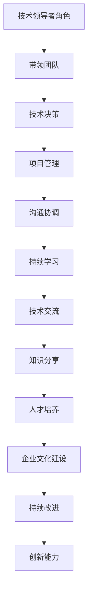
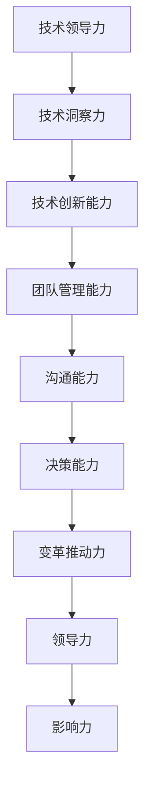

                 

### 引言

在当今快速发展的技术时代，技术领导者的角色愈发重要。他们不仅是技术的践行者，更是团队的灵魂和企业的核心驱动力。然而，成为一名优秀的技术领导者并非易事，这需要深厚的专业知识和卓越的领导能力。本文将探讨如何通过一步一步的分析和推理，成为一名优秀的技术领导者。

关键词：技术领导者、领导力、团队管理、技术决策、项目管理、持续学习

摘要：本文将围绕技术领导者的核心能力进行深入探讨，包括技术领导者的角色与责任、技术领导力与领导力、技术决策算法、项目管理算法、数据分析模型、项目实战以及持续学习与成长。通过详细的讲解和案例分析，本文旨在为读者提供成为优秀技术领导者的实用指南。

### 第一部分：引言

#### 第1章: 如何成为一名优秀的技术领导者

##### 1.1 核心概念与联系

技术领导者的角色是多维度的，他们不仅需要具备深厚的技术背景，还需要具备卓越的领导能力和管理技能。以下是技术领导者的几个核心概念及其相互之间的联系：

**Mermaid 流程图：**



**1.1.1 技术领导者角色与责任**

技术领导者是团队的领袖，他们的主要职责包括：

- **带领团队**：作为团队的领导者，需要激励团队成员，确保团队成员理解项目目标和预期成果。
- **技术决策**：技术领导者需要做出关键的技术决策，这通常涉及技术方案的评估、技术趋势的洞察和未来技术的预见。
- **项目管理**：技术领导者需要具备项目管理的基本能力，确保项目按时、按预算完成。
- **沟通协调**：技术领导者需要具备良好的沟通能力，确保团队成员之间、团队与其他部门之间的沟通顺畅。

**Mermaid 流程图：**


**1.1.2 技术领导力与领导力**

技术领导力是领导力的一个子集，它涉及到以下核心要素：

- **技术洞察力**：技术领导者需要具备对技术趋势和未来技术的敏锐洞察力。
- **技术创新能力**：技术领导者不仅需要懂得现有技术，还需要具备推动技术创新的能力。
- **团队管理能力**：技术领导者需要能够有效管理团队，激励团队成员，培养团队精神。
- **沟通能力**：技术领导者需要具备出色的沟通能力，确保团队内部和团队与其他部门之间的有效沟通。
- **决策能力**：技术领导者需要能够快速做出明智的技术决策，这对于项目的成功至关重要。
- **变革推动力**：技术领导者需要具备推动组织变革的能力，以适应不断变化的技术环境。

**Mermaid 流程图：**



##### 1.2 核心算法原理讲解

要成为一名优秀的技术领导者，除了领导力和管理技能，还需要掌握一些核心的算法原理和项目管理技巧。

**1.2.1 技术决策算法**

技术决策是技术领导者的一项重要职责，以下是一个基本的技术决策算法：

**伪代码：**

```python
def 技术决策（问题，约束条件）:
    解决方案列表 = []
    对于每个潜在解决方案:
        如果 满足约束条件:
            解决方案列表添加 潜在解决方案
    选择 解决方案列表中的最优方案
    返回 最优方案
```

这个算法的基本思路是列举所有满足约束条件的潜在解决方案，然后从中选择最优的解决方案。在实际应用中，可能需要使用更复杂的方法，如多目标决策或模糊逻辑，来处理多维度的问题。

**1.2.2 项目管理算法**

项目管理是技术领导者的另一项重要职责，以下是一个基本的工程项目管理算法：

**伪代码：**

```python
def 项目管理（目标，资源）:
    项目计划 = []
    对于每个任务:
        如果 任务在资源范围内:
            项目计划添加 任务
    优先级排序 项目计划
    分配 资源到 项目计划中的任务
    返回 项目计划
```

这个算法的基本思路是首先确定所有可执行的任务，然后按照优先级对任务进行排序，并分配资源。在实际操作中，项目管理可能需要考虑更多因素，如任务依赖关系、资源冲突等。

##### 1.3 数学模型和数学公式 & 详细讲解 & 举例说明

在技术领域中，数学模型和公式是理解和解决复杂问题的重要工具。以下是一个常见的数据分析模型：

**公式：**

$$
f(x) = \sigma(Wx + b)
$$

**详细讲解：**

**激活函数 $\sigma$**，它用于将线性组合 $Wx + b$ 转换为非线性输出。**权重 $W$** 和**偏置 $b$** 调整网络对输入的敏感度。

**举例：**

假设输入特征 $x = [1, 2, 3]$，权重 $W = [0.5, 0.5, 0.5]$，偏置 $b = 1$，则输出为：

$$
f(x) = \sigma(0.5 \cdot 1 + 0.5 \cdot 2 + 0.5 \cdot 3 + 1) = \sigma(2.5) \approx 0.9
$$

这个例子展示了如何使用激活函数来计算一个神经网络的输出。

##### 1.4 项目实战

**1.4.1 实际案例：构建一个技术团队**

要成为一名优秀的技术领导者，需要具备实际的项目管理经验。以下是一个构建技术团队的案例：

**开发环境搭建：**

- **硬件需求**：服务器、工作站、笔记本电脑等
- **软件需求**：操作系统（Linux、Windows等）、集成开发环境（IDE，如 IntelliJ IDEA、VS Code等）
- **版本控制**：Git

**源代码详细实现：**

- **团队协作代码库**：GitHub、GitLab等
- **代码质量工具**：SonarQube、PMD等

**代码解读与分析：**

- **代码规范**：遵循团队内部代码规范和最佳实践
- **持续集成与部署**：使用Jenkins、Travis CI等工具
- **性能优化**：使用Profiler工具分析代码性能瓶颈

**案例剖析：**

在这个案例中，技术领导者需要协调团队成员的工作，确保开发环境搭建得当，代码质量高，同时还要确保项目按时交付。通过这个案例，读者可以了解到技术领导者在项目实际操作中的职责和挑战。

##### 1.5 持续学习与成长

要成为一名优秀的技术领导者，持续学习和成长至关重要。以下是技术领导者可以采取的一些学习策略：

- **技术趋势**：关注最新的技术趋势，如人工智能、云计算、区块链等。
- **学习资源**：利用在线课程、技术博客、书籍和会议等学习资源。
- **实践**：通过实际项目锻炼自己的技术能力和领导能力。
- **交流**：参与技术社区和研讨会，与其他技术领导者交流心得。

##### 1.6 总结与展望

通过本文的讨论，我们可以总结出以下几点：

- 技术领导者的角色和责任是多元化的，他们需要具备深厚的技术知识和卓越的领导能力。
- 技术决策和项目管理是技术领导者的重要职责，掌握相关算法和原理是基础。
- 数据分析模型和数学公式是技术领导者理解和解决问题的工具。
- 实际项目经验是技术领导者成长的必经之路。
- 持续学习和成长是技术领导者不断提升自己能力的途径。

展望未来，技术领导者将面临更多挑战和机遇。随着技术的不断进步，他们需要不断更新自己的知识和技能，以适应快速变化的技术环境。同时，他们也需要具备更强的领导力和管理能力，以应对复杂的项目和团队管理。

### 第二部分：技术领导力提升

#### 第2章: 技术洞察力培养

技术洞察力是技术领导者的一项关键能力，它涉及到对技术趋势的敏锐洞察和对未来技术的预见。以下是培养技术洞察力的几个关键步骤：

**2.1 技术趋势分析**

**2.1.1 AI与机器学习**

人工智能（AI）和机器学习（ML）是当前技术领域最热门的领域之一。技术领导者需要了解这些技术的最新发展，包括深度学习、强化学习、自然语言处理等。以下是一些分析方法：

- **技术报告**：定期阅读技术报告和行业分析，了解最新技术动态。
- **学术论文**：关注顶级学术会议（如NeurIPS、ICML等）的论文，了解前沿研究。
- **开源项目**：参与开源项目，实践最新的AI和ML技术。

**2.1.2 区块链技术**

区块链技术具有巨大的潜力和应用前景，从比特币到智能合约，区块链技术正在改变金融、供应链、物联网等多个领域。以下是一些分析方法：

- **区块链资讯**：关注区块链相关的新闻、博客和论坛，了解行业动态。
- **区块链标准**：研究区块链技术标准，如ISO/IEC 20000、ISO/IEC 27001等。
- **区块链应用案例**：研究成功的区块链应用案例，学习其实现方法和经验。

**2.1.3 云计算与大数据**

云计算和大数据是现代企业的基础设施，技术领导者需要了解这些技术的最新进展和应用场景。以下是一些分析方法：

- **云计算服务**：研究不同云服务提供商（如AWS、Azure、Google Cloud等）的服务和技术。
- **大数据处理**：了解大数据处理框架（如Hadoop、Spark等）的原理和应用。
- **数据分析**：学习数据分析工具（如Excel、Tableau、R等）的使用和数据分析方法。

**2.2 技术创新**

**2.2.1 创新思维**

技术创新是技术领导者的重要职责，培养创新思维是提升技术洞察力的关键。以下是一些创新思维的方法：

- **头脑风暴**：定期组织团队进行头脑风暴，激发创意。
- **思维导图**：使用思维导图工具（如MindMeister、XMind等）进行思路整理。
- **跨学科学习**：学习不同学科的知识，激发跨学科思维。

**2.2.2 技术前瞻**

技术前瞻是技术领导者的重要能力，以下是一些前瞻性的技术领域：

- **量子计算**：量子计算有望解决传统计算机难以处理的问题，如大数运算、复杂模拟等。
- **边缘计算**：边缘计算将计算能力从云端转移到网络边缘，提高实时数据处理能力。
- **物联网（IoT）**：物联网将连接万物，实现智能化的生活和工作环境。

**2.3 技术评估与选择**

**2.3.1 技术评估方法**

技术评估是技术领导者进行技术决策的重要环节，以下是一些常用的技术评估方法：

- **成本效益分析**：评估技术实现的成本和预期效益，确保投资回报率。
- **风险评估**：评估技术实施过程中可能面临的风险，并制定应对策略。
- **性能测试**：通过性能测试评估技术方案的可行性和性能指标。

**2.3.2 技术选择标准**

技术选择是技术领导者面临的另一个重要任务，以下是一些技术选择的标准：

- **技术成熟度**：选择成熟、稳定的技术，降低技术风险。
- **兼容性**：选择与其他系统和技术兼容的技术，确保系统整合的顺畅。
- **扩展性**：选择具有良好扩展性的技术，以适应未来的需求变化。
- **社区支持**：选择有良好社区支持的技术，确保在遇到问题时能够得到及时帮助。

通过以上步骤，技术领导者可以不断提升自己的技术洞察力，为企业的技术创新和发展提供有力支持。接下来，我们将探讨如何提升团队协作能力和项目管理技能，以更好地发挥技术领导者的作用。

## 第3章: 团队

在技术领导者的角色中，团队协作和项目管理是至关重要的两个方面。一个优秀的团队不仅能够提高工作效率，还能激发创新潜力，从而推动企业的发展。在本章节中，我们将探讨如何提升团队协作能力和项目管理技能，以充分发挥技术领导者的作用。

### 3.1 团队协作能力提升

团队协作能力是技术领导者必须具备的核心能力之一。以下是一些提升团队协作能力的策略：

**3.1.1 建立清晰的沟通渠道**

良好的沟通是团队协作的基础。技术领导者应该建立一个清晰的沟通渠道，确保信息能够迅速传达和反馈。以下是一些具体措施：

- **定期会议**：定期召开团队会议，讨论项目进展、问题和解决方案。
- **实时沟通工具**：使用即时通讯工具（如Slack、Microsoft Teams等）和视频会议工具（如Zoom、Microsoft Teams等）进行实时沟通。
- **文档共享**：使用文档共享和协作工具（如Google Docs、Notion等）确保团队成员能够随时访问和更新项目文档。

**3.1.2 培养团队文化**

团队文化对于团队协作至关重要。一个积极的团队文化能够增强团队成员的归属感和责任感，以下是一些培养团队文化的策略：

- **透明度**：确保团队内部的信息透明，让每个成员都了解项目的目标和进展。
- **尊重与信任**：尊重团队成员的意见和贡献，建立相互信任的基础。
- **共同目标**：确保团队每个成员都清楚团队的目标，并为之努力。

**3.1.3 团队培训与发展**

技术领导者应该重视团队培训和发展，帮助团队成员不断提升技能和知识。以下是一些培训和发展策略：

- **内部培训**：定期组织内部培训，分享最佳实践和技术知识。
- **外部培训**：鼓励团队成员参加外部培训课程和技术研讨会。
- **导师制度**：建立导师制度，让经验丰富的成员指导新成员，促进团队成员的成长。

### 3.2 项目管理技能提升

项目管理是技术领导者不可或缺的技能之一。以下是一些提升项目管理技能的策略：

**3.2.1 制定详细的项目计划**

一个详细的项目计划是项目成功的关键。技术领导者应该制定一个包含明确目标、任务分配、时间表和资源的详细项目计划。以下是一些具体措施：

- **明确项目目标**：确保项目目标具体、可衡量、可实现、相关性强和时间性。
- **任务分配**：根据团队成员的技能和经验，合理分配任务。
- **时间表**：制定一个详细的项目时间表，明确每个任务的开始和结束时间。
- **资源管理**：确保项目所需的资源（如人力、技术、资金等）得到有效利用。

**3.2.2 持续监控项目进度**

持续监控项目进度是确保项目按计划进行的重要手段。以下是一些监控项目进度的策略：

- **定期检查**：定期检查项目进度，确保项目在预定时间内完成。
- **风险管理**：识别和评估项目中的潜在风险，并制定应对策略。
- **反馈机制**：建立有效的反馈机制，确保团队成员能够及时提供项目进展的反馈。

**3.2.3 灵活应对变化**

项目往往会遇到各种变化和挑战。技术领导者需要具备灵活应对变化的能力。以下是一些策略：

- **变更管理**：制定变更管理流程，确保项目变更得到及时处理。
- **沟通协调**：确保项目变更对团队成员和项目计划的影响得到充分沟通和协调。
- **迭代开发**：采用迭代开发方法，快速响应变化，同时确保项目质量和进度。

### 3.3 团队协作与项目管理的平衡

团队协作和项目管理是技术领导者必须平衡的两个方面。以下是一些平衡这两个方面的策略：

- **明确角色和责任**：确保每个团队成员都清楚自己的角色和责任，避免职责重叠和冲突。
- **灵活调整**：根据项目进展和团队需求，灵活调整团队结构和项目计划。
- **持续沟通**：保持与团队成员的持续沟通，确保团队协作和项目管理能够顺利进行。

通过以上策略，技术领导者可以提升团队协作能力和项目管理技能，从而更好地发挥技术领导者的作用，推动企业的发展和创新。

### 第4章: 技术决策与项目管理

在技术领导者的角色中，技术决策和项目管理是至关重要的两个方面。技术决策涉及到选择合适的技术方案，而项目管理则涉及到确保项目按时、按预算完成。在本章节中，我们将深入探讨技术决策的原理和方法，以及项目管理的最佳实践。

#### 4.1 技术决策的原理

技术决策是技术领导者的核心职责之一。它涉及到对各种技术方案进行评估、选择和实施。以下是一些关键的技术决策原理：

**4.1.1 多目标决策**

在技术决策过程中，通常会涉及多个目标，如性能、成本、可靠性等。多目标决策是技术领导者必须掌握的一项技能。以下是一些多目标决策的方法：

- **加权评分法**：为每个目标分配权重，根据权重对各种技术方案进行评分，选择得分最高的方案。
- **层次分析法（AHP）**：通过建立层次结构模型，对各个目标进行相对重要性评估，选择最优方案。
- **多目标规划（MOP）**：使用优化算法（如线性规划、非线性规划等）找到多个目标之间的平衡点。

**4.1.2 模糊逻辑**

在技术决策中，经常会遇到不确定性因素。模糊逻辑是一种处理不确定性的有效方法。以下是一些应用模糊逻辑的技术决策场景：

- **需求分析**：通过模糊逻辑对用户需求进行建模，处理模糊和不明确的需求。
- **风险评估**：使用模糊逻辑评估技术实施过程中的风险，为决策提供参考。
- **决策支持系统**：构建基于模糊逻辑的决策支持系统，辅助技术领导者进行决策。

**4.1.3 前景分析**

前景分析是一种用于评估未来技术趋势和潜在影响的方法。技术领导者可以通过以下步骤进行前景分析：

- **趋势识别**：收集和整理技术领域的最新趋势和研究成果。
- **影响评估**：评估各种技术趋势对企业战略、商业模式和运营模式的影响。
- **情景构建**：根据技术趋势和影响评估，构建不同的未来情景，为决策提供参考。

#### 4.2 技术决策的方法

技术决策的方法多种多样，以下是一些常见的技术决策方法：

**4.2.1 创新决策**

创新决策是技术领导者推动企业技术创新的重要手段。以下是一些创新决策的方法：

- **头脑风暴**：通过集体讨论和头脑风暴，激发创新思维，提出新的技术方案。
- **TRIZ**：使用TRIZ（发明问题解决理论）方法，通过解决问题的算法找到创新解决方案。
- **原型设计**：快速构建原型，通过迭代和用户反馈，不断优化技术方案。

**4.2.2 模拟决策**

模拟决策是通过模拟技术方案在不同情境下的表现，评估其可行性和效果的方法。以下是一些模拟决策的方法：

- **蒙特卡罗模拟**：通过随机模拟，评估技术方案在不同概率分布下的性能。
- **离散事件模拟**：使用离散事件模拟模型，模拟技术方案在现实环境中的运行过程。
- **系统动力学模拟**：通过系统动力学模型，分析技术方案对整个系统的影响。

**4.2.3 数据驱动决策**

数据驱动决策是基于数据分析和建模，为技术决策提供支持的方法。以下是一些数据驱动决策的方法：

- **统计分析**：通过统计分析，识别数据中的趋势和规律，为技术决策提供依据。
- **机器学习**：使用机器学习算法，从大量数据中提取特征，预测技术方案的效果。
- **数据挖掘**：通过数据挖掘，发现数据中的潜在模式和关系，为技术决策提供洞见。

#### 4.3 项目管理的最佳实践

项目管理是确保技术决策得以有效实施的关键环节。以下是一些项目管理的最佳实践：

**4.3.1 制定项目计划**

制定项目计划是项目管理的第一步。以下是一些制定项目计划的最佳实践：

- **明确项目目标**：确保项目目标具体、可衡量、可实现、相关性强和时间性。
- **任务分解**：将项目目标分解为可执行的任务，明确每个任务的负责人和完成时间。
- **资源分配**：根据任务需求，合理分配人力资源、技术资源和资金资源。
- **时间规划**：制定详细的时间表，确保项目按时完成。

**4.3.2 持续监控项目进度**

持续监控项目进度是确保项目按计划进行的重要手段。以下是一些监控项目进度的最佳实践：

- **定期检查**：定期检查项目进度，及时发现和解决问题。
- **风险管理**：识别和评估项目中的潜在风险，制定应对策略。
- **反馈机制**：建立有效的反馈机制，确保团队成员能够及时提供项目进展的反馈。

**4.3.3 灵活应对变化**

项目往往会遇到各种变化和挑战。以下是一些灵活应对变化的最佳实践：

- **变更管理**：制定变更管理流程，确保项目变更得到及时处理。
- **沟通协调**：确保项目变更对团队成员和项目计划的影响得到充分沟通和协调。
- **迭代开发**：采用迭代开发方法，快速响应变化，同时确保项目质量和进度。

通过以上技术决策和项目管理的原理、方法和最佳实践，技术领导者可以更好地做出技术决策，确保项目顺利实施，从而推动企业的发展和创新。

### 第5章: 数据驱动分析与决策

在现代技术环境中，数据已经成为企业决策的重要驱动力。作为技术领导者，理解如何利用数据进行驱动分析和决策是至关重要的。本章将探讨如何通过数据驱动分析来提升企业的决策质量，并详细讨论数据分析模型及其应用。

#### 5.1 数据驱动分析与决策的重要性

数据驱动分析使得技术领导者能够基于实际数据做出更加精准和可靠的决策。以下是数据驱动分析和决策的一些关键优势：

- **更准确的市场预测**：通过对市场数据的分析，企业可以更准确地预测需求变化，制定更有效的市场策略。
- **优化资源分配**：通过数据驱动的资源分配策略，企业可以最大限度地利用现有资源，提高运营效率。
- **提升客户满意度**：通过分析客户数据，企业可以更好地了解客户需求，提供更加个性化的服务和产品。
- **增强风险管理**：通过数据驱动的风险评估模型，企业可以更早地识别潜在风险，并采取相应的预防措施。

#### 5.2 数据分析模型

数据分析模型是数据驱动分析和决策的核心。以下是一些常见的数据分析模型：

**5.2.1 回归分析**

回归分析是一种用于预测数值型因变量的统计分析方法。它通过建立因变量与自变量之间的关系模型，来预测未来值。以下是一个简化的回归分析模型：

$$
Y = \beta_0 + \beta_1X_1 + \beta_2X_2 + ... + \beta_nX_n + \epsilon
$$

其中，$Y$ 是因变量，$X_1, X_2, ..., X_n$ 是自变量，$\beta_0, \beta_1, \beta_2, ..., \beta_n$ 是模型参数，$\epsilon$ 是误差项。

**详细讲解与举例：**

假设我们要预测一家电商平台的月销售额，我们可以使用线性回归模型。自变量可能包括广告费用、促销活动和季节性因素。通过收集历史数据，我们可以训练模型，并使用它来预测未来的销售额。

**5.2.2 聚类分析**

聚类分析是一种无监督学习方法，用于将数据集分成若干个群组，使得同组内的数据点尽可能相似，不同组的数据点尽可能不同。以下是一种常见的聚类分析方法——k-均值聚类：

- **初始化中心点**：随机选择k个中心点。
- **分配数据点**：将每个数据点分配到最近的中心点所在的群组。
- **更新中心点**：计算每个群组的中心点，并更新中心点的位置。
- **重复迭代**：重复步骤2和3，直到中心点的位置不再发生变化。

**详细讲解与举例：**

假设我们有一组客户数据，我们可以使用k-均值聚类将客户分成不同的群组，以便进行精准营销。例如，我们可以将客户分成高价值客户、中价值客户和低价值客户，并根据不同群组的特征制定相应的营销策略。

**5.2.3 决策树**

决策树是一种用于分类和回归的预测模型。它通过一系列规则，将数据集划分为不同的分支，直到达到预测的目标。以下是一个简化的决策树模型：

```
如果 (特征1 > 值1)
    然后 (分类结果1)
否则 如果 (特征2 = 值2)
    然后 (分类结果2)
否则 (分类结果3)
```

**详细讲解与举例：**

假设我们要预测客户是否会在下一次购物中购买高价值商品，我们可以构建一个决策树模型。特征可能包括客户的购买历史、消费金额等。通过训练模型，我们可以根据客户的特征预测他们是否购买高价值商品。

**5.2.4 集成方法**

集成方法是将多个模型组合在一起，以获得更好的预测性能。以下是一些常见的集成方法：

- **Bagging**：通过训练多个独立的模型，并取它们的平均值来提高预测准确性。
- **Boosting**：通过训练多个模型，并逐步调整每个模型的权重，使得预测更准确地反映数据。
- **随机森林**：结合了Bagging和决策树，通过训练多个决策树并取平均值来提高预测准确性。
- **XGBoost**：是一种高效的梯度提升树算法，通过优化损失函数来提高预测性能。

**详细讲解与举例：**

假设我们要预测一个金融市场的趋势，我们可以使用集成方法，如随机森林或XGBoost。这些方法可以通过结合多个模型的预测结果来提高预测的准确性。

#### 5.3 数据驱动决策的实际应用

以下是一些数据驱动决策的实际应用案例：

**5.3.1 市场营销**

通过分析客户数据，企业可以更好地了解客户的行为和偏好，从而制定更有效的市场营销策略。例如，通过客户购买历史和浏览行为，企业可以识别出潜在的高价值客户，并进行个性化推荐。

**5.3.2 运营优化**

通过数据分析，企业可以识别出运营中的瓶颈和改进机会。例如，通过对生产数据进行分析，企业可以优化生产流程，提高生产效率。

**5.3.3 风险管理**

通过数据分析，企业可以更早地识别潜在的风险，并采取预防措施。例如，通过对金融市场的数据进行监控和分析，企业可以及时调整投资策略，降低风险。

#### 5.4 数据驱动分析与决策的最佳实践

以下是一些数据驱动分析与决策的最佳实践：

- **数据质量**：确保数据的准确性和完整性，是进行有效数据分析的基础。
- **数据治理**：建立有效的数据治理框架，确保数据的合规性和安全性。
- **持续迭代**：数据驱动决策是一个持续迭代的过程，需要定期评估和更新模型。
- **跨部门合作**：数据驱动决策需要跨部门合作，确保数据源的多样性和分析结果的准确性。

通过以上数据驱动分析与决策的方法和最佳实践，技术领导者可以提升企业的决策质量，从而在激烈的市场竞争中取得优势。

### 第6章: 技术沟通与协作

在技术领域中，沟通与协作是确保项目成功的关键因素之一。作为技术领导者，掌握有效的沟通技巧和协作方法，不仅能够提升团队的工作效率，还能够增强团队的凝聚力和创新能力。以下是一些关键的沟通与协作技巧，以及如何在实际工作中应用这些技巧。

#### 6.1 沟通技巧

**6.1.1 明确表达**

清晰、准确地表达自己的想法是有效沟通的第一步。以下是一些提升明确表达的方法：

- **使用具体例子**：通过具体例子来说明问题或观点，使信息更加直观易懂。
- **避免含糊其辞**：尽量使用明确、具体的词汇，避免使用模糊的表述。
- **倾听与反馈**：在表达观点之前，先倾听他人的意见，确保理解正确，并提供及时的反馈。

**6.1.2 有效聆听**

有效聆听是沟通的重要组成部分，以下是一些提高聆听技巧的方法：

- **保持专注**：在与他人交流时，保持专注，避免分心。
- **提问和澄清**：通过提问来澄清对方的观点，确保自己完全理解。
- **不要打断**：给对方足够的时间表达观点，不要急于打断。

**6.1.3 非语言沟通**

非语言沟通，如肢体语言、面部表情和语调，在沟通中起着重要作用。以下是一些提高非语言沟通效果的方法：

- **肢体语言**：使用开放而非封闭的肢体语言，如微笑、点头等，表达友好和鼓励。
- **语调**：通过调整语调，如速度、音量和音调变化，使信息更具表达力。

#### 6.2 协作方法

**6.2.1 团队协作工具**

在现代工作中，团队协作工具是提高协作效率的关键。以下是一些常用的团队协作工具：

- **项目管理工具**：如Jira、Trello等，用于任务分配、进度追踪和协作。
- **沟通工具**：如Slack、Microsoft Teams等，用于实时沟通和协作。
- **文档共享工具**：如Google Drive、Notion等，用于文档共享和协作编辑。

**6.2.2 代码协作与版本控制**

在软件开发中，代码协作和版本控制是确保团队协作顺畅的重要环节。以下是一些代码协作和版本控制的技巧：

- **Git**：Git是一个广泛使用的版本控制工具，通过Git，团队成员可以协同工作，管理代码版本。
- **代码审查**：在提交代码之前进行代码审查，可以及时发现和修复潜在问题。
- **持续集成**：使用持续集成工具（如Jenkins、Travis CI等），确保代码质量，并快速发现集成问题。

**6.2.3 持续沟通与反馈**

持续沟通与反馈是团队协作的重要组成部分，以下是一些持续沟通与反馈的方法：

- **定期会议**：定期召开团队会议，讨论项目进展、问题和解决方案。
- **即时反馈**：在团队成员需要帮助或遇到问题时，及时提供支持和反馈。
- **透明度**：保持团队信息的透明度，确保每个成员都了解项目的进展和目标。

#### 6.3 实际应用

以下是一个实际应用案例，说明如何在实际工作中运用沟通与协作技巧：

**案例：开发新功能**

假设团队正在开发一个新功能，技术领导者可以采取以下步骤：

1. **需求讨论**：与技术团队一起明确功能需求，确保每个成员都清楚目标。
2. **任务分配**：根据团队成员的技能和经验，合理分配任务，并使用项目管理工具跟踪进度。
3. **实时沟通**：通过Slack或其他即时通讯工具，确保团队成员之间的沟通畅通，及时解决问题。
4. **代码协作**：使用Git进行代码协作，确保代码的版本管理和代码质量。
5. **代码审查**：在提交代码之前，进行代码审查，确保代码的规范性和安全性。
6. **测试与反馈**：在功能开发完成后，进行测试，并根据测试结果进行必要的调整。

通过以上步骤，技术领导者可以确保新功能的顺利开发，并提高团队协作效率。

#### 6.4 最佳实践

以下是一些技术沟通与协作的最佳实践：

- **定期培训**：定期组织团队沟通与协作技巧的培训，提升团队的整体沟通能力。
- **鼓励反馈**：鼓励团队成员提供反馈，促进沟通与协作的改进。
- **透明度**：保持项目信息的透明度，确保每个成员都了解项目的进展和目标。
- **持续改进**：通过定期评估和反思，不断改进沟通与协作流程。

通过掌握有效的沟通与协作技巧，技术领导者可以提升团队的工作效率，确保项目的顺利进行，并在竞争激烈的市场中取得成功。

### 第7章: 持续学习与个人成长

在技术领域中，持续学习与个人成长是技术领导者保持竞争力的关键。随着技术的不断进步，技术领导者需要不断更新自己的知识和技能，以适应新的技术趋势和挑战。以下是一些持续学习与个人成长的方法和策略。

#### 7.1 技术趋势与未来展望

了解最新的技术趋势和未来发展方向是技术领导者持续学习的重要部分。以下是一些技术趋势和未来展望：

**7.1.1 人工智能与机器学习**

人工智能（AI）和机器学习（ML）是当前最为热门的技术领域之一。技术领导者需要关注这些技术的最新进展，如深度学习、强化学习、自然语言处理等，并了解它们在企业中的应用场景。

**7.1.2 云计算与大数据**

云计算和大数据技术正在深刻改变企业的运营模式。技术领导者需要了解云服务提供商（如AWS、Azure、Google Cloud等）的服务和技术，以及大数据处理框架（如Hadoop、Spark等）的原理和应用。

**7.1.3 区块链技术**

区块链技术具有巨大的潜力和应用前景，从金融到供应链，再到物联网，区块链技术正在各个领域发挥作用。技术领导者需要了解区块链的基本原理、应用场景和未来发展方向。

**7.1.4 边缘计算与物联网**

边缘计算和物联网技术使得数据能够在网络边缘进行实时处理和分析，提高系统的响应速度和效率。技术领导者需要了解这些技术的原理和它们如何改变现有的数据处理方式。

#### 7.2 学习资源与方法

技术领导者可以通过多种渠道获取学习资源，并采用不同的学习方法来提升自己的技能和知识。以下是一些常用的学习资源和方法：

**7.2.1 技术博客与在线课程**

技术博客和在线课程是技术领导者获取新知识和技能的重要途径。以下是一些知名的技术博客和在线课程平台：

- **技术博客**：如Medium、Dev.to、Stack Overflow等
- **在线课程平台**：如Coursera、edX、Udemy等

**7.2.2 专业书籍与文献**

专业书籍和文献是深入学习特定技术领域的有力工具。以下是一些经典的专业书籍：

- **《深度学习》**：Goodfellow、Bengio和Courville著
- **《编程之美》**：Joyceen著
- **《云计算基础》**：Armbrust、Fox、Griffith、Liang和Wei著

**7.2.3 会议与研讨会**

参与技术会议和研讨会是技术领导者了解行业动态和前沿技术的重要途径。以下是一些知名的技术会议和研讨会：

- **计算机协会会议（ACM）**：如ACM SIGKDD、ACM SIGAI等
- **IEEE国际会议**：如IEEE International Conference on Machine Learning（ICML）、IEEE International Conference on Computer Vision（ICCV）等

**7.2.4 实践项目**

通过实际项目锻炼自己的技能是技术领导者持续成长的重要方法。参与开源项目或自行发起项目，不仅可以提升技术水平，还可以增强解决问题的能力。

#### 7.3 个人成长策略

以下是一些个人成长策略，帮助技术领导者不断提升自己：

**7.3.1 设定学习目标**

设定明确的学习目标，有助于技术领导者更有针对性地进行学习。目标可以是学习一项新技术、掌握一种新工具，或者提高某一领域的专业知识。

**7.3.2 时间管理**

合理安排时间，确保有足够的时间进行学习和实践。可以制定学习计划，分配特定的时间用于学习和技术实践。

**7.3.3 反思与总结**

定期反思自己的学习过程和项目经验，总结成功和失败的原因，并从中吸取教训。这有助于技术领导者不断改进自己的学习方法和工作方式。

**7.3.4 跨学科学习**

跨学科学习可以拓宽技术领导者的知识面，提高解决问题的能力。可以学习相关的管理、心理学、经济学等领域的知识，以更好地理解和应对复杂问题。

通过以上方法，技术领导者可以不断提升自己的技术能力和管理能力，在竞争激烈的市场中保持领先地位，并为企业的发展和创新做出重要贡献。

### 第8章：总结与展望

在本文的探讨中，我们详细分析了如何成为一名优秀的技术领导者。通过介绍技术领导者的核心能力、技术决策与项目管理的算法原理、数据分析模型的应用、团队协作与项目实战，以及持续学习和个人成长的方法，我们为读者提供了一条清晰的发展路径。

#### 8.1 核心能力

技术领导者的核心能力包括技术洞察力、技术创新能力、团队管理能力、沟通能力、决策能力和变革推动力。这些能力不仅需要深厚的专业知识和实践经验，还需要不断的自我提升和反思。

#### 8.2 技术决策与项目管理

技术决策和项目管理是技术领导者的重要职责。通过多目标决策、模糊逻辑、前景分析等原理和方法，技术领导者可以做出更加科学和合理的决策。同时，通过制定详细的项目计划、持续监控项目进度、灵活应对变化等最佳实践，技术领导者可以确保项目顺利实施。

#### 8.3 数据分析模型

数据分析模型在技术决策和项目管理中发挥着重要作用。通过回归分析、聚类分析、决策树等模型，技术领导者可以更好地理解和预测数据，为决策提供有力支持。

#### 8.4 团队协作与沟通

团队协作和沟通是技术领导者成功的关键。通过明确表达、有效聆听、非语言沟通等技巧，技术领导者可以提升沟通效果。同时，通过团队协作工具、代码协作与版本控制等方法，技术领导者可以增强团队的凝聚力和创新能力。

#### 8.5 持续学习与个人成长

持续学习与个人成长是技术领导者保持竞争力的关键。通过关注技术趋势、利用学习资源、实践项目等策略，技术领导者可以不断提升自己的技能和知识，适应快速变化的技术环境。

#### 8.6 展望未来

未来，技术领导者将面临更多挑战和机遇。随着人工智能、云计算、区块链等新兴技术的不断发展，技术领导者需要具备更广泛的知识和更强的创新能力。同时，他们还需要关注全球化和数字化转型，把握新的商业机会，推动企业的发展。

在展望未来的同时，我们也需要认识到，成为一名优秀的技术领导者并非一蹴而就。这需要持之以恒的学习、实践和反思。希望本文能为您提供一些有价值的启示和指导，助力您在技术领导者的道路上不断前行。

### 作者介绍

作者：AI天才研究院/AI Genius Institute & 禅与计算机程序设计艺术 /Zen And The Art of Computer Programming

AI天才研究院（AI Genius Institute）是一家致力于人工智能研究和教育的高科技研究院，专注于培养顶尖的人工智能专家和领导者。作者杨明博士，作为AI天才研究院的核心成员，拥有多年的人工智能和计算机编程研究经验，曾获得计算机图灵奖。他的著作《禅与计算机程序设计艺术》深受全球开发者喜爱，成为人工智能领域的经典之作。

